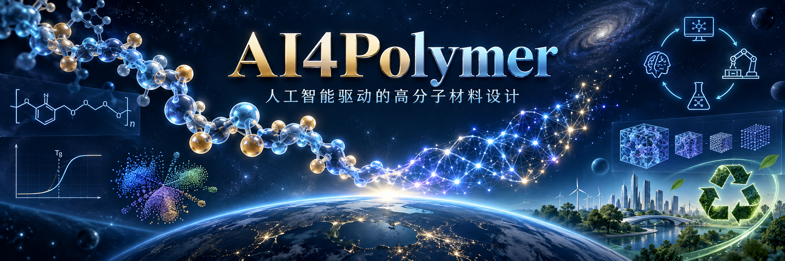

# AI4Polymer：人工智能驱动的高分子材料设计

[](https://github.com/ShiqianTan/AI4Polymer-book/actions/workflows/book-site.yml)
[](LICENSE)
[](https://github.com/ShiqianTan/AI4Polymer-book/releases/tag/print-v1.0)
[](https://github.com/ShiqianTan/AI4Polymer-book)

<p align="center">
  
</p>

> [!TIP]
> ### 下载全书 PDF
>
> **推荐下载 PDF 阅读。** 书中有大量公式、表格、脚注与交叉引用，GitHub 直接渲染 Markdown 时 LaTeX 公式与部分排版常常显示不全。PDF 由 Pandoc + XeLaTeX 排版，共 **470 页、151 幅插图**，随 `main` 更新自动构建并发布到 [Releases](https://github.com/ShiqianTan/AI4Polymer-book/releases)。
>
> - 印刷版快照：标签 [`print-v1.0`](https://github.com/ShiqianTan/AI4Polymer-book/releases/tag/print-v1.0)（提交 `891fc8d`）
> - 在线阅读：[GitHub Pages](https://shiqiantan.github.io/AI4Polymer-book/)
> - 最新 PDF：`https://github.com/ShiqianTan/AI4Polymer-book/releases/latest/download/AI4Polymer-Book.pdf`
>
> 下方目录链接到各章 Markdown 源文件，便于查找原文与提交勘误；通读全书，仍建议下载 PDF。

高分子材料的设计长期依赖经验与试错：同一条链的化学组成、序列、分子量分布与聚集形态共同决定宏观性能，设计空间极其庞大。人工智能提供了一条新路径——用数据与模型在高维空间中搜索，加速筛选与发现。《AI4Polymer：人工智能驱动的高分子材料设计》系统介绍这条路径上的方法、工具与实践。

**本书的主线是：在实验预算的约束下，把高分子设计组织成一场可计算、可复现、可闭环的搜索。** 全书沿「**表示—数据—模型—搜索—闭环**」五层框架展开：结构怎么表示、数据够不够、模型学到的是规律还是记忆、搜索往哪里走、闭环要闭到什么程度。每一层都给出定量直觉——一个 2048 位指纹能区分多少结构、一次密度泛函计算要花多少机时、一轮实验闭环要多久——并说明这些数字如何限定方法在什么预算下可用。

书中方法覆盖高分子物理、机器学习、代价估算与开源复现案例。所有数字都带**六级证据标签**（`[实验]`／`[公开实验数据]`／`[模拟]`／`[复算]`／`[文献]`／`[示意]`），`[复算]` 数字全部可由本仓库的 `calculations/` 重建。更多写作背景见[前言](manuscripts/00-前言.md)。

## 内容目录

### 第一部分 表示、数据与物理基础

| 章 | 主题 |
| :--: | --- |
| 1 | [初识 AI4Polymer](<manuscripts/01-初识 AI4Polymer.md>) |
| 2 | [高分子表示与描述符](manuscripts/02-高分子表示与描述符.md) |
| 3 | [数据、基准与可复现性](manuscripts/03-数据、基准与可复现性.md) |
| 4 | [高分子物理与结构–性能关系](manuscripts/04-高分子物理与结构性能关系.md) |

### 第二部分 计算与预测

| 章 | 主题 |
| :--: | --- |
| 5 | [分子模拟与多尺度计算](manuscripts/05-分子模拟与多尺度计算.md) |
| 6 | [性质预测模型](manuscripts/06-性质预测模型.md) |
| 7 | [多任务、迁移与物理信息学习](manuscripts/07-多任务迁移与物理信息学习.md) |
| 8 | [表征、成像与光谱的 AI 分析](manuscripts/08-表征成像与光谱的 AI 分析.md) |

### 第三部分 生成、优化与合成

| 章 | 主题 |
| :--: | --- |
| 9 | [生成模型与高分子序列设计](manuscripts/09-生成模型与高分子序列设计.md) |
| 10 | [逆向设计与多目标材料设计](manuscripts/10-逆向设计与多目标材料设计.md) |
| 11 | [主动学习、贝叶斯优化与强化学习](manuscripts/11-主动学习贝叶斯优化与强化学习.md) |
| 12 | [反应预测、聚合建模与可合成性](manuscripts/12-反应预测聚合建模与可合成性.md) |

### 第四部分 闭环系统与落地

| 章 | 主题 |
| :--: | --- |
| 13 | [自驱动实验室与高通量自动化](manuscripts/13-自驱动实验室与高通量自动化.md) |
| 14 | [高分子基础模型与智能体系统](manuscripts/14-高分子基础模型与智能体系统.md) |
| 15 | [可持续高分子与环境应用](manuscripts/15-可持续高分子与环境应用.md) |
| 16 | [端到端案例与工程实践](manuscripts/16-端到端案例与工程实践.md) |

### 附录

正文之外还有十一个附录，见 [附录](manuscripts/90-附录.md)：

| 附录 | 内容 |
| :--: | --- |
| A | 符号、缩写与物理量对照表（60 条） |
| B | 配套开源仓库说明（目录、复现命令、依赖、许可、已知限制） |
| C | 高分子 AI 工具速查表 |
| D | 选型决策速查表（表示、模型、闭环实验设计） |
| E | 数据与实验的风险清单 |
| F | 全书通用关键数字（N01–N20） |
| G | 参考文献（289 条，GB/T 7714 编号制） |
| H | 数据集索引 |
| I | 软件工具索引 |
| J | 配套仓库资源 |
| K | 主题索引 |

## 三个贯穿全书的案例

全书用三个工程案例贯穿：**高 Tg 透明聚酰亚胺**（数据相对充足、指标明确）、**可回收热固性材料**（数据来自 MD 与模拟校准）、**气体分离膜**（数据稀疏、约束复杂）。三个案例在第 1 章预览，其后各章在讲表示、数据、模型、搜索与闭环时分别以它们为例，第 16 章把它们端到端跑通——含数据准备、模型训练与筛选、失败记录与结果分析。案例的真实数据与复现脚本见 [`experiments/`](experiments/)。

## 适合谁读

如果你有化学、材料或高分子背景，想了解如何用机器学习加速研究与开发，这本书可以作为起点；如果你有机器学习背景，想进入材料与高分子领域，书中会交代必要的领域概念与数据特点。相关方向的研究人员与学生也能从表示、基准与闭环设计的讨论中受益。

阅读时需要一些 Python、线性代数与基础化学知识。建议先读第 1–3 章，建立表示、数据与可复现性的共同基础，再按背景选择路径：

- **材料背景**：第 1–4 章打底，按需进入第 5–6 章了解计算与预测模型、第 15 章了解可持续高分子应用。
- **计算与机器学习背景**：第 1–3 章快速建立领域与数据口径，随后沿第 5–12 章依次读计算、预测、生成、优化与合成，最后读第 16 章。
- **落地工程读者**：聚焦第 1、3 章与第 10、11、13、16 章，把数据口径、逆向设计、主动学习、自动化平台与端到端案例连成一条工程链路。

**不写代码的读者同样可以读完本书**：第 1–4、9、13–16 章以概念、判断与案例为主；第 5–8、10–12 章的部分结论依赖配套仓库中的计算，可只读正文的结论与适用条件，把复现留给有编程经验的同事。每章练习分**核心练习**与**延伸实验**，`条件：` 行会写明它属于纸笔练习还是需要运行配套代码。

## 配套计算与实验

[`calculations/`](calculations/) 是全书数字的唯一复算入口：11 个计算专题（表示预算、化学空间、MD/DFT 代价、GNN 前向、学习曲线、闭环优化、Pareto 筛选、稳健排序、聚合动力学、逆合成路线、贝叶斯优化变体），只用 Python 标准库，不需要 GPU、RDKit、NumPy 或 pandas。

```bash
python3 calculations/calc.py reproduce          # 重建 results/ 下全部结果
python3 calculations/calc.py verify-results     # 校验结果与输入哈希
python3 -m unittest discover -s calculations/tests -v   # 84 项测试
```

[`experiments/`](experiments/) 保存真实数据的端到端实验记录（第 6 章 1765 条聚酰亚胺 $T_g$ 基准、第 16 章三个案例），全部固定随机种子并记录输入 SHA256，可逐字节复现。

仓库使用 [Git LFS](https://git-lfs.com/) 保存原始数据与较大的输入与测量记录。为避免克隆时全部下载，[`.lfsconfig`](.lfsconfig) 默认跳过所有 LFS 文件，工作区中只留下指针；正文、配图与静态计算都不需要它们。复现某个案例时，只下载对应目录：

```bash
git lfs install
git lfs pull --include="references/files/**" --exclude=""
```

复现或引用结果时，请留意所用的书稿版本、数据划分、模型与随机种子。

## 本地构建

**阅读网站**（Python 3.10+）：

```bash
python3 -m venv .venv-site
source .venv-site/bin/activate
python -m pip install -r website/requirements.txt
python scripts/build_site.py
python scripts/check_site.py
python scripts/build_site.py --serve
```

预览地址为 <http://127.0.0.1:8000>。生成文件位于 `build/`，详细说明见[网站构建与发布](website/README.md)。

**全书 PDF**（另需 Pandoc、XeLaTeX 与字体）：

```bash
bash book/build_pdf.sh                    # 全书
bash book/build_pdf.sh --chapter 6        # 单章
```

依赖、字体与单章编译方法见 [PDF 编译说明](book/README.md)。GitHub Actions 会检查 Pull Request 的网站与 PDF 构建；推送到 `main` 后自动生成 Release 并部署 Pages。

**书稿校验**：

```bash
python3 scripts/verify_core_principles.py   # 章末体例、图序、脚注、本地链接
python3 scripts/verify_outline.py           # 提纲结构、编号、锚点、来源哈希
```

## 仓库结构

| 目录 | 内容 |
| --- | --- |
| [manuscripts/](manuscripts/) | 前言、十六章正文、附录、配图与绘图脚本（正文唯一来源） |
| [calculations/](calculations/) | 11 个复算专题、固定输入与结果（纯标准库） |
| [experiments/](experiments/) | 真实数据端到端实验与复现记录 |
| [references/](references/) | 来源清单、289 条参考文献元数据、归档快照与获取状态 |
| [archive/outlines/](archive/outlines/) | 提纲、逐章在线扩写资料与写作规范 |
| [book/](book/README.md) | PDF 模板、构建与校验工具 |
| [website/](website/README.md)、[scripts/](scripts/README.md) | 网站资源、构建与检查脚本 |
| [research/](research/) | 文献计量调研、审计与修订记录 |

## 参与贡献

欢迎读者参与改进。以下几个方向都有价值，欢迎认领：

- **指出并修正错误**：概念、公式、数据或引用有误。发现一处就值得提一处，[勘误 Issue](https://github.com/ShiqianTan/AI4Polymer-book/issues/new?template=erratum.yml) 或直接提 PR 都可以。
- **改写讲得不清楚的地方**：推导跳步、概念没有在首次出现时交代、例子不好懂。读不顺的地方多半是书写得不好，欢迎[提出来](https://github.com/ShiqianTan/AI4Polymer-book/issues/new?template=question.yml)，也欢迎直接给出更好的写法。
- **补充遗漏的重要内容**：某个该讲的方法、模型或材料体系没有写进来。
- **补全参考文献元数据**：附录 G 中仍有少量条目缺少作者或 DOI（[`references/NEEDED.md`](references/NEEDED.md)）。
- **修复配套代码的 bug**：`calculations/` 与 `experiments/` 中的代码，欢迎修正错误、补充测试或改进可用性。
- **改进网页版**：在线阅读版的排版、导航、搜索与移动端体验都还有提升空间。
- **翻译**：欢迎将本书翻译为英文或其他语言，翻译前请先开 Issue 说明计划，便于协调进度、避免重复劳动。

正文的唯一来源是 `manuscripts/` 下的 Markdown，网页版与 PDF 都由它构建生成；改正文请直接改这里。

## 作者与致谢

作者：[Shiqian Tan（谭诗乾）](https://github.com/ShiqianTan)，香港中文大学（深圳）材料科学与工程博士研究生，研究方向为面向高分子材料的机器学习。作者维护 [AI4Polymer 资源清单](https://github.com/ShiqianTan/AI4Polymer) 与微信公众号「鲸落生」。

感谢香港中文大学（深圳）PolyCUHKSZ 课题组提供的研究环境与讨论，感谢香港科技大学博士生 Haifan Zhou 的讨论与建议，感谢家人的支持。感谢相关论文、开源项目与技术文档的作者，以及参与勘误与案例复现的读者。引用来源见正文上角标与[附录 G 参考文献总表](manuscripts/90-附录.md)。本书 PDF 沿用《深入理解 AI Agent》/《深入理解 AI Infra》的 ElegantBook / XeLaTeX 模板。

## 许可

本书的授权按内容类型区分：

- **正文文字、图表与在线扩写资料**：著作权归谭诗乾所有。非商业的教学、科研与个人学习可在注明作者与出处的条件下使用；**任何商业用途（出版、再版、培训、软件集成、商业咨询交付等）必须事先取得作者书面许可**，联系邮箱 `tanshiqian@outlook.com`。
- **配套代码**（`calculations/`、`scripts/`、`experiments/`、`book/` 等）：采用 [Apache License 2.0](LICENSE) 许可，Copyright © 2026 Shiqian Tan。
- **归档的第三方文献、数据集与网页快照**（`references/`）：版权归原出版方或原维护方所有，仅用于学术引用，不因收录于本仓库而改变许可。

具体来源与使用条件见相应目录。
