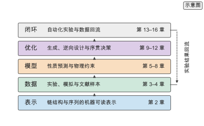
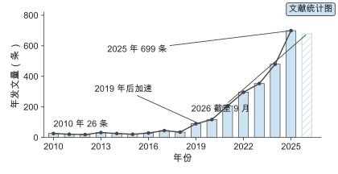
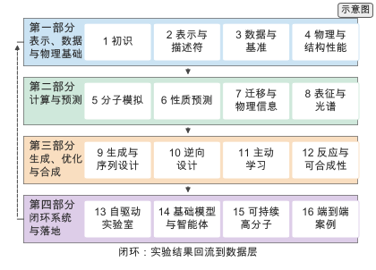
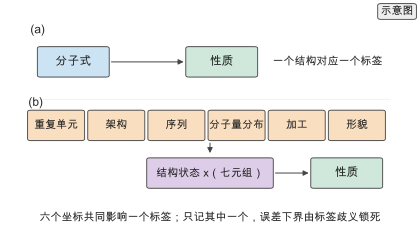
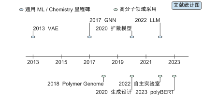
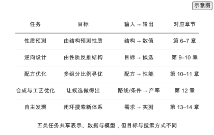
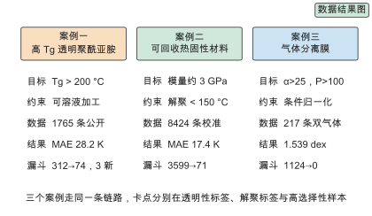

# 第 1 章 初识 AI4Polymer

> 写作大纲 · 全景、关键数字与估算方法 · 2026-09-17

开篇安排：从一个具体的高分子设计任务写起——为一款需要耐高温的透明聚酰亚胺找到候选结构。传统路径一轮以周计；数据驱动路径先在计算机里把候选缩到可验证的规模。两条路径的差别不在某一步的快慢，而在搜索空间与实验预算的匹配方式。全章围绕两套 canonical framework 组织：五层框架（表示、数据、模型、优化、闭环）与九步工程流水线（需求到反馈）。

**本章判断：** 人工智能改变高分子研发的方式，是在有限实验预算下重新分配搜索，而不是替代某一步实验；判断一个方法值不值得用，看它在给定预算下把可行解的比例提高了多少。

**前置与交付：** 需要大学化学的高分子基础与基本的代数、对数运算。读完本章，读者能画出 AI4Polymer 的五层全景与九步流水线，说出高分子设计的三个数量级（候选空间、可用样本、单次迭代代价），并用一个可复算的公式估算一次设计迭代的总代价。

**阅读安排：** 正文练习为练习 1-1 至 1-3，均为核心；练习 1-4 至 1-7 为延伸，放在扩写资料中。1.1 与 1.2 建立全景，1.3 给出关键数字，1.4 交代估算方法与路线。首次阅读可先读 1.2 与 1.3，再回到 1.1。

## 1.1 为什么需要 AI4Polymer

### 1.1.1 高分子研发的传统路径与瓶颈

一次设计循环由提出假设、合成、表征、修改假设四步构成，一轮周期 $T_1=t_s+t_c+t_a$，典型 3 到 7 天。三个瓶颈：候选空间远大于可合成与可测试的规模；合成与表征周期长、难以并行；结构–性能关系非线性且受加工条件影响，因此标签必须带条件。用第 4 章会展开的 $T_g$ 例子说明"同一化学式在不同条件下性质差异很大"。

### 1.1.2 数据驱动范式的四个层次

把"用 AI"拆成四个由浅入深的层次：性质预测、生成、序贯优化、闭环。说明层次越高收益越大、对数据与平台要求越高；这四层是五层框架的早期表述，1.2 节给出规范形式。给出筛选比例 $|\mathcal{S}|/|\mathcal{S}'|$ 作为全书反复使用的评价尺度。

> **图 1-1：AI4Polymer 五层全景（已配正文图）**
>
> 五层塔形：表示、数据、模型、优化、闭环，下层为上层提供输入，闭环把实验结果回流到数据层。数据来源：示意。
>
> 已制作：[SVG](../../manuscripts/ch01/figure-1-1-panorama.svg)／[PNG](../../manuscripts/ch01/figure-1-1-panorama.png)。

> **实验 1-1 ★〔核心〕：估算一个高分子设计任务的候选规模**
>
> 用乘法原理估算线性高分子的结构组合数，并与可合成、可测试的规模比较。参数写在题干中：重复单元数 $n=10$，每单元可选单体 $m=50$，侧基修饰 $s=5$。
>
> 条件：基础 · 纸笔与对数运算。
>
> **记录结果（1-1）：** 候选规模在 $10^{23}$ 量级，远大于可合成与可测试规模，因此需要计算筛选。完整记录见 [实验 1-1](../../experiments/ch01/01-01/README.md)。

## 1.2 领域全景

### 1.2.1 表示、数据、模型、优化与闭环

逐层定义五层及其数据结构：表示把链结构、序列与构象写成模型可读的输入；数据是实验、模拟与文献汇聚的样本；模型从树集成到图网络与基础模型；优化包括生成、逆向设计与贝叶斯优化；闭环把预测接到机器人实验。给出五层的函数复合接口与"短板限制整条链路"的判断。

### 1.2.2 与传统材料信息学的关系

说明高分子信息学与传统材料信息学、化学信息学的共性与差异：重复单元、序列排列与分子量分布三个自由度使表示更复杂、标签噪声更大，因此对表示与数据质量的要求更高。

> **实验 1-2 ★〔核心〕：核算领域的文献与数据规模**
>
> 用 Web of Science 的 3178 条记录统计年发文量增长，并与主要数据集（PoLyInfo、PI1M、POINT2）的规模对照，说明"文献多、结构化数据少"的现状。给出 2010 年与 2025 年的年发文量。
>
> 条件：基础 · 已归档的检索导出文件。
>
> **记录结果（1-2）：** 年发文量从 26 篇增长到 699 篇，而结构化性质数据仍以千到百万条计，二者相差数个数量级。完整记录见 [实验 1-2](../../experiments/ch01/01-02/README.md)。

## 1.3 关键数字

### 1.3.1 文献与数据的规模

给出三组数字：检索到的文献条数与年增长；主要数据集的样本量；一次性质预测任务可用的标注样本量。说明为什么"数据不够"是高分子 AI 的核心约束，引出第 3 章与第 7 章。

### 1.3.2 化学空间与候选规模

把候选空间写成一个可计算的多重积，给出数量级估算，并与可合成、可测试规模比较。区分**组合规则约束**与**可合成性**：计数只回答"满足组合语法与拓扑约束的序列有多少条"，可合成性由单体可得性与反应动力学决定，交叉引用第 12 章。

### 1.3.3 计算与实验的代价

给出 DFT 单点、MD 轨迹、机器学习势推理与一次湿实验的代价量级。所有 GPU 时间均为**理想算术下界**（FLOPs 除以设备峰值，未计入内存带宽、kernel launch、batch size 与软件实现），本书未做实测 benchmark；说明计算筛选相对于实验的成本优势来自并行与可重复。

> **图 1-2：AI 驱动高分子研究的年发文量（已配正文图）**
>
> 2010–2025 年为实心柱与实线，2026 年为浅色空心柱并标注"截至 2026-09"，不与完整年份连线比较。数据来源：Web of Science Core Collection，检索式与检索日期见正文图注。
>
> 已制作：[SVG](../../manuscripts/ch01/figure-1-2-publications.svg)／[PNG](../../manuscripts/ch01/figure-1-2-publications.png)。

> **实验 1-3 ★〔核心〕：估算一次设计迭代的总代价**
>
> 把一次"设计—合成—表征—评估"循环拆成计算筛选、合成、表征与人工分析四部分，分别给出耗时与成本，求和得到一轮的总代价，并计算把候选从 $10^{4}$ 缩到 $10^{1}$ 后节省的实验轮数。参数写在题干中。
>
> 条件：进阶 · 纸笔与 `calculations/` 复算。
>
> **记录结果（1-3）：** 一轮迭代以周计，计算筛选占总时间的比例很低，但决定了实验轮数；先筛选再实验可把总周期缩短到原来的几分之一。完整记录见 [实验 1-3](../../experiments/ch01/01-03/README.md)。

## 1.4 估算方法与全书路线

### 1.4.1 从预算推导设计

定义全书的估算原则：先写出约束（预算、样本量、精度要求），再推导设计选择，最后给出量级结论。说明估算只求数量级正确，允许常数因子 2–3 倍误差。

### 1.4.2 复算工具与阅读路径

介绍 `calculations/` 工具：每个主题是一个纯函数，返回统一的 JSON 契约，可复现为 `results/` 中的结果。阅读路径压缩到最短入口，详细路径指向前言。

> **图 1-3：全书路线图（已配正文图）**
>
> 四个部分自上而下排布，每部分横向列出本章，部分之间用主干箭头连接，左侧箭头表示实验结果回流到数据层。数据来源：示意。
>
> 已制作：[SVG](../../manuscripts/ch01/figure-1-3-roadmap.svg)／[PNG](../../manuscripts/ch01/figure-1-3-roadmap.png)。

## 1.5 为什么高分子 AI 不等于小分子 AI

### 1.5.1 小分子是一条映射，高分子是一族映射

对比 $\text{molecule}\to\text{property}$ 与六坐标到性质的映射。从表示的信息量、标签的语义与搜索空间三处量化差别：$10^{100}\approx2^{332}$，2048 位指纹的纯信息容量足够给 $10^{100}$ 个对象编号，标准重复单元 ECFP 表达不了序列的原因是语义缺口（不编码 sequence/MWD/processing），其次才是哈希折叠的位碰撞。给出 Fox–Flory 关系对聚合度的依赖。

### 1.5.2 三个额外自由度与四层表示对象

把差别落到第 2 章的四层表示对象（化学、序列、分子量、架构）与七元组上，说明哪些项由表示携带、哪些必须作为标签条件记录。

### 1.5.3 多尺度结构–性能图上的信息流

用第 4 章 4.6 的多尺度图说明目标性质由哪个尺度控制，据此选择表示要携带的信息层。

> **图 1-4：高分子与小分子的信息差异（已配正文图）**
>
> 分两面板：(a) 小分子的分子式与性质一对一；(b) 重复单元、架构、序列、分子量分布、加工与形貌六个坐标共同影响一个标签。数据来源：示意。
>
> 已制作：[SVG](../../manuscripts/ch01/figure-1-4-difference.svg)／[PNG](../../manuscripts/ch01/figure-1-4-difference.png)。

## 1.6 AI4Polymer 的简史

### 1.6.1 从经验加和到基础模型

排成两条并行时间线：上轨为通用 ML/Chemistry 里程碑（QSPR、VAE/GAN/扩散、GNN、Transformer/LLM），下轨为这些方法进入高分子领域的时点（ECFP/Mordred、Polymer Genome、聚合物生成设计、PolyBERT、自主实验室、基础模型与智能体）。说明两者之间存在数年采用滞后，不宜把通用模型诞生年当作 AI4Polymer 阶段。

### 1.6.2 每一阶段留下了什么

每一步都在补前一步的缺口：QSPR 的非线性缺口由树与图网络补，指纹的语义缺口由三维与多模态表示补，生成的可合成性缺口由逆合成与可达性过滤补。缺口出现在层与层的接口上，这正是全书按五层而非模型家族组织的原因。

### 1.6.3 从文献计量看拐点

用 WoS 的 3178 条记录、2010 年 26 条、2019 年 90 条与 2025 年 699 条说明加速段。文献增长是研究活动的量级，不是可用数据的量级。

> **图 1-5：AI4Polymer 的双轨时间线（已配正文图）**
>
> 双轨时间线：上轨为通用 ML/Chemistry 里程碑，下轨为高分子领域采用时点，两轨之间有数年滞后。数据来源：文献。
>
> 已制作：[SVG](../../manuscripts/ch01/figure-1-5-timeline.svg)／[PNG](../../manuscripts/ch01/figure-1-5-timeline.png)。

## 1.7 高分子设计流水线：从需求到反馈

### 1.7.1 九个环节与章节对应

需求、表示、数据、预测、生成、模拟、合成、实验、反馈九个环节，与五层全景互补，给出每个环节的对应章节。

### 1.7.2 每一层的输入、输出与失败模式

逐环节给出验收标准与回退方向，指出最容易被跳过的是需求与反馈。给出从需求到约束的三步（量化目标、分硬/软约束、反推预算）。

### 1.7.3 流水线的三种形态

按反馈的闭合方式分单程、迭代与闭环三种形态，给出各自的成本、产出与适用条件；第 16 章三个案例停在单程与迭代之间。

## 1.8 五类典型任务

### 1.8.1 五类任务的目标与输入输出

性质预测、逆向设计、配方优化、合成与工艺优化、自主发现，各自的目标、输入输出与章节。

### 1.8.2 任务与方法的匹配

用"有没有标签、能不能枚举、评估贵不贵"三个问题把任务映射到方法，并说明何时不需要序贯方法。

> **图 1-6：五类典型任务对照（已配正文图）**
>
> 表格形式并列五类任务的目标、输入输出与章节。数据来源：示意。
>
> 已制作：[SVG](../../manuscripts/ch01/figure-1-6-tasks.svg)／[PNG](../../manuscripts/ch01/figure-1-6-tasks.png)。

## 1.9 三个贯穿全书的案例

三个案例在正文只做 preview，每例一段；完整链路与全部数值留在第 16 章。

### 1.9.1 案例一：高 Tg 透明聚酰亚胺

1765 条公开 $T_g$，骨架分组 MAE 28.2 K，漏斗 312 → 74，Top 5 含 3 条新结构；透明性缺标签。

### 1.9.2 案例二：可回收热固性材料

8424 条公开 vitrimer 数据（MD 校准 $T_g$），环氧家族分组 MAE 17.4 K，漏斗 3599 → 71；解聚温度、模量与回收率缺标签。

### 1.9.3 案例三：气体分离膜

217 条公开双气体数据，时间划分退化到 1.539 dex，漏斗 1124 → 0；高选择性样本稀缺。

### 1.9.4 三个案例的对照

三条链路并排：约束类型、数据规模、主模型误差、筛选漏斗与未闭合项；指出模型误差与标签误差同量级。

> **图 1-7：三个贯穿全书的案例对照（已配正文图）**
>
> 三栏并列目标、约束、数据、结果与漏斗，底部标出各自的卡点。数据来源：公开实验数据。
>
> 已制作：[SVG](../../manuscripts/ch01/figure-1-7-cases.svg)／[PNG](../../manuscripts/ch01/figure-1-7-cases.png)。

## 1.10 如何读这本书：三条路径与三层结构

### 1.10.1 三类读者路径

材料背景、计算与机器学习背景、关注落地三类读者的阅读顺序，压缩到半页以内，详细路径指向前言。

### 1.10.2 正文、Technical Box 与仓库三层结构

正文主线、Technical Box（ML、高分子物理、实践、失败、可复现五类）与配套仓库三层；说明复核顺序与六级证据标签（`[实验]`、`[公开实验数据]`、`[模拟]`、`[复算]`、`[文献]`、`[示意]`）。

## 本章的设计决定

**D-01 两个 canonical framework：** 全章只保留五层框架（表示、数据、模型、优化、闭环）与九步工程流水线（需求到反馈）两套框架；1.1.2 的四层、1.7.3 的三种形态、1.8 的五类任务都作为它们的局部视图，不再并列成独立框架。

**D-02 复算纪律：** 正文只给结论与量级，所有数字来自 `calculations/` 或归档来源；估算公式放在扩写资料中，正文不出现推导细节。

**D-03 代价口径：** 所有 GPU 时间写作理想算术下界（FLOPs 除以设备峰值），不写成实测墙钟；本书未做目标体系上的 benchmark。

**D-04 组合规则与可合成性分离：** 化学空间计数只描述组合语法与拓扑约束，可合成性归第 12 章。

## 写作资料

- 领域资源分类：[AI4Polymer 资源清单](https://github.com/ShiqianTan/AI4Polymer)，覆盖设计发现、性质预测、AI 方法与数据工具。
- 检索与统计：[WoS 调研报告](../../research/2026-wos-survey/README.md)与[来源库说明](../../references/wos/README.md)。
- 代表综述：[Polymer Informatics: Opportunities and Challenges](../../references/sources.tsv)（`polymer-informatics-2017`）与[Polymer Informatics: Current Status and Critical Next Steps](../../references/sources.tsv)（`polymer-informatics-next-2021`）。
- 数据规模对照：[PoLyInfo](../../references/sources.tsv)（`polyinfo-2021`）、[PI1M](../../references/sources.tsv)（`pi1m-2020`）与 [POINT2](../../references/sources.tsv)（`point2-2023`）。
- 复算工具：[calculations/README.md](../../calculations/README.md)与[写作支持](writing-support.md)。
