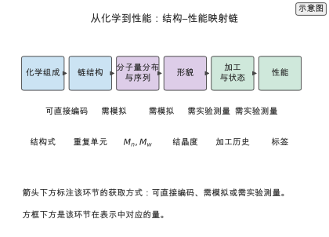
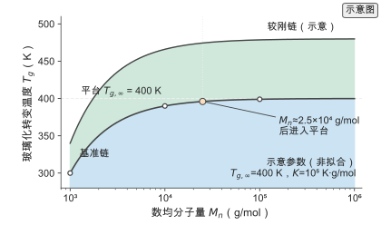
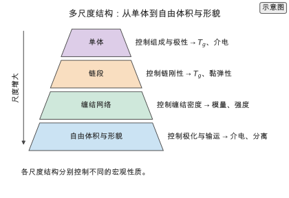
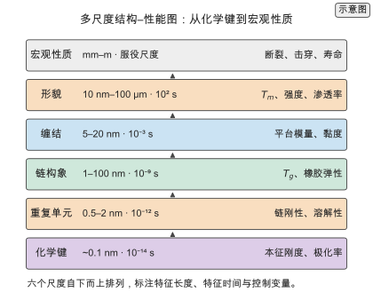
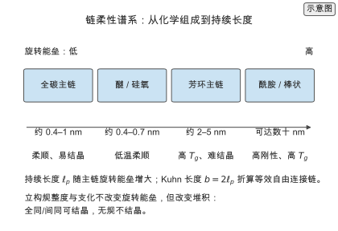
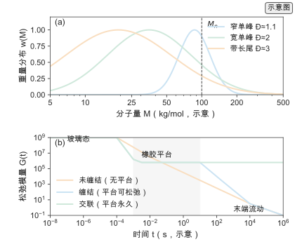
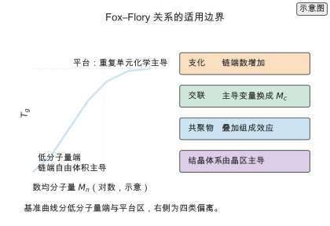
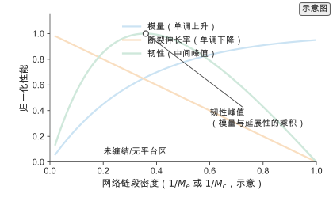
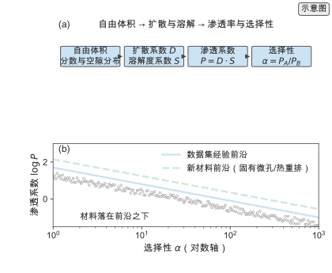
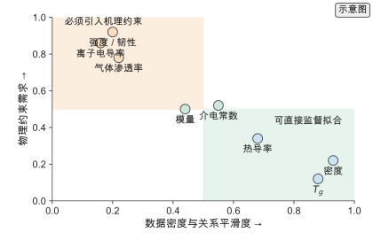

# 第 4 章 高分子物理与结构–性能关系

> 写作大纲 · 从链结构到性质 · 2026-09-16

开篇安排：从一个具体的选材问题写起——为一款耐高温透明薄膜同时要求高玻璃化转变温度、低介电常数和足够韧性。三个目标分别由链刚性、偶极与自由体积、缠结与分子量决定，方向并不一致。数据驱动方法要做的，是把这些结构–性能关系学成可计算的映射，并在目标冲突时给出取舍。本章按链结构、热、力学、电与输运的顺序建立这些映射，最后判断哪些性质容易学、哪些必须引入机理。

**本章判断：** 结构–性能关系的可学习性由数据密度与物理平滑度共同决定：热性能数据多、关系平滑，容易学到；介电与输运性质数据少、受形貌与加工影响大，必须引入自由体积、偶极与传输机理等约束。

**前置与交付：** 需要第 1 章的领域全景与高分子物理基础（分子量、链构象、相变）。读完本章，读者能写出常见结构–性能关系的数学形式，判断一个性质属于易学还是难学，并为第 5 章的模拟与第 6 章的模型选择合适的目标与特征。

**阅读安排：** 正文实验为实验 4-1 至 4-3，均为核心；实验 4-4 至 4-7 为延伸，放在扩写资料中。4.1 至 4.5 建立链结构、热性能、力学、电学与输运的基本关系并判断可学习性；4.6 给出贯穿全书的多尺度结构–性能图；4.7 至 4.11 沿链柔性、分子量分布与缠结、Fox–Flory 边界、力学网络边界、输运自由体积五条主线补物理图像与判据；4.12 给出结构–性能关系的机器学习视角；4.13 至 4.16 走通 Worked example、定量对比、实践流程与选型决策；4.17 汇总练习。材料背景的读者可从 4.2 读起，计算背景的读者可先读 4.5 与 4.12。

## 4.1 链结构与分子量

链结构包含化学组成、连接方式、分子量与分布、构象与拓扑。这些量既决定单链行为，也通过缠结决定宏观性质，是全部结构–性能关系的起点。

### 4.1.1 分子量与分布

定义数均分子量 $M_n$、重均分子量 $M_w$ 与分布宽度 $\mathrm{PDI}=M_w/M_n$，说明同一化学组成的聚合物因 $M_n$ 与 $\mathrm{PDI}$ 不同而性质不同。给出分子量分布的两种典型形式：高转化率逐步聚合的 Flory–Schulz 分布（$\mathrm{PDI}\to2$）与活性/受控聚合的窄分布；自由基聚合的 $\mathrm{PDI}$ 由引发、终止、链转移与转化率决定，不能用单一值概括。说明分布宽度如何影响加工与力学。

### 4.1.2 链构象与缠结

给出理想链模型：末端距、回转半径与持续长度（persistence length）描述链的柔性，Kuhn 长度把真实链折算为等效自由连接链。定义缠结分子量 $M_e$：当 $M_w>M_e$ 时链间形成拓扑缠结，材料出现橡胶平台与显著黏弹性，缠结平台模量写成 $G_N^{0}\sim\rho R T/M_e$（不同定义下含 prefactor），与交联橡胶的 $G\sim\nu_e R T$ 区分。

> **图 4-1：结构与性能的映射（已配正文图）**
>
> 以链式图画出从化学组成、链结构、分子量分布/序列、形貌、加工/状态到性能的映射，每条箭头标注可直接编码、需模拟或需实验测量，既是 polymer physics 图也是 AI feature-selection 图。
>
> 已制作：[SVG](../../manuscripts/ch04/figure-4-1-structure-property-map.svg)／[PNG](../../manuscripts/ch04/figure-4-1-structure-property-map.png)。

## 4.2 热性能

热性能是高分子数据最密集的一类，玻璃化转变与熔融直接反映链段活动能力，也是数据驱动方法最成功的预测目标。

### 4.2.1 玻璃化转变温度

定义玻璃化转变温度 $T_g$：链段运动被冻结的温度；补上 $T_g$ 不是严格热力学相变，而是依赖观测时间尺度、升温速率与测量方法的动力学转变区间，DSC、DMA 与不同升温速率的 $T_g$ 不能无条件混成同一 label。给出 Fox–Flory 关系 $T_g(M_n)=T_{g,\infty}-K/M_n$，说明 $T_g$ 随分子量增大趋于平台，并列出立构、序列、增塑剂、交联、结晶度、热历史与测量协议等其余影响因素，以及基团贡献法如何从结构估算 $T_g$。

> **实验 4-1 ★〔核心〕：Tg 与链刚性**
>
> 用 Fox–Flory 关系计算不同数均分子量下的 $T_g$，并与基团贡献给出的链刚性排序对照，说明分子量与刚性各自的贡献量级。明确 $K$ 是链端自由体积参数，不度量链刚性。参数写在题干中：$T_{g,\infty}=400\ \mathrm{K}$、$K=10^{5}\ \mathrm{K\cdot g/mol}$，$M_n$ 取 $10^{3}$、$10^{4}$、$10^{5}$。
>
> 条件：基础 · `calculations/learning-curve` 与 `tg-benchmark-2021`。
>
> **记录结果（4-1）：** $M_n=10^{3}$ 时 $T_g=300\ \mathrm{K}$，$M_n=10^{4}$ 时升到 $390\ \mathrm{K}$，$M_n=10^{5}$ 时达到 $399\ \mathrm{K}$；分子量低于缠结阈值时对 $T_g$ 影响显著，之后趋于平台。完整记录见 [实验 4-1](../../experiments/ch04/04-01/README.md)。

### 4.2.2 熔点与结晶度

定义熔点 $T_m$ 与结晶度 $\chi$，说明 $T_m$ 由链规整性、链间作用与片晶厚度决定，$\chi$ 由结晶动力学与热历史决定。给出 Gibbs–Thomson 关系把 $T_m$ 与片晶厚度联系，指出半结晶聚合物的性质由晶区与非晶区两相共同决定。

> **图 4-2：Tg 随链结构变化（已配正文图）**
>
> 曲线给出 $T_g$ 随分子量与链刚性参数的变化，标出低分子量端的陡降与高分子量端的平台。读法：先看平台值，再看达到平台所需的分子量。
>
> 已制作：[SVG](../../manuscripts/ch04/figure-4-2-tg-chain-structure.svg)／[PNG](../../manuscripts/ch04/figure-4-2-tg-chain-structure.png)。

## 4.3 力学与流变

力学性能决定材料能否承载，流变性能决定能否加工。两者都由分子量、缠结与温度通过统一的黏弹性框架联系起来。

### 4.3.1 模量与强度

定义杨氏模量、屈服强度与断裂伸长率。说明模量在玻璃态由链段刚度与自由体积决定，在橡胶态由网络链段密度决定：交联橡胶用 $G\sim\nu_e R T$，缠结熔体平台用 $G_N^{0}\sim\rho R T/M_e$，两者量级相当但公式不同。说明强度受缺陷与取向控制，因而比模量更难从单一结构预测。

> **实验 4-2 ★〔核心〕：分子量分布与力学**
>
> 用橡胶弹性关系计算不同缠结分子量与温度下的平台模量，并比较窄分布与宽分布对模量与加工窗口的影响。参数写在题干中：$\rho=10^{3}\ \mathrm{kg/m^{3}}$、$T=300\ \mathrm{K}$、$M_e$ 取 $2\times10^{3}$ 与 $10^{4}\ \mathrm{g/mol}$。
>
> 条件：进阶 · `calculations/learning-curve` 与 `polymer-genome-2018`。
>
> **记录结果（4-2）：** $M_e=2\times10^{3}$ 时平台模量约 $1.2\ \mathrm{MPa}$，$M_e=10^{4}$ 时降到约 $0.25\ \mathrm{MPa}$；缠结密度越高模量越大，宽分布拓宽加工窗口但降低一致性。完整记录见 [实验 4-2](../../experiments/ch04/04-02/README.md)。

### 4.3.2 粘弹性

定义储能模量 $G'$ 与损耗模量 $G''$，说明时间–温度等效原理把不同温度的频率扫描叠加为一条主曲线，WLF 方程给出移动因子。指出黏弹性是典型的多尺度性质，数据驱动模型需要同时输入温度、频率与结构。

## 4.4 电学与输运

电学与输运性质面向储能、分离与传导应用，数据较少且受形貌影响大，是机理约束收益最高的领域。

### 4.4.1 介电与击穿

定义介电常数 $\varepsilon_r$ 与介电损耗，说明 $\varepsilon_r$ 由偶极密度与极化率决定，可用 Clausius–Mossotti 关系估算。给出击穿场强 $E_b$ 与储能密度 $U=\tfrac12\varepsilon_0\varepsilon_r E_b^{2}$，指出高温电容储能的关键是同时提高 $\varepsilon_r$ 与 $E_b$，而两者常相互制约。

> **实验 4-3 ★〔核心〕：介电常数估算**
>
> 用 Clausius–Mossotti 关系从摩尔极化率与摩尔体积估算介电常数，并代入储能密度公式计算给定场强下的能量密度。参数写在题干中：$\varepsilon_r$ 取 3，击穿场强 $600\ \mathrm{MV/m}$。
>
> 条件：进阶 · `polymer-dielectrics-review-2022` 与 `calculations/learning-curve`。
>
> **记录结果（4-3）：** 储能密度约 $4.8\ \mathrm{MJ/m^{3}}$；提高 $\varepsilon_r$ 或 $E_b$ 都能提高储能密度，但高极性基团通常降低击穿场强，需权衡。完整记录见 [实验 4-3](../../experiments/ch04/04-03/README.md)。

### 4.4.2 离子传导与气体分离

定义离子电导率与气体渗透系数 $P_i=D_i S_i$（扩散系数乘溶解度系数），以及选择性 $\alpha_{A/B}=P_A/P_B=(D_A/D_B)(S_A/S_B)$，说明 free volume 主要作用于扩散、specific interaction 主要作用于溶解。说明渗透性与选择性存在经验前沿（dataset-specific empirical frontier，区别于 Robeson upper bound 本身）权衡，自由体积同时影响两者，因此自由体积是这两个应用共享的关键结构变量。

> **图 4-3：多尺度结构（已配正文图）**
>
> 从单体、链段、缠结网络到自由体积与形貌逐级展示结构尺度，标注各尺度对应的性质。读法：确定目标性质所处的尺度，再选择相应表示与模拟方法。
>
> 已制作：[SVG](../../manuscripts/ch04/figure-4-3-multiscale-structure.svg)／[PNG](../../manuscripts/ch04/figure-4-3-multiscale-structure.png)。

## 4.5 结构–性能关系的可学习性

把前面四节的性质放在同一坐标系里比较：哪些数据充足、关系平滑，哪些数据稀疏、受多因素耦合。这一判断直接决定后续章节的建模策略。

### 4.5.1 哪些性质容易学

给出判据：标签样本量、结构–性质关系的平滑度、是否受加工与形貌影响。指出 $T_g$ 与密度属于易学类：数据多、关系主要由链结构决定；介电、击穿与气体分离属于难学类：数据少、受自由体积与形貌耦合。

### 4.5.2 外推与机理约束

定义外推：测试结构与训练结构在化学空间上距离较远。说明纯数据模型在外推区误差迅速上升，引入机理约束（自由体积、偶极、传输方程）可以缩小假设空间，提高外推稳定性；这一策略在第 7 章的物理信息学习中展开。

## 4.6 多尺度结构–性能图

给出贯穿全书的多尺度结构–性能图：化学键、重复单元、链构象、缠结、形貌、宏观性质六个尺度，每个尺度标注特征长度、特征时间、控制变量与直接控制的性质。读法是先定位目标性质的尺度，再沿箭头向下找必须进入表示的结构变量。

### 4.6.1 六个尺度与它们控制的性质

给出六尺度表与特征时间判据：性质由与其观测时间最接近、且比它更慢的结构松弛控制。指出图是耦合网络而非流水线，相邻尺度强耦合，越靠上的尺度样本越少、越受加工影响。

### 4.6.2 用这张图选特征与判据

三步：定位尺度、找出控制变量、核对表示是否携带。与第 2 章覆盖表相乘得到任务对表示的最低要求。给出特征时间判据：静态映射只适用于特征时间落在结构松弛时间之内的性质。

> **图 4-4：多尺度结构–性能图（已配正文图）**
>
> 六个尺度自下而上排列，标注特征长度、特征时间、控制变量与目标性质；化学键到宏观性质逐级放大。读法：先定位目标性质，再向下找控制变量，决定特征工程方向。
>
> 已制作：[SVG](../../manuscripts/ch04/figure-4-4-multiscale-property-map.svg)／[PNG](../../manuscripts/ch04/figure-4-4-multiscale-property-map.png)。

## 4.7 链柔性的物理图像：从化学到持续长度

补上从主链化学到持续长度的因果链：旋转能垒、侧基位阻与链内相互作用决定柔性，柔性由 $\ell_p$ 与 $b=2\ell_p$ 定量，$\ell_p$ 与 $b$ 决定回旋半径与缠结几何。说明立构规整度与支化不改变旋转能垒，但改变堆积与结晶。

### 4.7.1 化学组成如何决定柔性

主链单键旋转能垒、侧基位阻与相互作用决定柔性。给出常见量级：柔性链 $\ell_p$ 约 0.4–1 nm，半刚性链约 2–5 nm，刚性棒状可达数十 nm。指出 $\ell_p$ 随温度变化，记录时必须写明温度与方法。

### 4.7.2 立构规整度与支化的判据

立构规整度改变堆积能力：全同/间同可结晶，无规不结晶。支化分短支链（降低结晶度与密度、提高韧性）与长支链（增强拓扑耦合与熔体弹性）。给出结构特征—作用—性质响应对照表。

> **图 4-5：链柔性谱系（已配正文图）**
>
> 从主链化学、侧基与相互作用，经旋转能垒，到持续长度与 Kuhn 长度，再到受其控制的链尺度与性质。读法：先看主链化学落在谱系哪一段，再读出对应链尺度与性质。
>
> 已制作：[SVG](../../manuscripts/ch04/figure-4-5-chain-flexibility.svg)／[PNG](../../manuscripts/ch04/figure-4-5-chain-flexibility.png)。

## 4.8 分子量分布与缠结：从曲线到流变

说明分布的矩如何决定性质：$T_g$ 读取低分子量端（$M_n$），熔体黏度读取中间与高分子量部分（$M_w$），力学强度读取高分子量尾部（$M_z$ 以上）。给出缠结判据 $M_w\gg M_e$、临界分子量 $M_c\approx2M_e$ 与黏度指数，并区分缠结网络与交联网络。

### 4.8.1 分布的形状与矩

$M_n$、$M_w$、$M_z$ 对分布不同部位加权。两个 $\mathrm{PDI}$ 相同的分布可以形状不同。判据：先确定性质由链端、整链还是高分子量尾部控制，再决定记录哪个矩或完整曲线。

### 4.8.2 缠结的判据与平台

$M_w\gg M_e$ 时出现橡胶平台，$G_N^{0}\sim\rho R T/M_e$（含 prefactor）；$M_c\approx2M_e$ 以下缠结消失。缠结熔体黏度按约 3.4 次幂增长，未缠结按约 1 次幂。区分缠结平台（可逆、随温度与时间消失）与交联平台（在低于降解或键交换过程的时间尺度内不通过 reptation 松弛；vitrimer 等动态网络是反例）。

### 4.8.3 分子量分布的表示与建模含义

分子量与分布是样本字段。按目标分三档记录：只记 $M_n$；记 $M_n$ 与 $M_w$；记完整 $P(M)$ 或 $M_z$。给出实践 Box：分子量字段该记到哪一档。

> **图 4-6：分子量分布与流变（已配正文图）**
>
> (a) 三种分布形状（窄单峰、宽单峰、带长尾），标注 $M_n$ 与高分子量尾部。(b) 对应应力松弛模量的四个区；未缠结无平台，缠结有平台，交联平台在低于降解/键交换过程的时间尺度内不通过 reptation 松弛。读法：先看分布形状决定尾部权重，再看分子量与 $M_c$ 的关系决定有没有平台。
>
> 已制作：[SVG](../../manuscripts/ch04/figure-4-6-mwd-entanglement-rheology.svg)／[PNG](../../manuscripts/ch04/figure-4-6-mwd-entanglement-rheology.png)。

## 4.9 热转变的完整图像：Fox–Flory 及其适用边界

补上 Fox–Flory 关系的物理来源：链端引入额外自由体积，自由体积分数降到临界值触发玻璃化转变；$K$ 是链端自由体积除以自由体积热膨胀系数，不度量链刚性。给出适用边界与数据字段要求。

### 4.9.1 链端自由体积的物理来源

写出自由体积分数的平台项加链端项 $f(M_n)=f_\infty+2\rho N_A v_e/M_n$，令 $f=f_g$ 线性展开得 $K=2\rho N_A v_e/\alpha_f$。给出链端项数值：$M_n=10^{3}$ 为 100 K、$10^{4}$ 为 10 K、$10^{5}$ 为 1 K，平台判据 $M_n>K$。

### 4.9.2 适用边界：支化、交联与共聚物

Fox–Flory 假设线性、非晶、链端只贡献额外自由体积、用 $M_n$。支化改变单位质量链端数；交联在凝胶点以上主导变量换成 $M_c$；共聚物叠加组成效应（Fox 方程）；结晶体系由晶区主导。给出四类偏离的判据。

### 4.9.3 为什么机器学习数据必须保留 $M_n$

缺 $M_n$ 时模型只学到重复单元与平台值，链端项不可见，低分子量端系统性偏移。$T_g$ 基准的两类问题是数据质量（测试方法差异）与迁移性（单体家族差异）。给出论文 Box 与 ML Box：$T_g$ 预测的评估与迁移、标签里没有 $M_n$ 时模型学到什么。

> **图 4-7：Fox–Flory 关系的适用边界（已配正文图）**
>
> 基准曲线分低分子量端与平台两区；右侧列出四类偏离：支化、交联、共聚物、结晶体系。读法：先判断体系落在哪一类，再决定是否用 Fox–Flory 与用哪个自变量。
>
> 已制作：[SVG](../../manuscripts/ch04/figure-4-7-fox-flory-regimes.svg)／[PNG](../../manuscripts/ch04/figure-4-7-fox-flory-regimes.png)。

## 4.10 力学响应的网络边界：橡胶平台、交联与缠结

说明模量、强度与韧性三者的物理来源不同、可预测性不同。给出橡胶平台的两条边界（临界分子量与交联密度），区分缠结网络与交联网络，讨论强度与延展性的权衡。

### 4.10.1 三个力学量的物理来源

模量由平衡态结构决定（玻璃态链段刚度、橡胶态网络链段密度、半结晶两相）；强度由缺陷与取向控制（Griffith 判据）；韧性由强度与延展性共同决定。判据：先确定力学状态，再选结构变量。

### 4.10.2 橡胶平台的两条边界

下边界 $M_c$：$M_w<M_c$ 无平台。上边界交联密度：$M_c<M_e$ 时平台由化学交联决定。判据是平台的温度与时间稳定性。给出平台模量数值与失败 Box：用单一分子量预测强度。

### 4.10.3 韧性：强度与延展性的权衡

韧性是强度与延展性的乘积，存在使韧性最大的中间网络密度。半结晶聚合物的韧性来自系链分子。模拟提供机理标签（自由体积、取向、缠结密度），训练力学模型时应输入机理量而非只给重复单元。

> **图 4-8：力学响应的网络边界（已配正文图）**
>
> 模量随网络链段密度单调上升，断裂伸长率单调下降，韧性在两者乘积最大处出现峰值；左侧虚线标出无平台区。读法：沿密度轴找到目标性能对应的位置，避免单目标最大化。
>
> 已制作：[SVG](../../manuscripts/ch04/figure-4-8-mechanics-network-boundary.svg)／[PNG](../../manuscripts/ch04/figure-4-8-mechanics-network-boundary.png)。

## 4.11 输运的自由体积图像：从扩散到 Robeson 上限

说明自由体积如何同时控制扩散、溶解与极化：FVE 尺寸分布与连通性决定扩散，极性与内聚能决定溶解，$P_i=D_i S_i$。给出经验前沿（相对 Robeson upper bound）的物理含义与边界，并说明自由体积是介电、分离与传导共享的结构变量。

### 4.11.1 自由体积与扩散

FVE 的尺寸分布与连通性决定跳跃路径；FVE 随物理老化塌缩，链柔性越强演化越明显。给出经验式 $\log D=a_D+b_D/\mathrm{FFV}$ 与判据：尺寸选择性看 FVE 尺寸分布，通量看总自由体积分数。

### 4.11.2 渗透率、选择性与 Robeson 上限的物理含义

$\alpha_{A/B}=P_A/P_B=(D_A/D_B)(S_A/S_B)$，经验前沿 $\log P_A=\log\beta-n\log\alpha_{A/B}$；按数据集拟合的 Pareto 直线是 dataset-specific empirical frontier，不等于 Robeson upper bound 本身。物理含义：自由体积主要作用于扩散、specific interaction 主要作用于溶解，两者相互制约。边界：只对特定气体对、温度区间与致密膜成立，新材料（固有微孔、热重排）把前沿上移。

### 4.11.3 离子传导的共享变量

Nernst–Einstein 关系 $\sigma=nq^{2}D/(k_BT)$ 对应理想、无关联载流子近似；真实体系阳离子–阴离子关联与离子配对需 correlation/Haven factor 修正。关系与链段活动性、$T_g$ 关联。自由体积同时决定链段活动性与离子跳跃空间。缺自由体积或 $T_g$ 字段时，介电、分离与传导模型只能学到化学组成的间接关联。

> **图 4-9：自由体积与输运（已配正文图）**
>
> (a) 从自由体积分数与空隙尺寸分布，经扩散系数与溶解度系数，到渗透系数与选择性。(b) 以 $\log P$ 对 $\log\alpha$ 画出经验前沿（dataset-specific empirical frontier），新材料把前沿上移。读法：先判断目标在通量还是选择性，再在自由体积的两个侧面之间取舍。
>
> 已制作：[SVG](../../manuscripts/ch04/figure-4-9-free-volume-transport.svg)／[PNG](../../manuscripts/ch04/figure-4-9-free-volume-transport.png)。

## 4.12 结构–性能关系的机器学习视角

把前十一节的物理图像翻译成机器学习能用的语言：哪些关系可以直接学、哪些必须靠物理约束、哪些量在数据里根本学不到。本节是本章与第 6、7 章的接口。

### 4.12.1 可以学的与必须约束的

按数据密度、关系平滑度、加工敏感度与外推需求判断。可学：$T_g$、密度、热导率、回旋半径。必须约束：击穿、气体分离、离子传导、强度、韧性。给出可学习性图与 ML Box：物理约束不是正则项。

### 4.12.2 表示、标签与可学习性的接口

可学习性由性质、表示、标签三者共同决定。表示决定能接触哪些结构变量，标签决定能学到什么，物理决定能否外推。给出四步判据流程。给出论文 Box：Open Polymer Challenge（$10^{4}$ 聚合物、5 性质）与 POINT2（精度、不确定性、可解释性、可合成性）。

### 4.12.3 与第 7 章的接口

物理约束的三种落地形式：等式约束、不等式约束、对称性与守恒。约束强度要匹配数据量。给出实践 Box：从结构–性能关系到模型输入的四步。

> **图 4-10：可学习性图（已配正文图）**
>
> 横轴为数据密度与关系平滑度，纵轴为物理约束需求，标出各性质的位置与建模策略。右下角可直接监督拟合，左上角必须引入机理约束。读法：先定位性质，再选择“监督拟合”或“机理约束”路线。
>
> 已制作：[SVG](../../manuscripts/ch04/figure-4-10-ml-learnability-map.svg)／[PNG](../../manuscripts/ch04/figure-4-10-ml-learnability-map.png)。

## 4.13 Worked example：耐高温透明薄膜的结构–性能核算

回到开篇的选材问题：为一款耐高温透明薄膜同时要求高玻璃化转变温度、低介电常数和足够韧性，用图 4-4 与各节判据走通一次完整核算。

### 4.13.1 任务与目标冲突

三个目标分别落在重复单元与链构象、重复单元与链构象、缠结与形貌尺度，共享变量方向不一致；数据密度不均，建模策略不同。

### 4.13.2 结构–性能账本

给出目标—主导尺度—结构变量—关系—数据密度—建模策略的账本表。结论：三个目标不能共用一套特征，共享尺度的特征必须分开编码。

### 4.13.3 取舍与结论

两条解耦路径：刚性主链加低极化大体积侧基；中等分子量与适度交联保证韧性。给出三条判据与实践 Box：用账本避免“指标好看但材料做不出”。

## 4.14 结构–性能关系的定量对比

### 4.14.1 关系的形式与适用边界

汇总 Fox–Flory、Gibbs–Thomson、缠结平台 $G_N^{0}\sim\rho R T/M_e$ 与交联橡胶 $G\sim\nu_e R T$、WLF、Clausius–Mossotti、经验 Pareto 前沿、Nernst–Einstein 的形式、控制尺度与适用边界，防止形式外推与尺度错配。

### 4.14.2 数据密度与误差量级

按新的六级证据标签（实验、公开实验数据、模拟、复算、文献、示意）说明本章只出现文献、复算与示意三级；列出本书未测项（$T_g$ 模型端到端误差、介电与击穿实测关联、韧性与加工条件、自由体积与渗透率拟合参数）。

## 4.15 从结构–性能关系到建模的实践流程

### 4.15.1 目标性质 → 尺度 → 特征 → 约束

五步流程与每步的失败信号，把排查从“调模型”变成“查流程”。

### 4.15.2 复现清单

给出可复现 Box：数据、代码、环境、结果四类记录，特别标注示意参数。

## 4.16 选型决策：目标性质 × 建模策略

### 4.16.1 决策路径

五步路径与目标耦合判断：共享变量方向相反时不能分别建模后取交，必须解耦或多目标优化。

### 4.16.2 任务—策略对照

给出目标性质—主导尺度—数据密度—建模策略对照表，以及失败 Box：把“易学”当成“可外推”。

## 4.17 练习与实验清单

汇总核心练习 4-1 至 4-3 与延伸实验 4-4 至 4-7，给出主题、类型与记录位置。

## 本章的设计决定

**D-05 结构–性能章节按热、力学、电学、输运组织，不按材料类别：** 按性质类型组织便于把同类数据与方法放在一起，第 6、15 章沿用这一分类，避免按应用重复叙述。

**D-22 目标性质分级：** 把 $T_g$、密度列为易学目标，把介电、击穿、分离、离子传导列为难学目标；第 6 章的模型选择与第 7 章的物理约束按此分级展开。

**D-23 自由体积作为共享变量：** 介电、气体分离与离子传导共享自由体积这一结构变量，第 5 章与第 6 章在特征与机理层面统一使用，减少重复建模。

## 写作资料

- 介电与储能：[Polymer dielectrics for high-temperature capacitive energy storage](../../references/sources.tsv)（`polymer-dielectrics-review-2022`）。
- 热导率预测：[Machine learning discovery of high thermal conductivity polymers](../../references/sources.tsv)（`thermal-conductivity-ml-2019`）。
- 气体分离：[Machine learning–enabled high-throughput screening of polymers for gas separation](../../references/sources.tsv)（`gas-separation-ml-2020`）。
- 溶解度参数：[Prediction of Hansen solubility parameters using machine learning](../../references/sources.tsv)（`solubility-hansen-2019`）。
- 多性质平台与基准：[Polymer Genome](../../references/sources.tsv)（`polymer-genome-2018`）与 [Tg 基准](../../references/sources.tsv)（`tg-benchmark-2021`）。
- 复算工具：[calculations/README.md](../../calculations/README.md)与[写作支持](writing-support.md)。
