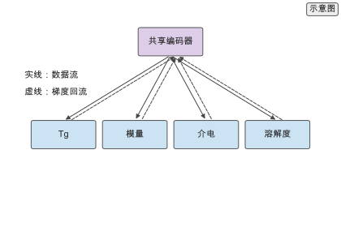
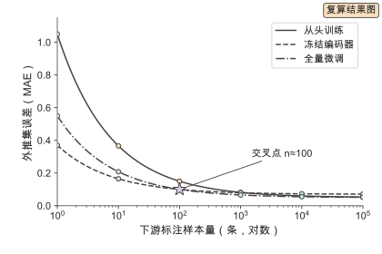
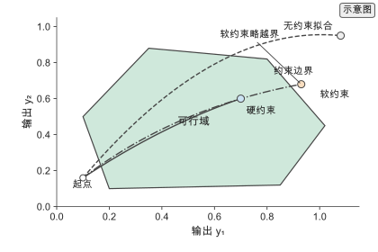
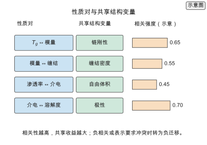
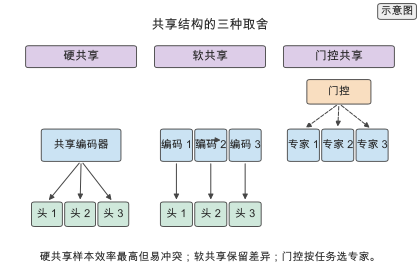
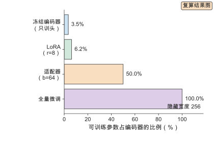
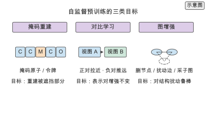
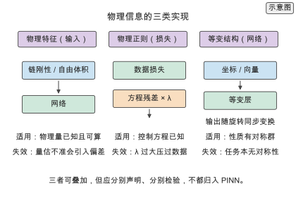
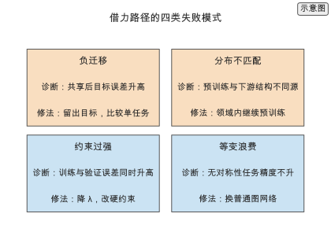

# 第 7 章 多任务、迁移与物理信息学习

> 写作大纲 · 小数据、预训练与约束 · 2026-09-17

开篇安排：从一个具体的建模任务写起——为一批新单体预测玻璃化转变温度，但标注样本只有几百条，第 6 章的图网络在训练集上很快逼近零误差，在按单体分组留出的测试集上却退化到与均值基线接近。数据没有变多，可用的信息却不止这一条：同批结构还有密度、溶解度与介电常数的标注，PI1M 上有百万条无标签结构可做预训练，而链刚性、自由体积与能量守恒是已知的物理事实。本章把这三类外部信息分别写成多任务共享、迁移预训练与物理约束，并给出判断它们是否真的带来改进的评估方法。

**本章判断：** 小数据下提升泛化的三条路径——多任务共享表示、预训练–微调与物理约束——本质都是把数据之外的信息变成先验；判断一条路径是否值得用，标准是它在按结构分组的外推集上降低了误差，而不是训练损失下降或随机划分上的分数提高。

**前置与交付：** 需要第 6 章的性质预测统一设定、评价指标与基线，以及第 2 章的表示、第 3 章的划分规范与第 4 章的目标性质分级。读完本章，读者能为一个小样本性质任务设计多任务与迁移流程，给模型加入等变或守恒约束，并用外推集与负迁移检验判断这些手段是否有效。

**阅读安排：** 正文实验为实验 7-1 至 7-3，均为核心；实验 7-4 至 7-8 为延伸，放在扩写资料中。7.1 说明小样本与性质相关性为什么需要借力，7.2 至 7.4 分别展开多任务、迁移与物理信息三条路径，7.5 收束到外推与负迁移评估；7.6 至 7.10 把四条主线展开成判据（相关性、共享结构、迁移策略、自监督目标、物理信息三形态），7.11 走通 Worked example，7.12 做定量对比，7.13 给失败模式，7.14 与 7.15 给实践流程与决策指南，7.16 汇总练习。先做预测再补机理的读者可先读 7.1、7.6 与 7.5，再回到 7.10。

## 7.1 为什么需要多任务与迁移

高分子标注样本的规模与模型参数量的差距，决定了单任务训练必然过拟合；性质之间的共享结构变量，是把这个差距补回来的第一条线索。

### 7.1.1 小样本下的误差结构

把期望泛化误差拆成近似误差与估计误差两部分：近似误差由模型族能否表达真实映射决定，估计误差由用有限样本估计参数带来的方差决定。对参数化模型族，估计误差以 $O(\sqrt{d/N})$ 的标度随有效容量 $d$ 与样本量 $N$ 变化；big-O 界只给出缩放趋势，不能代入具体数值当作预测误差，参数量与样本量的悬殊只作容量风险的直觉指标。有效容量不等于参数量：权重衰减、dropout、早停与权重共享都会把有效容量压到参数量以下，是否过拟合要看学习曲线与分组外推误差。误差随样本量的实际变化由声明幂律学习曲线描述：$n=1$ 时 MAE 1.05、$n=10^{5}$ 时 0.053。降低估计误差的手段通常归为三类：增加有效样本、缩小假设空间、引入数据之外的先验；本章的多任务、迁移与物理约束分别对应后两类。小数据下聚合物性质预测的系统研究给出了同一条结论：结构化先验比单纯加深网络更有效。

### 7.1.2 性质相关性

高分子性质不是彼此独立的标签，而是由同一组结构变量导出：链刚性同时影响玻璃化转变温度与力学模量，自由体积同时影响介电常数、气体渗透与离子传导，分子量分布同时影响力学与流变。把相关的性质联合建模，等价于为共享的隐变量引入更多观测，从而降低每个任务的估计误差。相关性也带来风险：当两个性质对表示的要求相反时，强行共享会互相干扰，这就是 7.2.2 与 7.5.2 讨论的损失冲突与负迁移。相关性只是共享的必要条件：两个性质同向变化但最优表示不同时，共享仍会冲突，因此还要看表示相似度。第 4 章的目标性质分级与第 5 章的标签来源分级，是判断哪些性质可以联合训练的前提。

## 7.2 多任务学习

多任务学习（multi-task learning）用一个共享编码器把 $K$ 个性质一起学，每个性质接一个输出头；共享部分承载共性结构，输出头保留任务差异。

### 7.2.1 共享表示

多任务有两种参数共享方式：硬共享让所有任务共用同一编码器、只分开输出头，软共享让每个任务各有编码器、再用约束让参数彼此靠近。高分子性质预测常用硬共享，因为它把编码器的样本效率按任务数放大。写成损失函数，硬共享最小化

$$\mathcal L=\sum_{k=1}^{K} w_k\,\mathcal L_k,$$

其中 $\mathcal L_k$ 是第 $k$ 个任务的损失、$w_k$ 是权重。共享编码器看到的是全部任务的样本，因此每个任务的有效样本量接近样本总数；代价是编码器容量要在任务间分配，任务差异大时共享表示可能不如各自独立。软共享用参数距离约束把各任务的编码器拉近，$\lambda=0$ 退化为独立、$\lambda\to\infty$ 趋近硬共享。部分共享（底层共享、高层分开）是常见折中。

> **图 7-1：多任务结构（已配正文图）**
>
> 以共享编码器为中枢，向上分出 $K$ 个任务头，标出数据流（实线）与梯度回流（虚线）：所有任务的数据进入同一编码器，各自的损失按权重回传。读法：先看共享层承载了哪些任务，再看权重是否按任务量级归一化。
>
> 已制作：[SVG](../../manuscripts/ch07/figure-7-1-multitask-architecture.svg)／[PNG](../../manuscripts/ch07/figure-7-1-multitask-architecture.png)。

### 7.2.2 损失加权与冲突

不同性质的量纲与量级差别很大，直接对损失求和会让量级大的任务主导梯度。三种处理方式依次是：把各任务损失归一化到同一尺度后用固定权重；用不确定性加权让模型自己学权重

$$\mathcal L=\sum_{k=1}^{K}\Big(\frac{1}{2\sigma_k^{2}}\,\mathcal L_k+\log\sigma_k\Big),$$

其中 $\sigma_k$ 是可学习的任务噪声；以及梯度手术，在每个批次把与其他任务梯度方向冲突（内积为负）的分量投影掉。三种方式按代价递增，归一化最省、不确定性加权次之、梯度手术最重。任务冲突的表现是一个任务改善而另一个变差，因此多任务实验必须同时报告每个任务的指标，而不能只看平均。

> **实验 7-1 ★〔核心〕：多任务与单任务**
>
> 在固定划分下，把玻璃化转变温度、密度与溶解度三个性质分别做单任务训练，再用同一编码器做多任务联合训练，比较各任务在按单体分组留出集上的误差，重点看样本最少任务的改善。参数写在题干中：三性质各 500 条标注、共享图神经网络编码器、按单体分组划分、5 个随机种子。
>
> 条件：进阶 · `calculations/learning-curve` 与 `tg-benchmark-2021`。
>
> **记录结果（7-1）：** 多任务在样本最少、相关性最强的性质上误差下降最明显，样本充足的任务改善有限；平均指标掩盖了任务间的差异，必须逐任务报告。完整记录见 [实验 7-1](../../experiments/ch07/07-01/README.md)。

## 7.3 迁移与预训练

当无标签结构远多于有标签性质时，先在无标签语料上学表示、再到下游任务上微调，是把数据规模差转化为先验的标准做法。

### 7.3.1 预训练与微调

预训练（pretraining）在大规模无标签或多任务语料上训练编码器，微调（fine-tuning）把预训练权重迁移到下游任务。高分子领域的典型做法是在 PSMILES 语料上预训练化学语言模型，再在目标性质上接回归头微调。微调有三种更新范围：只训回归头、冻结编码器；全量更新编码器；以及只更新编码器的低秩增量，把权重改动写成 $\Delta W=BA$，可训练参数量从 $d^2$ 降到 $2dr$。冻结编码器代价最低、适合样本极少的下游任务；全量微调表达力最强、但样本不足时容易破坏预训练学到的结构。预训练语料与下游分布的差距越大，微调收益越小，必要时先用领域内数据继续预训练。

### 7.3.2 少样本与元学习

少样本学习（few-shot learning）把任务组织成 $N$-way $K$-shot 形式，用大量相似任务训练一个能快速适应的模型。元学习（meta-learning）在任务分布上学习一个好的初始化，使模型只需几步梯度就能适配新任务，其内循环在单个任务的支撑集上更新、外循环在查询集上评估并更新初始化。在高分子中，任务可以按性质或单体家族划分：先在大量单体家族上学习"如何从少量样本拟合一条结构–性能关系"，再迁移到新家族。元学习的收益来自任务间的共性，代价是训练流程复杂、需要足够多的任务；当任务间共性弱时，它的收益低于直接微调。

> **图 7-2：迁移曲线（已配正文图）**
>
> 横轴为下游标注样本量（对数），纵轴为外推集误差，三条曲线分别为从头训练、预训练后冻结编码器、预训练后全量微调，标出冻结与全量微调的交叉点。读法：样本极少时冻结最稳，样本增多后全量微调反超，从头训练始终最高。
>
> 已制作：[SVG](../../manuscripts/ch07/figure-7-2-transfer-curve.svg)／[PNG](../../manuscripts/ch07/figure-7-2-transfer-curve.png)。

> **实验 7-2 ★〔核心〕：预训练样本效率**
>
> 比较从头训练与预训练微调（冻结编码器、全量微调两种）在 100、500、2000 条下游样本下的外推误差，量化预训练在少样本下的收益随样本量衰减的速度。参数写在题干中：预训练编码器在 PSMILES 语料上固定、下游为玻璃化转变温度、按单体分组划分、5 个随机种子。
>
> 条件：进阶 · `calculations/learning-curve` 与 `polybert-2023`。
>
> **记录结果（7-2）：** 100 条样本时冻结编码器即接近全量微调的效果且最稳，500 条时两者接近，2000 条时全量微调最好；预训练的收益随样本量增加而缩小。完整记录见 [实验 7-2](../../experiments/ch07/07-02/README.md)。

## 7.4 物理信息学习

数据之外的第三类先验是物理规律本身：把控制方程、对称性与守恒律写进模型，等价于把无穷多无标签构象纳入训练。

### 7.4.1 物理信息神经网络

物理信息神经网络（physics-informed neural network, PINN）把控制方程的残差作为额外损失项。设待求场 $u$ 满足微分算子 $\mathcal N[u]=f$，网络输出 $\hat u$，损失为

$$\mathcal L=\mathcal L_\text{data}+\lambda\,\mathcal L_\text{res},\qquad \mathcal L_\text{res}=\frac{1}{M}\sum_{m=1}^{M}\big(\mathcal N[\hat u]\,(x_m)-f(x_m)\big)^{2},$$

残差由自动微分计算，配点 $x_m$ 无需标签。PINN 适合扩散、传热与力学场这类由已知方程支配的问题，它把方程作为先验，使解在无标签区域也受约束；代价是配点数量与损失平衡需要调节，且方程写错时会把错误系统性地带入解。

### 7.4.2 等变与对称性

物理系统的性质在平移、旋转与原子置换下不变或等变。把这一结构写进网络，就是等变网络（equivariant network）：标量输出满足 $f(Rx+t)=f(x)$，向量输出满足 $f(Rx+t)=Rf(x)$。SchNet 用连续滤波卷积把原子间距离作为输入，NequIP 用 $E(3)$ 等变卷积让特征随旋转同步变换，MACE 用四体消息把消息传递迭代降到两步。等变网络把对称性作为硬约束，因此每个样本提供的信息更多，在相同数据量下误差更低、外推更稳。代价是每层的计算更重，且只对几何相关性质有收益，纯拓扑性质用普通图网络即可。

### 7.4.3 约束与守恒

除了方程与对称性，还有一批不等式与守恒关系可作为约束：输出必须非负、单调、满足加和或能量守恒、与热力学关系一致。约束有两种施加方式。硬约束在输出层构造，使网络在任何参数下都满足约束，例如用指数或 softplus 保证正定；软约束把违反量写成惩罚项加入损失

$$\mathcal L=\mathcal L_\text{data}+\lambda\sum_j \max(0,\,g_j(\hat y))^{2}.$$

硬约束保证可行但可能限制表达力，软约束灵活但只在权重足够大时才近似满足。选择哪种取决于约束是必须精确成立还是近似成立，以及违反约束的代价。

> **图 7-3：约束示意（已配正文图）**
>
> 以二维输出空间画出无约束拟合、软约束与硬约束三条解路径：软约束把解拉向可行域边界，硬约束把解限制在可行域内。读法：先看可行域由哪些不等式定义，再判断约束应做成硬还是软。
>
> 已制作：[SVG](../../manuscripts/ch07/figure-7-3-constraint.svg)／[PNG](../../manuscripts/ch07/figure-7-3-constraint.png)。

> **实验 7-3 ★〔核心〕：物理约束效果**
>
> 在同一组构象数据上比较无约束、软约束与等变约束三种模型在少样本下的能量与力误差，检验物理先验能否降低样本需求并改善外推区表现。参数写在题干中：500 个构象的训练集、能量与力双目标、按构象族留出外推集、对比等变与普通消息传递网络。
>
> 条件：进阶 · `calculations/gnn-forward`、`gnn-forward-4layer` 与 `nequip-2022`。
>
> **记录结果（7-3）：** 等变约束在相同样本量下同时降低能量与力误差，外推区优势更大；软约束改善幅度较小且对惩罚权重敏感。完整记录见 [实验 7-3](../../experiments/ch07/07-03/README.md)。

## 7.5 评估

借力手段是否有效，只能在能暴露外推与冲突的评估上判断；随机划分上的提升不足以说明问题。

### 7.5.1 外推

按结构家族或单体分组划分，使测试集的结构与训练集不重叠，得到的误差反映外推（out-of-distribution）能力。外推误差通常远高于随机划分，两者之差就是记忆效应的大小。报告外推结果时必须给出分组键与划分方式，并同时给出随机划分作为对照，否则无法判断模型是学到了结构–性能关系还是记住了训练样本。第 3 章的划分规范在此处直接适用。

### 7.5.2 负迁移

负迁移（negative transfer）指迁移或共享使目标任务的性能低于单独训练。检测方法是留出目标任务，比较有迁移与无迁移两种训练在同一外推集上的误差，定义差值

$$\Delta=\mathrm{err}_\text{transfer}-\mathrm{err}_\text{scratch},$$

$\Delta>0$ 即负迁移。缓解手段包括：只选择与目标任务相关性高的辅助任务、降低冲突任务的权重、用梯度手术消除冲突方向、以及在领域内继续预训练缩小分布差距。负迁移在小样本下更容易出现，因此多任务与迁移实验必须包含单任务基线。

## 7.6 性质相关性与共享收益

多任务的收益不来自任务多，而来自任务之间真的共享结构变量。本节把共享拆成可检查的条件：先看性质由哪个物理量导出，再看这个量是否被两个任务同时需要，最后用数据估计相关强度。

### 7.6.1 共享结构变量的四组例子

按导出的结构变量把共享关系分成四组：链刚性连接 $T_g$ 与模量；缠结密度连接熔体黏度与力学强度；自由体积连接渗透率、介电与离子传导；极性连接介电与溶解度。每组的共同点是共享变量是物理量而不是标签：把两个标签一起训练不会自动共享，只有编码器学到共同的物理量，共享才发生。设计多任务时先写清哪个物理量是共享的，再检查这个量在表示里有没有对应特征。

> **图 7-4：性质相关性与共享变量（已配正文图）**
>
> 左侧为四组性质对，中间为共享的结构变量，右侧为声明的相关强度。读法：先找共享的物理量，再看它是否被表示保留。
>
> 已制作：[SVG](../../manuscripts/ch07/figure-7-4-property-correlation.svg)／[PNG](../../manuscripts/ch07/figure-7-4-property-correlation.png)。

### 7.6.2 相关性的度量与共享收益

共享收益的强弱用三种量度量，从标签到表示逐层深入：标签相关（Pearson 或 Spearman）、表示相似度（中心核对齐 CKA）、梯度一致性（7.2.2 的 $\cos\theta_{kl}$）。三者的关系是标签相关给共享上界、表示相似度给可行性、梯度一致性给训练难度。三者都通过才值得共享；标签相关高但表示相似度低，说明两个性质需要不同的表示，应改用部分共享或门控。

### 7.6.3 负迁移的判据与来源

负迁移的判据 $\Delta>0$ 已在 7.5.2 给出。它有三个来源：样本冲突（两个任务输入重叠但标签映射相反）、容量竞争（任务多时每任务有效容量下降）、优化干扰（批次噪声让共享更新早期偏离）。提前预测的方法是先分别单任务训练、比较表示相似度，相似度低于阈值时不要硬共享。任务数越多、样本越少，负迁移越容易发生。

## 7.7 共享结构的取舍：硬共享、软共享与门控

7.2 给出了硬共享与软共享两种基本形式，本节把共享结构排成一个取舍谱：共享到什么程度由任务相似度决定，而不是由任务数量决定。

### 7.7.1 硬共享与软共享的代价

硬共享的代价是容量竞争：$K$ 个任务共用编码器，平均每任务 $C/K$，样本少的任务先受影响；收益是样本效率。软共享的代价是参数量随任务数线性增长与 $\lambda$ 调参；收益是保留任务差异。部分共享（底层共享、高层分开）是折中，依据是表示层级：底层学通用原子与键模式，高层承载性质特有的组合。

> **图 7-5：共享结构的取舍（已配正文图）**
>
> 三个面板分别画硬共享、软共享与门控共享的结构。读法：先看任务相关性与样本量，再决定共享到哪一层。
>
> 已制作：[SVG](../../manuscripts/ch07/figure-7-5-sharing-tradeoff.svg)／[PNG](../../manuscripts/ch07/figure-7-5-sharing-tradeoff.png)。

### 7.7.2 门控与专家混合

门控共享用一组专家与一个门控组合：门控按输入为每个任务分配专家权重，最终输出是专家输出的加权和。收益是自适应：相关任务共享专家、冲突任务各用专家。代价是参数与训练难度上升，门控容易塌缩到少数专家，需要负载均衡正则。门控必须用分组外推集验证，因为样本不足时它会过拟合到训练任务。

### 7.7.3 任务分组与共享结构的选择流程

五步流程：列性质与物理机制、按共享变量分组、分别单任务训练并测相似度、按相似度选共享结构、用外推集逐任务比较 $\Delta$。分组粒度由组内相似度与组间差异决定，并先按标签条件分层再按物理机制合并。

## 7.8 迁移学习的策略谱系

迁移的更新范围从冻结到全量是一个谱系，中间还有适配器与低秩增量。本节按可训练参数量与所需样本量排列这些策略，并说明各自的失败模式。

### 7.8.1 冻结编码器与线性探测

冻结编码器把预训练表示当作固定特征，只训回归头，可训练参数量为 $O(d)$。假设是预训练表示已线性可分地编码下游性质；优点是稳、便宜、可复用；缺点是上限低，表示不足时加数据也无效。诊断方法是比较冻结与微调的学习曲线。

### 7.8.2 全量微调与灾难性遗忘

全量微调更新全部参数，可训练参数量为 $O(d^{2})$，表达力最强。样本不足时会破坏预训练结构，即灾难性遗忘。缓解方法给参数加约束 $\lambda\|\theta-\theta_0\|^{2}$ 或只更新部分层，并用分组外推集验证。

### 7.8.3 低秩增量与适配器

低秩增量把权重改动写成 $\Delta W=BA$，参数量 $2dr$；适配器在每层插入瓶颈模块，参数量 $2db$。两者参数高效、样本需求介于冻结与全量之间。失败模式是秩或瓶颈选得太小，收益接近冻结；选择方法是画精度随 $r$（或 $b$）的曲线取饱和点。

> **图 7-6：迁移策略的可训练参数（已配正文图）**
>
> 横轴为可训练参数占编码器的比例，按参数量公式由声明的隐藏宽度与秩/瓶颈复算。读法：样本越少选越靠上的策略。
>
> 已制作：[SVG](../../manuscripts/ch07/figure-7-6-transfer-budget.svg)／[PNG](../../manuscripts/ch07/figure-7-6-transfer-budget.png)。

### 7.8.4 领域自适应

领域自适应处理预训练分布与下游分布不同的情形，常用对抗对齐：编码器与域判别器博弈，使两域表示不可区分。高分子中的对应是跨数据源迁移（模拟到实验、旧家族到新家族）。失败模式是负对齐：两域标签分布本身不同时，强行对齐会把两个映射混在一起。判据是先检查同结构在两域的性质差异，差异大时把域作为输入而不是强行对齐。

## 7.9 自监督预训练

迁移的前提是有一个好的预训练表示。标注稀缺时预训练靠无标签结构完成，目标函数决定表示保留了什么。本节把自监督目标分成掩码、对比与增强三类。

### 7.9.1 掩码目标

掩码目标遮挡输入的一部分并重建它。序列表示遮挡令牌、重建被遮挡令牌；图表示遮挡原子特征或标签、从邻域重建。掩码迫使模型学习局部化学环境。掩码比例是关键超参，太低学到恒等映射、太高上下文不足，常用 15% 到 30%。掩码原子学局部环境，掩码令牌学官能团组合。

### 7.9.2 对比学习与图增强

对比学习让同一结构的不同视图靠近、不同结构远离，损失用 InfoNCE。正样本由数据增强生成：删节点、扰动边、采子图、特征掩码。增强策略要与下游性质对应，增强过强会破坏关键信息，表示学到增强不变而不是性质相关，因此增强本身是超参。

### 7.9.3 预训练目标与下游性质的关系

预训练目标与下游性质的关系不是自动的：掩码目标学局部环境、对比目标学增强不变的全局表示。判断标准是下游性质依赖什么：$T_g$ 依赖局部化学与链刚性，掩码更直接；溶解度依赖整体极性分布，对比更合适。错配的失败模式是预训练损失下降好、下游收益小，诊断方法是比较不同目标的冻结表示精度。

> **图 7-7：自监督预训练的三类目标（已配正文图）**
>
> 三个面板分别画掩码重建、对比学习与图增强。读法：先看下游性质依赖局部环境还是全局表示，再选目标。
>
> 已制作：[SVG](../../manuscripts/ch07/figure-7-7-self-supervised.svg)／[PNG](../../manuscripts/ch07/figure-7-7-self-supervised.png)。

## 7.10 物理信息的三种形态

物理信息常被笼统叫成 PINN，但把物理量、物理关系与对称性混在一个名字下会掩盖不同的适用条件与失效模式。本节把物理信息拆成三类。

### 7.10.1 物理特征作为输入

把物理量（链刚性、自由体积分率、Hansen 参数分量、持续长度）作为输入特征与结构表示拼接。适用条件是物理量已知且可计算；失效模式是物理量估计不准，噪声特征会引入偏差，比不用更差。使用前先验证物理量本身的可重复性。

### 7.10.2 物理关系作为正则

把物理关系写成损失项 $\mathcal L=\mathcal L_\text{data}+\lambda\mathcal L_\text{phys}$，可以是方程残差、单调性惩罚、守恒违反量或性质间已知关系。适用条件是关系已知且可微；失效模式是约束过强，训练与验证误差同时升高。诊断方法是报告违反量随 $\lambda$ 的变化。

### 7.10.3 对称性作为结构

把对称性写进网络结构，标量输出不变、向量输出等变。适用条件是性质确实具有该对称群；失效模式是任务本无对称性却强行等变，删掉有用取向信息，且等变层计算更重。纯拓扑任务用普通图网络即可。

### 7.10.4 适用条件与失效模式

用三个问题决定取舍：物理量能否算、关系能否写成可微损失、性质有没有对称性。三者可叠加但不可互相替代：物理特征不保证满足方程、物理正则不保证对称、等变结构不引入物理量。报告规范是写明用了哪几类、各自参数与消融结果，不都归入 PINN。

> **图 7-8：物理信息的三类实现（已配正文图）**
>
> 三个面板分别画物理特征、物理正则与等变结构，各列适用条件与失效模式。读法：先回答量能否算、关系能否写、对称性是否存在，再选实现。
>
> 已制作：[SVG](../../manuscripts/ch07/figure-7-8-physics-forms.svg)／[PNG](../../manuscripts/ch07/figure-7-8-physics-forms.png)。

## 7.11 Worked example：从零训练与预训练微调的样本需求

用一个可复算的例子回答：给定目标误差，预训练能把所需下游样本量降到多少。证据是声明幂律学习曲线 `learning-curve-target` 与图网络代价 `gnn-forward-4layer`。

### 7.11.1 任务、数据与曲线模型

下游任务是玻璃化转变温度回归，目标是把外推集 MAE 压到 0.20（归一化单位），并考察更严的 0.10。曲线模型是声明幂律 $\mathrm{MAE}(n)=\mathrm{MAE}_{\infty}+A\,n^{-\alpha}$，参数 $\mathrm{MAE}_{\infty}=0.05$、$A=1.0$、$\alpha=0.5$ 都是声明输入。模型是 4 层消息传递图网络、隐藏 256、参数量 $1{,}948{,}674$、单分子前向 $3.274\times10^{8}$ FLOPs。所有数字标 `[复算]` 或 `[示意]`。

### 7.11.2 从零训练的样本需求

曲线采样点：$n=1,10,100,1000,10^{4},10^{5}$ 对应 MAE $1.05,0.366,0.150,0.0816,0.060,0.053$。达到 0.20 需 $n=44.4$（取整 45，与 `required_n_experiments` 一致），达到 0.10 需 $n=400$。误差下降的边际收益递减；$n=10$ 时 MAE 0.366 已接近标签量级。

### 7.11.3 预训练微调的样本需求

按声明偏移，冻结编码器取 $0.07+0.30\,n^{-0.5}$、全量微调取 $0.05+0.50\,n^{-0.5}$（偏移为示意）。达到 0.20 分别需 $n=5.3$（取整 6）与 $n=11.1$（取整 12），即样本需求从从零训练的 45 条降到约 $1/7.5$ 与 $1/3.8$。两条曲线在 $n\approx100$ 处交叉（都达到 0.10 的样本量），与 7.8 的更新范围规则一致。偏移是声明的，真实收益取决于预训练与下游的分布差距。

### 7.11.4 结论与未覆盖的基准

三条结论：从零训练达 0.20 需约 45 条、达 0.10 需约 400 条；预训练把达到 0.20 的样本需求压到个位数到十几条（冻结 6 条、全量 12 条）；所有数字来自声明曲线，换任务要重新标定。未测项：预训练真实精度、四种策略端到端对照、分布差距量化、图网络实测 MAE。可复现记录见实践 Box。

## 7.12 借力路径的定量对比

三条路径的收益量级与代价不同。本节把可复算的量并排放，并明确哪些是文献结论、哪些是声明模型。

### 7.12.1 多任务收益与任务数

共享表示的方差降低约为 $1/K$（同质时）`[文献]`，等价于有效样本量放大 $K$ 倍。收益随 $K$ 增长，但容量竞争也随 $K$ 增长，净收益在某个 $K$ 处饱和。

### 7.12.2 迁移收益与下游样本量

迁移收益用样本需求比度量：声明模型下冻结约 $1/44$、全量约 $1/4$ `[示意]`。文献量级：等变约束最多把数据减少三个数量级；PolyBERT 在 $10^{8}$ 语料预训练后总体 $R^{2}=0.80$。前者是物理先验收益，后者是数据规模收益。

### 7.12.3 物理约束收益与违反量

物理约束收益用违反量随 $\lambda$ 的曲线度量：合适 $\lambda$ 使违反量下降到可接受范围且验证误差最低。等变硬约束的收益有文献量级；软约束收益取决于约束与数据是否一致。

### 7.12.4 本书未覆盖的基准

未测：多任务收益随 $K$ 与相关性的实测曲线、四种迁移策略端到端对照、软约束收益随 $\lambda$ 的实测曲线、等变在无对称性任务上的退化、自监督目标与下游性质的对应。报告必须区分文献量级、声明模型与实测。

## 7.13 借力路径的失败模式

三条路径都有失败模式，且修法不能互换。本节写清四类失败模式的触发条件、诊断信号与修法。

### 7.13.1 负迁移

触发条件是共享或迁移的任务与目标冲突；诊断信号是目标任务的 $\Delta>0$ 而源任务改善；根因是样本冲突、容量竞争、优化干扰。修法按代价排序：降权、部分共享或门控、单独训练。

### 7.13.2 预训练分布不匹配

触发条件是预训练语料与下游分布差距大；诊断信号是冻结表示线性探测精度接近随机基线或微调后外推更差；修法是领域内继续预训练或换同源语料。

### 7.13.3 物理约束过强

触发条件是 $\lambda$ 太大或约束写错；诊断信号是训练与验证误差同时升高、违反量不再下降；修法是降 $\lambda$、检查约束、或改成硬约束。

### 7.13.4 等变模型在无对称性任务上的浪费

触发条件是对无对称性任务用等变网络；诊断信号是精度不升而代价更高；修法是换回普通图网络。判据是性质是否在旋转平移下不变。

> **图 7-9：借力路径的四类失败模式（已配正文图）**
>
> 2×2 网格给出负迁移、分布不匹配、约束过强与等变浪费，每格列出诊断信号与修法。读法：先定位失败类别，再选对应修法。
>
> 已制作：[SVG](../../manuscripts/ch07/figure-7-9-transfer-failures.svg)／[PNG](../../manuscripts/ch07/figure-7-9-transfer-failures.png)。

## 7.14 实践流程

把前面各节的判据组织成一次可执行的借力实验流程：任务分组、预训练与微调、约束接入、复现记录。

### 7.14.1 从性质清单到任务分组

列出性质与物理机制、按共享变量与标签条件分组、分别单任务训练测相似度、按相似度选共享结构、用外推集逐任务比较 $\Delta$。产物是一张性质—共享变量—共享结构对照表。

### 7.14.2 预训练与微调流程

确认语料同源性、按样本量选更新范围（少于约 100 条冻结，100 到 1000 条 LoRA 或适配器，超过 1000 条全量）、冻结时先线性探测、全量时加参数约束、报告可训练参数量与样本量比值。

### 7.14.3 约束接入与违反量检查

把物理信息分类（特征、正则、结构）、对软约束画违反量随 $\lambda$ 的曲线、对硬约束检查可行性、对等变结构确认对称群匹配、做消融确认每类都有贡献。

### 7.14.4 复现清单

配实践 Box：从单任务基线出发，依次做多任务、自监督预训练与一类物理信息，每步固定划分与种子、报告外推集误差与单任务基线之差。不在没跑基线时直接上预训练或等变网络。

## 7.15 选型决策指南

### 7.15.1 决策路径

五步：判断数据规模、判断信息类型（相关性质标注、无标签结构、已知物理）、对候选路径做小规模预实验、按收益与代价排序选主路径、持续监控外推差距与负迁移判据。三个停止信号：外推差距扩大、目标任务 $\Delta>0$、训练与验证误差同时升高。

### 7.15.2 任务—借力手段对照

给出任务特征、首选手段与理由的对照表，强调首选是起点而非结论，选型要把数据规模、标签完整度与推理预算一起代入。

## 7.16 练习与实验清单

汇总核心练习 7-1 至 7-3 与延伸实验 7-4 至 7-8，给出主题、类型与记录位置。

## 本章的设计决定

**D-08 小数据策略集中放第 7 章，第 6 章只做单任务：** 多任务、迁移与物理约束统一在本章展开，第 6 章的性质预测只建立单任务设定与基线；第 9、14 章复用本章的预训练与微调流程，不再重复推导。

**D-28 迁移以分组外推集验收：** 任何多任务或迁移的收益，都以按结构分组的外推集误差为准，并同时报告单任务基线与随机划分对照；训练损失与随机划分分数不作为验收依据。

**D-29 物理约束分级：** 把对称性与守恒列为硬约束，把不等式与一致性关系列为软约束，在实验中标明约束类型与违反代价，供第 5 章的机器学习势与第 11 章的序贯优化引用。

**D-30 物理信息三分：** 物理特征、物理正则与等变结构分别声明、分别消融，不都归入 PINN 名下；每类给出适用条件与失效模式。

**D-31 不用 big-O 当误差计算器：** 参数量与样本量的悬殊只作容量风险的直觉指标，定量部分一律用声明幂律学习曲线（输出标 `[复算]`，其参数标 `[示意]`）并标明证据类型。

## 写作资料

- 多任务学习：[An Overview of Multi-Task Learning](../../references/sources.tsv)（`multitask-overview-2017`）、[A Survey on Multi-Task Learning](../../references/sources.tsv)（`multitask-survey-2021`）、[不确定性加权](../../references/sources.tsv)（`multitask-uncertainty-2018`）与[梯度手术](../../references/sources.tsv)（`gradient-surgery-2020`）。
- 迁移与元学习：[迁移综述](../../references/sources.tsv)（`transfer-survey-2020`）、[MAML](../../references/sources.tsv)（`maml-2017`）、[适配器](../../references/sources.tsv)（`adapter-2019`）、[LoRA](../../references/sources.tsv)（`lora-2021`）与[领域自适应](../../references/sources.tsv)（`dann-2016`）。
- 负迁移：[Characterizing and Avoiding Negative Transfer](../../references/sources.tsv)（`negative-transfer-2019`）。
- 自监督预训练：[BERT](../../references/sources.tsv)（`bert-2019`）、[图网络预训练](../../references/sources.tsv)（`pretrain-gnn-2019`）、[GraphCL](../../references/sources.tsv)（`graphcl-2020`）与 [MolCLR](../../references/sources.tsv)（`molclr-2022`）。
- 物理信息：[Physics-informed neural networks](../../references/sources.tsv)（`pinn-2019`）、[Informed Machine Learning](../../references/sources.tsv)（`informed-ml-2021`）与 [Integrating Scientific Knowledge with ML](../../references/sources.tsv)（`willard-2022`）。
- 等变网络：[SchNet](../../references/sources.tsv)（`schnet-2017`）、[Tensor Field Networks](../../references/sources.tsv)（`tfn-2018`）、[NequIP](../../references/sources.tsv)（`nequip-2022`）与 [MACE](../../references/sources.tsv)（`mace-2022`）。
- 聚合物与基准：[PolyBERT](../../references/sources.tsv)（`polybert-2023`）、[ChemBERTa](../../references/sources.tsv)（`chemberta-2020`）、[TransPolymer](../../references/sources.tsv)（`transpolymer-2023`）、[多任务图网络](../../references/sources.tsv)（`polymer-multitask-gnn-2023`）与 [Tg 基准](../../references/sources.tsv)（`tg-benchmark-2021`）。
- 小数据预测：[Deep learning for polymer property prediction with limited data](../../references/sources.tsv)（`deeppolymer-2020`）。
- 复算工具：[calculations/README.md](../../calculations/README.md) 与[写作支持](writing-support.md)。
