# 第 9 章 生成模型与高分子序列设计

> 写作大纲 · VAE、扩散与自回归 · 2026-09-16

开篇安排：从一个具体的生成任务写起——给定玻璃化转变温度目标区间与可加工性要求，生成一批候选 PSMILES，再从其中筛出可合成、可验证的结构。候选可以来自变分自编码器的潜空间、生成对抗网络的博弈、扩散模型的逐步去噪，也可以来自在 PSMILES 语料上训练的自回归语言模型。四条路线的采样代价、有效性、多样性与可控性各不相同，选路线的依据不是样本是否好看，而是给定采样预算下能产出多少有效且满足条件的候选。本章先定义生成任务与评价指标，再按模型族比较能力与代价，最后收束到条件与可控生成。

**本章判断：** 生成模型的好坏由三件事决定：在给定采样预算下产出的有效且新颖的候选比例、对目标条件的满足率、以及这些候选在后续筛选中的命中率；单看生成样本的视觉效果或训练损失无法判断模型是否可用。

**前置与交付：** 需要第 2 章的 PSMILES 与 BigSMILES 表示、第 3 章的划分规范与第 6 章的评价指标。读完本章，读者能写出高分子生成的任务定义与评价协议，核算各类生成模型的采样代价，并用性质条件与序列控制生成满足约束的候选。

**阅读安排：** 正文实验为实验 9-1 至 9-3，均为核心；实验 9-4 至 9-7 为延伸，放在扩写资料中。9.1 定义任务与指标，9.2 至 9.5 给出四类模型的基本目标与条件生成，9.6 起用统一模板逐族展开并补上流匹配、掩码生成、高分子七项挑战、评价陷阱与条件生成失败模式，9.16 给出选型与 Worked example，9.17 汇总练习。机器学习背景的读者可先读 9.1 与 9.15，再回到 9.10。证据标签用全书六级（实验、公开实验数据、模拟、复算、文献、示意），本章正文只出现复算、文献与示意三级；采样时间（微秒、秒）为理想算术下界，标复算；本书未开展该套实测基准，因此只报告理想算术下界。

## 9.1 生成任务与评价

生成模型学习数据分布，再从中采样新样本。把高分子生成写成概率建模问题，才能统一比较不同模型族。

### 9.1.1 无条件与条件生成

无条件生成学习结构分布 $p(x)$，从先验采样得到新结构；条件生成学习 $p(x\mid c)$，其中 $c$ 为目标性质、共聚组成、序列类型或可合成性约束。高分子中的 $x$ 可以是 PSMILES 字符串、重复单元图或共聚序列，$c$ 来自第 4 章的结构–性能关系与第 10 章的设计目标。条件生成把生成与逆向设计接起来：给定目标性质采样结构，正是第 10 章的问题。

### 9.1.2 评价指标

生成模型不能只用训练损失评价，需要一组互补指标：有效性（validity）指生成样本能被解析为合法结构；唯一性（uniqueness）指去重后样本占生成总数的比例；新颖性（novelty）指样本不在训练集中；多样性度量样本间差异；可合成性（synthesizability）指结构能否由已知反应路线得到；条件满足率指样本落在目标性质区间的比例。分布距离（如 FCD）衡量生成分布与参考分布的差异。指标必须同时报告，因为单独的高有效性可以通过复制训练集获得，单独的高新颖性可以来自大量无效结构。评价协议在 9.1 定义一次，后续章节直接引用。

## 9.2 早期生成模型

变分自编码器与生成对抗网络是高分子生成的两条早期路线，分别以显式潜变量与对抗博弈为核心。

### 9.2.1 变分自编码器

变分自编码器（variational autoencoder, VAE）用编码器 $q_\phi(z\mid x)$ 把结构映射到潜变量 $z$、解码器 $p_\theta(x\mid z)$ 重建结构，训练目标为证据下界

$$\mathcal L_\text{ELBO}=\mathbb E_{q_\phi(z\mid x)}\big[\log p_\theta(x\mid z)\big]-\mathrm{KL}\big(q_\phi(z\mid x)\,\|\,p(z)\big).$$

重参数化 $z=\mu+\sigma\odot\epsilon$ 使梯度可回传。VAE 的潜空间连续且平滑，适合插值与潜空间优化，代价是重建模糊与后验坍塌（编码器忽略潜变量）。对序列结构，解码器通常用自回归或卷积生成 PSMILES。

### 9.2.2 生成对抗网络

生成对抗网络（generative adversarial network, GAN）让生成器 $G$ 与判别器 $D$ 博弈：

$$\min_G\max_D\ \mathbb E_{x\sim p_\text{data}}\big[\log D(x)\big]+\mathbb E_{z\sim p(z)}\big[\log\big(1-D(G(z))\big)\big].$$

判别器区分真假、生成器试图骗过判别器。GAN 生成的样本清晰，但训练不稳定且容易模式坍塌，只覆盖数据分布的一部分。PolyGAN 把 GAN 用于聚合物性质预测与生成，说明对抗训练可以同时服务生成与多性质预测，但也暴露了模式覆盖不足的问题。

> **图 9-1：生成模型谱系（已配正文图）**
>
> 横向谱系从 VAE、GAN 到扩散与流、再到自回归语言模型，标注各模型的数据需求、采样步数、可控性与多样性特征。
>
> 已制作：[SVG](../../manuscripts/ch09/figure-9-1-generative-lineage.svg)／[PNG](../../manuscripts/ch09/figure-9-1-generative-lineage.png)。

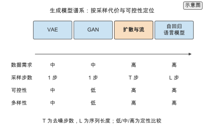

## 9.3 扩散与流模型

扩散与流模型把生成写成从噪声到数据的变换，用多步迭代换取更高的样本质量与多样性。

### 9.3.1 去噪扩散

去噪扩散模型（denoising diffusion probabilistic model, DDPM）定义前向加噪过程

$$q(x_t\mid x_{t-1})=\mathcal N\big(x_t;\sqrt{1-\beta_t}\,x_{t-1},\ \beta_t I\big),$$

逐步把数据变成标准高斯噪声；反向过程学习去噪

$$p_\theta(x_{t-1}\mid x_t)=\mathcal N\big(x_{t-1};\mu_\theta(x_t,t),\ \Sigma_t\big).$$

训练简化为预测噪声 $\epsilon_\theta(x_t,t)$ 的均方误差，采样需从 $x_T$ 迭代 $T$ 步回到 $x_0$。采样代价随步数线性增长，这是扩散模型相对单步生成器的主要代价。

### 9.3.2 离散扩散与流匹配

高分子序列是离散 token，连续扩散不能直接套用。离散扩散在类别分布上定义加噪与去噪，用转移矩阵或掩码把 token 逐步替换为随机或掩码状态。流匹配（flow matching）学习从先验到数据的速度场

$$\frac{\mathrm dx_t}{\mathrm dt}=v_\theta(x_t,t),$$

用常微分方程求解器采样，步数可少于扩散且可用自适应求解。离散扩散与流匹配都适合在 PSMILES 或 BigSMILES 的 token 序列上生成，且天然支持掩码补全式的条件生成。

> **图 9-2：扩散过程（已配正文图）**
>
> 以时间轴画出前向加噪与反向去噪两个方向，标出 $x_0$、中间 $x_t$ 与 $x_T$ 以及噪声预测网络的作用。
>
> 已制作：[SVG](../../manuscripts/ch09/figure-9-2-diffusion.svg)／[PNG](../../manuscripts/ch09/figure-9-2-diffusion.png)。

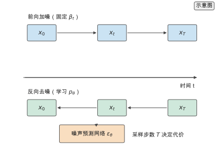

> **实验 9-1 ★〔核心〕：生成模型采样代价**
>
> 核算 VAE、GAN、扩散与自回归四类模型生成 $N$ 个分子所需的网络前向次数、FLOPs 与 GPU 时间，说明采样代价与模型族、序列长度的关系。参数写在题干中：$N=10^{4}$ 个 PSMILES、平均长度 80 token、扩散 1000 步、自回归逐 token、单步前向 FLOPs 取第 6 章的声明值、GPU 峰值与效率同第 5 章。
>
> 条件：进阶 · `calculations/gnn-forward`、`gnn-forward-4layer` 与 `gnn-forward-sum` 结果。
>
> **记录结果（9-1）：** 单步生成器（VAE、GAN）代价最低，自回归随序列长度线性增长，扩散因 $T$ 步迭代代价最高；扩散与流匹配用采样步数换取质量与多样性。完整记录见 [实验 9-1](../../experiments/ch09/09-01/README.md)。

## 9.4 自回归与语言模型

自回归模型把结构写成 token 序列，用链式分解逐位生成；在化学语料上预训练的语言模型把这一能力迁移到高分子。

### 9.4.1 序列生成

自回归生成把联合分布分解为条件概率的乘积

$$p(x)=\prod_{i=1}^{L}p(t_i\mid t_{<i}),$$

逐位采样 token 直到结束符。温度参数调节分布尖锐程度，核采样（top-$k$ 与 top-$p$）在质量与多样性之间取舍。序列长度可由结束符或显式长度条件控制。自回归天然给出似然，便于计算样本概率与做条件生成。

### 9.4.2 PSMILES 语言模型

在 PSMILES 语料上预训练语言模型（如 PolyBERT），用掩码语言建模或自回归目标学习化学语法与局部模式，再在下游生成任务上微调。预训练语料来自 PI1M 等百万级虚拟库，覆盖了合法结构与常见子结构，因此生成样本的有效性显著高于从零训练。语言模型还能同时承担性质预测与条件生成：编码器给出表示、解码器给出结构，两者共享同一套 token 词表。

> **实验 9-2 ★〔核心〕：有效性、唯一性与新颖性**
>
> 从 VAE、GAN、扩散与自回归四种模型各采样 10000 个 PSMILES，按同一规范化流程计算有效性、唯一性与新颖性，并检查各指标之间是否存在此消彼长。参数写在题干中：训练集为 PI1M 子集、采样数 10000、规范化用 RDKit、新颖性以训练集与已知库为参照。
>
> 条件：进阶 · `calculations/descriptor-budget`、`pi1m-2020` 与 `polybert-2023`。
>
> **记录结果（9-2）：** 自回归与扩散的有效性与新颖性同时较高，GAN 的多样性最低，VAE 在潜空间插值区生成较多无效结构；必须同时报告三项指标才能判断模型是否可用。完整记录见 [实验 9-2](../../experiments/ch09/09-02/README.md)。

## 9.5 条件与可控生成

无条件生成给出分布中的任意样本，实际设计需要满足目标性质与组成约束的样本，这就需要条件与可控生成。

### 9.5.1 性质条件

条件生成建模 $p(x\mid c)$，$c$ 为目标性质。条件注入有三种方式：把 $c$ 与输入拼接或作为前缀送入解码器；用交叉注意力让生成过程查询条件表示；以及在采样时用外部性质预测器的梯度引导。无分类器引导在训练时随机丢弃条件，采样时用有、无条件预测的差放大条件作用。条件的满足率必须用独立性质预测器在留出集上验证，而不能只看生成器自己的输出。

### 9.5.2 序列与组成控制

高分子比小分子多出序列与组成自由度，可控生成要能指定共聚组成、嵌段长度、序列类型与分子量。用 BigSMILES 的随机结构语法把组成写成条件，或用条件 token 显式标出序列块边界。可合成性作为硬约束前置：用可合成虚拟库（如 SMiPoly）过滤生成结果，或把反应可达性评分作为生成奖励。第 10 章的筛选漏斗与第 12 章的反应预测直接消费这一层约束。

> **图 9-3：条件生成（已配正文图）**
>
> 以生成器为中心，条件 $c$ 从左侧注入，右侧输出候选，下方接性质预测器与可合成性过滤，形成条件–生成–验证的回路。
>
> 已制作：[SVG](../../manuscripts/ch09/figure-9-3-conditional-generation.svg)／[PNG](../../manuscripts/ch09/figure-9-3-conditional-generation.png)。

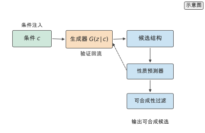

> **实验 9-3 ★〔核心〕：条件满足率**
>
> 用同一批条件生成模型采样候选，统计样本落入目标性质区间的比例、可合成性通过率与去重后的有效候选数，量化条件强度与多样性之间的权衡。参数写在题干中：目标为玻璃化转变温度区间、采样 10000 个、引导强度取三档、性质预测器与可合成性过滤器固定。
>
> 条件：进阶 · `calculations/learning-curve`、`smipoly-2023` 与 `open-macromolecular-genome`。
>
> **记录结果（9-3）：** 引导强度提高使条件满足率上升但多样性下降；把可合成性作为硬过滤后，有效候选数下降但可直接进入第 10 章筛选。完整记录见 [实验 9-3](../../experiments/ch09/09-03/README.md)。

## 9.6 生成模型族的统一模板

9.2 到 9.5 按模型族给出定义，本节把它们放进同一模板：basic idea、objective、sampling、advantages、weaknesses、polymer example、code example 七列对齐。采样列最可量化：以单步前向 $3.3\times10^{8}$ FLOPs 为基准（3.5 微秒为理想算术下界），$N=10^{4}$、长度 80 token 时，VAE / GAN 为 $10^{4}$ 次前向、$3.3\times10^{12}$ FLOPs、0.035 秒，掩码生成（20 轮）为 $2\times10^{5}$ 次、$6.5\times10^{13}$ FLOPs、0.7 秒，流匹配（50 步）为 $5\times10^{5}$ 次、$1.6\times10^{14}$ FLOPs、1.75 秒，自回归为 $8\times10^{5}$ 次、$2.6\times10^{14}$ FLOPs、2.8 秒，扩散（1000 步）为 $10^{7}$ 次、$3.3\times10^{15}$ FLOPs、35 秒。时间为理想算术下界，标 `[复算]`，未计入内存带宽、kernel launch、batch size、通信、I/O 与软件实现质量，不是实测。

> **图 9-4：生成模型族的统一模板（已配正文图）**
>
> 行是 VAE、GAN、自回归、扩散、流匹配与掩码生成，列是模板七项。
>
> 已制作：[SVG](../../manuscripts/ch09/figure-9-4-generative-template.svg)／[PNG](../../manuscripts/ch09/figure-9-4-generative-template.png)。

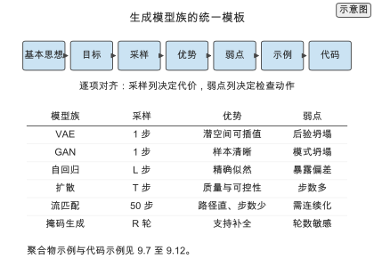

## 9.7 变分自编码器

### 9.7.1 ELBO 的直觉推导

由 $\log p_\theta(x)=\log\int p_\theta(x\mid z)p(z)\,\mathrm dz$，乘除近似后验并用 Jensen 不等式得到 $\mathcal L_\text{ELBO}$；ELBO 与对数似然之差是 $\mathrm{KL}(q_\phi(z\mid x)\,\|\,p_\theta(z\mid x))$。取高斯后验与标准正态先验，KL 有闭式；重参数化使梯度可回传。

### 9.7.2 采样、潜空间操作与后验坍塌

采样是单步的。潜空间支持插值、算术与优化。后验坍塌的判据是每维 KL 贡献 $\mathrm{KL}_j=-\frac{1}{2}(1+\log\sigma_j^{2}-\mu_j^{2}-\sigma_j^{2})$ 趋零；缓解用 KL 退火、自由比特与降低解码器容量。

### 9.7.3 聚合物适配与代码示例

PSMILES token 序列、连接点整体 token、分子量作为条件向量。PolyVAE 用语法指导解码并加入链端匹配约束；polyBART 与 polyGen 分别用序列与图结构做聚合物生成。代码给出编码器、重参数化与 VAE 损失。

> **图 9-5：VAE 的 ELBO 与潜空间（已配正文图）**
>
> (a) 训练路径为编码器、重参数化与解码器，损失是重建项与 KL 项；(b) 采样为单步，潜空间支持插值。
>
> 已制作：[SVG](../../manuscripts/ch09/figure-9-5-vae-latent.svg)／[PNG](../../manuscripts/ch09/figure-9-5-vae-latent.png)。

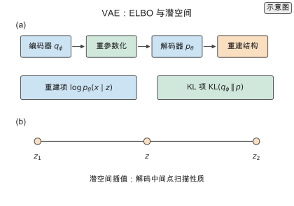

## 9.8 生成对抗网络

### 9.8.1 目标函数与最优判别器

固定 $G$ 时最优判别器 $D^{*}(x)=p_\text{data}/(p_\text{data}+p_g)$，代回目标得 $2\,\mathrm{JSD}(p_\text{data}\|p_g)-\log 4$。分布不重叠时 JSD 梯度接近零，训练停滞。

### 9.8.2 训练稳定性、模式覆盖与评价

Wasserstein 距离与梯度惩罚、谱归一化、小批量判别分别针对梯度消失、判别器过强与模式坍塌。GAN 无显式似然，分子生成只能用样本侧指标与下游命中率。

### 9.8.3 聚合物适配与代码示例

离散 token 的三种可微化：Gumbel-softmax、策略梯度、连续嵌入判别。PolyGAN 共享判别器与性质头；MolGAN 用强化学习奖励做条件生成。代码给出 WGAN 损失与训练步。

> **图 9-6：GAN 的博弈与模式坍塌（已配正文图）**
>
> (a) 判别器与生成器的交替更新；(b) 生成分布对数据分布的覆盖。
>
> 已制作：[SVG](../../manuscripts/ch09/figure-9-6-gan-game.svg)／[PNG](../../manuscripts/ch09/figure-9-6-gan-game.png)。

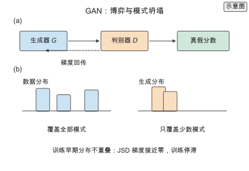

## 9.9 自回归模型

### 9.9.1 似然分解与采样策略

$p(x)=\prod_i p(t_i\mid t_{<i})$，teacher forcing 训练，交叉熵损失。采样策略：贪心、温度、top-$k$、top-$p$。优势是精确似然，劣势是采样不可并行、代价随长度线性增长。

### 9.9.2 长度控制、终止与暴露偏差

长度由结束符或长度条件控制；长度分布偏移通过分子量影响下游性质。暴露偏差使误差在长序列上累积，检查方法是按位置统计解析失败率。

### 9.9.3 聚合物适配与代码示例

字符级、原子级、子结构级三种 token 粒度；连接点与括号需整体 token。TransPolymer 报告十个下游数据集平均 RMSE 0.61、平均 $R^{2}=0.73$[文献]。代码给出温度与 top-$p$ 采样。

## 9.10 扩散模型

### 9.10.1 去噪目标的三种等价写法

由单步加噪式解出 $x_0=(x_t-\sqrt{1-\bar\alpha_t}\epsilon)/\sqrt{\bar\alpha_t}$；分数与噪声预测差一个缩放 $\nabla\log q\approx-\epsilon_\theta/\sqrt{1-\bar\alpha_t}$。三种参数化的差别在训练权重，EDM 的预条件在两端之间做加权。

### 9.10.2 采样步数与加速

DDPM 的 $T$ 步马尔可夫链；DDIM 确定性跳步到 50 至 100 步；分数视角的概率流 ODE 与蒸馏。代价随有效步数线性增长。

### 9.10.3 离散序列扩散与聚合物适配

嵌入空间扩散或单纯形扩散；连接点与括号用吸收态保护；长度用填充 token 或条件；性质条件用无分类器引导。三维结构用等变扩散。

### 9.10.4 代码示例

给出加噪、噪声预测损失与 DDPM 采样循环。

> **图 9-7：扩散与流匹配的采样路径（已配正文图）**
>
> 横轴是先验到数据的插值路径，纵轴是噪声水平；扩散走带噪声的曲线，流匹配走近似直线。
>
> 已制作：[SVG](../../manuscripts/ch09/figure-9-7-diffusion-flow.svg)／[PNG](../../manuscripts/ch09/figure-9-7-diffusion-flow.png)。

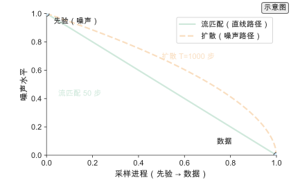

## 9.11 流匹配与连续归一化流

### 9.11.1 连续归一化流与瞬时变量替换

可逆变换下 $p_x(x)=p_z(f^{-1}(x))|\det\partial f^{-1}/\partial x|$；连续时间流满足 $\mathrm d\log p(x_t)/\mathrm dt=-\nabla\cdot v_\theta(x_t,t)$。Neural ODE 用伴随法反向传播。

### 9.11.2 流匹配目标与路径选择

条件流匹配目标 $\mathcal L_\text{FM}=\mathbb E\|v_\theta(x_t,t)-(x_1-x_0)\|^{2}$ 与 CNF 极大似然同梯度。线性路径步数少；rectified flow 通过重排配对使轨迹更直。

### 9.11.3 聚合物适配与代码示例

token 嵌入空间、概率单纯形或连续描述符三条连续化路线；性质条件与时间步拼接。代码给出流匹配损失与 ODE 采样。

## 9.12 掩码生成

### 9.12.1 从掩码语言建模到掩码生成

MLM 训练时随机掩码；生成时掩码比例从 1 降到 0。MaskGIT 并行迭代解码；掩码扩散给出似然界。

### 9.12.2 迭代解码与任意顺序生成

初始化全掩码；每轮预测所有掩码位置，按置信度确定比例 $\gamma$，降低掩码比例，重复。轮数 $R$ 决定代价与质量；支持序列补全。

### 9.12.3 聚合物适配与代码示例

连接点作为不可掩码锚点；组成或序列条件写成掩码模式；记录轮数与比例。代码给出迭代解码。

> **图 9-8：掩码生成的迭代解码（已配正文图）**
>
> 从全掩码出发，每轮并行预测并按置信度确定一部分 token。
>
> 已制作：[SVG](../../manuscripts/ch09/figure-9-8-masked-decoding.svg)／[PNG](../../manuscripts/ch09/figure-9-8-masked-decoding.png)。

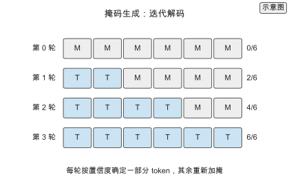

## 9.13 高分子特有的生成挑战

### 9.13.1 重复单元有效性

为什么难：语法正确不等于化学合理。怎么检查：价态、环闭合、最大片段，分开报告语法有效与化学有效。失败后果：validity 掩盖化学合理性缺口。

### 9.13.2 聚合连接性

为什么难：连接点必须成对且位于可聚合位置。怎么检查：连接点数、配对、位点。失败后果：分子层面有效、聚合物层面无效。

### 9.13.3 组成

为什么难：组成隐式或序列信息丢失。怎么检查：摩尔分数与目标比较。失败后果：性质预测失效。

### 9.13.4 序列

为什么难：序列空间 $N^{L}$，$N=10$、$L=100$ 时 $10^{100}$[复算]。怎么检查：分辨率、嵌段长度、序列熵。失败后果：分辨率与性质敏感尺度错配。

### 9.13.5 架构

为什么难：支化与网络的生成空间远大于线性链。怎么检查：支化点、交联点、凝胶分数。失败后果：流变与力学偏离且不可合成。

### 9.13.6 分子量

为什么难：合成给分布不是一个数。怎么检查：长度分布距离而非均值。失败后果：通过链端与缠结影响性质。

### 9.13.7 可合成性

为什么难：满足规则库组合语法的比例低到 $5.7\times10^{-69}$[复算]（理论序列组合空间占比，非实验可及范围；真实可合成性见第 12 章）。怎么检查：可合成库硬过滤、SA 分与逆合成打分。失败后果：采样预算浪费在做不出的结构上。

> **图 9-9：高分子特有的生成挑战（已配正文图）**
>
> 七项按生成侧到设计侧排布，每项给出怎么检查与失败后果。
>
> 已制作：[SVG](../../manuscripts/ch09/figure-9-9-polymer-challenges.svg)／[PNG](../../manuscripts/ch09/figure-9-9-polymer-challenges.png)。

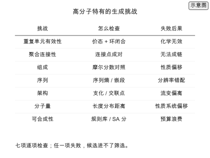

## 9.14 生成评价：指标与陷阱

### 9.14.1 五项指标与计算口径

五项指标的分母与参照：validity 分母是采样总数、参照是价态与连接性；uniqueness 分母是有效数、参照是规范化；novelty 分母是去重数、参照是训练集加已知库；CSR 分母是有效数、参照是独立预测器；synthesizability 分母是有效数、参照是规则库或逆合成模型。

### 9.14.2 指标陷阱

validity 只查语法；uniqueness 分母可选；novelty 依赖参照集；CSR 常自报；可合成性用代理；长度偏置被平均掩盖；指标此消彼长。

### 9.14.3 评价协议

固定六件事：参照集、规范化流程、性质预测器、可合成性过滤器、采样参数、采样数与种子。本书未开展生成模型的训练与采样基准。

> **图 9-10：生成评价的指标与陷阱（已配正文图）**
>
> 左侧五项指标，右侧每项陷阱与检查动作。
>
> 已制作：[SVG](../../manuscripts/ch09/figure-9-10-metric-pitfalls.svg)／[PNG](../../manuscripts/ch09/figure-9-10-metric-pitfalls.png)。

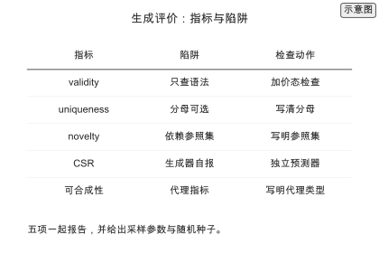

## 9.15 条件生成：实现与失败模式

### 9.15.1 性质条件的实现

拼接、交叉注意力、引导三种注入；无分类器引导用 $\tilde\epsilon_\theta(x_t,t\mid c)=\epsilon_\theta(x_t,t\mid\varnothing)+w(\epsilon_\theta(x_t,t\mid c)-\epsilon_\theta(x_t,t\mid\varnothing))$，$w$ 按可用候选数选择。

### 9.15.2 组成条件的实现

条件 token 或 BigSMILES 随机结构语法；组成漂移是主要失败模式，解决方式是把组成写成硬约束。

### 9.15.3 序列条件的实现

块边界 token、掩码模式或前缀条件；条件泄漏是主要失败模式，诊断是比较有条件与无条件生成的目标属性分布。

### 9.15.4 条件生成的失败模式

条件与预测器不匹配、引导过度、条件冲突、分布外条件，各给出检查动作。

> **图 9-11：条件生成的实现与失败模式（已配正文图）**
>
> 左侧三类条件的注入位置，右侧四类失败模式与检查动作。
>
> 已制作：[SVG](../../manuscripts/ch09/figure-9-11-conditional-failures.svg)／[PNG](../../manuscripts/ch09/figure-9-11-conditional-failures.png)。

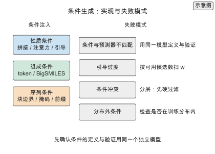

## 9.16 生成模型的选型与 Worked example

### 9.16.1 选型判据

四步：写清输出空间与条件、按采样预算排除、按弱点核对、按可合成性过滤。判据输出是给定预算下产出最多可用候选的模型。

### 9.16.2 Worked example：采样代价与候选产出核算

预算 $10^{4}$ 分子、长度 80 token、单步 $3.3\times10^{8}$ FLOPs 与 3.5 微秒[复算]，五类模型的 GPU 时间依次为 0.035、0.7、1.75、2.8、35 秒。五项指标取 $0.9,0.8,0.5,0.3,0.5$[示意]时可用候选比例 0.054，$10^{4}$ 采样约 540 个可用候选[复算]。本书未开展生成模型的训练与采样基准。

### 9.16.3 结论

三条结论：同一协议与预算下比较、采样代价由每分子前向次数决定、可用候选数是五项指标乘积。

## 9.17 练习与实验清单

核心练习 9-1 至 9-3，延伸练习 9-4 至 9-7（潜空间维度与后验坍塌、序列长度分布与终止、流匹配与扩散的步数—质量核算、高分子七项生成挑战的检查）。延伸练习题干与记录见扩写资料。

## 本章的设计决定

**D-10 生成模型按 VAE/GAN→扩散→自回归组织，评价指标在 9.1 定义：** 生成任务与有效性、唯一性、新颖性、可合成性、条件满足率在 9.1 定义一次，第 10 章的筛选与第 14 章的基础模型直接引用同一套指标。

**D-32 生成评价三件套：** 任何生成结果同时报告有效性、唯一性与新颖性，并说明参照集与规范化流程；只报其中一项或参照集不明确的数字不进入正文。

**D-33 可合成性前置：** 生成阶段即用可合成虚拟库与反应可达性过滤候选，不把可合成性问题全部留到第 12 章；可合成性作为硬约束或生成奖励，与第 10 章的筛选漏斗衔接。

## 写作资料

- 生成对抗网络生成聚合物：[PolyGAN](../../references/sources.tsv)（`polygan-2020`）。
- 聚合物语言模型：[PolyBERT](../../references/sources.tsv)（`polybert-2023`）。
- 百万级虚拟库：[PI1M](../../references/sources.tsv)（`pi1m-2020`）。
- 可合成虚拟库：[SMiPoly](../../references/sources.tsv)（`smipoly-2023`）与 [Open Macromolecular Genome](../../references/sources.tsv)（`open-macromolecular-genome`）。
- 随机结构表示：[BigSMILES](../../references/sources.tsv)（`bigsmiles-2019`）。
- 复算工具：[calculations/README.md](../../calculations/README.md)与[写作支持](writing-support.md)。
