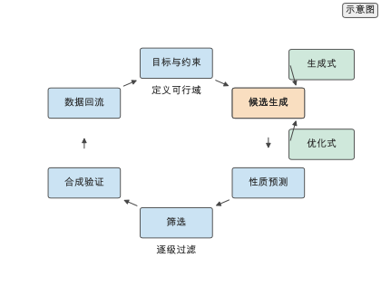
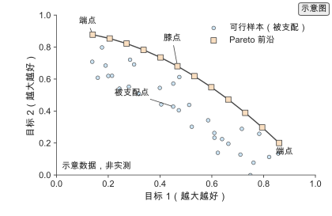
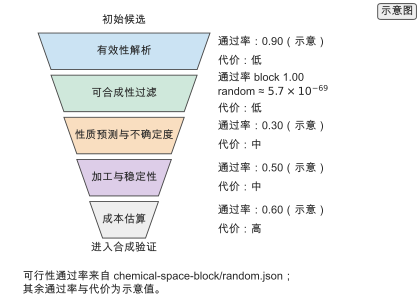
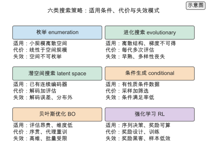
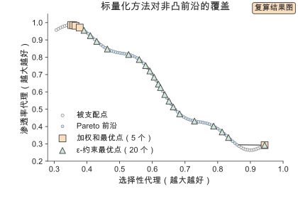
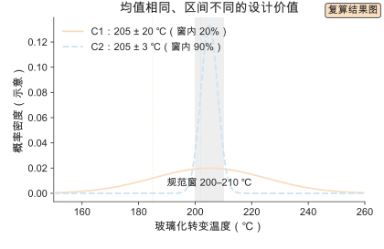
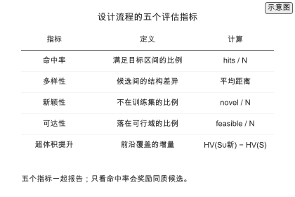
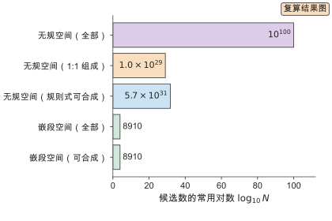
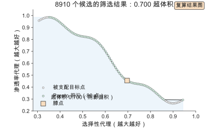

# 第 10 章 逆向设计与多目标材料设计

> 写作大纲 · Pareto、搜索策略、稳健设计与筛选漏斗 · 2026-09-17

开篇安排：从一个具体的设计任务写起——为一款二氧化碳分离膜找到候选聚合物，要求同时满足高选择性、高渗透率、可溶液加工与热稳定。性质之间互相牵制：提高链刚性通常提高选择性却降低渗透率，增加极性基团改善选择性却可能牺牲加工性。正向模型能从结构算性质，逆向设计却要从目标性质反推结构，而且目标不止一个、约束不止一条。本章把逆向设计写成带约束的多目标优化问题，给出 Pareto 前沿、搜索策略、稳健设计与筛选漏斗，并把候选一路缩到可合成、可验证的规模。

**本章判断：** 逆向设计的难点不在优化算法，而在可行域与多目标：可行域由可合成、可加工与稳定性约束共同定义，多个目标冲突时只能给出 Pareto 前沿；判断一个设计流程是否有效，看它在给定预算下把海量候选缩到可验证规模的比例。

**前置与交付：** 需要第 9 章的生成模型与第 6 章的性质预测与不确定度，以及第 2 章的表示。读完本章，读者能把一个设计需求写成目标与约束，判断搜索空间是否可枚举并选择搜索策略，求解或逼近 Pareto 前沿，用生成与优化两种方式产生候选，用「均值加区间」做稳健排序，并搭建从候选到合成验证的筛选漏斗。

**阅读安排：** 正文实验为实验 10-1 至 10-3，均为核心；实验 10-4 至 10-7 为延伸，放在扩写资料中。10.1 定义问题，10.2 与 10.4 分别给出优化式与生成式两条路线，10.3 处理多目标权衡，10.5 收束到筛选漏斗；10.6 并列搜索空间与六类搜索策略，10.7 展开多目标标量化与超体积，10.8 讨论约束施加的位置，10.9 给出稳健设计与「均值加区间」排序，10.10 给出评估指标，10.11 走通 Worked example，10.12 到 10.16 回顾代表工作、做定量对比、给实践流程与选型决策。做工程设计的读者可先读 10.1、10.5、10.6、10.9、10.11、10.14 与 10.15。证据标签用全书六级（实验、公开实验数据、模拟、复算、文献、示意），本章正文只出现复算与示意两级；筛选漏斗的评估代价为无量纲相对单位，不是墙钟时间。

## 10.1 逆向设计问题

逆向设计把"结构到性质"的正向映射反过来求解，它与第 8 章的反问题同源，但目标不是重建唯一结构，而是在可行域内找到满足多目标的候选集合。

### 10.1.1 正问题与逆问题

正问题给定结构 $x$ 求性质 $y=f(x)$，逆问题给定目标 $y^*$ 求结构 $x^*\in f^{-1}(y^*)$。逆问题通常多解甚至不可解：多个结构给出同一性质，目标组合可能落在可达性质集之外。区分多解与不可达：原像基数 $|f^{-1}(y^*)|$ 大是多解，等于零是不可达。处理方式是引入先验与约束、接受多解、用不确定度标记低置信区，并先估计可达集。

### 10.1.2 目标与约束

把设计需求拆成目标与约束。目标是要优化的性质；约束是必须满足的条件。硬约束不可违反，软约束允许以代价换取。可行域 $\mathcal F=\{x:g_j(x)\le0,\ h_k(x)=0\}$ 往往远小于化学空间，且可能不连通。可行域的相对体积与连通性决定搜索策略：比例极小时必须先构造性产生可行候选，不连通时用多起点或群体方法。

> **图 10-1：逆向设计闭环（已配正文图）**
>
> 以闭环画出"目标与约束→候选生成→性质预测→筛选→合成验证→数据回流"的流程，标出生成式与优化式两条候选来源。
>
> 已制作：[SVG](../../manuscripts/ch10/figure-10-1-inverse-design-loop.svg)／[PNG](../../manuscripts/ch10/figure-10-1-inverse-design-loop.png)。

## 10.2 优化式逆向设计

优化式逆向设计把问题写成在结构空间上求极值，用代理模型替代昂贵的性质评估。

### 10.2.1 目标函数

给出 $\max_{x\in\mathcal F}\hat f(x)$ 与无梯度方法：遗传算法、模拟退火、可微表示上的梯度上升。代理模型误差直接进入最优解，改用采集函数 $\hat f(x)+\kappa\hat\sigma(x)$；说明 $\kappa$ 是风险偏好的显式表达，且代理误差有方向性，需要分布外过滤。

### 10.2.2 约束与可行域

约束处理分三种：罚函数 $\hat f(x)-\lambda\sum_j\max(0,g_j(x))$、投影 $\Pi_{\mathcal F}(x)$ 与重参数化 $x=\phi(u)$。说明三者分别在什么时候付代价：罚函数让不可行解留在评估里，投影每步解子问题，重参数化把约束编译进生成器。可合成性常用硬过滤。

## 10.3 多目标与权衡

多目标之间通常无法同时最优，正确的交付是 Pareto 前沿而非单点。

### 10.3.1 Pareto 前沿

给出支配关系与 Pareto 前沿定义 $\mathcal P=\{x\in\mathcal F:\nexists x'\in\mathcal F,\ x'\preceq x\}$，超体积 $\mathrm{HV}(\mathcal S)=\Lambda(\bigcup_{x\in\mathcal S}[f(x),r])$。说明支配关系假设目标精确可比；区间重叠时应改用区间支配。

> **图 10-2：Pareto 前沿（已配正文图）**
>
> 在二维目标平面上画出可行域样本、Pareto 前沿曲线与几个被支配点，标出前沿端点与膝点；膝点是边际收益骤降处，常作为默认折中；端点对应单一目标的极限。
>
> 已制作：[SVG](../../manuscripts/ch10/figure-10-2-pareto-front.svg)／[PNG](../../manuscripts/ch10/figure-10-2-pareto-front.png)。

> **实验 10-1 ★〔核心〕：Pareto 前沿**
>
> 对同一组候选与两个冲突目标计算 Pareto 前沿，比较加权和、ε-约束与切比雪夫标量化在覆盖前沿形状上的差异，说明权重法为什么无法覆盖非凸前沿段。参数写在题干中：候选集 $10^{4}$ 个、目标为选择性与渗透率、三种标量化方法、各生成 50 个解。
>
> 条件：进阶 · `calculations/learning-curve` 与 `gas-separation-ml-2020`。
>
> **记录结果（10-1）：** 加权和只能覆盖凸前沿段，ε-约束与切比雪夫可覆盖非凸段；前沿膝点对应两种性能较均衡的候选。完整记录见 [实验 10-1](../../experiments/ch10/10-01/README.md)。

### 10.3.2 标量化与偏好

把多目标化为单目标有三类方法：加权和、$\varepsilon$-约束与切比雪夫。权重由设计者给出，必须做敏感性分析；给出翻转率定义，并说明目标值差异小于预测区间宽度时两个解不可分辨，应都保留到验证。

## 10.4 生成式逆向设计

生成式逆向设计直接建模目标性质条件下的结构分布，用采样替代优化，天然给出多样候选。

### 10.4.1 条件生成

用条件生成建模 $p(x\mid c)$，采样后筛选。给出条件满足率 $\mathrm{CSR}$；说明采样量按 $1/p_c$ 放大，$p_c$ 低于 0.01 时应改条件形式；说明点条件、区间条件与序条件对 $p_c$ 的影响。

### 10.4.2 潜空间优化

在连续潜空间上优化 $z^*=\arg\max_z\hat f(\mathrm{Dec}(z))$，说明解码误差界与解码–评估–再优化迭代。给出两种失效模式：解码不可靠区（用重编码距离诊断）与潜空间维度选择。说明高分子潜空间需要同时携带链长与序列。

## 10.5 从候选到材料

候选只有经过多级筛选与合成验证才算落地，筛选漏斗把每一步的过滤比与代价显式化。

### 10.5.1 筛选漏斗

漏斗由若干级过滤组成。给出 $N_k=N_0\prod_i r_i$ 与总代价公式，说明廉价且低通过率的过滤前置的收益；给出无规空间与嵌段空间可合成通过率的量级，并注明是理论序列组合空间占比。补充区间判据在漏斗中的作用。

> **图 10-3：筛选漏斗（已配正文图）**
>
> 以倒三角画出五级过滤，标出每级输入输出规模、通过率与单次评估代价，底部为进入合成验证的候选。代价为无量纲相对单位，不是墙钟时间。
>
> 已制作：[SVG](../../manuscripts/ch10/figure-10-3-screening-funnel.svg)／[PNG](../../manuscripts/ch10/figure-10-3-screening-funnel.png)。

> **实验 10-2 ★〔核心〕：筛选漏斗**
>
> 给定各过滤级的通过率与单次评估代价，核算从初始候选到可验证规模所需的评估次数与总代价，比较不同过滤顺序的差异，说明把廉价过滤前置的收益。参数写在题干中：初始候选 $10^{6}$、五级过滤、通过率与代价见题干表、目标为把候选缩到 $10^{1}$。
>
> 条件：进阶 · `calculations/closed-loop` 与 `thermal-conductivity-ml-2019`。
>
> **记录结果（10-2）：** 廉价前置顺序的总评估次数比昂贵前置低一个数量级以上；漏斗把 $10^{6}$ 缩到 $10^{1}$ 时，实验验证只发生在末端。完整记录见 [实验 10-2](../../experiments/ch10/10-02/README.md)。

### 10.5.2 合成与验证

漏斗末端给出少量候选，进入合成与验证。给出权重微扰翻转率定义；说明合成路线由第 12 章给出、验证结果回流更新代理模型与可行域，负结果同样保留。

> **实验 10-3 ★〔核心〕：多目标权重**
>
> 在 Pareto 前沿上比较不同权重组合选出的候选，计算权重微扰下最优解的翻转率，说明偏好设置对最终选择的影响，并给出稳健的默认权重区间。参数写在题干中：两个目标、前沿上 50 个解、权重在 0.1–0.9 间扫描、微扰幅度 5%。
>
> 条件：进阶 · `calculations/learning-curve` 与 `polymer-genome-2018`。
>
> **记录结果（10-3）：** 膝点附近候选在权重微扰下最稳定，前沿端点附近翻转率高；默认权重应取在膝点区域。完整记录见 [实验 10-3](../../experiments/ch10/10-03/README.md)。

## 10.6 搜索空间与搜索策略

前五节把逆向设计写成优化问题，这一节回答前置问题：在什么样的空间上、用什么策略去搜。

### 10.6.1 搜索空间的规模与结构

把搜索空间按分辨率分成四个数量级：无规序列 $10^{100}$、1:1 组成约束 $1.0\times10^{29}$、满足规则库组合语法 $5.7\times10^{31}$、两嵌段 8910。说明有效维度与可行域体积，给出"能否枚举"的判据表。强调该比例是满足组合语法的理论序列占比，不是实验可及范围；真实可合成性由单体可得性、反应与动力学决定（第 12 章）。

### 10.6.2 六类搜索策略

并列六类策略：枚举、进化搜索、潜空间搜索、条件生成、贝叶斯优化与强化学习，每类给出适用条件、代价与失效模式。说明六类可以组合，组合顺序遵循"便宜且覆盖广的策略在前"。

> **图 10-4：六类搜索策略（已配正文图）**
>
> 六个策略按适用条件、代价与失效模式排布。
>
> 已制作：[SVG](../../manuscripts/ch10/figure-10-4-search-strategies.svg)／[PNG](../../manuscripts/ch10/figure-10-4-search-strategies.png)。

### 10.6.3 策略的代价与失效模式

把六类策略的评估次数、单次额外代价、主要失效模式与诊断信号列成表；说明诊断信号要写进流程，把搜索从"跑一次看结果"变成可监控流程。

## 10.7 多目标设计的展开

10.3 给出定义，这一节把标量化、权重敏感性与前沿覆盖展开到可计算的程度。

### 10.7.1 加权和与权重敏感性

用几何说明加权和只能覆盖凸包；用两嵌段算例量化覆盖率 $5/80=6.25\%$。说明权重敏感性用翻转率衡量，并给出"落在宽权重区间的点更稳健"的判据。

### 10.7.2 ε-约束与切比雪夫

给出 $\varepsilon$-约束与切比雪夫公式，用算例给出 $\varepsilon$-约束覆盖率 $20/80=25\%$；说明切比雪夫通过极小极大与权重扫描覆盖非凸段。给出三种方法对照表。

### 10.7.3 超体积与前沿覆盖

给出超体积定义与两嵌段算例的 $0.700$；说明超体积增量作为边际贡献与期望超体积提升采集函数。说明超体积依赖参考点，必须同时报告参考点与多样性。

> **图 10-5：标量化方法对非凸前沿的覆盖（已配正文图）**
>
> 灰点为被支配点，蓝线为 Pareto 前沿（80 点），橙色方块为加权和最优解（5 个），绿色三角为 ε-约束最优解（20 个）。数值来自声明代理模型的两嵌段枚举。
>
> 已制作：[SVG](../../manuscripts/ch10/figure-10-5-scalarization.svg)／[PNG](../../manuscripts/ch10/figure-10-5-scalarization.png)。

### 10.7.4 为什么交付 Pareto 前沿而非单点

给出三条理由：偏好常在前沿之后形成、前沿保留未来变化的空间、前沿让权重敏感性可计算。说明膝点是默认折中，端点对应单一目标极限。

## 10.8 可行域与约束的施加位置

约束什么时候施加，决定搜索是否浪费预算。

### 10.8.1 硬约束、罚函数与重参数化

三类约束处理方式并列：硬约束保证可行但可能截断搜索，罚函数简单但权重敏感，重参数化保证可行但限制可达结构。给出对照表，选择依据是违反约束的代价。

### 10.8.2 可合成性作为硬约束的位置

可合成性违反代价高，应作为硬约束并尽早施加。按空间规模与组合语法通过比例决定位置：可枚举且通过比例高时在筛选阶段过滤，通过比例极低时必须前移到生成阶段。用无规空间 $5.7\times10^{-69}$ 与嵌段空间 1.00 说明，并注明是理论序列组合空间占比、不是实验可及范围；真实可合成性见第 12 章。给出可合成性评分作为软约束的适用边界。

## 10.9 稳健设计与不确定度

真实预测给出的是均值加区间。均值相同、区间不同的候选，设计价值不同。

### 10.9.1 均值相同、设计价值不同

用 $T_g=205\pm20\ ^\circ\mathrm{C}$ 与 $205\pm3\ ^\circ\mathrm{C}$ 的例子：规范窗 $200$ 到 $210\ ^\circ\mathrm{C}$，把半宽当一倍标准差，窗内概率分别为 $0.197$ 与 $0.904$。说明均值相同不代表价值相同，并解释 $T_g$ 区间天生较宽的物理原因。

> **图 10-6：均值相同、区间不同的设计价值（已配正文图）**
>
> 画出两个均值相同、区间不同的正态曲线，灰色带为规范窗，虚线为各自下界，两条曲线用线型与文字标签区分。曲线为声明正态模型，概率由 `robust-ranking-tg` 复算。
>
> 已制作：[SVG](../../manuscripts/ch10/figure-10-6-robust-design.svg)／[PNG](../../manuscripts/ch10/figure-10-6-robust-design.png)。

### 10.9.2 均值加区间的排序准则

给出三种等价准则：下界准则 $s(x)=\hat\mu(x)-k\hat\sigma(x)$、概率准则 $\max_x\Pr[f(x)\in\mathcal C]$ 与区间支配。用 $185$ 与 $202$ 的下界说明均值并列时区间排序翻转。给出工程组合：先用区间支配删候选，再用下界或概率排序。

### 10.9.3 不确定度的来源与传播

区分四类来源：偶然不确定度、认知不确定度、分布外误差、表示或解码误差。给出一阶传播公式 $\sigma_y^2\approx\sum_i(\partial h/\partial z_i)^2\sigma_{z_i}^2$，说明链越长区间越宽。给出报告要求：必须同时给均值与区间，并注明定义与估计方法。

## 10.10 设计流程的评估

一个设计流程跑完，需要一组指标判断它是否有效。

### 10.10.1 命中率与可达性

给出命中率与可达性定义，说明分母必须写清；说明两者一起看能区分"约束对了但搜索不够好"与"搜索找到边界好点但效率低"。

### 10.10.2 多样性与新颖性

给出多样性与新颖性定义；说明多样性与命中率存在权衡，应同时报告；引用生成模型基准的有效性、唯一性、新颖性与命中率指标。

### 10.10.3 超体积提升与预算效率

给出边际超体积提升 $\Delta\mathrm{HV}_t$ 与预算效率；说明曲线趋平说明搜索接近饱和。给出五个指标的对照表。

> **图 10-7：设计流程的五个评估指标（已配正文图）**
>
> 表格给出命中率、多样性、新颖性、可达性与超体积提升的定义与计算。
>
> 已制作：[SVG](../../manuscripts/ch10/figure-10-7-evaluation-metrics.svg)／[PNG](../../manuscripts/ch10/figure-10-7-evaluation-metrics.png)。

## 10.11 Worked example：从 $10^{100}$ 到 8910 的枚举、筛选与 Pareto 排序

用两个真实的组合搜索空间走通一次完整流程。

### 10.11.1 任务与两个搜索空间

任务是用两种单体设计共聚物，两个互相牵制的目标。对比无规空间 $10^{100}$、1:1 组成约束 $1.0\times10^{29}$、满足规则库组合语法 $5.7\times10^{31}$ 与两嵌段 8910，并注明该比例是理论序列组合空间占比、非实验可及范围。

> **图 10-8：两个搜索空间的规模对比（已配正文图）**
>
> 横轴为候选数的常用对数，比较无规空间、组成约束、满足规则库组合语法与两嵌段空间。数值来自 `chemical-space-random.json` 与 `chemical-space-block.json`。
>
> 已制作：[SVG](../../manuscripts/ch10/figure-10-8-worked-space.svg)／[PNG](../../manuscripts/ch10/figure-10-8-worked-space.png)。

### 10.11.2 枚举与筛选

枚举两嵌段空间 $90\times99=8910$；组合语法通过比例 1.00；无规空间随机抽 $10^{6}$ 个的期望命中数是 $5.7\times10^{-63}$，远小于 1。说明 8910 个候选落在 99 个目标点、每点 90 个实现。

### 10.11.3 Pareto 排序与稳健排序

99 个目标点中 80 个非支配；超体积 $0.700$；膝点 $(0.6965,0.4547)$；加权和覆盖 5 点、ε-约束 20 点。说明稳健排序在目标点之外再加一层，用下界 $185$ 与 $202$ 说明翻转。

> **图 10-9：8910 个候选的 Pareto 排序（已配正文图）**
>
> 灰点为被支配目标点，绿色圆点为 80 个非支配目标点，蓝色阴影为超体积 $0.700$，橙色方块为膝点；每个前沿点对应 90 个结构不同的候选。数值来自声明代理模型的两嵌段枚举结果。
>
> 已制作：[SVG](../../manuscripts/ch10/figure-10-9-worked-pareto.svg)／[PNG](../../manuscripts/ch10/figure-10-9-worked-pareto.png)。

### 10.11.4 结论

结论三条：搜索空间的选择比搜索算法更靠前；可合成性过滤的位置由空间决定；交付的是前沿加稳健排序而非单点。

## 10.12 代表性工作与里程碑

按"候选从哪里来"与"如何用反馈"两条线回顾：潜空间与图生成模型、条件生成、进化搜索、闭环主动学习与失败实验利用；多目标一侧回顾 NSGA-II、ParEGO、期望超体积提升与超体积指标。给出闭环主动学习的论文 Box。

## 10.13 设计流程的定量对比

### 10.13.1 搜索策略对比

把六类策略按适合空间、评估预算、覆盖性与主要风险列成表。

### 10.13.2 标量化方法对比

把加权和、$\varepsilon$-约束与切比雪夫按凸段、非凸段、参数敏感性与本算例覆盖率列成表；切比雪夫标注未复算。

### 10.13.3 本书未覆盖的基准

列出未测项：六类策略在同一任务上的端到端对比、条件满足率、解码误差、多目标贝叶斯优化的超体积提升曲线、稳健排序对实验命中率的影响；给出补齐做法。

## 10.14 从设计需求到验证的实践流程

### 10.14.1 六步流程

六步：写清目标与约束、定义可行域并选约束处理方式、选搜索策略、生成与评估、Pareto 与稳健排序、合成验证与回流。

### 10.14.2 复现清单

给出逆向设计实验的复现清单，说明缺少任何一类信息，流程之间的差异都无法归因。

## 10.15 搜索策略选型决策指南

### 10.15.1 决策路径

给出六步决策路径与三种换策略信号。

### 10.15.2 任务—策略对照

给出任务、空间、评估代价、首选策略与理由的对照表；说明实际选型要代入评估预算、实验通量与工具链。

## 10.16 练习与实验清单

汇总核心练习 10-1 至 10-3 与延伸实验 10-4 至 10-7，给出主题、类型与记录位置。

## 本章的设计决定

**D-11 逆向设计与多目标独立成章，统一用筛选漏斗收束：** 优化式与生成式两条路线在本章并列，最终都收束到同一筛选漏斗；第 13 章的自动化平台与第 15 章的可持续设计直接复用漏斗结构。

**D-34 可行域先于目标：** 任何逆向设计先定义约束与可行域，再谈目标优化；不可合成、不可加工的结构在搜索前排除，避免把不可行解送入昂贵评估。

**D-35 交付 Pareto 前沿而非单点：** 多目标问题的输出是前沿与权重敏感性，由设计者在前沿上按偏好选点；单点最优只在权重明确且稳定时给出。

**D-36 搜索空间先于搜索策略：** 选择搜索策略前先估搜索空间规模与可枚举性；空间不可枚举时，讨论优化算法没有意义。

**D-37 稳健设计是默认交付：** 候选报告必须带不确定度，排序使用「均值加区间」准则；只给均值的候选不进入最终排序。

## 写作资料

- 膜分离筛选：[Machine learning–enabled high-throughput screening of polymers for gas separation](../../references/sources.tsv)（`gas-separation-ml-2020`）。
- 热导率分子设计：[Machine learning discovery of high thermal conductivity polymers](../../references/sources.tsv)（`thermal-conductivity-ml-2019`）。
- 多性质平台：[Polymer Genome](../../references/sources.tsv)（`polymer-genome-2018`）。
- 可合成虚拟库：[SMiPoly](../../references/sources.tsv)（`smipoly-2023`）。
- 聚合物语言模型：[PolyBERT](../../references/sources.tsv)（`polybert-2023`）。
- 逆向设计与生成式设计：Sanchez-Lengeling & Aspuru-Guzik（`inverse-design-review-2018`）、Gómez-Bombarelli 等（`gomez-bombarelli-2018`）、JT-VAE（`jtvae-2018`）、MolGAN（`molgan-2018`）、GCPN（`gcpn-2018`）、REINVENT（`reinvent-2017`）、条件生成（`conditional-gan-2014`、`conditional-mol-2018`、`cvae-mol-2018`）、图遗传算法（`jensen-2019`）。
- 多目标：NSGA-II（`nsga2-2002`）、ParEGO（`parego-2006`）、期望超体积提升（`ehvi-2020`）、超体积指标（`hypervolume-2003`）、多目标教程（`multiobjective-tutorial-2018`）。
- 不确定度与闭环：不确定度综述（`uncertainty-dnn-2021`）、闭环主动学习（`kusne-2020`）、主动学习（`lookman-2019`）、失败实验（`raccuglia-2016`）、贝叶斯优化（`bo-review-2018`、`snoek-2012`、`batch-bayesopt-2018`）。
- 复算工具：[calculations/README.md](../../calculations/README.md)与[写作支持](writing-support.md)。
