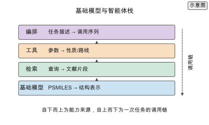
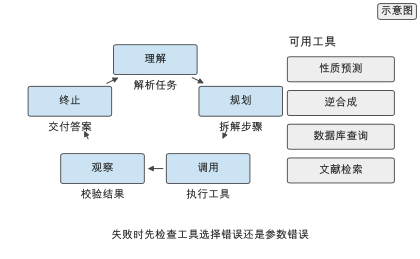
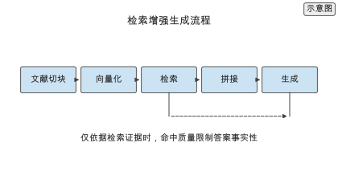
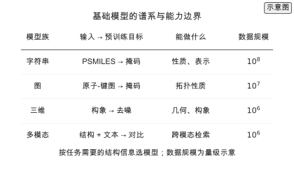
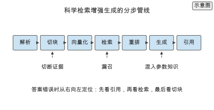
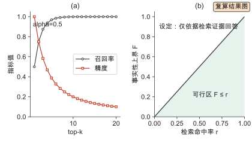
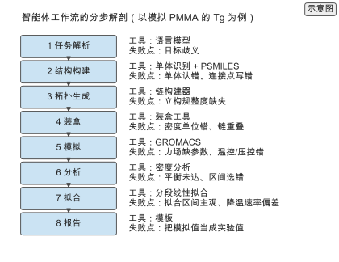
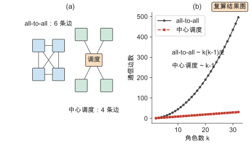
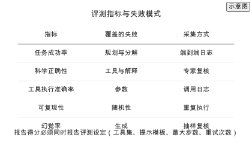
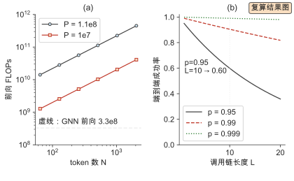

# 第 14 章 高分子基础模型与智能体系统

> 写作大纲 · 预训练、知识与工具 · 2026-09-16

开篇安排：给一个智能体一段任务描述——"找出三种 Tg 高于 200 °C 且可溶液加工聚酰亚胺，并给出合成路线"。它先检索文献，再调用性质预测工具，最后用逆合成工具给出路线。这一串动作把语言模型、检索、工具调用与领域模型串在一起。本章讨论这套系统能承担哪些环节、在哪里会出错。

**本章判断：** 基础模型与智能体的价值在于把分散的工具与文献连成可调用的工作流，而不在于替代领域模型；判断其可用性的标准是任务成功率与事实性，而不是对话流畅度。

**前置与交付：** 需要第 6、7 章的性质预测、第 9 章的生成模型。读完本章，读者能描述高分子基础模型的预训练范式，搭建检索增强生成（retrieval-augmented generation, RAG）流程，估算智能体的推理代价，并用基准评估幻觉与任务成功率。

**阅读安排：** 正文实验为实验 14-1 至 14-3，均为核心；实验 14-4 至 14-8 为延伸，放在扩写资料中。14.1 讲基础模型，14.2 讲知识，14.3 讲智能体，14.4 讲评估，14.5 讲集成；14.6 至 14.9 分别展开基础模型谱系、科学检索、智能体工作流与多智能体拓扑；14.10 至 14.16 给出评测、代价核算、定量对比、实践流程、选型决策、安全合规与练习。

## 14.1 基础模型

两条预训练路线把无标注结构转成可迁移表示：字符串上的掩码语言建模，与图或构象上的自监督。本节给出损失、数据规模与代价量级，并以聚合物语言模型为例说明领域模型的适用边界。

### 14.1.1 预训练范式

给出掩码语言建模损失与图/构象自监督两条路线，说明归纳偏置的差别，并给出预训练代价 $C \approx 6PD$ 的量级，指出数据规模与参数量要匹配。

### 14.1.2 高分子领域模型

以 PSMILES 为输入的聚合物语言模型（如 PolyBERT）参数量在 $10^{7}$–$10^{8}$ 量级，推理代价约 $2NP$ FLOPs；给出 $N=512$、$P=1.1\times10^{8}$ 的复算，并给出 FP16 权重存储约 220 MB。配论文 Box 记录语料、划分、baseline 与指标。

> **图 14-1：基础模型与智能体栈（已配正文图）**
>
> 以分层图展示基础模型、检索、工具与编排四层，标出各层的输入输出。
>
> 已制作：[SVG](../../manuscripts/ch14/figure-14-1-stack.svg)／[PNG](../../manuscripts/ch14/figure-14-1-stack.png)。

## 14.2 语言模型与知识

知识侧把文献变成可查询证据：抽取把数值、条件与方法写成字段，RAG 把片段与问题一起交给语言模型。本节给出抽取的评价与错误类型，以及检索质量对事实性的约束。

### 14.2.1 文献与知识抽取

讨论抽取流水线与三类错误（数值、单位、实体），给出 $P$、$R$、$F_1$ 的评价与标注规范，说明单位与实体规范化是抽取质量的一半。

### 14.2.2 检索增强生成

给出 RAG 流程与查询改写、多跳检索的失败模式。在「仅允许依据检索证据回答」的评测设定下，事实性上界受检索命中率 $r$ 约束，$F \le r$；放宽设定后上界不再由 $r$ 单独决定。

> **实验 14-1 ★〔核心〕：评估知识抽取的准确率**
>
> 在标注语料上评估性质数值与条件的抽取，计算精确率、召回率与 F1，并分析错误类型（单位、数值、实体）。样本量：200 条标注句。
>
> 条件：进阶 · 语言模型与标注数据。
>
> **记录结果（14-1）：** 数值抽取的 F1 高于条件抽取，单位与实体规范化是主要错误来源；报告各项指标与错误分布。完整记录见 [实验 14-1](../../experiments/ch14/14-01/README.md)。

## 14.3 智能体系统

智能体是一个循环：理解任务、选择工具、执行、观察结果、决定下一步。本节给出工具契约、规划失败分类、多智能体协作的代价，以及高分子任务特有的失败模式。

### 14.3.1 工具调用与规划

把智能体定义为循环，工具注册为"名称、用途、输入输出 schema、单位、错误码"六项；给出终止条件（目标达成、预算耗尽、不可恢复）与工具选择错误、参数错误两类规划失败。配论文 Box 记录 ChemCrow 与 Coscientist 的工具集与评测方式。

### 14.3.2 多智能体协作

讨论把任务分给若干角色并汇总。在 all-to-all 架构下 $k$ 个角色的通信次数按 $O(k^{2})$ 增长；中心调度或稀疏依赖降到 $O(k)$ 或与依赖边数同阶。多智能体的收益来自分工互补，不是角色数量。

### 14.3.3 高分子智能体的失败模式

四类失败：单体识别错误、PSMILES 解析错误、单位换算错误与工具参数错误。它们都发生在表示转换的边界上，拦截办法是在每个转换处放可检查的中间表示。配失败 Box 说明一次解析错误如何贯穿整条链。收束到通用模型负责编排、领域模型负责计算的可靠分工。

> **图 14-2：智能体的工具调用循环（已配正文图）**
>
> 以循环图展示理解、规划、调用、观察与终止五个步骤，旁标可用工具。
>
> 已制作：[SVG](../../manuscripts/ch14/figure-14-2-agent-loop.svg)／[PNG](../../manuscripts/ch14/figure-14-2-agent-loop.png)。

> **实验 14-2 ★〔核心〕：测量智能体任务成功率**
>
> 给定一组材料设计任务，让智能体调用工具完成，统计端到端成功率与平均工具调用次数，并按失败类型分类。任务数：50 个。
>
> 条件：进阶 · 智能体框架与工具接口。
>
> **记录结果（14-2）：** 端到端成功率随任务复杂度下降，参数错误多于工具选择错误；报告成功率与失败分布。完整记录见 [实验 14-2](../../experiments/ch14/14-02/README.md)。

## 14.4 评估与可靠性

评估以任务成功率与事实性为准。本节区分事实性与忠实性幻觉，给出三种事实性评估方法与三类基准指标。

### 14.4.1 幻觉与事实性

定义幻觉并区分事实性幻觉与忠实性幻觉；给出与数据库比对、专家复核与一致性检验三种方法及其组合顺序；指出 RAG 与工具调用降低但无法消除幻觉。

### 14.4.2 基准

基准覆盖事实性、工具使用与安全三类指标；说明单一指标不足以判断可用性，基准的可比性取决于评测设定（工具集、提示模板、最大步数、重试次数）。

> **图 14-3：检索增强生成流程（已配正文图）**
>
> 以流程图展示文献切块、向量化、检索、拼接与生成，标出检索质量对最终答案的影响路径。
>
> 已制作：[SVG](../../manuscripts/ch14/figure-14-3-rag.svg)／[PNG](../../manuscripts/ch14/figure-14-3-rag.png)。

> **实验 14-3 ★〔核心〕：核算基础模型的推理代价**
>
> 给定参数量、精度与序列长度，核算一次前向推理的显存与计算量，并与本地部署的可行性比较。参数：1.1 亿参数、FP16、序列长度 512。
>
> 条件：进阶 · `calculations/` 与纸笔。
>
> **记录结果（14-3）：** 模型权重约数百 MB，单次推理计算量在 $10^{10}$ FLOPs 量级，可在单卡或 CPU 上运行；报告显存与计算量。完整记录见 [实验 14-3](../../experiments/ch14/14-03/README.md)。

## 14.5 系统集成

系统集成的关键在接口。本节给出与计算和实验工具的接口设计，以及人机分工与介入点。

### 14.5.1 与计算和实验工具的接口

把领域模型、逆合成工具与实验平台封装成带类型的函数，输入输出用统一的数据契约；接口要把单位与条件写进签名，契约变更要版本化。

### 14.5.2 人机协作

人机分工：智能体负责检索、初筛与常规计算，人负责目标设定、异常判断、危险审批与最终决策。介入点按风险分级并记录到审计日志。

## 14.6 基础模型的谱系与能力边界

把基础模型按输入模态排成谱系，逐类给出预训练目标、数据规模与能力边界，回答"哪一类模型能承担哪一类环节"。

> **图 14-4：基础模型的谱系与能力边界（已配正文图）**
>
> 字符串、图、三维与多模态四类模型沿输入模态排布，各行给出典型输入、预训练目标与能力边界。
>
> 已制作：[SVG](../../manuscripts/ch14/figure-14-4-model-taxonomy.svg)／[PNG](../../manuscripts/ch14/figure-14-4-model-taxonomy.png)。

### 14.6.1 字符串与序列基础模型

三类预训练目标（掩码、因果、对比）与数据规模；能做性质预测、表示提取与检索，不能做三维几何与跨连接点生成；使用前必须规范化。

### 14.6.2 图与三维基础模型

图模型保留拓扑，粒度可选原子图、片段图与重复单元图；三维模型用去噪预训练，强项是几何性质与构象生成，弱项是构象采样质量与外推。给出 M3GNet 等通用图势的例子。

### 14.6.3 多模态基础模型

多模态用对比学习联合结构与其他模态，能做跨模态检索、零样本分类与条件生成，依赖配对数据；融合位置分早期、中期与晚期。

### 14.6.4 预训练目标与数据规模的对照

四类模型的输入、目标、规模、能力与边界的对照表；结论是四类模态互补、目标决定表示偏向、规模与模态决定成本。

## 14.7 科学检索增强生成

把"PDF → 片段 → 向量 → 检索 → 生成 → 引用"逐步展开，说明每步的选择、评价与失败点。

> **图 14-5：科学检索增强生成的分步管线（已配正文图）**
>
> 文献经解析、切块、向量化、检索、重排、生成与引用七步进入答案，旁标每步的典型失败点。
>
> 已制作：[SVG](../../manuscripts/ch14/figure-14-5-rag-pipeline.svg)／[PNG](../../manuscripts/ch14/figure-14-5-rag-pipeline.png)。

### 14.7.1 从 PDF 到片段：切块与规范化

解析版面、切块与元数据。切块粒度存在先升后降的可用块比例，最优块长依赖文档结构；块长与重叠要写进复现清单。配实践 Box 给出可复用的切块规范。

### 14.7.2 向量化、检索与重排

编码器要与查询语言分布匹配；向量检索、关键词检索与混合检索的取舍；重排在固定上下文预算下提高证据密度。给出倒数排名融合 RRF 的公式与去重规则。

> **图 14-6：检索评价（已配正文图）**
>
> (a) 声明排序模型下召回率随 top-$k$ 上升、精度随 top-$k$ 下降。(b) 在「仅依据检索证据」设定下，事实性上界等于检索命中率，可行区为 $F\le r$。参数为声明模型复算。
>
> 已制作：[SVG](../../manuscripts/ch14/figure-14-6-retrieval-eval.svg)／[PNG](../../manuscripts/ch14/figure-14-6-retrieval-eval.png)。

### 14.7.3 生成、引用与溯源

生成时显式要求答案只依据给定片段并逐句引用；引用要定位到具体位置，用引用精度与引用召回评价；溯源要求记录索引、编码器、重排模型与提示模板版本。

### 14.7.4 检索的评价与「仅依据检索证据」的评测设定

给出 Precision@k、Recall@k、nDCG 的定义与选择；把「仅依据检索证据回答」作为评测设定，说明 $F \le r$ 只在该设定下成立，放宽后需要额外核查引用来源。

## 14.8 智能体工作流的分步解剖

把智能体循环展开成一条具体工作流，逐步说明工具、输入输出、失败点与校验方式，并给出从任务描述到结果的完整例子。

> **图 14-7：智能体工作流的分步解剖（已配正文图）**
>
> 以"模拟 PMMA 的 $T_g$"为例，八步依次是任务解析、结构构建、拓扑生成、装盒、模拟、分析、拟合与报告；每步给出工具与典型失败点。
>
> 已制作：[SVG](../../manuscripts/ch14/figure-14-7-workflow.svg)／[PNG](../../manuscripts/ch14/figure-14-7-workflow.png)。

### 14.8.1 工具契约与规划

工具声明六项，规划给出依赖关系；规划粒度要与校验点对齐，拆分停在"错误可定位"的最小粒度。

### 14.8.2 记忆、状态与验证

工作记忆、情景记忆与外部记忆的分工；状态显式记录以支持回滚与审计；局部验证、交叉验证与一致性检验按风险分配。

### 14.8.3 Worked example：从任务描述到 PMMA 的 $T_g$

八步表给出工具、输入输出与失败点，逐步说明；配高分子物理 Box 解释模拟 $T_g$ 系统偏高的原因（降温速率）。

## 14.9 多智能体的拓扑与冲突消解

把通信拓扑与冲突消解展开，说明通信量如何随角色数与拓扑变化，以及角色冲突时如何收敛。

> **图 14-8：多智能体通信拓扑与代价（已配正文图）**
>
> (a) all-to-all、中心调度与稀疏依赖三种拓扑。(b) 通信数随角色数 $k$ 的变化，阶数由拓扑决定，不由角色数单独决定。
>
> 已制作：[SVG](../../manuscripts/ch14/figure-14-8-multiagent.svg)／[PNG](../../manuscripts/ch14/figure-14-8-multiagent.png)。

### 14.9.1 通信拓扑与代价

给出 all-to-all $\binom{k}{2}$、中心调度 $k-1$、稀疏依赖 $|E|$ 三种拓扑的边数，并用 $c\,|E|\,T$ 估通信总代价；配 ML Box 说明通信阶数取决于拓扑而非角色数。

### 14.9.2 分工、仲裁与冲突消解

分工按依赖图设计；冲突消解三层：数据契约、证据加权与仲裁；仲裁留痕，最优角色数由成功率与仲裁成本共同决定。

## 14.10 评测：指标、设定与敏感性

把评测指标与评测设定的敏感性展开，说明同一系统在不同设定下得分不同，以及如何报告才能归因。

> **图 14-9：评测指标与失败模式（已配正文图）**
>
> 任务成功率、科学正确性、工具执行准确率、可复现性与幻觉率五类指标各自覆盖一类失败；评测设定改变同一系统的得分。报告得分时必须同时报告设定。
>
> 已制作：[SVG](../../manuscripts/ch14/figure-14-9-eval-metrics.svg)／[PNG](../../manuscripts/ch14/figure-14-9-eval-metrics.png)。

### 14.10.1 五类指标

任务成功率、科学正确性、工具执行准确率、可复现性与幻觉率，给出各自的定义式与对应的失败模式，并说明要附样本量与置信区间。

### 14.10.2 评测设定的敏感性

设定至少含工具集、提示模板、最大步数与重试次数；报告得分必须同时报告设定，比较系统时固定设定只改被测对象。

## 14.11 Worked example：推理代价与任务成功率的核算

核算基础模型的单次推理代价，以及智能体任务的步数、成功率与总代价；数值来自声明模型并写明忽略项。

> **图 14-10：推理代价与成功率衰减（已配正文图）**
>
> (a) 单次前向 FLOPs（理想算术下界）随 token 数变化，标出 GNN 前向尺度对照。(b) 在各步独立且单步成功率同为 $p$ 的假设下，端到端成功率随调用链长度按 $p^{L}$ 衰减；长链任务的主要衰减源是单步错误率。
>
> 已制作：[SVG](../../manuscripts/ch14/figure-14-10-cost-success.svg)／[PNG](../../manuscripts/ch14/figure-14-10-cost-success.png)。

### 14.11.1 基础模型的推理代价

给出 $2NP$ 估计、忽略项与后端校准；与 GNN 前向对照时要同时比较单位与覆盖范围；训练、推理与工具代价分开记账。

### 14.11.2 智能体任务的步数与成功率

给出 $p^{L}$ 的数值（$p=0.95$、0.99 若干 $L$）；把计算交给确定性工具可提高有效 $p$；一条 $L$ 步任务的语言调用代价约 $L\cdot 2NP$。

### 14.11.3 代价与预算分配

预算分配原则：贵资源用在最少候选上；长链任务的预算要向校验倾斜，是否加校验取决于被拦截失败的下游代价。

## 14.12 定量对比

用声明模型的真实数字做代价对比，并明确标注证据等级与本书未测的部分。

### 14.12.1 模型与工具的代价对比

模型与工具的单位代价表：字符串前向、小模型前向、GNN 前向、权重存储、任务链；MD 与湿实验本书未测。

### 14.12.2 检索与智能体方案对比

检索适合"答案在文献中"的任务，智能体适合"多步操作"的任务；组合方案的代价与事实性收益；三类方案按"事实从哪来"区分。

### 14.12.3 本书未覆盖的基准

明确列出未测项：智能体端到端成功率、检索召回与精度、前向墙钟与能耗、多智能体增益、模拟 $T_g$ 偏差；没有真实 benchmark 的地方写"本书未测"。

## 14.13 实践流程

给出从文献到证据库、从任务到工具工作流的可复用步骤，以及复现清单。

### 14.13.1 从文献到证据库

收集解析、去重规范化、建索引、抽样评估四步；证据库区分事实与推断，推断当事实会放大错误。

### 14.13.2 从任务到工具工作流

定义工具契约、写分解模板、加校验点、小规模测量、上线并记录审计；契约版本化，失败样本按四类边界错误分类后回流。

### 14.13.3 复现清单

配可复现 Box 给出数据、代码、环境、种子与审计五类记录；与第 13 章的审计日志字段规范衔接。

## 14.14 选型决策

### 14.14.1 决策路径

六步：写清能力需求 → 按谱系选基础模型 → 判断是否需要检索 → 判断是否需要智能体 → 设计契约与校验并评测核算 → 需要多角色时按依赖图定拓扑。给出三种重新审视方案的信号。

### 14.14.2 任务—方案对照

任务、是否需要检索、基础模型、是否需要智能体与关键风险的对照表；表是默认起点，实际选型要代入指标、预算与数据完整度。

## 14.15 安全、合规与审计

智能体把能力从生成文本扩到执行操作，带来双重用途风险。本节给出危险操作分级、审批与审计，作为系统上线的必要条件。

### 14.15.1 危险操作与审批

工具按风险分级（低、中、高）；审批绑定到具体调用而不是任务；高风险查询做前置拦截，拦截规则定期复核。

### 14.15.2 审计日志与责任边界

审计日志记录每次调用的完整信息并不可篡改；责任边界写进文档与界面；人机分工分界线与 14.5.2 一致。

## 14.16 练习与实验清单

汇总核心练习 14-1 至 14-3 与延伸实验 14-4 至 14-8，给出主题、类型与记录位置。

## 本章的设计决定

**D-15 基础模型与智能体合并：** 两者共同回答"预训练与编排能承担哪些环节"，合并后避免重复讲预训练，并强调可靠性与集成。

**评估以任务成功率为准：** 本章用事实性、工具使用与端到端成功率评估，不用对话质量，与全书"以预算下的产出衡量"一致。

**接口稳定优先：** 智能体集成的关键在数据契约与工具接口，与第 13 章的实验数据管理衔接。

**事实性上界带设定：** $F \le r$ 只在「仅允许依据检索证据回答」的评测设定下成立，正文、速查与小结都保留该限定，不写成普适定律。

**通信阶数带前提：** 多智能体通信按 $O(k^{2})$ 增长只适用于 all-to-all；中心调度或稀疏依赖降到 $O(k)$ 或与依赖边数同阶，正文与图注都写明前提。

**证据标签六级与代价下界：** 全书证据标签升级为 `[实验]`、`[公开实验数据]`、`[模拟]`、`[复算]`、`[文献]`、`[示意]` 六级；本章只出现后三级，并在速查表前写明。所有计算代价（$6PD$、$2NP$、$p^{L}$、通信计数）都是理想算术下界，未计入内存带宽、kernel launch、batch size、通信、I/O 与软件实现质量，本书未在真实硬件上测量。

## 写作资料

- 聚合物语言模型：[PolyBERT](../../references/sources.tsv)（`polybert-2023`）与 [TransPolymer](../../references/sources.tsv)（`transpolymer-2023`）。
- 检索增强生成：[RAG](../../references/sources.tsv)（`rag-2020`）、[DPR](../../references/sources.tsv)（`dpr-2020`）、[Self-RAG](../../references/sources.tsv)（`self-rag-2024`）与 [RAG 综述](../../references/sources.tsv)（`rag-survey-2023`）。
- 引用与检索评测：[ALCE](../../references/sources.tsv)（`alce-2023`）、[Lost in the Middle](../../references/sources.tsv)（`lost-in-middle-2023`）与 [BEIR](../../references/sources.tsv)（`beir-2021`）。
- 智能体与工具调用：[ReAct](../../references/sources.tsv)（`react-2023`）、[Toolformer](../../references/sources.tsv)（`toolformer-2023`）、[Reflexion](../../references/sources.tsv)（`reflexion-2023`）、[AutoGen](../../references/sources.tsv)（`autogen-2023`）与[智能体综述](../../references/sources.tsv)（`agents-survey-2024`）。
- 化学智能体：[ChemCrow](../../references/sources.tsv)（`chemcrow-2023`）与 [Coscientist](../../references/sources.tsv)（`coscientist-2023`）。
- 分子基础模型：[Uni-Mol](../../references/sources.tsv)（`unimol-2023`）、[MolFormer](../../references/sources.tsv)（`molformer-2022`）与 [MoleculeSTM](../../references/sources.tsv)（`moleculestm-2023`）。
- 表示基础：[SMILES](../../references/sources.tsv)（`smiles-1988`）与 [BigSMILES](../../references/sources.tsv)（`bigsmiles-2019`）。
- 复算工具：[calculations/README.md](../../calculations/README.md)与[写作支持](writing-support.md)。
