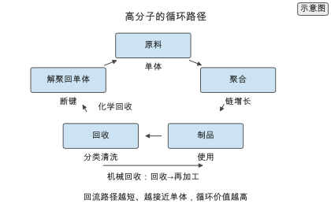
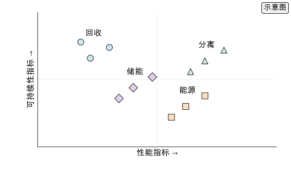
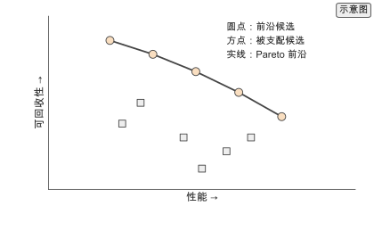
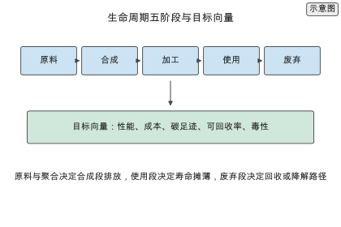
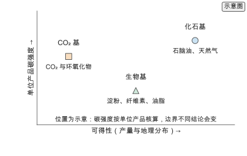
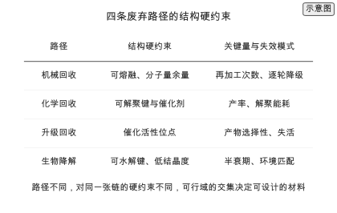
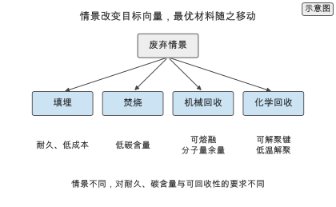
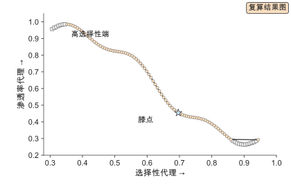

# 第 15 章 可持续高分子与环境应用

> 写作大纲 · 回收、能源与分离 · 2026-09-16

开篇安排：一款性能优异的聚合物，用完之后要么被焚烧、要么被填埋。可持续性要求把"用完之后怎么办"写进设计目标，而不是留到产品末期再考虑。本章讨论回收、降解、能源与分离四类环境应用，以及如何把可持续性指标纳入材料设计。

**本章判断：** 可持续性是多目标设计中的一个目标，与力学、热学、电学性能同等；把可回收性与降解性作为约束或目标进入模型，才能得到兼顾性能与环境的材料。

**前置与交付：** 需要第 4 章的结构–性能关系、第 10 章的逆向设计与第 12 章的合成与可合成性。读完本章，读者能把可回收性写成设计约束，估算膜分离与介电储能的性能指标，并用生命周期视角权衡性能与可持续性。

**阅读安排：** 正文实验为实验 15-1 至 15-3，均为核心；实验 15-4 至 15-7 为延伸，放在扩写资料中。15.1 定义目标，15.2 讲回收与降解，15.3 讲能源与电子，15.4 讲分离与膜，15.5 讲评估与权衡。15.6 至 15.9 沿生命周期展开原料、聚合、使用与废弃四个阶段，说明每个阶段的约束如何进入设计变量；15.10 把 LCA 写进目标函数，15.11 比较指标法、约束法与多目标法，15.12 回顾代表工作；15.13 用同一批候选走通一次性能–成本–碳足迹–可回收率的多目标核算，15.14 至 15.16 给出定量对比、实践流程与选型指南，15.17 汇总练习。

## 15.1 可持续性目标

### 15.1.1 循环经济

介绍循环经济的层级：减量、复用、再制造、回收与能量回收。指出高分子设计的杠杆在"可回收设计"，即从单体与键的选择上预留解聚或再加工的可能。

### 15.1.2 生命周期

给出生命周期评估（life cycle assessment, LCA）的边界：原料、合成、加工、使用与废弃。说明 LCA 结果是设计决策的依据，但受边界与数据假设影响，必须与性能指标一起看。

> **图 15-1：高分子的循环路径（已配正文图）**
>
> 以环形图展示原料、聚合、制品、回收与解聚回单体五环节，标出机械回收与化学回收两条回流路径。
>
> 已制作：[SVG](../../manuscripts/ch15/figure-15-1-circular.svg)／[PNG](../../manuscripts/ch15/figure-15-1-circular.png)。

## 15.2 回收与降解

### 15.2.1 机械与化学回收

对比机械回收与化学回收：机械回收成本低但降级使用，化学回收可回到单体但能耗高。给出解聚温度、催化剂与产率的典型范围，说明可回收设计要在键能上留"断点"。

### 15.2.2 可降解设计

讨论可降解高分子（如聚酯、聚碳酸酯）的水解与酶解机理，给出降解速率与链结构、结晶度的关系。指出降解性常与稳定性冲突，需要按应用场景设定寿命。

## 15.3 能源与电子

### 15.3.1 介电与储能

给出介电常数、击穿场强与储能密度的关系：

$$U_e = \frac{1}{2}\varepsilon_0 \varepsilon_r E_b^{2},$$

说明提高储能密度要在高介电常数与高击穿场强之间权衡，高温应用还要求热稳定性。

### 15.3.2 有机光伏与热电

介绍有机光伏的给体–受体设计，给出光电转换效率与能级匹配的关系。说明热电材料用功率因子与热导率之比衡量，与第 4 章的输运性质衔接。

> **实验 15-1 ★〔核心〕：估算介电储能密度**
>
> 给定介电常数与击穿场强，计算储能密度，并比较不同材料的组合。参数：$\varepsilon_r=4$、$E_b=500$ MV/m。
>
> 条件：基础 · 纸笔与 `calculations/`。
>
> **记录结果（15-1）：** 储能密度在 $10^{0}$ J/cm³ 量级，对击穿场强高度敏感；报告储能密度与参数敏感性。完整记录见 [实验 15-1](../../experiments/ch15/15-01/README.md)。

## 15.4 分离与膜

### 15.4.1 气体分离

给出气体分离膜的 Robeson 上限：渗透率与选择性的权衡边界。说明 AI 的作用是在上限之外寻找打破权衡的新结构，而非仅在已有材料中插值。

### 15.4.2 水处理与离子传导

讨论水处理膜与离子交换膜，给出离子传导率与选择性的关系。说明离子传导是电池与燃料电池的关键指标，与 15.3 的储能应用相连。

> **图 15-2：环境应用图谱（已配正文图）**
>
> 以二维图把回收、能源、分离与储能四类应用按"性能指标"与"可持续性指标"排布。
>
> 已制作：[SVG](../../manuscripts/ch15/figure-15-2-applications.svg)／[PNG](../../manuscripts/ch15/figure-15-2-applications.png)。

> **实验 15-2 ★〔核心〕：估算气体分离膜的性能**
>
> 给定渗透率与选择性，计算膜在给定压差与膜厚下的通量与纯度，并与 Robeson 上限比较。参数：渗透率 100 Barrer、选择性 20、膜厚 1 μm。
>
> 条件：进阶 · 纸笔与 `calculations/`。
>
> **记录结果（15-2）：** 通量由渗透率与膜厚决定，纯度由选择性决定；报告通量、纯度与相对上限的位置。完整记录见 [实验 15-2](../../experiments/ch15/15-02/README.md)。

## 15.5 评估与权衡

### 15.5.1 可持续性指标

列出可持续性指标：可回收率、生物基含量、碳足迹与降解速率。说明指标要可测量、可比较，否则无法进入目标函数。

### 15.5.2 性能与可回收的权衡

把性能与可回收性写成多目标问题，给出 Pareto 前沿的构造方式，说明设计决策是在前沿上按应用偏好取点。

> **图 15-3：性能与可回收性的权衡（已配正文图）**
>
> 以 Pareto 图展示性能与可回收性两个目标，标出若干候选与前沿。
>
> 已制作：[SVG](../../manuscripts/ch15/figure-15-3-tradeoff.svg)／[PNG](../../manuscripts/ch15/figure-15-3-tradeoff.png)。

> **实验 15-3 ★〔核心〕：可回收设计的权衡分析**
>
> 给定一组材料在性能与可回收性上的得分，构造 Pareto 前沿，比较不同偏好权重下的最优选择。样本：20 个候选。
>
> 条件：进阶 · Python 与 `calculations/`。
>
> **记录结果（15-3）：** 偏好改变会移动最优选择，部分候选在任何偏好下都被支配；报告前沿与最优选择。完整记录见 [实验 15-3](../../experiments/ch15/15-03/README.md)。

## 15.6 原料：化石、生物基与 CO₂ 基

前五节把可持续性写成目标与约束，本节起沿生命周期把约束落到原料、聚合、使用与废弃四个阶段，四段共同决定目标向量。

> **图 15-4：生命周期五阶段与目标向量（已配正文图）**
>
> 以横向流程展示原料、合成、加工、使用与废弃五阶段，下方给出性能、成本、碳足迹、可回收率与毒性组成的目标向量。
>
> 已制作：[SVG](../../manuscripts/ch15/figure-15-4-lifecycle.svg)／[PNG](../../manuscripts/ch15/figure-15-4-lifecycle.png)。

### 15.6.1 三类原料与碳强度

把原料分成化石基、生物基与 CO₂ 基三类，说明碳强度、可得性与成本同时进入设计变量，原料标签不能单独决定优劣。给出生物基多任务网络与淀粉样纤维共混两个代表工作。

> **图 15-5：三类原料的碳强度与可得性示意（已配正文图）**
>
> 以二维图把化石基、生物基与 CO₂ 基放在"可得性–碳强度"平面上，标出各自的优势与短板。
>
> 已制作：[SVG](../../manuscripts/ch15/figure-15-5-feedstock.svg)／[PNG](../../manuscripts/ch15/figure-15-5-feedstock.png)。

### 15.6.2 原料可得性与成本进入设计变量

把原料写成四元向量（来源类别、碳强度、可得性、成本），给出三条约束 $a_{\text{avail}}\ge a_{\min}$、$\kappa_{\text{feed}}\le\kappa_{\max}$、$c_{\text{feed}}\le c_{\max}$，说明可得性约束如何把最优解从最低碳原料推开。

### 15.6.3 CO₂ 基单体的约束化表达

给出 CO₂ 固定量的表达 $w_{\text{CO2}}M_{\text{CO2}}/M_{\text{unit}}$，说明固定量、热稳定性与可回收性在同一张链上的三向冲突。

## 15.7 聚合：能耗、溶剂与催化剂

把聚合阶段的可持续性写成能耗、废物与溶剂三条约束。

### 15.7.1 聚合能耗与原子经济性

给出 E-factor 与原子经济性两个指标，说明开环聚合在原子经济性上的优势与溶剂对 E-factor 的支配；说明聚合能耗数据缺失导致 LCA 合成段无法闭合。

### 15.7.2 绿色溶剂

说明 Hansen 溶解度参数作为溶剂约束的用法，给出 SMILES 溶解度预测模型（8,049 组数据、2,394 维输入）与硬约束、软约束两种写法。

### 15.7.3 催化剂的约束化表达

把催化剂选择收窄到金属丰度、毒性与可回收性三条约束，说明合成催化剂与解聚催化剂必须同时存在。

## 15.8 使用阶段：寿命、耐久性与退化

把寿命写成设计变量，说明寿命与可回收性的张力。

### 15.8.1 寿命与性能退化

给出单位使用排放与寿命成反比的关系，说明加速老化与时温等效的外推接口，给出阴离子交换膜退化预测（10,000 小时）的代表工作。

### 15.8.2 寿命与可回收性的张力

把张力写成断键速率的一对不等式，说明动态共价网络如何用温度分离绕开限制；给出 vitrimer 的 MD 信息设计与生成式逆向设计两个代表工作。

### 15.8.3 使用阶段的碳足迹

把使用阶段碳足迹分解为功能能耗、更换与使用条件三部分，说明寿命是双侧约束而不是越大越好，给出约束法与目标法两种写法。

## 15.9 废弃阶段：四条路径的硬约束与情景

把回收与降解写成设计约束，说明四条路径对同一张链的不同要求。

> **图 15-6：四条废弃路径的结构硬约束（已配正文图）**
>
> 以表格对比机械回收、化学回收、升级回收与生物降解的结构硬约束、关键量与失效模式。
>
> 已制作：[SVG](../../manuscripts/ch15/figure-15-6-eol.svg)／[PNG](../../manuscripts/ch15/figure-15-6-eol.png)。

### 15.9.1 机械回收：分子量约束

给出分子量的指数衰减模型与再加工次数上限 $N_{\text{rec}}\le\ln(M_{(n)}^{\min}/M_{(n)}^{(0)})/\ln(1-\delta)$，给出 $\delta=0.2$、保留 50% 时约 3 轮的复算，并说明杂质与共混对可行域的限制。

### 15.9.2 化学回收：可解聚键与能耗约束

给出产率与能耗两条约束 $y\ge y_{\min}$、$E_{\text{dep}}\le E_{\text{synth}}$，给出 PET 水解产率模型、700 万条 ROP 库与 740 万条食品包装库两个代表工作，以及 vitrimer 电路板与可回收阻燃环氧两个热固性案例。

### 15.9.3 升级回收与生物降解

说明升级回收的催化剂选择性与碳收益边界，说明生物降解的环境匹配约束与配方层约束，给出催化升级回收综述与物理校准学习两个代表工作。

### 15.9.4 四情景下最优材料的变化

把填埋、焚烧、机械回收与化学回收写成四组目标权重，给出加权最优 $x^{*}(s)$ 的表达式，说明情景切换如何在前沿上移动最优解。

> **图 15-7：四情景下最优材料的移动（已配正文图）**
>
> 以树状图展示四种废弃情景及其对耐久、碳含量、可熔融与可解聚的要求。
>
> 已制作：[SVG](../../manuscripts/ch15/figure-15-7-scenarios.svg)／[PNG](../../manuscripts/ch15/figure-15-7-scenarios.png)。

## 15.10 LCA：把生命周期写进目标函数

把生命周期评价写成设计目标的函数形式。

### 15.10.1 边界与功能单位

说明功能单位与系统边界如何决定结论，给出从摇篮到大门与从摇篮到坟墓两种边界，给出全球物质流分析（1950–2020、约 6,000 万吨/年管理不当）作为活动水平来源。

### 15.10.2 碳足迹、能耗、毒性、成本的目标向量

给出碳足迹五段分解与四目标表达式，说明每项的单位、边界与核算方法必须一致，给出目标法与约束法两种进入方式。

### 15.10.3 不确定性与排序

说明不确定度如何改变排序，给出区间排序复算（均值 205、半宽 20 与 3、达标概率 0.197 与 0.904），说明蒙特卡洛与敏感性分析两种处理方式。

## 15.11 可持续性设计的方法比较

比较把可持续性写进设计的三条路线。

### 15.11.1 指标法、约束法与多目标法

给出三条路线的输入、输出与适用场景对照表，说明实际流程是先约束、再多目标、最后指标法取点，并说明三者的代价分层。

### 15.11.2 代理模型与 LCA 的耦合

说明代理模型的训练方式与外推、边界两类误差，给出 CRYSTAL 清单自动生成（70,000 化学品、110,000 清单）与 AI 自身 LCA 两条代表工作。

### 15.11.3 本书未覆盖的基准

列出聚合能耗、溶剂回收、CO₂ 固定量、分子量分布形状、产率分布、自然降解半衰期、排放因子区域差异与四目标前沿等未测项。

## 15.12 代表性工作与里程碑

### 15.12.1 可持续高分子与 AI

给出可持续主题文献量（338 条、2025 年 117、2026 年 124），给出可持续材料发现综述与可持续高分子设计综述，以及生物基多任务网络与 vitrimer 集成模型两个代表。

### 15.12.2 化学回收、可降解与升级回收

按化学回收、可回收热固性、升级回收与生物降解四条线回顾代表工作，指出共同缺口是缺少统一评价基准。

### 15.12.3 LCA 与数据

给出 CRYSTAL、物质流分析、AI-LCA 综述与模型 LCA 四条线，说明数据、代理、多目标与实验验证的分工。

## 15.13 Worked example：性能–成本–碳足迹–可回收率的多目标核算

### 15.13.1 任务与候选

候选为 10 种单体、链长 100 的两嵌段共聚物，共 8910 条；说明任务选择理由与对已知库的覆盖倍数。

### 15.13.2 目标向量与数据来源

给出四个目标的代理定义（性能、成本、碳足迹、可回收率），说明性能为真实复算、后三者为声明代理；给出 99 个目标点与每点 90 条候选。

### 15.13.3 Pareto 前沿与情景切换

给出 80 个非支配点、超体积 0.700、两端点与膝点 $(0.697,0.455)$；给出加权和覆盖 0.0625、$\varepsilon$-约束覆盖 0.25；给出四情景最优 $f$（0.32 至 0.50）与权重表。

> **图 15-8：Worked example 的 Pareto 前沿（已配正文图）**
>
> 以散点与连线展示 80 个非支配点与 19 个被支配点，标出膝点与两个端点。
>
> 已制作：[SVG](../../manuscripts/ch15/figure-15-8-worked-pareto.svg)／[PNG](../../manuscripts/ch15/figure-15-8-worked-pareto.png)。

### 15.13.4 结论

给出三条结论：性能与可持续性可同时核算；标量化覆盖非凸前沿能力有限；情景权重改变最优解。说明核算边界与代理局限。

## 15.14 本章方法的定量对比

### 15.14.1 情景对比

对比四情景最优解与前沿覆盖率，说明情景影响与算法影响同量级。

### 15.14.2 指标灵敏度与不确定度

说明碳足迹、可回收率与半衰期对边界与测试环境的敏感度，给出区间排序的翻转复算。

### 15.14.3 本书未覆盖的基准

列出四目标前沿、代理校准、边界数值、产率与纯度、自然降解半衰期、情景权重一致性与聚合能耗等未测项。

## 15.15 从原料到废弃的实践流程

### 15.15.1 七步流程

给出七步流程：功能单位与边界、原料可行域、聚合约束、寿命窗口、废弃约束、多目标优化、完整 LCA 与实验验证；说明顺序不可颠倒。

### 15.15.2 复现清单

给出数据、代码、边界、不确定度与结果五类记录的可复现要求。

## 15.16 可持续材料选型决策指南

### 15.16.1 决策路径

给出七步决策路径与三种需要重新审视设计的信号及其修法。

### 15.16.2 任务—方法对照

给出快速初筛、合规门槛、权衡决策、大库 LCA 与最终候选五类任务的方法对照表。

## 15.17 练习与实验清单

汇总核心练习 15-1 至 15-3 与延伸实验 15-4 至 15-7，给出编号、主题、类型与记录位置。

## 本章的设计决定

**D-16 可持续性作为设计目标：** 本章把可回收性与降解性写成目标或约束，而不是应用附录，与第 10 章的多目标框架一致。

**指标可测量：** 只采用可测量、可比较的可持续性指标，未核实的数字不进入正文。

**性能–环境双轴：** 每个应用都同时评估性能与环境指标，避免用单一指标宣称"绿色"。

**证据标签六级：** 证据标签升级为 `[实验]`、`[公开实验数据]`、`[模拟]`、`[复算]`、`[文献]`、`[示意]` 六级；本章只出现 `[文献]`、`[复算]` 与 `[示意]` 三级，并在速查表前写明。储能密度、Robeson 经验前沿与 Nernst–Einstein 等物理关系引用第 4 章 4.4 节，不重复推导。

## 写作资料

- 可持续高分子与 AI：[Machine learning for sustainable polymer design](../../references/sources.tsv)（`sustainable-polymers-ai-2024`）。
- 介电储能：[Polymer dielectrics review](../../references/sources.tsv)（`polymer-dielectrics-review-2022`）。
- 气体分离：[Machine learning–enabled screening of gas separation polymers](../../references/sources.tsv)（`gas-separation-ml-2020`）。
- 热导率：[Machine learning discovery of high thermal conductivity polymers](../../references/sources.tsv)（`thermal-conductivity-ml-2019`）。
- 溶解度：[Hansen solubility prediction](../../references/sources.tsv)（`solubility-hansen-2019`）。
