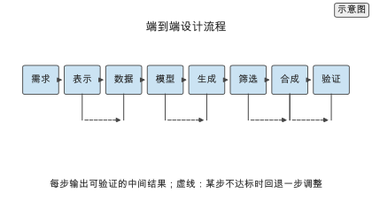
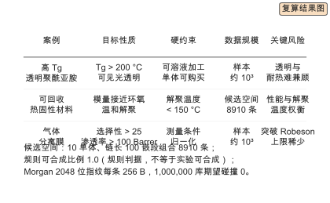
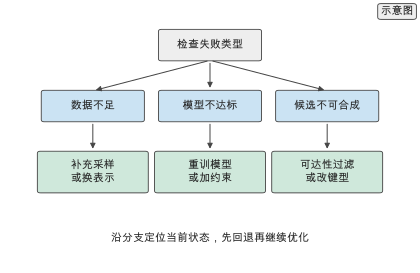
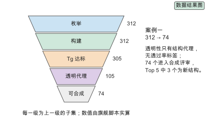
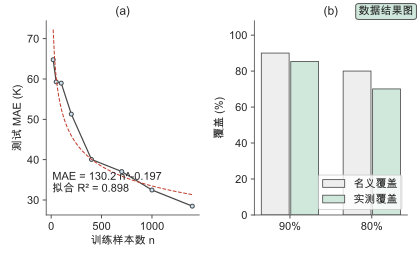
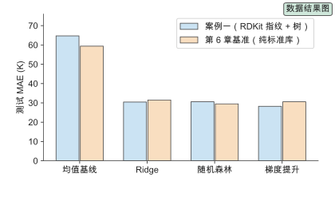
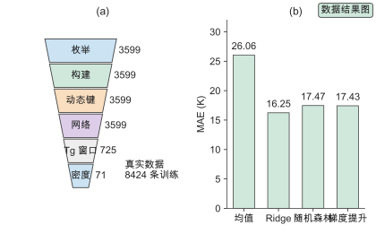
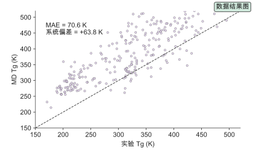
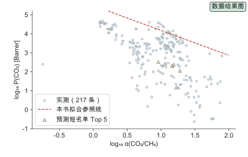
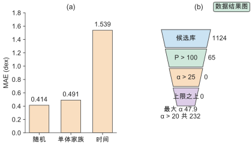

# 第 16 章 端到端案例与工程实践

> 写作大纲 · 三个案例与失败模式 · 2026-09-16

开篇安排：前面十五章分别讲了表示、数据、模型、生成、优化与闭环。真实项目不会按章节顺序发生，而是同时遇到数据不足、模型选择、合成可行性与实验预算的约束。本章用三个案例把这些环节串起来，走通从需求到验证的完整流程。

**本章判断：** 端到端设计的能力不在于用最新的模型，而在于把约束翻译成目标函数、把数据缺口翻译成采样策略、把合成与实验约束翻译成过滤条件，并在每一环留下可复现的记录。

**前置与交付：** 需要全书前十五章的知识。读完本章，读者能独立把一个材料需求拆成目标、约束与成功判据，选择表示与模型，设计生成与筛选流程，并规划验证实验。

**阅读安排：** 正文实验为实验 16-1 至 16-3，均为核心；实验 16-4、16-5、16-6 为延伸，放在扩写资料中。16.1 给出案例方法，16.2 至 16.4 分别是三个案例，16.5 总结工程实践与失败模式，16.6 至 16.8 给出三个案例的定量对比、复现交付与成本停止准则。

## 16.1 案例方法

### 16.1.1 从需求到材料

给出把需求转成设计问题的步骤：明确目标性质与阈值、列出约束（可合成、成本、环境）、确定可用的数据与工具、定义成功判据。说明这一步决定了后续所有选择。给出需求四元组：目标 $f$、约束 $\mathcal{C}$、可行域 $\mathcal{X}$、预算 $B$。

### 16.1.2 约束与成功判据

把约束分成硬约束（必须满足）与软约束（偏好）。给出成功判据的三个层次：计算筛选命中 $r_1$、合成成功 $r_2$、实测达标 $r_3$，端到端成功率 $r=r_1r_2r_3$。每一层都要事先定义通过标准，并说明任一层过低时的回退方向。

> **图 16-1：端到端设计流程（已配正文图）**
>
> 以横向流程展示需求、表示、数据、模型、生成、筛选、合成与验证八步，标出每步的输入输出与可能的回退。
>
> 已制作：[SVG](../../manuscripts/ch16/figure-16-1-pipeline.svg)／[PNG](../../manuscripts/ch16/figure-16-1-pipeline.png)。

## 16.2 案例一：高 Tg 透明聚酰亚胺

### 16.2.1 目标与数据

目标：玻璃化转变温度高于 200 °C，且薄膜在可见光区透明。约束：可溶液加工、单体可购买。数据：公开聚酰亚胺性质数据，1765 条公开实验 $T_g$，来自 Zenodo 沉积 `10.5281/zenodo.15783761`（CC BY 4.0），SHA256 `c7de4f6e…04d0`；本书在其上重训模型，相关数字标 `[公开实验数据]`。按统一九步展开。

### 16.2.2 建模与生成

用描述符与图表示建立 Tg 预测模型，用条件生成模型在目标 Tg 与透明性约束下生成候选，再用可合成性评分过滤。给出模型选择与条件设定的理由。基线：均值 64.70 K、Ridge 30.44 K、随机森林 30.59 K；主模型梯度提升 28.23 K。

### 16.2.3 验证

对筛选出的候选规划合成路线，先做计算验证（分子动力学估算 Tg），再做小批量合成与差示扫描量热（DSC）测量，比较预测与实测。用 Ren 等 2023 年的 3 个 6FDA 基聚酰亚胺实测值做样本外对照，误差 −60 至 −84 K，全部越出区间；模拟与 DSC 未进行。

### 16.2.4 数据清洗与骨架划分

清洗四步：取聚酰亚胺子集、统一单位、范围检查、PSMILES 闭环解析；1765 条全部保留、0 丢弃。划分按 Bemis-Murcko 骨架分组，1304 个骨架，训练 1411 / 测试 354，重叠 0；标准化只在训练集估计。

### 16.2.5 学习曲线与不确定度

学习曲线幂律 $\mathrm{MAE}(n)=130.2\,n^{-0.197}$，拟合 $R^2=0.898$，MAE 64.8→28.5 K；收到 30 K 需约 1750 条，超过现有总量。split conformal 90% 名义覆盖实测 85.3%、区间宽 108.3 K；分组划分破坏可交换性。区间改变排序：同均值不同区间时命中概率翻转。

### 16.2.6 候选搜索、漏斗与最终清单

枚举 12 种二酐 × 26 种二胺 = 312 个重复单元，全部构建成功；漏斗 312→312→305→105→74。透明性用 CT 风险结构代理（阈值 $\le 1$）。Top 5：PMDA-6FpDA、6FDA-DMB、6FDA-TMB、PMDA-ABTFMB、PMDA-TFMB，其中 3 条为新结构。

### 16.2.7 失败候选与失败环节

四类失败：构建 0、性质 7、透明 200、可合成 31。透明失败集中在 PMDA-ODA、BPDA-PDA；可合成失败含 SA 分数对商业化 BCDA 的误杀。文献对照暴露分布外外推的系统性低估。由失败推出三条约束调整。

### 16.2.8 透明性的代理与局限

数据无透过率标签，只能退回结构代理；代理能排序与过滤，不能给透过率数值或截止波长。闭合透明性需要可见光透过率、薄膜厚度与结构–光学配对标签。该限制直接影响 $r_1$ 的真实含义。

> **实验 16-1 ★〔核心〕：案例一的完整流程**
>
> 从数据准备到候选筛选走通一遍：训练 Tg 模型、生成候选、可达性过滤、输出待合成列表，并报告各阶段的存活数量。参数：目标 Tg 200 °C、候选 $10^{4}$ 个。
>
> 条件：进阶 · Python、RDKit 与 `calculations/`。
>
> **记录结果（16-1）：** 筛选后候选规模缩小到可实验验证的量级，Tg 预测误差在可接受范围内；报告各阶段存活数与待合成列表。完整记录见 [实验 16-1](../../experiments/ch16/flagship/README.md)。

## 16.3 案例二：可回收热固性材料

### 16.3.1 目标与约束

目标：力学性能接近传统环氧，同时可在温和条件下解聚回收。约束：解聚温度低于 150 °C、回收单体可再聚合、原料成本可接受。可回收性由动态共价键（酯键、亚胺键、二硫键）提供。九步中数据分层：$T_g$ 有真实标注，解聚温度、模量与回收率无标注。

### 16.3.2 设计

把可回收性写成硬约束（动态共价键的存在）与目标（解聚温度、回收率），在满足键类型约束的候选空间内优化力学性能。给出约束处理与多目标优化的方式。声明代理模型下 8910 条嵌段候选的非支配前沿含 80 个点，超体积 0.700，加权和覆盖 0.0625。

### 16.3.3 验证

验证分三步：计算解聚热力学、合成并测量力学性能、执行解聚回收并测量回收率与再聚合后的性能。回收率 $r_\mathrm{rec}$ 是核心指标。本书未做解聚与力学实验，如实标注。

### 16.3.4 数据获取、许可与清洗

公开 vitrimer 数据（Zheng 等，arXiv `2312.03690`，MIT 许可）：8424 条酸×环氧化学，7729 酸 / 7667 环氧，$T_g$ 248.05–500.81 K，均值 373.00 K；清洗 0 丢弃。外部校准集 295 条，MD 相对实验 MAE 70.6 K、偏差 +63.8 K。解聚温度、模量、回收率无标签。

### 16.3.5 划分、描述符与模型

48 维可解释描述符；按环氧家族分组划分，训练 6732 / 测试 1692。$T_g$ 标签为 MD 计算加高斯过程校准，属模拟来源，相关数字标 `[模拟]`。模型：均值 26.06 K、Ridge 16.25 K、随机森林 17.47 K、梯度提升 17.43 K；5 折 CV 17.95 ± 0.49 K。conformal 90% 实测覆盖 91.2%、宽 75.3 K。线性与树同量级。

### 16.3.6 枚举、约束筛选与最终候选

60 酸 × 60 环氧 = 3600 对，3599 个新组合；漏斗 3599→3599→3599→3599→725→71。动态键密度定义为（羧基 + 环氧乙烷 + 羟基）/ 重原子数。Top 5 按密度排序；与原论文 62 个 BO 候选交叉核对 MAE 20.9 K。

### 16.3.7 失败候选与未闭合环节

失败集中在 $T_g$ 窗口（2874）与密度（654）。解聚温度、模量、回收率无标签，无法训练与验证；可回收性必须由解聚实验与再聚合性能确认。记录未闭合项与所需标签。

> **图 16-2：三个案例的目标与约束对比（已配正文图）**
>
> 以表格图对比三个案例的目标性质、硬约束与数据规模，标出各自的关键风险。
>
> 已制作：[SVG](../../manuscripts/ch16/figure-16-2-cases.svg)／[PNG](../../manuscripts/ch16/figure-16-2-cases.png)。

> **实验 16-2 ★〔核心〕：案例二的性能与可回收权衡**
>
> 在满足动态键约束的候选集上构造力学性能与解聚温度的 Pareto 前沿，按偏好选出候选，并报告前沿与所选点。
>
> 条件：进阶 · Python 与 `calculations/`。
>
> **记录结果（16-2）：** 力学性能与低解聚温度存在权衡，前沿上的候选在偏好改变时移动；报告 Pareto 前沿与最优选择。完整记录见 [实验 16-2](../../experiments/ch16/case2/README.md)。

## 16.4 案例三：气体分离膜

### 16.4.1 目标与数据

目标：CO₂/CH₄ 选择性高于 25，渗透率高于 100 Barrer。数据：公开膜性能数据（`jsunn-y/PolymerGasMembraneML`，MIT 许可），总库 778 条，同时含 CO₂ 与 CH₄ 实测的 221 条，保留 217 条、138 个唯一结构，年份 1946–2018。

### 16.4.2 设计

用膜性能数据训练渗透率与选择性模型，在 Robeson 上限之外搜索候选，并用可合成性过滤。强调测量条件归一化对模型质量的影响。位置量 $d=\log P-(\log\beta-n\log\alpha)$。

### 16.4.3 验证

对候选做分子模拟估算渗透与选择性，再合成并测量单气体与混合气体渗透，比较预测与实测，并检查是否突破上限。混合气体选择性通常低于单气体。本书未做模拟与实验，如实标注。

### 16.4.4 数据清洗、时间划分与泄漏

双气体要求把 778 压到 221；保留 217。三种划分：随机 173/44、单体家族 174/43、时间（≤2000）49/168。时间划分梯度提升 MAE 退化到 1.539 dex，Ridge 2.384 dex 差于均值 1.631 dex。

### 16.4.5 渗透率与选择性模型

24 维描述符 + 128 位指纹；分别训练 CO₂ 与 CH₄ 的 $\log_{10}P$。5 折 CV MAE 0.428 ± 0.104 dex；conformal 90% 覆盖 90.7%、宽 2.298 dex；选择性 MAE 0.254 dex。两个模型误差相关，双目标通过率用联合分布统计。

### 16.4.6 Robeson 参照线与候选筛选

从 217 条实测点非支配前沿拟合 $\log_{10}P=5.486-1.310\log_{10}\alpha$（非 2008 原值）。筛选 1124 个结构：$P>100$ 65 个，$\alpha>25$ 0 个，$d>0$ 0 个；最大预测 $\alpha$ 47.9，$\alpha>20$ 有 232 个。零命中归因于高选择性样本稀缺。

### 16.4.7 最终候选、失败环节与未闭合项

预测短名单 Top 5 全部在上限之下；数据集实测双阈值达标 3 条。失败：渗透率不足 1059、选择性不足 65。未闭合：混合气体选择性、高压条件、湿实验。引用原论文的实验验证结论。

> **实验 16-3 ★〔核心〕：案例三的候选筛选**
>
> 训练渗透率与选择性模型，在候选库上筛选满足双目标阈值的结构，报告通过率与相对 Robeson 上限的位置。
>
> 条件：进阶 · Python 与 `calculations/`。
>
> **记录结果（16-3）：** 满足双目标的候选稀少，部分落在上限附近；报告通过率与上限位置。完整记录见 [实验 16-3](../../experiments/ch16/case3/README.md)。

## 16.5 工程实践

### 16.5.1 数据与模型治理

讨论版本管理：数据版本、模型版本与实验记录必须对应。给出模型上线与回退的流程，以及如何避免用测试集调参。实验预算进入治理，筛选强度按预算反推。

### 16.5.2 团队与流程

讨论跨学科团队的分工：化学、计算、数据与工程。给出从需求评审到实验验证的流程节点与交付物，以及每个节点的通过标准。

### 16.5.3 常见失败模式

列出常见失败：数据泄漏导致指标虚高、模型外推失效、生成候选不可合成、闭环数据无元数据、过早优化单一指标。每条给出识别方法与规避方式。

> **图 16-3：关键决策点与回退（已配正文图）**
>
> 以决策树展示在数据不足、模型不达标、候选不可合成三种情况下的回退路径。
>
> 已制作：[SVG](../../manuscripts/ch16/figure-16-3-decisions.svg)／[PNG](../../manuscripts/ch16/figure-16-3-decisions.png)。

## 16.6 三个案例的定量对比

### 16.6.1 案例一：数据、模型与漏斗

把案例一的漏斗、学习曲线、不确定度与第 6 章基准放在同一坐标上对比。漏斗在透明性一级收得最紧；两套实现（RDKit 与纯标准库）的模型间差距都在 1–3 K。

> **图 16-4：案例一筛选漏斗（已配正文图）**
>
> 五级漏斗 312→312→305→105→74，标出透明性与可合成性两级的收紧幅度与规则误杀。
>
> 已制作：[SVG](../../manuscripts/ch16/figure-16-4-case1-funnel.svg)／[PNG](../../manuscripts/ch16/figure-16-4-case1-funnel.png)。

> **图 16-5：案例一学习曲线与 conformal 覆盖（已配正文图）**
>
> (a) 测试 MAE 随训练样本量的幂律下降；(b) 90% 与 80% 名义覆盖对应的实测覆盖；实测覆盖低于名义值，原因是分组划分破坏可交换性。
>
> 已制作：[SVG](../../manuscripts/ch16/figure-16-5-case1-learning.svg)／[PNG](../../manuscripts/ch16/figure-16-5-case1-learning.png)。

> **图 16-6：案例一与第 6 章基准的模型对比（已配正文图）**
>
> 两组柱对比同一数据上两套实现的模型 MAE；模型间差距 1–3 K，远小于数据量与标签质量的影响。
>
> 已制作：[SVG](../../manuscripts/ch16/figure-16-6-case1-benchmark.svg)／[PNG](../../manuscripts/ch16/figure-16-6-case1-benchmark.png)。

### 16.6.2 案例二：真实标签与代理约束

把案例二的漏斗与模型误差、MD 与实验 $T_g$ 的校准放在一起。真实标签链路给出 17.4 K 的模型误差与 70.6 K 的标签误差，后者支配前者。

> **图 16-7：案例二筛选漏斗与模型误差（已配正文图）**
>
> (a) 六级漏斗 3599→725→71；(b) 环氧家族分组下的模型 MAE；前三级过滤全部通过，真正起选择作用的是 $T_g$ 窗口与动态键密度。
>
> 已制作：[SVG](../../manuscripts/ch16/figure-16-7-case2-funnel.svg)／[PNG](../../manuscripts/ch16/figure-16-7-case2-funnel.png)。

> **图 16-8：案例二 MD 与实验 Tg 对照（已配正文图）**
>
> 295 条聚合物的 MD $T_g$ 对实验 $T_g$ 散点，虚线为 $y=x$；MD 系统性高估，MAE 70.6 K、偏差 +63.8 K。
>
> 已制作：[SVG](../../manuscripts/ch16/figure-16-8-case2-calibration.svg)／[PNG](../../manuscripts/ch16/figure-16-8-case2-calibration.png)。

### 16.6.3 案例三：上限位置与划分退化

把案例三的 Robeson 图与三种划分的退化放在一起。时间划分退化到 1.539 dex，筛选零命中；两者都指向数据稀缺而不是模型容量。

> **图 16-9：案例三 Robeson 参照线与候选位置（已配正文图）**
>
> 蓝点为 217 条实测记录，红虚线为本书拟合的参照线，橙三角为预测短名单 Top 5；短名单全部在参照线之下，实测有 3 条满足双阈值。
>
> 已制作：[SVG](../../manuscripts/ch16/figure-16-9-case3-robeson.svg)／[PNG](../../manuscripts/ch16/figure-16-9-case3-robeson.png)。

> **图 16-10：案例三划分对比与筛选漏斗（已配正文图）**
>
> (a) 梯度提升在三种划分下的 MAE；(b) 候选筛选漏斗；时间划分退化到 1.539 dex，筛选零命中。
>
> 已制作：[SVG](../../manuscripts/ch16/figure-16-10-case3-splits.svg)／[PNG](../../manuscripts/ch16/figure-16-10-case3-splits.png)。

### 16.6.4 横向对比与失败归因

把三个案例的九步并排放进一张表，标出每步的真实状态；按交接处归纳失败环节，给出通用失败清单。失败环节的最大项都不是模型，而是数据或约束。

## 16.7 端到端复现与交付清单

### 16.7.1 数据、代码与环境的交付物

交付四类物：数据、代码、环境、结果。三个实验的目录结构一致，`run.py` 是唯一入口，`manifest.json` 记录输入输出哈希。

### 16.7.2 版本绑定与审计

数据、模型与实验用版本号绑定；固定种子与逐字节可复现的哈希是审计依据。测试集只用于最终评估，四问清单：数据版本、划分泄漏、测试集是否被调、结论是否带不确定度。

### 16.7.3 交付验收清单

把验收标准写成可勾选清单，逐项标注三个案例的通过情况；「未进行」的验证必须写进交付物，不能用计算指标冒充。

## 16.8 成本、预算与停止准则

### 16.8.1 筛选漏斗的成本模型

给出 $N_i=N_{i-1}r_i$ 与总代价 $\sum_i N_{i-1}c_i$，用五级漏斗例子说明便宜且选择性强的过滤必须前置。

### 16.8.2 实验预算反推筛选强度

用 $10^{6}$ 空间、0.1% 命中比例、5 倍贝叶斯加速的账反推筛选强度与闭环周期。

### 16.8.3 何时停止搜索

给出数据准则、模型准则、实验准则三条停止准则，核心逻辑是当不确定性大于要区分的差异时停止优化，回到数据与约束。

## 本章的设计决定

**D-17 三个案例覆盖不同约束：** 案例一以性质为主、案例二以可回收约束为主、案例三以双目标筛选为主，三者组合覆盖全书方法。

**成功判据分层：** 计算命中、合成成功与实测达标三层分别定义，避免用计算指标替代实测结论。

**失败模式显式化：** 常见失败模式独立成节，作为前十五章方法的反向检查清单。

**真实数据与代理分离：** 三个案例都区分真实计算、真实测量与声明代理；缺标签的环节如实标注「未建模」，不用代理冒充测量。

**证据标签六级：** 证据标签升级为 `[实验]`、`[公开实验数据]`、`[模拟]`、`[复算]`、`[文献]`、`[示意]` 六级。本章没有原始湿实验或仪器测量：案例一与案例三在公开实验数据集上重训模型，标 `[公开实验数据]`；案例二的 $T_g$ 标签为 MD 计算加高斯过程校准，标 `[模拟]`；枚举计数、SA 分数与 FLOPs 下界标 `[复算]`，且计算代价均为理想算术下界（未计内存带宽、kernel launch、batch size、通信、I/O 与软件实现质量，本书未测真实硬件墙钟时间）；透明性、成本与碳足迹代理标 `[示意]`。三个案例的失败环节（0 构建失败、7 个 $T_g$ 不达标、200 个透明性拒绝、31 个可合成性拒绝、BCDA 假阳性、6FDA 基 PI 样本外低估 −60 至 −84 K、案例三零命中与时间划分退化）全部保留，不改写成成功。

## 写作资料

- 案例一真实数据、代码与结果：[实验 16-1](../../experiments/ch16/flagship/README.md)；数据沉积 Zenodo `10.5281/zenodo.15783761`（CC BY 4.0）。
- 案例二真实数据、代码与结果：[实验 16-2](../../experiments/ch16/case2/README.md)；数据来自 [VitrimerVAE](https://github.com/yiwenzheng98/VitrimerVAE)（MIT 许可）。
- 案例三真实数据、代码与结果：[实验 16-3](../../experiments/ch16/case3/README.md)；数据来自 [PolymerGasMembraneML](https://github.com/jsunn-y/PolymerGasMembraneML)（MIT 许可）。
- 第 6 章基准：[实验 6-x](../../experiments/ch06/benchmark/README.md)。
- 数据与模型平台：[Polymer Genome](../../references/sources.tsv)（`polymer-genome-2018`）、[Tg benchmark](../../references/sources.tsv)（`tg-benchmark-2021`）。
- 案例三：[Gas separation screening](../../references/sources.tsv)（`gas-separation-ml-2020`）、[Robeson 2008](../../references/sources.tsv)（`robeson-2008`）。
- 案例二：[Vitrimer inverse design](../../references/sources.tsv)（`vitrimer-inverse-2023`）、[Sustainable polymers with AI](../../references/sources.tsv)（`sustainable-polymers-ai-2024`）。
- 闭环与平台：[Autonomous experimentation review](../../references/sources.tsv)（`self-driving-lab-review-2023`）。
- 表示与模型：[PolyBERT](../../references/sources.tsv)（`polybert-2023`）。
- 复算工具：[calculations/README.md](../../calculations/README.md)；来源清单：[sources.tsv](../../references/sources.tsv)。
