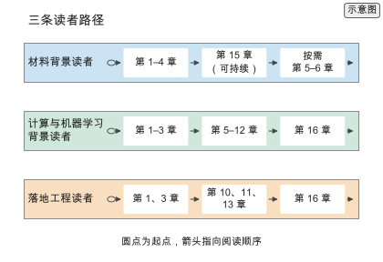

# 前言

高分子材料的设计长期依赖经验与试错。一位化学家凭直觉提出几个候选结构，合成、表征、再调整，一轮往往以月计。这种方式的产出上限，取决于个人经验覆盖过的化学空间有多大；而可合成的高分子数量以天文数字计，任何个人经验都只能触及其中极小的一部分。

机器学习改变了这个上限。当结构与性质的映射可以由数据拟合，当生成模型可以提出尚未被合成的结构，当自动化平台把合成与表征也变成可编程的步骤，材料设计就从“凭经验挑几个候选”变成“在预算约束下搜索一个巨大的空间”。本书要回答的，是如何把这场搜索组织起来。

把高分子设计看成搜索，需要回答的不是“用什么算法”，而是一串更基本的问题：结构怎么表示，数据够不够，模型学到的是规律还是记忆，搜索往哪里走，闭环要闭到什么程度。这些问题分别属于表示、数据、模型、搜索与闭环五个环节，任一环节的短板都会限制整条链路的产出。只罗列模型不足以讲清楚这场搜索，本书为每个环节给出定量直觉——一个 2048 位的指纹能区分多少个结构，一次密度泛函计算要花多少机时，一轮实验闭环要多久。这些数字影响方法在什么预算下可用，也影响设计者的取舍。

**本书的主线是：在实验预算的约束下，把高分子设计组织成一场可计算、可复现、可闭环的搜索。** 五个环节的展开、各环节的定量估算方法与适用边界，在第 1 章给出。

## 内容简介

本书讨论如何把高分子材料设计组织成一场在实验预算约束下的可复现搜索。全书以“表示—数据—模型—搜索—闭环”五层框架展开：从结构表示与描述符，到数据的规模、偏差与基准，再到性质预测、生成模型与多目标优化，最后到自驱动实验室与端到端工程闭环。每一层都给出定量直觉——一个指纹能区分多少结构，一次计算要花多少机时，一轮闭环需要多久——以及这些数字如何限定方法在什么预算下可用。

书中方法覆盖高分子物理、机器学习、代价估算与开源复现案例，结论给出公式、适用条件与证据等级；推导、代码与完整 benchmark 放在配套开源仓库。本书面向高分子材料、计算材料与 AI 材料方向的研究生与科研工程师。

## 作者简介

谭诗乾，香港中文大学（深圳）材料科学与工程专业博士研究生（2023 年至今），导师为朱世平教授、张祺教授与余天舒教授，研究方向为面向高分子材料的机器学习；2025 至 2026 年获国家留学基金委资助，赴比利时根特大学联合培养，导师为 Dagmar R. D'hooge 教授。此前在复旦大学获物理化学硕士学位（2019–2022，导师徐昕教授），在华中科技大学获化学学士学位（2015–2019）。

作者的研究覆盖高分子性质预测与优化、材料生成式设计、可解释人工智能与量子化学计算，曾以第一作者在 *Chinese Journal of Chemical Physics* 发表关于 xDH@B3LYP 方法评估的工作，并曾任职于字节跳动数据与科学计算团队。作者维护 AI4Polymer 高分子与人工智能资源清单（GitHub: `ShiqianTan/AI4Polymer`）与微信公众号「鲸落生」，长期整理这一交叉方向的文献、数据集与工具；本书即在这一整理的基础上写成。

## 本书的写法

本书采用两层结构。**正文**讲决策、直觉与量级，给出结论、公式与适用条件，回答一个方法在什么预算下可用、边界在哪里。**在线扩写资料**（[`archive/outlines/extensions/`](../archive/outlines/extensions/)）与**配套仓库**（[`calculations/`](../calculations/)、[`references/`](../references/)、[`experiments/`](../experiments/)）承载正文放不下的推导、代码与完整 benchmark。正文报告结论与量级，推导与代码在线上；要复现某个结论时，先回到仓库的对应目录，再回到正文看它如何影响设计。

书中的量级结论按三级归档制度核对：

- **已归档**：全文或快照已存入 [`references/`](../references/)，并附 SHA256，可在本地直接检索原文。
- **已核实但不可归档**：订阅或反爬来源，内容已核对，但许可不允许在仓库中分发全文；正文只引用其中可核对的具体数字。
- **待核实**：仅用于领域定位，正文不引用其具体数字。

正文中每个数字都带下列六级证据标签之一，这六级标签是全书唯一的定义：

- `[实验]`：原始实验测量；
- `[公开实验数据]`：引用公开实验数据集后重新分析；
- `[模拟]`：DFT、MD 等计算结果；
- `[复算]`：按正文声明的公式与参数重新计算；
- `[文献]`：直接引用文献报告值；
- `[示意]`：为教学设定的假设值。

「本章数字速查」表中的 `证据` 列使用上述六级标签。跨章反复出现的数字集中在附录 F 编号（N01 至 N20），各章只列本章新增的数字，重复项直接指向编号。用公开数据集重跑模型得到的结果记为 `[公开实验数据]` 或 `[复算]`，不记为 `[实验]`。

## 印刷版与配套仓库

印刷版是配套仓库在某一时刻的冻结快照。印刷版对应配套仓库的标签 `print-v1.0`，在仓库中执行 `git checkout print-v1.0` 即可检出该快照；标签所指向的提交哈希可在仓库中查看。

正文中的数字取自该快照，可在仓库中按 commit 检出后复现。仓库在此之后继续演进，新增的数据、代码与结果属于在线版，不回写印刷版正文。勘误与补充材料发布在配套站点上，与仓库同步维护。

配套仓库位于 `https://github.com/ShiqianTan/AI4Polymer-book`，复现入口命令为 `python3 calculations/calc.py reproduce`。

**版权与许可。** 本书正文文字、图表与在线扩写资料的著作权归谭诗乾所有；配套仓库中的代码以 Apache-2.0 许可发布；`references/` 中归档的文献、数据集与网页快照版权归原出版方或原维护方所有，仅用于学术引用，不再分发。任何**商业用途**——包括出版、再版、培训、软件集成与商业咨询交付——必须事先取得作者的书面许可，联系邮箱 `tanshiqian@outlook.com`；非商业的教学、科研与个人学习可在注明作者与出处的条件下使用正文内容。

## 全书结构

*图 0-1　三条读者路径。材料背景读者先读第 1–4 章，再按需进入第 5–6 章与第 15 章；计算与机器学习背景读者从第 1–3 章进入第 5–12 章，最后读第 16 章；落地工程读者聚焦第 1、3 章与第 10、11、13、16 章。*

全书分四个部分、共十六章：

- **第一部分 表示、数据与物理基础**（第 1–4 章）：初识 AI4Polymer、高分子表示与描述符、数据基准与可复现性、高分子物理与结构性能关系。
- **第二部分 计算与预测**（第 5–8 章）：分子模拟与多尺度计算、性质预测模型、多任务迁移与物理信息学习、表征成像与光谱的 AI 分析。
- **第三部分 生成、优化与合成**（第 9–12 章）：生成模型与高分子序列设计、逆向设计与多目标材料设计、主动学习贝叶斯优化与强化学习、反应预测聚合建模与可合成性。
- **第四部分 闭环系统与落地**（第 13–16 章）：自驱动实验室与高通量自动化、高分子基础模型与智能体系统、可持续高分子与环境应用、端到端案例与工程实践。

各章主题与在链路中的位置见图 0-1，详细展开见第 1 章。

## 如何阅读本书

本书为三类读者给出不同的路径，见图 0-1。

**材料背景的读者**从第 1–4 章建立表示、数据与物理基础，再按需进入第 5–6 章了解计算与预测模型、第 15 章了解可持续高分子应用，其余章节在遇到具体问题时查阅。

**计算与机器学习背景的读者**从第 1–3 章快速建立领域与数据口径，随后沿第 5–12 章依次读计算、预测、生成、优化与合成，最后读第 16 章看这些方法如何在一个系统中合起来。

**落地工程读者**聚焦第 1、3 章与第 10、11、13、16 章，把数据口径、逆向设计、主动学习、自动化平台与端到端案例连成一条工程链路。

不写代码的读者同样可以读完本书。第 1–4、9、13–16 章以概念、判断与案例为主，不需要运行代码；第 5–8、10–12 章的部分结论依赖配套仓库中的计算，可只读正文的结论与适用条件，把复现留给有编程经验的同事。

每章练习分核心与延伸两类。核心练习只需纸笔、Python 与仓库中的 [`calculations/`](../calculations/)，延伸实验给出更完整的代码与数据；每条练习的 `条件：` 行会写明它属于纸笔练习还是需要运行配套代码。附录给出配套开源仓库说明、高分子 AI 工具速查表、选型决策速查表、数据风险清单，以及全书通用关键数字（附录 F，N01 至 N20）。

## 三个贯穿全书的案例

本书用三个工程案例贯穿全书：**案例一 高Tg透明聚酰亚胺**、**案例二 可回收热固性材料**、**案例三 气体分离膜**。三个案例在第 1 章预览，其后的章节在讲到表示、数据、模型、搜索与闭环时分别以它们为例，第 16 章把它们端到端执行一遍——从数据准备、模型训练与筛选，到实验安排与结果分析。三个案例覆盖了从性能指标明确、数据相对充足的体系，到数据稀疏、约束复杂的体系，它们的对比说明了同一套框架在不同条件下的取舍。

## 前置知识

阅读本书需要微积分、线性代数与概率论的基础，能读懂 Python，了解基本的化学键与聚合物概念。深度学习部分不要求预先熟悉，但具备训练过一个神经网络的经验会更容易理解第 6、7、9 章。

## 致谢

感谢香港中文大学（深圳）PolyCUHKSZ 课题组提供的研究环境与日常讨论；感谢香港科技大学博士生 Haifan Zhou 在若干问题上的讨论与建议；感谢家人一直以来的支持。

本书的写作得到 AI 智能体的协助：文献调研、数据整理、计算工具实现与文字校对由智能体批量完成，框架、取舍与判断由作者负责。所有结论均经作者核对；`[复算]` 数字可由仓库中的代码重建，`[文献]` 数字均可追溯到来源清单中的条目。
