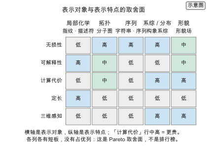
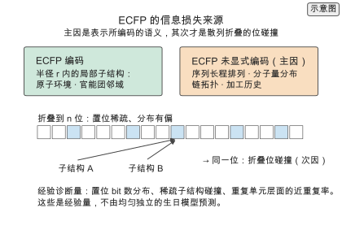
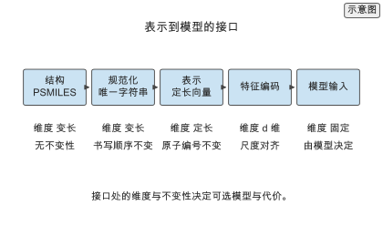
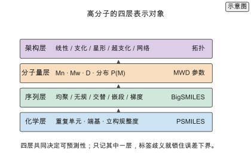
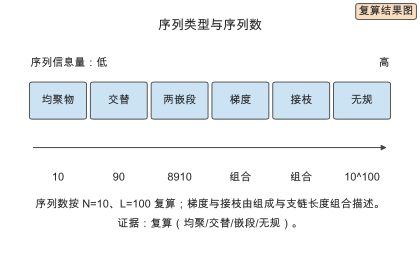
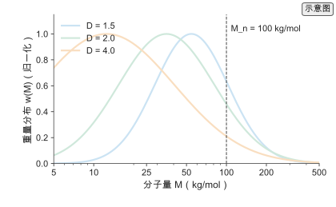
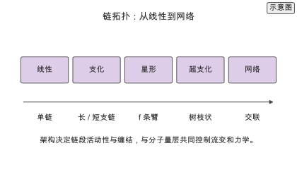
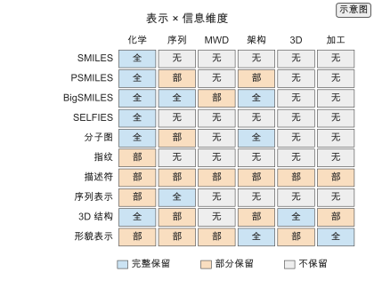
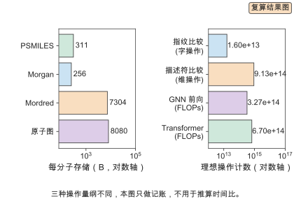

# 第 2 章 高分子表示与描述符

把一批候选聚酰亚胺交给模型之前，先要决定用什么形式描述它们。同一个聚酰亚胺，可以写成一串 PSMILES 字符，可以折成一个 2048 位的指纹，可以算成 1826 个物理化学描述符，也可以还原成一张带三维坐标的原子图。四种写法指向同一个分子，却给出不同的预测误差和不同的计算开销。表示是建模的第一行代码，它写下的那一刻，后面的模型能碰到什么、碰不到什么就已经定了一半。

第 1 章把表示放在五层全景的最底层。这一章说明它为什么必须在最底层：表示决定模型能看到什么，而模型无法恢复表示已经丢掉的信息。选择表示，等于选择误差的下界与计算预算，它不是数据进入模型前的一道预处理，而是建模的第一步。

本章沿一条从判据到落地的路线展开。2.1 给出形式化判据：把表示写成有损映射，从碰撞推出不可约误差的下界。2.2 到 2.4 分别处理字符串、指纹与描述符、图与三维三类编码，说明每类保留什么、丢掉什么、代价是多少。2.5 收束到多模态与选型。2.6 补上高分子的四层表示对象——化学层、序列层、分子量层、架构层，它们是所有编码共同要承载的对象。2.7 把表示与信息维度排成一张覆盖表，2.8 回顾代表工作，2.9 用同一批候选结构走通一次完整的表示选择与代价核算，2.10 给出定量对比，2.11 给出从结构到模型输入的实践流程，2.12 给出决策指南，2.13 汇总练习。做工程的读者可以沿 2.1 → 2.2 → 2.9 → 2.11 → 2.12 直接走通。

## 2.1 为什么表示决定上限

### 2.1.1 表示–模型–性能的依赖链

设结构 $x$ 经表示函数 $g$ 映射为输入 $z=g(x)$，模型 $f$ 给出预测 $\hat y=f(z)$，整条链是 $x\to z\to\hat y$。函数 $g$ 是有损的：它把无穷维的化学结构压进有限维向量。这条链是一条数据处理不等式（data processing inequality）的具体形式——信息在 $x\to z$ 一步已经减少，之后的任何 $z\to\hat y$ 都不能把它加回来。换更大的模型、加更长的训练、做更细的调参，都只能在 $g$ 允许的范围内降低误差。

取两个不同结构 $x_1\ne x_2$，它们被映射到同一个输入 $g(x_1)=g(x_2)=z$，而性质 $y_1\ne y_2$。对任意模型 $f$，

$$\max\big\{|f(z)-y_1|,\ |f(z)-y_2|\big\}\ \ge\ \frac{|y_1-y_2|}{2}$$。

两个目标值离得越远，模型无论输出什么都无法同时逼近它们。对所有这样的碰撞取期望，得到表示引入的不可约误差

$$\mathrm{MAE}_{\text{irr}}\ \ge\ \frac{1}{2}\,\mathbb{E}\Big[\,|y_1-y_2|\ \Big|\ g(x_1)=g(x_2)\,\Big]\ \Pr\big[g(x_1)=g(x_2)\big]$$。

这个式子把表示的质量拆成两项。第一项是碰撞发生时性质的平均差，第二项是碰撞发生的概率。第一项由表示所编码的语义决定：表示没有携带的物理量（序列排列、分子量分布、链拓扑等）无论映射多细都会被合并；第二项只在表示确实编码了该信息、却因散列折叠或量化落到同一格时出现，位宽只影响这一部分。两者都压不下去时，误差就在模型之外被锁死了。式中的 $\ge$ 表明这是一个**下界**：它给出任何模型在该表示下都达不到的误差底线，观测误差只能大于或等于它，不可能更小。[^repbound][^evidence]

两项对应两类不同的失败。第一项大，说明表示把性质不同的结构合并了：标准重复单元 ECFP 不区分两条只差一个立构中心的链，如果这两条链的玻璃化转变温度相差 30 K `[示意]`，模型在这对样本上的误差下界就是 15 K。第二项大，说明在表示已经编码的信息上发生了位碰撞：库里大量结构共享同一个位向量，模型看到的是被平均过的标签。诊断时先分清是哪一项主导——前者靠换表示或补字段解决，后者靠调整散列位宽或改用不折叠的表示，两者不能互相替代。

还有第三种误差来源常被混进来：标签本身的噪声。同一个结构被两次合成、两次测试，结果相差 5 K，这部分方差无论表示多精细都消不掉。把标签噪声计入，观测误差写成

$$\mathrm{MAE}_{\text{obs}}\ \approx\ \mathrm{MAE}_{\text{irr}}+\mathrm{MAE}_{\text{model}}+\varepsilon_{\text{label}},$$

其中 $\mathrm{MAE}_{\text{model}}$ 是模型在表示允许范围内没逼近到的部分，$\varepsilon_{\text{label}}$ 是标签噪声。这个分解是近似的记账，但由不可约误差的定义，观测误差不会低于 $\mathrm{MAE}_{\text{irr}}$，即 $\mathrm{MAE}_{\text{obs}}\ge\mathrm{MAE}_{\text{irr}}$。三者中只有 $\mathrm{MAE}_{\text{model}}$ 能靠换模型降低。把表示误差当成模型误差去调网络，是把预算花在了锁死的下界上。

表示函数 $g$ 可以用三条性质刻画：不变性、单射性与连续性。不变性指 $g$ 对某些变换不敏感——规范化的 SMILES 对书写顺序不变，指纹对原子编号不变，三维表示对旋转平移不变。不变性越强，表示越鲁棒，但越可能把不同的东西合并，不变性的另一面就是有损。单射性指 $g(x_1)=g(x_2)\Rightarrow x_1=x_2$；完全单射的表示（如完整字符串）不产生碰撞，但维度可变、模型难用。连续性指结构的小扰动对应表示的小变化；位指纹不连续，一位之差可能对应完全不同的子结构，描述符与图较连续。三条性质互相牵制：强不变性换来鲁棒但损失信息，强单射性保留信息但要求模型处理变长输入。选表示是在这三条之间取平衡。

下界可以从数据里估。把结构按表示分组，同一组内性质的标准差的一半是该组不可约误差的一个经验估计，它对应的是下界，观测误差只会大于或等于它；对所有组按组大小加权平均，得到 $\mathrm{MAE}_{\text{irr}}$ 的经验估计。这个估计有偏——它把标签噪声也算进去——但足以区分“表示合并了不同结构”与“模型没拟合好”两种失败。若分组后组内标准差远大于组间均值差，问题在模型；若组内标准差与组间差同量级，问题在表示。这个诊断在第 3 章的数据划分与第 6 章的误差分析中反复使用。

表示还与模型类绑定。线性模型与核方法需要定长、数值稳定的输入，位指纹与描述符是天然匹配；树模型对单调变换不变，对描述符的尺度不敏感；神经网络可以吃变长序列、图与几何，但需要相应结构（序列模型、图网络、等变网络）。同一个表示换模型族的代价不同：指纹换任何模型都便宜，图换到非图模型需要先读出成向量，损失拓扑。选表示时把模型族一起考虑，否则会得到一个“表示不错但模型接不上”的组合。

下界与观测误差之间还差一个常数因子。碰撞对的 max 界是最坏情况，MAE 界是它的一半期望；若碰撞对内性质差服从方差 $\sigma_c^{2}$ 的分布，碰撞对的期望绝对差约为 $\sigma_c\sqrt{2/\pi}$。量级上，表示引入的不可约误差与碰撞对内性质差的标准差同阶。这给诊断一个可操作的判据：碰撞对内标准差若与总标签标准差相当，表示已把大部分可分信息合并；若远小于总标准差，表示仍保留了主要区分度。

> **ML Box　为什么同一个表示在两组数据上表现差很多**
>
> 表示固定的前提下，误差还取决于标签与结构在数据中的分布。若测试集结构与训练集同源（同一批合成的类似物），碰撞对里的两个结构往往也一起出现在训练集，模型可以分别记住它们，$\Pr[g(x_1)=g(x_2)]$ 高但条件性质差 $|y_1-y_2|$ 被训练集覆盖，误差看起来很小。若测试集换了单体家族或合成路线，碰撞对中只有一半在训练集出现，条件性质差立刻暴露，误差上升。这正是第 3 章划分策略要处理的问题：表示的下界不变，但观测到的误差随划分变化，因此比较表示必须固定划分。

### 2.1.2 从小分子表示到高分子表示

小分子的表示问题已经成熟：SMILES 串、ECFP 指纹、分子图各有标准工具与公开实现。高分子比小分子多出三个自由度，表示的信息量随之上升。

第一个是聚合度 $n$。同一种重复单元，聚合度从 $10$ 变到 $10^{4}$，玻璃化转变温度可以相差几十开尔文 `[文献]`。第二个是序列排列 $\sigma$。两种单体按不同顺序连接，得到的共聚物性质不同，嵌段与无规是两端。第三个是分子量分布 $P(M)$。合成给出的是分布而不是单一分子量，分布宽度直接影响加工与力学行为。这三者之外，链拓扑（线性、支化、交联）与立构规整度也改变性质。小分子的表示只需描述一个确定的原子集合；高分子的表示要描述一个集合，以及这个集合在 $n$、$\sigma$、$P(M)$ 与拓扑上的取值或分布。

序列自由度带来的信息量可以估算。对长度 $L$、含 $N$ 种单体的确定序列，唯一编号在信息论上至少需要 $L\log_2 N$ 位。取 $N=10$、$L=100$ `[示意]`，序列数是 $10^{100}$ `[复算]`，下界是 $332$ 位 `[复算]`。但这不意味着把指纹加宽到 332 位就能编码序列：标准重复单元 ECFP 在其散列半径内确实编码了**局部序列环境**（相邻单体的种类与连接方式），但它不以长程序列统计与整体分子量分布为编码目标，因此两个序列即使局部环境相似、长程排列不同，也可能产生相同或极相似的局部特征集合。这里的限制首先来自表示所编码的物理与化学语义（局部序列环境 $\ne$ 全局序列排列），其次才是散列折叠导致的位碰撞，而不是简单的位数不足。位数与语义是两件事：给 $10^{100}$ 个序列编号需要 332 位，而一个不编码长程序列与分布的表示即使给到 2048 位，也不会因此获得序列信息。[^chemspace]

三个自由度也改变了数据需求。小分子的化学空间由原子与键的组合决定，同一化学式下的结构数有限；高分子的序列与分布把每个化学组成扩展成一族材料。要在数据上覆盖聚合度与分布的变化，每个化学组成需要多条不同 $n$ 与不同 $P(M)$ 的样本，样本量按自由度数量级增加。公开数据集里同一重复单元的样本往往只有几条，且聚合度与分布字段大量缺失，这正是第 3 章数据治理要补的字段。

表示的对象不只是孤立分子，而是完整的材料状态。把材料写成一个七元组

$$\text{Material}=(\text{chemistry},\ \text{sequence},\ \text{MWD},\ \text{architecture},\ \text{formulation},\ \text{processing},\ \text{state}),$$

每一项都改变性质，因而都改变可预测性。化学组成决定极性与链间作用；序列排列决定共聚物的形貌与力学；分子量分布全谱而不只是数均分子量决定加工窗口与力学响应；链拓扑包括线性、支化与交联密度决定链段活动性；配方覆盖共混、填料、增塑剂与添加剂，同一基体在不同配方下是两个材料；加工路径的退火与冷却速率决定结晶度与取向；使用与测试状态包括湿度、温度历史与测试标准，同一材料在干态与湿态、在不同标准下给出不同的数。可预测性因此取决于标签是否携带这些条件：只记化学组成而丢掉配方、加工与状态，模型学到的是被平均掉的混合规律，误差下界由这种标签歧义锁死，而不是由模型容量决定。

标签歧义与表示碰撞是同一件事的两种表现。碰撞发生在表示映射 $g$ 内部（两个结构映到同一个 $z$），标签歧义发生在标签侧（两个不同的材料状态共享同一组字段）。两者的后果相同：性质不同的样本被迫共享一个输入，误差下界被抬高。修法也相同：要么在表示里加字段把两者分开，要么把不打算建模的差异作为标签条件单独记录，并限制预测的适用范围。把材料写成七元组，就是为了在流程里显式地问：这个差异由表示携带，还是由标签条件携带，还是被有意忽略。

七项在后续章节分别展开。配方、共混、填料、添加剂、湿度与测试标准属于标签条件，其字段化与完整度要求在第 3 章的数据治理中处理；分子量分布全谱、支化、交联密度与立构规整度对性质的作用在第 4 章的结构–性能关系中给出；加工路径、退火与冷却速率进入聚合与反应建模，在第 12 章展开。表示的任务不是把七项都塞进一个向量，而是明确哪些项由表示携带、哪些项必须作为标签条件单独记录。2.6 把其中前四项（化学、序列、分子量、架构）单独拆开，因为它们直接决定编码能表达什么。

*图 2-1　表示对象与表示特点的取舍面。横轴是表示对象（局部化学、拓扑、序列、系综/分布、形貌），纵轴是表示特点（无损性、可解释性、计算代价、定长、三维感知），每格给出该特点的强度（高/中/低）；「计算代价」行中高表示更贵。各列各有短板，没有占优列，这是一张 Pareto 取舍面而非排行榜。分级为教学判断。（证据：示意）*

## 2.2 字符串与序列表示

### 2.2.1 SMILES 与 PSMILES

SMILES 用一串字符描述分子：原子写成元素符号，环写成数字配对，分支写在括号里。它 1988 年提出 `[文献]`，此后成为化学信息学的事实标准。[^smiles]

高分子用 PSMILES 扩展 SMILES，用两个星号标记连接点，中间的片段是重复单元。三个常用例子：

- 聚乙烯：`[*]CC[*]`
- 聚苯乙烯：`[*]CC(c1ccccc1)[*]`
- 聚酰亚胺（示意）：`[*]N(C(=O)c1ccccc1)C(=O)c1ccccc1[*]`

星号（`*`）是 attachment point / dummy atom 约定：它标记该位置与相邻重复单元相连，因此一条 PSMILES 描述的是一个重复单元，而不是整条链。线性重复单元通常用两个连接位，链长由外部的聚合度参数给出。支化与网络架构往往需要多个连接位，或需要更高层的 architecture information：连接点的数量与位置可以表达一个重复单元上有几处可成键，但一条 PSMILES 单独不能完整表达真实网络的拓扑、交联点分布与缺陷。把连接点写错，解析出的重复单元分子量与可成键数都会错，后续所有量跟着错。

字符串表示的第一个工程问题是规范化。同一个分子可以有多种合法写法，原子编号顺序、分支写法和环闭合位置都可以不同。在做去重、切分数据集或计算指纹之前，必须先规范化成唯一形式。[^rdkit] 顺序错了会出两类问题：去重时把同一结构算成两个，切分时把同一结构的两个写法分别放进训练集与测试集，测试指标随之虚高。规范化为先，是表示环节的第一条纪律。

PSMILES 的语法细节决定解析结果。环闭合数字要在重复单元内配对；带电原子与同位素要显式写；连接点通常成对出现且位于可聚合位置，否则解析出的重复单元难以首尾相接。立体化学用 `@`/`@@` 标注手性中心，同一条链的立构规整度无法用一条 PSMILES 表达，只能作为外部参数。写 PSMILES 时常见的错误是把连接点写在环上或把聚合度写进字符串——前者导致拓扑错误，后者把链长与重复单元混为一谈。

解析失败率是字符串表示的一个工程指标。SMILES 的语法允许大量边缘情况（芳香性、电荷、立体化学），不同解析器的宽容度不同；一批数据里解析失败的样本必须计数并单独处理，不能静默丢弃。SELFIES 把失败率降到零，但转换回 SMILES 时仍可能遇到解析器差异。把解析器名称与版本写进表示记录，是字符串表示可复现的最低要求。

> **实践 Box　用 RDKit 规范化与去重的具体做法**
>
> 一条可复用的流水线是：解析（`MolFromSmiles`）→ 保留最大片段并去掉盐 → 重新生成唯一字符串（`MolToSmiles`，指定手性与同位素选项）→ 对连接点做统一标记 → 以规范化字符串为键去重。要点有三。第一，规范化在解析之后：解析把字符串还原成分子图，重生成才是唯一化；直接对字符串排序字符不会得到唯一形式。第二，去重必须在切分之前：先按结构切分再去重，等于让测试集里的重复结构泄漏进训练集。第三，去重键用规范化字符串或 InChI 键，应避免用原始字符串哈希——同一结构的两种写法哈希不同，去不掉。实验 2-3 用三条 PSMILES 的多种写法演示这一步。

### 2.2.2 BigSMILES 与随机结构

PSMILES 描述确定的重复单元，遇到统计共聚物与交联网络就不够用。BigSMILES 用花括号表示随机片段，用方括号表示确定片段。[^bigsmiles]

随机片段的组成可以由一个概率描述。若某段链长 $L$、单体 A 的接入概率为 $p$，在独立 Bernoulli 掺入的教学模型下，恰好接入 $k$ 个 A 的概率是

$$\Pr(k)=\binom{L}{k}p^{k}(1-p)^{L-k}$$。

要强调这是**独立 Bernoulli 掺入的教学模型**，不是 BigSMILES 语法本身自动假设的统计规律。真实 random copolymer 的序列由 reactivity ratio、转化率与加料方式决定，通常不满足独立同分布；第 12 章给出从反应性比 $r_1,r_2$ 到序列统计、再到性质的链条。这个模型的价值是给序列不确定度一个可计算的量：分布的熵 $L\,H(p)$（$H(p)=-p\ln p-(1-p)\ln(1-p)$，单位 nat）度量序列的不确定度。$p=0.5$ 时熵最大，说明在独立假设下无规共聚物携带的序列信息最多；$p$ 接近 $0$ 或 $1$ 时熵趋近于零，结构退化成均聚物。BigSMILES 把“无规”写成一个参数而不是一串枚举，这是它能描述统计结构的原因。一个 BigSMILES 字符串对应的不是一个分子，而是一个结构分布；用它做数据集键时，同一个字符串下的样本可能性质不同，标签方差通常比均聚物大。

字符串表示的另一个分支是面向机器学习的鲁棒编码。SELFIES 用一套形式语法保证任意字符组合都对应合法分子，把“生成的串解析失败”这件事从概率问题变成零。[^selfies] 这对第 9 章的生成模型直接有用：自回归模型采样出的串不需要反复重采样或加约束，解析失败率降到零，评价指标里“有效率”一项从模型问题退化为语法保证。代价是 SELFIES 串比等价 SMILES 略长，且与 SMILES 之间需要转换，转换本身有版本依赖。

随机片段的序列熵可以算出具体量级。取 $L=100$、$p=0.5$，在独立模型下序列熵 $L\,H(0.5)=100\times0.693=69.3$ nat `[复算]`，约等于 100 位二进制。这给出无规共聚物序列信息量的一个量级：即使只区分两种单体，链长 100 的无规序列也携带约 100 位信息，与一个 128 位指纹同量级。标准 ECFP 不在序列层面编码这些信息，因此这个量级并不构成对指纹位宽的要求，而是说明序列层的性质需要序列表示或组成统计来承载。

随机结构的规范化比确定结构更麻烦。同一个 BigSMILES 分布可以有不同的书写顺序与片段划分，规范化的目标不是唯一字符串，而是唯一的分布描述。工程做法是固定片段划分规则与概率精度，把 BigSMILES 先解析成“片段加概率”的规范形式再比较。去重时两个 BigSMILES 相等当且仅当规范形式相等；用原始字符串比较会把同一分布算成两个。第 9 章的序列生成模型输出的是确定序列，要接回 BigSMILES 表示需要显式做组成统计，这一步在数据治理中完成。

交联网络的表示更特殊。网络通常没有“一条链”的分子量，只有交联点之间的网链长度与交联密度。BigSMILES 可以写出交联单体的随机接入，但网络的空间拓扑与缺陷无法用一条字符串完整表达，需要图或统计描述补充。用 BigSMILES 表示网络时，模型看到的是组成与交联单体的比例，看不到网络缺陷；缺陷相关性质（凝胶分数、溶胀比）的外推能力因此受限。

### 2.2.3 序列与共聚组成

把序列类型数出来，可以看出三种共聚方式的信息量差距。设 $N$ 种单体、链长 $L$：

| 序列类型 | 数量 |
| --- | --- |
| 均聚物 | $N$ |
| 交替共聚物 | $N(N-1)$ |
| 嵌段共聚物（两段） | $N(N-1)(L-1)$ |
| 无规共聚物 | $N^{L}$ |

取 $N=10$、$L=100$：均聚物 $10$ 种，交替 $90$ 种，嵌段 $10\times 9\times 99=8910$ 种，无规 $10^{100}$ 种 `[复算]`。无规比均聚物高 99 个数量级。[^chemspace]

这张表解释了为什么序列设计比组成设计难。只调组成，搜索空间是几十到几千；一旦放开序列排列，空间立刻膨胀到天文数字。第 9 章的生成模型与第 12 章的聚合建模，处理的正是后者。

组成的表示分辨率也有代价。两段嵌段共聚物在 $N=10$、$L=100$ 时只有 8910 种 `[复算]`，全部可由组成与嵌段长度枚举；无规共聚物在同样参数下有 $10^{100}$ 种 `[复算]`，组成相同（1:1）的样本可以有完全不同的序列。把两者都用组成表示，嵌段与无规被合并成同一个点，而它们的自组装形貌完全不同。判据是性质是否区分这两种序列：区分，就必须用更细的表示；不区分，用组成就够。

公开库对序列空间的覆盖可以算出来。$N=10$、$L=100$ 的两段嵌段空间是 8910 种，PI1M 的 $10^{6}$ 条把它覆盖了 112 倍（同一嵌段构型平均有 112 条不同单体组合）`[复算]`；同一参数下的无规空间是 $10^{100}$，PI1M 的覆盖率是 $10^{-94}$ `[复算]`。这组数字说明：在这组参数下，现有库对规则序列（均聚、交替、嵌段）有大量重复覆盖，对无规序列几乎不覆盖。表示与模型在有标注数据的区域才有效，无规序列的设计必须靠生成与主动学习补数据，而不是靠检索现有库。

序列表示不只是把序列写下来，还要决定在什么分辨率上写。三个常见层次：单体序列（每个位点写单体身份，空间是 $N^{L}$）；组成加嵌段长度（写各单体比例与嵌段长度分布，空间是多项式级）；拓扑序列（只写连接方式，不写具体单体）。同一批无规共聚物，用单体序列表示时每个样本都不同，用组成表示时大量样本合并成同一个点。选择哪一层，取决于性质对序列排列的敏感度：玻璃化转变温度对局部组成敏感、对长程排列不敏感，组成加嵌段长度就够；序列决定的自组装形貌则必须用单体序列。把分辨率选得比性质敏感度更细，只会增加维度而不降低误差。

## 2.3 指纹与描述符

### 2.3.1 拓扑指纹与 ECFP

指纹把结构折成固定长度的位向量。扩展连通性指纹（extended-connectivity fingerprint，ECFP）的做法是：给每个原子一个初始标识，然后按半径迭代地把邻居的标识混进自己的标识，每轮把结果散列到位向量的若干位上。[^ecfp]

第 $r$ 轮的标识递归为

$$h_i^{(r)}=\mathrm{hash}\Big(h_i^{(r-1)},\ \big\{h_j^{(r-1)}:j\in\mathcal{N}(i)\big\}\Big),$$

其中 $\mathcal{N}(i)$ 是原子 $i$ 的邻居集合。半径 $r$ 越大，编码的邻域越大。ECFP4 指半径 2，也就是每个原子看到两跳以内的环境 `[文献]`；它与 Morgan 半径 2、2048 位是同一种表示。半径选择对应化学直觉：半径 1 只看直接成键的原子，半径 2 覆盖官能团及其邻位，半径 3 开始覆盖更大的子结构，但位向量空间不变，碰撞随之增加。

指纹有两种输出：位向量（出现为 1）与计数向量（出现次数）。位向量丢弃频次，对重复子结构不敏感，适合相似性搜索；计数向量保留频次，对链长与取代度敏感，适合回归。ECFP 的散列是折叠（folding）：把所有半径的子结构都压进同一个 $n$ 位空间，不同子结构可能落在同一位上。

碰撞要在两个层次上分开看，二者不能混为一谈。第一层是**语义合并**：表示没有编码的性质（长程序列排列、分子量分布、链拓扑、加工历史）不会因为位宽增加而被区分，这是 2.1.1 第一项误差的主要来源；这里要区分局部与全局——ECFP 在其散列半径内确实编码了局部序列环境，语义合并针对的是它不编码的长程序列统计与分布信息。第二层是**位碰撞**：在表示已经编码的局部子结构上，不同子结构散列到同一位，或两个不同的重复单元恰好给出相同的位向量。位宽只作用于第二层。

第二层是经验量，不宜用均匀生日模型外推。标准 ECFP 的置位 bit 数分布有偏、位之间也不独立，因此“把每个结构看作在 $2^{n}$ 个格子里均匀随机落点”的生日模型与真实指纹不符；它至多给出一个理想化参考，不能用来断言某个位宽“安全”或“碰撞概率为零”。工程上应直接测量三个量：置位 bit 数的分布（occupancy）、稀疏子结构之间的位碰撞、以及重复单元层面的近重复率（例如全库中 Tanimoto 相似度超过某阈值的对数）。这些量随库的化学组成变化，必须在使用时实测，而不是由位数推算。

> **练习 2-1〔核心〕：指纹位数与碰撞**
>
> 库中有 $M=10^{6}$ 个高分子结构，指纹长度为 $n$ 位。先用 `calculations/descriptor-budget` 给出的均匀生日模型算 $n=32,40,44,48,64,2048$ 时的理想碰撞期望，把它记为参考量；再说明真实 ECFP 的置位 bit 数分布有偏、位不独立，为什么这个参考量不能直接当成真实碰撞概率，以及为什么它不能推出“某个位宽安全”。最后列出你会实际测量哪三个经验量来诊断碰撞。
>
> 条件：需要运行本书配套仓库的 `calculations/` 复算模块（descriptor-budget），并用到对数运算。

把 $M=10^{6}$ 代入均匀生日模型：$\binom{M}{2}=4.999995\times10^{11}$ `[复算]`，$n=32$ 时碰撞期望远大于 1，$n=64$ 时降到 $2.7\times10^{-8}$，$n=2048$ 时降到 $10^{-600}$ 量级 `[复算]`。这组数只说明一件事：在“均匀独立”的理想假设下，位宽对随机落点碰撞的影响。它不构成对真实指纹的保证——真实 ECFP 的位既非均匀也非独立，而语义未编码的部分更不会随位宽变化。本书因此不再用这组数给“安全下限”，只把它当作量级参照；真正的诊断按上面三个经验量做。

指纹之间用相似性度量比较，最常用的是 Tanimoto 系数 $T=\lvert A\cap B\rvert/\lvert A\cup B\rvert$，取值在 0 到 1 之间，等于 1 表示位向量相同。位向量用 Tanimoto，计数向量用余弦或 Dice。相似性阈值的选取取决于任务：相似性搜索取 $T>0.7$ 找同系物，去冗余取 $T>0.85$ 删近重复。阈值不是表示的性质，而是任务的性质；把阈值写进表示比较的实验记录，才能复现筛选结果。

半径与位宽要一起定。半径决定单个原子看到多大的邻域，位宽决定局部子结构散列后的位占用与位碰撞程度。常见组合是半径 2 加 2048 位（ECFP4），它覆盖官能团邻域，位占用稀疏、位碰撞通常较少；半径 3 覆盖更大子结构，不同子结构数增加，位占用与位碰撞随之上升，需要同步评估位宽。回归任务若对取代度敏感，用计数向量；相似性检索用位向量，因为 Tanimoto 在稀疏位向量上计算更快。把半径、位宽、输出类型三个参数写进表示记录，缺一不可。

指纹家族不止 ECFP。MACCS 键是一组约 166 位的人工子结构查询，可解释但覆盖面窄；拓扑路径指纹按原子路径枚举，半径固定；Weisfeiler–Lehman 图核用与 ECFP 相同的迭代思想，但保留每个半径的标签直方图而不是散列折叠，因此没有折叠位碰撞，代价是向量随半径与标签数增长。[^wl] 学习式表示把这一步交给模型：Mol2vec 用子结构上下文训练嵌入，[^mol2vec] ChemBERTa 与 PolyBERT 用 Transformer 从字符串直接学表示。[^chemberta][^polybert] 它们的共同点是把“哪些子结构重要”从人工设计改成数据驱动，代价是需要大规模语料，且表示不再是可读的位。

### 2.3.2 物理化学描述符

描述符是人工设计的一组数值，每一个对应一个可解释的物理化学量。Mordred 提供 1826 个二维描述符 `[文献]`，分成四组：[^mordred]

- 组成描述符：分子量、原子计数、元素比例。
- 拓扑描述符：连通性指数、拓扑极性表面积、环计数。
- 几何描述符：惯性矩、回旋半径，由三维构象算出。
- 电子描述符：部分电荷、电负性相关量。

在这 1826 条里，二维描述符 1613 条、三维描述符 213 条 `[文献]`。三维描述符需要先有构象，构象搜索的代价见 2.4.2，所以默认的快速流程只用二维子集。

描述符的优势是可解释与样本效率高。维度低、每个维度有物理含义，在几百条样本上也能拟合。代价是需要人工设计，且对训练分布之外的结构可能失效：一个为小分子设计的描述符，遇到长链高分子时，其取值可能不再有物理意义。一个典型失效是分子量：描述符里的分子量是重复单元的分子量，而真实链的分子量由聚合度决定，两者可以差三个数量级。用重复单元描述符预测力学性质，模型学到的是重复单元与性质的关联，而不是链长效应，外推到不同聚合度就失效。

高分子专用的描述符针对这一点补了字段。链刚性、持续长度、回旋半径、自由体积分率这类量把链尺度写进输入；Hansen 溶解度参数的三个分量把内聚能密度拆成色散、极性、氢键三项，用于溶解度与相容性预测。它们的共同点是显式携带一个尺度或相互作用量，而不是只数子结构。选择描述符时先问：性质依赖哪个物理量，这个量在描述符里有没有对应项。若没有，加再多拓扑描述符也补不上。

描述符的计算代价分两层。二维描述符从分子图直接算，单分子毫秒量级；三维描述符要先有构象，构象生成与优化把代价提高一到两个数量级。Mordred 的 1826 条里 213 条是三维的，默认流程只用 1613 条二维的，正是为了避开构象搜索。用三维描述符前先问性质是否真的依赖构象：介电与输运依赖，$T_g$ 与溶解度参数通常不依赖，用二维子集即可。

描述符要按目标选。Hansen 溶解度参数把内聚能密度拆成色散、极性、氢键三项，直接对应溶解度的三个相互作用；用通用描述符预测溶解度，模型要自己从连通性指数里学出这三项，样本少时学不到。目标相关的描述符把物理机制写进输入，样本效率高；目标无关的描述符通用但需要更多数据。选描述符时先列目标的物理机制，再找对应量，最后才补通用描述符。

### 2.3.3 描述符规模与冗余

描述符的维度直接决定存储。1826 个描述符若以 32 位浮点存储，每个分子占 $1826\times 4=7304$ 字节 `[复算]`。$10^{6}$ 个分子需要 $7.3$ GB `[复算]`。同样规模下，2048 位指纹是 $2048/8=256$ 字节每分子，共 $256$ MB `[复算]`。两者相差约 28 倍。[^descbudget] 这个差距决定了大库筛选先用指纹，把候选缩到可承受规模后再算描述符。

冗余是描述符的另一面。1826 个描述符之间有大量线性相关，直接用它们训练会放大方差。两个诊断量常用：

$$\mathrm{VIF}_j=\frac{1}{1-R_j^{2}},\qquad |r_{ij}|>0.95,$$

其中 $R_j^{2}$ 是第 $j$ 个描述符对其余描述符回归的判定系数。方差膨胀因子 $\mathrm{VIF}>10$ 说明存在强共线性；相关系数绝对值超过 $0.95$ 的成对描述符可以直接删去一个 `[文献]`。降维的另一种做法是主成分分析，取累计解释 99% 方差的前若干个主成分，把有效维度从 1826 降到几十。

> **练习 2-2〔核心〕：描述符维度与冗余**
>
> 给定一个 1826 维描述符矩阵，先按 $\mathrm{VIF}>10$ 删去共线描述符，再对剩余维度做相关筛选（$|r|>0.95$）与主成分分析（累计 99% 方差）。比较三种处理后的维度、每分子存储量与 $10^{6}$ 分子的总存储，说明降维在什么规模下才值得做。
>
> 条件：需要运行本书配套仓库的 `calculations/` 复算模块（descriptor-budget），并用到线性代数。

降维的收益要按规模算。$10^{6}$ 个分子时，7.3 GB 的存储与 28 倍于指纹的成对比较代价都真实存在，降维值得做；几百条样本时，存储不是瓶颈，降维的主要收益是降低过拟合，此时应优先用领域知识删去无物理含义的维度，而不是机械地跑主成分分析。三种处理的先后也重要：先删高相关对再去共线，最后做主成分，可以避免主成分被冗余方向占满。主成分的代价是失去可解释性——第一主成分往往是分子大小的代理，后续章节要报告特征重要性时，应保留原始描述符或对主成分做载荷分析。

特征选择的顺序也会泄漏。先在全数据上按与目标的相关性选描述符、再切分，等于用测试集的标签选了特征，测试指标虚高。正确做法是把特征选择放进交叉验证的训练折内，或只按与目标无关的准则（方差、共线性）在切分前筛选。共线性筛选不看目标，可以在切分前做；按目标相关性筛选必须放进折内。

共线性诊断本身有代价。VIF 要对 1826 个描述符各做一次回归，单次是 $O(1826^{3})$ 量级；在几百条样本上做这个计算没有意义（样本数小于维度，回归不可解），应先按物理含义与方差筛选，再用相关矩阵做快速诊断。样本数 $n$ 小于维度 $p$ 时，任何基于回归的共线性诊断都不可靠，此时优先用领域知识删维。

*图 2-2　ECFP 的信息损失来源。上半部分区分 ECFP 编码的内容（半径 $r$ 内的局部子结构与局部序列环境）与未显式编码的内容（长程序列统计与全局排列、分子量分布、链拓扑、加工历史）；下半部分示意位向量折叠后置位稀疏、不同子结构落到同一位。位占用、稀疏子结构碰撞与重复单元近重复率是需要实测的经验量，不由均匀生日模型预测。（证据：示意）*

## 2.4 图与三维表示

### 2.4.1 分子图与重复单元图

分子图把结构写成节点与边的集合。原子是节点，化学键是边，每个节点带一组原子特征，每条边带一组键特征。高分子可以在两个层次上建图：重复单元图，节点是单体单元，边是连接方式；原子图，节点是原子，边是化学键。

图表示的维度取决于特征设计。若原子数为 $A$、键数为 $B$、节点特征维度 $d_v$、边特征维度 $d_e$，把图拉平成向量需要

$$A\,d_v+B\,d_e$$

维。取 $A=100$、$B=105$、$d_v=64$、$d_e=16$ `[示意]`，维度是 $100\times 64+105\times 16=8080$ `[复算]`。每个元素一字节时，每分子 8.08 kB，$10^{6}$ 个分子需要 8.08 GB `[复算]`。[^graphcost] 这个量级与稠密描述符同阶，远高于位指纹。

图表示的价值在于保留拓扑。指纹把邻域散列掉，描述符依赖人工设计，图则把连接关系原样交给图网络。第 6 章的消息传递网络正是在这个结构上定义运算。[^graphcost] 消息传递的第 $k$ 层把邻居信息聚合到节点上，形式与 ECFP 的迭代标识、Weisfeiler–Lehman 的标签迭代同源：三者都在做邻域信息传播，区别只在聚合函数是固定散列、标签直方图还是可学习算子。[^mpnn][^wl] 这解释了为什么图网络在小样本上常比指纹强一点、在大库筛选上又比指纹慢很多：它把 ECFP 的固定散列换成了可学习函数，表达力上去了，代价也上去了。

高分子图的建法有两类。原子图把重复单元展开成原子，聚合度作为全局属性附加在读出层；这类图节点多、可表达局部化学环境。集合图把每条链表示成一个单体集合，用集合上的注意力处理组成与序列，节点数固定、与链长无关，适合处理分子量分布。[^ensemblegnn] 多任务图网络进一步把多个性质放在同一张图上共享表示，用性质间的相关性提高小样本性质的表现。[^multitaskgnn] 选择哪类图，取决于性质由局部化学环境决定还是由集合统计决定。

消息传递层的形式是 $h_i^{(k+1)}=\phi\big(h_i^{(k)},\ \square_{j\in\mathcal{N}(i)}\psi(h_i^{(k)},h_j^{(k)},e_{ij})\big)$，其中 $\psi$ 生成边消息、$\square$ 是置换不变的聚合（求和或求平均）、$\phi$ 更新节点。逐层计算量与 $A\,H^{2}+B\,H$ 成正比，$H$ 是隐藏宽度。这与 ECFP 的 $h_i^{(r)}=\mathrm{hash}(h_i^{(r-1)},\{h_j^{(r-1)}\})$ 逐项对应，区别只在 $\psi$、$\square$、$\phi$ 是可学习函数还是固定散列。把 ECFP 的迭代半径理解成 GNN 的层数，就能看出两者的表达能力差距来自可学习性，而不是邻域范围。

图表示的读出层把节点表示汇总成分子表示。求和与平均是置换不变的，与节点数无关，适合链长变化的体系；注意力读出按节点重要性加权，参数更多但能突出关键节点。聚合函数的选择影响表示对链长的敏感性：求和读出随原子数增长，同一重复单元的长链与短链会得到不同量级的读出；平均读出不随原子数增长，更适合比较不同聚合度的样本。做性质预测时，先确定性质是否随链长单调变化，再选读出方式。

> **练习 2-3〔核心〕：PSMILES 解析与规范化**
>
> 给定 6 条 PSMILES 字符串，其中 3 个结构各有两种写法。先用字符串哈希去重，再用 RDKit 规范化后去重，比较两次得到的唯一结构数；然后模拟“先去重再按结构切分”与“先切分再去重”两种流程，说明哪一种会把同一结构泄漏进测试集。
>
> 条件：需要运行本书配套仓库的代码（RDKit 规范化与字符串处理）。

### 2.4.2 三维构象与几何特征

三维表示用原子坐标描述构象。两个原子 $i$、$j$ 的坐标 $r_i$、$r_j$ 给出距离 $D_{ij}=\lVert r_i-r_j\rVert$，距离矩阵中有 $\binom{A}{2}$ 个独立距离。对 $A=100$ 的重复单元，独立距离是 4950 个 `[复算]`。

三维表示的问题是构象不唯一。一条柔性链有大量低能构象，它们对应不同的距离矩阵。搜索构象的代价随可旋转键数指数增长，因此对长链高分子，逐个枚举构象不可行。实际做法是取若干个代表性构象，或者用等变图网络直接在几何上定义运算，绕开构象枚举。第 5 章的分子动力学与第 7 章的等变网络分别给出这两条路线。

几何表示的核心约束是对称性。旋转、平移、镜像不改变分子的性质，因此模型必须对这些变换不变或等变：不变量（距离、角度、二面角）直接喂给普通网络；等变量（坐标、向量）需要等变网络来消费。几何深度学习把这一约束系统化，把表示设计与对称群绑定。[^geomdl] 这一约束同时是优势与限制：它把三维表示的样本效率提高一个量级，也让模型只能处理它声明过的对称群，遇到新的不变性（例如手性）需要显式补字段。三维表示在介电常数、输运系数、晶体堆积这类几何敏感性质上不可替代；在玻璃化转变温度这类由局部化学与链刚性决定的性质上，二维表示往往已经够用。

构象表示的第二个问题是取哪个构象。性质由系综平均决定时，取单个最低能构象不够；实际做法是生成一组合理构象，对每个构象算几何特征再平均，或用集合图把构象集合作为输入。构象生成器（如 ETKDG）的采样数决定表示的方差：采样太少，几何特征不稳定；采样太多，代价线性上升。记录三维表示时必须写明构象数、生成方法与力场，否则三维表示之间的比较不可复现。

几何特征按不变性分级。不变量包括原子间距离、键角、二面角、回旋半径与惯性矩，它们对旋转平移不变，可以直接喂给普通网络。等变量包括坐标、键向量与偶极，它们随旋转改变，需要等变网络处理。实际做法是把不变量做截断展开：距离按高斯基展开成一组通道，角度用球谐函数展开。展开的截断半径与通道数决定表示维度，也决定计算量。记录三维表示时，截断半径与通道数是必填项。

## 2.5 多模态与统一表示

### 2.5.1 表示融合

不同表示保留不同信息，融合可以互补。融合发生在三个位置。

早期融合把各表示的向量直接拼接：2048 位指纹加 1826 维描述符加 256 维图读出，得到 $2048+1826+256=4130$ 维 `[复算]`。它实现简单，但要求各分量先标准化，否则量纲大的分量会主导距离。

中期融合让各表示在中间层交互，例如用交叉注意力让图表示去查询指纹表示。它的输出维度等于查询方的维度，不随输入模态数量增长。

晚期融合分别训练模型再集成，权重按验证误差的倒数归一化。它容错性好，代价是推理要跑多个模型。

三种融合的信息论解释一致：融合只在各模态携带互补信息时降低误差下界。指纹与描述符都从同一个分子图导出，它们的信息高度重叠；把两者拼接，新增的信息主要是描述符的显式物理量与指纹的邻域模式之间的差异。若两个模态由同一个前驱表示生成，拼接带来的维度增加大于信息增加，误差下界几乎不动，而模型方差上升。判断是否需要融合，先看两个表示是否共享前驱：指纹与图共享分子图，互补性有限；字符串与三维构象分别捕捉拓扑与几何，互补性大。第 6、7 章给出融合网络的实现与代价核算。

融合的维度要按位置算。早期拼接的维度是各分量之和，4130 维；中期交叉注意力的输出维度等于查询模态维度，不随模态数增长，但计算量含一个 $O(d_q d_k)$ 的注意力项；晚期集成的推理代价是各模型之和。选择融合位置先看推理预算：预算紧用晚期（可并行、可剪枝），要低维输出用中期，实现简单用早期。融合前必须标准化，且标准化参数只在训练集估计，否则融合会把统计量泄漏放大到所有模态。

融合也有失败模式。两个模态若一个噪声大、一个信号弱，拼接后弱模态的方差会稀释强模态的梯度，训练出的模型反而不如单模态。缓解办法是给每个模态一个可学习的权重或门控，让模型自己决定信任哪一路。另一种失败是模态间存在强相关（指纹与描述符共享分子图），拼接后梯度方向几乎共线，优化变慢。做融合前先算模态间的相关性与各自的单模态误差，只有互补且都有效时才拼。

### 2.5.2 表示选择与评估

选择表示可以用一个比值衡量：单位代价换来的误差下降，

$$S=\frac{\Delta \mathrm{MAE}}{\Delta \mathrm{cost}}$$。

按这个尺度，三类任务有各自的默认选择。样本少、需要解释的任务，用描述符：维度低、可解释、在几百条样本上可用。样本充足、拓扑起决定作用的任务，用图：保留连接关系，代价换得精度。候选库有百万级的筛选任务，用位指纹：256 MB 的存储让全库两两比较成为可能。

多模态不是默认答案。拼接会增加维度与存储，只有当单模态的误差下界确实由信息缺失造成时，补充模态才能降低误差。判断依据仍是 2.1.1 的不可约误差：如果误差来自表示合并了性质不同的结构，增加模态有用；如果误差来自标签噪声，增加模态无用。

评估表示必须固定数据划分与模型，只改表示。三个操作会破坏可比性：换划分、换模型、换评价指标。第 3 章把划分与泄漏写成规范，这里只强调表示实验的特殊要求——同一结构的不同写法必须在划分前归一到同一形式，否则“换表示”同时换了数据，收益无法归因。表示比较的最小实验设计是：固定结构与标签、固定划分、固定模型族与超参搜索预算，只改 $g$，报告 $\Delta\mathrm{MAE}$ 与 $\Delta\mathrm{cost}$。

*图 2-3　表示到模型输入的接口。结构经规范化、编码与标准化三步进入模型，标准化参数只在训练集上估计；先去重、再切分、再标准化可以避免同一结构跨集泄漏与统计量泄漏。数据流与顺序约束为教学示意。（证据：示意）*

## 2.6 高分子的四层表示对象

高分子表示要承载的对象不是“一个分子”，而是四个层次叠加起来的状态。把它们分开写，是为了在选表示时逐层核对：性质依赖哪一层，表示就必须在哪一层上有分辨率。四层不是四选一，而是四个坐标。

*图 2-4　高分子的四层表示对象。化学层写重复单元、端基与立构规整度；序列层写单体排列；分子量层写 $M_n$、$M_w$ 与分布 $P(M)$；架构层写链拓扑。四层共同决定可预测性，只记其中一层会留下标签歧义。分层为教学示意。（证据：示意）*

### 2.6.1 化学层：重复单元与立构规整度

化学层描述“重复单元是什么”。字段包括重复单元的原子组成与连接、端基、以及立构规整度（tacticity）。重复单元由 PSMILES 直接给出；端基常被忽略，但它决定链的极性、反应活性与热稳定性，短链时影响可观。立构规整度描述手性中心在链上的排列：全同（isotactic，所有手性中心同向）、间同（syndiotactic，交替反向）、无规（atactic，随机）。同一种单体、同一聚合度，立构规整度不同，结晶能力与熔点不同。

立构规整度在字符串表示里需要显式标记。PSMILES 可以用立体化学标记（`@`/`@@`）写出单个手性中心，但一条 PSMILES 只写一个重复单元，无法表达整条链的规整度。规整度在表示里通常作为一个整体参数（全同/间同/无规）附加，而不是逐位点写出。这意味着表示对规整度的分辨率是“整链平均”，逐位点的规整序列信息丢失——若性质对规整度序列敏感（例如某些共聚物的结晶序列），这个丢失就是 2.1.1 的第一项误差来源。

端基在短链上不可忽略。链端少一个相邻链段的约束，自由体积更大，端基的化学性质（极性、氢键、反应活性）在链端密度高时影响整体性质。数均聚合度 $n=10$ 时端基占总重复单元的约 20%，$n=1000$ 时降到 0.2%。表示若只写重复单元，短链样本的端基效应被平均掉；若写端基字段，短链与长链的差别可以被模型看到。判断是否要写端基，先算端基占比 $2/n$，占比超过几个百分点就值得单独编码。

> **高分子物理 Box　立构规整度为什么改变结晶与熔点**
>
> 全同与间同聚丙烯的链可以规整堆砌进晶格，熔点约 165 ℃ 与 130 ℃ `[文献]`；无规聚丙烯的链段无法规整排列，室温下是橡胶状，不结晶。差别不在化学组成（都是 $\mathrm{C_3H_6}$ 重复单元），而在手性中心的排列。规整排列让链间范德华作用在晶格中叠加，熔化需要同时破坏这些作用；无规排列让链段在空间上错开，只有玻璃化转变而没有熔点。这解释了为什么同一单体的不同立构体在表示里必须分开编码：把它们合并成一个重复单元，模型学到的熔点是被两种晶格平均掉的数，误差下界由合并本身锁死。

### 2.6.2 序列层：从均聚到梯度

序列层描述“重复单元按什么顺序连接”。六种基本类型：均聚物（homopolymer，单一重复单元）、无规共聚物（random，单体随机排列）、交替共聚物（alternating，严格交替）、嵌段共聚物（block，长段连接）、梯度共聚物（gradient，组成沿链渐变）、接枝共聚物（graft，支链接在主链上）。它们的序列空间相差极大，2.2.3 的表给出 $N=10$、$L=100$ 时的计数。

*图 2-5　序列类型与序列数。六种共聚方式沿序列信息量排布，下方给出 $N=10$、$L=100$ 的序列数：均聚 10、交替 90、两嵌段 8910、无规 $10^{100}$；梯度与接枝由组成与支链长度组合描述，此处不单独计数。序列数按声明的组合公式复算。（证据：复算）*

序列层的表示分辨率是本章最需要权衡的地方。单体序列表示最细，但空间是 $N^{L}$，且真实合成很少给出逐位点确定的序列；组成加嵌段长度表示较粗，空间小、与合成可控量对应，适合性质对长程排列不敏感的体系。梯度与接枝介于两者之间：梯度需要写出组成沿链的变化函数，接枝需要写出主链、支链长度与接枝密度。选择分辨率的判据是性质的敏感尺度：自组装形貌对嵌段长度敏感，用嵌段长度表示；共聚物的玻璃化转变温度由局部组成决定，用组成表示；序列决定的手性识别必须用单体序列。

梯度共聚物的表示需要一个沿链的组成函数。最简做法是把链分成若干段，记录每段的组成，得到一条阶梯曲线；精细做法是用连续函数或高斯过程描述组成随链位置的变化。接枝共聚物需要主链组成、支链组成、支链长度分布与接枝密度四个字段。这两类序列在公开数据集中样本少、字段缺失多，表示能做的往往只是记录合成配方（单体投料比与加料顺序），而不是真实的链上序列。把“配方”与“序列”分开记录，是这两类体系表示的第一条纪律。

数据集对序列的覆盖决定表示的上限。多数公开数据集记录的是合成配方（投料比、加料顺序、催化剂）而不是链上序列，同一配方在不同反应条件下得到不同序列分布。用配方作为序列的代理，表示的是“合成条件”而不是“链结构”，误差下界由代理误差决定。少数序列定义聚合物数据记录了精确序列，样本量小但表示完整。选择序列表示时，先确认数据里记的是配方还是序列。

### 2.6.3 分子量层：数均、重均与分布

分子量层描述“链有多长、长度怎么分布”。合成给出的是分子量分布（molecular weight distribution，MWD），三个统计量最常用：数均分子量 $M_n$、重均分子量 $M_w$、分散度 Đ（polydispersity index，PDI $=M_w/M_n$）。$M_n$ 是链数的平均，$M_w$ 按质量加权，Đ 度量分布宽度。Đ $=1$ 表示单分散，Đ $\approx 2$ 是逐步聚合与理想自由基聚合的特征值 `[文献]`，Đ 更大表示分布更宽。

关键判断是：**MWD 本身也是一种表示**。用 $M_n$ 一个数描述一批链，把分布压成一个点；用 $M_n$ 与 Đ 两个数描述，保留宽度；用完整的 $P(M)$ 曲线描述，保留形状。三者携带的信息依次增加，代价也依次增加。性质对分布的敏感度决定该用哪一种：玻璃化转变温度主要由 $M_n$ 决定（自由体积随链端数变化），熔体黏度对 $M_w$ 与分布高尾敏感，力学强度对高分子量尾部敏感。只记 $M_n$ 而丢掉 Đ，等于把 Đ $=1.5$ 与 Đ $=4$ 的两批材料当成同一个点，误差下界由这个合并锁死。

分子量分布由凝胶渗透色谱（GPC/SEC）测量，给出的是按流体力学体积分离的分布，需要用普适校准或光散射换算成绝对分子量。表示看到的是换算后的 $M_n$、$M_w$ 与曲线。不同实验室的校准与柱效不同，同一材料的分散度可以相差 10% 到 20% `[文献]`，这部分是标签噪声，不是表示误差。把分散度作为输入时，要记录测量方法与校准标准，否则模型学到的是不同实验室的系统偏差。

分散度只描述宽度，不描述形状。两个分散度相同的分布可以一个是单峰窄尾、一个是双峰或长尾，后者对高分子量尾部敏感的性质（熔体弹性、力学强度）影响完全不同。若任务依赖分布形状，需要记录更多矩（$M_z$、$M_{z+1}$）或直接存曲线。多数文献只报告 $M_n$ 与分散度，形状信息缺失，这是分子量层表示的常见上限。

*图 2-6　分子量分布随分散度的变化。固定 $M_n=100$ kg/mol，按对数正态模型画出 Đ $=1.5,2.0,4.0$ 三条重量分布曲线；Đ 越大分布越宽、高尾越重。参数为教学取值，曲线由声明模型复算。（证据：示意）*

> **高分子物理 Box　为什么分子量会影响 $T_g$？**
>
> 玻璃化转变温度 $T_g$ 由链段运动冻结决定。链端比链中间的活动性强，因为端基少一个相邻链段的约束，自由体积更大。分子量越低，单位体积内的链端越多，自由体积越大，链段越容易运动，$T_g$ 越低。这条关系写成经验式 $T_g(M_n)=T_{g,\infty}-K/M_n$，其中 $T_{g,\infty}$ 是无穷分子量极限，$K$ 是与端基自由体积有关的常数。对聚苯乙烯，$M_n$ 从 $10^{4}$ 增到 $10^{5}$ g/mol，$T_g$ 上升十几开尔文 `[文献]`，之后趋于平台。这条式子的表示含义是：$T_g$ 对 $M_n$ 的依赖集中在低分子量端，且由端基密度决定；因此分子量层的表示至少需要 $M_n$，而 Đ 通过改变低分子量尾部的权重间接影响 $T_g$。只给重复单元描述符、不给 $M_n$，模型看不到这个效应。

### 2.6.4 架构层：从线性到网络

架构层描述“链与链怎么连”。基本类型：线性（linear）、支化（branched，主链带长短支链）、星形（star，多条臂从中心伸出）、超支化与树枝状（hyperbranched/dendritic，多级支化）、网络（network，交联成三维网络）。架构决定链段活动性、缠结密度与流变行为。同样分子量与组成，线性和星形的熔体黏度可以相差一个数量级 `[文献]`，因为星形的臂不能像线性链那样整链缠结。

架构在表示里通常由一组拓扑参数携带：支化度、臂数、接枝密度、交联密度。这些参数与 2.2 的字符串表示有接口：PSMILES 的连接点、BigSMILES 的随机片段可以写出部分架构；完整的网络结构需要专门的拓扑描述或图表示。架构层的字段往往缺失最严重——合成文献常报告分子量与组成，不报告支化度与交联密度，导致标签不完整，可预测性下降。第 4 章的结构–性能关系与第 12 章的聚合建模分别处理架构对性质的作用与架构的生成。

架构表示有三种粒度。标量参数（支化度、交联密度）最省，适合作为描述符的一列；拓扑图（把每个交联点与链段写成节点与边）最全，适合网络力学与凝胶渗透；介于两者的是统计描述（支化点的分布、臂长的分布）。选粒度按性质决定：玻璃化转变温度对交联密度敏感，标量够用；凝胶的溶胀与力学依赖网络拓扑，需要拓扑图。多数数据集只给标量，甚至不给，这是高分子表示相对小分子表示最薄弱的一层。

*图 2-7　链拓扑：从线性到网络。线性、支化、星形、超支化与网络按支化程度排布；架构决定链段活动性与缠结，与分子量层共同控制流变与力学。拓扑分类为教学示意。（证据：示意）*

四层共同决定可预测性。化学层决定局部相互作用，序列层决定单体排列，分子量层决定链长与分布，架构层决定拓扑。四者不是可选的附加项，而是完整表示通常要覆盖的四个坐标；缺少任一层，对应方向上的性质变化就无法被表示捕捉。字符串、指纹、描述符、图都是在这四层之上选择保留哪一层的编码方式。

## 2.7 表示 × 信息维度

### 2.7.1 一张覆盖表

把常见表示与四层表示对象加上三维、加工两个维度排成一张覆盖表，可以看出每种表示在哪一列是完整保留、部分保留还是不保留。

*图 2-8　表示 × 信息维度。行是十种表示，列是六个信息维度，每格标注完整保留（全）、部分保留（部）或不保留（无），颜色只作辅助、不单独承载含义。没有任何表示在全部列上完整，缺列要靠额外字段或融合补上。覆盖程度为定性教学判断。（证据：示意）*

覆盖表读出的结论有四条。第一，字符串族（SMILES、PSMILES、SELFIES）完整保留化学层，但对序列、MWD、架构只有部分或不保留：PSMILES 写一个重复单元，BigSMILES 写组成分布，都不写整条链的序列与分子量。第二，指纹与描述符把化学层压成部分保留：它们编码子结构或物理量，但不保留完整的原子连接，因此无法从表示反推结构。第三，分子图完整保留化学层与架构层，对序列部分保留（图上有连接顺序，但不区分重复单元的排列统计），对 MWD 不保留。第四，3D 结构与形貌表示是在几何与加工维度上部分或完整保留的两类，但它们的化学层信息来自生成它们的二维结构。没有一种表示在全部六列上完整，这正是多模态存在的理由。

覆盖表直接指导融合设计。行与行的差异列就是融合要补的信息：指纹缺序列、MWD、架构，若任务依赖这三者，融合的另一路必须完整保留它们。融合的维度增量等于补齐列的表示维度之和。用覆盖表先写清“缺哪列、用哪路补、补的代价是多少”，再决定是否融合，可以避免把重叠的模态拼在一起。

### 2.7.2 维度与存储账本

把覆盖表翻译成数字，得到表示账本。账本的三列是维度、每分子存储、全库（$10^{6}$）存储。位指纹 2048 维、256 B、256 MB `[复算]`；稠密描述符 1826 维、7304 B、7.3 GB `[复算]`；原子图展平 8080 维、8.08 kB、8.08 GB `[复算]`；PSMILES 字符串按声明长度模型约 311 B、311 MB `[示意]`。存储从 256 MB 到 8 GB 相差约 32 倍，决定了筛选流程的顺序。

维度与存储不是一回事。PSMILES 的维度是变长的（字符串长度随原子数增长），存储却比图低一个量级；指纹维度固定、存储最低，但信息量也最低。账本要同时记维度和存储，因为两者分别决定模型侧与工程侧的代价：维度决定模型输入层大小与训练显存，存储决定数据加载、全库比较与落盘。

账本还要算元数据。四层表示对象的标量字段（端基、规整度、$M_n$、分散度、架构参数）各占 4 B，合计不到 32 B，相对指纹的 256 B 是可接受的开销。完整 MWD 曲线取 100 分箱占 400 B，超过指纹本身。结论是：标量层字段便宜，应尽量补齐；分布曲线昂贵，只在性质对分布形状敏感时才存全谱，否则存 $M_n$ 与分散度两个数。

### 2.7.3 选型判据

把 2.5.2 的得分 $S=\Delta\mathrm{MAE}/\Delta\mathrm{cost}$ 与覆盖表结合，得到选型流程：先列出任务需要的维度，用覆盖表筛出在关键维度上完整保留的表示；再按账本算代价，取得分最高者；若没有单一表示在关键维度上完整保留，选两种互补表示做融合，并核算融合的维度与存储增量。判据的输入是任务性质与数据规模，输出是一个表示或一个表示组合，以及配套的维度、存储与碰撞预算。

覆盖表还给出一个判断：当任务同时依赖两个不相交的维度集合时，单一表示通常不够。例如同时预测 $T_g$ 与介电常数，前者依赖化学与分子量，后者依赖化学与三维极化，需要在化学之外补分子量字段与三维表示。这时融合不是可选项，而是覆盖表算出来的必需项。反过来，若任务只依赖化学层，任何保留化学层的表示都可行，选型退化为纯代价比较，取存储与前向最低的那个。

## 2.8 代表性工作与里程碑

### 2.8.1 从 QSPR 到 Polymer Genome

高分子性质预测的定量方法从 QSPR（quantitative structure–property relationship）起步：人工选一组结构描述符，拟合线性或非线性回归。Morgan 在 1965 年提出用拓扑描述子唯一编码化学结构，是这一路线的早期工作。[^morgan1965] 到 2010 年代，描述符规模从几十条扩到上千条，拟合从线性回归扩到核方法与集成树。Polymer Genome 把这一路线系统化：以重复单元的化学描述符为输入，训练多性质预测器，覆盖介电常数、带隙、玻璃化转变温度等性质。[^polymergenome] 它的表示仍是人工描述符，模型仍是监督回归，但首次把“多性质、可复用、可查询”做成平台。

这条路线的高分子专用性体现在描述符设计：链刚性、持续长度、自由体积、Hansen 参数分量这些量把链尺度与相互作用写进输入。PolyBERT 的对照实验显示，在 29 个性质上，Polymer Genome 的指纹描述符总体 $R^{2}=0.81$，与学习式表示相当。[^polybert] 这给出一条重要基线：人工设计的高分子描述符在数据量有限时依然有竞争力，学习式表示的优势要到大规模语料上才显现。

QSPR 路线的局限在数据量与分布外泛化。描述符的物理含义在训练分布内成立，外推到不同单体家族或不同聚合度时，描述符与性质的映射可能改变。Polymer Genome 的平台化把描述符、模型与查询接口固定下来，使不同性质可以复用同一套表示，但没有改变描述符本身的分布外局限。学习式表示针对的正是这一点：让模型自己决定保留哪些结构信息，代价是需要更大语料。

### 2.8.2 学习式表示：PolyBERT 与 TransPolymer

学习式表示把“哪些子结构重要”交给模型。两条代表路线分别从字符串与图出发。

PolyBERT 是一条从字符串出发的路线。它在 $10^{8}$ 条假设 PSMILES 语料上预训练一个 Transformer 编码器，再用多任务监督微调预测 29 个性质，最后对 $10^{8}$ 条假设聚合物给出全部性质的预测。在五个交叉验证与元学习器上，PolyBERT 的总体 $R^{2}=0.80$，Polymer Genome 指纹为 $0.81$ `[文献]`。[^polybert] 结论有两条：其一，纯字符串表示在大规模预训练下可以追平人工指纹平台；其二，追平而非超越，说明在这个数据规模与性质集合上，人工描述符携带的物理量仍然有效。

> **论文 Box　PolyBERT：$10^{8}$ 级语料上的聚合物语言模型**
>
> 论文（Kuenneth & Ramprasad, 2023）的规模：预训练语料为 $10^{8}$ 条假设 PSMILES，由已知聚合物的片段随机与枚举组合生成；下游为 29 个性质（含 9 个频率下的介电常数），监督微调用多任务元学习器。表示是 PSMILES 字符串，模型是 Transformer 编码器；baseline 是 Polymer Genome 的人工指纹描述符。结果：五个交叉验证的元学习器上，PolyBERT 总体 $R^{2}=0.80$，Polymer Genome 指纹 $R^{2}=0.81$ `[文献]`。结论：字符串语言模型可以匹配人工指纹平台，并把 $10^{8}$ 条聚合物的 29 个性质全部预测出来；它的价值在于推理速度与可扩展性，而不是在精度上大幅超越人工描述符。同一批工作也给出了数据划分与元学习器的完整记录，可作为表示比较的参照。

TransPolymer 是从字符串出发的另一条路线，用 SMILES 序列训练 Transformer，在十个下游数据集上微调，报告平均 RMSE $0.61$、平均 $R^{2}=0.73$ `[文献]`。[^transpolymer] 它的对照实验同时暴露了表示的陷阱：同一批基线里，图神经网络在训练集上 $R^{2}=0.90$、测试集只有 $0.16$，随机森林在指纹上测试 $R^{2}$ 甚至为负。这些数字说明，在数据划分不当时，任何表示都会给出虚高或虚低的结论；表示比较必须在同一划分下进行。

这三个数字放在一起给出一条表示选型结论：在 $10^{6}$ 到 $10^{8}$ 规模上，字符串预训练模型与人工指纹描述符的总体精度相当，选择取决于推理预算与部署条件。预训练模型的优势是端到端、可迁移到新性质；人工描述符的优势是可解释、可增量更新、不依赖训练语料。对需要给出物理归因的任务，描述符仍是首选；对需要快速覆盖大量性质与候选的任务，预训练字符串模型更合适。

### 2.8.3 数据集与基准

表示的选择依赖数据规模与性质集合，公开数据集提供了对照。PI1M 是约 $10^{6}$ 条聚合物的虚拟库，[^pi1m] 适合大库筛选的表示核算；PolyBERT 的预训练语料约 $10^{8}$ 条，适合预训练与大规模推理；PoLyInfo 是约 $1.2\times10^{4}$ 条的实验数据库，适合小样本与实验标签的表示比较。[^chemspace] MoleculeNet 为小分子建立了统一的基准与划分规范（含 scaffold 划分），[^moleculenet] 高分子领域随后出现了以多任务图网络为基线的 at-scale 基准。[^multitaskgnn] 这些数据集与基准共同定义了表示的适用规模：几百条样本用描述符，$10^{4}$ 到 $10^{6}$ 用指纹或图，$10^{8}$ 以上用预训练字符串模型。

数据集的标签质量决定表示的可用性。同一性质在不同来源用不同测试标准（升温速率、频率、湿度）测得的数不能直接混合；把不同标准的标签放在一起训练，模型学到的是标准差异而不是结构–性质关系。第 3 章的单位与条件字段化，是表示能发挥作用的先决条件。表示再精细，标签条件不齐，误差下界仍由标签歧义决定。

## 2.9 Worked example：一批候选结构的表示选择与代价核算

### 2.9.1 任务与候选库

设任务是为一批候选聚酰亚胺预测玻璃化转变温度并筛出前 $k$。候选库规模 $M=10^{6}$，与 PI1M 同量级 `[文献]`；每个候选的重复单元约 100 个原子、105 条键。

任务选择的理由是它覆盖四个表示层中的三层：$T_g$ 依赖化学层（官能团与链刚性）、分子量层（端基自由体积）、架构层（交联与支化），对序列层依赖较弱。用它做 Worked example 可以展示表示在多层上的取舍，而不只是一个化学层问题。若换成介电常数，还需要补三维极化，账本会多一路。要在四种表示里选一种做主流程，其余作为补充。判据是 2.5.2 的得分：单位代价的误差下降，代价同时记存储、全库比较与前向。

### 2.9.2 结构到表示的账本

四种表示的账本由 `calculations/` 的声明模型复算，结果如下。

| 表示 | 维度 | 每分子存储 | 全库（$10^{6}$）存储 | 证据 |
| --- | --- | --- | --- | --- |
| PSMILES 字符串 | 变长 | 311 B | 311 MB | `[示意]` |
| Morgan 2048 位 | 2048 | 256 B | 256 MB | `[复算]` |
| Mordred 1826 维 | 1826 | 7304 B | 7.3 GB | `[复算]` |
| 原子图（展平） | 8080 | 8.08 kB | 8.08 GB | `[复算]` |

字符串与指纹的存储都在几百 MB 量级，描述符与图在几 GB 量级，相差约 28 到 32 倍。[^descbudget][^graphcost] 这个差距来自位打包：2048 位指纹按位存成 256 B，稠密描述符按 float32 存成 7304 B。存储差距直接决定全库操作是否可行。

存储差距来自编码方式。位指纹按位打包，一个 2048 位向量占 256 B；稠密描述符每个分量按 float32 存，1826 维占 7304 B。原子图如果按邻接表存，索引开销会再增加约 1.5 到 2 倍，8.08 GB 是展平特征的下界。把图与描述符的存储写成下界而非实测，是因为它们都未计索引、对齐与框架开销；实测内存通常更高。

### 2.9.3 模型输入与代价

表示要接模型，理想算术复杂度分三部分。指纹接树模型或核方法，全库两两比较 $5.0\times10^{11}$ 次 `[复算]`，按 2048 位折成 64 位字后是 $1.6\times10^{13}$ 次 XOR-popcount 字操作 `[复算]`。描述符接线性或树模型，同样的两两比较乘上 1826 维，得到 $9.1\times10^{14}$ 次维操作 `[复算]`。原子图接 4 层、隐藏 256 的图网络，单分子前向 $3.274\times10^{8}$ FLOPs、参数量 195 万 `[复算]`，$10^{6}$ 库一次前向 $3.27\times10^{14}$ FLOPs `[复算]`。同层同宽的 Transformer 基线前向 $6.70\times10^{8}$ FLOPs `[复算]`，约为图网络的 2 倍。PSMILES 接序列模型的前向代价未纳入本书的声明模型。

这三种数不是同一种操作：XOR-popcount 是位运算，维操作是浮点乘加，FLOPs 是模型前向的浮点运算。它们的硬件吞吐相差很大，操作数之比不能当成时间之比；把三者放进同一个“操作数”坐标再据此推出“快多少倍”，是把不同量纲混为一谈。本节只把它们当作记账量：存储决定全库操作是否可行，操作数量级决定分层顺序。要换成时间，必须给出设备、批量、精度、实现（向量化、GPU、稀疏索引）与是否含特征化、是否含 I/O 的实测墙钟时间。

代价核算还要区分一次性与摊销。表示生成（指纹、描述符、图）对每个候选只做一次，之后反复用于训练与推理；模型前向对每次筛选都做一遍。因此生成代价高的表示适合“生成一次、用很多次”的流程，前向代价高的模型适合“候选少、查询多”的流程。Worked example 里描述符与图的生成代价高但可摊销，GNN 的前向代价高且每次筛选都要付，这进一步支持先指纹后图的顺序。

*图 2-9　理想存储与算术复杂度。(a) 每分子存储（对数轴），PSMILES 311 B（示意长度模型）、Morgan 256 B、Mordred 7304 B、原子图 8080 B。(b) $10^{6}$ 库的理想操作计数（对数轴），指纹比较 $1.6\times10^{13}$ 字操作、描述符比较 $9.1\times10^{14}$ 维操作、GNN 一次前向 $3.27\times10^{14}$ FLOPs、Transformer 一次前向 $6.70\times10^{14}$ FLOPs；三种操作量纲不同，只做记账，不用于推算时间比。数值来自声明模型的复算。（证据：复算）*

### 2.9.4 结论

主流程选位指纹：256 MB 的存储让全库两两比较在工程上可行，$1.6\times10^{13}$ 次字操作属于单卡可处理的量级。具体顺序是：先用指纹把 $10^{6}$ 候选缩到 $10^{4}$ 量级，再对缩小后的候选算 Mordred 描述符（此时存储 $7.3\times10^{7}$ B、比较 $5\times10^{7}$ 次，均可承受），对最敏感的 $10^{3}$ 条再上原子图与 GNN。这样把最贵的表示留给最少的候选，全库 GNN 的 $3.27\times10^{14}$ FLOPs 被替换为全库指纹加小批 GNN。结论与 2.7.3 的判据一致：没有单一表示在所有维度上最优，选型是按代价分层的流程，不是一次选择。

分层筛选的切换规模依赖实测吞吐，不能用操作数之比直接推出。描述符比较与指纹比较的理想操作数相差约 57 倍，GNN 前向与指纹比较相差约 20 倍；但位运算、维操作与模型前向的设备吞吐不同，这些比值只能说明量级差异，不能说明时间差异。若要定“候选缩到多小才值得上描述符或 GNN”，正确做法是在目标设备、目标批量与实现下测出三者的 molecules/s 或 wall time/molecule，再按单位代价的误差下降排序。本书未开展该套实测基准，因此只给出顺序（指纹先筛、描述符次之、GNN 最后），不给具体的切换规模；切换规模需要读者在自己的硬件上实测。

## 2.10 表示方案的定量对比

### 2.10.1 存储与碰撞

存储对比已在 2.9.2 给出：指纹 256 MB、描述符 7.3 GB、图 8.08 GB（均 $10^{6}$ 规模）`[复算]`。碰撞不用生日模型下结论：均匀生日模型给出的 $n=32$ 到 $2048$ 的理想期望（$P_c$ 从 $\approx1$ 降到 $10^{-600}$ 量级）`[复算]` 假设位均匀且独立，与真实 ECFP 不符，不能据此宣称某位宽“安全”或“碰撞概率为零”。真实碰撞按经验量诊断：置位 bit 数分布、稀疏子结构碰撞、重复单元层面的近重复率；描述符的稠密浮点碰撞则按数值相等或距离为零判定，实际很少发生。

### 2.10.2 前向代价与可比规模

前向代价对比见表。

| 表示 | 单位代价 | $10^{6}$ 库理想计数 | 单位 | 证据 |
| --- | --- | --- | --- | --- |
| Morgan 2048 | 1 次 2048 位 XOR-popcount | $1.6\times10^{13}$ | 字操作 | `[复算]` |
| Mordred 1826 | 1826 维距离 | $9.1\times10^{14}$ | 维操作 | `[复算]` |
| 原子图 GNN | $3.274\times10^{8}$ FLOPs/分子 | $3.27\times10^{14}$ | FLOPs | `[复算]` |
| Transformer 基线 | $6.70\times10^{8}$ FLOPs/分子 | $6.70\times10^{14}$ | FLOPs | `[复算]` |
| PSMILES 序列模型 | 未声明 | 未声明 | — | — |

可比规模指表示能在多大候选库上直接跑完一次，判据是存储与操作数量级，而不是用操作数之比换算时间。指纹的 256 MB 与 $1.6\times10^{13}$ 字操作允许全库比较；描述符的 7.3 GB 与 $9.1\times10^{14}$ 维操作只能在缩小的候选集上跑；GNN 的 $3.27\times10^{14}$ FLOPs 同样要缩小候选。这与 2.9.4 的分层流程一致。要给出确切的切换规模，需要目标设备上的实测吞吐。

碰撞模型的边界要写清。生日模型假设指纹位均匀独立，真实指纹的位分布有偏，因此它给出的数既不是真实碰撞概率，也不是安全保证。计数向量之间的“碰撞”不是位向量相等，而是数值向量相等或距离为零，需要按浮点精度判定。描述符的碰撞按数值相等判定，实际很少发生，它的主要代价是存储与比较，而不是碰撞。把不同表示的碰撞定义写清，才能比较它们的预算。

操作数与墙钟时间之间还差硬件效率。$10^{6}$ 库的指纹比较按字操作计是 $1.6\times10^{13}$；描述符的 $9.1\times10^{14}$ 维操作需要批处理与显存管理。把操作数换算成时间要乘以设备吞吐与效率假设；不同实现（向量化、GPU、稀疏索引）可以让同一操作数的时间相差数倍，而位运算、浮点乘加与模型前向的吞吐又各不相同。本书未开展该套实测基准，因此报告代价时同时给操作数、单位与设备假设，不把操作数当时间；附录 F 的 N07 给出 GNN 前向的声明模型。

### 2.10.3 本书未覆盖的基准

以下项目本书未开展实测基准，应避免把声明模型的结果当成实测：表示对最终预测 MAE 的影响（没有在同一划分、同一模型上跑完四种表示的端到端对照）；PSMILES 序列模型的前向 FLOPs 与推理时间；描述符与图的实测内存占用（本书只按声明元素宽度算存储，未计索引、对齐与框架开销）；构象搜索的真实代价（2.4.2 只给独立距离数与构象枚举的指数增长，没有实测采样时间）。这些空白由后续章节与配套实验目录补。

补齐未测项需要真实基准。做法是在固定划分、固定模型族、固定超参搜索预算下，对每种表示各训练一次，报告 MAE、训练时间与推理时间；划分至少包含随机与按单体家族两种，以暴露表示对划分的敏感度。这类基准的工作量在数据治理与模型调参，不在表示本身；第 3 章的划分规范与第 6 章的模型基线为它提供接口。

## 2.11 从结构到模型输入的实践流程

### 2.11.1 规范化与去重

流程的第一步是规范化。解析原始字符串为分子图，统一处理盐、同位素、手性与连接点，重新生成唯一字符串。第二步是以规范化字符串为键去重。第三步是标注每个结构来自哪个来源，便于后续按来源划分。这三步的顺序不能颠倒：去重在规范化之后，划分在去重之后。若原始数据包含同一结构的多种写法，先去重再规范化会漏掉重复；先划分再去重会让重复结构跨集。

去重时用字符串哈希会有碰撞风险。规范化字符串的哈希碰撞概率极低，但用短哈希或按位指纹做键时，碰撞会删掉不同结构。去重键优先用规范化字符串或 InChI；若必须用指纹，先算碰撞期望 $\binom{M}{2}/2^{n}$，碰撞期望大于 1 就换更长的键。去重后要记录删掉了多少条、按什么规则删的，便于审计。

标准化与去重之间还有一步容易漏：单位统一。同一批数据里分子量可能以 g/mol 或 kg/mol 出现，温度可能以 ℃ 或 K 出现，介电常数无量纲但频率要标单位。单位不统一会让描述符与标签的数量级错位，模型学到的是单位换算而不是结构–性质关系。单位检查放在规范化之后、去重之前，因为去重键不该包含单位字符串。第 3 章给出完整的单位与缺失值核算流程。

### 2.11.2 切分与标准化的顺序

切分的目的是让测试集代表模型未来见到的分布。按结构相似性划分（scaffold、单体家族、时间）比随机划分更接近真实外推场景；随机划分会把同一家族甚至同一结构的近邻同时放进训练与测试，模型靠记忆近邻就能取得高分，这一现象在药物发现与材料预测里被反复验证。[^scaffold] 五种划分的分组键、适用任务与风险见 3.9，高分子数据的默认做法是按单体家族或骨架划分，并在报告中写清划分依据。时间划分在高分子文献数据上尤其重要：早期样本的结构空间与合成方法不同，随机划分会把晚期样本的近邻放进训练集，高估模型对新体系的外推能力；按发表年份划分更接近真实部署场景。划分方式的选择要在报告里写明，并给出至少两种划分下的结果。

> **ML Box　为什么 random split 会高估性能**
>
> 随机划分假设样本独立同分布。分子数据不满足这个假设：结构相似的样本性质也相似。随机划分时，一个测试结构的近邻大概率落在训练集，模型只要记住近邻就能预测它。Wallach 与 Heifets 用一个 1-近邻分类器做对照：在随机划分的基准上，1-近邻把训练集记下来就能取得与随机森林、支持向量机相当的 AUC，训练集上的中位 AUC 超过 0.99 `[文献]`。[^scaffold] 换成 scaffold 划分（测试集的骨架不在训练集出现）后，所有模型的 AUC 明显下降。高分子的同类现象出现在按重复单元划分的基准上：随机划分下测试误差很低，换单体家族后上升。结论：比较表示或模型时必须报告划分方式，随机划分的数字不能直接用来估计外推性能。

标准化参数（均值、方差、分位数）只在训练集上估计，再应用到验证集与测试集。在全部数据上估计标准化参数，会把测试集的统计量泄漏进训练，尤其是描述符这类量纲差异大的输入。正确的顺序是：规范化 → 去重 → 划分 → 在训练集上估计标准化参数 → 变换全部集合。

### 2.11.3 复现清单

> **可复现 Box　表示实验的数据、代码、环境与种子**
>
> 一个表示实验要能被复现，需要记录四类信息。数据：原始文件与校验值、规范化工具与版本、去重规则、划分方式与划分后的样本数、标签来源与单位。代码：表示生成脚本、模型与超参搜索范围、评价脚本；计算量核算的输入（原子数、键数、特征宽度、库规模）。环境：Python 与关键库版本、随机种子（数据划分、模型初始化、采样各一个）、硬件（设备型号与效率假设）。结果：每个表示在每个划分上的指标，以及对应的维度、存储与代价。本书的对应记录在 `calculations/results/` 与各章实验目录；`calculations/README.md` 给出复现命令。缺少其中任何一类，表示之间的差异都无法归因。

## 2.12 表示选型决策指南

### 2.12.1 决策路径

按下面的顺序走。第一步，写清任务需要的维度：性质依赖化学、序列、MWD、架构、三维还是加工。第二步，查 2.7 的覆盖表，筛出在关键维度上完整保留的表示。第三步，按 2.9 的账本算存储、比较与前向代价，用 $S=\Delta\mathrm{MAE}/\Delta\mathrm{cost}$ 排序。第四步，若没有单一表示在关键维度上完整，选两种互补表示做融合，并核算融合的维度增量。第五步，固定划分与模型，只改表示，报告 $\Delta\mathrm{MAE}$ 与 $\Delta\mathrm{cost}$。

表示不是一次选定的。出现下面三种信号时要重新审视表示：误差在加大模型后不再下降（表示锁死了下界）；误差在不同划分间波动很大（表示对划分敏感，可能是标签歧义或泄漏）；单位代价的误差下降低于替代表示（选型失效）。三种信号对应不同的修法：第一种换表示或补字段，第二种改划分并核对规范化，第三种按 2.9 重新分层。

决策路径的每一步都有代价。查覆盖表是定性的，成本最低；算账本需要知道库规模与设备，成本中等；算 $S$ 需要先有 $\Delta\mathrm{MAE}$ 的估计，而 $\Delta\mathrm{MAE}$ 往往来自小规模预实验，成本最高。实际选型常跳过第四步的融合，先按前三步选一个单表示上线，积累数据后再评估融合。把决策路径写成有代价的步骤，是为了避免在小数据阶段过早引入融合的复杂度。

### 2.12.2 任务—表示对照

| 任务 | 数据规模 | 首选表示 | 理由 |
| --- | --- | --- | --- |
| 小样本性质回归 | 数百条 | 描述符 | 维度低、可解释、样本效率高 |
| 拓扑敏感性质 | $10^{4}$ 以上 | 分子图 / GNN | 保留连接关系，代价换精度 |
| 百万级库筛选 | $10^{6}$ 以上 | 位指纹 | 256 MB 存储支持全库比较 |
| 序列相关性质 | 数千条 | 序列表示 / BigSMILES | 保留单体排列 |
| 几何敏感性质 | 数千条 | 3D 结构 / 等变网络 | 保留构象与对称性 |
| 分布相关性质 | 数百条 | $M_n$ 与 Đ 或 $P(M)$ | 保留分布宽度与形状 |

表里的首选表示是默认起点，不是结论。实际选型要把任务的评价指标、推理预算与标签完整度一起代入：标签里没有分子量字段时，依赖分子量层的性质在这份数据上无法预测，先补字段再选表示；推理预算只有毫秒级时，GNN 与三维表示通常被排除，即使它们在覆盖表上更完整。表格的作用是把选型从“凭直觉”变成“按维度与预算排除”，剩下的候选再用 $S$ 排序。

形貌表示在什么任务上不可替代。分子链的堆积与相分离决定力学、输运与光学性质，这些性质无法从单链结构直接读出，需要形貌（结晶度、取向、相区尺寸）作为输入或中间表示。形貌表示通常来自模拟或表征（第 5、8 章），维度高、样本少，适合作为多模态的一路而不是主输入。选型时把形貌放在覆盖表的“加工”列：若任务依赖加工历史或相结构，形貌是必需项。

> **实践 Box　百万级库的筛选顺序**
>
> 筛 $10^{6}$ 候选时，先算指纹（256 MB，全库可两两比较），按相似性去冗余并缩到 $10^{4}$；再对 $10^{4}$ 算描述符（此时 73 MB，可承受）并做特征筛选；对最敏感的 $10^{3}$ 条上 GNN 或三维模型。每一步的候选数与代价都要记账，避免把最贵的表示用在最大的集合上。若性质依赖分子量分布，指纹无法表达，必须在候选生成阶段就带上 $M_n$ 与 Đ 字段，而不是指望模型从结构反推。

## 2.13 练习与实验清单

本章的练习与实验都围绕“核算表示”展开。核心练习 2-1 至 2-3 给出碰撞、冗余与规范化三个基本核算；延伸实验 2-4 至 2-7 把核算扩到图特征、多模态拼接、四层账本与选型评分。

| 编号 | 主题 | 类型 | 记录 |
| --- | --- | --- | --- |
| 2-1 | 指纹位数与碰撞 | 核心 | `descriptor-morgan-2048` |
| 2-2 | 描述符维度与冗余 | 核心 | `descriptor-mordred-1826` |
| 2-3 | PSMILES 解析与规范化 | 核心 | 在线扩写资料 2.2.1 |
| 2-4 | 图特征维度核算 | 延伸 | `gnn-forward-4layer` |
| 2-5 | 多模态拼接维度 | 延伸 | 在线扩写资料 2.5.1 |
| 2-6 | 四层表示对象的存储账本 | 延伸 | 在线扩写资料 2.6 |
| 2-7 | 表示方案的选型评分 | 延伸 | 在线扩写资料 2.7 |

## 谬误与陷阱

**误区：表示只是预处理，换个表示结果不会差太多。** 2.1.1 的不可约误差说明，表示一旦把性质不同的结构合并，模型再强也无法恢复。后果是不同表示在同一任务上的误差差异，常常大于不同模型之间的差异，而继续调模型只会把预算花在锁死的下界上。正确做法是用覆盖表判断：若两个表示在任务依赖的维度上都完整保留，它们的误差下界接近，差异主要来自模型；若一个表示在关键维度上不保留，误差下界由表示锁死，换模型无用，应先换表示或补字段。

**误区：指纹位数越多越好，或“位数不够才表达不了序列”。** 位宽只影响局部子结构散列后的位碰撞；表示没有编码的语义——长程序列排列、分子量分布、链拓扑——不会因为加宽指纹而被区分，而 ECFP 在其散列半径内编码的局部序列环境本来就与全局序列排列不是一回事。若把容量当瓶颈，后果是不断加宽指纹却始终无法表达长程序列与分布，误差下界纹丝不动。正确做法是分别诊断：均匀生日模型给出的“$n\gtrsim 2\log_2 M+7$”只是理想假设下的参考，不能当作安全下限；位数的选择要看表示编码了什么、库的位占用与近重复率实测如何，而不是只看位数。

**误区：描述符一定可解释，因此一定更可靠。** 描述符的物理含义在训练分布内成立，遇到分布外的长链或网络结构，其取值可能失去意义，可解释性也随之失效。后果是模型把训练集里的相关当规律，外推到新聚合度或新骨架时给出系统性错误的解释。正确做法是核对描述符与性质的物理机制是否对应：一个为小分子设计的分子量描述符写的是重复单元分子量，不是链分子量，用它解释链长效应会得到错误结论；可解释性要求的是机制对应，而不只是描述符本身有定义。

**误区：多模态融合总能提升精度。** 融合只在误差来自信息缺失时有效。若误差来自标签噪声，增加模态只会增加过拟合的机会，后果是验证误差不降反升；更常见的情况是两个模态共享前驱（指纹与图都从分子图导出），拼接增加维度却不增加信息，融合的收益接近零。正确做法是先算模态间的相关性与各自的单模态误差，只在互补且都有效时才拼，并给每个模态一个可学习的权重或门控。

**误区：规范化是可选项。** 不做规范化，去重会漏、划分会泄漏、指纹会不一致。后果是同一结构的不同写法在散列后落到不同位，库里的重复结构被当成两个，测试指标虚高，而且这种虚高在单次实验里看不出来。正确做法是把规范化放在流程第一步：先解析为分子图并重生成唯一字符串，再去重、再划分，规范化不是后处理。

> **失败 Box　把位碰撞与语义缺失混为一谈：一次筛选为什么只召回了一半**
>
> 设库规模 $10^{6}$，有人为省存储把指纹截到 32 位。按均匀生日模型，32 位的期望碰撞对数 $\binom{10^{6}}{2}/2^{32}\approx 116$ `[复算]`，位碰撞确实频繁：不同局部子结构共享同一位，两个不同重复单元可能给出相同位向量，检索时它们互为“同一个”，去重时其中一个被删掉，筛出的候选里混进性质不同的结构。若被合并的结构性质差 30 K，模型在这对样本上的误差下界是 15 K，无论用多强的模型。但要注意两点。其一，生日模型假设位均匀独立，真实 ECFP 不满足，116 只是理想参考，实际碰撞需实测。其二，即使把位宽加到 2048，指纹也不会因此获得长程序列统计、分子量分布或拓扑信息——指纹在其散列半径内已编码局部序列环境，缺的是长程序列与全局排列，那类漏召回来自语义未编码，与位宽无关。修法因此分两步：先确认漏召回是位碰撞还是语义缺失，前者调位宽或换不折叠的表示，后者必须补字段或换表示。

## 本章数字速查

与全书通用数字重复的项参见附录 F：N01（序列空间）、N03（嵌段数）、N04（指纹存储）、N05（描述符存储）、N06（库碰撞）、N07（GNN 前向）、N08（GNN 参数量）。下表只列本章新增数字。本章数字沿用前言定义的六级证据标签（`[实验]`、`[公开实验数据]`、`[模拟]`、`[复算]`、`[文献]`、`[示意]`）。本章只用到 `[复算]`、`[文献]` 与 `[示意]` 三级。[^evidence]

| 量 | 数值 | 说明 | 证据 |
| --- | --- | --- | --- |
| 序列编码所需位数 | 332 位 | $L\log_2 N$ | `[复算]` |
| 交替共聚物序列数 | 90 | $N=10$ | `[复算]` |
| ECFP4 参数 | 半径 2、2048 位 | 等价 Morgan 半径 2 | `[文献]` |
| Mordred 二维 / 三维描述符 | 1613 / 213 | 共 1826 条 | `[文献]` |
| 均匀生日模型碰撞期望（$n=32$） | 远大于 1 | $M=10^{6}$、理想均匀独立假设 | `[复算]` |
| 均匀生日模型碰撞期望（$n=64$） | $2.7\times 10^{-8}$ | 同上，仅作量级参照 | `[复算]` |
| 指纹全库 XOR-popcount | $1.6\times 10^{13}$ 字操作 | $10^{6}$ 库、2048 位 | `[复算]` |
| 序列熵（$L=100$、$p=0.5$） | 69.3 nat | 独立 Bernoulli 模型 | `[复算]` |
| PI1M 对嵌段空间覆盖 | 112.2 | $10^{6}/8910$ | `[复算]` |
| 端基占比（$n=10$） | 20% | $2/n$ | `[复算]` |
| 共线性阈值 | $\mathrm{VIF}>10$、$\lvert r\rvert>0.95$ | 冗余诊断 | `[文献]` |
| 原子图展平维度 | 8080 | $A=100$、$B=105$、$d_v=64$、$d_e=16$ | `[复算]` |
| 原子图存储（百万） | 8.08 GB | 1 B/元素 | `[复算]` |
| 早期融合维度 | 4130 | 指纹 + 描述符 + 图读出 | `[复算]` |
| PSMILES 字符串长度 | 311 B | 声明长度模型 | `[示意]` |
| 描述符全库两两比较 | $9.1\times 10^{14}$ 维操作 | $5\times10^{11}\times1826$ | `[复算]` |
| GNN 全库一次前向 | $3.27\times 10^{14}$ FLOPs | $10^{6}$ 库 | `[复算]` |
| Transformer 基线前向 | $6.70\times 10^{8}$ FLOPs | 4 层、隐藏 256 | `[复算]` |
| PolyBERT 预训练语料 | $10^{8}$ 条 PSMILES | 假设聚合物 | `[文献]` |
| PolyBERT 总体 $R^{2}$ | 0.80 | 29 性质、五折 + 元学习器 | `[文献]` |
| Polymer Genome 指纹 $R^{2}$ | 0.81 | 同上对照 | `[文献]` |
| TransPolymer 平均 RMSE | 0.61 | 十个下游数据集 | `[文献]` |

## 延伸阅读

- 字符串表示：SMILES 的原始定义见 ^\[42\]^；BigSMILES 的随机结构语法见 ^\[31\]^；SELFIES 的鲁棒编码见 [归档全文](../references/files/papers/selfies-2020.pdf)。
- 指纹：ECFP 的设计与参数选择见 ^\[7\]^；Morgan 的早期工作见 ^\[35\]^；Weisfeiler–Lehman 图核见 [归档全文](../references/files/papers/wl-graph-kernel-2011.pdf)；实现细节见 [RDKit 文档快照](../references/files/documents/rdkit-tools.html)。
- 描述符：Mordred 的 1826 维描述符分组见 [归档快照](../references/files/papers/mordred-2018.html)。
- 学习式表示：Mol2vec 见 ^\[33\]^；ChemBERTa 见 [归档全文](../references/files/papers/chemberta-2022.pdf)；PolyBERT 见 [归档全文](../references/files/papers/polybert-2023.pdf)；TransPolymer 见 [归档全文](../references/files/papers/transpolymer-2023.pdf)。
- 图与几何：分子集合图见 [归档全文](../references/files/papers/polymer-ensemble-gnn-2022.pdf)；多任务图网络见 [归档全文](../references/files/papers/polymer-multitask-gnn-2023.pdf)；几何深度学习框架见 [归档全文](../references/files/papers/geometric-deep-learning-2021.pdf)。
- 划分与基准：随机划分的记忆效应见 [归档全文](../references/files/papers/scaffold-memorization-2018.pdf)；MoleculeNet 基准见 [归档全文](../references/files/papers/moleculenet-2018.pdf)。
- 高分子信息学综述与挑战见 [归档全文](../references/files/papers/polymer-informatics-challenges-2020.pdf)。
- 复算与推导：指纹预算、描述符预算与序列计数的复算见 `calculations/results/`；不可约误差与碰撞公式的推导见 [第 2 章在线扩写资料](../archive/outlines/extensions/02-高分子表示与描述符.md)；来源获取状态见 [来源状态清单](../references/NEEDED.md)。

[^repbound]: 不可约误差的下界推导见[第 2 章在线扩写资料](../archive/outlines/extensions/02-高分子表示与描述符.md)。
[^evidence]: 六级证据标签的定义见前言。用公开数据集重跑模型属于 `[公开实验数据]` 或 `[复算]`，不是 `[实验]`。
[^smiles]: SMILES 的原始定义见 ^\[42\]^。
[^bigsmiles]: BigSMILES 见 ^\[31\]^。
[^selfies]: SELFIES 的鲁棒编码见[归档全文](../references/files/papers/selfies-2020.pdf)。
[^ecfp]: ECFP 见 ^\[7\]^；实现见 [RDKit 文档快照](../references/files/documents/rdkit-tools.html)。
[^rdkit]: RDKit 的规范化与指纹实现见[文档快照](../references/files/documents/rdkit-tools.html)。
[^mordred]: Mordred 描述符集见[归档快照](../references/files/papers/mordred-2018.html)。
[^wl]: Weisfeiler–Lehman 图核见[归档全文](../references/files/papers/wl-graph-kernel-2011.pdf)。
[^mol2vec]: Mol2vec 见 ^\[33\]^。
[^chemberta]: ChemBERTa 见[归档全文](../references/files/papers/chemberta-2022.pdf)。
[^geomdl]: 几何深度学习框架见[归档全文](../references/files/papers/geometric-deep-learning-2021.pdf)。
[^ensemblegnn]: 分子集合图表示见[归档全文](../references/files/papers/polymer-ensemble-gnn-2022.pdf)。
[^multitaskgnn]: 多任务图网络见[归档全文](../references/files/papers/polymer-multitask-gnn-2023.pdf)。
[^mpnn]: 消息传递网络见[归档全文](../references/files/papers/mpnn-2017.pdf)。
[^morgan1965]: Morgan 的拓扑描述子见 ^\[35\]^。
[^polymergenome]: Polymer Genome 见 ^\[18\]^。
[^polybert]: PolyBERT 见[归档全文](../references/files/papers/polybert-2023.pdf)。
[^transpolymer]: TransPolymer 见[归档全文](../references/files/papers/transpolymer-2023.pdf)。
[^pi1m]: PI1M 见 ^\[15\]^。
[^moleculenet]: MoleculeNet 见[归档全文](../references/files/papers/moleculenet-2018.pdf)。
[^scaffold]: 随机划分的记忆效应见[归档全文](../references/files/papers/scaffold-memorization-2018.pdf)。
[^descbudget]: 指纹与描述符的存储复算见 [descriptor-morgan-2048](../calculations/results/descriptor-morgan-2048.md) 与 [descriptor-mordred-1826](../calculations/results/descriptor-mordred-1826.md)。
[^chemspace]: 序列计数复算见 [chemical-space-block](../calculations/results/chemical-space-block.md) 与 [chemical-space-random](../calculations/results/chemical-space-random.md)。
[^graphcost]: 图表示维度与图网络前向代价见 [gnn-forward-4layer](../calculations/results/gnn-forward-4layer.md)；复算工具说明见 [calculations/README.md](../calculations/README.md)。

## 本章小结

表示决定模型能达到的上限。结构经表示函数压成有限维输入，压缩过程中被合并的结构无法在后续环节恢复，其性质差的一半构成不可约误差的下界。高分子的四个表示层——化学、序列、分子量、架构——把这个下界抬高：无规共聚物的序列数是 $10^{100}$ 量级，标准重复单元 ECFP 只在其散列半径内编码局部序列环境，不编码长程序列统计与整体分子量分布，因此加宽指纹位宽并不能恢复序列信息；分子量分布被压成一个 $M_n$ 时，Đ 不同的两批材料被合并。限制首先来自表示所编码的语义（局部序列环境 $\ne$ 全局序列排列），其次才是散列折叠的位碰撞。

四种编码各有位置。规范化字符串保留完整的二维连接关系，需要先规范化再使用；位指纹固定长度、存储最低，适合百万级库的筛选；描述符可解释、样本效率高，适合小样本任务；图保留拓扑与几何，代价最高，适合拓扑敏感的任务。选型按单位代价的误差下降排序，而不是按精度排序。四层表示对象是共同的坐标，每种表示都要说明它在四层上保留了什么；覆盖表给出缺列，缺列靠额外字段或融合补上。

核心练习 2-1 至 2-3 分别核算了指纹碰撞、描述符冗余与规范化流程，延伸实验 2-4 至 2-7 把核算扩到图特征、多模态、四层账本与选型评分。Worked example 用一批 $10^{6}$ 候选结构走通了从结构到表示的代价核算，结论是按代价分层筛选：指纹先筛，描述符与图后上。第 3 章接着问下一个问题：这些表示对应的数据从哪里来，规模有多大，能不能支撑起训练。
