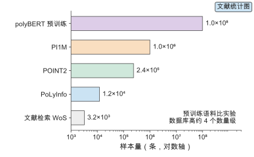
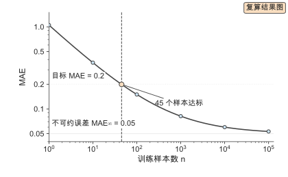
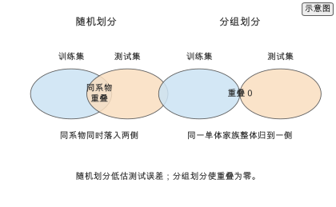
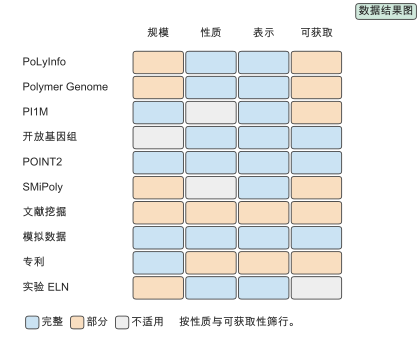
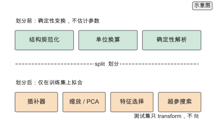
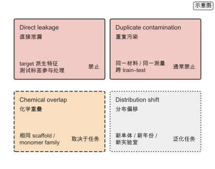
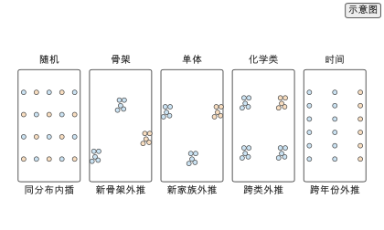
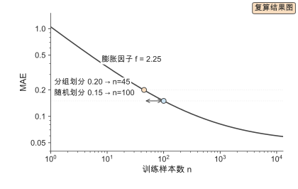
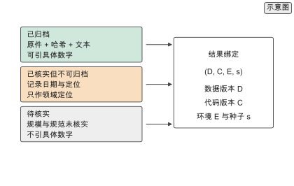

# 第 3 章 数据、基准与可复现性

用 6000 条玻璃化转变温度记录训练一个预测器，模型选定之后仍要回答三个问题：这 6000 条从哪里来，里面有没有重复结构，划分之后测试集是否真的没见过训练集里的化学环境。三个问题都属于数据，而不属于模型。同一批数据换一个划分，测试误差可以从 0.05 变成 0.15 `[示意]`，差别大于大多数模型改动带来的差别。

第 2 章把结构写成表示，这一章处理表示的来源与可信度。数据决定结论能外推多远：样本量给出误差下界，标签质量与划分方式决定这个下界是否可信。在固定预算下，把数据整理对，比把模型换大更有效。

本章沿“来源—数据集—质量—基准—可复现”的路线展开。3.1 到 3.2 交代数据从哪里来、公开数据集覆盖什么；3.3 处理小数据与数据质量；3.4 到 3.5 给出基准与可复现的规范。3.6 起进入可操作的部分：3.6 把来源放进一张对照表，3.7 给出推荐数据 schema，3.8 用四类区分拆解高分子数据中的 train–test overlap 与 contamination 风险，3.9 比较五种划分策略，3.10 给出评测的定量规范，3.11 用仓库真实结果走一次重叠诊断与划分对比，3.12 建立三级归档与版本绑定，3.13 给出数据治理流程，3.14 给出数据集选型指南，3.15 汇总练习。做数据的读者可沿 3.3 → 3.7 → 3.8 → 3.9 → 3.11 → 3.12 直接走通。

## 3.1 数据从哪来

高分子的标注样本来自三条渠道：湿实验与表征、计算与模拟、文献抽取与数据库。三条渠道的样本量、噪声结构与可复现程度不同，混用前必须分别登记来源。

### 3.1.1 实验与表征数据

一条实验记录写成七元组 $(s,\,M,\,P(M),\,c,\,T_\text{test},\,y,\,u)$：结构表示 $s$、分子量 $M$ 与分布 $P(M)$、加工条件 $c$、测试标准 $T_\text{test}$、性质值 $y$ 与单位 $u$。样本量典型为 $10^{2}$ 到 $10^{3}$ 条 `[示意]`。

实验数据的三个特征决定了它的用法。样本量小，单个性质的记录在千级；标签受加工条件与测试方法影响，同一结构在不同热历史下给出不同的 $T_g$；复现性有限，同一材料在不同实验室的热性能偏差可达数开尔文 `[文献]`。因此记录字段必须完整：结构表示、分子量与分布、加工条件、测试标准、数值与单位缺一不可。字段缺失的记录通常无法进入需要条件的任务。

### 3.1.2 计算与模拟数据

计算数据由第 5 章的密度泛函、分子动力学与机器学习势批量产生，样本量可达 $10^{4}$ 到 $10^{6}$ `[示意]`，比实验高两到三个数量级。一条计算记录写成 $(s,\,m,\,\text{ensemble},\,T,\,\text{software},\,\text{convergence},\,y)$：方法 $m$（泛函与基组或力场）、系综、温度、软件与版本、收敛判据、性质值。

计算数据的标签一致性与可复现性高于实验：同一方法、同一收敛判据给出同一个数，方差主要来自方法与收敛，而不是随机噪声。代价是与真实材料存在系统偏差，泛函近似与力场参数都会引入偏移，偏差结构在第 5 章展开。

### 3.1.3 文献抽取与数据库

文献是最大的一手来源。对 Web of Science 做一次限定检索，题目或摘要包含高分子相关词、摘要包含机器学习相关词，得到 3178 条记录 `[公开实验数据]`；年发文量从 2010 年的 26 篇增长到 2025 年的 699 篇，2019 至 2026 年占全部记录的 91.9% `[公开实验数据]`。[^wos]

文献抽取（text mining）把正文与表格中的结构–性质对转为结构化记录。它的瓶颈有三处：结构识别（把化学名称与图形还原为可解析的结构）、单位换算（统一到同一量纲）、条件缺失（论文未报告加工或测试条件）。抽取结果必须带出处与置信度，否则无法回溯。检索语料本身也带缺失：作者关键词字段在 763 条记录中缺失，机构关键词在 461 条中缺失，缺失率分别为 24.0% 与 14.5% `[公开实验数据]`。[^wos]

抽取的流水线可以拆成四段，每段有各自的失败模式与验收指标。第一段是版面解析：把 PDF 的段落、表格与图注切分出来，失败模式是把跨页表格切碎，验收指标是表格恢复率。第二段是实体识别：从句子中抽出聚合物名称、单体、性质名与数值，失败模式是把范围值或条件值当成性质值，验收指标是实体与数值的配对准确率。第三段是结构解析：把名称或缩写还原成可解析的结构，失败模式是缩写歧义（同一缩写对应不同聚合物），验收指标是解析成功率。第四段是单位与条件归一：把数值换算到统一量纲并补上测试条件，失败模式是条件缺失时的静默赋值，验收指标是单位一致率。四段的产物都要带原文定位（页码或段落编号），使每个抽取值都能人工复核。抽取数据的规模由检索语料决定，质量由这四段的验收指标决定；没有验收指标，抽取库只是文本的另一种排法。

文献抽取库与人工数据库的差别在可审计性。人工数据库的每条记录由专家录入并复核，规模小但字段齐；抽取库的每条记录由规则或模型生成，规模大但字段缺。把两者合并前，先按来源分组统计字段完整度与单位一致率，再决定哪些性质可以合并。抽取库适合做候选发现与趋势统计，人工数据库适合做精确回归的标签来源；把抽取库的粗略值直接当训练标签，会把识别误差学成结构规律。

## 3.2 主要数据集

公开数据集是高分子 AI 的公共基准，各有覆盖范围与偏差。本节按实验、生成与多性质三类介绍。

### 3.2.1 PoLyInfo 与实验数据库

PoLyInfo 由日本 NIMS 维护，收录聚合物名称、化学结构、分子量、热性能、力学与电学性质，聚合物条目约 $1.2\times10^{4}$ 条 `[文献]`。[^datasets] 它的价值在于来源可追溯的实验标签，局限在于字段缺失与条件不齐。字段完整度 $f_j=N_j^\text{nonnull}/N$ 决定可用子集：按完整度阈值 $\tau$ 筛选后，可用记录数 $N(\tau)$ 随 $\tau$ 单调下降。使用前先统计各性质字段的完整度，再决定任务范围，这是小数据约束的直接来源。[^extension3]

### 3.2.2 PI1M 与生成数据集

PI1M 提供约 $10^{6}$ 条生成聚合物结构 `[文献]`，用于预训练与表示学习。[^datasets] 生成库提供规模但不提供标签，性质标签需要另算，成本为

$$C_\text{labels}=N_\text{lib}\,c_\text{per label},$$

因此生成库主要服务表示预训练与生成模型，不直接提供性质标签。SMiPoly 把虚拟库限制在合成规则式内，规则式把链上不同单体种类限制为至多 $k$ 种，从而提高候选的可合成比例。[^smipoly]

### 3.2.3 Open Macromolecular Genome 与多性质数据

Open Macromolecular Genome 面向可合成聚合物，提供多性质标注。[^omg] 多性质数据集写成矩阵 $Y\in\mathbb{R}^{N\times P}$，$N$ 条材料、$P$ 种性质。覆盖率

$$\rho=\frac{\#\{(i,j):Y_{ij}\neq\text{null}\}}{NP}$$

决定可用的多任务程度。$\rho$ 越高，第 7 章多任务学习可共享的监督信号越多；按行完整度筛选会损失样本，按列筛选会损失性质，需在任务层面权衡。[^extension3]



*图 3-1　数据来源与规模。对数横轴对照文献检索、实验数据库、多性质基准、生成库与预训练语料五类样本量：文献检索 3178 条，PoLyInfo 约 $1.2\times10^{4}$ 条，POINT2 约 $2.4\times10^{5}$ 条，PI1M 约 $10^{6}$ 条，polyBERT 预训练语料约 $10^{8}$ 条；预训练语料比实验数据库高约 4 个数量级。五类的计量对象不同（文献记录、聚合物条目、数据库条目、生成结构、假设 PSMILES 字符串），规模不宜直接横比。（证据：公开实验数据／文献）*

## 3.3 小数据与数据质量

高分子性质数据普遍在千级，且标签带噪、单位不统一、划分易产生 train–test overlap。这三个问题决定了模型误差能压到多低。

### 3.3.1 样本量与标签噪声

学习曲线描述样本量与误差的关系，取幂律

$$\mathrm{MAE}(n)=\mathrm{MAE}_\infty+A\,n^{-\alpha},$$

其中 $\mathrm{MAE}_\infty$ 是不可约误差，$\alpha$ 反映数据效率。需要强调，这是**经验模型**：幂律由观测数据拟合得到，不是普适理论，高分子数据集可能偏离幂律，表现为平台、台阶或远大于预期的指数，因此拟合参数只在拟合覆盖的样本区间内可用。反解目标误差 $t>\mathrm{MAE}_\infty$ 所需样本量

$$n(t)=\Big(\frac{A}{t-\mathrm{MAE}_\infty}\Big)^{1/\alpha}$$。

取 $\mathrm{MAE}_\infty=0.05$、$A=1.0$、$\alpha=0.5$ `[示意]`：目标 0.2 需要约 44 个样本 `[复算]`，目标 0.1 需要 400 个 `[复算]`，目标 0.06 需要 $10^{4}$ 个 `[复算]`。目标从 0.2 收紧到 0.1，样本量增到 9 倍 `[复算]`；再收紧到 0.06，增到 225 倍 `[复算]`。小数据下误差对样本量极敏感。[^learningcurve]

标签噪声抬高 $\mathrm{MAE}_\infty$。当噪声把不可约误差从 0.05 抬到 0.1 `[示意]`，目标 0.1 在该幂律模型下不可达，增加样本量只能压低幂律项。因此顺序是先清标签、再扩数据。

> **练习 3-1〔核心〕：学习曲线与样本量**
>
> 给定学习曲线参数 $\mathrm{MAE}_\infty=0.05$、$A=1.0$、$\alpha=0.5$，反解达到目标误差 0.2 所需训练规模，再反解收紧到 0.1 所需规模，计算两者之差。说明目标每减半时边际数据量如何变化，以及当标签噪声把 $\mathrm{MAE}_\infty$ 抬高到 0.12 时两个目标是否可达。
>
> 条件：需要运行本书配套仓库的 `calculations/` 复算模块（learning-curve），参见 [learning-curve-target](../calculations/results/learning-curve-target.md)。



*图 3-2　学习曲线与目标误差。双对数坐标给出误差随训练样本量的下降：样本量从 1 增到 100 时误差从 1.05 降到 0.15，随后趋平，$\mathrm{MAE}_\infty=0.05$ 是水平渐近线。虚线标出目标 0.2 与达标样本数 45。（证据：复算）*

> **高分子物理 Box　为什么同一材料的 $T_g$ 会有多个值**
>
> 玻璃化转变不是热力学相变，而是一个动力学冻结过程。链段运动在降温时来不及跟上，体系在某个温度附近脱离平衡，$T_g$ 就取在“冻结发生”的位置。这个位置依赖降温速率：降温越快，链段越早失去活动性，测得的 $T_g$ 越高。差示扫描量热（DSC）的升温速率与热历史同样改变读数，同一批聚苯乙烯在不同实验室、不同程序下可以相差数开尔文 `[示意]`。这给数据治理两条直接后果。第一，`measurement_method` 与 `processing` 不是可选的描述字段，而是标签定义的一部分：不记它们，同名性质就不是同一个量。第二，同一材料的多条记录不能简单当作独立样本；它们共享材料身份，若被随机分到训练与测试两侧，就构成 3.8.1 的重复污染（duplicate contamination）。把材料指纹作为分组键，是对这条物理事实的工程回应。

### 3.3.2 缺失值与单位统一

缺失值有三种模式：性质字段缺失、条件字段缺失、结构字段缺失。处理顺序是先按字段完整度筛选，再用物理约束插补（例如 $T_g$ 必须高于测量温度下限），最后才用统计插补。物理约束插补优先于统计插补，因为前者不引入与结构无关的虚假相关性。

单位统一是标签清洗的一部分。约定温度用 K、分子量用 g/mol、热导率用 W/(m·K)、能量用 eV 与 kJ/mol。换算因子为

$$T(\mathrm{K})=T(^{\circ}\mathrm{C})+273.15,\qquad M(\mathrm{g/mol})=10^{3}\,M(\mathrm{kg/mol}),\qquad E(\mathrm{kJ/mol})=96.485\,E(\mathrm{eV})$$。

换算因子取自各单位的定义 `[文献]`。未统一时，摄氏与开尔文混用产生约 273 的常数偏移 `[复算]`，被模型当作真实方差；统一后该偏移消失。单位错误是标签噪声最常见的来源。换算因子是确定性常数，不依赖数据估计，因此可以在划分前统一到同一量纲；需要从数据估计参数的标准化（均值–方差缩放、PCA、插补统计量）不属于这一类，只能在训练集上拟合，见 3.7.3。[^extension3]

### 3.3.3 数据泄漏

数据泄漏（data leakage）指训练集与测试集共享了本应不可见的信息，使测试误差被低估。更准确地说，训练集与测试集之间的重叠（train–test overlap）按性质分成几类，只有一部分构成泄漏。设测试集 $T$、训练集 $R$，重叠率

$$L=\frac{\#\{x\in T:\ \exists x'\in R,\ \mathrm{canon}(x)=\mathrm{canon}(x')\}}{|T|}$$。

三类重叠各有来源。重复结构（duplicate）：同一结构的两种写法分别落入两侧，第 2 章的规范化可以消除，属于重复污染。同系物（homolog）：同一单体家族或相近聚合度被随机分到两侧，模型靠记忆骨架而非学规律；它是化学重叠，是否构成问题取决于部署目标，只有当目标为新家族外推时误差才被系统性低估。目标泄漏（target leakage）：用目标派生量作为特征，例如用密度预测密度；它在预测时不可获得，任何任务下都禁止。

对策取决于类别：目标泄漏要从特征表里删掉；重复结构要先规范化再去重；化学重叠要按结构或单体分组划分，而不是随机划分。设真实外推误差 $\epsilon_\text{out}$ 与重叠下误差 $\epsilon_\text{in}$，低估量 $\Delta=\epsilon_\text{out}-\epsilon_\text{in}$ 随重叠比例上升。分组键可用单体家族或骨架，划分时整组归入一侧，使目标键的 $L=0$。[^extension3]

> **练习 3-2〔核心〕：划分策略与泄漏**
>
> 对 6000 条 Tg 记录分别做随机划分与按单体分组划分（均为 80/20），核算两种划分下测试集与训练集的重叠结构比例，并比较两种划分给出的测试误差。说明随机划分为什么低估外推误差，以及分组划分后误差回升到什么水平。
>
> 条件：需要运行本书配套仓库的 `calculations/` 复算模块（learning-curve），并查阅本书参考文献中的 ^\[63\]^；参见 [learning-curve-target](../calculations/results/learning-curve-target.md)。



*图 3-3　划分策略与数据泄漏。左：随机划分下同一单体家族同时落入训练集与测试集，重叠区被模型记忆，测试误差被低估。右：按单体分组划分把整组归到一侧，重叠为零，测试误差回到外推水平。（证据：示意）*

## 3.4 基准与评测

基准把不同方法的比较固定在同一数据与同一指标上。本节按性质预测、生成与表示、竞赛与盲测三类组织。

### 3.4.1 性质预测基准

性质预测基准固定数据划分、特征与指标，报告

$$\mathrm{MAE}=\frac{1}{N}\sum_i|y_i-\hat y_i|,\qquad R^{2}=1-\frac{\sum_i(y_i-\hat y_i)^{2}}{\sum_i(y_i-\bar y)^{2}}$$。

以玻璃化转变温度为代表的基准同时给出随机划分与分组划分，两者差值即重叠低估量（对声明的新家族外推任务而言）。基准的可比性来自划分公开：任何未公开划分的“最优”结果无法复现，不能进入比较。[^tgbench]

基准的可比性还有三个常被忽略的前提。第一，指标口径一致：同一数据集上的 MAE 必须用同一单位与同一子集计算，否则数字不可比。第二，预处理一致：特征缺失的样本是删除还是插补，会改变测试集大小与分布，基准必须声明。第三，超参预算一致：给不同方法不同的调参次数，等于把调参算力混进方法差异。材料基准的实践把测试集与参考算法一起固定，正是为了让不同工作的数字能放进同一张表。[^matbench] 用基准时应先读它的划分、指标与预处理声明，再决定自己的结果能否与它对照；只比一个数字，往往比的是三处未声明的差异。

### 3.4.2 生成与表示基准

生成任务的三项指标：有效性 $V=N_\text{valid}/N_\text{gen}$（生成的结构能否被解析）、唯一性 $U=N_\text{unique}/N_\text{valid}$（去重后占比）、新颖性 $W=N_\text{novel}/N_\text{unique}$（不在训练集中的占比），再乘条件满足率 $C$。

表示任务的评测用线性探针：冻结表示、只训一个线性回归器，比较下游误差。这样把表示质量与模型容量分开，误差差异归因于表示本身。[^extension3]

### 3.4.3 竞赛与盲测

Kaggle NeurIPS Open Polymer Prediction 2025 是多性质预测竞赛，测试集标签不公开，参赛者只提交预测，得分由主办方计算。[^kaggle] 盲测防止对测试集的过拟合，代价是无法做误差归因：参赛者不知道误差来自哪一类结构。本地必须自建训练、验证与分组划分，并把划分固定下来。

## 3.5 可复现性

可复现性把一次结果从“能跑出数字”变成“换台机器也能得到同一数字”。它由划分、种子与报告规范三部分保证。

### 3.5.1 划分与随机种子

划分必须在建模前固定并公开。一个固定划分由分组键 $k$、比例 $q$ 与种子 $s$ 三元组确定：$(\text{split})=(k,q,s)$。分组键说明按什么分组（单体家族、骨架或结构），比例说明各子集大小，种子说明随机数生成器的起点。

随机种子影响小数据任务的结果方差。同一划分与模型在 $K$ 个种子上重跑，报告均值与标准差

$$\bar m=\frac{1}{K}\sum_{j=1}^{K}m_j,\qquad \sigma_m=\sqrt{\frac{1}{K-1}\sum_{j=1}^{K}(m_j-\bar m)^{2}},$$

$K$ 取 5 或 10。只报单次最优值会高估性能；种子间标准差可达若干个百分点，与部分模型改进同量级。在小规模高分子数据集上，种子间方差常常大于模型之间的真实性能差，因此单次种子的结果几乎不提供信息，应报告多个种子的均值与离散度。[^extension3]

### 3.5.2 报告规范与元数据

报告清单含六项：数据来源与版本、划分与种子、特征与表示、模型与超参数、指标与误差棒、计算环境。缺任何一项，结果都无法在另一台机器上复现。

元数据随样本存储，字段为来源、条件、单位、置信度。字段完整时，任意正文数字可回溯到记录，复现只需重跑固定命令。全书数字都指向 `calculations/`，结果文件与输入哈希一同归档。[^calc]

> **练习 3-3〔核心〕：单位与缺失值核算**
>
> 对一份混合来源的性质表核算各字段缺失率与单位分布，识别同名字段的不同单位（$T_g$ 字段含 K 与 °C 两种单位，分子量字段含 g/mol 与 kg/mol 两种单位），给出统一后的记录数与丢弃数。说明单位混用为什么会产生数百开尔文量级的假异常值。
>
> 条件：需要运行本书配套仓库的 `calculations/` 复算模块（learning-curve），参见 [learning-curve-target](../calculations/results/learning-curve-target.md)；推导见 [第 3 章在线扩写资料](../archive/outlines/extensions/03-数据、基准与可复现性.md)。

## 3.6 数据来源对照

3.1 按渠道、3.2 按数据集介绍了来源，这一节把它们放进同一张表，逐列核对规模、性质、表示、许可与可获取性。对照表是选数据集的入口：先看规模与性质覆盖，再看许可与获取方式，最后才比较模型。

### 3.6.1 一张数据来源对照表

十条来源覆盖数据库、生成库、文献、模拟、专利与实验记录，规模跨约四个数量级。

| 来源 | 规模（计量对象） | 性质 | 表示 | 许可/获取 | 优势与局限 |
| --- | --- | --- | --- | --- | --- |
| PoLyInfo | 约 $1.2\times10^{4}$ 条聚合物条目（物性数据点另计） | 热、力学、电学（实验） | 结构 + 名称 | 注册后查询 | 来源可追溯；字段与条件缺失 |
| Polymer Genome | 随版本（网站条目） | 多性质（介电、带隙、$T_g$） | 描述符指纹 | 网站查询 | 多性质可复用；划分未公开 |
| PI1M | 约 $10^{6}$ 条生成结构 | 无标签（生成） | PSMILES | 随论文提供 | 规模大；标签需另算 |
| Open Macromolecular Genome | 本书未核实（公开规模未复核） | 多性质（可合成） | 结构 + 性质 | GitHub 开放 | 面向可合成；规模未核实 |
| POINT2 | 约 $2.4\times10^{5}$ 条数据库条目 | 多性质（含计算） | 结构 + 性质 | 开放下载 | 划分明确；性质覆盖不均 |
| SMiPoly | 规则式生成的虚拟结构（规模随规则） | 无标签 | 反应规则 + 结构 | 随论文或工具 | 可合成性高；规则限覆盖 |
| 文献挖掘 | $10^{3}$ 起（文献记录） | 依抽取目标 | 名称、表格转结构 | 依原文许可 | 一手来源；识别与单位瓶颈 |
| 模拟数据 | $10^{4}$–$10^{6}$（模拟条目） | 能量、动力学 | 结构 + 方法 | 依计算许可 | 标签一致；有系统偏差 |
| 专利 | $10^{5}$–$10^{6}$ 文本（专利文档） | 组成、配方 | 文本 + 结构 | 专利数据库 | 覆盖配方；结构与条件不规范 |
| 实验 ELN | $10^{2}$–$10^{4}$（实验记录） | 多性质 | 结构 + 条件 | 机构内部 | 条件完整；不公开、格式各异 |

表中的规模取公开报告的条目数 `[文献]`，计量对象逐行写明：PoLyInfo 计的是聚合物条目，PI1M 计的是生成结构，POINT2 计的是数据库条目，polyBERT 预训练语料计的是假设 PSMILES 字符串；它们不是同一种统计单位，规模不宜直接横比。三个判断从表里直接读出。第一，规模跨约四个数量级：实验与文献记录在 $10^{2}$ 到 $10^{4}$，生成库与预训练语料在 $10^{6}$ 到 $10^{8}$，把两者混在一张学习曲线上没有意义。第二，性质覆盖与规模反向：规模大的库大多无标签或单性质，多性质标注集中在 $10^{4}$ 到 $10^{5}$。第三，许可与可获取性决定能否归档：开放数据集可以下载并固定哈希，订阅来源只能登记定位。

许可决定的不只是“能不能用”，还有“能不能再分发”和“能不能归档快照”。四类常见许可对应四种处理：完全开放（可下载、可再分发、可固定哈希）、注册后查询（可查询但不可批量再分发，只能记录查询日期与结果摘要）、随论文提供（以论文版本为准，需记录版本号与补充材料链接）、机构内部（不可公开，只能报告统计量）。可获取性会随时间变化：网页入口会失效，数据库会改版，订阅会到期。因此对已归档来源要同时保存原件、可检索文本与访问日期；对不可归档来源只记录定位，不在正文里引具体数字。这一分级在 3.12 展开为三级归档制度。

主要公开数据集的版本、访问日期、定位与许可登记如下。字段取自 `calculations/configs/datasets.json` 与 `references/` 中的归档快照与抓取记录；无法从这些来源核对的字段写「本书未核实」并给出原因，不补造。

| 数据集 | 版本 | 访问日期 | DOI / URL | 许可 |
| --- | --- | --- | --- | --- |
| PoLyInfo | 网站快照 | 2026-09-16 | <https://polymer.nims.go.jp/> | 本书未核实（快照未含许可条款） |
| Polymer Genome | 网站（随站点更新） | 2026-09-17 | <https://doi.org/10.1021/acs.jpcc.8b02913> | 本书未核实（归档来源未登记许可） |
| PI1M | v1（2020） | 2026-09-17 | <https://doi.org/10.1021/acs.jcim.0c00726> | 本书未核实（订阅论文，许可未登记） |
| Open Macromolecular Genome | main（2023） | 2026-09-16 | <https://github.com/TheJacksonLab/OpenMacromolecularGenome> | GPL-3.0（归档 README） |
| POINT2 | 2503.23491v1（2025） | 2026-09-17 | <https://arxiv.org/abs/2503.23491> | 本书未核实（快照未含许可条款） |
| SMiPoly | 2023 | 2026-09-17 | <https://doi.org/10.1021/acs.jcim.3c00277> | 本书未核实（订阅论文，许可未登记） |
| polyBERT 预训练语料 | 2023 | 2026-09-16 | <https://doi.org/10.1038/s41467-023-39868-6> | 论文 CC BY 4.0；语料声明仅限学术用途 |
| WoS 检索导出 | 2010–2027 检索式 | 2026-09-16 | [检索说明](../references/wos/README.md) | 本书未核实（数据库订阅条款） |



*图 3-4　数据来源对照矩阵。行是十条来源，列是规模、性质覆盖、表示与可获取性；颜色表示完整（蓝）、部分（橙）与不适用（灰）。（证据：文献）*

使用这张矩阵时，先按任务需要的性质与条件字段筛行，再看可获取性决定能否归档并引具体数字。

### 3.6.2 来源的标签语义

同名的性质在不同来源里不是同一个标签。实验标签是材料在特定加工与测试条件下的响应；计算标签是特定方法与收敛判据下的数值；文献抽取标签还带一层识别误差。三者的分布中心与宽度都不同，把它们直接合并，模型学到的是来源差异而不是结构–性质关系。

设来源 $a$、$b$ 对同一结构的标签均值为 $\mu_a$、$\mu_b$，合并后的组间偏移写成

$$\Delta_\text{source}=|\mu_a-\mu_b|,$$

它与结构无关，却进入模型可学的方差。判据是：若 $\Delta_\text{source}$ 与目标误差同量级，合并前必须按来源分组或对齐；若远小于目标误差，才可以直接合并。实验与计算的热性能偏差、不同泛函之间的能隙偏差都落在前一档。[^extension3]

### 3.6.3 混用与合并规则

合并三条渠道前依次做三件事。第一，按来源登记：每条记录带来源标识，来源不清的记录不进入合并表。第二，对齐条件字段：温度、压力、加工与测试方法统一到同一量纲，缺失条件单独标记。第三，分层再合并：先按来源训练或分组，报告组间差异，再决定是否合并。顺序颠倒会把来源偏差埋进结构特征，后续无法归因。

> **论文 Box　POINT2 与 Open Polymer Challenge：把划分写进基准**
>
> POINT2 是面向聚合物信息学的训练与测试数据库，把结构与多性质标签组织成可复用的基准，并明确给出训练与测试划分，使不同方法的比较有共同底座。[^point2] Open Polymer Challenge 是 2025 年的公开竞赛，赛后报告给出参赛方法、指标与划分设置，把竞赛结果转为可引用的基准记录。[^opc] 两份工作的共同点是把“划分”当作基准的一等公民：POINT2 固定划分供训练，竞赛固定划分供盲测。它们的作用不是给出最高精度，而是让精度可比较。

## 3.7 推荐数据 schema

数据治理的产出是一张可训练表。表里的每一行要能独立回答四个问题：什么结构、什么条件、什么性质、谁测的。回答不全的行，进入模型后会把缺失当作信号。

### 3.7.1 字段定义

推荐的最小 schema 用十六个字段覆盖结构、分子量、条件、性质与出处：

```yaml
polymer_id:         "poly-000123"          # canonical PSMILES hash
repeat_unit:        "[*]CC(c1ccccc1)[*]"   # PSMILES
monomer_1:          "styrene"
monomer_2:          null
composition:        "1:0"
Mn:                 120000                  # g/mol
Mw:                 240000                  # g/mol
D:                  2.0                     # Mw/Mn, dispersity
temperature:        298.15                  # K
pressure:           0.101325                # MPa
processing:         "quenched from 423 K"
property:           "Tg"
property_value:     373.15
unit:               "K"
measurement_method: "DSC, 10 K/min, N2"
reference:          "doi:10.1021/..."
```

字段分三组。结构组是 `polymer_id`、`repeat_unit`、`monomer_1`、`monomer_2` 与 `composition`，它们决定去重与分组键。分子量组是 `Mn`、`Mw` 与 `D`（分散度 Đ，polydispersity index，PDI $=M_w/M_n$），$D$ 由前两者推出，同时存储是为了核对。条件组是 `temperature`、`pressure` 与 `processing`，它们决定标签在什么状态下成立。性质组是 `property`、`property_value`、`unit` 与 `measurement_method`，出处由 `reference` 承担。

### 3.7.2 必填、条件必填与选填

不是所有字段对所有任务都必需。按缺失后果分三级。

| 级别 | 字段 | 缺失后果 |
| --- | --- | --- |
| 必填 | `polymer_id`、`repeat_unit`、`property`、`property_value`、`unit`、`reference` | 记录不可用 |
| 条件必填 | `Mn`、`D`、`temperature`、`measurement_method` | 依赖条件的性质不可比 |
| 选填 | `monomer_2`、`composition`、`Mw`、`pressure`、`processing` | 分组变粗、外推受限 |

条件必填的含义是：预测 $T_g$ 时 `Mn` 必填，预测介电常数时频率必填，预测力学性质时 `processing` 与测试温度必填。把条件字段缺失的行留在训练集里，模型学到的是被平均掉的混合规律，误差下界由标签歧义锁死。[^extension3]

### 3.7.3 从记录到可训练表

一条记录变成一行特征，要经过五步，顺序固定：规范化结构 → 统一单位 → 条件筛选 → 特征化 → 划分。前四步是数据侧，最后一步是评测侧。顺序的关键是区分两类变换。第一类是确定性变换：结构规范化、单位换算（$T(\mathrm{K})=T(^\circ\mathrm{C})+273.15$）与确定性解析只依赖定义，不从数据估计任何参数，可以在划分前统一到同一量纲。第二类是需要拟合的变换：插补器、均值–方差缩放、PCA、特征选择与超参数搜索都要从数据估计参数，必须只在训练集上拟合，再以同一参数变换验证集与测试集；测试集只参与 transform，不参与 fit。把第二类放到划分之前，才会让测试集信息进入参数估计，这才是需要避免的泄漏（图 3-9）。[^extension3] 字段与元数据的组织方式有现成规范可参照：数据文档（datasheets）要求为数据集写明动机、组成、采集与用途，[^datasheets] FAIR 原则要求数据可发现、可访问、可互操作、可复用。[^fair]



*图 3-9　数据变换与划分的安全顺序。上半为确定性变换（结构规范化、单位换算、确定性解析），只依赖定义，可在划分前统一；下半为需要从数据估计参数的变换（插补器、缩放与 PCA、特征选择、超参搜索），只在训练集上拟合，测试集只做 transform。图按“是否估计参数”分类，与颜色无关。（证据：示意）*

> **实践 Box　把 schema 落成一张检查表**
>
> 落地时用一张检查表比用一段描述可靠。检查项：结构解析成功率、规范化后唯一结构数、重复结构删除数、单位一致率、必填字段完整率、条件字段缺失率、分组键覆盖数。每一项给一个阈值，低于阈值不放行。例如结构解析成功率低于 99% 时先修解析器，应避免静默丢弃；必填字段完整率低于 90% 时先缩小任务范围，应避免用插补掩盖。检查表随数据版本一起归档，使“这批数据能不能用”变成一个可核对的问题。

## 3.8 高分子特有的数据泄漏

3.3.3 给出了泄漏的定义与三类来源。这一节先把高分子数据的 train–test overlap 与 contamination 风险分成四类，再给出六类分组键作为检测工具。四类区分的要点是：不是所有 overlap 都叫泄漏，是否错误取决于任务。直接泄漏与重复污染是真正禁止的；化学重叠是否可接受取决于部署目标；分布偏移不是泄漏，而是泛化任务。泄漏仍是本章的重点：它不改变模型，却能把测试误差从外推水平压到记忆水平，且这种压低在单次实验里看不出来。机器学习领域的系统调查把泄漏列为复现危机的主要来源之一，指出它同时影响误差估计与结论方向。[^leakage]

四类风险按是否一定错误区分如下。

| 类型 | 例子 | 是否一定错误 |
| --- | --- | --- |
| Direct leakage（直接泄漏） | target 派生特征、test label 参与处理 | 是 |
| Duplicate contamination（重复污染） | 同一材料或同一测量跨 train–test | 通常是 |
| Chemical overlap（化学重叠） | 相同 scaffold 或 monomer family | 不一定，取决于任务 |
| Distribution shift（分布偏移） | 新单体、新年份、新实验室 | 不是泄漏，是泛化任务 |

化学重叠的判定要落到部署任务上。若部署目标是在已有化学家族内插值，化学重叠是合法的评测 regime，随机划分报告的误差就是内插误差；若部署目标是外推到新家族，同样的重叠会把外推误差系统性低估。判断依据是任务声明，而不是重叠本身的高低。

### 3.8.1 六类泄漏

设测试集 $T$、训练集 $R$，第 $k$ 类分组键为 $\kappa_k(x)$。第 $k$ 类重叠率定义为测试集中其分组键在训练集出现的比例

$$L_k=\frac{\#\{x\in T:\ \exists x'\in R,\ \kappa_k(x)=\kappa_k(x')\}}{|T|}$$。

六类分组键是检测工具，按上表归入四类。

**Direct leakage（直接泄漏，禁止）。**

- 组成泄漏（目标泄漏的一种）：$\kappa$ 不适用，检测靠特征审计。用目标派生量或未来信息作特征，例如用密度预测密度、用组成直接反推只由组成定义的性质。判据是这个特征在预测时是否可获得、是否由 target 或未来信息直接或间接构造；特征与目标的相关性只作审计提示，不作泄漏判据，因为物理上真正有意义的变量可以与目标高度相关。后果：测试指标接近完美，部署时崩塌。

**Duplicate contamination（重复污染，通常禁止）。**

- 相同重复单元：$\kappa$ 取规范化字符串。同一结构的两种写法或两个来源的记录分别落入两侧，模型在测试集上重复看到训练结构。检测方法是规范化后对 $T$ 与 $R$ 取哈希交集，正确做法是先去重再划分。后果：测试误差虚低，虚低幅度约等于重复样本占比。[^extension3]
- 重复测量：$\kappa$ 取材料指纹加测量方法。同一材料的多次测量（不同批次或条件）分到两侧，测试集里出现训练材料的近重复。检测方法是按材料指纹计数，检查跨集重复。后果：模型学到材料身份而非结构规律，误差棒被低估。[^extension3]

**Chemical overlap（化学重叠，取决于任务）。**

- 同系物：$\kappa$ 取单体家族或骨架。同一家族的相似物被随机分到两侧，模型记住骨架而非学规律。检测方法是对 $T$ 与 $R$ 取骨架集合的交集。后果：若部署目标是新家族外推，外推误差被系统性低估；若部署目标就是同族内插，这是合法的评测 regime。
- 同一单体对：$\kappa$ 取无序单体对。共聚物由同一对单体构成，仅比例或序列不同，随机划分把它们分到两侧。检测方法是对单体对做集合交。后果：预测新单体对时共聚组成相关性质的测试误差被低估；预测已知单体对的新比例时可以放宽。
- 同一主链：$\kappa$ 取主链骨架，忽略侧链与端基。主链相同、侧链不同的结构共享大部分化学环境。检测方法是对主链图做规范化后再取交。后果：侧链敏感性质（溶解度、介电）在跨侧链外推时的泛化被高估。

**Distribution shift（分布偏移，不是泄漏）。**

- 新单体、新年份、新实验室：测试分布与训练分布不同。检测方法是比较两集的分布或直接按时间与来源切分。它不是泄漏，不能靠换分组键消除，只能用 monomer 或 time 划分显式声明，并用补数据或改表示来应对。

六类分组键可以统一成一个重叠预算

$$L=\max_k L_k$$。

报告时逐类给出 $L_k$，并注明每一类属于上表哪一档；不建议只给一个总重叠率。

四类不是互斥的，同一对结构可以同时触发几类，处理顺序因此重要。先修直接泄漏：它是特征侧的错误，与划分无关，修法是从特征表里删掉目标派生量或未来信息。再修重复污染：它是结构侧的错误，修法是规范化后去重、按材料指纹归并。最后处理化学重叠：它是划分侧的问题，修法是换分组键；是否要把某一类键压到零，取决于部署时该键对应的结构单元是否可见——预测新单体家族时，monomer 键的 $L_\text{monomer}$ 应压到零；部署目标只是已知家族内插时，monomer 键可以保留重叠，此时它衡量的是内插难度而不是泄漏。分布偏移不通过换键消除，只能通过补数据或改表示应对。把“哪一类键是硬约束、哪一类只是声明”写进实验记录，检测才有明确目标。



*图 3-5　高分子数据中的 train–test overlap 与 contamination 风险。四格按是否一定错误区分：红色实线为真正禁止（Direct leakage 直接泄漏、Duplicate contamination 重复污染），橙色虚线为取决于任务（Chemical overlap 化学重叠），灰色点线为分布偏移（Distribution shift，泛化任务）；每格给出代表例子与处置标签，类别同时由边框线型与标签表达，不单靠颜色。来源：本书对高分子评测实践的归纳，四类框架是声明性的教学分类。（证据：示意）*

### 3.8.2 泄漏检测流程

检测在划分之后、训练之前做，五步。

1. 规范化与去重：把结构统一到唯一形式，删除完全重复，并按材料指纹归并重复测量。
2. 建立分组键：按六类各建一个键，键函数写入代码与记录。
3. 计算跨集重叠：对每个键算 $L_k$，输出六元组，并标注每一类属于四类风险中的哪一档。
4. 特征审计与阈值告警：对每个特征做可获得性审计（预测时是否可得、是否由目标或未来信息构造），特征与目标的相关性只作提示；对任务依赖的键设阈值，直接泄漏与重复污染要求为零，化学重叠按任务设定，分布偏移不作泄漏处理。
5. 重新划分：把整组归入一侧，使目标键的 $L_k=0$，再重算其余键。

流程的输出是一张重叠表，随划分一起归档。没有这张表，任何“测试误差很低”的结论都不可信。

### 3.8.3 泄漏的定量后果

重叠对误差的压低可以翻译成数据膨胀，前提是部署目标确为被重叠的键所代表的外推任务。设真实外推误差 $\epsilon_\text{out}$、重叠下误差 $\epsilon_\text{in}$，两者在同一学习曲线上对应的样本量之比为

$$f=\Big(\frac{\epsilon_\text{out}-\mathrm{MAE}_\infty}{\epsilon_\text{in}-\mathrm{MAE}_\infty}\Big)^{1/\alpha},$$

其中 $\alpha$ 是学习曲线的幂指数。取 $\alpha=0.5$ 时 $f$ 是括号的平方。$f$ 的含义是：在声明了外推任务的前提下，重叠让 $n$ 条数据表现出 $fn$ 条的效果。$f=2$ 时，随机划分报告的误差等价于把数据翻倍；把 $f$ 写进报告，读者才能判断结论需要多少真实数据支撑。3.11 用仓库真实结果算一次 $f$。[^extension3]

> **失败 Box　随机划分让一个无效模型胜出**
>
> 设任务预测共聚物 $T_g$，数据里每个单体家族有多条记录。有人用随机 80/20 划分比较两个模型：模型 A 用结构指纹，模型 B 只用单体对组成。随机划分下 B 的测试误差低于 A，于是结论是“组成特征足够”。换按单体对分组划分后，B 的误差上升、A 的误差上升较少，结论反转。根因是同一单体对的样本被随机分到两侧，B 直接记住了单体对与 $T_g$ 的对应；分组划分切断了这条记忆路径，B 只剩下真实但更弱的外推能力。这个失败不来自模型，来自划分；修法是先建分组键再划分，并报告两种划分下的结果。

## 3.9 划分策略

划分决定测试集代表什么分布。同一个模型在同一批数据上，换一种划分就能得到不同的误差，因此划分不是预处理细节，而是实验设计的一部分。

### 3.9.1 五种划分

按分组键由粗到细，常用五种划分。

| 划分 | 分组键 | 回答的问题 | 适用任务 | 风险 |
| --- | --- | --- | --- | --- |
| random | 无 | 同分布内插精度 | 方法内部对照 | 高估外推 |
| scaffold | 骨架 | 新骨架外推 | 分子性质预测 | 骨架定义不稳 |
| monomer | 单体家族 | 新家族外推 | $T_g$、溶解度 | 粒度敏感 |
| chemistry | 化学类 | 新化学类外推 | 跨类泛化 | 类边界主观 |
| time | 发表年份 | 新数据外推 | 文献数据部署 | 早期数据偏少 |

random 划分把样本独立同分布地分配，它度量的是同分布内插，不是外推。scaffold 划分来自小分子领域，测试集的骨架不在训练集出现，[^scaffold] 高分子的对应物是骨架或重复单元。monomer 划分把同一单体家族的样本整组归入一侧，是本章的默认。chemistry 划分按官能团或化学类分组，适合跨类泛化。time 划分按发表年份切，最接近“用历史数据预测新数据”的部署场景。分布偏移研究给出的教训是：把测试分布当作固定假设，必须先用多组划分把偏移暴露出来，再比较方法的鲁棒性。[^domainbed]



*图 3-6　五种划分策略。每个面板给出训练集（蓝）与测试集（橙）在结构空间里的分配：随机划分交错，骨架、单体与化学类划分按组切分，时间划分按年份切分。（证据：示意）*

划分方式即对「将来要预测什么分布」的声明，报告必须写明分组键与比例。

### 3.9.2 划分与任务的匹配

选择划分先问模型将来要预测什么。预测同分布内的新样本，random 划分合适，但必须同时报告分组划分的结果作为外推上界。预测新单体家族，monomer 划分合适。预测新化学类，chemistry 划分合适。预测未来文献里的材料，time 划分合适。

外推越远，误差越高，这是正常的；把外推误差报告成内插误差才是问题。最小报告要求是两种划分：一种内插（random），一种外推（按任务选 monomer、chemistry 或 time）。两者差值即化学重叠或分布偏移的代价。

### 3.9.3 分组键与实现

分组键的粒度决定划分的难度。键太细（例如按完整结构）退化为 random，因为每组只有一条；键太粗（例如按元素组成）会把性质差异大的结构塞进一组，外推难度虚高。常用折中是按单体家族或骨架，一个键对应若干条结构相似、性质相近的记录。

实现时把键函数写成纯函数并版本化：$\kappa=\text{key}(\text{structure};\ \text{version})$。键函数的版本与划分一起归档，换版本等于换划分。划分用嵌套结构：外层按任务键分组，内层在训练集里再做交叉验证，使超参搜索看不到测试组。

> **ML Box　为什么分组键的粒度比模型更影响结论**
>
> 同一批数据、同一模型，分组键从“完整结构”换成“单体家族”，测试误差可以上升一个量级。原因是键变粗后，测试组里的结构在训练集里没有近邻，模型只能外推；键太细时，测试结构在训练集里有近重复，模型靠记忆就能过。粒度选择不是技术细节，而是对“将来要预测什么”的声明。判据是：分组键应当对应部署时不可见的最小结构单元。若部署时会出现新单体，键就取单体家族；若只会出现已知单体的新比例，键可以取单体对。记忆与外推的差别有直接的实验证据：模型可以记住随机标签而训练误差为零，测试表现却与结构无关。[^rethinking]

## 3.10 基准与评测的定量规范

3.4 介绍了基准的类别。这一节给出评测的定量规范：指标怎么选、不确定度怎么算、结果怎么报。规范的目标是让两个数字的差异可以归因，而不是让数字好看。

### 3.10.1 指标与不确定度

四个指标覆盖回归任务的不同侧面。MAE 与 $R^{2}$ 的定义见 3.4.1，这里补充 RMSE 与 Spearman 相关系数：

$$\mathrm{RMSE}=\sqrt{\frac{1}{N}\sum_i(y_i-\hat y_i)^{2}},\qquad \rho=1-\frac{6\sum_i d_i^{2}}{N(N^{2}-1)}$$。

MAE 对离群点不敏感，适合报告典型误差；RMSE 放大离群点，适合报告最坏情况；$R^{2}$ 依赖标签方差，跨数据集不可比；Spearman 相关系数 $\rho$ 只看排序，适合筛选任务。四个一起报，才能区分“平均准”与“排序准”。

指标选择要对应任务的代价结构，而不是默认取 MAE。筛选任务只关心排序，$\rho$ 是主指标，MAE 是辅助；工程验收关心典型误差，MAE 是主指标；安全或失效相关的最坏情况，RMSE 或高分位数误差更合适。$R^{2}$ 的分母是标签方差，同一模型在标签跨度大的数据集上 $R^{2}$ 更高，因此 $R^{2}$ 只能在同一数据集的模型之间比较，不能跨数据集比较。报告时同时给主指标与一个辅助指标，可以暴露“平均准但排序差”这类偏差。

不确定度用自助法（bootstrap）估计：对测试集有放回重采样 $B$ 次，每次算指标，取 2.5% 与 97.5% 分位数作为 95% 置信区间，$B$ 取 $10^{3}$ 量级。只报点估计会让种子间差异与方法间差异混在一起。自助法有两个前提：重采样单元与样本独立，以及测试集规模足够大。高分子数据的测试集里若含同系物簇，重采样单元应取簇而不是单条记录，否则区间被低估；测试集只有几十条时，区间宽度主要由样本量决定，此时应报告样本量与区间，而不是只报一个精确到小数点后三位的点估计。

### 3.10.2 多重随机种子与置信区间

同一划分与模型在 $K$ 个种子上重跑，按 3.5.1 的均值与标准差口径报告（$K$ 取 5 或 10）。均值的标准误 $\sigma_m/\sqrt{K}$ 度量“均值估计得多准”，$\sigma_m$ 度量“单个结果波动多大”，两者不能混用。比较两个方法时，用同一组折做配对比较：先算每折的差 $d_j=m_j^{(A)}-m_j^{(B)}$，再对 $\bar d$ 做 $t$ 检验，比分别报两个均值更灵敏，因为它消掉了折间方差。[^cv] 只报最优种子会高估性能，正确做法是固定预算并报告误差棒，使“差异是否落在波动内”可判断。[^showyourwork]

### 3.10.3 报告清单

一个可比较的结果至少包含六项。

| 项 | 内容 | 缺失后果 |
| --- | --- | --- |
| 数据 | 来源、版本、校验值 | 无法确认用了哪批数据 |
| 划分 | 分组键、比例、种子 | 无法复现测试集 |
| 特征 | 表示与版本 | 无法区分表示与模型贡献 |
| 模型 | 模型族与超参范围 | 无法归因精度来源 |
| 指标 | 指标定义、误差棒、折数 | 无法判断差异是否显著 |
| 环境 | 软件与硬件版本 | 无法复现数值 |

六项之外，报告还要给数据规模与性质覆盖。样本量是误差下界的输入，覆盖决定外推范围。把这两项与六项一起写进实验记录，结果才有可比性。生物学与材料领域的报告建议给出同一组字段，[^dome] 材料基准的实践表明，在固定划分与固定指标下，跨研究的数字才能放进同一张表。[^matbench]

> **可复现 Box　一次评测需要固定的四样东西**
>
> 数据版本、代码版本、环境版本与随机种子。数据版本用文件哈希固定；代码版本用提交号固定；环境版本记录关键库与硬件；随机种子分三处（划分、初始化、采样），各自独立记录。四样齐全时，任意正文数字都可以重跑得到。缺任何一样，结果只能当作一次性观察，不能当作结论。本书的 `calculations/results/` 与各章实验目录按这四样归档，`calculations/calc.py reproduce` 给出复现命令。

## 3.11 Worked example：一次泄漏诊断与划分对比

这一节用仓库里的真实结果做一次重叠诊断。曲线与参数取自 `calculations/results/learning-curve-target.json`，规模取自 `calculations/configs/datasets.json`；声明输入标 `[示意]`，由曲线反解的量标 `[复算]`。

### 3.11.1 任务与数据

任务：为一批 $T_g$ 记录训练回归器，选择划分。数据集规模取 PoLyInfo 量级，可用 $T_g$ 子集 $N=6000$ 条 `[示意]`。结构按单体家族分组，得 $G=1200$ 组、组均 5 条 `[示意]`。学习曲线参数取自结果文件：$\mathrm{MAE}_\infty=0.05$、$A=1.0$、$\alpha=0.5$ `[示意]`，曲线上的点为 $n=1$ 时 1.05、$n=10$ 时 0.366、$n=100$ 时 0.15、$n=1000$ 时 0.0816、$n=10^{4}$ 时 0.06 `[复算]`。[^learningcurve] 幂律学习曲线的经验形式与跨尺度误差预测分别见两项大规模实验研究。[^hestness][^rosenfeld]

### 3.11.2 泄漏诊断

先算随机 80/20 划分下的同系物重叠率。对组均 $s=5$ 的等大小家族，一个测试样本的家族完全不出现于训练集的概率是 $(1-q)^{s}$，其中训练比例 $q=0.8$。于是

$$L_\text{monomer}=1-(1-q)^{s}=1-0.2^{5}=0.99968$$。

随机划分下几乎每个测试样本都能在训练集里找到同家族近邻，同系物重叠率约 99.97% `[复算]`。按单体分组划分把整组归入一侧，$L_\text{monomer}=0$。同一计算对 $s=10$ 给出 $1-0.2^{10}$ 约 0.9999999 `[复算]`，对 $s=2$ 给出 $1-0.2^{2}=0.96$ `[复算]`：家族越大，随机划分的同系物重叠越严重，且始终接近 1。

### 3.11.3 划分对比

把两种划分的测试误差放到学习曲线上。声明随机划分报告 $\epsilon_\text{in}=0.15$、分组划分报告 $\epsilon_\text{out}=0.20$ `[示意]`。用 3.3.1 的反解式 $n(t)=((t-\mathrm{MAE}_\infty)/A)^{-1/\alpha}$：

$$n(0.15)=\Big(\frac{0.15-0.05}{1.0}\Big)^{-2}=100,\qquad n(0.20)=\Big(\frac{0.20-0.05}{1.0}\Big)^{-2}=44.4\to45$$。

随机划分的 0.15 对应 100 个样本的效果，分组划分的 0.20 对应 45 个，两者相差 $100/45=2.22$ 倍 `[复算]`。代入 3.8.3 的膨胀因子

$$f=\Big(\frac{\epsilon_\text{out}-\mathrm{MAE}_\infty}{\epsilon_\text{in}-\mathrm{MAE}_\infty}\Big)^{2}=\Big(\frac{0.15}{0.10}\Big)^{2}=2.25$$。

即在这个新家族外推任务下，随机划分把 45 条数据的真实信息量报告成 100 条，等价于把数据放大 2.25 倍 `[复算]`。若目标误差是 0.15，分组划分下需要真实样本 $n(0.15)=100$ 才能达到，而随机划分让 45 条就“达标”；差额 55 条 `[复算]` 是重叠制造的虚假数据。

膨胀因子对误差差的敏感性可以算出来。固定 $\mathrm{MAE}_\infty=0.05$、$\epsilon_\text{in}=0.15$，当分组划分误差从 0.17 升到 0.25 时，$f$ 从 $(0.12/0.10)^{2}=1.44$ 升到 $(0.20/0.10)^{2}=4.00$ `[复算]`。误差差看似不大（0.02 到 0.10），等效数据量却相差近三倍，原因是 $f$ 对误差差是平方增长。这给报告一个判据：两种划分的误差差超过种子波动时，通常值得给出 $f$；差值落在波动内时，先扩大种子数再判断。

误差差的来源要写清。它可能来自化学重叠（训练集里有测试结构的近邻），也可能来自真实的分布偏移（测试集结构确实更难）。区分方法是看分组键：若按目标键分组后 $f$ 显著下降，差异主要来自重叠；若 $f$ 不降，差异来自分布偏移，属于任务本身的外推难度，不能通过换划分消除。两种来源对应不同的改进方向：前者改划分，后者改表示或补数据。

### 3.11.4 结论

三条结论。第一，随机划分下同系物重叠率接近 1；若部署目标就是同族内插，这是合法的内插基线，若目标在新家族外推，它就不能作为外推误差的估计。第二，在这一外推任务下，重叠等价于数据膨胀，膨胀因子 $f$ 由学习曲线与两种划分的误差差算出，可直接写进报告。第三，报告应同时给内插与外推两种划分，并给出重叠表。图 3-7 把这一诊断画在学习曲线上。



*图 3-7　泄漏诊断与数据膨胀。双对数坐标给出学习曲线 $\mathrm{MAE}(n)=0.05+1.0\,n^{-0.5}$（取自 `learning-curve-target.json`）。随机划分报告 0.15，反解等效样本量 100；分组划分报告 0.20，反解 45。两点之间的水平距离即膨胀因子 $f=2.25$。（证据：复算）*

## 3.12 可复现性的三级归档与版本绑定

3.5 给出了可复现的规范。这一节把它落到归档制度：哪些来源可以归档，哪些只能登记，哪些还待核实；以及一个结果要绑定哪些版本。

### 3.12.1 三级归档制度

按来源的可获取状态分三级，与 `references/` 的登记状态对应。

| 级别 | 判据 | 处理方式 | 正文用法 |
| --- | --- | --- | --- |
| 已归档 | 取得原件并可固定哈希 | 存原件与文本，记录 SHA-256 | 可引具体数字 |
| 已核实但不可归档 | 订阅或许可限制 | 记录日期、定位与要点 | 只作领域定位 |
| 待核实 | 规模或规范未核实 | 记为 `null`，不进入计算 | 不引具体数字 |

分级的意义是把“能不能引”变成一个可核对的状态，而不是凭印象。已归档来源的哈希由 `verify_outline.py` 校验，源文件改动会触发失败；不可归档来源只登记定位，正文不引它的具体数字；待核实项保持空缺，例如 Open Macromolecular Genome 与 PolyUniverse 的规模。[^datasets] 三级制度使正文数字的来源类型一目了然。

级别不是终态，来源会在三级之间移动。开放链接可能失效，此时若已有本地快照，仍按已归档处理；若没有快照，只能降为不可获取，正文相应删去具体数字。订阅可能到期，但已归档的合法快照不受影响。待核实项在拿到公开规模后升为已归档或不可归档。维护动作因此有三条：定期重跑哈希校验，发现快照变化时复核正文；记录每次访问日期，使“当时可获取”有据可查；把级别变化写进更新日志，避免正文数字的来源类型与登记状态脱节。



*图 3-8　三级归档制度与版本绑定。左侧三级按可获取状态分流来源；右侧一个结果绑定数据、代码、环境与种子四类版本。（证据：示意）*

正文数字先看来源级别，再看结果是否绑定四元组，两者共同决定结论可信度。

### 3.12.2 版本绑定

一个可复现结果绑定四类版本，写成四元组

$$\text{Result}=(D,\,C,\,E,\,s),$$

$D$ 是数据版本（文件哈希或数据集版本号），$C$ 是代码版本（提交号），$E$ 是环境版本（关键库与硬件），$s$ 是随机种子。四者缺一，结果就无法在另一台机器上重建。本书的复算把 $D$ 写进 `sources.lock.json`，$C$ 写进结果文件的来源哈希，$E$ 由 `calculations/README.md` 声明，$s$ 在场景文件中固定。[^calc]

版本绑定的一个常见缺口是数据版本只写“PoLyInfo 2021”，不写下载日期与哈希。数据集会更新，同名版本在不同时间对应不同内容。正确做法是记录下载日期与文件哈希，正文引用时指向该快照。

环境版本要记到能复现数值的粒度。关键库的版本、深度学习框架与 CUDA 版本、硬件型号都会改变结果：不同 BLAS 实现的浮点求和顺序不同，GPU 上的非确定性算子会产生末位差异，混合精度训练的舍入也会累积。粒度的判据是：换掉某一项后，如果指标变化小于种子波动，就不必记录；如果变化可观测，就必须记录。对多数高分子小数据任务，种子波动大于硬件差异，环境记录到库版本与设备型号即可；对大规模预训练，硬件与并行策略必须记录。

### 3.12.3 审计与复现清单

审计按四元组逐项核对：数据哈希是否匹配、代码提交是否可达、环境版本是否记录、种子是否固定。任何一项不匹配，结果标记为不可复现。复现清单随结果归档，包含复现命令、输入哈希与预期输出。复现性检查表把这一过程标准化，使“可复现”成为提交时的一项硬约束，而不是事后补救。[^repro]

> **可复现 Box　从结果回到记录**
>
> 复现的最后一公里是让正文的每个数字都能回到一条记录。做法是给每个数字一个锚点：数字 → 结果文件字段 → 场景输入 → 来源条目 → 归档文件。本书用 `calculations/results/*.json` 承担第一跳，`calculations/scenarios/book.json` 承担第二跳，附录 G「参考文献总表」与 `references/manifest.json` 承担第三、四跳。正文里标 `[复算]` 的数字沿这条链可回溯；标 `[文献]` 的数字回到已归档来源；标 `[公开实验数据]` 的数字回到公开数据集与重分析记录；标 `[示意]` 的数字明确是声明输入，不伪装成实测。

## 3.13 数据治理实践流程

把前面的规范串成一条可执行流程。流程的目标是把原始记录变成一张放行表，并留下可审计的中间产物。

### 3.13.1 从原始记录到放行

流程分两段。第一段是确定性处理，可在划分前完成：登记来源 → 规范化结构 → 去重 → 统一单位 → 条件筛选 → 确定性特征化（如指纹）。第二段是评测侧：建立分组键 → 划分 → 在训练集上拟合需要估参的步骤（插补、缩放、PCA、特征选择与超参数搜索）。每一步的输入输出都落盘，形成一条可回溯的链。顺序的关键点有三处：去重在划分之前，否则重复结构跨集；单位统一在条件筛选之前，否则阈值判断用错量纲；分组键在划分之前，否则重叠检测无从谈起。需要拟合的步骤必须放在划分之后且只在训练集上拟合，否则测试集信息会进入参数估计（3.7.3 与图 3-9）。

### 3.13.2 质量门

每步设一个质量门，低于阈值不放行。

| 步骤 | 检查项 | 建议阈值 |
| --- | --- | --- |
| 规范化 | 解析成功率 | 不低于 99% |
| 去重 | 重复删除率 | 记录并复核 |
| 单位统一 | 单位一致率 | 不低于 99% |
| 缺失处理 | 必填字段完整率 | 不低于 90% |
| 分组键 | 键覆盖率 | 不低于 95% |
| 划分 | 目标键重叠率 | 等于 0 |

阈值不是绝对标准，而是把“能不能用”变成可讨论的数字。解析成功率低于阈值时先修解析器或改表示，应避免静默丢弃；必填字段完整率低于阈值时先缩小任务范围，应避免用插补掩盖条件缺失。

### 3.13.3 常见失败模式

四类反复出现的失败。第一，静默丢弃：解析失败或单位异常的行被直接删掉，样本量与分布悄悄改变，误差不可比。第二，插补掩盖：用统计插补填条件字段，把缺失变成虚假的确定值，模型学到插补规律。第三，划分泄漏：分组键漏掉某一类，测试集里藏着近重复。第四，版本漂移：数据更新后仍引用旧结果，正文数字与新数据不符。四类失败都不报错，只能靠质量门与审计发现。

## 3.14 数据集选型决策指南

### 3.14.1 决策路径

按下面的顺序走。第一步，写清任务：预测什么性质、需要什么条件字段、将来要外推什么分布。第二步，按 3.6 的对照表筛出性质覆盖匹配的数据集。第三步，核对许可与可获取性，确定能否归档。第四步，按 3.7 检查字段完整度，确定可用子集规模。第五步，按 3.9 选划分，按 3.10 定指标与误差棒。第六步，报告内插与外推两种划分，并给出重叠表。

选型不是一次定死。出现下面三种信号时重新审视数据集：字段完整率随任务收紧而骤降；目标键重叠率无法降到零；样本量反解出的可达误差高于任务要求。三种信号分别指向换数据集、换分组键与补数据。

### 3.14.2 任务—数据集对照

| 任务 | 推荐来源 | 规模量级 | 首选划分 |
| --- | --- | --- | --- |
| 实验 $T_g$ 回归 | PoLyInfo、POINT2 | $10^{4}$–$10^{5}$ | monomer |
| 多性质联合预测 | POINT2、Open Macromolecular Genome | $10^{5}$ | monomer |
| 表示预训练 | PI1M、polyBERT 语料 | $10^{6}$–$10^{8}$ | random |
| 可合成性筛选 | SMiPoly、Open Macromolecular Genome | $10^{5}$ | chemistry |
| 跨年份外推 | 文献抽取库 | $10^{3}$–$10^{4}$ | time |
| 计算标签预训练 | 模拟数据 | $10^{4}$–$10^{6}$ | random |

表里的推荐是起点，不是结论。实际选型要把条件字段完整度、许可与推理预算一起代入：条件字段缺失时，依赖条件的性质无法预测，先补字段再选数据集；许可不允许归档时，只能作领域定位，不能引具体数字。

> **实践 Box　小数据任务的数据集组合**
>
> 实验数据在千级、计算数据在万级时，常用组合是先在大规模无标签或计算标签库上预训练表示，再在实验数据上微调。这个组合的数据治理要点是：预训练库与微调库必须分别登记版本与划分，微调阶段的分组键必须基于微调库的结构，而不是预训练库。否则预训练库里的近邻会通过表示进入微调测试集，微调误差被低估。做法是在微调前对两个库做一次跨库重叠检查，报告跨库重叠率。

## 3.15 练习与实验清单

本章练习围绕“核算数据”展开。核心练习 3-1 至 3-3 给出样本量、划分与单位三个基本核算；延伸练习 3-4 至 3-7 把核算扩到来源对照、重叠检测、归档与评测规范。

| 编号 | 主题 | 类型 | 记录 |
| --- | --- | --- | --- |
| 3-1 | 学习曲线与样本量 | 核心 | `learning-curve-target` |
| 3-2 | 划分策略与泄漏 | 核心 | 在线扩写资料 3.3.3 |
| 3-3 | 单位与缺失值核算 | 核心 | 在线扩写资料 3.3.2 |
| 3-4 | 基准覆盖率 | 延伸 | 在线扩写资料 3.4 |
| 3-5 | 随机种子方差 | 延伸 | 在线扩写资料 3.5 |
| 3-6 | 六类重叠检测 | 延伸 | 在线扩写资料 3.8 |
| 3-7 | 三级归档审计 | 延伸 | 在线扩写资料 3.12 |

## 谬误与陷阱

**误区：数据越多，模型一定越好。** 学习曲线由 $\mathrm{MAE}_\infty$ 与幂律项两部分组成。标签噪声抬高 $\mathrm{MAE}_\infty$，此时增加样本量只能压低第二项，误差在该幂律模型下到不了目标；若标签未清就扩数据，模型只是把噪声学得更稳，外推误差被 $\mathrm{MAE}_\infty$ 锁死。正确顺序是先清标签、统一单位与条件，再扩数据，并核对扩展后的学习曲线是否仍近似服从幂律（高分子数据可能偏离为平台、台阶或更大的指数）。

**误区：随机划分就够了。** 随机划分把同系物分到两侧。后果是同一个模型在随机划分下看起来很好，换单体家族后误差骤升，报告的数字无法支撑新体系部署。若部署目标就是同族内插，这是合法 regime；若报告的是新家族外推，测试误差会被系统性低估。正确做法是默认按结构或单体分组，随机划分只在明确声明部署分布并报告重叠比例时才可使用。

**误区：不同来源的标签可以直接合并。** 实验标签、泛函标签与力场标签属于不同分布，混训会把方法偏差学成结构规律。后果是外推到新来源时偏移不可预测，模型看似在合并数据上更准，实际学到的是来源标记。正确做法是合并前先按来源分组统计 $\Delta_\text{source}$，与目标误差同量级时按来源对齐或分组训练，远小于目标误差时才直接合并。

**误区：基准名次等于方法好坏。** 未公开划分的“最优”结果无法复现，不构成可比证据。后果是排行榜名次被划分差异主导，换一个划分名次就变，据此选型会把预算投到不可复现的方法上。正确做法是把划分、指标与预处理声明作为比较前提，只在同一划分、同一指标口径下比较数字，基准的价值在固定划分，不在排行榜。

**误区：去重之后就没有泄漏。** 去重只消除相同重复单元与重复测量这类重复污染；同系物、单体对与主链的化学重叠，以及直接泄漏与分布偏移仍然存在。后果是模型在化学重叠的测试集上靠记忆近邻取得高分，被误判为学到了结构–性质关系。正确做法是六类分组键逐类核算，并注明每一类属于四类风险中的哪一档，按部署任务决定哪一类要压到零，去重只是其中一类。

**误区：一种划分可以回答所有问题。** random 划分度量内插，分组划分度量外推，time 划分度量跨年份泛化，三者回答不同问题。后果是把内插误差当作外推误差报告，或把外推难度当成方法缺陷，选型与预期都会偏离。正确做法是至少同时报告一种内插划分与一种外推划分，并说明两者差值来自化学重叠还是分布偏移。

**误区：把数据版本写成数据集名字就够了。** 数据集会更新，同名版本在不同时间对应不同内容。后果是正文数字与新数据不符，别人按同名数据集复现得不到相同结果。正确做法是数据版本必须带下载日期与文件哈希，正文引用时指向该快照，使每个数字都能回溯到具体内容。

## 本章数字速查

与全书通用数字重复的项参见附录 F：N09（学习曲线达标样本量）、N12–N14（WoS 文献量）、N17–N20（数据集规模）。下表只列本章新增数字。

`证据` 列本章数字沿用前言定义的六级证据标签（`[实验]`、`[公开实验数据]`、`[模拟]`、`[复算]`、`[文献]`、`[示意]`）。本章只用到 `[公开实验数据]`、`[复算]`、`[文献]` 与 `[示意]` 四级。用公开数据集重跑模型属于 `[公开实验数据]` 或 `[复算]`，不是 `[实验]`。

| 量 | 数值 | 说明 | 证据 |
| --- | --- | --- | --- |
| 作者关键词缺失率 | 24.0%（763 条） | WoS 检索语料的字段缺口 | 公开实验数据 |
| 机构关键词缺失率 | 14.5%（461 条） | WoS 检索语料的字段缺口 | 公开实验数据 |
| 学习曲线参数 | $\mathrm{MAE}_\infty=0.05$、$A=1.0$、$\alpha=0.5$ | 声明输入 | 示意 |
| 单位换算 | +273.15 K；$10^{3}$ g/mol；96.485 kJ/mol | 温度、分子量、能量 | 文献 |
| 划分三元组 | $(k,q,s)$ | 分组键、比例、种子 | 文献 |
| 种子报告 | $K=5$ 或 10 的均值与标准差 | 小数据方差 | 文献 |
| 对照表来源类别 | 10 类 | 数据库到实验 ELN | 示意 |
| 同系物重叠率（随机，$s=5$） | 99.97% | $1-0.2^{5}$ | 复算 |
| 同系物重叠率（随机，$s=2$） | 96% | $1-0.2^{2}$ | 复算 |
| 随机划分等效样本量 | 100（$\epsilon=0.15$） | 学习曲线反解 | 复算 |
| 分组划分等效样本量 | 45（$\epsilon=0.20$） | 学习曲线反解 | 复算 |
| 重叠膨胀因子 | 2.25 | 外推任务下，$\alpha=0.5$ | 复算 |
| 重叠制造的虚假样本 | 55 条 | $100-45$ | 复算 |
| 推荐 schema 字段数 | 16 | 结构、条件、性质、出处 | 示意 |
| 质量门阈值 | 解析 ≥99%、完整 ≥90%、目标键重叠 =0 | 数据治理 | 示意 |

## 延伸阅读

- 数据集：PoLyInfo 的字段与规模见 [归档快照](../references/files/datasets/polyinfo-2021.html)；PI1M 与 SMiPoly 见 ^\[15\]^ 与 ^\[62\]^。
- 多性质与开放基因组：Open Macromolecular Genome 见 [归档快照](../references/files/datasets/open-macromolecular-genome.html)；POINT2 的划分与性质覆盖见 [归档全文](../references/files/papers/point2-2025.pdf)。
- 基准与划分：Tg 基准见 ^\[63\]^；竞赛说明见 [归档快照](../references/files/datasets/kaggle-polymer-2025.html)；赛后报告见 [归档全文](../references/files/papers/open-polymer-challenge-2025.pdf)；材料基准的划分规范见 [Matbench](../references/files/papers/matbench-2020.pdf)。
- 泄漏与泛化：数据泄漏的系统讨论见 [归档全文](../references/files/papers/kapoor-narayanan-2023.pdf)；记忆与外推的对照见 [归档全文](../references/files/papers/rethinking-generalization-2017.pdf)；分布偏移下的评测协议见 [归档全文](../references/files/papers/domainbed-2021.pdf)。
- 学习曲线与划分：幂律学习曲线的经验形式见 [归档全文](../references/files/papers/hestness-2017.pdf)；跨尺度误差预测见 [归档全文](../references/files/papers/rosenfeld-2020.pdf)；交叉验证与模型选择的对照见 [归档全文](../references/files/papers/arlot-celisse-2010.pdf)。
- 报告与复现：报告规范见 [DOME 建议](../references/files/papers/dome-2021.pdf)；复现性实践见 [归档全文](../references/files/papers/neurips-reproducibility-2020.pdf)；误差棒与结果选择见 [归档全文](../references/files/papers/show-your-work-2019.pdf)；数据文档见 [Datasheets for Datasets](../references/files/papers/datasheets-datasets-2018.pdf)；元数据原则见 [FAIR 原则](../references/files/documents/fair-principles-2016.html)。
- 文献统计：[WoS 调研报告](../research/2026-wos-survey/README.md) 给出检索式、逐年计数与缺失统计。
- 复算与推导：学习曲线反解见 [learning-curve-target](../calculations/results/learning-curve-target.md)；重叠、单位与覆盖率公式的推导见 [第 3 章在线扩写资料](../archive/outlines/extensions/03-数据、基准与可复现性.md)。

[^wos]: Web of Science 检索导出与统计：[WoS 调研报告](../research/2026-wos-survey/README.md) 与 [检索说明](../references/wos/README.md)。

[^datasets]: 数据集规模元数据见 [`calculations/configs/datasets.json`](../calculations/configs/datasets.json)；Open Macromolecular Genome 的公开规模本书未核实（未复核到可归档的计数口径）。

[^learningcurve]: 学习曲线反解复算见 [learning-curve-target](../calculations/results/learning-curve-target.md)。

[^extension3]: 重叠、单位换算、覆盖率与种子方差的推导见 [第 3 章在线扩写资料](../archive/outlines/extensions/03-数据、基准与可复现性.md)。

[^smipoly]: SMiPoly 见 ^\[62\]^。

[^omg]: Open Macromolecular Genome 见 [归档快照](../references/files/datasets/open-macromolecular-genome.html)。

[^tgbench]: Tg 基准见 ^\[63\]^。

[^kaggle]: 竞赛说明见 [归档快照](../references/files/datasets/kaggle-polymer-2025.html)；页面为脚本渲染，仅作领域定位。

[^calc]: 复算工具说明见 [calculations/README.md](../calculations/README.md)。

[^point2]: POINT2 见[归档全文](../references/files/papers/point2-2025.pdf)。

[^opc]: Open Polymer Challenge 赛后报告见[归档全文](../references/files/papers/open-polymer-challenge-2025.pdf)。

[^leakage]: 数据泄漏的系统讨论见[归档全文](../references/files/papers/kapoor-narayanan-2023.pdf)。

[^matbench]: 材料基准的划分规范见[归档全文](../references/files/papers/matbench-2020.pdf)。

[^hestness]: 幂律学习曲线的经验形式见[归档全文](../references/files/papers/hestness-2017.pdf)。

[^rosenfeld]: 跨尺度误差预测见[归档全文](../references/files/papers/rosenfeld-2020.pdf)。

[^cv]: 交叉验证与模型选择的对照见[归档全文](../references/files/papers/arlot-celisse-2010.pdf)。

[^dome]: 报告规范见 [DOME 建议](../references/files/papers/dome-2021.pdf)。

[^repro]: 复现性实践见[归档全文](../references/files/papers/neurips-reproducibility-2020.pdf)。

[^fair]: 元数据原则见 [FAIR 原则](../references/files/documents/fair-principles-2016.html)。

[^datasheets]: 数据文档见 [Datasheets for Datasets](../references/files/papers/datasheets-datasets-2018.pdf)。

[^domainbed]: 分布偏移下的评测协议见[归档全文](../references/files/papers/domainbed-2021.pdf)。

[^showyourwork]: 误差棒与结果选择见[归档全文](../references/files/papers/show-your-work-2019.pdf)。

[^rethinking]: 记忆与外推的对照见[归档全文](../references/files/papers/rethinking-generalization-2017.pdf)。

[^scaffold]: 随机划分的记忆效应见[归档全文](../references/files/papers/scaffold-memorization-2018.pdf)。

## 本章小结

数据决定结论能外推多远。样本量给出误差下界，学习曲线把样本量与误差写成幂律，$\mathrm{MAE}_\infty=0.05$ 时目标 0.2 只需 44 个样本、目标 0.06 却要 $10^{4}$ 个；标签噪声抬高 $\mathrm{MAE}_\infty$，使目标在该模型下不可达。因此先清标签、再扩数据。

三个数据集构成结构化数据底盘：PoLyInfo 提供约 $1.2\times10^{4}$ 条实验标签，PI1M 提供约 $10^{6}$ 条生成结构，Open Macromolecular Genome 提供多性质标注。三条渠道的噪声结构与可复现程度不同，合并前必须按来源登记。3.6 把十条来源放进同一张对照表，按规模、性质、表示与可获取性四列核对；3.7 给出十六字段的推荐 schema，把结构、分子量、条件、性质与出处写进同一行。

train–test overlap 与 contamination 是高分子数据的核心风险。3.8 先按是否一定错误分成四类——直接泄漏与重复污染禁止，化学重叠取决于任务，分布偏移是泛化任务——再用六类分组键（规范化字符串、单体家族、单体对、主链、材料指纹、目标派生特征）逐类检测，重叠预算取 $L=\max_k L_k$。在声明了外推任务的前提下，重叠对误差的压低等价于数据膨胀，膨胀因子 $f=((\epsilon_\text{out}-\mathrm{MAE}_\infty)/(\epsilon_\text{in}-\mathrm{MAE}_\infty))^{1/\alpha}$。3.11 用仓库真实结果算了一次：组均 5 条时随机划分的同系物重叠率约 99.97%，等效样本量从 45 抬到 100，膨胀因子 2.25。

划分与报告是结论可信的前提。3.9 比较 random、scaffold、monomer、chemistry 与 time 五种划分，各自回答不同的问题；3.10 给出指标、自助法置信区间与多种子报告规范。按结构或单体分组划分使目标键重叠 $L=0$，固定划分三元组 $(k,q,s)$ 并报告多种子的均值与标准差，六项报告清单保证结果可复现。3.12 建立三级归档制度与 $(D,C,E,s)$ 版本绑定，3.13 把规范串成带质量门的治理流程，3.14 给出数据集选型路径。核心练习 3-1 至 3-3 分别核算了样本量需求、划分重叠与单位缺失，延伸练习 3-4 至 3-7 把核算扩到覆盖率、种子方差、六类重叠与归档审计。第 4 章转向数据要拟合的对象：结构–性能关系本身。
