# 第 5 章 分子模拟与多尺度计算

为一组候选聚合物估算玻璃化转变温度，先要决定用什么方法拿到标签：密度泛函算电子结构，分子动力学算链段弛豫，粗粒化把链长放大，机器学习势把前两者的精度换成速度。四种方法的尺度与代价相差几个数量级，选错方法会让整个数据集既算不准也来不及算。

第 2 章的表示回答“用什么编码结构”，第 4 章的结构–性能关系回答“哪些结构变量控制性质”，本章回答“这些关系由什么计算得到、代价多大”。模拟方法的选择是精度与代价的权衡：量子方法给电子结构、全原子方法给链段动力学、粗粒化给介观形貌、机器学习势在保留量子精度的同时把代价降几个数量级。标签质量由所选方法的系统偏差决定，不由计算量决定。本章建立方法–尺度–精度的对应关系，并核算每种方法的代价。

本章沿一条从判据到落地的路线展开。5.1 给出多尺度框架与尺度之间的参数传递；5.2 把量子方法拆成体系、构象、泛函与基组四个选择；5.3 给出经典分子动力学的完整聚合物工作流与力场家族；5.4 处理粗粒化与机器学习势，并明确写出机器学习势在聚合物上的适用边界；5.5 收束到模拟数据与 AI 的接口。5.6 补上增强采样与自由能，5.7 把三个代价模型与证据分级写清，5.8 回顾代表工作，5.9 用同一组候选结构走通从单体到玻璃化转变温度的模拟流水线与代价核算，5.10 给出定量对比，5.11 给出实践流程，5.12 给出选型决策，5.13 汇总练习。做工程的读者可以沿 5.1 → 5.3.4 → 5.4.7 → 5.9 → 5.11 → 5.12 直接走通。

## 5.1 多尺度方法

高分子现象跨越从电子到宏观的多个尺度，没有单一方法能同时覆盖精度与尺寸。多尺度方法把不同尺度交给不同精度的模型，再用参数传递或并发耦合把结果接起来。

### 5.1.1 从量子到连续

按空间与时间尺度列出四级方法。电子结构方法（量子化学与密度泛函）处理埃与飞秒尺度；全原子分子动力学处理纳米与纳秒尺度；粗粒化处理几十纳米与微秒尺度；连续介质模型处理微米以上与稳态问题。

每一级把上一级的自由度积分掉，用有效参数替代。粗粒化势来自全原子轨迹的力匹配或结构匹配，连续模型参数来自微观模拟或实验。因此精度逐级下降、可达尺度逐级上升：电子结构给出反应能与能隙，全原子给出链段弛豫与扩散，粗粒化给出介观形貌，连续模型给出宏观力学与传热。[^extension5]

四级方法不是四个独立工具，而是一条参数链。电子结构为力场提供参考能量与电荷，力场为粗粒化提供全原子轨迹，粗粒化为连续模型提供本构参数。链条上任何一环的参数误差都会向下游传播，且传播不是简单的加法：下游观测量的误差可能被放大，也可能被平均抵消。因此多尺度模拟的可靠性不取决于最精确的那一级，而取决于最薄弱的一环是否被验证过。看图 5-1 时从目标尺度向上定位方法，并注意相邻层之间的参数传递方向。

### 5.1.2 方法与尺度的选择

选择原则是：先确定目标性质的特征尺度与时间尺度，再取能覆盖该尺度且精度满足误差要求的最低代价方法。设目标性质的特征时间为 $\tau$、特征长度为 $\ell$，选择

$$m^{*}=\arg\min_{m}\ \text{cost}(m)\quad \text{s.t.}\ \ \text{scale}(m)\supseteq(\ell,\tau),\ \ \text{error}(m)\le\epsilon$$。

$m$ 是候选方法，$m^{*}$ 是选中的方法，$\text{cost}(m)$ 是单位计算代价，$\text{scale}(m)$ 是方法可覆盖的长度–时间范围，$\text{error}(m)$ 是方法误差，$\epsilon$ 是误差容忍值。反应能与能隙的特征尺度在埃与飞秒，必须用电子结构方法；链段扩散在纳米与纳秒，用全原子或粗粒化；宏观传热在微米与稳态，用连续模型。取最低代价的可行方法，是因为更高精度的方法在大尺度上根本算不完。[^extension5]

这个判据有两个容易忽略的输入。第一，$\epsilon$ 由目标性质的实验精度决定，不由方法本身决定：玻璃化转变温度的实验重复性在几开尔文量级，用亚毫电子伏的电子结构去追求它的标签精度是错配。第二，$\text{scale}(m)$ 不是硬边界而是概率边界：全原子 MD 在纳秒内能采样到的构象数取决于能垒高度，能垒高的体系即使时间尺度“够”也采样不足。判据给出的是起点，收敛性由 5.11.2 检查。

### 5.1.3 尺度之间的参数传递与误差传播

参数在多尺度链条上有两种传递方式。顺序传递（sequential）把上一级的输出当作下一级的固定参数：DFT 电荷 → 力场部分电荷 → MD 系综 → 性质。并发耦合（concurrent）在同一个计算里同时处理两个尺度，边界处交换信息，例如量子力学/分子力学（QM/MM）把反应中心交给 DFT、周围交给力场。顺序传递实现简单、可独立验证，但把上一级的误差固化；并发耦合能捕捉边界反馈，但实现与验证复杂。

误差传播可以用一阶展开估计。设上游参数 $p$ 有误差 $\delta p$，下游观测量 $A(p)$ 的误差近似为

$$\delta A\approx\frac{\partial A}{\partial p}\,\delta p$$。

灵敏度 $\partial A/\partial p$ 决定放大倍数。力场参数中，部分电荷对静电主导的性质（介电常数、溶解度）灵敏度高，键长参数对密度灵敏度低；粗粒化映射比对形貌尺度的灵敏度高，对局部化学的灵敏度低。用一阶展开先估算放大倍数，再决定哪一级需要更高精度，可以把预算花在真正影响目标量的参数上。

传播链条上的误差不一定单调累积。MD 系综平均会把快变量的随机误差部分平均掉，因此单个构象的能量误差未必等比例进入宏观量；反过来，系统偏差（泛函或力场的一致高估）不会随平均消失，反而被完整保留。判据是：随机误差随采样数下降，系统偏差不下降。多尺度验证要区分这两类，前者靠加长轨迹，后者必须换方法或做偏差校正。

> **高分子物理 Box　为什么四级方法的时间尺度相差这么大**
>
> 每一级的时间尺度由它要积分的自由度决定。电子结构要跟踪电子运动，特征时间在飞秒；全原子 MD 要跟踪键振动，含氢键的振动周期约 10 fs，时间步因此取 1 fs；粗粒化把若干原子并成一个珠子，最高频振动被积分掉，时间步可以取 10 到 20 fs；连续模型不含分子自由度，只解稳态方程。时间步每放大一个数量级，同样的步数就多覆盖一个数量级的物理时间。这就是为什么“用更粗的方法跑更长的时间”通常是最实用的大尺度策略，而不是把全原子方法简单并行到更多 GPU。

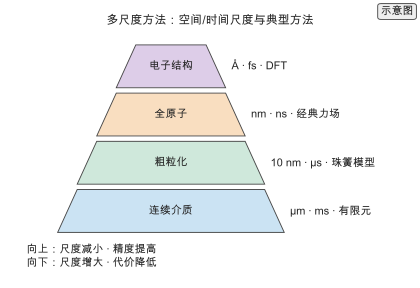

*图 5-1　多尺度金字塔。自下而上为电子结构（Å·fs·DFT）、全原子（nm·ns·经典力场）、粗粒化（10 nm·µs·珠簧模型）与连续介质（µm·ms·有限元）。向上尺度减小、精度提高，向下尺度增大、代价降低。（证据：示意）*

## 5.2 量子化学与密度泛函

量子方法是在本书讨论的几类方法中，能直接从电子结构给出能量与反应性质的一类，代价也最高，通常用于小体系或为其他方法提供参数。

### 5.2.1 能量与性质

密度泛函理论（Density Functional Theory, DFT）把多电子问题化为等效单电子问题，用交换关联泛函近似电子相互作用。Kohn–Sham 方程为

$$\Big[-\tfrac{1}{2}\nabla^{2}+v_{\text{ext}}(\mathbf r)+v_{H}(\mathbf r)+v_{xc}(\mathbf r)\Big]\psi_i=\varepsilon_i\psi_i,$$

$v_{\text{ext}}$ 是外势、$v_{H}$ 是 Hartree 势、$v_{xc}$ 是交换关联势。电子密度 $\rho(\mathbf r)=\sum_i|\psi_i(\mathbf r)|^{2}$ 自洽求解，这就是自洽场（self-consistent field, SCF）迭代。[^dft]

DFT 给出的量包括总能量、形成能、反应能、能隙、偶极矩与力。这些量是高分子单体与官能团性质的基础：反应能决定聚合可行性，偶极矩进入介电估算，力提供分子动力学的参考数据。交换关联泛函的近似决定精度，常用泛函的能量误差在每原子数十毫电子伏量级。[^extension5]

对高分子，DFT 的输出可以分成三类。第一类是标量性质：单体的电离能、电子亲和能、偶极矩、极化率、旋转势垒，它们直接进入结构–性能关系或力场参数。第二类是参考数据：为力场拟合提供构象能、二面角势能面与部分电荷，为机器学习势提供能量与力的训练标签。第三类是反应性质：聚合热力学、开环或缩聚的过渡态与活化能，进入第 12 章的反应建模。三类输出对体系大小的要求不同：标量性质常可用一个重复单元，参考数据需要低聚物，反应性质需要包含活性中心的团簇或周期模型。

### 5.2.2 计算代价

自洽场迭代的代价随原子数 $N$ 以 $O(N^{3})$ 增长，且需要数十次迭代收敛。代价模型为

$$\text{FLOPs}=c\,N^{3}\,N_{\text{SCF}},$$

$c$ 是单位原子立方代价（FLOPs/原子³），$N$ 是原子数，$N_{\text{SCF}}$ 是自洽迭代次数，$\text{FLOPs}$ 是浮点运算总数。该标度对应稠密矩阵对角化的 SCF 实现，改用线性标度方法时指数随体系增大而下降。取声明参数 $c=10^{4}$ FLOPs/原子³、$N_{\text{SCF}}=50$ `[示意]`、$N=500$，总代价为

$$\text{FLOPs}=10^{4}\times500^{3}\times50=6.25\times10^{13}$$。

该值为按声明参数折算的理想算术下界（ideal arithmetic lower bound）`[复算]`，未计入内存带宽、kernel launch、batch size、通信、I/O 与软件实现质量，不代表真实软件 wall time。按声明的 A100 FP32 峰值与效率 0.3 折算，理论时间为 10.7 GPU·秒 `[复算]`。原子数加倍时 $N^{3}$ 使代价增到 8 倍 `[复算]`，这一立方标度是量子方法难以直接用于长链的原因。看图 5-2 时，在同一精度下比较代价、在同一代价下比较精度，曲线左下角的方法占优。[^mdcost]

代价模型只覆盖 SCF 这一步，不含几何优化与频率计算。一次几何优化通常要几十到上百次单点，一次频率计算要在平衡构型上做 $3N$ 次位移；把这两项算进去，一个 500 原子体系的一次“几何优化 + 频率”代价是单点的几十倍到上百倍 `[示意]`。用 DFT 批量生成标签时，先按目标量决定是否需要频率：反应自由能需要频率提供的零点能与熵，单体标量性质通常不需要。

> **练习 5-1〔核心〕：DFT 单点代价**
>
> 按 $O(N^{3})$ 模型核算一次 DFT 单点的 FLOPs 与理论 GPU 时间，取 $N=500$、$N_{\text{SCF}}=50$、单位代价 $10^{4}$ FLOPs/原子³、GPU 效率 0.3；所得为 FLOPs 折算值，须说明它与真实软件墙钟时间的差异来源。再计算原子数从 500 加倍到 1000 后的代价，验证立方标度带来的增长倍数。
>
> 条件：需要运行本书配套仓库的 `calculations/` 复算模块（md-cost），参见 [md-cost-dft](../calculations/results/md-cost-dft.md)。

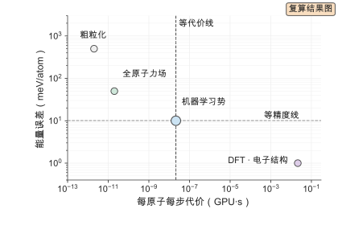

*图 5-2　精度与代价。双对数坐标的横轴是每原子每步代价（GPU·s），纵轴是能量误差（meV/atom）。DFT 每原子约 $1.25\times10^{11}$ FLOPs `[复算]`，位于高精度高代价端；机器学习势每原子每步 $2\times10^{6}$ FLOPs `[示意]`，精度接近 DFT 而代价低约 5 个数量级 `[复算]`。代价为按声明模型的理想算术下界；本书未开展该套实测基准，真实运行时间受硬件、批大小与软件实现影响，需要读者在自己的硬件上实测。（证据：复算）*

### 5.2.3 单体、低聚物与周期性体系

同一个重复单元，用单体、低聚物还是周期模型计算，回答的是不同问题。单体模型取一个重复单元，两端用氢或甲基封端，给出局部的电子结构：官能团电荷、键级、单体偶极。它便宜，但看不到链的共轭延伸与链间作用。低聚物模型把重复单元数 $n$ 取到 2 到 5，让电子结构在链方向上延展，同时保留端基。周期模型把体系放进周期胞，用平面波或 $\Gamma$ 点采样，适合晶体、表面与界面，但不适合孤立链。

三种模型之间可以用外推连接。低聚物的每单元能量随 $1/n$ 近似线性变化，

$$\frac{E(n)}{n}=e_{\infty}+\frac{2E_{\text{end}}}{n}+\cdots,$$

$e_{\infty}$ 是无限长链的每单元能量，$E_{\text{end}}$ 是端基贡献。对 $n=2,3,4$ 的结果做 $1/n$ 线性拟合，截距给出 $e_{\infty}$ `[示意]`。端基效应随 $n$ 衰减，$n=3$ 时端基占比已降到每单元约 33%，$n=10$ 时降到 10%。判据是：目标量对端基敏感就用低聚物并外推，不敏感就用单体。

周期模型的代价来自三处。平面波基组的截断能决定精度，截断能加倍使基组数增到约 8 倍；$k$ 点网格决定布里渊区采样，金属与半导体需要更密的网格；真空层用于隔离二维体系，厚度不足会让周期镜像相互作用。无定形聚合物的周期胞还要处理构象无序：单胞要足够大以包含多个链段构象，通常取几百到上千原子，这已接近 DFT 单点的可行上限。因此周期性 DFT 在聚合物上主要用于晶体与界面这类有平移对称性的体系，无定形态交给经典或机器学习势。

### 5.2.4 构象搜索与系综平均

聚合物的单键旋转产生大量构象，DFT 结果依赖取哪一个构象。可旋转键数为 $N_{\text{rot}}$、每个键取 3 个稳定构象时，构象数近似为

$$N_{\text{conf}}\approx 3^{N_{\text{rot}}},$$

呈指数增长。$N_{\text{rot}}=10$ 时 $3^{10}=59049$ `[复算]`，逐个做 DFT 已不现实。实际做法是三类。第一，刚性扫描：选一两个关键二面角做网格扫描，得到局部势能面，代价是每个角度一次约束优化。第二，随机或规则采样：用构象生成器产生一批候选，再用较低代价的方法（力场、半经验）预筛，只对能量最低的若干构象做 DFT。第三，从 MD 轨迹里取代表性构象做 DFT 单点，用玻尔兹曼权重加权。

系综平均与最低能构象给出不同的答案。目标量 $A$ 的系综平均为

$$\langle A\rangle=\frac{\sum_i A_i\,e^{-E_i/(k_B T)}}{\sum_i e^{-E_i/(k_B T)}},$$

$E_i$ 是构象 $i$ 的能量。低温时权重集中在最低能构象，高温时多个构象共同贡献。对聚合物，链构象熵本身是自由能的一部分，只用最低能构象会系统性低估熵的贡献。判据是目标量是能量型还是自由能型：反应能可以用最低能构象加零点能，吸附自由能与相稳定性必须做系综平均或加构象熵校正。

构象搜索的代价要计入总预算。一个 50 原子重复单元的 DFT 单点按立方标度是 $10^{4}\times50^{3}\times50=6.25\times10^{9}$ FLOPs `[复算]`，比 500 原子体系低四个数量级；因此“多构象、小体系”往往比“单构象、大体系”更划算。把构象数控制在几十个、每个体系用低聚物而非整链，是 DFT 在聚合物上可行的关键。

### 5.2.5 交换关联泛函与色散校正

交换关联泛函按复杂度排成阶梯：局域密度近似（LDA）、广义梯度近似（GGA，如 PBE）、meta-GGA（如 r2SCAN）、杂化泛函（如 B3LYP、PBE0）、范围分离杂化（如 ωB97X-D）。阶梯越高，精度通常越好，代价也越高；杂化泛函的精确交换使代价比 GGA 高一个数量级。

聚合物计算的两个特殊要求决定泛函选择。第一，链间作用以范德华与色散为主，GGA 与杂化泛函都不含长程色散，必须加色散校正（DFT-D3、DFT-D4 或非局域泛函 VV10）才能得到正确的堆叠能与密度。[^d3] 第二，共轭聚合物的能隙与激发能对泛函敏感，纯 GGA 低估能隙，杂化或范围分离泛函更接近实验。选择流程是：先问目标量是否依赖链间作用或电子激发；依赖，就加色散校正并考虑杂化；不依赖，GGA 加色散已足够。

泛函误差不能靠加大基组消除。泛函是近似，基组是展开；加大基组只收敛到该泛函的极限，不改变泛函本身的系统偏差。同一泛函在不同性质上的误差方向可能不同：PBE 常低估反应能垒、高估键长；B3LYP 对反应能较好但对色散更差。工程做法是固定一个泛函并在同类体系上做一致性校准，而不是在不同性质间换泛函。

> **ML Box　为什么等变与色散是两件事**
>
> 等变性处理的是几何对称：旋转、平移与镜像不改变能量，模型必须把这个对称性内建。色散处理的是物理作用：两个不直接成键的链段之间的吸引由瞬时偶极涨落产生，衰减为 $r^{-6}$。等变网络可以精确表示对称性，但如果训练数据来自不含色散的泛函，网络学到的也只是那个泛函的势能面，外推到堆叠构型时仍会缺少吸引。因此用机器学习势替代 DFT 时，训练标签的泛函与色散设置必须与目标一致：用 PBE 无校正的标签训练，得到的势在结晶与堆叠上同样偏软。

### 5.2.6 基组、赝势与数值精度

基组决定电子波函数的展开空间，常用三类。高斯基组（如 6-31G*、def2-SVP、def2-TZVP）适合分子与低聚物，基组越小越便宜；平面波基组适合周期体系，精度由截断能控制；数值原子轨道介于两者之间。基组不完备会引入基组叠加误差（basis set superposition error, BSSE），在弱相互作用能计算中需要平衡校正（counterpoise correction）抵消。

赝势把内层电子替换成有效势，降低平面波计算的代价。常用类型有模守恒、超软与投影缀加波（PAW）；对含重元素的聚合物，赝势同时处理标量相对论效应。赝势的选择要与泛函和截断能一起收敛测试：截断能从 400 eV 增到 600 eV，总能量可能变化几十毫电子伏每原子，必须做到目标量在截断能加倍后变化小于误差容忍值。

数值精度的三个收敛参数要一起报告：截断能、$k$ 点网格、自洽收敛阈值。只报告其中一个，结果无法复现。高斯基组的对应参数是基组名与是否加弥散函数；弥散函数对阴离子与弱相互作用重要，对中性聚合物常可省略。精度与代价的权衡是：def2-TZVP 比 def2-SVP 贵数倍，但当目标量是构象能差或弱相互作用时，小基组的不完备误差可能大于方法误差，此时必须升级基组。

### 5.2.7 高分子体系上的典型用途与代价边界

DFT 在聚合物研究中有四类典型用途。第一，单体与官能团的电子结构：偶极矩、极化率、电离能，用于介电与能带估算。第二，力场参数化的参考数据：部分电荷（RESP、CM1A）、二面角势能面、构象能差。第三，反应与聚合热力学：单体聚合能、开环能垒、降解路径。第四，光谱参考：红外与核磁的谱峰归属，用于第 8 章的谱–结构映射。

代价边界可以量化。以 500 原子体系、单点 10.7 GPU·秒 `[复算]` 为基准，一次从头算分子动力学（ab initio molecular dynamics, AIMD）取时间步 0.5 fs、模拟 1 ps，需要 2000 步、每步一次力评估，代价约

$$2000\times10.7\ \text{GPU·秒}=2.14\times10^{4}\ \text{GPU·秒}\approx5.9\ \text{GPU·小时}$$。

该值为按声明参数折算的理想算术下界（ideal arithmetic lower bound）`[复算]`，未计入内存带宽、kernel launch、batch size、通信、I/O 与软件实现质量，不代表真实软件 wall time。5.9 GPU·小时的物理时长只有 1 ps，而聚合物链段弛豫在纳秒量级，差三个数量级。结论是：AIMD 用于捕捉反应事件与局部动力学，不用于聚合物链的长时间弛豫；后者的势能面由力场或机器学习势承担。

代价边界还决定体系选择。数百原子的单点可行，上千原子的几何优化勉强可行，上万原子的 AIMD 不可行。因此 DFT 在聚合物多尺度链条里的位置是“参数与局部性质的提供者”，不是“性质标签的批量生产者”。批量标签交给力场 MD（5.3.4）与机器学习势（5.4.6）。

## 5.3 分子动力学

分子动力学（molecular dynamics, MD）直接积分原子运动方程，给出轨迹与系综平均，是连接微观相互作用与宏观性质的桥梁。

### 5.3.1 力场与系综

力场把能量分解为成键项与非键项，

$$E=E_{\text{bond}}+E_{\text{angle}}+E_{\text{dihedral}}+E_{\text{vdW}}+E_{\text{elec}},$$

前三项是键伸缩、键角弯曲与二面角扭转，后两项是非键项的范德华与静电作用。运动方程 $m_i\ddot{\mathbf r}_i=-\nabla_i E$ 用 Verlet 类积分器数值积分。参数化力场用实验或量子数据拟合参数，精度受参数迁移性限制：为一种聚合物标定的力场迁移到另一种主链时误差上升。

力场形式决定它能否描述交叉耦合。Class I 力场（OPLS、GAFF、CHARMM）把各项独立处理；Class II 力场（COMPASS、PCFF）加入键长–键角、键角–键角等交叉项，对振动频率、弹性常数与密度的描述更准，代价是参数更多、参数化更贵。选力场先看目标量：密度、构象能与 $T_g$ 用 Class I 通常够用；力学模量、晶格振动与高压行为需要 Class II。

常用系综有三种：NVE 守恒总能量，NVT 用 Nosé–Hoover 或 Langevin 控温，NPT 再加控压。控温控压算法会影响动力学量与涨落，系综选择必须与目标性质匹配：平衡态热力学量用 NPT，输运性质用 NVT 或 NVE。控温器的耦合时间常数不能取得太短，否则会抑制真实的能量涨落，使扩散系数与黏度失真。[^extension5]

### 5.3.2 时间步与轨迹

时间步长受最高频振动限制。含氢体系通常取 $\Delta t=1\ \mathrm{fs}$，模拟时长 $t_{\text{sim}}=n_{\text{step}}\Delta t$。每一步做一次力评估，力评估次数等于步数。轨迹存储为

$$S=N_{\text{frame}}\times N\times 3\times b,$$

$N_{\text{frame}}$ 是保存帧数，$N$ 是原子数，因子 3 是每个原子的坐标分量数，$b$ 是每分量字节数（float32 为 4 B），$S$ 以字节为单位。取 $N=5000$、$10^{6}$ 步、每 1000 步保存一帧（$N_{\text{frame}}=1000$）、float32（$b=4$），轨迹大小为

$$S=1000\times5000\times3\times4=6\times10^{7}\ \mathrm{B}=60\ \mathrm{MB}$$。

轨迹大小 $60\ \mathrm{MB}$ 为按上述声明参数的复算值 `[复算]`。力评估代价按近邻对模型：$N\times N_{\text{neigh}}\times f_{\text{pair}}\times n_{\text{step}}$，再加每 10 步一次近邻表重建。取声明参数 $N=5000$、每原子 40 近邻对、每对 40 FLOPs `[示意]`、$10^{6}$ 步，力评估与近邻表重建合计约 $8.4\times10^{12}$ FLOPs `[复算]`。按声明的 A100 BF16 峰值与效率 0.3 折算，该 FLOPs 对应理想算术下界（ideal arithmetic lower bound）约 0.090 GPU·秒 `[复算]`；这是 FLOPs 折算值，未计入内存带宽、邻居表重建、域分解通信、kernel launch、batch size、I/O 与实现质量，不代表 LAMMPS 或 OpenMM 的实测墙钟时间，实测墙钟时间通常高于此值。[^extension5]

时间步与力场形式绑定。全原子力场含氢键振动，时间步 1 fs；把氢的质量放大（氢质量重分配）或约束含氢键长（SHAKE、LINCS），时间步可放宽到 2 到 4 fs，代价是振动谱失真。粗粒化力场没有高频振动，时间步可取 10 到 20 fs。放宽时间步前先确认目标量不依赖被约束的自由度：扩散与构象弛豫对氢振动不敏感，振动光谱与同位素效应敏感。分析图 5-3 的轨迹时，先确认平衡段结束、温度与势能收敛，再统计采样段的系综平均。

> **练习 5-2〔核心〕：MD 轨迹代价**
>
> 按近邻对模型核算 $N=5000$、$10^{6}$ 步全原子 MD 的 FLOPs 与理论 GPU 时间，参数为每原子 40 近邻对、每对 40 FLOPs、每 10 步重建近邻表、时间步 1 fs；所得为 FLOPs 折算值，须说明它与 LAMMPS/OpenMM 实测墙钟时间的差异来源。再计算每 1000 步保存一帧、float32 存储时的轨迹大小，说明轨迹存储随保存频率如何变化。
>
> 条件：需要运行本书配套仓库的 `calculations/` 复算模块（md-cost），参见 [md-cost-mlff](../calculations/results/md-cost-mlff.md)。

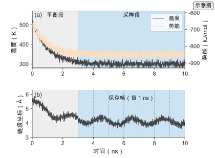

*图 5-3　轨迹与采样。(a) 温度与势能随时间的演化，前 3 ns 为平衡段、随后进入采样段；(b) 链段坐标的演化，采样段按固定间隔保存帧。（证据：示意）*

### 5.3.3 增强采样

常规 MD 难以越过能垒，稀有事件在有限轨迹中采样不足。跨垒速率由 Arrhenius 关系给出

$$k=A\,e^{-E_a/(k_B T)},$$

$k$ 是速率常数（$\mathrm{s^{-1}}$），$A$ 是指前因子（与 $k$ 同量纲），$E_a$ 是活化能（J/mol 或 eV），$k_B$ 是玻尔兹曼常数，$T$ 是温度（K）。该关系默认单一活化能且过程不受扩散控制；存在多条并行路径时须用活化能分布，扩散受限时速率由介质黏度而非本征能垒决定。增强采样方法沿反应坐标加偏置或并行多个温度，再用重加权恢复无偏分布。

伞形采样沿反应坐标 $\xi$ 加谐振偏置

$$U_{\text{bias}}(\xi)=\tfrac12 k(\xi-\xi_0)^{2},$$

分段采样后用加权直方图分析（weighted histogram analysis method, WHAM）拼接无偏自由能。元动力学累积高斯偏置势

$$V(\mathbf s,t)=\sum_{t'<t}w\exp\!\Big(-\frac{\|\mathbf s-\mathbf s(t')\|^{2}}{2\sigma^{2}}\Big),$$

无偏分布由重加权恢复 $p_0(\mathbf s)\propto p_{\text{bias}}(\mathbf s)\,e^{\beta V(\mathbf s)}$。副本交换在多个温度并行并交换构型，提高跨垒采样。本节给出三种方法的定义与公式，5.6 展开它们在聚合物上的适用条件、参数选择与代价。[^extension5]

### 5.3.4 聚合物建模工作流：从单体到玻璃化转变温度

从一条 PSMILES 到一个可用的 $T_g$ 标签，经典 MD 要走完一条固定顺序的流水线。顺序不能颠倒，每一步的失败都会污染后续步骤。执行时先确认每一步的收敛判据满足，再进入下一步；跳过最小化或 NVT 直接做 NPT，会让盒子在初始重叠构象上发散。图 5-4 给出完整流程，下面逐步说明目标、参数与判据。

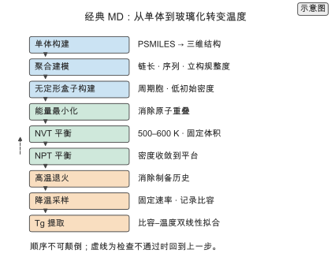

*图 5-4　从单体到玻璃化转变温度的经典 MD 工作流。九步依次为单体构建、聚合建模、无定形盒子构建、能量最小化、NVT 平衡、NPT 平衡、高温退火、降温采样与 $T_g$ 提取；箭头为数据流，虚线为需要回到上一步的检查。（证据：示意）*

**第一步，单体构建。** 把 PSMILES 解析成带三维坐标的单体，检查连接点、立构中心与质子化状态。这一步用 RDKit 或同类工具完成，代价可忽略，但错误代价最高：连接点写错会让整条链的拓扑错，质子化状态错会让静电作用错。

**第二步，聚合建模。** 按目标聚合度 $n$ 把重复单元首尾相接，得到一条或多条链。需要同时记录序列（无规、嵌段）与立构规整度。链长 $n$ 取 20 到 50 个重复单元是常见起点 `[示意]`：太短，端基效应主导；太长，盒子原子数与弛豫时间都上升。分子量分布在这里以多条不同长度的链近似，用 $M_n$ 与分散度 Đ（polydispersity index，PDI $=M_w/M_n$）控制。

**第三步，无定形盒子构建。** 把若干条链放进周期盒子，初始密度取低于平衡密度（如 0.3 到 0.6 g/cm³）以留下压缩空间，避免原子重叠。常见做法是先随机放置链，再用短程排斥推动排斥，或直接用一个已有的无定形构型做模板。盒子尺寸要与链的回旋半径匹配：边长至少是最大链末端距的两倍，否则链会与自己镜像相互作用。5000 到 20000 个原子是常见规模 `[示意]`。

**第四步，能量最小化。** 用最速下降或共轭梯度消除原子重叠与不合理键长。判据是最大力低于阈值、势能不再下降。这一步不做动力学，只把构型推到势能面的一个局部极小。跳过这一步会让 NVT 在初始的大力下发散。

**第五步，NVT 平衡。** 固定体积与温度（常取高于目标 $T_g$ 的 500 到 600 K），用控温器把体系加热并让局部重叠松弛。判据是温度稳定、势能下降后趋于平台。时长从几百皮秒到几纳秒，取决于初始构型的松弛程度。

**第六步，NPT 平衡。** 打开控压，让盒子密度收敛到目标温度与压力下的平衡密度。判据是密度在若干纳秒内围绕一个平台涨落、无单调漂移。这一步是工作流里最容易被低估的一步：聚合物熔体的密度弛豫比能量弛豫慢得多，密度未收敛时后续所有系综平均都不可信。

**第七步，高温退火。** 把体系升到远高于 $T_g$ 的温度（如 600 到 700 K）并保持一段时间，让链段充分松弛、消除制备历史。退火的目的是让体系忘记初始构型，接近平衡熔体。判据是回旋半径与末端距的涨落收敛。

**第八步，降温采样。** 从退火温度以固定速率降到远低于 $T_g$ 的温度（如 600 K → 250 K），在每个温度点做 NPT 采样并记录比容。降温速率是 $T_g$ 提取的关键参数：MD 可达的速率在 $10^{11}$ 到 $10^{12}$ K/s `[示意]`，比实验的每分钟几开尔文高十多个数量级，因此 MD 提取的 $T_g$ 系统性偏高，偏差可达几十开尔文 `[文献]`。要减小偏差，用更慢的降温并外推到实验速率，或只在同一速率下做相对比较。

**第九步，$T_g$ 提取。** 把比容 $v(T)$ 对温度作图，在玻璃态与熔体各拟合一条直线，

$$v(T)=v_g+\alpha_g(T-T_g)\quad (T<T_g),\qquad v(T)=v_l+\alpha_l(T-T_g)\quad (T>T_g),$$

两条直线的交点即模拟 $T_g$ `[文献]`。$\alpha_g$ 与 $\alpha_l$ 分别是玻璃态与熔体的热膨胀系数。拟合区间要避开转变区，区间宽度影响交点；报告 $T_g$ 时必须同时给出降温速率、拟合区间与力场，否则不同工作之间的数值不可比。第 4 章给出的 $T_g(M_n)$ 关系与实验值，在这里作为模拟标签的验证对象。

> **实践 Box　无定形盒子构建与平衡检查**
>
> 盒子构建后的第一件事不是跑长轨迹，而是做三张检查图：势能随时间是否下降后走平、密度是否收敛到平台、温度是否围绕目标涨落。三张图任一不满足就回到上一步。常见失败有三种。第一，密度不收敛：初始盒子太小或链太长，链缠结无法松弛，需要加长 NPT 或换更小的体系。第二，能量持续下降：体系仍在消除初始重叠，需要加长 NVT。第三，密度远低于实验值：力场非键参数偏软，需要检查电荷与色散。把三张图与力场、链长、盒子尺寸一起记录，是后续复现的最低要求。

### 5.3.5 力场家族与参数化流程

经典力场的适用对象由它的参数化数据决定。五个常用家族各有位置。

**OPLS-AA**（Optimized Potentials for Liquid Simulations, all-atom）从有机液体的热力学性质拟合，键合项与 LJ 参数按化学基团迁移，部分电荷来自液相模拟。它适合烃类、醚、酯等常见聚合物主链，参数迁移性好，缺点是覆盖的官能团有限，新官能团需要补参数。[^opls]

**GAFF**（General Amber Force Field）覆盖大部分有机小分子与聚合物常见元素，原子类型自动分配，适合新单体的快速起手。它的参数化以 HF/6-31G* 的 RESP 电荷加经验 LJ 为主，对构象能的精度中等，对密度与热力学性质的系统偏差需要按体系校准。[^gaff]

**COMPASS**（Condensed-phase Optimized Molecular Potentials for Atomistic Simulation Studies）用从头算数据拟合，含交叉项，参数覆盖聚合物、无机物与它们的界面。它适合需要力学模量、晶格参数与界面能的体系，代价是参数化工作量大、可迁移范围窄。[^compass]

**PCFF**（Polymer Consistent Force Field）是与 COMPASS 同源的 Class II 力场，面向聚合物与无机材料，常用于交联网络、界面与高压行为。它的参数覆盖与 COMPASS 有重叠但版本不同，混用时必须说明来源。[^pcff]

**CHARMM** 起源于生物大分子，含丰富的成键与非键参数与自动参数化工具（CGenFF），近年扩展到聚合物与离子体系。它适合含极性官能团、氢键与离子的聚合物，例如聚电解质与离子传导膜。[^charmm]

参数化流程固定为五步。第一，分配原子类型；第二，取键长、键角、二面角参数，优先用同源力场的已有参数，缺项用 DFT 拟合；第三，确定部分电荷，用 RESP 或 CM1A 从 DFT 静电势拟合；第四，用 DFT 或实验数据拟合非键 LJ 参数；第五，验证。验证至少覆盖密度、蒸发热、构象能差与目标性质（如 $T_g$），并与实验或高精度参考对照。缺任何一步，力场就只是一个未经检验的参数集。选型时先看目标体系的化学与目标量，再选参数来源匹配的力场（图 5-5）；没有参数覆盖时补参数化，而不是换一个力场名。

> **失败 Box　力场迁移到新主链：为什么 $T_g$ 偏了 40 K**
>
> 有人用为聚烯烃标定的 OPLS 参数直接模拟聚酰亚胺，密度与 $T_g$ 都与实验差得多。根因是参数迁移性：聚酰亚胺主链含芳环、酰亚胺环与强极性羰基，链间作用以偶极与色散为主，而聚烯烃参数的非键项与电荷是按烃类标定的。链刚性被低估、链间吸引被高估，两条误差方向相反，在 $T_g$ 上部分抵消但净偏差仍达几十开尔文。修法不是调 $T_g$ 的拟合参数，而是回到 5.3.5 的第五步：用目标体系的密度、构象能与偶极做验证，必要时用 DFT 重新拟合缺失的二面角与电荷。把 $T_g$ 直接当拟合目标会把误差吸收进其他性质。

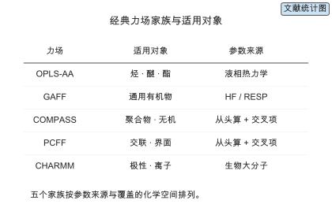

*图 5-5　力场家族与适用对象。横轴是参数来源（经验液相数据、从头算、生物大分子数据），纵轴是覆盖的化学空间（烃类、通用有机物、聚合物与无机界面、极性与离子体系）。（证据：文献）*

## 5.4 粗粒化与机器学习势

粗粒化用较少的自由度覆盖更大的尺度，机器学习势用神经网络拟合势能面，二者从相反方向扩展可达的精度–尺度组合。

### 5.4.1 粗粒化模型

粗粒化把 $m$ 个原子映射为一个珠子，珠子数 $N_b=N/m$，$m$ 称为映射比。映射比决定可达尺度：$m$ 越大，可模拟的链长与时间越长，有效势的可迁移性越差。有效势由力匹配、结构匹配或相对熵最小化从全原子轨迹得到。映射比从 1 增到 10，5000 个原子降到 500 个珠子，可覆盖的链长与时间尺度放大约一个数量级，精度损失随映射比增大。[^extension5]

粗粒化的代价下降来自两处。第一，粒子数减少使每步计算量下降；第二，势能面被平滑，最高频振动被积分掉，时间步可以放大到 10 到 20 fs。两处叠加，同样步数覆盖的物理时间放大约一个数量级，同样物理时间所需的步数又下降一个数量级。这是粗粒化能覆盖微秒到毫秒尺度的原因。

粗粒化不是无代价的降采样。映射把自由度积分掉，得到的有效势是自由能面而不是势能面，它依赖温度与密度：在 300 K 标定的有效势迁移到 500 K 时，被积分掉的振动熵贡献改变，势的形状随之改变。因此粗粒化模型的参数必须注明标定温度与密度，跨条件使用前要重新验证。

### 5.4.2 机器学习势

机器学习势（machine learning force field, MLFF）用神经网络从局部原子环境回归能量与力，训练数据来自 DFT。能量写成局部环境贡献之和

$$E=\sum_i E_i(\mathcal{N}_i),$$

$\mathcal{N}_i$ 是原子 $i$ 在截断半径内的邻域。等变网络保证输出在旋转与平移下的正确变换：SchNet 用连续滤波卷积，[^schnet] NequIP 用 E(3) 等变卷积，[^nequip] MACE 用高阶等变消息传递。[^mace] 局部性与等变性使推理代价近似线性于原子数，这是相对 DFT 立方标度的关键优势。

局部环境求和有两个含义。第一，能量可分解，因此训练可以按构型分块、推理可以按原子并行。第二，截断半径之外的相互作用被忽略，长程静电与色散不在模型内；需要时要用显式的长程项或更大的截断半径补上。截断半径决定单个原子的感受野，也决定单原子推理代价：截断半径从 5 Å 增到 6 Å，邻域原子数约增到 $(6/5)^{3}=1.73$ 倍 `[复算]`。

训练数据决定 MLFF 的上限。数据来源通常是 DFT 单点与短 AIMD 轨迹，规模从几百到几百万构型。数据要覆盖目标体系会遇到的构象与化学环境：只含平衡构象的数据在拉伸、压缩或反应构型上会外推。训练目标同时用能量与力，力的权重通常更高，因为力直接决定动力学稳定性。训练集与验证集要按构型划分而不是按帧随机划分，相邻帧高度相关，随机划分会高估泛化。

### 5.4.3 精度与代价的权衡

MLFF 的每原子代价是 $f$ FLOPs/原子/步，DFT 的每原子代价由 $c\,N^{3}N_{\text{SCF}}$ 除以 $N$ 得到 $c\,N^{2}N_{\text{SCF}}$。加速比

$$\text{speedup}=\frac{c\,N^{2}N_{\text{SCF}}}{f}$$。

分子 $c\,N^{2}N_{\text{SCF}}$ 是 DFT 的每原子代价，分母 $f$ 是机器学习势的每原子每步代价（FLOPs/原子/步），两者相除得到同一原子数下的每原子加速比。取声明参数 $c=10^{4}$、$N=500$、$N_{\text{SCF}}=50$、$f=2\times10^{6}$ `[示意]`，理论加速比为 $6.25\times10^{4}$ `[复算]`；该值为按声明 FLOPs 模型折算的理想算术下界（ideal arithmetic lower bound），不是实测吞吐比。加速来自用一次网络前向替代自洽迭代，代价模型不含训练与模型加载。加速比随 $N^{2}$ 增长，但仅在 MLFF 训练数据覆盖的化学与构象空间内成立；外推区必须回到 DFT 或用主动学习补充训练数据。[^extension5]

加速比的分母与分子要一起看。MLFF 每步比经典力场贵得多：取经典力场每原子每步约 $8\times10^{3}$ FLOPs `[示意]`，MLFF 的 $2\times10^{6}$ FLOPs/原子/步 是它的约 250 倍 `[复算]`。所以 MLFF 的“快”是相对 DFT，不是相对经典力场。选择时先问目标量是否需要 DFT 精度：需要，MLFF 比 DFT 便宜几个数量级；不需要，经典力场仍然是更划算的选择。

> **练习 5-3〔核心〕：机器学习力场加速比**
>
> 在相同原子数下比较 DFT 单次力评估与机器学习势单步推理的每原子代价，取 $N=500$、DFT 单位代价 $10^{4}$ FLOPs/原子³、迭代 50 次、MLFF 为 $2\times10^{6}$ FLOPs/原子/步，计算理论加速比。再计算 $N=1000$ 时的理论加速比，说明加速比随原子数如何变化，以及这一加速在什么条件下成立。
>
> 条件：需要运行本书配套仓库的 `calculations/` 复算模块（md-cost），参见 [md-cost-dft](../calculations/results/md-cost-dft.md) 与 [md-cost-mlff](../calculations/results/md-cost-mlff.md)。

把本章的理论估算（均为按声明参数折算的理想算术下界）与可对照的实际基准并列如下。「实际 benchmark」一列标出本书未开展的基准，避免把理论值当作软件实测。

| 项目 | 理论估算 | 实际 benchmark | 软件/版本 | 硬件 |
| --- | --- | --- | --- | --- |
| DFT 单点（500 原子、50 次 SCF） | $6.25\times10^{13}$ FLOPs、约 10.7 GPU·秒 `[复算]` | 暂无（本书未开展该基准） | — | NVIDIA A100 80GB SXM |
| 全原子 MD（5000 原子、$10^{6}$ 步） | $8.4\times10^{12}$ FLOPs、约 0.090 GPU·秒 `[复算]` | 暂无（本书未开展该基准） | LAMMPS / OpenMM | NVIDIA A100 80GB SXM |
| MLFF 推理（5000 原子、$10^{6}$ 步） | $1.00\times10^{16}$ FLOPs、约 106.8 GPU·秒 `[复算]` | 暂无（本书未开展该基准） | — | NVIDIA A100 80GB SXM |
| MLFF 相对 DFT 的每原子加速比 | $6.25\times10^{4}$ `[复算]` | 暂无（本书未开展该基准） | — | — |

### 5.4.4 粗粒化的四条路线：MARTINI、IBI、力匹配与相对熵

有效势从哪里来，决定粗粒化模型能保住什么。四条主流路线按“匹配什么”区分。

**MARTINI** 用预先定义的映射规则与珠子类型：通常把约 4 个重原子映射成一个珠子，珠子按极性与氢键能力分成若干类型，非键参数在同类珠子间迁移。它的优点是参数已经为大量体系标定、可直接使用，适合脂质、表面活性剂与部分聚合物；缺点是映射规则固定，遇到新化学需要新增珠子类型，且默认参数未必匹配目标聚合物。[^martini]

**迭代玻尔兹曼反演**（iterative Boltzmann inversion, IBI）迭代调整势使粗粒化的径向分布函数匹配全原子的对应量，

$$V_{n+1}(r)=V_n(r)+k_B T\ln\!\frac{g_n^{\text{CG}}(r)}{g^{\text{AA}}(r)},$$

$g_n^{\text{CG}}$ 是第 $n$ 轮粗粒化模型的径向分布函数，$g^{\text{AA}}$ 是全原子的。它只需要结构信息、实现简单，适合快速起手；缺点是结构匹配不保证热力学量匹配，势的可迁移性差，换温度或密度要重新反演。[^ibi]

**力匹配**（force matching, 也称 multiscale coarse-graining, MS-CG）直接拟合粗粒化的力到全原子力，

$$\chi^{2}=\sum_j\big\|\mathbf F_j^{\text{CG}}-\mathbf F_j^{\text{AA}}\big\|^{2},$$

$\mathbf F_j$ 是珠子 $j$ 上的力。它需要大量全原子构型与力，拟合是线性最小二乘，得到的势在多体意义上更接近真实平均力；缺点是对构型采样的覆盖敏感，构型分布偏了力匹配就偏。[^forcematching]

**相对熵最小化**（relative entropy, RE）最小化粗粒化分布与全原子分布之间的信息距离，

$$S_{\text{rel}}=\sum_i p_i^{\text{AA}}\ln\!\frac{p_i^{\text{AA}}}{p_i^{\text{CG}}},$$

$p_i$ 是构型 $i$ 的概率。它同时约束结构与热力学，理论上给出在给定映射下最优的有效势；代价是每次参数更新都要估计两个分布的比值，计算量最大。[^relentropy]

四条路线可以按三个问题选择：匹配目标是结构、力还是分布；有多少全原子轨迹可用；模型是否需要在多个温度或密度上迁移。只需要形貌用 IBI，追求热力学一致性用相对熵，有高质量力数据用力匹配，想直接用现成参数用 MARTINI。

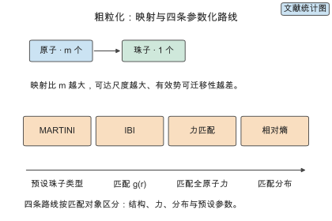

*图 5-6　粗粒化的映射与四条参数化路线。左侧是原子到珠子的映射（映射比 $m$）；右侧四条路线按“匹配目标”排布：结构（IBI）、力（力匹配）、分布（相对熵）与预设参数（MARTINI），四条路线的数据需求与热力学一致性依次上升。（证据：文献）*

### 5.4.5 反向映射：从珠子回到原子

粗粒化把链长放大，但很多性质需要在原子尺度上读出：局部堆积、氢键网络、振动谱、界面分子取向。反向映射（backmapping）把粗粒化轨迹的珠子构型重建为全原子构型，让大尺度采样与原子细节各取所长。

反向映射分三步。第一，几何重建：按映射规则把每个珠子展开成对应的原子片段，片段内部用预先构建的构象库拼装。第二，局部弛豫：在约束下做能量最小化或短 MD，消除片段之间的重叠。第三，短程采样：在目标温度做一段 NVT，让局部结构弛豫到与全原子力场一致。三步之后得到的构型用于统计局部性质，而不是继续做长时动力学。

反向映射的误差来自重建的不唯一性。同一个珠子构型对应大量原子构型，几何重建只取其中一个。要得到系综平均，必须对多帧珠子构型分别重建，再做平均。重建后的结构还要与直接的全原子模拟做对照，确认局部分布（如键角、二面角、径向分布函数）没有被重建规则系统性地扭曲。

反向映射与机器学习势可以配合：粗粒化负责大尺度形貌采样，机器学习势负责在原子尺度上精修与评估能量。这条组合路线把“采样”和“精度”分给两个模型，是当前多尺度模拟的一个实用方向。

### 5.4.6 机器学习势的谱系：局部、等变、通用与基础势

机器学习势按泛化范围与对称性处理分成四代，每一代解决上一代的一个限制。

**局部机器学习势**（local MLIP）用原子中心对称函数或平滑重叠描述原子环境，能量是局部贡献之和。Behler–Parrinello 的高维神经网络势是代表：每个原子的环境用一组径向与角向对称函数描述，再送入小型网络。[^behler] 它把旋转平移不变性编码在描述符里，实现简单，但描述符需要人工设计，表达力受限于选定的函数形式。

**等变机器学习势**（equivariant MLIP）把对称性内建到网络结构中，用球谐函数与张量积表示方向信息。SchNet 用连续滤波卷积，NequIP 用 E(3) 等变卷积，MACE 用高阶等变消息传递，Allegro 用局部等变表示实现大规模并行。[^schnet][^nequip][^mace][^allegro] 等变性让模型在少量数据上就能学到正确的角度依赖，样本效率比局部势高一个量级，代价是单步计算更复杂。

**通用机器学习势**（universal MLIP）在跨元素、跨材料的大规模 DFT 数据上训练，目标是一个模型覆盖周期表的大部分组合。M3GNet 与 CHGNet 是代表：前者用图网络覆盖周期表并支持材料筛选，后者额外预测磁矩与电荷信息。[^m3gnet][^chgnet] 通用势的吸引力是“开箱即用”，代价是精度低于针对单一体系训练的专用势，且对训练分布外的化学组成同样外推。

**基础势**（foundation potential）把通用势推向预训练–微调范式：在一个大规模、多样化的数据集上预训练，再用目标体系的少量数据微调。MACE-MP-0 在材料科学数据上预训练，报告在多种材料上接近专用势的精度，并对未见体系保持合理外推。[^macemp0] 基础势改变了工作流：从“为每个体系从零训练”变成“先试基础势，不够再微调”。选择时先问目标体系是否在预训练分布内：在，用通用势或基础势起手；不在，回到专用训练或微调（图 5-7）。

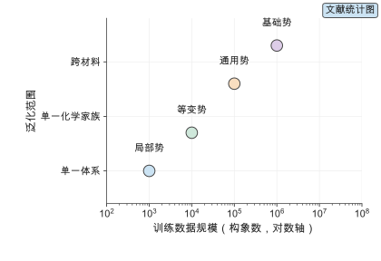

*图 5-7　机器学习势的谱系。横轴是训练数据规模（对数），纵轴是泛化范围（单一体系 → 单一化学家族 → 跨材料）。四代依次为局部势（Behler–Parrinello）、等变势（SchNet、NequIP、MACE、Allegro）、通用势（M3GNet、CHGNet）与基础势（MACE-MP-0）。（证据：文献）*

### 5.4.7 机器学习势在聚合物上的适用边界

机器学习势不是“更快的 DFT”，它有明确的适用范围。下面把适合与不适合的条件写清，避免在错误的问题上使用它。

**适合的情况。** 第一，目标量需要 DFT 精度而体系在数百到数千原子：反应路径与断键、极化与电荷转移、界面与吸附。第二，化学与构象空间被训练数据覆盖：单一聚合物家族、固定组成、温度范围已知。第三，需要长时间动力学但经典力场精度不足：用 MLFF 做高精度短程采样，或对关键构象做精修。第四，可以用主动学习在线补充数据：不确定性驱动采样让模型在探索中扩展适用范围。[^flare]

**不适合的情况。** 第一，需要覆盖大量不同化学组成的通用筛选：基础势可以起手，但精度不足时仍要回到专用数据，不能指望一个模型覆盖所有聚合物。第二，构象空间巨大且难以采样覆盖：长链无定形聚合物的构象数随链长指数增长，训练集难以覆盖全部相关构象。第三，需要精确长程静电或极化：局部模型在截断半径外没有相互作用，离子聚合物与强极性体系需要显式长程项。第四，体系在训练分布外：新单体、新官能团、反应中间体与过渡态。第五，目标量依赖采样而训练数据只覆盖势能面局部：训练集只含平衡构象时，拉伸与压缩区的误差难以被验证。

判断是否外推需要在线检测。常用三种信号：模型集成或 dropout 给出的预测方差、描述符空间中到训练集的距离、以及能量与力的守恒偏差。任一信号超过阈值就触发 DFT 复核或主动学习。把外推检测写进模拟流程，是 MLFF 用于聚合物的前提。

> **失败 Box　机器学习势在拉伸区外推：一次失败的弹性模量计算**
>
> 有人用只含平衡构象的 DFT 数据训练 MLFF，然后直接做单轴拉伸算弹性模量。小应变区结果正常，应变超过约 10% 后应力–应变曲线出现非物理的软化。根因是训练集只覆盖平衡附近的势能面，拉伸区的键长与键角构型不在数据里，网络给出的是外推值。修法是把拉伸与压缩构象加入训练集，或用主动学习在模拟中遇到高不确定性构型时触发 DFT 标注。教训是：MLFF 的精度声明只在训练数据覆盖的构象空间内成立，超出范围必须先补数据再使用。

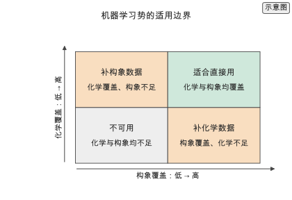

*图 5-8　机器学习势的适用边界。横轴是构象覆盖（训练数据是否覆盖目标模拟会遇到的构象），纵轴是化学覆盖（是否覆盖目标元素与官能团）。绿色区（化学与构象都覆盖）适合直接用；橙色区需要补数据或加长程项；灰色区（任一维度不覆盖）应回到 DFT 或经典力场。（证据：示意）*

## 5.5 模拟数据与 AI 的接口

模拟既是标签来源，也是机理约束的来源。理解模拟标签的偏差结构，才能决定它能否替代实验、在哪些目标上替代。

### 5.5.1 用模拟生成标签

模拟批量生成标签的流程为：构建结构、选择方法、批量计算、收敛检查、入库。每条标签带元数据：方法、泛函与基组或力场、系综、温度、软件版本、收敛判据。同一结构用不同方法得到的标签属于不同分布，混训前必须按方法分组或对齐，这与第 3 章的标签来源分级一致。[^extension5]

批量计算的工程要点是失败处理。一次 DFT 单点可能因 SCF 不收敛、几何优化不收敛或资源超限失败；这些样本不能静默丢弃，要记录失败原因并单独处理。批量任务的调度要支持断点续算与去重：同一结构用同一方法只算一次，结果按（结构键，方法键）缓存。收敛检查要自动化：能量、力、频率的收敛判据逐项核对，不满足的样本打回重算。

模拟标签的成本结构决定批量规模。单条标签的代价乘以样本数就是总代价，而不同方法的单条代价相差几个数量级。用代价模型先估算“生成 $N$ 条标签需要多少 GPU·小时”，再决定 $N$ 与方法，是数据生成计划的第一步。

### 5.5.2 模拟与实验的偏差

总偏差分解为方法偏差与条件偏差

$$\Delta=\Delta_{\text{method}}+\Delta_{\text{condition}}$$。

方法偏差来自泛函、力场与粗粒化近似；条件偏差来自模拟与实验在温度、压力、加工历史与时间尺度上的差异。用模拟标签训练、用实验值验证，是检测偏差的标准做法。偏差有结构依赖性时，按结构分组校准

$$\hat y_{\text{exp}}=a(g(x))+\hat y_{\text{sim}},$$

$g(x)$ 是结构分组变量。校准后的模型才能把模拟标签与实验值接到同一条坐标轴上。[^extension5]

条件偏差里最容易被忽略的是时间尺度。MD 的降温速率比实验快十多个数量级，得到的 $T_g$ 系统性偏高；MD 的加载速率比实验快多个数量级，得到的模量偏高。这类偏差不是方法误差，而是“用快过程替代慢过程”的偏差，只能靠速率外推或明确声明比较范围来处理。用模拟标签训练时，把降温速率与加载速率作为标签条件记录，才能让模型知道它学的是哪一个速率下的性质。

### 5.5.3 模拟数据如何进入数据集

模拟数据进入数据集时，最大的风险是与实验数据混在一起当作同质标签。第 3 章要求按来源分级，模拟数据要携带完整的元数据才能被正确使用。一条模拟标签的最小 schema 包括：方法（DFT、力场、MLFF、粗粒化）、方法参数（泛函与基组，或力场名与版本）、系综（NVE、NVT、NPT）、温度与压力、软件与版本、收敛判据、以及结构描述（链长、序列、立构规整度、盒子尺寸、分子量分布）。

模拟标签与实验标签的差异要显式建模，而不是指望模型自己学会。做法是把“来源”作为一个字段，训练时按来源分组做分层评估，或在模型里加一个来源嵌入。第 3 章的划分规范在这里同样适用：模拟数据与实验数据不能随机混在同一折，否则测试集里会出现同一结构的模拟与实验版本，评估虚高。

模拟数据的规模用代价模型核算。若目标是为 1000 个候选聚合物各生成一条 $T_g$ 标签，每条需要 55 ns 的 MD 轨迹，按 5.3.2 的声明模型每条约 5 GPU·秒 `[复算]`，总计约 $5\times10^{3}$ GPU·秒，即 1.4 GPU·小时 `[复算]`；若改用 DFT 生成等价标签，单点就要 10.7 GPU·秒，且难以覆盖链段弛豫。这个对比说明模拟标签的规模上限由方法选择决定，而不是由算力总量决定。

### 5.5.4 用机器学习势反过来加速模拟

机器学习势与模拟的关系是双向的：模拟为 MLFF 提供训练数据，MLFF 反过来加速模拟。两条加速路线。

第一条是**直接替代**：用训练好的 MLFF 做 MD，把每步力评估从 DFT 换成网络前向。相对 DFT 的理论加速比在 $N=500$ 时约 $6.25\times10^{4}$ `[复算]`，随 $N^{2}$ 增长；但相对经典力场，MLFF 每步贵约 250 倍 `[复算]`，所以它替代的是 DFT 而不是力场。适用场景是需要 DFT 精度、体系又大到 AIMD 不可行的时候。

第二条是**在线学习与精修**：用经典力场或粗粒化跑长轨迹，在关键构型上用 MLFF 或 DFT 精修，或用主动学习让 MLFF 在探索中扩展适用范围。这条路线把廉价方法的采样能力与昂贵方法的精度结合起来。主动学习循环是：探索 → 估计不确定性 → 对高不确定性构型做 DFT 标注 → 重训模型 → 回到探索。循环的收敛判据是新增标注不再显著降低验证误差。

加速的边界由外推检测守住。MLFF 在训练分布外的误差不可靠，因此直接替代路线必须配合 5.4.7 的三种外推信号；在线学习路线则把外推检测当作采样策略的一部分。把这条边界写进流程，才能让 MLFF 的加速不打折标签质量。第 7 章的物理信息与等变网络从模型侧继续处理这个问题。

## 5.6 增强采样与自由能计算

### 5.6.1 聚合物为什么需要增强采样

聚合物的关键过程大多发生在常规 MD 时间尺度之外。链段松弛时间随温度按 Arrhenius 或 Vogel–Fulcher 关系急剧增长，玻璃化附近的松弛时间可超过可模拟时长的很多个数量级；结晶成核、相分离、吸附与解吸、离子跨膜都是跨垒的稀有事件。常规 MD 在这些过程上只能看到“冻住”的构型，采不到转变。

稀有事件的采样问题可以用速率公式量化。跨垒速率 $k=A e^{-E_a/(k_B T)}$，能垒 $E_a$ 每增加 $5k_BT$，速率下降约 $e^{5}\approx148$ 倍 `[复算]`；一个在 1 ns 内发生的事件，能垒再高 $10k_BT$ 就变成约 $10^{4}$ ns 量级。增强采样通过加偏置、升温度或并行多副本，把跨垒事件的等待时间压缩到可模拟范围，再用重加权恢复无偏的热力学量。

增强采样给出的量与常规 MD 不同。常规 MD 给时间平均，增强采样给的是自由能面与概率分布；要把自由能换算成速率，还需要指前因子或动力学重加权。用增强采样的自由能去推断速率而不处理指前因子，会把热力学与动力学混为一谈。

### 5.6.2 伞形采样与平均力势

伞形采样沿反应坐标 $\xi$ 加谐振偏置 $U_{\text{bias}}(\xi)=\tfrac12 k(\xi-\xi_0)^{2}$，在若干个 $\xi_0$ 位置分别采样。偏置让体系停留在常规采样到不了的区域，每个窗口给出局部概率分布。把所有窗口的概率拼接并去掉偏置，得到平均力势（potential of mean force, PMF）

$$F(\xi)=-\frac{1}{\beta}\ln p_0(\xi)+C,\qquad p_0(\xi)\propto p_{\text{bias}}(\xi)\,e^{\beta U_{\text{bias}}(\xi)},$$

$\beta=1/(k_BT)$，$C$ 是常数。拼接用加权直方图分析（WHAM）或它的推广 MBAR。[^umbrella][^wham]

窗口参数决定质量。窗口间距要小于偏置分布的宽度，相邻窗口的直方图必须有重叠；力常数 $k$ 太大，窗口内采样范围窄、跨垒慢；太小，窗口重叠但体系容易漂走。判据是相邻窗口的自由能差小于几个 $k_BT$、且直方图重叠区足够。对聚合物，反应坐标的选择本身就是难点：链段吸附用链段到表面的距离，结晶用局部序参量，相分离用组成涨落。

### 5.6.3 元动力学与副本交换

元动力学（metadynamics）不预设窗口，而是沿反应坐标累积高斯偏置，逐渐填平自由能盆地，

$$V(\mathbf s,t)=\sum_{t'<t}w\exp\!\Big(-\frac{\|\mathbf s-\mathbf s(t')\|^{2}}{2\sigma^{2}}\Big),$$

$\mathbf s$ 是集体变量，$w$ 与 $\sigma$ 是高斯的高度与宽度。偏置势收敛后近似等于负的自由能，$F(\mathbf s)\approx -V(\mathbf s,t\to\infty)$，再用重加权 $p_0(\mathbf s)\propto p_{\text{bias}}(\mathbf s)\,e^{\beta V(\mathbf s)}$ 恢复无偏分布。[^metadynamics] 元动力学的优点是无需预设窗口、能自动探索多个盆地；缺点是收敛慢、参数（$w$、$\sigma$、加偏置频率）需要经验，且高维集体变量下收敛极慢。

副本交换（replica exchange）在多个温度并行模拟，定期按 Metropolis 准则交换相邻副本的构型，接受概率为

$$p=\min\Big\{1,\ \exp\big[(\beta_i-\beta_j)(E_i-E_j)\big]\Big\}$$。

高温副本容易跨垒，低温副本给出目标温度的系综，交换把高温的探索能力传给低温。[^repex] 它对聚合物的玻璃化与相变特别有用，因为升温本身就加速链段运动。代价是总计算量等于副本数乘以单副本代价，且温度间隔要保证交换接受率在 20% 到 40% 之间。选方法时按事件类型决定（图 5-9）：一维反应坐标用伞形采样或元动力学，多盆地探索用元动力学，温度驱动的转变用副本交换。

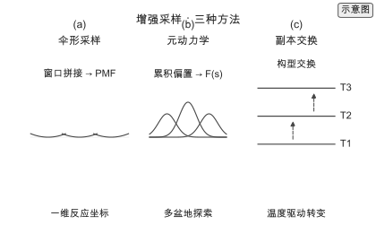

*图 5-9　增强采样方法对比。(a) 伞形采样在反应坐标上布置多个谐振窗口，窗口直方图拼接成 PMF；(b) 元动力学沿集体变量累积高斯偏置，偏置收敛后给出自由能；(c) 副本交换在多个温度并行并按 Metropolis 准则交换构型。（证据：示意）*

### 5.6.4 自由能分解与热力学积分

当自由能不能只用一两个集体变量描述时，用自由能分解。热力学积分（thermodynamic integration）在状态 $A$ 与 $B$ 之间引入耦合参数 $\lambda$，计算

$$\Delta F=\int_0^1\Big\langle\frac{\partial H_{\lambda}}{\partial\lambda}\Big\rangle_{\lambda}\,d\lambda,$$

$H_{\lambda}$ 是 $\lambda$ 下的哈密顿量，$\langle\cdot\rangle_{\lambda}$ 是在该 $\lambda$ 下的系综平均。自由能微扰（free energy perturbation, FEP）用一步或几步连接两个状态，

$$\Delta F=-k_BT\ln\big\langle e^{-\Delta H/(k_BT)}\big\rangle_{A}$$。

两条路径都需要两个状态的相空间有足够重叠，重叠不足时估计的方差极大。

在聚合物上，自由能分解常用于三类问题：吸附自由能（把链段从体相移到表面，分解为体相去溶剂化与表面结合）、溶解度与相容性（把溶质从纯相移到混合相）、以及 alchemical 变换（把一个单体逐步变成另一个，用于比较共聚物稳定性）。这些计算的代价是路径上的窗口数乘以每窗口的采样量，通常比单一 MD 高一个数量级 `[示意]`。报告自由能时必须给出集体变量、窗口或 $\lambda$ 路径、采样量与重加权方法，缺一项结果都不可复现。

## 5.7 模拟代价模型与证据分级

### 5.7.1 三个代价模型

本章用三个声明模型把不同方法的代价折算到同一坐标轴：DFT 的 $O(N^{3})$ SCF 模型、经典力场的近邻对线性模型、机器学习势的逐原子线性模型。

DFT：$\text{FLOPs}=c\,N^{3}N_{\text{SCF}}$，取 $c=10^{4}$ FLOPs/原子³、$N_{\text{SCF}}=50$，500 原子单点 $6.25\times10^{13}$ FLOPs `[复算]`。

经典力场：$\text{FLOPs}=N\,N_{\text{neigh}}\,f_{\text{pair}}\,n_{\text{step}}$ 加近邻表重建，取每原子 40 近邻对、每对 40 FLOPs，5000 原子 $10^{6}$ 步约 $8.4\times10^{12}$ FLOPs `[复算]`。

机器学习势：$\text{FLOPs}=f\,N\,n_{\text{step}}$ 加近邻表重建，取 $f=2\times10^{6}$ FLOPs/原子/步，5000 原子 $10^{6}$ 步约 $1.00\times10^{16}$ FLOPs `[复算]`。

三个模型的标度不同：DFT 随 $N^{3}$，力场与 MLFF 随 $N$。这解释了为什么原子数增大时 DFT 迅速不可行，而力场与 MLFF 仍可扩展。三个模型的常数来自声明输入，不是实测标定；它们的用途是排序与预算，不是性能预测。

### 5.7.2 理论估算与实际墙钟时间的差距

本章所有 GPU 时间都由 FLOPs 除以设备峰值与声明效率得到，是**理想算术下界（ideal arithmetic lower bound）**，不是实测 wall time。该下界只计入算术运算，未计入内存带宽、kernel launch、batch size、通信、I/O 与软件实现质量；分子动力学的实际瓶颈常是内存带宽而不是浮点吞吐，近邻表访问是稀疏、非连续的，实际达到的浮点效率远低于稠密矩阵乘；多 GPU 并行还要付出域分解与通信开销。因此实测墙钟时间通常高于该下界，倍数取决于体系大小与并行规模。本书未开展该套实测基准，真实运行时间受硬件、批大小与软件实现影响，需要读者在自己的硬件上实测。

把这些差距写清，是为了避免两种误用。第一，把理想算术下界当成采购或排期依据：它只是量级，不是性能承诺。第二，把不同方法之间的下界比值当成实测比值：实际比值会因实现质量而改变，MLFF 与力场的相对差距可能比下界更小或更大。凡是要用于决策的数字，都应由目标硬件上的实测标定；本章给出的是先验排序。

### 5.7.3 证据分级与本书未覆盖的基准

本章数字沿用前言定义的六级证据标签（`[实验]`、`[公开实验数据]`、`[模拟]`、`[复算]`、`[文献]`、`[示意]`）。本章没有原始湿实验测量、公开数据集再分析或自跑 DFT/MD，因此正文只出现 `[文献]`、`[复算]` 与 `[示意]` 三级：代价数字全部是 `[复算]`（FLOPs 折算的理想算术下界），方法参数（单位代价、近邻数、效率）全部是 `[示意]`，方法误差量级与文献结论是 `[文献]`。本章所有代价数字本书均未在目标硬件上实测。

本书未开展实测基准的项目包括：LAMMPS、OpenMM、GROMACS 在目标体系上的真实墙钟时间；DFT 单点的真实 FLOPs 与内存占用；机器学习势的训练时间与推理吞吐；粗粒化与反向映射的实际误差；模拟 $T_g$ 与实验 $T_g$ 的端到端偏差。这些空白需要用真实基准补齐，补齐方法在 5.10.3 给出。

## 5.8 代表性工作与里程碑

### 5.8.1 从经典力场到机器学习势

分子模拟的起点是 1957 年 Alder 与 Wainwright 对硬球体系相变的分子动力学计算，它证明数值积分可以给出相变。[^md1957] 1990 年代，力场从简单液体扩展到生物大分子与聚合物：OPLS、CHARMM、GAFF 分别覆盖有机液体、蛋白质与通用小分子，[^opls][^charmm][^gaff] COMPASS 与 PCFF 把从头算数据引入凝聚相参数化。[^compass][^pcff] 这一代力场的共同点是参数固定、迁移性有限。

2007 年 Behler 与 Parrinello 用高维神经网络表示势能面，把“从数据学势”变成可行路线。[^behler] 2017 年 SchNet 把连续滤波卷积引入原子体系，[^schnet] 2022 年 NequIP 与 MACE 用 E(3) 等变消息传递把样本效率提高一个量级。[^nequip][^mace] 2023 年后，M3GNet、CHGNet 与 MACE-MP-0 把训练数据扩到跨材料规模，走向通用势与基础势。[^m3gnet][^chgnet][^macemp0]

这条演进线的主线是“把物理先验放进模型”。经典力场把化学先验写进原子类型与函数形式；局部 MLIP 把局部性写进能量分解；等变 MLIP 把对称性写进网络；通用势与基础势把化学空间先验写进训练数据。每一代都在减少对人工设计的依赖，代价是数据需求上升。

### 5.8.2 聚合物专用力场与模拟基准

聚合物模拟的专用工具是力场与工作流，而不是某一个算法。OPLS 与 GAFF 提供了可迁移的起点，[^opls][^gaff] COMPASS 与 PCFF 提供含交叉项的 Class II 形式，[^compass][^pcff] CHARMM 与 CGenFF 提供极性体系与离子的参数。[^charmm] 粗粒化侧，MARTINI 提供预设珠子类型，[^martini] IBI、力匹配与相对熵提供三条从全原子轨迹反推有效势的路线。[^ibi][^forcematching][^relentropy]

聚合物模拟的基准工作集中在 $T_g$ 与力学性质。用原子模拟提取 $T_g$ 的流程在 5.3.4 给出，代表性工作把模拟 $T_g$ 与实验值和机器学习预测对照，用于评估力场与流程的系统偏差。[^polyimideTg] 这类基准的价值在于固定流程、力场与降温速率，使不同工作的数值可比。

### 5.8.3 通用势与基础势

通用势的目标是一个模型覆盖周期表。M3GNet 用图网络在材料数据上训练，支持跨材料的性质预测与筛选；[^m3gnet] CHGNet 在能量之外预测磁矩与电荷，用于电荷敏感的体系。[^chgnet] 基础势 MACE-MP-0 在多样化的材料数据上预训练，报告在多种材料上接近专用势的精度，并支持微调。[^macemp0]

主动学习是通用势与专用势之间的桥梁。FLARE 用贝叶斯不确定性在线决定何时调用 DFT，把昂贵的标注集中在模型最不确定的构型上。[^flare] 对聚合物，主动学习的价值在于构象空间巨大：与其预先猜测哪些构象重要，不如让模拟在探索中暴露高不确定性区域。

> **论文 Box　MACE-MP-0：材料科学的原子间基础模型**
>
> MACE-MP-0 的定位是把等变消息传递势做成可迁移的基础模型。规模：在材料科学的大规模 DFT 数据上预训练，覆盖多种元素与晶体结构；模型是 MACE 架构的高阶等变消息传递网络。下游：报告在多种材料与分子上的能量与力误差，并展示微调后的精度提升。结论：基础势把工作流从“每个体系从零训练”变成“先试基础势、再微调”，它的价值在于降低新体系的上手成本，而不是在所有体系上超过专用势。对聚合物，基础势提供了一个未经目标体系数据微调时的起点，其精度与适用性需要用目标体系的验证集检查。

## 5.9 Worked example：从单体到玻璃化转变温度的模拟流水线与代价核算

### 5.9.1 任务与体系

任务是为一批聚酰亚胺候选估算 $T_g$，方法与参数与 5.3.4 的工作流一致。取一个候选，重复单元约 50 个原子 `[示意]`，取聚合度 $n=20$、5 条链，体系约 5000 个原子，与 5.3.2 的 MD 基准同规模。目标是给出每个候选的 $T_g$ 标签，并核算这条流水线的代价。

选择聚酰亚胺的理由是它覆盖模拟方法的主要难点：主链刚性大、链间作用含强极性与色散、$T_g$ 对力场敏感。用它做 Worked example 能同时展示力场选择、退火流程与偏差来源。若换成柔性聚烯烃，$T_g$ 低、弛豫快，工作流相同但所需轨迹更短。

### 5.9.2 工作流与参数选择

工作流按 5.3.4 的九步执行，参数如下。单体用 PSMILES 构建；聚合度 $n=20$、5 条链；无定形盒子初始密度 0.5 g/cm³、边长取最大链末端距的两倍以上；能量最小化用共轭梯度，最大力阈值 10 kcal/(mol·Å) `[示意]`；NVT 在 600 K 平衡 1 ns；NPT 在 600 K、1 atm 平衡 5 ns；退火到 650 K 保持 2 ns；降温从 650 K 到 250 K，速率 10 K/ns，每 10 K 采样 1 ns `[示意]`。总轨迹长度约 55 ns。

$T_g$ 用比容–温度曲线的双线性拟合提取。降温速率取 10 K/ns 是 MD 常用值，它比实验快约 12 个数量级，得到的 $T_g$ 系统性偏高 `[文献]`。在本例中不追求与实验绝对值对齐，只用同一速率做候选之间的相对排序；若需要绝对校准，用已知聚合物在相同流程下的模拟–实验偏差做平移。

### 5.9.3 代价核算

三部分代价分别核算。

第一部分，全原子 MD 采样。55 ns 等于 $5.5\times10^{7}$ 步（时间步 1 fs）。按 5.3.2 的声明模型，$10^{6}$ 步约 0.090 GPU·秒 `[复算]`，55 ns 约

$$55\times0.090=4.95\ \text{GPU·秒}\approx5\ \text{GPU·秒}$$。

该值为按声明参数折算的理想算术下界 `[复算]`，未计入内存带宽、kernel launch、batch size、通信、I/O 与实现质量，不代表 LAMMPS 或 OpenMM 的实测墙钟时间。

第二部分，DFT 参数化参考。为力场补参数与验证，取 100 个构象做 DFT 单点，每个 500 原子、10.7 GPU·秒 `[复算]`，共约 $1.07\times10^{3}$ GPU·秒 `[复算]`。这是一次性代价，可摊到该体系的所有候选上。

第三部分，机器学习势路线对比。若不用经典力场而用 MLFF 做同样的 55 ns MD，按 5.3.2 的声明模型 $10^{6}$ 步约 106.8 GPU·秒 `[复算]`，55 ns 约

$$55\times106.8=5.87\times10^{3}\ \text{GPU·秒}\approx1.63\ \text{GPU·小时}$$。

该值同样是理想算术下界 `[复算]`，不含 MLFF 的训练与数据生成代价。三条路线放在一起看：经典力场 MD 约 5 GPU·秒、DFT 参数化约 $1.07\times10^{3}$ GPU·秒（一次性）、MLFF MD 约 $5.87\times10^{3}$ GPU·秒。对 $T_g$ 这类由链段弛豫决定、不需要断键精度的性质，经典力场是主流程，DFT 用于参数与验证，MLFF 留给需要反应精度的场景。

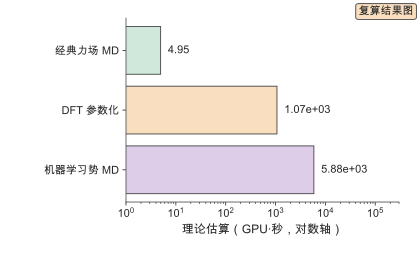

*图 5-10　Worked example 的代价核算。对数横轴是理想算术下界（GPU·秒）。经典力场 MD（55 ns、5000 原子）约 5 GPU·秒 `[复算]`；DFT 参数化（100 个 500 原子单点）约 $1.07\times10^{3}$ GPU·秒 `[复算]`；机器学习势 MD（55 ns）约 $5.87\times10^{3}$ GPU·秒 `[复算]`。三者均为按声明参数折算的理想算术下界，未计入内存带宽、kernel launch、batch size、通信、I/O 与实现质量，不代表软件实测。（证据：复算）*

### 5.9.4 结论

主流程选经典力场 MD 提取 $T_g$：55 ns 轨迹约 5 GPU·秒 `[复算]`，把 $T_g$ 的相对排序做出来；用约 $1.07\times10^{3}$ GPU·秒 `[复算]` 的 DFT 单点做力场补参与验证，一次性摊销；在需要断键、极化或反应精度的目标上，用 MLFF 的约 $5.87\times10^{3}$ GPU·秒 `[复算]` 替代经典力场。结论与 5.4.7 的边界一致：方法按目标量分层，而不是按“精度越高越好”排序。核算时按目标量的精度需求选主流程，把一次性代价与摊销代价分开记。

代价核算还给出批量规模的上限。若总预算是 $10^{4}$ GPU·小时，用经典力场主流程（每条约 5 GPU·秒，含 DFT 摊销后约 15 GPU·秒 `[复算]`）可生成约 $2.4\times10^{6}$ 条标签；若改用 MLFF，同样预算只能生成约 $6\times10^{3}$ 条。这个对比说明：在 $T_g$ 这类不需要反应精度的目标上，力场选择直接决定数据集规模，而数据集规模又决定第 6 章模型能学到什么。

## 5.10 模拟方案的定量对比

### 5.10.1 精度对比

四级方法的能量误差量级如下表。误差是相对高精度参考（如 CCSD(T) 或实验）的偏差，不是方法之间的相对值。

| 方法 | 能量误差（meV/atom） | 主要误差来源 | 证据 |
| --- | --- | --- | --- |
| DFT（GGA + 色散） | 数十 | 泛函近似 | 文献 |
| DFT（杂化） | 数十 | 泛函与基组 | 文献 |
| 机器学习势 | 数十 | 训练数据与拟合 | 文献 |
| 全原子力场 | 数十到数百 | 参数迁移性 | 示意 |
| 粗粒化 | 数百以上 | 自由度积分 | 示意 |

表中的量级只用于排序。同一行内的误差可以相差数倍，取决于体系与参数；把某个方法的误差当成常数会误导方法选择。正确用法是先确定目标的误差容忍值，再看候选方法是否落在容忍值内，最后在满足者中取代价最低的。

### 5.10.2 代价对比

把本章的三个代价模型放在同一张表。

| 方法 | 每原子代价 | 5000 原子 $10^{6}$ 步 | 证据 |
| --- | --- | --- | --- |
| DFT 单点 | $c\,N^{2}N_{\text{SCF}}$ | 不可行（$N^{3}$ 标度） | 复算 |
| 全原子力场 MD | 约 $8\times10^{3}$ FLOPs/原子/步 | 约 0.090 GPU·秒 | 复算 |
| 机器学习势 MD | $2\times10^{6}$ FLOPs/原子/步 | 约 106.8 GPU·秒 | 复算 |

表的读法是先看“不可行”一栏：DFT 的每原子代价随 $N^{2}$ 增长，5000 原子体系做 $10^{6}$ 步的代价远超预算，因此 DFT 不出现在长时动力学里。剩下两行中，力场比 MLFF 便宜约 250 倍 `[复算]`，但精度低；选择取决于目标量是否需要 DFT 精度。

### 5.10.3 本书未覆盖的基准

以下项目本书未开展实测基准，读者不应把声明模型的结果当成实测：DFT、LAMMPS、OpenMM、GROMACS 在目标体系上的真实墙钟时间；机器学习势的训练时间、推理吞吐与显存占用；粗粒化与反向映射的实际精度；模拟 $T_g$ 与实验 $T_g$ 的端到端偏差；不同力场在同一聚合物上的 $T_g$ 差异。这些空白需要用真实基准补齐。

补齐这些基准的做法是固定体系、力场、流程与硬件，对每种方法各跑一次，报告能量、力、目标性质与墙钟时间。基准至少覆盖两类体系：一个柔性聚合物与一个刚性聚合物，以暴露方法对链刚性的敏感度。这类基准的工作量在流程实现与参数化，不在算法本身；5.11 的实践流程与 5.9 的 Worked example 为它提供模板。

## 5.11 从目标性质到模拟方案的实践流程

### 5.11.1 目标性质到方法的映射

流程的第一步是把目标性质翻译成尺度与精度需求。下表给出常见高分子性质的默认方法。

| 目标性质 | 特征尺度 | 默认方法 | 备注 |
| --- | --- | --- | --- |
| 反应能、能垒 | Å · fs | DFT（含色散） | 小体系或 QM/MM |
| 单体偶极、极化率 | Å | DFT（单体） | 用于介电估算 |
| 密度、构象能 | nm · ps | 全原子 MD | 力场验证的基准量 |
| $T_g$ | nm · ns | 全原子 MD + 退火 | 相对排序可靠 |
| 扩散、黏度 | nm · ns | 全原子 MD | 需长轨迹与自相关分析 |
| 相分离、自组装 | 10 nm · µs | 粗粒化 MD | 映射比决定尺度 |
| 吸附自由能 | nm · ns | 增强采样 | 需反应坐标与重加权 |
| 界面与断键 | Å · fs | DFT 或 MLFF | 需要电子结构精度 |

表里的默认方法不是唯一选择，而是起点。实际选择要把体系大小、可用数据与硬件预算代入：体系大到全原子 MD 不可行时，先粗粒化做形貌，再用反向映射回到原子细节；目标量需要断键精度时，用 MLFF 替代 DFT 做动力学。

### 5.11.2 平衡与收敛检查

模拟结果的可信度取决于平衡与收敛，而这两件事常被跳过。检查分三层。

第一层是平衡判据：势能、温度、密度、回旋半径随时间是否走平；NPT 的密度是否收敛到平台。判据是趋势而非瞬时值，用滑动平均去掉涨落后再看。

第二层是采样判据：目标量的分块平均标准误是否随块数稳定；自相关时间是否远小于轨迹长度。有效样本数 $N_{\text{eff}}=N_{\text{frame}}/(2\tau_{\text{corr}})$，$\tau_{\text{corr}}$ 是积分自相关时间。$N_{\text{eff}}$ 太小说明轨迹长度不足，需要加长或换增强采样。

第三层是收敛判据：把轨迹分成前后两半，目标量的两半估计是否一致；把降温速率减半，$T_g$ 是否按预期移动。前后不一致或速率依赖异常，说明采样不足或方法不适用。

> **可复现 Box　模拟实验的数据、代码、环境与种子**
>
> 一个模拟实验要能被复现，需要记录四类信息。数据：结构文件与校验值、力场或泛函参数与版本、轨迹与后处理脚本、标签的元数据 schema。代码：建模脚本、模拟输入文件、分析与 $T_g$ 提取脚本；计算量核算的输入（原子数、步数、近邻数、单点代价）。环境：软件与版本、GPU 型号与驱动、随机种子（初始速度、控温器、控温控压各一个）、并行规模。结果：能量与力误差、目标性质、墙钟时间，以及是否达到平衡与收敛。缺少其中任何一类，模拟之间的差异都难以归因。本书的对应记录在 `calculations/results/` 与各章实验目录。

### 5.11.3 复现清单

复现清单把 5.11.2 的检查固化成一组必填项：结构来源与构建方式；方法与参数（泛函、基组、力场、系综）；软件与版本；温度与压力；时间步、步数、保存频率；平衡与采样区间；目标量的提取公式与拟合区间；随机种子；硬件与并行规模；已知偏差与适用范围。每项都要写进记录，而不是留在个人笔记里。

清单的作用是让偏差可归因。两个工作给出不同的 $T_g$，只有清单齐全时才能判断差异来自力场、降温速率、平衡长度还是拟合区间。第 3 章的复现规范与第 16 章的工程实践把这份清单接到全书的报告模板上。

## 5.12 模拟方法选型决策指南

### 5.12.1 决策路径

按下面的顺序走。第一步，写清目标性质的尺度与精度需求：特征长度、特征时间、误差容忍值。第二步，查 5.11.1 的映射表，筛出覆盖目标尺度的方法。第三步，按 5.7 的代价模型算每种候选方法的代价，取满足精度者中代价最低的。第四步，检查数据与方法参数：力场是否有覆盖，MLFF 是否有训练数据，粗粒化势是否在目标条件下标定。第五步，做平衡与收敛检查（5.11.2），确认结果可信。第六步，记录复现清单。

出现下面三种信号时要换方法或补数据：目标量随轨迹长度单调漂移（采样不足）；误差在不同力场或泛函间波动很大（方法参数未覆盖）；理论代价与实测墙钟差很多（预算估计失效）。三种信号对应不同的修法：第一种加长轨迹或上增强采样，第二种换力场或补参数，第三种在目标硬件上重新标定。

### 5.12.2 任务—方法对照

| 任务 | 体系规模 | 首选方法 | 理由 |
| --- | --- | --- | --- |
| 反应能与能垒 | 数百原子 | DFT | 需要电子结构精度 |
| 力场参数化 | 单体到低聚物 | DFT | 提供电荷与二面角 |
| 密度与构象能 | 数千原子 | 全原子 MD | 力场可覆盖 |
| $T_g$ 排序 | 数千到数万原子 | 全原子 MD + 退火 | 相对排序可靠 |
| 介观形貌 | 十万原子以上 | 粗粒化 MD | 映射比放大尺度 |
| 吸附自由能 | 数千原子 | 增强采样 | 需要跨垒与重加权 |
| 界面与断键 | 数千原子 | MLFF 或 DFT | 精度与尺度折中 |
| 跨化学筛选 | 多体系 | 基础势 + 微调 | 降低上手成本 |

表里的首选方法是默认起点，不是结论。实际选型要把目标量的误差容忍值、可用数据与硬件预算一起代入：标签里没有实验或高精度参考时，任何方法的系统偏差都难以被发现，先补验证数据再选方法；预算只够跑一种方法时，选能覆盖目标尺度且最便宜的那个，并明确声明误差未被独立验证。

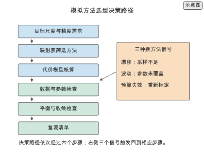

*图 5-11　模拟方法选型决策路径。从目标性质的尺度与精度需求出发，依次经过映射表筛选、代价核算、数据检查、平衡与收敛检查，最后落到复现清单；右侧三个信号（漂移、波动、预算失效）触发回到相应步骤。（证据：示意）*

## 5.13 练习与实验清单

本章的练习与实验都围绕“核算模拟的代价与偏差”展开。核心练习 5-1 至 5-3 给出 DFT 单点代价、MD 轨迹代价与机器学习势加速比三个基本核算；延伸实验 5-4 至 5-8 把核算扩到粗粒化尺度、采样收敛、力场迁移性、MLFF 数据需求与增强采样自由能。

| 编号 | 主题 | 类型 | 记录 |
| --- | --- | --- | --- |
| 5-1 | DFT 单点代价 | 核心 | `md-cost-dft` |
| 5-2 | MD 轨迹代价 | 核心 | `md-cost-mlff` |
| 5-3 | 机器学习力场加速比 | 核心 | `md-cost-dft`、`md-cost-mlff` |
| 5-4 | 粗粒化尺度 | 延伸 | 在线扩写资料 5.4.1 |
| 5-5 | 采样收敛 | 延伸 | 在线扩写资料 5.3.2 |
| 5-6 | 力场迁移性与参数化代价 | 延伸 | 在线扩写资料 5.3.5 |
| 5-7 | 机器学习势的训练数据需求 | 延伸 | 在线扩写资料 5.4.6 |
| 5-8 | 增强采样自由能重建 | 延伸 | 在线扩写资料 5.6.2 |

## 谬误与陷阱

**误区：精度越高的方法越好。** 错误后果：用 DFT 去追长链动力学，预算被立方标度吃光，得到的标签仍覆盖不了链段弛豫。正确做法：先确定目标性质的尺度与误差容忍值，再看候选方法是否落在容忍值内，最后在满足者中取代价最低的。DFT 精度最高，但 $O(N^{3})$ 标度使 500 原子的单点理论估算已达 10.7 GPU·秒 `[复算]`，长链动力学不可直接计算。

**误区：机器学习势的精度由网络容量决定。** 错误后果：不断加大网络却不去补训练数据，模型在未覆盖构象上给出的是外推值，误差迅速上升，动力学随之失真。正确做法：把训练数据当作精度上限，用能量与力的误差同时约束训练以保证动力学稳定，并用外推检测守住适用范围。网络只负责在数据覆盖的范围内拟合。

**误区：模拟标签可以直接当实验值用。** 错误后果：方法偏差与条件偏差一起进入标签，模型把偏差当成结构–性质关系；降温速率与加载速率这类条件偏差不会随采样加长而消失。正确做法：用模拟标签训练、实验值验证，按结构分组校准，并把速率等条件写进标签元数据。

**误区：粗粒化只是把原子数减少。** 错误后果：把有效势当作真实势能面跨温度或密度使用，被积分掉的振动熵贡献改变，势的形状随之改变，形貌与热力学量同时偏掉。正确做法：粗粒化的参数必须从目标体系的全原子轨迹重新标定，并注明标定温度与密度，跨条件使用前重新验证；映射比越高，可迁移性越差。

**误区：机器学习势比经典力场总是更快。** 错误后果：在不需要 DFT 精度的目标上选 MLFF，每步比经典力场贵约 250 倍 `[复算]`，预算被浪费而误差并未下降。正确做法：先问目标量是否需要 DFT 精度，需要才用 MLFF，不需要就用经典力场。取声明参数，MLFF 每原子每步约 $2\times10^{6}$ FLOPs `[示意]`，经典力场约 $8\times10^{3}$ FLOPs `[示意]`。

**误区：理论 GPU 秒就是软件实测性能。** 错误后果：把理想算术下界用于采购或排期，会得到过于乐观的结论，因为真实瓶颈常在内存带宽、通信与实现质量，实测墙钟通常高于下界。正确做法：把本章数字当作量级与排序，凡是要用于决策的性能都应在目标硬件上实测标定。本章所有 GPU 时间都由 FLOPs 折算，是理想算术下界（ideal arithmetic lower bound），不代表真实软件 wall time。

**误区：轨迹够长就一定收敛。** 错误后果：能垒高的过程在长轨迹里也可能一次都没发生，得到的是“冻住”的构型，却被当成平衡系综。正确做法：用有效样本数与自相关时间判断采样是否充分，跨垒过程必须用增强采样，而不是单纯加长轨迹。

**误区：模拟的 $T_g$ 可以直接和实验比。** 错误后果：MD 的降温速率比实验快十多个数量级，模拟 $T_g$ 系统性偏高，直接比较会把速率偏差当成结构差异。正确做法：用同一速率做候选之间的相对排序；要比绝对值，则做速率外推或用已知体系的模拟–实验偏差校准。

## 本章数字速查

与全书通用数字重复的项参见附录 F：N15（DFT 单点理论估算）、N16（力场 MD 理论估算）。下表只列本章新增数字。

| 量 | 数值 | 说明 | 证据 |
| --- | --- | --- | --- |
| 四级方法尺度 | Å·fs / nm·ns / 10 nm·µs / µm·稳态 | 电子/全原子/粗粒化/连续 | 文献 |
| DFT 单位代价 | $c=10^{4}$ FLOPs/原子³ | 声明模型 | 示意 |
| DFT SCF 迭代 | $N_{\text{SCF}}=50$ | 声明模型 | 示意 |
| 原子数加倍的代价 | 8 倍 | $O(N^{3})$ 标度 | 复算 |
| AIMD（500 原子、1 ps） | 约 $2.14\times10^{4}$ GPU·秒 | 2000 步 × 10.7 | 复算 |
| 构象数（$N_{\text{rot}}=10$） | 59049 | $3^{10}$ | 复算 |
| 力场能量分解 | 键、角、二面角、vdW、静电 | 五项 | 文献 |
| MD 时间步 | 1 fs | 含氢体系 | 文献 |
| 轨迹大小 | 60 MB | 5000 原子、1000 帧、float32 | 复算 |
| 全原子 MD 每原子代价 | 约 $8\times10^{3}$ FLOPs/原子/步 | 声明模型 | 示意 |
| MLFF 每原子代价 | $2\times10^{6}$ FLOPs/原子/步 | 声明模型 | 示意 |
| MLFF 加速比 | $6.25\times10^{4}$ | $N=500$，理想算术下界 | 复算 |
| MLFF 相对力场每步倍数 | 约 250 | 理想算术下界 | 复算 |
| 粗粒化映射比 | 1→10 放大约一个数量级 | 精度损失随之增大 | 示意 |
| 粗粒化时间步 | 10–20 fs | 高频振动被积分掉 | 示意 |
| 截断半径 5→6 Å 邻域数 | 1.73 倍 | $(6/5)^{3}$ | 复算 |
| 能垒每增 $5k_BT$ 速率下降 | 约 148 倍 | $e^{5}$ | 复算 |
| 模拟 $T_g$ 降温速率 | $10^{11}$–$10^{12}$ K/s | 比实验快约 12 个数量级 | 示意 |
| Worked example 力场 MD（55 ns） | 约 5 GPU·秒 | 声明模型 | 复算 |
| Worked example DFT 参数化 | 约 $1.07\times10^{3}$ GPU·秒 | 100 个单点 | 复算 |
| Worked example MLFF MD（55 ns） | 约 $5.87\times10^{3}$ GPU·秒 | 声明模型 | 复算 |

表中本章只用到 `[文献]`、`[复算]`、`[示意]` 三级；`[实验]`、`[公开实验数据]`、`[模拟]` 在本章没有对应数字。所有 GPU 时间均为按声明参数折算的理想算术下界；本书未开展该套实测基准，真实运行时间需在目标硬件上实测。

## 延伸阅读

- 密度泛函基础：Kohn–Sham 与交换关联泛函见 [归档快照](../references/files/papers/ks-dft-1965.html)；色散校正见 ^\[87\]^。
- 分子动力学起点：硬球体系相变的分子动力学方法见 ^\[100\]^。
- 力场家族：OPLS-AA 见 ^\[105\]^、GAFF 见 ^\[90\]^、COMPASS 见 ^\[86\]^、PCFF 见 ^\[106\]^、CHARMM 见 ^\[84\]^。
- 粗粒化：MARTINI 见 ^\[99\]^、IBI 见 ^\[93\]^、力匹配见 ^\[89\]^、相对熵见 ^\[109\]^。
- 增强采样：伞形采样见 ^\[111\]^、WHAM 见 ^\[112\]^、副本交换见 ^\[110\]^；元动力学见 ^\[101\]^。
- 机器学习势：Behler–Parrinello 见 [归档快照](../references/files/papers/behler-parrinello-2007.html)；SchNet 见 [归档全文](../references/files/papers/schnet-2017.pdf)；NequIP 见 [归档全文](../references/files/papers/nequip-2022.pdf)；MACE 见 [归档全文](../references/files/papers/mace-2022.pdf)；Allegro 见 [归档全文](../references/files/papers/allegro-2023.pdf)；M3GNet 见 [归档全文](../references/files/papers/m3gnet-2022.pdf)；CHGNet 见 [归档全文](../references/files/papers/chgnet-2023.pdf)；MACE-MP-0 见 [归档全文](../references/files/papers/mace-mp-0-2023.pdf)；FLARE 见 [归档全文](../references/files/papers/flare-2020.pdf)；综述见 [归档全文](../references/files/papers/mlff-review-2021.pdf)。
- 模拟工具：LAMMPS 见 [归档全文](../references/files/papers/lammps-2022.pdf)；OpenMM 见 [归档快照](../references/files/papers/openmm-2017.html)；ASE 见 [文档快照](../references/files/documents/ase-tools.html)。
- 聚合物模拟与 $T_g$：聚酰亚胺的原子模拟与机器学习对照见 [归档全文](../references/files/papers/polyimide-tg-md-ml-2020.pdf)。
- 复算与推导：DFT、MD 与 MLFF 的代价模型见 [md-cost-dft](../calculations/results/md-cost-dft.md) 与 [md-cost-mlff](../calculations/results/md-cost-mlff.md)；工作流、力场、粗粒化、增强采样与偏差分解的推导见 [第 5 章在线扩写资料](../archive/outlines/extensions/05-分子模拟与多尺度计算.md)。

[^extension5]: 四级方法尺度、选择判据、Kohn–Sham 方程、SCF 代价、力场分解、轨迹存储、增强采样、粗粒化映射、机器学习势谱系与偏差分解的推导见 [第 5 章在线扩写资料](../archive/outlines/extensions/05-分子模拟与多尺度计算.md)。

[^dft]: 密度泛函理论基础见 [归档快照](../references/files/papers/ks-dft-1965.html)。

[^d3]: DFT-D3 色散校正见 ^\[87\]^。

[^opls]: OPLS-AA 力场见 ^\[105\]^。

[^gaff]: GAFF 力场见 ^\[90\]^。

[^compass]: COMPASS 力场见 ^\[86\]^。

[^pcff]: PCFF 力场见 ^\[106\]^。

[^charmm]: CHARMM 力场见 ^\[84\]^。

[^martini]: MARTINI 粗粒化力场见 ^\[99\]^。

[^ibi]: 迭代玻尔兹曼反演见 ^\[93\]^。

[^forcematching]: 力匹配粗粒化见 ^\[89\]^。

[^relentropy]: 相对熵最小化见 ^\[109\]^。

[^umbrella]: 伞形采样见 ^\[111\]^。

[^wham]: WHAM 见 ^\[112\]^。

[^metadynamics]: 元动力学见 ^\[101\]^；该来源为开放获取，尚未归档全文。

[^repex]: 副本交换见 ^\[110\]^。

[^behler]: Behler–Parrinello 高维神经网络势见 [归档快照](../references/files/papers/behler-parrinello-2007.html)。

[^allegro]: Allegro 局部等变势见 [归档全文](../references/files/papers/allegro-2023.pdf)。

[^m3gnet]: M3GNet 通用图势见 [归档全文](../references/files/papers/m3gnet-2022.pdf)。

[^chgnet]: CHGNet 电荷信息通用势见 [归档全文](../references/files/papers/chgnet-2023.pdf)。

[^macemp0]: MACE-MP-0 基础势见 [归档全文](../references/files/papers/mace-mp-0-2023.pdf)。

[^flare]: FLARE 主动学习力场见 [归档全文](../references/files/papers/flare-2020.pdf)。

[^polyimideTg]: 聚酰亚胺的原子模拟与机器学习 $T_g$ 对照见 [归档全文](../references/files/papers/polyimide-tg-md-ml-2020.pdf)。

[^md1957]: 分子动力学方法起点见 ^\[100\]^。

[^mdcost]: DFT 与 MLFF 的代价复算见 [md-cost-dft](../calculations/results/md-cost-dft.md) 与 [md-cost-mlff](../calculations/results/md-cost-mlff.md)；模型与设备说明见 [calculations/README.md](../calculations/README.md)。

[^schnet]: SchNet 见 [归档全文](../references/files/papers/schnet-2017.pdf)。

[^nequip]: NequIP 见 [归档全文](../references/files/papers/nequip-2022.pdf)。

[^mace]: MACE 见 [归档全文](../references/files/papers/mace-2022.pdf)。

## 本章小结

模拟是结构–性能关系的计算来源，方法的选择是精度与代价的权衡。四级方法从电子结构到连续介质逐级积分掉自由度：电子结构给反应能与能隙，全原子给链段动力学，粗粒化给介观形貌，连续模型给宏观传热。选择判据是在覆盖目标尺度与误差要求的前提下取最低代价方法，判据的两个输入是实验精度决定的误差容忍值与采样的概率边界。

量子方法这一侧，DFT 的选择不只是泛函：单体、低聚物与周期模型回答不同问题，构象搜索决定系综平均，泛函与色散校正决定链间作用，基组与赝势决定数值精度。DFT 的位置是参数与局部性质的提供者，不是批量标签的生产者。

经典 MD 这一侧，从单体到 $T_g$ 的九步工作流把建模、平衡、退火、降温与提取固定下来；力场家族的适用对象由参数化数据决定，迁移到新主链必须重新验证。粗粒化把尺度放大，四条参数化路线按匹配结构、力还是分布区分；机器学习势按局部、等变、通用与基础势分代，它的适用边界由化学与构象覆盖共同决定，外推检测是使用前提。

代价模型统一到 FLOPs 与 GPU 时间，全部为按声明参数折算的理想算术下界（ideal arithmetic lower bound）。DFT 按 $O(N^{3})$ 标度，500 原子单点约 $6.25\times10^{13}$ FLOPs `[复算]`、理论 10.7 GPU·秒 `[复算]`；全原子 MD 按近邻对模型，$10^{6}$ 步约 $8.4\times10^{12}$ FLOPs `[复算]`、理论 0.090 GPU·秒 `[复算]`，轨迹 60 MB `[复算]`；机器学习势每原子每步 $2\times10^{6}$ FLOPs `[示意]`，相对 DFT 理论加速约 $6\times10^{4}$ 倍 `[复算]`，相对经典力场却贵约 250 倍 `[复算]`。这些数值由声明模型与设备峰值折算，不等于 LAMMPS、OpenMM 等软件的实测墙钟时间，未计入内存带宽、kernel launch、batch size、通信、I/O 与实现质量；本书未开展该套实测基准，真实运行时间需在目标硬件上实测。

模拟标签与实验值之间存在方法偏差与条件偏差。用模拟标签训练、实验值验证，并按结构分组校准，是把两者接到同一坐标轴的必要步骤；降温速率这类条件偏差必须在标签条件里记录。核心练习 5-1 至 5-3 分别核算了 DFT 单点代价、MD 轨迹代价与机器学习力场加速比，延伸实验 5-4 至 5-8 把核算扩到粗粒化尺度、采样收敛、力场迁移性、MLFF 数据需求与增强采样自由能。Worked example 用一组聚酰亚胺走通了从单体到 $T_g$ 的流水线与代价核算，结论是按目标量分层：力场 MD 做主流程，DFT 做参数与验证，MLFF 留给需要反应精度的场景。第 6 章用这些标签训练性质预测模型。
