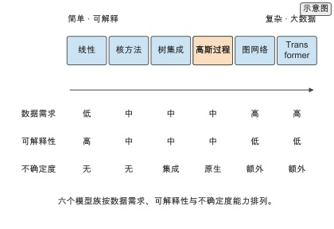
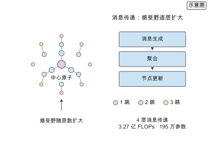
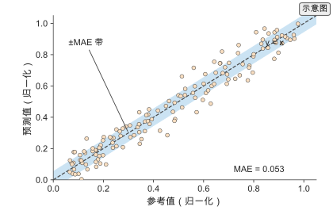
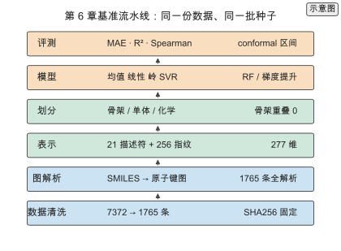
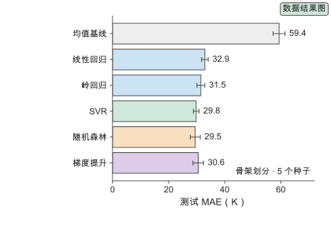
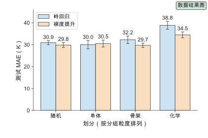
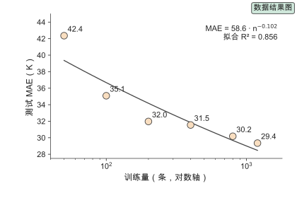
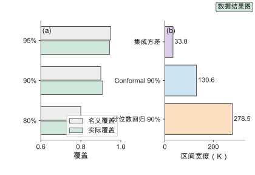
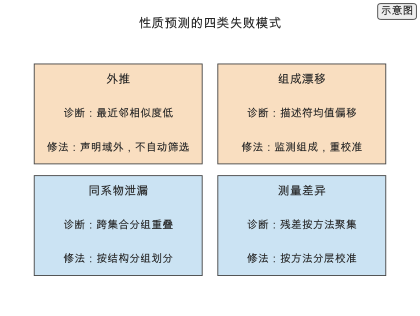
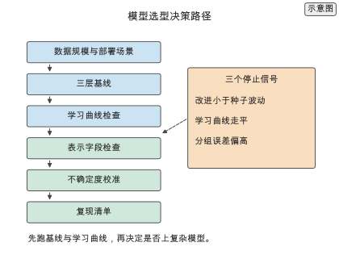

# 第 6 章 性质预测模型

给定一批聚酰亚胺候选，要预测它们的玻璃化转变温度。输入已经由第 2 章的表示固定：2048 位 Morgan 指纹、1826 维 Mordred 描述符或一张原子图 `[文献]`；标签来自第 3 章的数据集，几千条记录，带分子量与热历史条件。接下来要决定的是用什么模型把表示映射到温度：线性回归、核方法、树集成、高斯过程、图神经网络，还是序列 Transformer。

第 5 章回答“标签从哪来、代价多大”，本章回答“给定这批标签，用什么模型把表示映射到性质”。候选清单很长，但选择不是越复杂越好。数据只有几千条时，树集成常与图网络打平；数据上万条后，图网络与预训练语言模型才显出优势。这一章给出统一的问题设定与评价指标，按模型族比较能力与代价，并交代如何选基线、如何诊断误差。

贯穿全章的判断是：模型能力必须与数据规模匹配。小数据下树集成与核方法是稳健基线，大数据与迁移场景下图网络和序列模型才有优势；选模型前先建立基线与误差分析，否则难以判断复杂模型是否真的带来改进。

本章沿一条从判据到落地的路线展开。6.1 固定问题设定与指标，6.2 至 6.4 按经典模型、图网络与序列模型三族展开，6.5 收束到模型选择与诊断。6.6 补上六类基线体系，说明每一类为什么必须报；6.7 与 6.8 分别把图网络与序列模型扩成家族谱系；6.9 给出五种划分与评测规范。6.10 是本章的核心：用真实公开的聚酰亚胺 $T_g$ 数据跑一次可复现基准，比较六类基线与六个模型、四种划分与三种不确定度；6.11 展开不确定度，6.12 写失败模式，6.13 回顾代表工作，6.14 做定量对比，6.15 给实践流程，6.16 给选型决策，6.17 汇总练习。做工程的读者可以沿 6.1 → 6.6 → 6.9 → 6.10 → 6.15 → 6.16 直接走通。

## 6.1 问题设定与评价

把所有性质预测任务写成同一个监督学习问题，固定输入、输出与指标，后续模型才可比较。

### 6.1.1 回归与分类

设样本 $(z_i,y_i)$，其中 $z_i=g(x_i)$ 是第 2 章的表示、$y_i$ 是目标性质，学习目标是映射 $f:z\mapsto y$。回归处理连续性质（玻璃化转变温度、模量、介电常数），损失取均方误差

$$\mathcal L_{\text{MSE}}=\frac{1}{N}\sum_i\big(y_i-f(z_i)\big)^{2};$$

分类处理离散标签（是否可合成、是否通过阈值），损失取交叉熵

$$\mathcal L_{\text{CE}}=-\frac{1}{N}\sum_i\sum_c y_{ic}\log f_c(z_i),$$

$y_{ic}$ 是样本 $i$ 属于类别 $c$ 的指示变量。多性质任务可以先分解为多个单任务分别训练，也可以共享表示联合训练；后者把小数据任务的有效样本放大，其做法与代价留到第 7 章展开。

### 6.1.2 评价指标

回归任务用四个指标。平均绝对误差与均方根误差给出误差的绝对尺度，决定系数给出相对方差解释比例：

$$\mathrm{MAE}=\frac{1}{N}\sum_i|y_i-\hat y_i|,\quad \mathrm{RMSE}=\sqrt{\frac{1}{N}\sum_i(y_i-\hat y_i)^{2}},\quad R^{2}=1-\frac{\sum_i(y_i-\hat y_i)^{2}}{\sum_i(y_i-\bar y)^{2}},$$

秩相关用 Spearman 系数度量预测与实测的单调关系。分类任务用准确率、精确率、召回率、F1 与 AUC，其中前三个定义为

$$\text{Precision}=\frac{TP}{TP+FP},\qquad \text{Recall}=\frac{TP}{TP+FN},\qquad F_1=\frac{2PR}{P+R},$$

AUC 为 ROC 曲线下面积。指标的选择匹配应用：筛选任务关心高精度区的召回，即模型推荐的前若干个候选里有多少命中；排序任务关心秩相关，即模型能否把好结构排到前面。

报告必须给出误差棒与划分方式：同一划分、同一指标、多次随机种子的均值与标准差。第 3 章已把划分三元组 $(k,q,s)$ 与多种子报告固定下来，本章与第 7、8、11 章沿用同一套定义，不再重复。

## 6.2 经典模型

经典模型在中小数据上仍是首选基线，它们的假设简单、训练快、可解释，是判断复杂模型是否值得的标尺。选模型族时按数据规模与是否需要不确定度定位（图 6-1）：数据规模决定哪一族可能占优，是否需要不确定度决定是否必须用高斯过程或额外集成。

### 6.2.1 线性与核方法

线性回归把映射写成 $f(z)=w^\top z+b$。岭回归在平方损失上加二范数正则，闭式解为

$$\mathbf w=(X^\top X+\lambda I)^{-1}X^\top\mathbf y,$$

$\lambda$ 控制正则强度：$\lambda$ 增大压低权重、降低方差，代价是引入偏差；特征数接近或超过样本数时 $X^\top X$ 接近奇异，正则项使解稳定。

核岭回归用核函数 $k$ 把线性模型推广到非线性。由表示定理，解写成训练样本核的线性组合

$$f(z)=\sum_i\alpha_i k(z_i,z),\qquad \alpha=(K+\lambda I)^{-1}\mathbf y,$$

其中 $K_{ij}=k(z_i,z_j)$。核函数的选择等价于隐式地选择一个特征映射：线性核给出线性模型，径向基核给出无穷维特征空间。核方法在小样本、中等维度下表现稳健，代价是预测时要与全部训练样本比较，单次预测代价随样本量线性增长，训练要分解 $N\times N$ 的核矩阵。

### 6.2.2 树集成

决策树按特征阈值递归划分样本空间，叶节点给出预测。单棵树方差大，随机森林对 $B$ 棵在自助样本与随机特征子集上训练的树取平均，把方差降到约 $\sigma^{2}/B$ `[文献]`，树间相关性越高收益越小。梯度提升换一个方向，逐棵拟合当前模型的负梯度，即残差，

$$f_m(z)=f_{m-1}(z)+\nu\,h_m(z),\qquad h_m\approx-\nabla_f\mathcal L,$$

$\nu$ 为学习率，小学习率配多棵树降低偏差。

树集成对特征尺度不敏感，能表达非线性与特征交互，不需要标准化，在高分子性质预测里长期是最强基线。在几千条样本上，它相对线性基线的改进有限；扩大模型容量的收益要等到样本量上万才明显。原因在数据规模：第 3 章的学习曲线 $\mathrm{MAE}(n)=0.05+n^{-0.5}$ `[示意]` 在几千条样本处已接近平台，从 $10^{4}$ 条加到 $10^{5}$ 条，误差只从 0.060 降到 0.053 `[复算]`。数据量而非模型表达力，是这一区间总误差的主要来源。[^lc]

> **练习 6-1〔核心〕：基线与树模型对比**
>
> 在 6000 条玻璃化转变温度记录、2048 位指纹、按单体分组划分与 5 个随机种子的固定条件下，比较均值基线、指纹上的岭回归与树集成三种模型的测试误差，说明模型复杂度与数据规模的匹配关系。
>
> 条件：需要运行本书配套仓库的 `calculations/` 复算模块（learning-curve），并查阅本书参考文献中的 ^\[63\]^。

### 6.2.3 高斯过程与不确定度

高斯过程把函数本身当作随机变量。给定均值函数 $m$ 与核函数 $k$，先验写作 $f\sim\mathcal{GP}(m,k)$；观测到训练数据后，新点 $z^{*}$ 的预测分布是正态分布，均值与方差为

$$\mu(z^{*})=k_*^{\top}(K+\sigma_n^{2}I)^{-1}\mathbf y,\qquad \sigma^{2}(z^{*})=k(z^{*},z^{*})-k_*^{\top}(K+\sigma_n^{2}I)^{-1}k_*,$$

$k_*$ 是新点与训练点的核向量、$\sigma_n$ 是观测噪声。方差随 $z^{*}$ 远离训练点而增大，这正是模型在哪些区域不知道的量化。

不确定度是第 11 章主动学习与贝叶斯优化的直接输入：采集函数用方差决定下一个实验点。代价是训练要分解 $N\times N$ 核矩阵，复杂度 $O(N^{3})$，预测 $O(N^{2})$。取 $N=6000$，$N^{3}=2.16\times10^{11}$ `[复算]`，单机可承受；样本量升到 $10^{5}$ 时分解量到 $10^{15}$ `[复算]`，高斯过程退居小样本工具，此时用集成方差或图网络的深度集成替代。

*图 6-1　模型谱系。横向从线性、核方法、树集成、高斯过程到图网络与 Transformer，标注各模型的数据需求、可解释性与不确定度能力；高斯过程原生给出不确定度，树集成与图网络需要额外处理。（证据：示意）*

## 6.3 图神经网络

图神经网络直接在分子图上学习，把局部化学环境通过消息传递（图神经网络的核心运算：相邻节点交换化学环境信息）聚合为全局表示，是拓扑敏感性质的主力模型。这种结构把局部性与置换不变性写成归纳偏置（模型对解空间的先验偏好，决定它擅长表示哪一类函数）。

### 6.3.1 消息传递

消息传递把图上的运算写成两步：每条边先生成一条消息，节点聚合邻居消息后更新自身表示，

$$m_i=\sum_{j\in\mathcal N(i)}M\big(h_i,h_j,e_{ij}\big),\qquad h_i'=U\big(h_i,m_i\big),$$

$h_i$ 是节点 $i$ 的表示、$e_{ij}$ 是边特征、$M$ 与 $U$ 是可学习的消息函数与更新函数，通常各是一个小多层网络。[^mpnn] 堆叠 $L$ 层后，中心原子的感受野覆盖 $L$ 跳邻域，层数等于感受野半径。三维构象相关性质用等变网络，把几何信息纳入消息（第 7 章）。

前向代价可以逐项拆开。取 4 层、隐藏宽度 256、$A=100$ 个原子、$B=105$ 条键、边特征 32 维、8 头注意力读出（用注意力权重把节点表示加权求和为整图表示）`[示意]`，消息传递层的前向是 $3.271\times10^{8}$ 次浮点运算，读出 $1.024\times10^{5}$，预测头 $1.316\times10^{5}$，合计 $3.274\times10^{8}$ `[复算]`；参数量 $1.95\times10^{6}$ `[复算]`，其中消息传递占绝大部分。同层数、同宽度的 Transformer 基线参数量 $3.23\times10^{6}$、前向 $6.70\times10^{8}$ `[复算]`，两项都高于图网络。按第 1 章声明的 A100 峰值与 0.3 效率，单分子前向的理想算术下界（ideal arithmetic lower bound）约 3.5 微秒 `[复算]`；该下界只计入算术运算，未计入内存带宽、kernel launch、batch size、通信、I/O 与软件实现质量，本书未开展该套实测基准，真实运行时间需在目标硬件上实测。[^gnn]

> **练习 6-2〔核心〕：GNN 前向代价**
>
> 在 4 层、隐藏 256、$A=100$、$B=105$、边特征 32、8 头、注意力读出的设定下，核算消息传递 GNN 的参数量与前向 FLOPs，拆分为消息传递、读出与预测头三项，并与同规模 Transformer 基线对照。
>
> 条件：需要运行本书配套仓库的 `calculations/` 复算模块（gnn-forward），参见 [gnn-forward-4layer](../calculations/results/gnn-forward-4layer.md)。

*图 6-2　消息传递。以三跳邻域示意消息生成、聚合与节点更新：每层把邻居信息汇入中心原子，层数增加扩大感受野。（证据：示意）*

### 6.3.2 池化与读出

读出把节点表示聚合成整张图的表示，常用三种：

$$h_G=\sum_i h_i\ (\text{sum}),\qquad h_G=\frac{1}{A}\sum_i h_i\ (\text{mean}),\qquad h_G=\sum_i\alpha_i h_i,\ \alpha_i=\mathrm{softmax}(a^{\top}h_i)\ (\text{attention})$$。

求和保留图的大小信息（原子数），平均消除大小影响，注意力按任务自适应加权。选择取决于目标性质是否依赖分子大小：玻璃化转变温度依赖链长，求和合适；每原子的能量不依赖大小，平均合适。读出方式对预测的影响不亚于消息传递层。把读出从注意力换成求和，读出项的 FLOPs 从 $1.024\times10^{5}$ 降到零，合计降到 $3.273\times10^{8}$，参数量减少 257 个 `[复算]`。[^gnn]

### 6.3.3 聚合物图构造

聚合物图由重复单元图扩展。三种做法：把聚合度 $n$ 作为全局属性 $u$ 拼到读出表示上；把端基建成特殊节点，让模型区分链端与链内；对重复单元做 $k$ 层展开，得到 $kA$ 个原子的图。展开层数由目标性质的相关长度决定：短程性质（键振动、局部极性）用单个重复单元即可，长程性质（玻璃化转变、结晶、相分离）需要多单元展开或粗粒化表示。图构造决定模型能看到的尺度，这是第 2 章 2.1 表示下界在图上的实例：表示一旦丢掉链长信息，更大的网络也难以补回。

## 6.4 序列与 Transformer

序列模型把字符串表示交给注意力机制，通过大规模预训练获得可迁移的化学语言表示，在小数据任务上减少对标注的依赖。

### 6.4.1 语言模型迁移

在 SMILES 与 PSMILES 语料上预训练语言模型，得到字符或子结构 token 的嵌入。预训练目标可以是掩码语言建模

$$\mathcal L_{\text{MLM}}=\mathbb E_{i\sim\text{mask}}\big[-\log p(t_i\mid t_{\backslash i})\big],$$

也可以是自回归建模 $\mathcal L_{\text{AR}}=-\sum_i\log p(t_i\mid t_{<i})$。两种目标都在无标签语料上学化学语法与局部模式：哪些 token 序列合法、哪些子结构经常共现。PolyBERT 在聚合物 PSMILES 语料上预训练，作为化学语言模型把结构直接映射为指纹，在保持精度的同时把指纹计算速度提高约两个数量级 `[文献]`，并把指纹接到多任务头预测多种性质。[^polybert]

### 6.4.2 性质微调

微调在预训练编码器上加一个回归头，损失为

$$\mathcal L_{\text{FT}}=\frac{1}{N}\sum_i\big(y_i-f_{\theta}(g_{\phi}(t_i))\big)^{2},$$

$\phi$ 是编码器参数、$\theta$ 是回归头参数。更新范围有三档：只训回归头、冻结编码器；全量更新编码器；以及只更新编码器的低秩增量 $\Delta W=BA$，把可训练参数量从 $d^{2}$ 降到 $2dr$ `[文献]`。冻结编码器代价最低，适合样本极少的下游任务；全量微调表达力最强，但样本不足时会破坏预训练学到的结构。微调的数据效率高于从头训练，收益随预训练语料与目标任务分布的差距增大而缩小，必要时先用领域内数据继续预训练。

## 6.5 模型选择与诊断

模型比较的前提是同一划分、同一指标与可信基线；诊断的目标是找出误差来源，而不是只报一个总分。

### 6.5.1 基线

基线分三层。第一层是均值或多数类基线，给出什么都不学的误差；第二层是线性基线，在指纹或描述符上做岭回归；第三层是树集成基线。跨过三层基线后，复杂模型的提升才有解释。基线必须与目标模型使用相同表示与划分，并报告 $K$ 次种子的均值与标准差 $\bar m\pm\sigma_m/\sqrt{K}$，否则难以判断差异是否显著。[^lc]

比较不同模型时，先固定划分、表示与指标，再在同一张表里给出三层基线与候选模型。一个常见的错误是把只在随机划分上领先的模型当作改进；第 3 章已说明随机划分会低估外推误差，第 7 章进一步用分组外推集验收迁移与多任务。基线的第二个作用是给出量级参照：当候选模型相对树集成基线的改进小于种子间标准差时，这个改进不构成选型依据。

### 6.5.2 误差分析与特征归因

误差分析按性质区间、结构家族与样本量分组看残差，找出模型在哪些子群失效。玻璃化转变温度在低温区与高温区的误差来源不同，结晶性聚合物与非晶聚合物的误差量级不同，样本量小的家族误差更大；把这些分组误差与总体误差一起报告，才能定位短板。把残差对高斯过程预测标准差作图，两者正相关：不确定度高的样本也是误差大的样本。图 6-3 中点到对角线的距离是误差，颜色深浅提示不确定度是否校准。按标准差剔除最不确定的一批样本后，剩余子集的 MAE 下降，说明不确定度可以用来筛选需要实验验证的候选。

特征归因给出每个输入对预测的贡献。置换重要性打乱第 $j$ 个特征后看指标退化

$$I_j=m_{\text{perm}}(j)-m_{\text{base}};$$

SHAP 把预测分解为特征贡献 $f(z)=\phi_0+\sum_j\phi_j(z)$，$\phi_j$ 为 Shapley 值；注意力权重给出图或序列模型内部的关注位置。三种方法都受共线性影响：两个高度相关的特征会分摊同一份贡献，使单变量重要性被低估。判断归因是否可信，要结合第 4 章的机理变量：若自由体积相关描述符排在前列，与链段堆积影响玻璃化转变的物理图像一致；若归因集中在无物理含义的指纹位上，则更可能来自训练集的偶然相关。

> **练习 6-3〔核心〕：误差与不确定度**
>
> 在 6000 条记录、高斯过程与树集成两种模型、按单体分组划分的设定下，比较模型残差与高斯过程预测标准差的关系，检验不确定度能否识别高误差样本，并给出按不确定度筛选后的误差下降。
>
> 条件：需要运行本书配套仓库的 `calculations/` 复算模块（learning-curve），并查阅本书参考文献中的 [gpml-2006](../references/files/documents/gpml-2006.html)。

*图 6-3　预测与参考值。散点给出预测值对参考值，附对角线、误差带与按不确定度着色，标出外推区样本；误差带宽度取学习曲线在 $n_{\text{max}}=10^{5}$ 处的 MAE 0.053。（证据：示意）*

## 6.6 基线体系：每个基线为什么必须报

模型比较的起点不是候选模型，而是基线。基线回答三个问题：不学任何结构、只学线性结构、学非线性结构分别能到什么误差。缺任何一层，后面的改进都难以归因。

### 6.6.1 六类基线与它们回答的问题

设训练集标签均值 $\bar y$、标准差 $\sigma_y$。六类基线按能力递增排列。

均值基线取 $\hat y=\bar y$，不做任何特征映射，$R^{2}\le 0$。它回答标签本身有多难：若均值基线 MAE 是 59 K 而候选模型是 30 K，改进是 29 K；若均值基线只有 12 K，同样的 30 K 就是退步。均值基线还给出 $R^{2}$ 的分母。

线性基线假设性质与表示线性相关，$f(z)=\mathbf w^{\top}z+b$，回答线性部分能解释多少方差。它的意义是给出可解释下界：若树模型相对线性基线的改进只有 1 K，而种子间标准差是 2 K，则非线性建模在本数据上没有证据。

岭回归在平方损失上加二范数正则，闭式解见 6.2.1，回答线性模型在共线与小样本下能稳住多少。指纹维度高、样本少时 $\mathbf X^{\top}\mathbf X$ 接近奇异，岭回归用 $\lambda$ 压低解方差。扫一遍 $\lambda$ 就能看出正则化是否带来实质收益。

支持向量回归（support vector regression, SVR）用 $\varepsilon$-不敏感损失只惩罚偏离超过 $\varepsilon$ 的样本，解由少量支持向量决定，回答稀疏鲁棒模型能到什么精度。[^svr]$\varepsilon$ 与正则系数是必报超参；把 $\varepsilon$ 设成标签噪声量级，模型只学超过噪声的部分。

随机森林（random forest, RF）对多棵在自助样本与随机特征子集上训练的树取平均，方差降为约 $\sigma^{2}/B$，回答非线性与特征交互能解释多少额外方差。[^rf] 它对特征尺度不敏感、几乎不需要调参，是高分子性质预测的默认强基线。

梯度提升（gradient boosting，XGBoost 类）逐棵拟合当前模型的负梯度，用学习率控制每棵树的贡献，回答在非线性基线上逐棵纠错还能再降多少。[^gbm][^xgboost]它通常比随机森林精度更高，代价是对学习率、树深与迭代次数更敏感，需要验证集或早停。六类基线的标准实现与默认超参见 scikit-learn。[^scikit]

| 基线 | 回答的问题 | 缺失时会误判什么 |
| --- | --- | --- |
| 均值 | 标签本身有多难 | $R^{2}$ 无分母，改进无参照 |
| 线性 | 线性部分解释多少 | 把数据不足当成模型不足 |
| 岭回归 | 共线小样本下的稳定线性 | 把正则化收益当成模型收益 |
| SVR | 稀疏鲁棒模型的上限 | 把小样本噪声当成模型差距 |
| 随机森林 | 非线性与交互的增量 | 低估树模型、误判深度模型价值 |
| 梯度提升 | 逐棵纠错的增量 | 把调参差距当成表示差距 |

### 6.6.2 基线报告的规范与常见误用

五条规范。第一，同一表示、同一划分、同一指标；换表示或换划分的改进不是基线对比，是两件事同时变。第二，多种子的均值与标准差，报告 $\bar m\pm\sigma_{(m)}/\sqrt{K}$（$K$ 次种子），否则难以判断差异显著性。第三，报告全部基线，不只报最强的一个；只报随机森林会看不到线性模型已解释大部分方差。第四，改进必须超过种子间波动，判据是 $|\bar m_{\text{new}}-\bar m_{\text{base}}|>\sigma_{(m)}$，小于这个量级应写成与基线无显著差异。第五，基线顺序本身是信息：随机森林优于梯度提升说明数据量不足或噪声主导；梯度提升大幅优于随机森林说明特征交互重要；岭回归接近树集成说明线性结构主导。

> **ML Box　为什么同一组基线在不同数据上排序不同**
>
> 基线的排序由数据的三个性质决定：样本量、噪声水平与真实函数的非线性程度。样本量小于特征维数时线性模型方差大，岭回归与 SVR 占优；样本量中等、非线性弱时随机森林与梯度提升接近；真实函数接近线性时岭回归追平树集成。因此“哪个基线最强”不是模型的性质，是数据的性质。把某个数据集上的基线排序搬到另一个数据集，是最常见的迁移错误。判据是先报告三个数据性质，再看排序是否与它们一致。

> **失败 Box　只报一个基线，把数据不足当成模型失败**
>
> 一个常见流程是直接训练图网络，得到测试 MAE 35 K，结论是“图网络不适合本任务”。缺了均值与线性基线，难以判断 35 K 是好是坏。若均值基线是 60 K、线性基线是 33 K，那么图网络的 35 K 实际不如线性基线，问题是模型没有学到非线性，而不是图网络这个族不行；若线性基线是 45 K，则 35 K 已是实质改进。同样的数字，在不同的基线下指向完全相反的结论。

> **练习 6-4〔延伸〕：六类基线的完整链条**
>
> 在 1765 条聚酰亚胺 $T_g$、277 维组合表示、骨架分组划分、5 个随机种子的固定条件下，跑通均值、线性、岭回归、SVR、随机森林与梯度提升六类基线，报告 MAE 的均值与标准差，判断相邻两类之间的差距是否超过种子间波动。
>
> 条件：需要运行本书配套仓库的 `experiments/ch06/benchmark` 模块，参见 [第 6 章在线扩写资料](../archive/outlines/extensions/06-性质预测模型.md)。

## 6.7 图神经网络家族：从消息传递到等变网络

6.3 给出了消息传递的基本形式。这一节把它扩成一条家族谱系，说明每一代解决了上一代的哪个限制，以及各自的数据需求。

### 6.7.1 MPNN 与 GCN

消息传递神经网络（message passing neural network, MPNN）把图上的运算写成通用的两步框架 $m_i=\sum_{j\in\mathcal N(i)}M(h_i,h_j,e_{ij})$、$h_i'=U(h_i,m_i)$，$M$ 与 $U$ 是任意可学习函数。[^mpnn] 它的贡献是把此前分散的图网络工作统一成一个模板，并指出表达力上限由 Weisfeiler–Lehman 检验决定：固定层数的消息传递区分不开某些正则图。

图卷积网络（graph convolutional network, GCN）是 MPNN 的一个特例，把聚合写成归一化的邻接矩阵乘法

$$H^{(k+1)}=\sigma\big(\tilde D^{-1/2}\tilde A\tilde D^{-1/2}H^{(k)}W^{(k)}\big),$$

$\tilde A=A+I$ 是加自环的邻接矩阵、$\tilde D$ 是度矩阵、$W^{(k)}$ 是第 $k$ 层权重、$\sigma$ 是激活函数。[^gcn] GCN 的聚合是固定权重平均，不区分邻居重要性；它便宜、稳定，适合同质图。分子图里原子类型不同，固定平均会把碳与氟混在一起，这是 GCN 在化学任务上弱于带边特征的 MPNN 的原因。

消息传递的表达力有两条边界。上界由 Weisfeiler–Lehman 检验给出：$L$ 层消息传递区分图的能力不超过 $L$ 轮 WL 标签迭代，因此某些正则图无论加多少层都区分不开。下界由过度压缩（over-squashing）给出：层数增加时，远距离节点的信息被压进固定宽度的向量，瓶颈边上的信息丢失。两条边界方向相反：加层提高上界，但加重下界。工程做法是在层数与隐藏宽度之间取平衡，并用跳跃连接（skip connection）把浅层表示接到读出，缓解过度压缩。

### 6.7.2 GAT 与注意力读出

图注意力网络（graph attention network, GAT）给每条边一个可学习的注意力权重

$$\alpha_{ij}=\mathrm{softmax}_{j}\big(\mathrm{LeakyReLU}(\mathbf a^{\top}[W h_i\Vert W h_j])\big),\qquad h_i'=\sigma\Big(\sum_{j\in\mathcal N(i)}\alpha_{ij}W h_j\Big),$$

$\mathbf a$ 是注意力向量、$\Vert$ 是拼接。[^gat] 注意力让模型按邻居重要性加权，代价是参数与计算量上升，且在小图上容易过拟合。

注意力同时用于读出。6.3.2 的注意力读出 $\alpha_i=\mathrm{softmax}(\mathbf a^{\top}h_i)$ 与 GAT 的边注意力是同一思想的两种用法：前者给节点权重，后者给边权重。两者都必须报告是否使用多头、头数与 softmax 缩放，否则读出行为不可复现。

### 6.7.3 Chemprop 与有向消息传递

Chemprop 把消息传递实现成分子性质预测的完整流水线，核心改动是**有向消息传递**：每条键生成两个方向的消息 $m_{i\to j}$ 与 $m_{j\to i}$，聚合时只取指向该节点的方向。这比无向聚合多保留了键的方向信息，对键级敏感的化学性质有用。[^chemprop]

Chemprop 的工程价值在于把表示、模型与训练流程封装成一个可复现基线：输入 SMILES 或分子图，输出回归或分类，内置特征拼接。本书把它列为图网络族的参照实现：任何自研图网络都应与 Chemprop 在固定划分上对照，否则难以判断自研改动是否有效。

### 6.7.4 等变图网络

三维构象相关性质要求模型对旋转、平移与镜像等变。等变图网络把坐标当作等变量更新。E(n) 等变图网络（EGNN）用消息同时更新节点特征与坐标

$$m_{ij}=\phi_m(h_i,h_j,\lVert r_i-r_j\rVert^{2}),\qquad r_i'=r_i+\sum_{j\ne i}\frac{r_i-r_j}{\lVert r_i-r_j\rVert}\phi_r(m_{ij}),$$

$\phi_m$ 与 $\phi_r$ 是可学习函数、$r_i$ 是坐标。[^egnn] 与只喂距离不变量（SchNet）相比，EGNN 让坐标参与更新，对需要几何一致性的任务更直接。第 7 章展开等变约束与物理信息学习。

等变网络的代价与数据需求都更高。距离矩阵有 $\binom{A}{2}$ 个独立量，等变消息每层要做 $O(A^{2})$ 次边计算；训练数据必须覆盖目标构象空间，否则等变约束会把模型引向训练分布之外的错误外推。

> **论文 Box　Chemprop：有向消息传递与分子性质预测**
>
> Chemprop 的定位是把消息传递做成分子性质预测的标准工具。规模：消息传递层数通常 3–5 层、隐藏宽度 300–1600，输入是原子与键特征。改动：有向消息传递保留键方向，支持把 RDKit 描述符与指纹拼到读出表示。下游：在多个分子性质基准上报告与描述符模型和图网络基线的对比。结论：Chemprop 的价值在于提供一个可复现的强基线，让自研图网络的改进有参照；对高分子，它需要先把重复单元图扩展成聚合物图（6.3.3），否则链长信息仍然丢失。

> **练习 6-5〔延伸〕：图网络族的代价核算**
>
> 在 4 层、隐藏 256、$A=100$、$B=105$、边特征 32 的设定下，分别核算 GCN（固定平均聚合）、GAT（8 头边注意力）与 Chemprop（有向消息传递）的每层 FLOPs 与参数量，说明注意力与有向化各增加多少代价。
>
> 条件：需要运行本书配套仓库的 `calculations/` 复算模块（gnn-forward），参见 [gnn-forward-4layer](../calculations/results/gnn-forward-4layer.md)。

## 6.8 序列模型家族：RNN、Transformer 与聚合物语言模型

6.4 给出了语言模型迁移与微调的形式。这一节把序列模型按“如何记住上下文”排成一条线。

### 6.8.1 RNN 与长程依赖

循环神经网络（recurrent neural network, RNN）把序列写成隐状态的递推 $h_t=\phi(W_h h_{t-1}+W_x x_t+\mathbf b)$，输出由 $h_t$ 决定。它天然处理变长序列，但梯度在时间上连乘，长程依赖会衰减或爆炸；LSTM 与 GRU 用门控缓解，对链长 $10^{2}$ 以上的依赖仍会衰减。

对聚合物，长程依赖有两层含义。第一层是序列内的长程：共聚物的嵌段长度由远距离的单体排列决定。第二层是分子整体的长程：聚合度决定链长效应，而它不在重复单元串里。RNN 能处理第一层（在链长可及的范围内），处理不了第二层，因为 PSMILES 只写一个重复单元。

### 6.8.2 Transformer 的注意力代价

Transformer 用自注意力替代递推

$$\mathrm{Attention}(Q,K,V)=\mathrm{softmax}\Big(\frac{QK^{\top}}{\sqrt{d_k}}\Big)V,$$

$Q$、$K$、$V$ 是查询、键、值矩阵、$d_k$ 是键维度。[^transformer] 自注意力的路径长度是常数，长程依赖不随距离衰减，代价是计算量与内存随序列长度平方增长：$L$ 个 token 的注意力矩阵有 $L^{2}$ 个元素。

对重复单元的 PSMILES，$L$ 通常在 $10^{1}$ 到 $10^{2}$，平方代价可承受。对整链表示（把 $n$ 个重复单元展开成一条串），$L$ 随聚合度线性增长，代价随 $n^{2}$ 增长，这是整链序列模型的主要瓶颈。工程做法是把链长作为全局条件输入，而不是把整链展开成 token。

序列模型的第二个工程问题是分词。按字符切分得到最小词表，但把 `[` 与 `*` 这类语法符号拆散，模型要自己学会配对；按化学感知的子结构切分（把环、官能团、连接点当成一个 token）缩短序列、提高语义密度，代价是需要一套分词规则且规则本身是超参。分词方式改变序列长度，进而改变注意力代价与迁移效果，因此必须与模型一起报告。位置编码是第三个问题：SMILES 的原子顺序不是唯一表示，同一分子可以有多种合法串，位置编码把顺序当成有意义的信息，与表示的不变性要求冲突；缓解办法是数据增强（随机化 SMILES 顺序）或改用图表示。

### 6.8.3 聚合物语言模型与预训练语料

聚合物语言模型在大量无标注 PSMILES 上预训练，再用下游标签微调。PolyBERT 在聚合物 PSMILES 语料上预训练，把结构直接映射为指纹，报告在保持精度的同时把指纹计算速度提高约两个数量级，并支持多任务性质预测。[^polybert] ChemBERTa 在小分子语料上做同类预训练，说明掩码语言建模能学到化学语法与局部模式。[^chemberta]

预训练语料的覆盖决定迁移效果。语料若以小分子 SMILES 为主，聚合物特有的重复单元连接点、长侧链与刚性主链模式覆盖不足，微调收益下降。判据是先看目标重复单元的子结构在预训练语料中的出现频率，再看微调是否比从头训练更好；分布差距大时，先用领域内 PSMILES 做继续预训练，再微调。

序列模型的数据需求高于树集成。预训练把无标签语料的成本前置，但微调仍需要几百到几千条标注才能稳定；样本只有几十条时，冻结编码器只训回归头通常是更稳妥的方案，此时序列模型往往不如树集成。

> **论文 Box　PolyBERT：把聚合物结构映射成指纹的语言模型**
>
> PolyBERT 的定位是用化学语言模型替代人工指纹。规模：在聚合物 PSMILES 语料上预训练，输出可直接作为指纹使用。下游：把指纹接到多任务头预测多种性质，报告与 RDKit 指纹、描述符模型和图的对比。结论：PolyBERT 把“算指纹”从子结构枚举变成一次前向，速度提升约两个数量级；代价是表示不可读、且迁移效果依赖预训练语料与目标化学的覆盖。在本书基准中，它属于未开展训练的一类，其精度结论来自原文而非本书复现。

> **练习 6-6〔延伸〕：序列长度与注意力代价**
>
> 在隐藏维度 256、8 头、4 层的设定下，核算序列长度 $L=32,64,128,256$ 时自注意力的 FLOPs，说明平方标度在什么长度上超过消息传递图网络的前向代价。
>
> 条件：需要运行本书配套仓库的 `calculations/` 复算模块（gnn-forward），参见 [gnn-forward-4layer](../calculations/results/gnn-forward-4layer.md)。

## 6.9 划分与评测：从随机划分到时间划分

模型在测试集上的误差取决于测试集是怎么来的。同一模型、同一指标，换一种划分，误差可以差一倍。这一节把五种划分、四个指标与多种子报告写清。

### 6.9.1 五种划分的定义与适用场景

第 3 章给出了泄漏的六类与划分三元组。这里把五种划分排成一条从乐观到悲观的轴。

五种划分（随机、骨架、单体、化学、时间）的定义、分组键与适用场景见第 3 章 3.9.1，本节不再重复，只把它们排成一条从乐观到悲观的轴。

五种划分的差别不在算法，而在分组键。同一份数据换一个分组键，就换了一个问题：随机划分问记住没记住，骨架划分问能不能推广到新骨架，时间划分问能不能推广到未来。报告外推能力必须写明用的是哪一种。

分组键的构造决定划分的严格程度。以骨架划分为例，Bemis–Murcko 骨架把环系与连接环的链保留、把侧链删去，因此两个侧链不同的结构共享同一骨架、被分到同一侧，检验的是模型对侧链变化的外推；若把侧链也纳入分组键，划分变严，误差上升。分组键越粗，测试组越可能被训练组覆盖，误差越乐观；越细，越接近“预测全新化学环境”。报告里必须写清分组键保留了什么、删去了什么，否则“骨架划分”这四个字不足以复现实验。实现上还要检查跨集合分组重叠数：重叠不为零说明同一组被切开，泄漏已经发生。

### 6.9.2 指标、置信区间与多种子

四个回归指标在 6.1.2 定义。报告规范有四条。第一，MAE 与 RMSE 一起报；RMSE 对大误差更敏感，两者差距大说明残差重尾、存在少数大错样本。第二，$R^{2}$ 与标签标准差 $\sigma_y$ 一起报；$R^{2}$ 是相对量，脱离 $\sigma_y$ 难以解释。第三，Spearman 秩相关用于筛选任务；回归误差低不等于排序正确，筛选关心的是把好结构排到前面。第四，多种子的均值与标准差，或 bootstrap 置信区间；$K$ 次种子的标准误是 $\sigma_{(m)}/\sqrt{K}$，bootstrap 则对测试集重采样 $B$ 次，每次算 MAE，取 2.5% 与 97.5% 分位数作为 95% 区间。

### 6.9.3 划分对比的定量读法

划分对比的读法是看同模型跨划分的误差差，而不是看不同模型在同一划分上的排序。设模型 $f$ 在随机划分上 MAE 为 $m_{\text{rand}}$、在骨架划分上为 $m_{\text{scaf}}$，差值 $\Delta=m_{\text{scaf}}-m_{\text{rand}}$ 度量记忆效应的大小。

三种典型形态。第一种，$\Delta$ 在几 K 以内：模型学的是可迁移的结构–性能关系。第二种，$\Delta$ 达十几 K：模型记住了训练集的结构，随机划分的低误差来自同系物泄漏。第三种，$\Delta$ 为负：测试集恰好比训练集容易，说明划分方差主导，需要更多种子。

> **可复现 Box　划分与评测的最小记录**
>
> 一个划分–评测实验要能被复现，至少记录六项：数据版本与 SHA256；分组键的定义（骨架、单体、化学签名还是时间字段）与实现；划分的随机种子与各集合的样本数、分组数、跨集合分组重叠数；表示的名称、维度与构造参数；模型的全部超参与随机种子；指标的完整定义与是否含 bootstrap 或多种子。缺任何一项，误差差异都难以归因。第 6 章基准把这六项写进 `experiments/ch06/benchmark/results/summary.json` 与 `manifest.json`。

## 6.10 Worked example：聚酰亚胺 $T_g$ 的真实基准

这一节是本章的核心。它用第 16 章旗舰案例已下载的真实公开 $T_g$ 数据，在只依赖 Python 标准库的前提下跑通一次完整基准：同一份数据、同一组特征、同一批划分与种子，比较六类基线与六个模型，并给出划分对比、表示消融、学习曲线与不确定度。所有数字由 `experiments/ch06/benchmark/run.py` 真实产出；跑不出来的模型如实标注为未开展训练。

### 6.10.1 任务、数据与复现协议

任务是预测聚酰亚胺的玻璃化转变温度。数据来自公开沉积 *Curated Glass Transition Temperature for Polymers*（Zenodo DOI `10.5281/zenodo.15783761`，许可 CC BY 4.0），本地文件为 `experiments/ch16/flagship/` 下的 `data/polymer-tg-dataset.csv`，SHA256 前缀 `c7de4f6e26a32131` `9ada13ed682fd75ea615c72192a2be6a2eef9ccb2df704d0`（完整值见 `results/manifest.json`）。

清洗流程从 7372 条记录取出 `polymer_class == polyimide` 的 1765 条，$T_g$ 统一为 K，范围检查 [100, 900] K，再用自写解析器把重复单元解析成图。结果 1765 条全部保留、0 条丢弃。子集 $T_g$ 范围 264.15–763.15 K，均值 513.80 K，标准差 79.05 K，中位数 520.15 K，其中 1337 条高于 473.15 K `[公开实验数据]`。

数据有一个必须写进限制的字段问题：`measurement_method` 全部为 `unknown`，`source_id` 只有一个。也就是说，DSC、DMA 与膨胀计测得的 $T_g$ 被合并在一起，测量方法差异进入标签噪声。这是 6.12.4 的实例。

复现协议固定四件事：输入 SHA256、随机种子 `[42, 7, 13, 2024, 99]`、划分的分组键与种子、输出 SHA256。全部写入 `results/manifest.json`。

*图 6-4　第 6 章基准流水线。数据经清洗与图解析后构造 21 维描述符与 256 位指纹，按骨架、单体、化学三种分组键划分，再训练六类基线与六个模型，最后做划分对比、表示消融、学习曲线与不确定度评测。（证据：示意）*

### 6.10.2 表示与模型设定

表示由自写解析器从 SMILES 图构造，两类。图描述符 21 维：重原子数、元素计数、环原子数、芳香原子数、CF3 数、羰基数、醚氧数、砜基数、酰亚胺氮数、双键与单键数、芳香原子与杂原子与环原子占比、连接点数。Morgan 类子结构指纹 256 位：以原子不变量为初始标识，迭代 2 轮把邻居标识混入自身标识，每轮散列进 256 位。组合表示 277 维 `[公开实验数据]`。

分组键三档：骨架（对图做 Murcko 式剪枝后做 3 轮 Weisfeiler–Lehman 标识，1366 个不同骨架）、单体（整分子元素计数与环数组成的粗粒度家族，1199 个）、化学（整分子 2 轮 WL 子结构签名，695 个）。时间划分未开展，因为数据没有时间字段。

六个模型全部用标准库实现：均值、线性最小二乘、岭回归、线性 $\varepsilon$-不敏感 SVR（次梯度下降）、随机森林（30 棵 CART、深度 10）、梯度提升（深度 3、学习率 0.05、120 棵，XGBoost 的标准库替代）。特征按训练集均值与标准差标准化，标准化参数只在训练集估计。

> **实践 Box　用标准库实现 Morgan 类指纹**
>
> 不用 RDKit 也能构造与 ECFP 同源的子结构指纹，步骤有四步。第一，写一个最小 SMILES 解析器，把串解析成原子与键：处理方括号原子、芳香小写原子、环闭合数字与 `%nn`、分支括号、`- = # :` 键级。第二，给每个原子一个初始标识（元素、芳香性、电荷、度）。第三，迭代半径 $r=1,2$：把邻居标识与键级排序后拼到自身标识上，得到新的标识。第四，每一轮把标识散列进固定位数（本书用 256 位）的计数向量。要点有三：散列必须确定性（用 blake2b 或 sha256，不用内置 `hash`，后者随进程随机化）；解析失败的分子要计数并单独处理，不能静默丢弃；指纹位数与半径是必报参数。本书基准的 1765 条分子全部解析成功，平均非零位 43 个。

### 6.10.3 主结果：六类基线与六个模型

骨架划分、5 个种子，训练约 1410 条、测试约 355 条、骨架重叠为 0。单位 K，表内为均值 ± 标准差。

| 模型 | MAE | RMSE | $R^{2}$ | Spearman |
| --- | --- | --- | --- | --- |
| 均值基线 | 59.39 ± 2.12 | 76.91 | -0.01 | 0.00 |
| 线性回归 | 32.92 ± 1.19 | 47.00 | 0.62 | 0.80 |
| 岭回归（$\lambda=10$） | 31.49 ± 1.39 | 44.49 | 0.66 | 0.81 |
| SVR | 29.83 ± 1.01 | 44.08 | 0.67 | 0.82 |
| 随机森林 | 29.48 ± 1.79 | 40.73 | 0.72 | 0.83 |
| 梯度提升 | 30.56 ± 1.88 | 42.00 | 0.70 | 0.82 |

逐种子 MAE 给出波动的真实幅度。

| 种子 | 均值 | 线性 | 随机森林 | 梯度提升 |
| --- | --- | --- | --- | --- |
| 42 | 58.04 | 32.44 | 28.21 | 28.36 |
| 7 | 60.62 | 34.54 | 30.26 | 30.33 |
| 13 | 61.60 | 31.03 | 28.80 | 30.43 |
| 2024 | 60.79 | 32.87 | 32.58 | 34.01 |
| 99 | 55.89 | 33.70 | 27.56 | 29.67 |

随机森林的种子间标准差 1.79 K，梯度提升 1.88 K，线性 1.19 K `[公开实验数据]`。种子的作用只在划分，模型本身是确定性的（SVR 的次梯度顺序由种子控制，随机森林与梯度提升的特征子采样由种子控制）。

读法三条。第一，三层基线把误差从 59.39 K 压到 32.92 K 再到 31.49 K，说明线性部分解释了大部分可解释方差。第二，SVR 与随机森林再各降约 1.7 K 与 2.0 K，非线性与鲁棒损失都有贡献，但量级远小于线性那一步。第三，随机森林比梯度提升低 1.08 K，小于种子间标准差 1.79 K；单次比较不能得出随机森林更好的结论。在小样本高分子数据上，种子间方差常大于模型之间的真实差距，单一种子结果几乎不提供信息；报告应给出多个种子的均值与离散度。

> **高分子物理 Box　为什么 $T_g$ 的误差下界在几十开尔文**
>
> 玻璃化转变不是热力学相变，而是一个动力学冻结过程，它的观测值依赖测量条件。同一聚合物，DSC 与 DMA 给出的 $T_g$ 可以差 10–30 K；升温速率每提高一个数量级，DSC 的 $T_g$ 上移几开尔文；热历史（退火、淬火、老化）改变链段堆积，也改变读数。因此 $T_g$ 的“真值”由一个测量协议定义，而不是一个材料常数。把不同方法、不同速率的记录合并，标签噪声本身就落在 10–30 K 量级。本书基准在 1765 条数据上得到树模型 MAE 29 K，已经接近这个噪声地板；再换更复杂的模型，能压下去的是模型误差那一项，而它只占总误差的一部分。这也是 6.10.7 结论“复杂模型预期收益有限”的物理依据。

*图 6-5　六类基线与六个模型的测试 MAE。柱高为 5 个随机种子的均值，误差棒为标准差；均值基线 59.39 K，线性 32.92 K，岭回归 31.49 K，SVR 29.83 K，随机森林 29.48 K，梯度提升 30.56 K。（证据：公开实验数据）*

### 6.10.4 划分对比：随机、骨架、单体、化学

3 个种子。单位 K。

| 划分 | 岭回归 MAE | 梯度提升 MAE | 分组数 |
| --- | --- | --- | --- |
| 随机 | 30.91 ± 0.91 | 29.84 ± 1.11 | 1765 |
| 骨架 | 32.24 ± 1.70 | 29.71 ± 0.95 | 1366 |
| 单体 | 29.99 ± 1.87 | 30.54 ± 1.57 | 1199 |
| 化学 | 38.84 ± 1.82 | 34.48 ± 1.32 | 695 |

三条结论。第一，随机划分与骨架划分对梯度提升几乎无差别（29.84 对 29.71），但对岭回归有差别（30.91 对 32.24）：树模型用局部划分记住了同系物，线性模型做不到。第二，越细的分组越难，化学子结构划分把梯度提升误差推到 34.48 K，比骨架划分高 4.8 K。第三，单体划分（粗粒度）反而比骨架划分容易，因为它把更多结构留在同一组，测试组更可能被训练组覆盖 `[公开实验数据]`。

*图 6-6　四种划分的 MAE 对比。横轴按分组粒度排列：随机（无分组）、单体（1199 组）、骨架（1366 组）、化学（695 组，子结构签名最细）；化学划分下梯度提升 34.48 K，比随机划分高 4.6 K，这部分差值就是外推代价。（证据：公开实验数据）*

### 6.10.5 表示消融与学习曲线

表示消融（骨架划分、种子 42）。

| 特征集 | 维度 | 岭回归 MAE | 梯度提升 MAE |
| --- | --- | --- | --- |
| 仅描述符 | 21 | 40.29 | 35.22 |
| 仅指纹 | 256 | 31.85 | 30.41 |
| 组合 | 277 | 31.39 | 28.36 |

描述符单独用明显弱于指纹（岭回归差 8.4 K），组合比指纹再降约 2 K（梯度提升 30.41 → 28.36）`[公开实验数据]`。这给第 2 章表示融合一个真实数据点：两类表示信息互补，但指纹是主力。

学习曲线（骨架划分、种子 42）：训练量 50 → 42.36 K、100 → 35.08 K、200 → 31.97 K、400 → 31.55 K、800 → 30.18 K、1200 → 29.35 K。用幂律 $\mathrm{MAE}(n)=A\,n^{-\alpha}$ 拟合得 $A=58.6$、$\alpha=0.102$、拟合 $R^{2}=0.856$ `[公开实验数据]`。指数只有约 0.10，说明在几千条样本区间内数据量的边际收益已经很小。该幂律是拟合到数据的经验模型，不是普适理论；高分子数据集可能偏离，表现为平台、台阶或很不同的指数。这与第 3 章的示意曲线（指数 0.5）量级不同，说明示意曲线的下降偏乐观；真实数据的指数由标签噪声与结构冗余共同决定，不是普适常数。

*图 6-7　学习曲线与幂律拟合。横轴为训练量（对数），纵轴为测试 MAE；点为基准运行值，曲线为 $\mathrm{MAE}(n)=58.6\,n^{-0.102}$，拟合 $R^{2}=0.856$；从 400 条到 1200 条只下降 2.2 K，说明继续加数据的边际收益很小。（证据：公开实验数据）*

### 6.10.6 不确定度

Split conformal 在训练集内再切 80/20 做拟合与校准，取绝对残差分位数。结果如下。

| 方法 | 名义覆盖 | 实际覆盖 | 平均宽度 (K) |
| --- | --- | --- | --- |
| Split conformal | 95% | 94.3% | 154.5 |
| Split conformal | 90% | 90.9% | 130.6 |
| Split conformal | 80% | 81.0% | 90.2 |
| 分位数回归 | 90% | 90.7% | 278.5 |
| 集成方差（RF 树间标准差） | — | — | 33.76 |

conformal 的覆盖接近名义值，说明在骨架分组下校准良好。分位数回归在同样 90% 目标下覆盖 90.7%，但宽度 278.5 K，约为 conformal 的 2.1 倍。集成方差 33.76 K 是模型内部离散度，不是覆盖区间 `[公开实验数据]`。

*图 6-8　不确定度对比。(a) conformal 的名义覆盖与实际覆盖（95%→94.3%、90%→90.9%、80%→81.0%）；(b) 同一 90% 目标下 conformal 宽度 130.6 K 与分位数回归宽度 278.5 K 的对比。（证据：公开实验数据）*

### 6.10.7 结论与本书未运行的部分

三条结论。第一，在这份数据与表示下，三层基线已把 $R^{2}$ 推到 0.63，树模型与 SVR 把 MAE 再降约 2 K 到 29–30 K；复杂模型（图网络、序列模型）的预期收益不会超过这个量级，除非换表示或补数据。第二，划分从随机换到化学子结构，误差上升约 4.6 K，说明外推声明必须绑定划分。第三，conformal 区间宽 130.6 K（90%），单个预测对高 $T_g$ 筛选的可用性有限；要用它筛选，应结合候选与训练集的相似度。

本书未开展训练的模型：GNN（MPNN、GCN、GAT、Chemprop、等变）与序列模型（RNN、Transformer、PolyBERT），原因是纯标准库基准没有相应依赖；时间划分，原因是数据无时间字段。GNN 的代价取自本书代价模型 `calculations/results/gnn-forward-4layer.json`（4 层、隐藏 256：$1.95\times10^{6}$ 参数、$3.27\times10^{8}$ 前向 FLOPs），但**精度未开展实测**，不得用代价推断精度。GNN 的可运行替代是图描述符加树集成（组合表示上的梯度提升，MAE 28.36 K），它用了图结构信息，但不是消息传递网络。

> **可复现 Box　基准的输入、种子与输出哈希**
>
> 复现这套基准需要四类信息。数据：`polymer-tg-dataset.csv` 与 SHA256 `c7de4f6e…`，清洗规则（聚酰亚胺子集、单位统一、范围检查、解析失败处理）。表示：解析器版本、描述符清单、指纹位数与半径、标准化参数只在训练集估计。划分与种子：分组键定义、测试比例 0.2、种子 `[42, 7, 13, 2024, 99]`、主种子 42。模型：六类基线的超参（$\lambda$、$\varepsilon$、树数、深度、学习率）与各自随机种子。全部输出连同 SHA256 写入 `results/manifest.json`；连续两次运行的文件哈希一致。

> **失败 Box　把基准的“未开展训练”读成“表现差”**
>
> 本基准没有训练任何图网络或序列模型，若在正文或汇报中把它们列在“表现最差”一栏，就是把缺失当成结果。正确写法是把它们单列为未开展训练，并说明原因与替代：GNN 的代价来自代价模型，精度未开展实测；可运行替代是图描述符加树集成。缺失与失败是两种不同的证据状态，混用会让读者对整张表失去信任。

## 6.11 不确定度：区间、覆盖与设计含义

6.10.6 给出了基准结果。这一节把三种不确定度来源的一般形式、假设与适用条件写清，并说明为什么两个模型可以给出相同的均值却给出不同的区间。

### 6.11.1 Split conformal

Split conformal 把训练集切成拟合集与校准集，用校准集的绝对残差分位数作为区间半宽

$$q=\text{Quantile}_{1-\alpha}\big(\{|y_i-\hat f(z_i)|:i\in\mathcal I_{\text{cal}}\}\big),\qquad \hat C(z)=[\hat f(z)-q,\ \hat f(z)+q]$$。

在可交换性假设下，$\Pr[y\in\hat C(z)]\ge 1-\alpha$ 有限样本成立，不需要模型正确、也不需要噪声服从高斯。[^conformal] 代价有两条：区间宽度全测试集相同，不随样本变化；可交换性被破坏时（分组划分、时间划分）覆盖会低于名义值。

6.10 的基准在骨架划分下覆盖 94.3%（名义 95%），接近名义值。若换成时间划分，可交换性不成立，覆盖会系统性偏低。用法是把分组键写进记录，并在分组划分上检验覆盖，而不是只在随机划分上检验。

### 6.11.2 分位数回归

分位数回归直接建模条件分位数，用 pinball 损失

$$\rho_{\tau}(y,\hat y)=\tau\max(y-\hat y,0)+(1-\tau)\max(\hat y-y,0),$$

训练两个模型得到 $\hat q_{0.05}(z)$ 与 $\hat q_{0.95}(z)$，区间为 $[\hat q_{0.05},\hat q_{0.95}]$。[^quantileforest] 与 conformal 不同，区间宽度随 $z$ 变化：训练点附近窄、外推区宽。代价是每个分位数要单独训练，小样本下高分位数不稳定。

基准里分位数回归的 90% 区间宽度是 conformal 的 2.1 倍。这不是谁更对，而是两种设计：conformal 给平均覆盖保证、宽度均一；分位数回归给条件宽度、覆盖是渐近的。选择取决于用途——要均一覆盖保证用 conformal，要按样本区分不确定性用分位数回归。

### 6.11.3 集成方差与深度集成

集成方差用多个模型的预测离散度作为不确定度。随机森林用树间标准差；深度集成训练多个不同初始化的网络，用预测方差。[^deepensembles] 它不需要额外校准集，但方差是模型内部的，不等于覆盖区间。基准确认随机森林集成方差均值为 33.76 K，而 90% conformal 半宽是 65.3 K，两者不是同一个量。

用法是把集成方差当排序信号（筛出最不确定的候选送实验），而不是当区间。若要用作区间，必须先在校准集上做保形化，把方差映射成覆盖保证。

### 6.11.4 均值相同、区间不同的设计含义

两个模型可以给出完全相同的点预测，却给出宽度差一倍的区间。这不是矛盾，而是它们对“不知道什么”的建模不同：conformal 只保证平均覆盖，分位数回归建模条件分位数，集成方差度量模型离散度。设计含义有三条。

比较不确定度时先确认覆盖是否校准，再比较区间宽度是否可用于筛选决策（图 6-8）。第一，报告不确定度必须写明是哪一种，否则数字不可比。第二，区间宽度是决策变量。高 $T_g$ 筛选中，90% 区间宽 130.6 K 意味着一个预测 600 K 的候选真实值可能在 535–665 K；若目标阈值是 473 K，这个候选仍然安全，因为下界远高于阈值；若预测值是 500 K，区间下界 435 K 就跨越了阈值，筛选结论不确定。第三，均值相同的两个模型，若一个区间窄而校准好、另一个区间宽，前者的决策价值更高。选模型时把区间宽度与覆盖一起作为指标，而不是只看 MAE。

> **ML Box　为什么“均值相同、区间不同”不是矛盾**
>
> 点预测只描述条件分布的均值（或中位数），区间描述的是这个分布的宽度。两个模型可以都学到同一个条件均值，却对条件方差的建模不同：一个用全局常数宽度（conformal），一个用随输入变化的宽度（分位数回归），一个用模型离散度（集成）。三者在点预测上一致，在“模型知道自己不知道什么”上不一致。下游决策用的是后者：筛选要的是下界超过阈值，而不是均值超过阈值。因此不确定度不是精度指标的附属品，而是独立的决策输入。

**用不确定度拒绝高风险候选。** 筛选候选进入合成时，排序依据应是**下置信界**（lower confidence bound），即点预测减去校准后的区间半宽，而不是点预测本身。以本书两个基准的 90% conformal 区间为例：第 6 章基准的半宽为 65.3 K（宽 130.6 K）`[公开实验数据]`，第 16 章案例一的半宽为 54.1 K（宽 108.3 K）`[公开实验数据]`。设候选 A 的点预测高于候选 B 不到 11.2 K，而 A 的区间宽、B 的区间窄，则 A 的下界反而更低：$m_A-65.3<m_B-54.1$ 当且仅当 $m_A-m_B<11.2$。按点预测 A 胜，按下界 B 胜。若阈值取 $T_g$ 高于 473.15 K，宽区间候选可能因下界跌破阈值而被拒绝，窄区间候选却仍留在可行域内。这条规则只在区间与候选来自同一分布、且覆盖已校准时成立；分组外推会破坏可交换性，覆盖低于名义值（见 6.12.1），此时下界同样不可信。

## 6.12 失败模式：外推、漂移、泄漏与测量差异

性质预测模型在生产中失效，多数不是算法错误，而是数据与假设不成立。这一节把四类失败模式写清，每类给出判据与修法。

### 6.12.1 分布外外推

分布外（out-of-distribution, OOD）指测试结构与训练结构在表示空间里距离过远。判据是测试样本到训练集的最大 Tanimoto 相似度或最近邻距离：相似度低、距离大，模型给出的是外推值，误差迅速上升。

第 16 章旗舰案例给出了一个真实的外推失效：训练集内测试 MAE 28 K，迁移到未见过的酰胺桥二胺时误差翻倍到 60–84 K，且全部落在 90% conformal 区间之外。这说明外推误差不是随机噪声，而是系统偏差；conformal 在可交换性被破坏时不再保证覆盖。

修法有三条：在表示里加区分外推的字段；用相似度阈值把候选分成域内与域外，分别报告误差；对域外候选显式声明“未验证”，不进入自动筛选。第 7 章的外推评估与第 11 章的主动学习处理这两条路线。

> **论文 Box　旗舰案例的外推失效：域内 28 K，域外 60–84 K**
>
> 第 16 章旗舰案例给出了一个可核对的外推失效实例。训练与测试都来自同一份聚酰亚胺数据、按骨架分组，域内测试 MAE 28 K；用同一模型预测文献报告的三个含酰胺桥的 6FDA 基聚酰亚胺，误差为 -64.8、-59.8、-83.8 K，全部为负、全部落在 90% conformal 区间之外，训练集最大 Tanimoto 相似度只有 0.80–0.81。结论有三条：外推误差是系统偏差而非随机噪声；conformal 在可交换性被破坏时不覆盖；相似度可以作为域外的预警信号。这三条与 6.12.1 的判据一致，也是把预测用于筛选前必须做的一步。

### 6.12.2 组成漂移

组成漂移指训练集与部署集的化学组成分布不同。它比 OOD 更隐蔽，因为单条样本看起来都“像”训练集，但整体组成重心移动了。判据是对比两个集合的描述符均值、元素分布与指纹位频率；若某个元素或子结构的频率差几倍，模型在该区域的校准会失效。

高分子数据里组成漂移的常见来源是合成路线变化：同一类聚酰亚胺，改用不同二酐或二胺投料，元素比例与刚性分布都变。修法是在数据治理阶段记录组成标签，在部署时做组成漂移监测，而不是只监测预测值分布。

### 6.12.3 同系物泄漏

同系物泄漏（第 3 章 3.8.1 的六类泄漏之一）指同一结构家族的不同样本被分到训练与测试两侧。它不改变表示与模型，只改变评测的乐观程度。判据是检查跨集合的分组重叠数；骨架划分下重叠应为 0。6.10 的基准里，随机划分与骨架划分对梯度提升几乎无差别，但对岭回归差 1.3 K，说明树模型确实用局部划分记住了同系物。

泄漏的定量后果是：随机划分下的误差是乐观下界，不能用于外推声明。修法见第 3 章：按结构分组划分、去重后再切分、把分组键写进报告。6.9.3 的 $\Delta$ 就是泄漏的量度。

### 6.12.4 单位与测量方法差异

同一个材料，用不同方法测得的 $T_g$ 不同。差示扫描量热（DSC）与动态力学分析（DMA）给出的 $T_g$ 可以相差 10–30 K `[文献]`；升温速率、气氛与样品历史也改变读数。当数据集把不同方法、不同实验室的记录合并，测量方法差异进入标签，成为不可约误差的一部分（不可约误差的定义见第 2 章 2.1.1）。

6.10 的基准正是一个实例：处理后数据的 `measurement_method` 全部为 `unknown`，难以按方法分层。修法有三条：在数据 schema 里保留测量方法、升温速率与仪器字段；按方法分层报告误差，而不是只报总体；若方法不可追溯，把标签噪声量级写进误差下界，并在使用预测时声明适用方法。

> **失败 Box　把不同测量方法的 $T_g$ 当成同一个量**
>
> 一份数据里混入 DSC 与 DMA 的 $T_g$，均值基线的 MAE 会因方法间偏差而抬高，模型学到的可能是方法标签而不是结构–性质关系。若合成路线与测量方法相关（同一课题组用同一方法），模型会把方法差异当成化学差异，外推到另一方法的数据时误差翻倍。判据是检查残差是否按方法分组聚集；若聚集，先按方法校准再合并。

> **失败 Box　用随机划分的低误差声明外推能力**
>
> 随机划分的低误差常来自同系物泄漏。把该误差写进“模型可用于新单体筛选”的结论，是外推声明与评测不匹配。正确做法是在骨架或化学划分上重新评测，并把划分写进结论。6.10 的基准里，梯度提升从随机划分的 29.84 K 变到化学划分的 34.48 K，这 4.6 K 就是外推代价的基准值。

*图 6-9　性质预测的四类失败模式。每类给出触发条件、诊断信号与修法：外推看最近邻相似度，漂移看组成分布，泄漏看跨集合分组重叠，测量差异看残差是否按方法聚集；四类的修法不能互换。（证据：示意）*

## 6.13 代表性工作与里程碑

### 6.13.1 从小分子基准到聚合物基准

性质预测的评测规范来自小分子领域。MoleculeNet 把多个小分子数据集、划分与指标固定下来，暴露了随机划分与外推划分的差距，[^moleculenet] 此后随机划分与骨架划分的对比成为标配。Matbench 把同样的思路搬到无机材料，给出跨任务的基准与排名。[^matbench] 高分子基准在 2021 年后出现，把 $T_g$、介电常数、热导率等性质固定在同一划分协议下比较，[^tgbenchmark] 这一代工作的共同贡献是把“误差多少”变成可比较的量。

### 6.13.2 图网络与序列模型的聚合物工作

图网络在聚合物上的两条主线是集合图与多任务图。集合图把每条链表示成单体集合，用集合上的注意力处理组成与分子量分布；[^ensemblegnn] 多任务图网络把多个性质放在同一张图上共享表示，用性质间相关性提高小样本性质的表现。[^polygmt] 两条主线都说明：对高分子，图的构造比消息函数更决定结果。

序列一侧，PolyBERT 在聚合物 PSMILES 上预训练并把结构映射为指纹，[^polybert] 把指纹计算从子结构枚举变成一次前向。小分子的 ChemBERTa 给出同类预训练的证据。[^chemberta] 这两条工作与 6.10 的基准互补：基准证明在几千条样本上树集成已接近上限，语言模型的价值主要在表示计算速度与多任务迁移，而不是在小数据单任务上超过树集成。

### 6.13.3 不确定度与可复现性工作

不确定度进入材料机器学习流程的推动力来自主动学习：采集函数需要方差的量化。[^deepensembles] split conformal 提供有限样本覆盖保证，[^conformal] 分位数回归提供条件区间。[^quantileforest] 可复现性一侧，训练集规模的标度律被系统研究，[^hestness][^rosenfeld] 交叉验证与模型选择的标准做法被整理成规范，[^arlot] 这些工作共同支持 6.9 的多种子与划分报告要求。

> **论文 Box　Tg 基准：把误差变成可比较的量**
>
> 高分子 $T_g$ 预测的基准工作固定了数据、划分、表示与指标，报告多种模型的误差范围。规模：公开数据集从几千到上万条，覆盖多个聚合物家族。结论：在同一划分下，树集成与图网络的差距远小于跨划分的差距；报告外推误差必须绑定划分。这条结论与 6.10 的基准一致：本书在 1765 条聚酰亚胺上测得，换划分带来的误差变化（4.6 K）与换模型带来的变化（1–3 K）同量级。

## 6.14 性质预测模型的定量对比

### 6.14.1 精度对比

把本章讨论的模型族放在同一张表，误差量级来自 6.10 的真实基准或已发表工作。

本章数字沿用前言定义的六级证据标签（`[实验]`、`[公开实验数据]`、`[模拟]`、`[复算]`、`[文献]`、`[示意]`）。本章在公开的 1765 条聚酰亚胺 $T_g$ 数据集上重跑模型，所得基准结果属于“引用公开实验数据集后重新分析”，因此记为 `[公开实验数据]`，不是 `[实验]`；GNN/Transformer 的代价是 `[复算]`，其精度与训练代价未开展实测；方法误差量级与文献结论是 `[文献]`。

| 模型族 | 数据规模 | 典型 MAE (K) | 证据 |
| --- | --- | --- | --- |
| 均值基线 | 任意 | 59.4 | 公开实验数据 |
| 线性 / 岭回归 | $10^{3}$ | 31–33 | 公开实验数据 |
| SVR | $10^{3}$ | 29.8 | 公开实验数据 |
| 随机森林 | $10^{3}$ | 29.5 | 公开实验数据 |
| 梯度提升 | $10^{3}$ | 30.6 | 公开实验数据 |
| 图网络 / 序列模型 | $10^{3}$–$10^{4}$ | 未开展实测 | 文献 |

表里唯一没有实测精度的是最后一行。把它写进对比表时，必须标注“未开展实测”，不能引用文献值冒充本书结果，也不能用代价模型推断精度。

### 6.14.2 代价对比

| 模型族 | 训练代价 | 推理代价 | 证据 |
| --- | --- | --- | --- |
| 岭回归 | $O(p^{3})$，277 维约 1 s | 一次矩阵乘 | 公开实验数据 |
| SVR | 次梯度 60 轮，约 2 s | 一次矩阵乘 | 公开实验数据 |
| 随机森林 | 30 棵树，约 5 s | 30 次树遍历 | 公开实验数据 |
| 梯度提升 | 120 棵树，约 11 s | 120 次树遍历 | 公开实验数据 |
| 消息传递 GNN | 未开展实测 | $3.27\times10^{8}$ FLOPs | 复算 |
| Transformer | 未开展实测 | $6.70\times10^{8}$ FLOPs | 复算 |

基准的纯 Python 实现总运行时间约 10 分钟（1765 条样本、4 种划分、5 个种子、6 个模型、不确定度与学习曲线），这是本书在该数据集上运行基准时的墙钟时间 `[公开实验数据]`。GNN 与 Transformer 的推理代价来自第 1 章的代价模型，是 FLOPs 折算的理想算术下界，未计入内存带宽、kernel launch、batch size 与实现质量；其训练代价未开展实测。

表的读法是先看训练代价的量级：四个经典模型的训练都在秒级，而一次超参搜索要跑几十到几百次训练，总代价由搜索空间决定而不是单次训练决定。再看待估参数：岭回归的解随特征维数立方增长（277 维约 1 s），梯度提升的代价随树数与深度线性增长（120 棵约 11 s）。推理代价一侧，树模型的遍历代价随树数线性增长，线性模型是一次矩阵乘；大规模筛选（$10^{5}$ 以上候选）时，推理吞吐比训练精度更决定可行性。

### 6.14.3 本书未覆盖的基准

以下项目本书未开展实测基准：图网络与序列模型在同一份聚酰亚胺数据上的精度；GNN 的真实训练与推理墙钟时间；预训练语言模型的计算代价与迁移收益；不同框架在相同硬件上的吞吐差异；测量方法分层后的误差。这些空白需要用真实基准补齐，补齐方法在 6.15 给出。读者不应把代价模型的结果当成实测性能，也不应把文献精度当成本书复现。

## 6.15 从任务到模型的实践流程

### 6.15.1 目标性质到表示与模型

流程第一步是把目标性质翻译成表示与模型族。下表给出常见高分子性质的默认选择。

| 目标性质 | 默认表示 | 默认模型 | 备注 |
| --- | --- | --- | --- |
| $T_g$、$T_m$ | 指纹 + 描述符 | 树集成 | 几千条样本已接近上限 |
| 力学模量、强度 | 描述符 + 链尺度量 | 树集成 | 需要分子量与缠结字段 |
| 介电、输运 | 三维构象 + 电荷 | 等变 GNN | 几何敏感，需构象数据 |
| 溶解度、相容性 | Hansen 参数 | 岭回归 / GP | 目标相关描述符 |
| 反应能、能垒 | 图 + 电子特征 | 图网络 | 需量子标签 |
| 多性质联合 | 共享表示 | 多任务 GNN | 第 7 章展开 |

表的匹配原则是：表示必须携带性质依赖的物理量，模型必须能吃这种表示。介电与输运依赖几何与电荷，必须用三维或等变表示；$T_g$ 依赖局部化学与链刚性，二维指纹加描述符已足够。若把几何敏感性质交给二维表示，再强的模型也难以补回被丢掉的几何信息；反过来，把 $T_g$ 交给等变网络，多出的几何自由度只增加数据需求而不降低误差。

### 6.15.2 基线、划分与评测检查清单

按顺序检查六项：目标性质的标签量级与标准差；三层基线（均值、线性、树集成）是否都跑过；划分是否匹配部署场景（域内用随机，外推用骨架或化学，未来用时间）；指标是否含 MAE、RMSE、$R^{2}$ 与 Spearman；报告是否含多种子均值与标准差；不确定度是否校准过。

任一环节缺失都会让结论不可归因。基线与划分尤其关键：没有基线，改进难以解释；没有匹配的划分，误差难以外推。

### 6.15.3 复现清单

复现清单把 6.9 的划分–评测记录与 6.10 的基准协议合并：数据版本与 SHA256；清洗规则与丢弃记录；表示构造参数；划分的分组键、种子与重叠检查；模型超参与种子；指标的完整定义；不确定度方法与校准结果；已知失效范围与未开展训练的部分。每项写进记录文件，而不是留在个人笔记里。

> **实践 Box　从零跑一次性质预测的最短路径**
>
> 一个最小可用的流程是六步。第一，取公开数据集并算 SHA256，按目标性质筛选子集。第二，构造两类表示：一个可解释描述符集与一个指纹，分别单独跑基线，确认哪类信息更有效。第三，按部署场景选划分，域内用随机、外推用骨架，报告跨集合分组重叠。第四，先跑均值、线性、树集成三层基线，再上候选模型。第五，用 5 个种子报告均值与标准差，改进小于种子标准差的不写成结论。第六，在校准集上做 split conformal，报告覆盖与宽度。六步做完，再决定是否值得上图网络或序列模型。

## 6.16 模型选型决策指南

### 6.16.1 决策路径

按下面的顺序走。第一步，确定数据规模与标签量级：样本数 $N$ 与标准差 $\sigma_y$。第二步，确定部署场景对应的划分：域内、外推还是时间。第三步，跑三层基线，得到线性与非线性各自的贡献。第四步，若树集成已接近数据上限（学习曲线走平），停止加模型；若学习曲线仍下降，再考虑图网络或序列模型。第五步，检查表示是否携带性质依赖的物理量；缺字段时先补表示，而不是换模型。第六步，做不确定度校准并记录复现清单。

出现下面三种信号时要停：候选模型相对树集成的改进小于种子间标准差；学习曲线已走平；误差按结构家族分组后某些家族明显偏高。三种信号分别对应三种修法：不换模型、先补数据、补该家族的表示或标签。

顺序不能颠倒：先跑基线与学习曲线，再决定是否上复杂模型（图 6-10）。先跑学习曲线再决定上不上复杂模型，是因为学习曲线给出的是数据上限：曲线走平时，任何模型族的改进都受标签噪声限制。本书基准里，从 400 条到 1200 条训练量误差只降 2.2 K，指数 0.102，说明当前数据量已经接近平台；在这个平台上把梯度提升换成图网络，预期收益不会超过种子间波动。反过来，若学习曲线仍在快速下降，说明数据是瓶颈，此时补数据的收益高于换模型。

### 6.16.2 任务—模型对照

| 任务 | 样本量 | 首选模型 | 理由 |
| --- | --- | --- | --- |
| 域内 $T_g$ 排序 | $10^{3}$ | 树集成 | 精度与代价最优 |
| 外推新骨架 | $10^{3}$ | 树集成 + 相似度过滤 | 先声明域外 |
| 介电与输运 | $10^{3}$–$10^{4}$ | 等变 GNN | 几何敏感 |
| 多性质联合 | $10^{3}$ | 多任务 GNN | 共享表示 |
| 大规模筛选 | $10^{5}$ 以上 | 指纹 + 线性/树 | 推理吞吐 |
| 少样本迁移 | $10^{2}$ 以下 | 预训练 + 冻结头 | 数据效率 |

表里的首选是默认起点，不是结论。实际选型要把误差容忍值、可用数据与推理预算一起代入：标签噪声大时，任何模型的误差下界都由噪声决定，先补测量而不是换模型；推理预算紧时，线性或树模型的吞吐优势可能比几个百分点的精度更重要。

*图 6-10　模型选型决策路径。从数据规模与部署场景出发，依次经过三层基线、学习曲线检查、表示字段检查、不确定度校准与复现清单；右侧三个停止信号（改进小于种子波动、曲线走平、分组误差偏高）触发回到相应步骤。（证据：示意）*

## 6.17 练习与实验清单

本章练习围绕“核算基线、代价与不确定度”展开。核心练习 6-1 至 6-3 给出基线对比、GNN 前向代价与误差不确定度三个基本核算；延伸练习 6-4 至 6-6 把核算扩到六类基线链条、图网络族代价与注意力平方标度，全部可在 `experiments/ch06/benchmark` 与 `calculations/gnn-forward` 上复现。

| 编号 | 主题 | 类型 | 记录 |
| --- | --- | --- | --- |
| 6-1 | 基线与树模型对比 | 核心 | `calculations/learning-curve` |
| 6-2 | GNN 前向代价 | 核心 | `calculations/gnn-forward` |
| 6-3 | 误差与不确定度 | 核心 | `calculations/learning-curve` |
| 6-4 | 六类基线的完整链条 | 延伸 | `ch06/benchmark` |
| 6-5 | 图网络族的代价核算 | 延伸 | `gnn-forward` |
| 6-6 | 序列长度与注意力代价 | 延伸 | `gnn-forward` |

## 谬误与陷阱

**误区：模型越复杂越好。** 错误后果：在几千条样本上换更大的模型，训练损失下降而分组外推误差不降，算力与调参成本却上升。正确做法：先跑学习曲线确认数据上限，曲线走平时停止加模型。图网络与 Transformer 的表达力高于树集成，但在几千条样本上总误差由数据规模而非模型表达力决定，学习曲线在 $10^{4}$ 到 $10^{5}$ 之间只下降 0.007 `[复算]`。

**失败案例：对重复单元直接建图，$T_g$ 预测失效。** 错误后果：忽略聚合度、直接把重复单元图送进 GNN，模型对 $n=10$ 与 $n=10^{4}$ 看到同一张图，而两者的玻璃化转变温度相差几十开尔文；链长与分子量分布信息被丢弃，误差受第 2 章 2.1 的碰撞下界约束，加深网络难以消除。正确做法：把聚合度作为全局条件输入，或用多单元展开与粗粒化表示保留链长信息。

**误区：测试误差低就说明模型可用。** 错误后果：随机划分下的低误差常来自同系物泄漏，模型靠记忆骨架而非学规律；把它写进外推结论，部署到新家族时误差翻倍。正确做法：按第 3 章 3.3.3 的泄漏度量与分组划分重新评测，用分组划分报告外推误差，回升幅度即记忆效应的大小。

**误区：高斯过程只适合小数据，因此没有价值。** 错误后果：只看 $O(N^{3})$ 的训练代价而弃用高斯过程，在需要决定下一个实验点的场景里失去原生方差这一项能力。正确做法：把高斯过程定位为小样本工具，并把它的预测方差接给第 11 章的主动学习与贝叶斯优化；在需要不确定度的任务上，这一项能力比降低几个百分点的 MAE 更重要。

**误区：特征重要性可以直接当因果解释。** 错误后果：共线特征会分摊同一份贡献，使重要性的绝对值失真，甚至把训练集的偶然相关当成机理。正确做法：把归因结果与第 4 章的机理变量对照，区分物理相关与偶然相关，并用干预或显式因果假设检验。

**误区：只报一个最强基线就够。** 错误后果：缺了均值基线，$R^{2}$ 没有分母；缺了线性基线，难以判断非线性建模是否真的带来改进。6.10 的基准里，线性与岭回归已经把误差从 59.39 K 压到 31.49 K，树模型与 SVR 只再降约 2 K；只报树模型会让读者以为全部收益来自复杂模型。正确做法：报告全部六层基线，并把改进与种子间标准差比较。

**误区：把基准里未开展训练的模型读成表现差。** 错误后果：把缺失当成结果，会让读者对整张对比表失去信任。6.10 的基准没有训练图网络与序列模型，原因是无深度学习依赖，而不是它们表现差。正确做法：单列“未开展训练”，并说明替代与代价来源。

**误区：点预测相同就说明两个模型等价。** 错误后果：均值相同、区间可以差一倍，按点预测排序会把宽区间的高风险候选误选进合成。基准里同一 90% 目标下，split conformal 宽度 130.6 K、分位数回归宽度 278.5 K。正确做法：把区间宽度与覆盖一起作为指标，筛选决策用区间下界是否超过阈值，而不是点预测是否相同。

**失败案例：把不同测量方法的 $T_g$ 合并。** 错误后果：6.10 数据里测量方法全部为 `unknown`，DSC 与 DMA 的读数被合并，方法间偏差进入标签噪声；若合成路线与测量方法相关，模型会把方法差异当成化学差异，外推到另一方法时误差翻倍。正确做法：在 schema 里保留测量方法字段并按方法分层校准，方法不可追溯时把标签噪声量级写进误差下界。

## 本章数字速查

与全书通用数字重复的项参见附录 F：N07–N08（GNN 前向与参数量）、N09（学习曲线）。下表只列本章新增数字。

| 量 | 数值 | 说明 | 证据 |
| --- | --- | --- | --- |
| GNN 读出 FLOPs | $1.024\times10^{5}$ | 注意力读出 | 复算 |
| GNN 预测头 FLOPs | $1.316\times10^{5}$ | 两层头 | 复算 |
| Transformer 基线 | $3.23\times10^{6}$ 参数、$6.70\times10^{8}$ FLOPs | 同层数、同宽度 | 复算 |
| 高斯过程训练/预测 | $O(N^{3})$ / $O(N^{2})$ | $N=6000$ 时 $2.16\times10^{11}$ | 文献 |
| 误差平台 | 0.060（$10^{4}$）→ 0.053（$10^{5}$） | 边际收益递减 | 复算 |
| 随机森林方差 | $\sigma^{2}/B$ | 树间相关越高收益越小 | 文献 |
| 低秩微调参数量 | $2dr$ | 全量为 $d^{2}$ | 文献 |
| 基准数据 | 1765 条聚酰亚胺，$T_g$ 264.15–763.15 K | 均值 513.80 K、标准差 79.05 K | 公开实验数据 |
| 基准表示 | 21 描述符 + 256 指纹 = 277 维 | 自写 SMILES 解析器 | 公开实验数据 |
| 基准分组 | 骨架 1366 / 单体 1199 / 化学 695 组 | 三种分组键 | 公开实验数据 |
| 均值基线 MAE | 59.39 ± 2.12 K | 骨架划分、5 种子 | 公开实验数据 |
| 岭回归 MAE | 31.49 ± 1.39 K | $\lambda=10$ | 公开实验数据 |
| SVR MAE | 29.83 ± 1.01 K | 线性 $\varepsilon$-不敏感 | 公开实验数据 |
| 随机森林 MAE | 29.48 ± 1.79 K | 30 棵树 | 公开实验数据 |
| 梯度提升 MAE | 30.56 ± 1.88 K | 120 棵树 | 公开实验数据 |
| 划分代价 | 随机 29.84 → 化学 34.48 K | 梯度提升 | 公开实验数据 |
| 表示消融 | 仅描述符 35.22 / 仅指纹 30.41 / 组合 28.36 K | 梯度提升 | 公开实验数据 |
| 学习曲线指数 | $\alpha=0.102$、$A=58.6$ | 拟合 $R^{2}=0.856$ | 公开实验数据 |
| Conformal 90% 宽度 | 130.6 K（覆盖 90.9%） | 骨架划分 | 公开实验数据 |
| 分位数回归 90% 宽度 | 278.5 K（覆盖 90.7%） | 同目标 | 公开实验数据 |
| 集成方差 | 33.76 K | RF 树间标准差 | 公开实验数据 |
| 基准运行时间 | 约 10 分钟 | 纯 Python、1765 条 | 公开实验数据 |

表中本章只用到 `[公开实验数据]`、`[文献]`、`[复算]`、`[示意]` 四级；`[实验]` 与 `[模拟]` 在本章没有对应数字。基准数字来自在公开数据集上的重跑，记为 `[公开实验数据]`，不是原始实验测量。

## 延伸阅读

- 消息传递：[Neural Message Passing for Quantum Chemistry](../references/files/papers/mpnn-2017.pdf) 给出消息传递的统一框架。
- 图网络家族：GCN 见 [归档全文](../references/files/papers/gcn-2017.pdf)；GAT 见 [归档全文](../references/files/papers/gat-2018.pdf)；Chemprop 见 [归档全文](../references/files/papers/chemprop-2019.pdf)；EGNN 见 [归档全文](../references/files/papers/egnn-2021.pdf)。
- 等变与连续滤波：[SchNet](../references/files/papers/schnet-2017.pdf) 把原子间距离作为连续滤波输入，第 7 章展开等变约束。
- 序列模型：Transformer 见 [归档全文](../references/files/papers/transformer-2017.pdf)；BERT 见 [归档全文](../references/files/papers/bert-2019.pdf)；ChemBERTa 见 [归档全文](../references/files/papers/chemberta-2020.pdf)。
- 聚合物语言模型：[PolyBERT](../references/files/papers/polybert-2023.pdf) 用 Transformer 从 PSMILES 直接学表示并接多任务头。
- 小数据预测：[Deep learning for polymer property prediction with limited data](../references/files/papers/deeppolymer-2020.pdf)。
- 高斯过程：[Gaussian Processes for Machine Learning](../references/files/documents/gpml-2006.html)。
- 基线与不确定度：随机森林见 ^\[126\]^；梯度提升见 ^\[124\]^；XGBoost 见 [归档全文](../references/files/papers/xgboost-2016.pdf)；SVR 见 ^\[127\]^；split conformal 见 [归档快照](../references/files/papers/conformal-2002.html)；分位数回归见 [归档快照](../references/files/papers/quantile-forest-2006.html)；深度集成见 [归档全文](../references/files/papers/deep-ensembles-2017.pdf)。
- 基准与工具：Tg 基准见 ^\[63\]^；指纹与图构造见 [RDKit 文档快照](../references/files/documents/rdkit-tools.html)；基线实现见 [scikit-learn 归档快照](../references/files/papers/scikit-learn-2011.html)。
- 第 6 章基准：可运行实现与全部结果见 [experiments/ch06/benchmark](../experiments/ch06/benchmark/README.md)。
- 复算与推导：前向代价见 [gnn-forward-4layer](../calculations/results/gnn-forward-4layer.md) 与 [gnn-forward-sum](../calculations/results/gnn-forward-sum.md)，学习曲线反解见 [learning-curve-target](../calculations/results/learning-curve-target.md)，公式推导见 [第 6 章在线扩写资料](../archive/outlines/extensions/06-性质预测模型.md)。

[^mpnn]: 消息传递框架见 [Neural Message Passing for Quantum Chemistry](../references/files/papers/mpnn-2017.pdf)。

[^schnet]: 连续滤波卷积见 [SchNet](../references/files/papers/schnet-2017.pdf)。

[^polybert]: 聚合物语言模型与多任务预测见 [PolyBERT](../references/files/papers/polybert-2023.pdf)。

[^gpml]: 高斯过程回归的推导与实现见 [Gaussian Processes for Machine Learning](../references/files/documents/gpml-2006.html)。

[^gnn]: 图网络前向与参数量复算见 [gnn-forward-4layer](../calculations/results/gnn-forward-4layer.md) 与 [gnn-forward-sum](../calculations/results/gnn-forward-sum.md)。

[^lc]: 学习曲线与达标样本量的复算见 [learning-curve-target](../calculations/results/learning-curve-target.md)。

[^ext6]: 消息传递、读出、微调与归因公式的推导见 [第 6 章在线扩写资料](../archive/outlines/extensions/06-性质预测模型.md)。

[^calc]: 复算工具说明与全部子命令见 [calculations/README.md](../calculations/README.md)。

[^gcn]: 图卷积网络见 [GCN 归档全文](../references/files/papers/gcn-2017.pdf)。

[^gat]: 图注意力网络见 [GAT 归档全文](../references/files/papers/gat-2018.pdf)。

[^chemprop]: 有向消息传递与分子性质预测见 [Chemprop 归档全文](../references/files/papers/chemprop-2019.pdf)。

[^egnn]: E(n) 等变图网络见 [EGNN 归档全文](../references/files/papers/egnn-2021.pdf)。

[^transformer]: 自注意力架构见 [Transformer 归档全文](../references/files/papers/transformer-2017.pdf)。

[^chemberta]: 小分子化学语言模型预训练见 [ChemBERTa 归档全文](../references/files/papers/chemberta-2020.pdf)。

[^svr]: 支持向量回归见 ^\[127\]^。

[^rf]: 随机森林见 ^\[126\]^。

[^gbm]: 梯度提升见 ^\[124\]^。

[^xgboost]: XGBoost 见 [归档全文](../references/files/papers/xgboost-2016.pdf)。

[^scikit]: 基线实现与默认超参见 [scikit-learn 归档快照](../references/files/papers/scikit-learn-2011.html)。

[^conformal]: split conformal 回归预测区间见 [归档快照](../references/files/papers/conformal-2002.html)。

[^quantileforest]: 分位数回归森林见 [归档快照](../references/files/papers/quantile-forest-2006.html)。

[^deepensembles]: 深度集成与预测不确定度见 [归档全文](../references/files/papers/deep-ensembles-2017.pdf)。

[^moleculenet]: 小分子基准与划分策略见 [MoleculeNet 归档全文](../references/files/papers/moleculenet-2018.pdf)。

[^matbench]: 无机材料基准见 [Matbench 归档全文](../references/files/papers/matbench-2020.pdf)。

[^tgbenchmark]: 高分子 $T_g$ 基准见 ^\[63\]^。

[^ensemblegnn]: 集合图表示见 [聚合物集合图网络归档全文](../references/files/papers/polymer-ensemble-gnn-2022.pdf)。

[^polygmt]: 多任务聚合物图网络见 [归档全文](../references/files/papers/polymer-multitask-gnn-2023.pdf)。

[^hestness]: 深度学习标度律见 [归档全文](../references/files/papers/hestness-2017.pdf)。

[^rosenfeld]: 跨尺度泛化误差预测见 [归档全文](../references/files/papers/rosenfeld-2020.pdf)。

[^arlot]: 交叉验证与模型选择见 [归档全文](../references/files/papers/arlot-celisse-2010.pdf)。

## 本章小结

性质预测被统一写成 $(z_i,y_i)$ 的监督学习，回归用均方误差、分类用交叉熵，评价指标在 6.1 定义一次，第 7、8、11 章直接引用。模型族按能力与代价排开：线性与核方法、树集成、高斯过程、图神经网络与序列 Transformer，各自对应不同的数据规模与不确定度需求。基线体系分六层：均值、线性、岭回归、SVR、随机森林与梯度提升，每一层回答一个不同的问题，缺一层就难以归因改进。

模型族的内部结构决定选型。图网络从 MPNN、GCN 到 GAT、Chemprop 与等变网络，逐代把聚合从固定平均换成注意力、把方向与几何写进消息；序列模型从 RNN 到 Transformer 与聚合物语言模型，把长程依赖从递推换成注意力，代价是平方标度。4 层、隐藏 256 的图网络前向 $3.274\times10^{8}$ FLOPs、参数量 $1.95\times10^{6}$，消息传递占绝大部分；同规模 Transformer 前向 $6.70\times10^{8}$ FLOPs，约为图网络的两倍。高斯过程训练 $O(N^{3})$，原生给出方差，是第 11 章主动学习的输入。

第 6.10 节的真实基准给出了本章的定量锚点。在 1765 条聚酰亚胺 $T_g$、277 维组合表示、骨架分组划分与 5 个种子下，均值基线 MAE 59.39 K、线性 32.92 K、岭回归 31.49 K、SVR 29.83 K、随机森林 29.48 K、梯度提升 30.56 K；线性部分解释了大部分可解释方差，非线性模型只再降约 2 K，且随机森林相对梯度提升的 1.08 K 小于种子间标准差 1.79 K。换划分的代价与换模型同量级：梯度提升从随机划分的 29.84 K 变到化学子结构划分的 34.48 K，差 4.6 K；学习曲线幂律指数仅 0.102，说明几千条样本区间内数据量的边际收益很小。不确定度一侧，split conformal 在 90% 名义覆盖下实测 90.9%、宽度 130.6 K，分位数回归同目标宽度 278.5 K，随机森林集成方差 33.76 K——均值可以相同，区间宽度不同。

选型与诊断遵循固定顺序：先给六层基线，再报告多种子的均值与标准差；按部署场景选划分（域内随机、外推骨架或化学、未来时间）；误差按性质区间、结构家族与样本量分组分析；不确定度必须校准并说明是哪一种；特征归因结合第 4 章的机理变量解释。GNN 与序列模型在本书基准中未开展训练，原因是纯标准库环境无相应依赖，其代价取自代价模型、精度未开展实测；可运行替代是图描述符加树集成（组合表示上梯度提升 MAE 28.36 K）。核心练习 6-1 至 6-3 分别核算基线对比、前向代价与不确定度筛选，延伸练习 6-4 至 6-6 扩到六类基线链条、图网络族代价与注意力平方标度。下一章处理本章留下的问题：样本只有几百条时，如何用多任务、迁移与物理约束把估计误差压下来。
