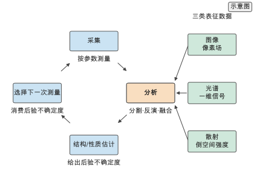
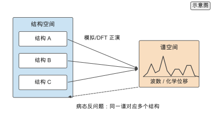
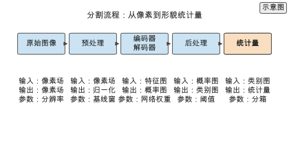
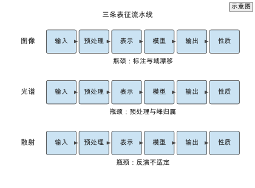
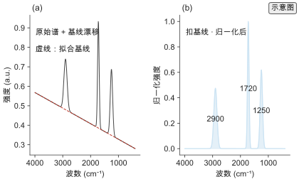
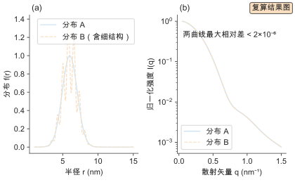
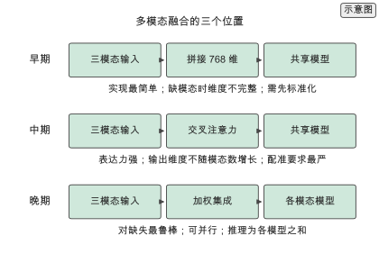
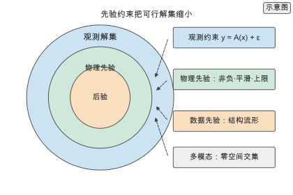
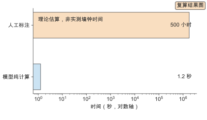

# 第 8 章 表征、成像与光谱的 AI 分析

一批共混物样品同时做了扫描电镜与红外光谱，需要判断相分离的形貌与两组分的相对含量。人工做法是在电镜图上逐张勾画相区、在光谱上逐个峰积分：一张图几十分钟，一条谱依赖经验，不同人给出不同的相区边界与基线。数据驱动做法把分割写成像素级分类、把谱–结构关系写成回归，先给出形貌统计量与组成估计，再把结果回填到下一次测量。

这一章沿图像、光谱与散射三条数据线，把测量到结构的映射统一成反问题，并核算分析吞吐与主动测量的收益。三类数据的共同点是高维、标签弱、噪声大，因此方法的价值不在单张图或单条谱的拟合精度，而在多表征融合与主动测量下能否用更少的测量次数达到同等不确定度。

表征 AI 分析的位置在计算与预测之后、闭环系统之前。它从实验测量反演结构信息：图像、光谱与散射给第 6、7 章的性质预测提供数据来源，也给第 13 章的闭环实验提供反馈信号。同一套反演方法既是上游数据的入口，也是下游闭环的出口，因此单独成章，放在"计算与预测"与"闭环系统"之间。

本章沿一条从数据到闭环的路线展开。8.1 定义三类表征数据，8.2 与 8.3 分别处理图像与光谱，8.4 收束到反推结构与多表征融合，8.5 交代自动化表征。8.6 至 8.8 把图像、光谱与散射各写成一条完整流水线——输入、预处理、表示、模型、输出与性质联系六段；8.9 展开多模态学习，8.10 把三条流水线统一到反问题与先验约束的视角，8.11 把表征放进闭环。8.12 回顾代表工作，8.13 用一次批量图像分析核算像素与推理代价，8.14 给出定量对比，8.15 与 8.16 给出实践流程与选型决策，8.17 汇总练习。做实验表征的读者可先读 8.1、8.10 与 8.11，再回到 8.6 至 8.8。

## 8.1 表征数据类型

表征数据按测量维度分成三类：图像是二维或多维像素场，光谱是一维或多维信号，散射与衍射是倒空间上的强度分布。三类数据都适合统一写成从观测到结构的反问题。读图 8-1 的闭环时，先确认闭环里哪一步消费了不确定度，再看反馈如何改变采集参数。

### 8.1.1 图像

图像数据来自扫描电镜、透射电镜、原子力显微镜与光学显微，形式为像素网格上的强度或相位。一张灰度图像是矩阵 $I\in\mathbb R^{H\times W}$，多通道图像加一维写成 $I\in\mathbb R^{H\times W\times C}$。图像任务分三类：分割给出每个像素的类别（相区、缺陷、纤维），检测给出目标的位置与尺寸，回归直接从图像预测统计量或性质。

一张 $1024\times1024$ 的单通道图含 $1.05\times10^{6}$ 个像素 `[复算]`，比同一区域的光谱采样点数（千级）高三个数量级。图像的难点在标注成本与类别不平衡：相区面积占比小时，逐像素交叉熵会被背景主导，需要用类频率倒数加权或区域损失。

### 8.1.2 光谱

光谱数据来自红外与拉曼振动光谱、核磁共振、质谱与紫外可见吸收，形式为波数、化学位移或质荷比上的一维强度。信息载体是峰位、峰强与线宽，它们分别对应官能团、浓度与有序度或动力学。振动光谱的定量关系由 Beer–Lambert 定律给出

$$A(\tilde\nu)=\varepsilon(\tilde\nu)\,c\,l,$$

$A$ 为吸光度、$\varepsilon$ 为摩尔吸光系数、$c$ 为浓度、$l$ 为光程 `[文献]`。相邻波数点的强度高度相关，共线使直接线性回归不稳定，需先降维或正则。

光谱的难点在基线漂移、噪声与峰重叠：预处理（基线校正、归一化、平滑）会显著影响下游结果，必须与模型一起记录为流程的一部分。同一条谱在不同基线下给出不同的峰面积，因此基线规则与模型参数同等重要。

### 8.1.3 散射与衍射

散射与衍射数据来自小角与广角 X 射线散射、X 射线衍射与中子散射，形式为散射矢量上的强度分布。散射矢量大小 $q=4\pi\sin\theta/\lambda$，Bragg 峰位给出晶面间距

$$d=\frac{2\pi}{q^{*}}=\frac{\lambda}{2\sin\theta},$$

Scherrer 公式把峰宽 $\beta$ 与晶粒尺寸 $L$ 联系，$L=K\lambda/(\beta\cos\theta)$，$K$ 为形状因子 `[文献]`。峰位对应周期结构（晶面间距、畴间距），峰形与强度对应尺寸分布与取向。

散射图谱是系综分布而非单个结构的快照，因此反推得到的是分布参数而不是唯一结构。这一点决定了散射反演通常必须给出分布与不确定度；在该类体系下，单点结构估计不足以支撑结论。

*图 8-1　表征与结构的闭环。以闭环画出采集、分析、结构或性质估计与下一次测量的流程，标出图像、光谱与散射三条输入汇入同一结构估计。（证据：示意）*

*图 8-2　谱–结构映射。双向箭头连接结构空间与谱空间：正向映射可由模拟或密度泛函计算生成，反向映射是多解的病态反问题，同一谱可能对应多个结构。（证据：示意）*

## 8.2 图像分析

图像分析把像素场映射为类别图或统计量，核心是分割与检测；在高分子表征中，它服务于形貌的定量描述。

### 8.2.1 分割与检测

语义分割为每个像素分配类别，实例分割再区分同类中的不同个体；检测输出目标的边界框或中心。编码器–解码器结构（如 U-Net）先下采样提取上下文、再上采样恢复分辨率：下采样 $s$ 倍使感受野扩大 $s$ 倍、分辨率下降 $s$ 倍，跳跃连接把同分辨率特征直连到解码器以恢复边界细节。

分割损失通常取逐像素交叉熵与区域重叠损失的组合

$$\mathcal L=\mathcal L_\text{CE}+\lambda\,\mathcal L_\text{Dice},\qquad \mathcal L_\text{Dice}=1-\frac{2\sum_i p_i y_i}{\sum_i p_i+\sum_i y_i},$$

Dice 项直接优化重叠度，对前景像素占比敏感，缓解类别不平衡。评测用重叠度

$$\mathrm{IoU}=\frac{|P\cap G|}{|P\cup G|},$$

$P$ 与 $G$ 分别为预测与真值区域 `[文献]`。检测在分割的基础上给出可计数的对象，两者常联合训练。

### 8.2.2 显微图像与形貌

形貌分析把分割结果转成统计量：相区体积分数 $f=V_\text{phase}/V$、弦长分布 $p(\ell)$、取向序参量

$$S=\frac{3\langle\cos^{2}\theta\rangle-1}{2}$$

与界面密度，$S=0$ 各向同性、$S=1$ 完全取向 `[文献]`。这些统计量比原始像素低维且可解释，既是结构–性能关系的输入，也是批次一致性的判据。

从分割到统计量的这一步必须固定阈值与后处理规则，否则同一张图在不同参数下给出不同结论。统计量定义反过来决定分割需要达到的精度：若目标只是相区体积分数，边界像素的小误差被面积平均掉；若目标是弦长分布，边界定位误差会直接进入分布。读图 8-3 时，应从统计量的定义反推分割需要达到的精度，而不是只看分割图是否好看。

*图 8-3　分割流程。以数据流画出原始图像、预处理、编码器–解码器、后处理到统计量的五步流程，标出每步的输入输出与可调参数。（证据：示意）*

批量表征的吞吐由两个量决定。人工处理 1000 张 $1024\times1024$ 图像需要 $1000\times30$ 分钟 `[示意]`，即 500 小时 `[复算]`；模型前向的总计算量为 $1000\times5\times10^{10}=5\times10^{13}$ 次浮点运算 `[复算]`。把浮点运算量除以第 6 章声明的 A100 峰值与 0.3 效率，得到约 0.5 秒的**理想算术下界** `[复算]`：这只回答「需要多少次浮点运算除以峰值算力」，未计入内存带宽、kernel launch、batch size、通信、I/O 与软件实现质量；本书未开展该套实测基准，真实运行时间受硬件、批大小与软件实现影响，需要读者在自己的硬件上实测。即便如此，人工与模型的吞吐仍相差数个数量级，收益不只在速度，还在于同一规则对全部图像给出一致结果。

> **练习 8-1〔核心〕：图像分割吞吐**
>
> 在 1000 张 $1024\times1024$ 图像、人工 30 分钟/张、模型前向 $5\times10^{10}$ FLOPs/张、GPU 峰值与效率取第 6 章声明值的设定下，比较人工标注与模型推理处理这批图像的吞吐与代价，核算从图像到形貌统计量的总时间，说明自动化在批量表征中的收益来自并行与一致性。
>
> 条件：需要运行本书配套仓库的 `calculations/` 复算模块（gnn-forward），参见 [gnn-forward-4layer](../calculations/results/gnn-forward-4layer.md)。

## 8.3 光谱分析

光谱分析从一维信号回归组成、结构或性质；不同谱种的信息不同，但都面临峰重叠与基线问题。

### 8.3.1 振动光谱

红外与拉曼振动光谱的峰位对应官能团与键的振动模式，峰强对应浓度，峰形对应有序度与相互作用。预处理先做基线校正与归一化，再用偏最小二乘或一维卷积网络建模。偏最小二乘把光谱矩阵 $X$ 与性质向量 $y$ 投影到少数潜变量上

$$X=TP^{\top}+E,\qquad y=Tq+f,$$

只用 $T$ 回归以抑制共线与噪声 `[文献]`；一维卷积网络直接在波数轴上滑动，自动学习峰形与峰重叠模式。预处理会改变 $X$，因此必须与模型一起固定。振动光谱适合快速、无损地估计组成与结晶度，定量精度受基体效应与峰重叠限制。

### 8.3.2 核磁与质谱

核磁共振的化学位移 $\delta$ 由局部电子屏蔽决定，对应原子所处的化学环境；积分面积 $I_k$ 正比于对应基团的核数 $n_k$，因此组成估计为 `[文献]`：

$$\hat c_k=\frac{I_k/n_k}{\sum_j I_j/n_j}$$。

质谱的质荷比对应分子量与碎片结构：母离子峰给出分子量，碎片峰给出结构片段。两者都能给出序列或端基信息，但高维峰重叠使人工解析困难。模型把谱到结构或组成的映射学成回归或分类，并用第 6 章的不确定度标记低置信样本。

### 8.3.3 谱–结构映射

把谱与结构的关系写成两个方向。正向映射 $\mathcal A:\mathcal X\to\mathcal Y$ 从结构到谱，可由密度泛函或经验模型批量生成；反向映射从谱到结构，是典型的病态反问题，同一谱可能对应多个结构。反向解写成后验

$$p(x\mid y)=\frac{p(y\mid x)\,p(x)}{\int p(y\mid x')p(x')\,\mathrm dx'},$$

似然 $p(y\mid x)$ 由正向模型加噪声给出，先验 $p(x)$ 来自第 4 章的物理关系与数据分布。同一 $y$ 下后验出现多个峰即多解，后验熵

$$H[x\mid y]=-\int p(x\mid y)\log p(x\mid y)\,\mathrm dx$$

度量多解程度 `[文献]`。可行的流程是先用正向模型造训练数据，再训练反演模型输出后验分布，用分布宽度表示多解，这与从结构预测溶解度参数的思路一致：先固定正向关系，再学反向映射，并把不确定度一并给出。[^hansen]

> **练习 8-2〔核心〕：光谱反演**
>
> 在 1000 条模拟光谱、20 维结构描述符、加入基线漂移与噪声、留出 20% 做外推的设定下，用正向模型生成模拟振动光谱，训练反演模型从谱预测结构描述符，比较直接回归与带不确定度的后验反演在误差与多解识别上的差别。
>
> 条件：需要运行本书配套仓库的 `calculations/` 复算模块（descriptor-budget），并查阅本书参考文献中的 ^\[74\]^。

## 8.4 从表征反推结构

表征分析的终点是从观测反推结构或性质；这是一个反问题，多表征融合是降低其病态性的主要手段。

### 8.4.1 反问题

反问题（inverse problem）指从观测 $y$ 求结构 $x$，满足 $y=\mathcal A(x)+\epsilon$，其中正向算子 $\mathcal A$ 可能不可逆或接近奇异。线性化后 $y=Ax+\epsilon$，最小二乘解的误差被 $A$ 的条件数 $\kappa(A)$ 放大，

$$\frac{\|\delta x\|}{\|x\|}\le\kappa(A)\frac{\|\delta y\|}{\|y\|},$$

$\kappa(A)$ 大即病态 `[文献]`。病态性表现为小的观测噪声被放大成大的结构误差，以及多个 $x$ 给出同一 $y$。

处理方式有三条：加入正则项约束解的先验、用贝叶斯方法给出后验分布而非单点、以及增加观测数量。Tikhonov 正则

$$\hat x=\arg\min_x\|Ax-y\|^{2}+\lambda\|x\|^{2}=(A^{\top}A+\lambda I)^{-1}A^{\top}y$$

用先验抑制噪声放大；贝叶斯方法进一步给出后验分布，把反问题写成 $p(x\mid y)\propto p(y\mid x)\,p(x)$，先验 $p(x)$ 由第 4 章的物理关系与数据分布提供，后验宽度就是结构估计的不确定度。

### 8.4.2 多表征融合

不同表征测量结构的不同侧面：图像给形貌与相区、振动光谱给化学组成、散射给周期与取向。融合有三种粒度：早期把特征拼接 `[文献]`，融合维度为各模态维度之和

$$d=d_1+d_2+d_3;$$

中期用交叉注意力让一种表征查询另一种，让模态 $a$ 作查询、模态 $b$ 作键值，输出维度与查询一致，不随模态数增长；后期对各模态的输出加权集成。

融合降低反问题多解性的原因是各模态的零空间不同，联合约束把可行解集从各自零空间的交集缩小。融合的前提是配准与统一坐标，否则不同模态指向不同样品区域，融合反而引入错误。

> **练习 8-3〔核心〕：多表征融合**
>
> 在图像、振动光谱与散射三模态、每组样品三种表征配准、按样品批次分组划分的设定下，比较单一表征与三模态融合反推结构参数的误差与不确定度，对比早期拼接与交叉注意力两种融合，检验融合能否缩小反问题的可行解集。
>
> 条件：需要运行本书配套仓库的 `calculations/` 复算模块（descriptor-budget），并查阅本书参考文献中的 ^\[18\]^。

## 8.5 自动化表征

当分析与采集连成闭环，模型不再只是事后处理，而是决定下一次测量测哪里、测多久。

### 8.5.1 采集与分析的耦合

在线分析把模型接到采集设备后面，实时给出结构或性质估计，并用估计结果调整采集参数（曝光时间、扫描区域、波数范围）。耦合的前提是推理延迟低于采集节拍：

$$t_\text{inf}<t_\text{acq},$$

否则采集等待分析 `[文献]`。设单张推理 FLOPs 为 $F$、设备峰值 $P$、效率 $\eta$，则 $t_\text{inf}=F/(\eta P)$。当 $t_\text{inf}>t_\text{acq}$ 时需压缩模型、降采样或在边缘设备上推理。采集与分析共用一套元数据，才能把结果追溯到原始测量条件。

### 8.5.2 主动测量

主动测量（active measurement）用当前后验的不确定度选择下一个测量点或区域，优先测量能最大程度降低不确定度的位置：

$$x^{*}=\arg\max_x\ \mathbb E_{y\mid x}\big[H[x\mid \mathcal D]-H[x\mid \mathcal D\cup\{(x,y)\}]\big],$$

即最大化后验熵的期望下降 `[文献]`。其准则与第 11 章的采集函数同源：在信息增益与测量代价之间权衡。对空间不均匀样品，主动测量把有限扫描时间集中在信息量高的区域；对多解样品，它选择能区分候选结构的表征。

## 8.6 图像分割流水线：从像素到形貌性质

图像分析的价值不在分割图本身，而在它能否把像素稳定地变成下游可用的形貌量。把这条路径写成六段流水线：输入、预处理、表示、模型、输出与性质联系，每一段都有必须固定的参数。两张分割图看起来一样，若预处理与阈值不同，统计量可以差十几个百分点。图 8-4 把三条流水线并排；读图时先定位瓶颈所在段，再选方法。

### 8.6.1 输入与预处理

输入是像素场 $I\in\mathbb R^{H\times W\times C}$，扫描电镜与透射电镜多为单通道 $C=1$，能谱或彩色叠加图 $C>1$。预处理至少四步：灰度归一化、去噪、平场校正与拼接配准。归一化用分位数（例如第 1 与第 99 百分位）而不是全局最小最大值：单个亮斑会把最大值抬高，使整张图被压暗。去噪可用高斯或中值滤波，也可用学习式恢复网络，内容感知恢复在低信噪比荧光与电镜数据上把曝光时间降一到两个数量级 `[文献]`。[^care]

预处理的每一步都改变像素值，因此必须与模型一起固定并记录。同一批图用两种归一化得到两个像素分布，模型在不同分布上给出不同的分割边界，统计量随之变化。工程做法是把预处理写成显式函数，参数（分位数、滤波核大小、平场参考图）随流程一起版本化，而不是留在脚本的默认值里。

一张 $1024\times1024$ 单通道图含 $1.05\times10^{6}$ 个像素，按 float32 存是 $4.19$ MB，一千张是 $4.19$ GB `[复算]`。下采样 2 倍到 $512\times512$ 把像素数降到四分之一，代价是边界定位误差按同样比例放大；当目标只是相区体积分数时这个代价通常可以接受，当目标是弦长分布时则难以接受。输入规模决定后续每一步的显存与吞吐，预处理的分辨率选择因此是流水线的第一个决定。

### 8.6.2 表示与模型

分割把像素映射为类别图。编码器逐级下采样提取上下文，解码器逐级上采样恢复分辨率，跳跃连接把同分辨率特征直连到解码器以恢复边界细节，这一结构在 U-Net 中定型 `[文献]`。[^unet] 下采样 $s$ 倍使感受野扩大 $s$ 倍、分辨率下降 $s$ 倍；空洞卷积用膨胀率在不降分辨率的前提下扩大感受野，适合细长与稀疏结构 `[文献]`。[^deeplab] 需要区分类内不同个体时用实例分割，Mask R-CNN 在检测框上增加掩码分支 `[文献]`；[^maskrcnn] 可提示分割把类别先验换成点、框或文本提示，用一次前向给出候选掩码，适合类别未预先定义的探索性数据 `[文献]`。[^sam]

损失与评测决定模型学到什么。损失取逐像素交叉熵与 Dice 的组合，Dice 项直接优化重叠度、缓解背景主导；评测除 IoU 外还要看边界指标，因为细长结构上像素级 IoU 对边界不敏感。IoU 与 Dice（即 F1）一一对应

$$\mathrm{F1}=\frac{2\,\mathrm{IoU}}{1+\mathrm{IoU}},$$

$\mathrm{IoU}=0.5$ 对应 F1 $0.67$，$\mathrm{IoU}=0.9$ 对应 F1 $0.95$ `[复算]`。两相占比悬殊时，IoU 会被背景像素抬高，需要按类别分别报，或改用对前景加权的指标。分割精度的要求由下游统计量反推：体积分数对边界误差不敏感，弦长分布与界面密度敏感，同一个模型对前者够用、对后者不够。

> **ML Box　域漂移为什么让分割 IoU 掉点**
>
> 分割模型学的是像素到类别的映射，这个映射依赖成像条件：加速电压、探测器增益、样品倾角、镀膜厚度都会改变对比度与噪声分布。在一台仪器上训练的模型，换到另一台仪器后输入分布发生偏移，边界处最不稳定，IoU 可以掉 20 到 30 个点 `[示意]`。这与第 3 章的划分问题同源：训练集与部署集不满足独立同分布。诊断办法是留出一整台仪器的数据做域外测试，报告域内与域外两组 IoU；缓解办法包括强度直方图匹配、对抗域适应与在目标域上微调少量标注 `[文献]`。[^domainada]

### 8.6.3 形貌描述符与性质联系

分割结果先转成统计量再进入性质模型。两相体系的常用描述符：相区体积分数 $f$、弦长分布 $p(\ell)$、取向序参量

$$S=\frac{3\langle\cos^{2}\theta\rangle-1}{2},$$

与界面密度。对统计各向同性的两相结构，界面密度与相的平均弦长 $\bar\ell$ 通过立体学关系联系

$$S_V=\frac{4f}{\bar\ell},$$

$S_V$ 为单位体积界面面积 `[文献]`。弦长分布比体积分数携带更多信息：两个体积分数相同、弦长分布不同的结构，一个相区细小分散、一个相区粗大连通，力学与输运行为完全不同。相区尺寸用面积等效直径 $d=2\sqrt{A/\pi}$ 从每个连通域算，取分布而不是均值。

统计量与性质的联系决定分割需要多准。若目标只是体积分数，边界像素的误差在面积平均中被抵消，分割只要无系统偏置；若目标是弦长分布或界面密度，边界定位误差直接进入分布，$\pm1$ 像素的边界抖动在 $1024$ 图上相当于 $0.1\%$ 的弦长偏置 `[复算]`，在细相区上放大成几个百分点的分布偏移。相区尺寸与性质的联系在多个方向成立：畴尺寸与波长可比时控制光学散射，相区连通性控制渗透与电导，界面面积与界面强度控制增韧与断裂。把统计量接回第 4 章的结构–性能关系，图像分析才闭合。

### 8.6.4 标注成本与域漂移

逐像素标注是这条流水线最贵的环节。人工勾画一张 $1024\times1024$ 图约 30 分钟 `[示意]`，一千张即 500 小时 `[复算]`；半自动流程先用模型给出初稿、人工只修正边界，可把单张时间压到几分钟。主动学习选择信息量最大的图送标：在电镜分割上，主动选择少量图即可接近全量标注的精度 `[文献]`。[^emal] 标注策略决定模型上限，而标注规则本身也要固定——同一张图的相区边界在哪、孔隙算不算相区，不同标注者给出不同答案，这部分差异构成标签噪声。

域漂移是第二个瓶颈，且比标注更隐蔽。同一实验室不同批次、不同实验室之间的成像条件不同，训练分布与部署分布不一致，模型在新域上退化。缓解手段分三类：输入侧的直方图匹配与风格归一化；特征侧的对抗对齐与域不变表示；输出侧的目标域少量微调。三类手段都要求目标域有至少少量标注或无标注数据，纯粹零样本的跨域分割仍不可靠 `[文献]`。[^domainada] 报告分割结果时必须写明训练域与测试域的仪器与参数，只报一个域内 IoU 不足以说明可用性。

> **失败 Box　把预处理伪影当成结构**
>
> 一张电镜图经直方图均衡后出现环状条纹，模型把条纹当成相区边界，弦长分布多出一个虚假峰。根因是均衡把背景噪声放大成结构，模型学到的是预处理伪影而不是材料形貌。同类失败还有：拼接图的重叠区被算成高密度相区；去噪过度抹平细相区，使体积分数偏低。诊断办法是把预处理关掉重跑一次，比较统计量的变化；若统计量对预处理敏感，说明伪影进入了结论。预处理不是中性操作，它参与定义模型看到的结构。

*图 8-4　三条表征流水线。图像、光谱与散射三条数据线按「输入 → 预处理 → 表示 → 模型 → 输出 → 性质」六段并排，三者的瓶颈不同：图像在标注与域漂移，光谱在预处理与峰归属，散射在反演的不适定性。（证据：示意）*

## 8.7 光谱分析流水线：从谱到组成

光谱分析把一维信号映射为组成或结构参数。与图像不同，光谱的维度低、标注相对便宜，但信号对预处理高度敏感：同一条谱在不同基线下给出不同的峰面积，进而给出不同的组成估计。把这条路径同样写成六段流水线，重点在预处理与峰表示。

### 8.7.1 输入与预处理

输入是波数、化学位移或质荷比网格上的一维强度，长度 $N$ 在 $10^{3}$ 到 $4\times10^{3}$ 点之间。预处理三步固定顺序：基线校正、归一化、峰对齐。基线校正用非对称最小二乘，目标函数

$$\min_{z}\ \sum_i w_i\,(x_i-z_i)^{2}+\lambda\sum_i(\Delta^{2}z_i)^{2},$$

$x$ 为观测谱、$z$ 为基线、$\Delta^{2}$ 为二阶差分、$\lambda$ 控制基线平滑度 `[文献]`。$w_i$ 在峰区取小权重，使基线不被峰拉高。归一化把谱缩放到统一尺度，可选向量范数、总面积或内标峰；三种基准给出不同的峰强，必须固定。峰对齐消除仪器与样品的峰位漂移，用相关优化或分段线性弯曲把同种峰对齐到同一波数。

三步的顺序不能交换（图 8-5）：先归一化再扣基线，会把基线的面积算进归一化因子；先对齐再扣基线，会让不同峰的基线不一致。参数在训练集上选定后固定，不随测试样本调整。预处理改变的是整条谱，不是单点，因此它对下游模型的影响大于模型结构的影响：同一份数据换基线参数，PLS 的潜变量数、卷积网络的卷积核、峰表的峰面积都会变。把预处理的每一步与参数写进流程记录，是光谱分析可复现的前提。

*图 8-5　光谱预处理的固定顺序。(a) 原始谱与拟合基线；(b) 扣基线并归一化后的谱，标出主要峰位。三步（基线校正、归一化、峰对齐）顺序固定，参数在训练集上选定后不变；曲线为声明峰形与基线参数的示意数据。（证据：示意）*

### 8.7.2 表示与模型

表示分两路。峰表把每条谱压缩成一组峰参数：峰位 $\tilde\nu_k$、峰高、峰宽与面积，峰形用 Gaussian、Lorentzian 或 Voigt 拟合。峰重叠时用非线性最小二乘或去卷积分离，重叠程度用峰间距与半高全宽之比衡量：间距小于半高全宽的两个峰通常难以唯一分离。全谱表示保留全部点，用偏最小二乘、一维卷积网络或 Transformer 建模。偏最小二乘把光谱矩阵投影到少数潜变量上

$$X=TP^{\top}+E,\qquad y=Tq+f,$$

只用 $T$ 回归以抑制共线与噪声；潜变量数由交叉验证定，取到测试误差不再下降为止。一维卷积网络直接在波数轴上滑动，卷积核尺寸要与峰宽匹配，核太小学不到峰形、核太大把多个峰混在一起。

两路表示各有适用条件。峰表维度低、可解释、样本效率高，适合目标峰明确、重叠不严重的体系；全谱保留重叠与基线信息，适合峰归属未知、需要模型自己找特征的体系。两路可以拼接：峰表给显式峰参数，全谱给残差与背景。数据量小时峰表更稳，数据量大时全谱更强，这与第 2 章表示选择的判据一致。

### 8.7.3 组成与性质联系

振动光谱的定量基础是 Beer–Lambert 定律 $A=\varepsilon c l$，多组分体系用多元曲线分辨或偏最小二乘同时估计各组分浓度。核磁用积分比估计组成

$$\hat c_k=\frac{I_k/n_k}{\sum_j I_j/n_j},$$

$I_k$ 为第 $k$ 组峰的积分面积、$n_k$ 为对应基团的核数。组成估计的相对误差约等于峰面积的相对误差：峰面积误差 $5\%$ 带来组成误差 $5\%$ `[示意]`。结晶度用结晶敏感峰与无定形峰的面积比估计，取向用偏振光谱的二向色性比估计，两者都依赖峰归属的正确性。

组成与统计量接回性质。共聚组成决定玻璃化转变温度与相容性，结晶度决定密度、模量与阻隔性，取向决定各向异性力学与热导。把光谱输出的组成与结晶度作为第 4 章结构–性能关系的输入，或直接作为第 6 章性质模型的中间表示，光谱分析就从测量走到了性质。反过来，性质模型需要的结构量决定光谱要测哪些峰、预处理要保留哪些信息，两者必须一起设计。

### 8.7.4 峰归属的不确定性

峰归属把峰位映射到官能团或振动模式，来源是经验相关表与密度泛函计算。归属不是唯一的：同一峰位可能对应多个官能团，峰重叠时多个模式叠加，计算与实验的峰位有系统性偏移。把归属写成硬标签会隐藏这种不确定性；正确做法是把归属写成后验分布，报告峰位与归属时给置信度。用正向模型生成训练数据、再训练反向映射，是处理归属不确定性的通用做法，核磁的结构–谱双向映射即属此类 `[文献]`。[^nmrrev] 拉曼深度学习模型的开放基准显示，不同模型在留出数据集上的表现差异明显，说明归属与定量对数据域敏感 `[文献]`。[^ramanbench]

峰归属的不确定性直接影响组成估计。若两个组分的特征峰重叠，用峰面积比估计组成会把两者混在一起；此时需要多变量方法或额外表征（如核磁与红外互补）来解耦。报告组成时必须说明用了哪些峰、归属置信度如何、重叠是否已分离。把归属当确定事实、把峰面积当准确值，是光谱定量最常见的错误。

> **实践 Box　光谱预处理的固定顺序**
>
> 一条可复用的振动光谱流水线是：读取原始谱并记录仪器与采样参数 → 截取有效波数区间 → 非对称最小二乘扣基线（固定 $\lambda$ 与权重规则）→ 归一化（固定基准，如面积或内标峰）→ 峰对齐（固定参考谱）→ 峰拟合或全谱输入。要点有三。第一，基线、归一化与对齐的参数在训练集上选定后固定，不随测试样本调整。第二，任何平滑或求导都在归一化之前完成，否则会改变归一化因子。第三，把参考谱与对齐参数一并存档，否则新样本无法对齐到同一坐标。练习 8-4 用同一条谱在三种基线下演示峰面积与组成估计的差异。

## 8.8 散射分析流水线：从倒空间到形貌

散射与衍射测量的是倒空间上的强度分布，反推的是实空间的结构分布。这条流水线的独特之处在于反演本身不适定：同一散射曲线可以对应多个尺寸分布或形貌，因此输出必须是分布与不确定度，而不是唯一结构。

### 8.8.1 输入与预处理

输入是散射矢量上的强度 $I(q)$。散射矢量 $q=4\pi\sin\theta/\lambda$，可及尺度由 $q$ 范围决定：$q$ 的下限给出最大可测尺寸

$$d_{\max}=\frac{2\pi}{q_{\min}},$$

$q_{\min}=0.01$ Å$^{-1}$ 对应 $d_{\max}=62.8$ nm `[复算]`。小角散射给纳米到百纳米尺度，广角散射给晶格尺度，两者常在同一样品上联合测量。预处理包括背景与容器扣除、绝对强度定标、探测器畸变校正与方位角平均：各向同性样品把二维图沿方位角平均成一维曲线，各向异性样品则保留方位角依赖以提取取向。

预处理的每一步都改变强度，进而改变反演结果。背景扣除不干净会在小 $q$ 区留下上翘，被误读为大的团聚体；绝对定标错误按常数缩放全部强度，影响体积分数估计但不影响尺寸。方位角平均假设各向同性，对取向样品会把取向信息平均掉。记录 $q$ 范围、定标标准与平均规则，是散射结果可比的条件。

### 8.8.2 潜结构表示与模型

正演关系把结构参数映射到散射曲线。稀疏颗粒体系的强度近似

$$I(q)\propto N\,(\Delta\rho)^{2}\,P(q)\,S(q),$$

$N$ 为颗粒数密度、$\Delta\rho$ 为电子密度差、$P(q)$ 为形状因子、$S(q)$ 为结构因子。形状因子由颗粒形状决定，球、柱、片各有解析式；结构因子描述颗粒间关联，稀溶液 $S(q)\approx1$。小 $q$ 区用 Guinier 近似提取回转半径

$$I(q)\approx I_0\exp\!\left(-\frac{q^{2}R_g^{2}}{3}\right),$$

中 $q$ 区的幂律斜率给出分形维数或片层取向。

反演有三条路线。参数化拟合假定形状与分布形式，只拟合少数参数，稳定但受模型假设限制；正则化反演把 $I(q)$ 离散成积分方程 $I(q)=\int K(q,r)f(r)\,\mathrm dr$，对分布 $f(r)$ 加平滑与非负约束求解；学习式反演用模拟生成的成对数据训练网络直接从 $I(q)$ 回归结构参数，速度快、可给后验，但外推到训练分布之外不可靠。模拟驱动的散射实验用机器学习加速参数搜索 `[文献]`，[^saxsml] 用 Kolmogorov–Arnold 网络做软材料的结构反演是较新的路线 `[文献]`。[^kanscatter]

### 8.8.3 散射反演的不适定性

不适定性来自核函数的平滑。积分方程的核 $K(q,r)$ 是连续函数，不同分布 $f(r)$ 经过积分后给出相近的 $I(q)$；把 $f(r)$ 离散成 $n$ 个尺寸分箱、$I(q)$ 采样 $m$ 个点时，$n$ 可以大于 $m$，方程欠定，且核矩阵的条件数随分箱数增加而迅速增大。在声明模型上可以量化这一点：给一个半径 6 nm、宽 1.5 nm 的尺寸分布叠加振幅 $40\%$、周期 0.8 nm 的细结构，两条散射曲线在 $q=0.05$ 至 $1.5$ nm$^{-1}$ 上的最大相对差只有 $2\times10^{-6}$ `[复算]`（图 8-6）。分布的形状变了，散射曲线几乎不变——这不是数据量不足，而是问题本身多解；因此反演输出应是分布与后验，而不是唯一解。

处理不适定性必须引入先验。物理先验包括非负、归一化、平滑、已知形状与尺寸上限；数据先验来自同类样品的分布知识；参数化把 $n$ 个分箱压到少数参数（如均值、标准差与峰数），把解限制在低维流形上。贝叶斯方法把先验与似然合成后验，后验宽度就是反演的不确定度，多峰后验直接暴露多解。报告散射反演时只给一条最佳拟合曲线不够，必须同时给分布的置信带，并说明先验是什么、对结果的影响有多大。

> **高分子物理 Box　为什么散射曲线看不到尺寸分布的细节**
>
> 散射强度是尺寸分布与形状因子的积分，权重是 $P(qr)\,r^{2}$。形状因子 $P(qr)$ 随 $qr$ 平滑变化，分布中周期远小于 $P$ 变化尺度的细结构在积分中被平均掉；散射对实空间的分辨率约为 $\pi/q_{\max}$，比这个尺度更细的分布特征不可见。小 $q$ 区只给出一个回转半径 $R_g$，中 $q$ 区给出幂律指数与特征尺寸，整条曲线携带的是分布的少数矩而不是全谱。这解释了为什么散射结果通常报 $R_g$、特征尺寸与分布参数，也解释了为什么反演必须依赖模型假设：实验本身对分布的高频部分没有分辨力，缺失的信息通常只能由先验补。

*图 8-6　散射反演的不适定性。(a) 分布 A 与叠加了振幅 $40\%$ 细结构（周期 0.8 nm）的分布 B；(b) 两者对应的归一化散射曲线在 $q=0.05$ 至 $1.5$ nm$^{-1}$ 上最大相对差只有 $2\times10^{-6}$，几乎完全重合。曲线由声明球状形状因子与尺寸分布复算，本书未开展束线实测基准。（证据：复算）*

## 8.9 多模态学习

单一表征只测量结构的一个侧面，多模态学习把化学、显微、光谱与加工信息联合起来预测性质。融合的收益与代价都由融合发生的位置决定。

### 8.9.1 融合位置：早期、中期与晚期

融合有三种粒度。早期融合把各模态特征拼接后送入同一个模型，融合维度为各模态维度之和

$$d=d_1+d_2+d_3,$$

三路 256 维得到 768 维 `[复算]`。实现简单，但要求各模态先标准化，且任一模态缺失时输入维度不完整。中期融合让模态在中间层交互，用交叉注意力让一种表征查询另一种：模态 $a$ 作查询、模态 $b$ 作键值，输出维度等于查询维度，不随模态数线性增长 `[文献]`。[^transformer] 晚期融合分别训练各模态模型，再按验证误差加权集成，容错性好、可并行，代价是推理要跑多个模型。

三者的取舍可以按四个维度排。实现难度：早期最低、晚期次之、中期最高。对缺失模态的鲁棒性：晚期最好（缺一路就少一个集成成员），中期次之，早期最差。对配准的要求：中期最严（注意力在模态间建立对应），早期与晚期较松。推理代价：早期最低（一次前向），中期含注意力项，晚期为各模型之和。选择融合位置先看推理预算与配准条件，再看精度。多模态对齐的通用做法是用配对数据学一个共享嵌入空间，让同一对象的图像与谱在嵌入中靠近、不同对象远离 `[文献]`。[^clip]

### 8.9.2 配准、缺失模态与对比对齐

融合的前提是配准：不同模态必须指向同一空间区域或同一样品状态。图像给局部形貌，光谱给平均化学，两者的空间分辨率不同；若不做配准就拼接，模型学到的是配准误差而不是结构–性质关系。配准分空间配准（同一视场）与样品配准（同一批次、同一状态），两者都要在元数据里写清。配准误差可以量化：用已知标记点或互相关估计配准残差，残差大于目标特征尺寸时融合没有意义。

缺失模态是常态而非例外。实际样品常只做了部分表征，若训练时要求所有模态齐全，可用样本被大幅削减；更稳的做法是训练时随机丢弃模态，让模型学会在部分模态下预测。无标签模态可以用自监督预训练提取表示，对比学习与掩码自编码在图像上验证了这种预训练的可扩展性 `[文献]`。[^simclr][^mae] 对比对齐进一步把不同模态映射到同一空间，使跨模态检索与缺失模态补全成为可能，配对变分自编码器用互补散射数据做互重建即属此类 `[文献]`。[^pairvae]

融合不是默认答案。若两个模态的信息高度重叠（都来自同一结构的不同投影），拼接增加维度而不增加信息，模型方差反而上升；通常只有当各模态的零空间不同、联合约束能缩小可行解集时，融合才降低误差下界。判断依据与 8.4.2 一致：先算各模态的单模态误差与相互独立性，再决定是否融合。

*图 8-7　多模态融合的三个位置。早期融合实现简单但对缺失与配准敏感，中期交叉注意力表达力强但要求配准，晚期集成容错但推理代价高。（证据：示意）*

## 8.10 反问题视角与先验约束

三条流水线在数学上是同一件事：从测量 $y$ 反演结构 $x$。把这条统一线索写清，才能判断一个方法在什么条件下有效。

### 8.10.1 从测量到结构的统一框架

图像分割、谱反演与散射反演都可以写成

$$y=\mathcal A(x)+\epsilon,$$

$\mathcal A$ 是正向算子、$\epsilon$ 是噪声。图像分割的 $x$ 是类别图、$\mathcal A$ 是成像与对比度形成；谱反演的 $x$ 是化学结构或组成、$\mathcal A$ 是振动或屏蔽模型；散射反演的 $x$ 是尺寸分布、$\mathcal A$ 是形状因子的积分。三者的差别在正向算子的性质：成像算子近似局部、谱算子近似线性、散射算子是平滑积分。算子越平滑，反演越不适定。线性化后误差被条件数放大

$$\frac{\|\delta x\|}{\|x\|}\le\kappa(\mathcal A)\frac{\|\delta y\|}{\|y\|},$$

$\kappa$ 大即病态；散射的积分核与谱的重叠峰都给出大的 $\kappa$，分割的局部算子 $\kappa$ 较小，因此分割比反演稳定。

### 8.10.2 先验的来源与注入方式

先验把不适定问题变成可解问题。先验有三类来源：物理先验（非负、归一化、单调、对称、尺寸上限、平滑）、数据先验（同类样品的分布、生成模型学到的结构流形）、结构先验（稀疏、低秩、分段常数）。注入方式也有三类：正则项、参数化与硬约束。Tikhonov 与全变差正则把先验写成罚项，参数化把高维结构压到低维参数，硬约束把不可行解直接排除。贝叶斯方法把先验写成 $p(x)$，与似然合成后验

$$p(x\mid y)\propto p(y\mid x)\,p(x),$$

后验宽度即不确定度，多峰后验即多解。

先验的强度要标定（图 8-8）。先验太弱，噪声被放大成伪结构；先验太强，真实结构被平滑掉。读图 8-8 时注意，不确定度来自剩余解集的大小，而不是单点估计的拟合残差。标定办法是留出已知结构的样品做对照，比较反演结果与真值。散射反演中把 $10^{2}$ 个尺寸分箱参数化成 3 个参数，是把解限制在低维流形上的典型做法 `[示意]`；代价是若真实分布不是该参数族，反演会给出系统性偏差。报告反演结果时必须写明先验的形式与强度，以及先验不成立时的退化方式。

*图 8-8　反问题的先验约束。观测 $y=\mathcal A(x)+\epsilon$ 给出一个解集，物理先验（非负、平滑）与数据先验（分布流形）把解集缩小，多模态观测进一步取零空间交集。（证据：示意）*

## 8.11 表征进入闭环

表征不只是事后分析，它是闭环实验的反馈信号。第 13 章的自驱动实验室把表征接在每一轮实验后面，用它的输出决定下一轮做什么。

### 8.11.1 表征作为反馈信号

闭环里的表征要满足两个时间条件。推理延迟低于采集节拍 $t_\text{inf}<t_\text{acq}$，否则采集等待分析；分析加决策的时间低于实验周期 $t_\text{inf}+t_\text{dec}<t_\text{cycle}$，否则闭环退化成离线批次。在线拉曼或红外给出实时的组成与转化率，在线显微给出形貌与粒径，两者都要求模型轻量、可增量更新。当推理慢于节拍时，用降采样、模型压缩或只在关键节点做全量分析。

反馈信号的质量决定闭环的效率。表征给出的不只是结构估计，还有它的不确定度；采集函数消费不确定度，把下一个测点放在后验方差最大的位置。扫描探针显微镜用高斯过程后验指导下一次扫描，比均匀网格更快收敛到目标结构 `[文献]`。[^spmal] 闭环的三个层次依次是：调采集参数（曝光、扫描范围、波数窗口）、调实验条件（温度、配比、时间）、做停止或转向决策。层次越高，对表征精度与延迟的要求越严。

### 8.11.2 与自驱动实验室的接口

表征与闭环的接口有三类。数据接口：统一元数据，记录仪器、参数、样品与时间，使测量可追溯、可复用，符合 FAIR 原则；在线模型要能消费这些字段并输出结构化结果。模型接口：在线模型要轻量、可增量更新，且能处理分布漂移——闭环会主动探索新区域，训练分布随之变化。不确定度接口：把后验不确定度传给采集函数，而不是只传点预测。自驱动实验室的综述把在线表征列为闭环的关键组件，材料发现中的闭环主动学习案例显示，反馈信号的信息量比实验通量更决定收敛速度 `[文献]`。[^sdlreview][^kusne] 表征方法与闭环系统的耦合方式，是第 13 章展开的主题。

## 8.12 代表性工作与里程碑

表征 AI 的进展沿三条数据线推进，每条都有从传统方法到学习方法的转折点。图像线从 U-Net 的编码器–解码器与跳跃连接开始 `[文献]`，[^unet] 空洞卷积把多尺度上下文引入分割 `[文献]`，[^deeplab] 实例分割把检测与掩码联合 `[文献]`，[^maskrcnn] 可提示分割用大规模预训练把分割从固定类别扩展到任意目标 `[文献]`。[^sam] 内容感知恢复用学习式去噪降低曝光需求 `[文献]`，[^care] 主动学习把标注预算集中在信息量大的图上 `[文献]`。[^emal] 聚合物共混的原子力显微图像分析把分割与形貌统计接在一起 `[文献]`。[^afmblend]

光谱线的转折点是把峰表拟合换成端到端学习。深度学习方法把拉曼高光谱成像的采集与分析连起来，实现高通量分子成像 `[文献]`；[^ramanimg] 开放基准把不同模型放在同一数据集上比较，暴露数据域对结论的影响 `[文献]`。[^ramanbench] 核磁方向用可逆网络同时学结构到谱与谱到结构两个方向，把归属的不确定性显式化 `[文献]`。[^nmrrev]

散射线的转折点是用模拟生成训练数据、用学习模型替代迭代拟合。模拟驱动的机器学习加速小角散射的参数搜索 `[文献]`，[^saxsml] Kolmogorov–Arnold 网络用于软材料的结构反演 `[文献]`，[^kanscatter] 配对变分自编码器把互补表征数据关联起来做互重建 `[文献]`。[^pairvae] 衍射方向用神经网络从图谱分类晶系，数据增强缓解小样本 `[文献]`。[^xrdcnn][^xrdaug]

> **论文 Box　用模拟数据训练散射反演模型**
>
> 小角散射的实验测量昂贵，一个样品的一条曲线需要数小时束线时间，标注结构又依赖拟合假设。可行的替代是用正向模型批量生成成对数据：给定形状、尺寸分布与噪声，用形状因子算出 $I(q)$，训练网络从 $I(q)$ 回归结构参数 `[文献]`。[^saxsml] 这条路线把「实验测一条曲线」换成「模拟生成一批曲线」，使训练规模提高几个数量级，代价是训练分布与真实体系的差距——正向模型没写的结构（多级团聚、取向、界面粗糙）网络也学不到。做法上要记录三件事：正向模型的形式与参数范围、噪声模型、留出体系（训练分布之外的真实样品）。前两件决定网络在分布内的精度，第三件决定它能否外推。

## 8.13 Worked example：图像像素与推理代价核算

用一次批量表征任务核算这条流水线的代价。任务设定、数字来源与边界都写清：标 `[复算]` 的是由声明模型与声明吞吐算出的**理想算术下界**，只把浮点运算量除以峰值算力，未计入内存带宽、kernel launch、batch size、通信、I/O 与软件实现质量，不是实测墙钟时间；本书未开展该套实测基准，真实运行时间受硬件、批大小与软件实现影响，需要读者在自己的硬件上实测。

### 8.13.1 任务与设定

任务：对 1000 张 $1024\times1024$ 的扫描电镜图做相区分割，把每个相区的形貌描述符输入性质模型，得到整批材料的性质估计。人工做法是逐张勾画相区并读统计量；自动做法是分割模型加性质模型。参数取第 6 章声明的设备与效率：A100 峰值 $3.12\times10^{14}$ FLOP/s、效率 0.3，有效算力 $9.36\times10^{13}$ FLOP/s `[复算]`。分割模型前向取 $5\times10^{10}$ FLOPs/张（声明值），性质模型用第 2 章复算的 4 层、隐藏 256 图网络，单对象前向 $3.27\times10^{8}$ FLOPs `[复算]`。[^gnn]

### 8.13.2 像素、存储与推理代价

一张图含 $1024^{2}=1.05\times10^{6}$ 像素，1000 张共 $1.05\times10^{9}$ 像素 `[复算]`。按 float32 单通道存，每张 $4.19$ MB，整批 $4.19$ GB `[复算]`；这还只是原始像素，不含特征图与中间激活。分割前向总量

$$1000\times5\times10^{10}=5\times10^{13}\ \text{FLOPs},$$

在 $9.36\times10^{13}$ FLOP/s 下折合 $0.53$ s 的理想算术下界，单张 $0.53$ ms `[复算]`；若每张图分割出 200 个相区，整批 $2\times10^{5}$ 个对象，性质模型总量 $2\times10^{5}\times3.27\times10^{8}=6.55\times10^{13}$ FLOPs，折合 $0.70$ s `[复算]`；两段合计约 $1.2$ s 的理想算术下界 `[复算]`。这些数字只回答「需要多少次浮点运算除以峰值算力」，不回答「实际跑多久」。

人工对照：逐张勾画 30 分钟，1000 张是 $500$ 小时 `[复算]`。两者相差约 $1.5\times10^{6}$ 倍 `[复算]`。这个比值是理论上的计算量比，不是墙钟时间比：实际吞吐受内存带宽、kernel launch、batch size、数据读取、预处理、后处理、通信与显存管理限制，wall time 通常比理想算术下界高一到两个数量级 `[示意]`。把理想下界与实测分开写，是避免把「算得快」当成「跑得快」。

### 8.13.3 结论

三条结论。第一，像素数决定了流水线的规模：$10^{9}$ 量级的像素让存储与 I/O 成为和计算并列的瓶颈，不能只算 FLOPs。第二，推理代价低不等于流程便宜：标注、配准与验证仍占主要人力，自动化的收益首先来自一致性与可并行，而不是单张精度。第三，代价核算必须区分理想算术下界与实测值：前者给出下界，后者才是决策依据。

*图 8-9　Worked example 的代价对比。人工处理 1000 张图约 500 小时（按 30 分钟/张的假设），分割与性质模型的理想算术下界合计约 1.2 秒，相差约 $1.5\times10^{6}$ 倍；实际墙钟时间受内存带宽、kernel launch、batch size、通信、I/O 与后处理限制，通常高出一到两个数量级。数值来自声明模型与声明吞吐；本书未开展该套实测基准，真实运行时间需在目标硬件上实测。（证据：复算）*

## 8.14 表征方法的定量对比

### 8.14.1 三条流水线对比

| 流水线 | 输入规模 | 表示 | 评价指标 | 主要瓶颈 |
| --- | --- | --- | --- | --- |
| 图像 | $1.05\times10^{6}$ 像素/张 | 类别图、形貌统计量 | IoU、Dice、边界 F1 | 标注、域漂移 |
| 光谱 | $10^{3}$ 点/条 | 峰表、潜变量、全谱 | 峰面积误差、RMSE | 预处理、峰归属 |
| 散射 | $10^{2}$ 至 $10^{3}$ 点/条 | 尺寸分布、参数 | 分布距离、参数误差 | 不适定、先验 |

三条流水线的瓶颈不同，方法的可迁移性也不同。图像方法成熟、工具多，瓶颈在数据；光谱方法介于两者之间，瓶颈在预处理与归属；散射方法最依赖物理先验，瓶颈在问题本身的不适定性。选方法前先定位瓶颈，把预算放在瓶颈段，而不是在非瓶颈段换更大的模型。

### 8.14.2 本书未覆盖的基准

以下项目本书未开展实测基准，读者不应把声明模型的结果当成实测：分割模型在真实电镜数据上的 IoU 与域漂移幅度；光谱预处理的基线参数对组成估计的定量影响；散射反演的条件数与后验宽度；多模态融合相对单模态的实际误差下降；在线分析的实际推理延迟与节拍匹配。这些空白需要真实数据与设备，补齐做法是固定划分、固定指标，对每种方法各跑一次，报告误差与不确定度。

## 8.15 从测量到结构的实践流程

### 8.15.1 六段流水线检查表

把一条表征流水线写成六段，每段都有必填记录。输入：仪器型号、采集参数、标定标准、样品状态。预处理：每一步的函数、参数与顺序。表示：峰表或全谱、分割图或统计量、散射分布或参数。模型：基线、主模型、损失与评价指标。输出：统计量或分布，附不确定度。性质联系：把输出接到哪个性质模型、需要哪些额外字段。六段中任何一段的假设不成立，结论都不成立。

流程的常见断点有三处。第一处在预处理与表示之间：预处理改了但表示没跟着改，峰表与全谱的输入分布不一致。第二处在输出与性质之间：统计量定义了但性质模型需要的是另一个量，例如分割给了体积分数而性质模型要的是弦长分布。第三处在域外部署：训练域与部署域的仪器不同，模型退化。把这三处写成检查项，可以在流程早期发现不匹配。

### 8.15.2 复现清单

> **可复现 Box　表征流水线的数据、代码、环境与种子**
>
> 一条表征流水线要能被复现，需要记录四类信息。数据：原始文件与校验值、仪器与采集参数、标定标准、样品状态、缺失模态。代码：预处理函数与参数、表示生成、模型与超参搜索范围、评价脚本；反演与融合方法要记录正向模型与配准算法。环境：软件与关键库版本、随机种子（划分、初始化、采样各一个）、硬件与效率假设。结果：每个阶段的中间输出（预处理后的谱、分割图、峰表、后验分布）与最终指标，以及不确定度。缺少中间输出，无法判断误差来自哪一段。本书的对应记录在 `calculations/results/` 与各章实验目录。

## 8.16 表征方法选型决策指南

### 8.16.1 决策路径

按下面的顺序走。第一步，写清任务需要的结构量：形貌、组成、结晶度、尺寸分布还是取向。第二步，判断该量的正向算子性质：局部、线性还是平滑积分；平滑积分的问题必须配先验。第三步，按 8.14 的对比选数据线，并按瓶颈排预算。第四步，选择表示与模型：样本少用峰表或参数化，样本多用全谱或端到端。第五步，决定是否融合：通常只有各模态零空间不同且已配准时才值得融合。第六步，固定预处理、划分与指标，报告不确定度。

出现下面三种信号时要重新审视流水线：误差在换更大模型后不再下降（表示或标签锁死了下界）；误差在不同仪器或批次间波动很大（域漂移）；反演结果对先验强度敏感（先验标定不足）。三种信号对应不同的修法：第一种补标注或换表示，第二种做域适应或目标域微调，第三种用已知结构标定先验。

### 8.16.2 任务—方法对照

| 任务 | 数据条件 | 首选表示 | 首选方法 |
| --- | --- | --- | --- |
| 相区分割与形貌 | 少量逐像素标注 | 类别图 | U-Net 加主动标注 |
| 组成与结晶度 | 峰归属已知 | 峰表 | 峰拟合加偏最小二乘 |
| 峰归属未知 | 大量谱、无标注 | 全谱 | 一维卷积或 Transformer |
| 尺寸分布 | 散射曲线 | 参数化分布 | 正则化或贝叶斯反演 |
| 多模态性质预测 | 配准的多表征 | 共享嵌入 | 中期融合加对比对齐 |
| 在线反馈 | 低延迟要求 | 轻量特征 | 增量模型加不确定度 |

表里的首选是默认起点。实际选型要把标注预算、推理延迟与先验可信度一起代入：标注预算只有几十张时，主动学习与半自动标注优先于换模型；推理延迟要求毫秒级时，端到端全谱模型被排除，改用峰表与线性模型；先验不可信时，参数化反演会让位给贝叶斯后验，把先验的影响显式暴露。

## 8.17 练习与实验清单

本章的练习与实验围绕「把测量变成结构」展开。核心练习 8-1 至 8-3 分别核算分割吞吐、光谱反演与多表征融合；延伸实验 8-4 至 8-7 把核算扩到预处理、峰归属、域漂移与散射反演。

| 编号 | 主题 | 类型 | 记录 |
| --- | --- | --- | --- |
| 8-1 | 图像分割吞吐 | 核心 | `gnn-forward-4layer` |
| 8-2 | 光谱反演 | 核心 | 在线扩写资料 8.7 |
| 8-3 | 多表征融合 | 核心 | 在线扩写资料 8.9 |
| 8-4 | 预处理对峰面积与组成的影响 | 延伸 | 在线扩写资料 8.7.1 |
| 8-5 | 峰归属不确定性 | 延伸 | 在线扩写资料 8.7.4 |
| 8-6 | 域漂移诊断 | 延伸 | 在线扩写资料 8.6.4 |
| 8-7 | 散射反演与先验 | 延伸 | 在线扩写资料 8.8.3 |

## 谬误与陷阱

**误区：分割图好看就说明流程可用。** 错误后果：下游用的是形貌统计量，不是分割图；阈值与后处理规则不固定时，同一张图给出不同统计量，结论随参数漂移。正确做法：从统计量的定义反推分割需要达到的精度，把阈值与后处理规则与结果一起固定和记录。

**误区：谱反演可以给出唯一结构。** 错误后果：反向映射是多解的病态反问题，同一谱可能对应多个结构；只给单点结构估计而不给后验分布，会把多解区误报成高置信预测。正确做法：输出后验分布，用后验宽度表示不确定度，多峰后验直接暴露多解。

**误区：多表征融合总能提升精度。** 错误后果：融合降低多解性的前提是各模态零空间不同且已配准；模态未配准时，融合把指向不同区域的观测拼在一起，反而引入错误，或只增加维度而不增加信息。正确做法：先算各模态的单模态误差与相互独立性，确认配准与统一坐标后再决定是否融合。

**误区：在线分析的瓶颈是模型精度。** 错误后果：采集与分析的耦合要求推理延迟低于采集节拍 $t_\text{inf}<t_\text{acq}$；精度再高，推理慢于采集节拍也只能离线运行，闭环退化成批次。正确做法：先核算推理延迟与采集节拍，必要时压缩模型、降采样或在边缘设备上推理。

**误区：预处理是无害的中间步骤。** 错误后果：基线、归一化与去噪都改变信号，峰面积与统计量随参数变化；预处理参数不固定、不随结果记录时，同一批数据给出不同结论。正确做法：把预处理当成流程的一部分，与模型一起固定和报告，并把每一步的参数版本化。

**误区：域漂移可以靠更强的模型解决。** 错误后果：域漂移是输入分布的改变，不是拟合能力不足；模型再强，训练域与部署域的对比度、噪声与标定不同，边界处仍会退化。正确做法：要么在输入侧对齐，要么在目标域上补少量标注做域适应或微调，换更大的模型不解决分布问题。

**误区：相关就代表因果。** 错误后果：表征量与性质的统计相关可能来自共同的加工条件或批次效应，而不是结构决定性质；用相关性声称机理，会选错材料或方向。正确做法：用相关性排序候选可以，用相关性声称机理不行；要判断因果需要干预实验或显式的因果假设 `[文献]`。[^causal]

本章数字沿用前言定义的六级证据标签（`[实验]`、`[公开实验数据]`、`[模拟]`、`[复算]`、`[文献]`、`[示意]`）。本章没有原始测量、公开数据集再分析或自跑模拟，因此正文只出现 `[复算]`、`[文献]` 与 `[示意]` 三级。凡是由「FLOPs 除以声明峰值吞吐」得到的秒、毫秒数字，一律是**理想算术下界（ideal arithmetic lower bound）**，标 `[复算]`，未计入内存带宽、kernel launch、batch size、通信、I/O 与软件实现质量；本书未开展该套实测基准，真实运行时间需在目标硬件上实测。

## 本章数字速查

| 量 | 数值 | 说明 | 证据 |
| --- | --- | --- | --- |
| 单张图像像素数 | $1.05\times10^{6}$ | $1024\times1024$，比光谱采样点数高三个数量级 | 复算 |
| 人工处理 1000 张图 | 500 小时 | 30 分钟/张 | 复算 |
| 模型前向总量 | $5\times10^{13}$ FLOPs | 1000 张、$5\times10^{10}$ FLOPs/张 | 复算 |
| 理想算术下界（前向） | 约 0.5 秒 | A100 峰值×0.3；仅浮点运算量，未计内存带宽等 | 复算 |
| Beer–Lambert | $A=\varepsilon c l$ | 吸光度、吸光系数、浓度、光程 | 文献 |
| Bragg 间距 | $d=\lambda/(2\sin\theta)$ | 峰位对应周期结构 | 文献 |
| Scherrer | $L=K\lambda/(\beta\cos\theta)$ | 峰宽对应晶粒尺寸 | 文献 |
| 取向序参量 | $S=(3\langle\cos^{2}\theta\rangle-1)/2$ | $S=0$ 各向同性 | 文献 |
| 组成估计 | $\hat c_k=(I_k/n_k)/\sum_j(I_j/n_j)$ | 核磁积分 | 文献 |
| 病态放大 | $\kappa(A)$ | 条件数 | 文献 |
| 融合维度 | $d=d_1+d_2+d_3$ | 早期拼接 | 文献 |
| 在线分析条件 | $t_\text{inf}=F/(\eta P)<t_\text{acq}$ | 推理快于采集节拍 | 文献 |
| 单张图像存储 | $4.19$ MB | $1024^{2}$、float32 单通道 | 复算 |
| 1000 张图像像素 | $1.05\times10^{9}$ | $1000\times1024^{2}$ | 复算 |
| 有效算力 | $9.36\times10^{13}$ FLOP/s | A100 峰值 $3.12\times10^{14}$、效率 0.3 | 复算 |
| 分割理想算术下界 | $0.53$ s | 1000 张、$5\times10^{10}$ FLOPs/张 | 复算 |
| 性质模型理想算术下界 | $0.70$ s | $2\times10^{5}$ 对象、$3.27\times10^{8}$ FLOPs/对象 | 复算 |
| 两段合计理想算术下界 | 约 $1.2$ s | 未计内存带宽、kernel launch、batch size、通信、I/O；本书未开展该基准 | 复算 |
| 自动化加速比 | $1.5\times10^{6}$ | 人工 500 小时对 1.2 秒理想算术下界 | 复算 |
| IoU 与 F1 | $\mathrm{F1}=2\,\mathrm{IoU}/(1+\mathrm{IoU})$ | $0.5\to0.67$、$0.9\to0.95$ | 复算 |
| 界面密度 | $S_V=4f/\bar\ell$ | 两相各向同性结构 | 文献 |
| 散射最大可测尺寸 | $d_{\max}=2\pi/q_{\min}$ | $q_{\min}=0.01$ Å$^{-1}$ 对应 62.8 nm | 复算 |
| 早期融合维度 | 768 | 三路 256 维 | 复算 |

## 延伸阅读

- 结构处理与描述符：[RDKit 文档快照](../references/files/documents/rdkit-tools.html) 提供指纹与分子处理实现。
- 图像分割与检测：[U-Net](../references/files/papers/unet-2015.pdf)、[DeepLabv3+](../references/files/papers/deeplab-v3plus-2018.pdf)、[Mask R-CNN](../references/files/papers/mask-rcnn-2017.pdf) 与 [Segment Anything](../references/files/papers/segment-anything-2023.pdf)。
- 图像恢复、主动标注与聚合物图像：[Cryo-CARE](../references/files/papers/care-cryoem-2018.pdf)、[电镜分割的主动学习](../references/files/papers/em-active-learning-2019.pdf) 与 [共混物 AFM 分析](../references/files/papers/afm-polymer-blends-2024.pdf)。
- 振动与核磁谱：[拉曼高光谱成像](../references/files/papers/raman-imaging-2020.pdf)、[拉曼开放基准](../references/files/papers/raman-benchmark-2026.pdf) 与 [核磁结构–谱双向映射](../references/files/papers/nmr-reversible-2026.pdf)。
- 散射与衍射：[模拟驱动的小角散射](../references/files/papers/saxs-ml-2019.pdf)、[KAN 散射反演](../references/files/papers/scattering-inverse-kan-2024.pdf)、[配对变分自编码器](../references/files/papers/pairvae-2023.pdf) 与 [XRD 晶系分类](../references/files/papers/xrd-symmetry-cnn-2018.pdf)。
- 多模态与表示：[Transformer](../references/files/papers/transformer-2017.pdf)、[CLIP](../references/files/papers/clip-2021.pdf)、[SimCLR](../references/files/papers/simclr-2020.pdf) 与 [掩码自编码](../references/files/papers/mae-2022.pdf)。
- 域漂移与因果：[域适应导论](../references/files/papers/domain-adaptation-2019.pdf) 与 [因果可解释性](../references/files/papers/causal-interpretability-2020.pdf)。
- 主动测量与闭环：[扫描探针的贝叶斯主动学习](../references/files/papers/spm-active-learning-2022.pdf)、自驱动实验室综述 ^\[25\]^ 与 闭环主动学习 ^\[10\]^。
- 多性质平台与数据：Polymer Genome^\[18\]^ 给出多性质预测平台。
- 基准与划分：Tg 基准 ^\[63\]^。
- 结构–性质映射示例：Hansen 溶解度参数预测 ^\[74\]^。
- 领域趋势与证据范围：[WoS 调研报告](../research/2026-wos-survey/README.md) 说明表征与仪器主题在本语料中的证据强度。
- 复算与推导：反演与融合公式的推导见 [第 8 章在线扩写资料](../archive/outlines/extensions/08-表征成像与光谱的 AI 分析.md)，前向代价见 [gnn-forward-4layer](../calculations/results/gnn-forward-4layer.md)。

[^hansen]: Hansen 溶解度参数预测见 ^\[74\]^。

[^pgenome]: Polymer Genome 见 ^\[18\]^。

[^tg]: Tg 基准见 ^\[63\]^。

[^rdkit]: RDKit 的指纹与分子处理见 [文档快照](../references/files/documents/rdkit-tools.html)。

[^gnn]: 图网络前向与单张推理代价见 [gnn-forward-4layer](../calculations/results/gnn-forward-4layer.md) 与 [gnn-forward-sum](../calculations/results/gnn-forward-sum.md)。

[^gpml]: 高斯过程与后验不确定度的实现见 [Gaussian Processes for Machine Learning](../references/files/documents/gpml-2006.html)。

[^descbudget]: 表示维度与存储复算见 [descriptor-morgan-2048](../calculations/results/descriptor-morgan-2048.md) 与 [descriptor-mordred-1826](../calculations/results/descriptor-mordred-1826.md)。

[^wos]: Web of Science 检索导出与统计见 [WoS 调研报告](../research/2026-wos-survey/README.md)。

[^ext8]: 图像、光谱、散射、反问题与融合公式的推导见 [第 8 章在线扩写资料](../archive/outlines/extensions/08-表征成像与光谱的 AI 分析.md)。

[^calc]: 复算工具说明与全部子命令见 [calculations/README.md](../calculations/README.md)。

[^care]: 内容感知图像恢复见 [Cryo-CARE](../references/files/papers/care-cryoem-2018.pdf)。

[^unet]: U-Net 见 [归档全文](../references/files/papers/unet-2015.pdf)。

[^deeplab]: DeepLabv3+ 的空洞卷积见 [归档全文](../references/files/papers/deeplab-v3plus-2018.pdf)。

[^maskrcnn]: Mask R-CNN 见 [归档全文](../references/files/papers/mask-rcnn-2017.pdf)。

[^sam]: Segment Anything 见 [归档全文](../references/files/papers/segment-anything-2023.pdf)。

[^domainada]: 域适应与迁移学习见 [归档全文](../references/files/papers/domain-adaptation-2019.pdf)；划分对结论的影响另见 ^\[46\]^。

[^emal]: 电镜分割的主动标注见 [归档全文](../references/files/papers/em-active-learning-2019.pdf)。

[^nmrrev]: 核磁结构–谱双向映射见 [归档全文](../references/files/papers/nmr-reversible-2026.pdf)。

[^ramanbench]: 拉曼深度学习模型的开放基准见 [归档全文](../references/files/papers/raman-benchmark-2026.pdf)。

[^saxsml]: 模拟驱动的小角散射机器学习见 [归档全文](../references/files/papers/saxs-ml-2019.pdf)。

[^kanscatter]: 散射结构反演的 KAN 方法见 [归档全文](../references/files/papers/scattering-inverse-kan-2024.pdf)。

[^transformer]: 交叉注意力见 [Attention Is All You Need](../references/files/papers/transformer-2017.pdf)。

[^clip]: 图文对比对齐见 [CLIP](../references/files/papers/clip-2021.pdf)。

[^simclr]: 对比表示预训练见 [SimCLR](../references/files/papers/simclr-2020.pdf)。

[^mae]: 掩码自编码预训练见 [MAE](../references/files/papers/mae-2022.pdf)。

[^pairvae]: 互补表征数据的配对与互重建见 [PairVAE](../references/files/papers/pairvae-2023.pdf)。

[^spmal]: 扫描探针显微镜的贝叶斯主动测量见 [归档全文](../references/files/papers/spm-active-learning-2022.pdf)。

[^sdlreview]: 自驱动实验室综述见 ^\[25\]^。

[^kusne]: 闭环主动学习与实验回流见 ^\[10\]^。

[^afmblend]: 聚合物共混的 AFM 图像分析见 [归档全文](../references/files/papers/afm-polymer-blends-2024.pdf)。

[^ramanimg]: 拉曼高光谱成像的深度学习方法见 [归档全文](../references/files/papers/raman-imaging-2020.pdf)。

[^xrdcnn]: XRD 图谱的晶系分类见 [归档全文](../references/files/papers/xrd-symmetry-cnn-2018.pdf)。

[^xrdaug]: 小样本 XRD 的数据增强见 [归档全文](../references/files/papers/xrd-augment-2019.pdf)。

[^causal]: 相关与因果的区分见 [归档全文](../references/files/papers/causal-interpretability-2020.pdf)。

## 本章小结

表征 AI 的价值在于把测量到结构的映射显式化：分割与谱反演都是反问题 $y=\mathcal A(x)+\epsilon$，判断一个方法值不值得用，看它在多表征融合与主动测量下能否用更少的测量次数达到同等不确定度。

三类数据各有信息载体，也各有一条完整流水线。图像是高维像素场，流水线从预处理与编码器–解码器分割出发，把像素映射为相区，再用体积分数、弦长分布与取向序参量把结果降维到性质模型的输入；瓶颈在标注与域漂移。光谱的信息在峰位、峰强与线宽，流水线按基线校正、归一化、峰对齐固定预处理，再分峰表与全谱两路建模；振动光谱定量用 Beer–Lambert，核磁用积分比估计组成；瓶颈在预处理与峰归属。散射给出周期与尺寸分布，流水线从倒空间强度经形状因子与结构因子反推实空间分布；反演本身不适定，反推得到的是分布参数而非唯一结构。

反问题的病态性由条件数 $\kappa(\mathcal A)$ 度量，处理方式是正则、后验分布与增加观测。先验来自物理、数据与结构三类，通过正则项、参数化与硬约束注入；散射反演把上百个尺寸分箱参数化成少数参数，就是把解限制在低维流形上。多表征融合通过缩小零空间交集降低多解性，融合位置（早期拼接、中期交叉注意力、晚期集成）按实现难度、缺失鲁棒性与配准要求取舍，前提是配准与统一坐标。

表征还是闭环实验的反馈信号。自动化表征把分析接到采集后，要求推理延迟低于采集节拍 $t_\text{inf}<t_\text{acq}$，分析加决策低于实验周期 $t_\text{inf}+t_\text{dec}<t_\text{cycle}$；主动测量用后验不确定度选择下一个测点，与第 13 章的自驱动实验室共用同一套接口。Worked example 用 1000 张 $1024\times1024$ 图像核算：人工约 500 小时，分割与性质模型的理想算术下界合计约 1.2 秒，相差约 $1.5\times10^{6}$ 倍，但这是理想算术下界，不是实测墙钟（未计内存带宽、kernel launch、batch size、通信、I/O 与软件实现质量）。核心练习 8-1 至 8-3 分别核算分割吞吐、光谱反演与多表征融合，延伸实验 8-4 至 8-7 扩到预处理、峰归属、域漂移与散射反演。第 9 章转向与反演相反的方向：给定性质，生成结构。
