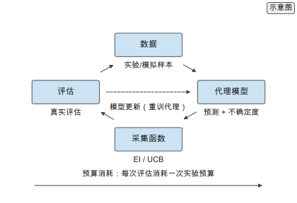
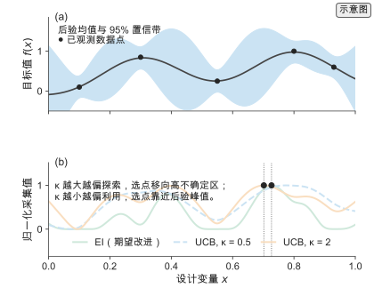
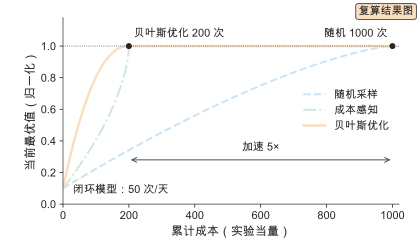
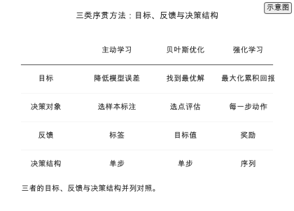
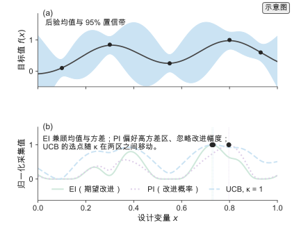
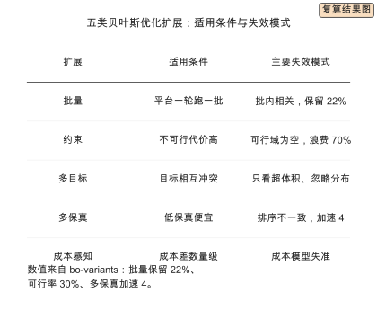
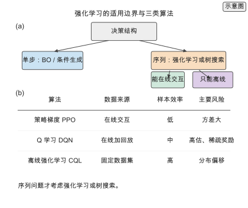
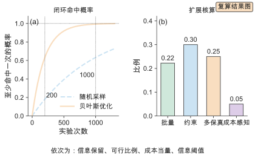
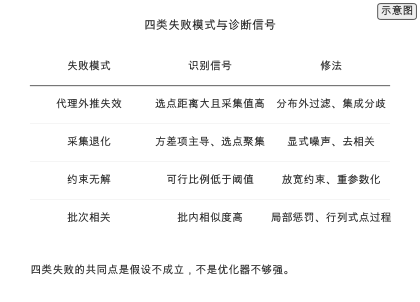

# 第 11 章 主动学习、贝叶斯优化与强化学习

只有 50 次实验[示意]，要从 $10^{6}$ 个候选[示意]中找到玻璃化转变温度最高、同时可加工的一批配方。随机采样在 $10^{6}$ 个候选里命中前 0.1%[示意] 的期望实验次数是 1000 次[复算]，预算远不够。序贯方法先用已有数据训练代理模型，再按采集函数（把代理模型的预测均值与不确定度组合成选点准则的函数）选择下一次实验，把每次测量结果用于更新模型与下一次选择。

这一章把材料设计写成序贯决策问题：贝叶斯优化处理连续或低维搜索，主动学习处理样本选择，强化学习处理序列生成，三者共享探索–利用的同一套语言。判断一个方法看相同预算下的收敛速度与最终命中率，以及它是否在边际收益低于成本时及时停止。

本章沿一条从目标到落地的路线展开。11.1 建立序贯决策视角；11.2 到 11.4 分别给出贝叶斯优化、主动学习与强化学习的标准形式；11.5 收束到成本与停止。11.6 把三者的目标并列，说明它们不能互换；11.7 展开采集函数的推导直觉与噪声下的退化；11.8 给出批次、约束、多目标、多保真与成本感知五类扩展，逐项列出适用条件与失效模式；11.9 划出强化学习的适用边界，比较策略梯度、Q 学习与离线强化学习；11.10 把停止准则写成可计算的判据，并说明加速比为什么只能是假设的 toy 场景；11.11 用 `calculations/results/` 的两个结果走一遍闭环样本效率与扩展核算；11.12 汇总四类失败模式与诊断信号。做闭环平台的读者可以沿 11.1 → 11.2 → 11.6 → 11.8 → 11.10 → 11.11 直接走通。

## 11.1 序贯决策视角

序贯决策把设计过程写成一系列"评估—更新—选择"的循环，每一次评估的代价与信息量不同，决策的目标是用有限预算换取最大的信息或最优解。

### 11.1.1 探索与利用

每一步要在探索（exploration，评估信息量大的点以改进模型）与利用（exploitation，评估当前预测最优的点以尽快命中）之间取舍。只用利用会陷入局部最优，只用探索会浪费预算。累积遗憾（regret）

$$R_{T}=\sum_{t=1}^{T}\big(f(x^*)-\max_{i\le t}f(x_{i})\big)$$

度量序贯策略相对事后最优的损失，$f(x^*)$ 为全局最优。随机采样的遗憾线性增长，好的序贯策略使 $R_{T}=O(\sqrt{T})$ 或更低。高分子设计中探索的代价是实验或计算时间，因此取舍必须显式计入成本。

遗憾界描述的是最坏情况，实际收益还取决于目标函数的结构。目标函数光滑、低维时，邻近点的信息可以外推到整片区域，序贯策略用很少的评估就能逼近最优；目标函数多峰、高维或含大量噪声时，外推失效，序贯策略退化为带记忆的随机搜索。判断任务是否适合序贯方法，先看这三条：评估是否昂贵、维度是否低、目标是否光滑。三条同时成立时序贯的收益最大，缺一条收益就下降。这个判据在 11.6.2 展开。

探索与利用的取舍还有一个常被忽略的维度：评估的**信息是共享的**。一次评估不仅给出该点的目标值，还通过代理模型的核函数影响邻近区域的预测。因此选点的价值等于它自身的改进期望加上它对模型其余部分的信息贡献。纯利用只看第一项，纯探索只看第二项，好的采集函数同时计入两项。这也是贝叶斯优化比随机搜索省样本的根本原因：随机搜索的每次评估只影响自己，序贯策略的每次评估影响一片。

### 11.1.2 代理模型

代理模型（surrogate model）是真实评估的廉价替代，同时给出预测与不确定度。高斯过程（用均值函数与核函数定义函数先验、同时给出预测均值与方差的回归模型）给出解析方差，树集成与深度集成给出样本方差，神经网络可用贝叶斯层或蒙特卡洛丢弃估计不确定度。序贯循环为：给定数据 $\mathcal D_{t}=\{(x_{i},y_{i})\}_{i\le t}$，训练代理 $\hat f_{t}$ 与不确定度 $\hat\sigma_{t}$，按采集函数选点

$$x_{t+1}=\arg\max_{x}\alpha\big(x;\hat f_{t},\hat\sigma_{t}\big),$$

评估 $y_{t+1}=f(x_{t+1})+\epsilon$，把新样本加入数据并重训。代理模型的误差与不确定度校准程度直接决定选点质量，校准用覆盖率检验：$\sigma$ 区间包含真值的频率应接近名义置信度。第 6 章的误差与不确定度实验是本章的前提。

代理模型的选择由样本量与评估代价共同决定。样本量千级以内、维度十几以内，高斯过程给出解析方差且样本效率最高；样本量上万或维度几十以上，高斯过程的 $O(N^{3})$ 训练代价与样本效率下降，改用深度集成或树集成；评估极便宜（代理模型预测几乎免费）时，代理模型的价值下降，直接随机搜索加筛选就够。代理模型不是越强越好，它要能与采集函数配合：采集函数需要的是**校准过的**不确定度，一个精度高但方差不可信的模型会让采集函数选错点。

*图 11-1　闭环优化。数据训练代理模型，采集函数在预测与不确定度之间选点，评估真实值后把结果写回数据，构成"评估—更新—选择"的回路。模型更新决定选点质量，预算消耗决定回路何时停止。（证据：示意）*

## 11.2 贝叶斯优化

贝叶斯优化（Bayesian optimization）用代理模型的后验（给定数据后对函数的更新分布）与采集函数在连续或低维空间上序贯搜索，适合评估昂贵、维度不高的设计问题。

### 11.2.1 高斯过程代理

高斯过程（Gaussian process）用均值函数与核函数定义函数先验，给定数据后的预测分布为

$$\mu(x^*)=k_*^{\top}(K+\sigma_{n}^{2}I)^{-1}\mathbf y,\qquad \sigma^{2}(x^*)=k(x^*,x^*)-k_*^{\top}(K+\sigma_{n}^{2}I)^{-1}k_*$$。

均值给出预测、方差给出不确定度，方差随远离训练点而增大。常用核为平方指数核 $k(x,x')=\exp(-\|x-x'\|^{2}/2\ell^{2})$，长度尺度 $\ell$ 由边缘似然优化。训练代价 $O(N^{3})$、预测 $O(N^{2})$[文献]，适合样本量千级的场景；样本量超过数千时改用稀疏变分或集成代理。对高分子，输入可以是描述符、潜变量或配方参数。[^gp]

> **练习 11-1〔核心〕：贝叶斯优化采样效率**
>
> 在相同实验预算下比较随机采样与贝叶斯优化找到目标性质的概率与所需实验次数，量化序贯决策相对随机搜索的收益随预算收紧的变化。候选空间 $10^{6}$，目标为前 0.1% 分位，预算 50 次实验，每次实验 50 次/天，代理为高斯过程。
>
> 条件：需要运行本书配套仓库的 `calculations/` 复算模块（closed-loop），参见 `closed-loop-bo` 结果，并查阅本书参考文献中的 ^\[123\]^。

随机采样首次命中的期望实验次数为 1000 次[复算]，贝叶斯优化在假设的加速比 5[示意] 下降为 200 次[复算]；预算越紧，序贯相对随机的优势越大。这个加速比 5 是场景假设[示意]，来自 [closed-loop-bo](../calculations/results/closed-loop-bo.md) 的场景声明，不是实测收益，也不是本书运行得到的对照。按每天 50 次实验[示意]计，日历时间从随机的 20 天[复算]降到 4 天[复算]。[^closedloop] 它衡量的是期望实验次数，不是每次实验的墙钟时间。

高斯过程还有一个工程前提常被忽略：核函数与长度尺度要匹配目标的物理尺度。对配方变量，长度尺度应反映"改变多少配方才会显著改变性质"；长度尺度取得太小，模型对训练点之间的区域过度自信，采集函数不去探索；取得太大，模型把不同区域平滑成一片，选点失去分辨力。长度尺度可以按目标的已知物理尺度初始化，再用边缘似然微调；把长度尺度与训练数据范围一起报告，是高斯过程代理可复现的最低要求。

### 11.2.2 采集函数

采集函数（acquisition function）把后验均值与方差组合成选点准则。期望改进（expected improvement，EI）计算相对当前最优的期望提升

$$\mathrm{EI}(x)=\mathbb E\big[\max(0,f(x)-f^+)\big],$$

$f^+$ 为当前最优。对高斯后验有闭式：令 $z=(\mu-f^+)/\sigma$，$\Phi,\phi$ 为标准正态分布函数与密度，

$$\mathrm{EI}(x)=\begin{cases}(\mu-f^+)\Phi(z)+\sigma\phi(z),&\sigma>0,\\ 0,&\sigma=0.\end{cases}$$

置信上界（upper confidence bound，UCB）取

$$\mathrm{UCB}(x)=\mu(x)+\kappa\,\sigma(x),$$

$\kappa$ 控制探索强度；改进概率（probability of improvement，PI）只算超过阈值的概率 $\mathrm{PI}(x)=\Phi\big((\mu-f^+)/\sigma\big)$。三者的探索程度不同，EI 自动在均值与方差之间平衡，是默认选择。[^bo]

*图 11-2　采集函数。(a) 高斯过程后验的均值曲线与 95% 置信带。(b) 归一化后的 EI 与两个 $\kappa$ 值的 UCB；EI 在均值与方差之间平衡，UCB 的 $\kappa$ 越大选点越偏探索、移向高不确定区，$\kappa$ 越小越偏利用、靠近后验峰值。（证据：示意）*

> **练习 11-2〔核心〕：采集函数对比**
>
> 在同一目标函数与同一初始数据上比较 EI、UCB 与改进概率三种采集函数的收敛曲线与最终最优值，说明探索强度对收敛速度的影响。初始 10 个随机点[示意]，预算 50 次[示意]，UCB 的 $\kappa$ 取 0.5 与 2 两档[示意]，5 个随机种子。
>
> 条件：需要运行本书配套仓库的 `calculations/` 复算模块（closed-loop），并查阅本书参考文献中的 ^\[192\]^。

小 $\kappa$ 收敛快但易早熟，大 $\kappa$ 初期探索多、后期追上；EI 在两类目标上表现均衡。探索强度不是越大越好，它由目标函数的光滑程度与噪声水平共同决定。11.7 展开三种采集函数的推导直觉与噪声下的行为。

## 11.3 主动学习

主动学习（active learning）从无标签候选池中选择最值得标注的样本，用尽量少的标注达到目标精度。

### 11.3.1 不确定性采样

最常用的准则是选预测不确定度最大的样本：分类用预测熵

$$H(x)=-\sum_{c} p(c\mid x)\log p(c\mid x),$$

回归用集成方差

$$\sigma_{\text{ens}}^{2}(x)=\frac{1}{M}\sum_{m=1}^{M}\big(\hat f_{m}(x)-\bar f(x)\big)^{2}$$。

不确定性采样等价于在特征空间稀疏区域补充数据，能快速降低模型方差。风险是异常点或标签噪声样本的不确定度也高，因此需要结合密度或代表性判据

$$\mathrm{score}(x)=\sigma(x)\cdot p_{\text{density}}(x)^{1/T},$$

$T$ 调节密度项强度，避免把预算花在离群样本上。

不确定性采样与贝叶斯优化的采集函数目标不同：前者要降低整个输入空间上的模型误差，后者只要找到最优值。两者的选点判据在目标函数光滑、最优值附近不确定度也高时一致，在模型需要在全局范围内可信时冲突。以模型为交付物（如要预测大批新候选）用主动学习的不确定性判据；以最优解为交付物用采集函数。混用会让预算流向与目标无关的区域。

### 11.3.2 批量与多样性

一次只选一个样本的循环在实验平台上不可行，需要批量选择。简单做法是取不确定度最高的 $B$ 个样本，但它们可能彼此相似，信息重复。改进方法在不确定性之外加入多样性。行列式点过程用相似度核 $L$ 的行列式衡量一批样本的多样性

$$\Pr(\mathcal S)\propto\det(L_{\mathcal S}),$$

在不确定度高的候选上做贪心最大行列式增量，可同时保证信息量与去相关。

> **练习 11-3〔核心〕：批量采样**
>
> 比较单点贪心、批量取 top-$B$ 与多样性批量三种策略在相同总预算下的误差下降，说明批量内去相关对样本效率的影响。候选池 $10^{4}$[示意]，每批 10 个，总预算 100 个[示意]，代理为高斯过程，目标为回归。
>
> 条件：需要运行本书配套仓库的 `calculations/` 复算模块（learning-curve），并查阅本书参考文献中的 ^\[123\]^。

多样性批量优于直接取 top-$B$，接近单点贪心但所需轮次更少；批量内样本越相似，收益损失越大。数据需求按幂律反解：目标误差 0.2 需约 45 条样本[复算]，收紧到 0.1 需约 400 条[复算]，批量选择的价值在于把这 400 条中的无效标注压到最低。[^learning]

批量大小的上界由实验通量与批内相关性共同决定。通量给物理上界（一轮能做几个），批内相关性给信息上界（一轮的独立信息量）。批内相关性用设计效应估计，$B_{\text{eff}}=B/(1+(B-1)\rho)$，$\rho$ 为批内候选平均相关。取 $B=10$、$\rho=0.5$，$B_{\text{eff}}=1.82$、信息保留 18%[复算]；$\rho=0.1$ 时保留 53%[复算]。批量从 10 增到 20，物理通量翻倍，但若不去相关，信息量几乎不增。11.8.1 把去相关写成采集函数上的局部惩罚。

## 11.4 强化学习

强化学习（reinforcement learning）处理序贯生成：把结构生成写成逐步决策，用奖励引导策略，适合序列与多步设计。

### 11.4.1 序列设计的马尔可夫决策过程

把高分子序列生成写成马尔可夫决策过程（Markov decision process，MDP）：状态 $s_{t}$ 是已生成的前缀，动作 $a_{t}$ 是下一个单体或 token，转移是确定性的拼接 $s_{t+1}=(s_{t},a_{t})$，奖励在序列结束时由性质预测器给出，$r_{t}=0$（$t<L$）、$r_{L}=r(x)$。目标是最大化期望回报

$$J(\pi)=\mathbb E_{\tau\sim\pi}\Big[\sum_{t}\gamma^{t}r_{t}\Big],\qquad G_{t}=\sum_{t'=t}^{L}\gamma^{t'-t}r_{t'},$$

$\gamma\le1$ 为折扣。奖励通常稀疏，只在完整序列上可得，因此需要折扣、基线 $b(s_{t})$ 或中间奖励来降低方差。

MDP 的写法本身不保证 RL 是合适的工具。若序列的每一步都对最终奖励有独立贡献、且没有长期依赖，问题可以分解成若干单步决策，用条件生成或贪心加筛选就够；当"当前选择改变未来可行动作或奖励"时，序列结构才不可回避。多步合成路线规划是最典型的例子：每一步的中间体决定下一步可选反应，早期选择错误无法在后期修正。逐位点的序列生成是否属于这一类，取决于性质对序列的依赖是否长程：局部组成决定的性质近似可分解，长程自组装形貌决定的序列则不可分解。

### 11.4.2 策略优化

策略梯度方法直接对策略参数求 $J$ 的梯度

$$\nabla_\theta J=\mathbb E_{\tau\sim\pi_\theta}\Big[\sum_{t}\nabla_\theta\log\pi_\theta(a_{t}\mid s_{t})\,\hat A_{t}\Big],$$

$\hat A_{t}$ 为优势估计。REINFORCE 用回报减基线估计优势，$\nabla_\theta J=\mathbb E[\sum_{t}\nabla_\theta\log\pi_\theta(a_{t}\mid s_{t})(G_{t}-b(s_{t}))]$；近端策略优化（proximal policy optimization，PPO）用概率比 $r_{t}(\theta)=\pi_\theta/\pi_{\theta_{\text{old}}}$ 与裁剪目标

$$\mathcal L^{\text{CLIP}}=\mathbb E\big[\min\big(r_{t}\hat A_{t},\ \mathrm{clip}(r_{t},1-\epsilon,1+\epsilon)\hat A_{t}\big)\big]$$

限制每次更新幅度以提高稳定性。奖励设计决定学到的策略：只奖励目标性质会牺牲多样性，加入可合成性与新颖性奖励可抑制退化解。强化学习与第 9 章的生成模型互补：前者优化目标，后者建模分布。[^deeppolymer]

策略优化还有一条实践上的分界：在线 RL 需要能反复采样，而材料实验通常不能。若奖励来自性质预测器，采样便宜，在线 RL 可用；若奖励来自真实实验，采样昂贵，只能用离线 RL 或"预测器奖励 + 少量实验校准"。把奖励的来源写清楚，决定了 RL 是可行还是纸面方案。11.9 展开强化学习的适用边界与三类算法的取舍。

## 11.5 成本与收敛

序贯决策的每一步都有成本且成本不同，停止时机与选点同样重要。

### 11.5.1 采样预算

不同评估的成本差几个数量级：代理模型预测几乎免费、高精度计算以小时计、湿实验以天计。成本感知的采集函数把采集值除以成本

$$\mathrm{score}(x)=\frac{\alpha(x)}{c(x)},\qquad \sum_{t=1}^{T}c(x_{t})\le B,$$

优先选择单位成本收益高的评估，$B$ 为总预算。预算分配在探索与利用之间、在廉价与昂贵评估之间同时进行，第 10 章的筛选漏斗是这一分配的空间版本。

*图 11-3　收敛曲线。横轴为累计成本（实验当量），纵轴为当前最优值。随机采样约 1000 次达到目标，贝叶斯优化约 200 次，声明加速比 5；成本感知策略在廉价评估多时未必更快收敛。闭环按 50 次/天计，贝叶斯优化约 4 天、随机约 20 天。曲线为声明场景的闭式复算，加速比 5 为示意输入。（证据：复算）*

### 11.5.2 停止准则

停止准则把"继续评估是否值得"写成判据。改进停止：连续 $m$ 步的最优值改进小于阈值 $\delta$，

$$\max_{i\le t}f(x_{i})-\max_{i\le t-m}f(x_{i})<\delta$$。

不确定度停止：候选区最大后验标准差降到 $\sigma_{\text{stop}}$ 以下。预算停止：剩余预算小于下一次评估成本。停止后应报告最优候选、其不确定度、累计成本与停止原因。缺乏明确停止准则的闭环会无限运行或过早终止，两者都浪费预算。

停止准则的选取依赖交付物：以最优解为交付时用改进停止，以模型为交付时用不确定度停止，预算停止是兜底。三类准则可以组合：预算未耗尽时用改进停止判断是否值得继续，用不确定度停止判断是否还需补数据，两者都为真时停止。11.10 给出可计算的边际收益停止，并把"加速比"这一数字的来源边界写清楚。

## 11.6 三类序贯方法的目标与边界

11.1 到 11.5 把主动学习、贝叶斯优化与强化学习放在同一套"代理—采集—评估—更新"语言里，但三者的目标并不相同。目标不同，选点的判据、反馈信号与停止准则就不同；把三者当成可以互换的算法，是本章最常见的误用。

### 11.6.1 主动学习、贝叶斯优化与强化学习的分工

三者的差别可以拆成四个坐标：优化什么、决策对象是什么、反馈信号是什么、决策是单步还是序列。

| 方法 | 优化目标 | 决策对象 | 反馈信号 | 决策结构 | 典型停止 |
| --- | --- | --- | --- | --- | --- |
| 主动学习 | 降低模型误差 | 选哪个样本标注 | 标签 | 单步 | 达到目标精度 |
| 贝叶斯优化 | 找到最优解 | 选哪个点评估 | 目标值 | 单步 | 预算耗尽或改进停止 |
| 强化学习 | 最大化累积回报 | 每一步动作 | 奖励 | 序列 | 策略收敛或预算耗尽 |

主动学习关心**整个输入空间**上的误差，选点判据是信息量，标签是唯一反馈；它不关心当前最优值在哪里。贝叶斯优化只关心**当前最优值附近**的区域，选点判据是采集函数，目标值是反馈；它不需要模型在全局范围内可信。强化学习优化**一串动作**的累积回报，奖励是反馈；它的决策粒度是每一步，而不是整批候选。

*图 11-4　三类序贯方法的目标与决策结构。主动学习以标签为反馈、以模型误差为目标；贝叶斯优化以目标值为反馈、以最优解为目标；强化学习以奖励为反馈、以累积回报为目标；三者的采集判据在本文假设下不可互换。（证据：示意）*

一个常见错误是用贝叶斯优化的采集函数做主动学习。采集函数奖励接近当前最优的点，而主动学习需要覆盖整个空间以降低全局误差；两者在目标函数光滑、只需局部最优时一致，在需要全局模型时冲突。反过来，用主动学习的不确定性判据做贝叶斯优化，会把预算花在最优值无关的高方差区域。判断交付物是模型、最优解还是策略，是选方法的第一步。

> **实践 Box　选择序贯方法的三个问题**
>
> 面对一个设计任务，按顺序回答三个问题。第一，交付的是模型、最优解还是策略？要预测大批新候选的模型，选主动学习；要一个或一批最优候选，选贝叶斯优化；要一串动作的最优策略，选强化学习。第二，决策是单步还是序列？当前选择不改变未来可选集合时是单步，用前两者；当前选择改变未来可行动作或奖励时是序列，才考虑强化学习或树搜索。第三，反馈是标签、目标值还是奖励？反馈越稀疏、越延迟，越需要序列方法。三个问题里只要有一项指向单步，就应避免用强化学习；只要交付物是模型，就应避免用采集函数。把三个答案写进实验记录，方法选择就是算出来的。

高分子的设计空间还有自身的结构，决定了哪类序贯方法更常被用到。重复单元与配方是连续或离散的低维变量，适合贝叶斯优化；单体序列是离散的长序列，且性质可能依赖长程排列，才需要序列方法；可合成性、稳定性与加工窗口是不可违反的约束，必须进入采集判据而不是事后过滤。

> **高分子物理 Box　高分子设计空间的特殊性**
>
> 高分子设计变量分三层：连续配方（单体比例、分子量、添加剂用量）、离散序列（单体排列、嵌段长度）、以及由二者决定的加工条件。连续层适合贝叶斯优化，离散序列层适合生成模型或强化学习，加工条件常作为约束而不是目标。三层的评估成本也不同：配方性质可以用第 6 章的代理模型秒级预测，序列的自组装形貌需要第 5 章的模拟以小时计，力学与老化需要湿实验以天计。因此真实闭环通常混合多种保真度：用代理模型在连续配方上做贝叶斯优化，用模拟在少量序列上验证，用实验在最终候选上确认。把三层混成一个无差别的向量去优化，会让采集函数被量纲与成本差异主导，选点失去意义。

### 11.6.2 什么时候不需要序贯方法

序贯方法有开销：每次评估后要重训代理、重算采集函数。若候选空间可枚举且评估便宜，枚举加排序更快更稳；若目标函数光滑但维度很高，贝叶斯优化的样本效率优势消失；若候选空间很小或评估很便宜，随机搜索就够。序贯方法的收益来自"评估昂贵 + 空间不可枚举 + 目标低维光滑"三条同时成立。

判断顺序可以写成一张清单：先问空间能否枚举，能枚举就直接枚举（第 10 章的枚举策略）；再问单次评估代价，便宜就用随机搜索或代理筛选；最后问是否已有可用的代理与校准过的不确定度，没有就先补模型（第 6 章）。三个问题里只要"评估便宜"成立，序贯的收益就有限；只要"空间可枚举"成立，枚举就给出全局结果且没有随机性。序贯方法的额外计算开销只有在评估昂贵时才摊得平。

序贯方法也不总是比随机搜索好。代理模型在分布外不可靠、不确定度未校准时，选点不比随机好，序贯只是增加了计算开销。判断序贯是否真的在起作用，做一次消融：在完全相同的初始数据、代理模型与预算下，把采集函数换成随机采样，比较两者的收敛曲线。若随机采样追平，说明收益来自数据而非选点，应回到 11.12 检查代理与采集函数。

## 11.7 采集函数的推导直觉与取舍

11.2.2 给出三种采集函数的定义，这一节展开它们的推导直觉、参数含义与在噪声下的行为，说明为什么 EI 是默认选择，以及它的符号为什么容易写错。

### 11.7.1 EI、PI 与 UCB 的推导直觉

三种采集函数对"下一步该测哪里"给出三种不同的答案。**改进概率（PI）** 只算超过当前最优的概率。给定高斯后验 $f(x)\sim\mathcal N(\mu,\sigma^{2})$，令 $z=(\mu-f^+)/\sigma$，则

$$\mathrm{PI}(x)=\Pr\big[f(x)>f^+\big]=\Phi(z)$$。

它把改进当成 0/1 事件，不区分"刚好超过"与"大幅超过"。当 $\mu<f^+$ 但 $\sigma$ 很大时，PI 仍给出高值，于是选到只有微小概率超过、超过幅度也小的点。

**期望改进（EI）** 算改进的期望幅度，$\mathrm{EI}(x)=\mathbb E[\max(0,f(x)-f^+)]$。对高斯后验展开积分得到

$$\mathrm{EI}(x)=(\mu-f^+)\Phi(z)+\sigma\phi(z),\qquad z=\frac{\mu-f^+}{\sigma}$$。

它的两项分别对应两种动机：第一项 $(\mu-f^+)\Phi(z)$ 是"预测比当前最优好"带来的利用收益，第二项 $\sigma\phi(z)$ 是"不确定度带来可能的改进"的探索收益。$z$ 很大（$\mu\gg f^+$）时 $\Phi(z)\to1$、$\phi(z)\to0$，EI 趋于 $\mu-f^+$，退化为利用；$z$ 很小（$\mu\ll f^+$）时第一项为负、第二项为正，EI 主要由 $\sigma$ 决定，退化为探索。EI 不需要额外参数，对均值与方差的权衡随 $z$ 自动变化，这是它成为默认选择的理由。

**置信上界（UCB）** 取 $\mathrm{UCB}(x)=\mu(x)+\kappa\sigma(x)$。它是乐观原则的实现：把不确定度当作"可能的上界"，在悲观情况下也不会太差。$\kappa$ 由遗憾界给出（GP-UCB 中 $\kappa$ 随步数增长以保证次线性遗憾），是显式的探索旋钮。UCB 不假设改进的分布形状，只要求后验均值与方差，因此在非高斯后验上也能用。

| 采集函数 | 打分对象 | 参数 | 噪声下的行为 |
| --- | --- | --- | --- |
| PI | 超过阈值的概率 | 阈值 $f^+$ | 偏好高方差，忽略改进幅度 |
| EI | 改进的期望幅度 | 无额外参数 | 均值与方差自动平衡 |
| UCB | 乐观上界 | $\kappa$ | $\kappa$ 大偏探索，小偏利用 |

*图 11-5　三种采集函数的取值与选点。(a) 同一高斯过程后验的均值与 95% 置信带。(b) 归一化的 EI、PI 与两个 $\kappa$ 的 UCB 及其选点。曲线由声明的一维高斯过程后验绘出。（证据：示意）*

EI 的符号必须自洽。定义 $z=(\mu-f^+)/\sigma$ 时，闭式是 $(\mu-f^+)\Phi(z)+\sigma\phi(z)$；若把 $z$ 定义成 $(f^+-\mu)/\sigma$，则 $\Phi(z)$ 变成 $\Pr[f<f^+]$，与"改进概率"相反，公式也随之改变。两个自洽性检验：当 $\sigma\to0$ 时 EI 应趋于 $\max(0,\mu-f^+)$；当 $\mu=f^+$ 时 EI 应为 $\sigma\phi(0)=\sigma/\sqrt{2\pi}>0$，即"平局也有探索价值"。这两个检验能在实现时立刻发现符号错误。采集函数的取值依赖后验的尺度，因此采集值只适合在同一代理模型内比较，跨不同代理模型（不同核函数、训练集或尺度）直接比较大小没有意义。

### 11.7.2 探索强度与噪声下的退化

噪声使后验方差在地板值之上，三种采集函数都可能被噪声主导。设观测噪声方差 $\sigma_{n}^{2}$，数据点附近的方差由噪声决定，远离数据处的方差由先验核决定。噪声大时，数据点附近的 $\sigma$ 仍高，EI 与 UCB 会反复选择已测区域：选点看起来在利用，实际是在追逐噪声。

退化有可识别的信号：连续多轮的选点都落在已有训练点的邻域内，且采集值主要由方差项贡献，目标值不再改进。此时把采集值分解成均值项与方差项，若方差项主导且选点在训练点附近，说明采集函数已退化为纯探索。PI 最容易退化，因为它只看超过阈值的概率，高方差候选得分高；EI 次之；UCB 的退化程度由 $\kappa$ 决定，$\kappa$ 过大时同样会追噪声。

修法有三条。第一，显式估计噪声方差，把 $\sigma_{n}$ 作为待估参数而不是固定小值；噪声被正确建模后，数据点附近的方差下降，采集函数不再追噪声。第二，对采集值做局部平均或批量去相关，让选点分散而不是聚集。第三，改用对噪声更鲁棒的采集函数（如知识梯度），代价是计算量更高。三条修法的共同点是把"不确定度来自噪声还是来自知识缺口"区分开——这正是 11.12.1 的外推失效要处理的同一个问题。

> **ML Box　EI 的符号为什么容易写错**
>
> EI 的定义是 $\mathbb E[\max(0,f-f^+)]$，$f^+$ 为当前最优。对高斯后验展开积分得到 $(\mu-f^+)\Phi(z)+\sigma\phi(z)$，其中 $z=(\mu-f^+)/\sigma$。两个易错点：第一，把 $\phi$ 项的符号写成负号，于是在 $\mu<f^+$ 时得到负的期望改进；第二，把 $z$ 定义成 $(f^+-\mu)/\sigma$，于是 $\Phi(z)$ 变成 $\Pr[f<f^+]$，与"改进概率"相反，EI 与 PI 的单调性都反了。自洽性检验：$\sigma\to0$ 时 EI 趋于 $\max(0,\mu-f^+)$；$\mu=f^+$ 时 EI 等于 $\sigma/\sqrt{2\pi}>0$。把这两个检验写进单元测试，符号错误会被立刻抓住。三者的探索强度不是固定的，它随 $z$ 与 $\kappa$ 连续变化，因此"EI 比 UCB 更偏探索"这类比较没有一般意义，只能在同一后验与同一参数下比较选点。

## 11.8 批次、约束与多目标的扩展

11.2 与 11.3 处理的是单点、无约束、单目标、固定保真度、无成本差异的标准贝叶斯优化。真实实验平台一次跑一批、约束不可行的代价高、目标不止一个、低保真可以预筛、不同实验的成本差几个数量级。这一节把五类扩展并列，给出适用条件与失效模式。五类扩展都在采集函数上加一层结构，而不是换掉序贯循环。

### 11.8.1 批量贝叶斯优化

问题：实验平台一轮并行跑 $B$ 个样本，串行贝叶斯优化一轮一个，无法利用并行；直接取采集值最高的 $B$ 个候选会选到彼此高度相关的点，信息重复。批量贝叶斯优化（batch BO）的目标是选一批既高价值又彼此去相关的候选。

三种做法。第一，**局部惩罚（local penalization）**：选第一个点后，用与它的距离对采集函数打折，

$$\alpha_{\text{pen}}(x)=\alpha(x)\prod_{j}\min\big(1,\ M-L\|x-x_{j}\|\big),$$

$M$ 为采集值上界、$L$ 为 Lipschitz 常数；候选越靠近已选点，惩罚越强。第二，**行列式点过程**：用相似度核的行列式衡量一批的多样性，贪心最大行列式增量，同时保证信息量与去相关。第三，**批量采集函数**：直接最大化一批的联合采集值（如 q-EI、q-EHVI），代价是联合期望的计算量随 $B$ 上升，需要近似。

批量内相关性决定信息损失。用组内相关的设计效应估计有效样本量 $B_{\text{eff}}=B/(1+(B-1)\rho)$，$\rho$ 为批内候选平均相关。取 $B=8$、$\rho=0.5$，$B_{\text{eff}}=1.78$、信息保留 $0.22$[复算]；$\rho=0.1$ 时保留 $0.53$[复算]；$\rho\to0$ 时 $B_{\text{eff}}\to B$。这说明批量越大，去相关越重要：不做去相关时，一轮 8 个候选只相当于约 1.8 个独立样本。

批量贝叶斯优化的失效模式有三条。第一，批内相关高：直接取 top-$B$ 而不去相关，通量上升但信息不增。第二，局部惩罚的长度尺度与目标的 Lipschitz 常数不匹配：惩罚过强会把候选推到无效区域，过弱则仍然重复。第三，批量采集函数的近似误差在大 $B$ 时累积，联合期望的蒙特卡洛估计方差随批量上升，需要更多采样。

### 11.8.2 约束贝叶斯优化

问题：候选必须满足约束（可合成、稳定、成本上限），但约束函数与目标一样昂贵甚至不可直接观测，只知道"可行/不可行"；可行域未知且可能不连通。约束贝叶斯优化（constrained BO）把可行性建成第二个代理，把"期望改进"改成"期望**可行**改进"。

设目标代理为 $f$、约束代理为 $g$，采集函数为

$$\mathrm{EI}_{c}(x)=\mathbb E\big[\max(0,f(x)-f^+)\cdot\mathbf 1[g(x)\le0]\big]$$。

若目标与约束独立，$\mathrm{EI}_{c}(x)=\mathrm{EI}(x)\cdot\Pr[g(x)\le0]$，即用可行概率给期望改进加权；一般情形用目标与约束的联合后验采样估计。约束的观测常是噪声的：一次可行不代表处处可行，需要重复测量或改用稳健约束（要求可行概率超过阈值）。

可行性未知时，选点要在"找更好的解"与"确认可行性"之间取舍。约束感知的采集函数自动完成这一取舍：可行概率低的区域即使目标预测高，$\mathrm{EI}_{c}$ 也被压低；可行概率未知的区域则因方差高而获得探索价值。量化上，设每个候选独立的可行概率 $q$，每批期望可行数 $Bq$，全批不可行的概率 $(1-q)^{B}$。取 $q=0.3$、$B=8$：期望可行 $2.4$ 个、全批不可行 $5.8\%$[复算]；每个可行候选平均要评估 $1/q=3.33$ 次[复算]，即约 $70\%$ 的预算花在不可行候选上[复算]。可行概率低时，把约束放进采集函数比先优化后过滤省预算。

失效模式：约束不可行导致无解——可行域为空或目标不可达，算法给出"最接近可行"的候选但没有任何可行解。诊断方法是先估计可行域的体积与连通性（随机采样估计可行比例），而不是假设它非空；可行比例低于阈值时，问题不在优化器而在问题定义，应先放宽约束或扩大结构空间。约束代理只在训练分布内可靠，外推区域的可行概率不可信，需要分布外过滤（11.12.3）。

### 11.8.3 多目标贝叶斯优化

问题：目标冲突，交付的是 Pareto 前沿而非单点（第 10 章）；单目标采集函数无法处理"一个目标变好、另一个变差"。多目标贝叶斯优化（multi-objective BO）把采集函数定义在前沿的质量指标上。

最常用的是**期望超体积提升（EHVI）**：把超体积作为采集函数，选择能最大化前沿超体积增量的下一个评估点，

$$\mathrm{EHVI}(x)=\mathbb E\big[\mathrm{HV}(\mathcal P\cup\{f(x)\})-\mathrm{HV}(\mathcal P)\big],$$

$\mathcal P$ 为当前 Pareto 前沿、$\mathrm{HV}$ 为相对参考点的超体积。它的期望在目标维度低（2 到 3）时有可微近似，维度高时用蒙特卡洛采样。另一条路线是 ParEGO：用随机权重把多目标标量化成单目标，再套单目标贝叶斯优化，实现简单但每次只覆盖前沿的一个方向。

多目标贝叶斯优化与 NSGA-II 的差别在样本效率：前者用代理模型，适合昂贵评估；后者用种群，适合便宜评估。两者可以组合：用 NSGA-II 在代理模型上做多目标搜索，用贝叶斯优化在少量候选上做精细验证。

超体积依赖参考点，报告时必须给出。加入一个新候选后超体积的增量就是它的边际贡献；增量接近零说明候选落在前沿内部，不值得再做实验。这个增量同时是 11.10.1 的边际收益停止判据。失效模式是把超体积当唯一指标：两个解集可以有相同超体积而分布不同（一个集中、一个分散），需要同时报告多样性与前沿覆盖；参考点选得太低或太高都会让超体积对前沿的不同部分不敏感。

### 11.8.4 多保真贝叶斯优化

问题：同一设计有多个保真度（高精度计算与低保真近似、湿实验与模拟、不同精度的模型），低保真便宜但有系统偏差。多保真贝叶斯优化（multi-fidelity BO）把保真度也作为一个决策变量。

两种做法。第一，**连续近似**：把目标建成保真度 $s$ 的函数 $f(x,s)$，用高斯过程建模并允许 $s$ 连续取值，采集函数在"信息增益/成本"上同时选 $x$ 与 $s$。第二，**阶梯筛选**：先大量低保真评估，只把通过筛选的候选送高保真。低保真的偏差需要显式建模，常用线性自回归 $f_{\text{high}}(x)=\rho f_{\text{low}}(x)+\delta(x)$，$\rho$ 为保真度间相关、$\delta$ 为高保真独有的修正项；不建模偏差时，低保真的最优区域可能与高保真不一致，筛选会选错候选。

多保真的收益可以量化。设低保真成本为高保真的 $r$ 倍、通过筛选的比例为 $p$，则一个高保真当量的平均成本为 $r+p$，相对全部高保真的加速比为 $1/(r+p)$。取 $r=0.05$、$p=0.2$，加速比 $4$[复算]；若通过比例升到 $0.5$，加速比降到 $1.8$[复算]。这说明多保真的收益来自"低保真足够便宜 + 通过比例足够低"：通过比例高时，低保真没有筛掉多少候选，加速比被摊薄。

失效模式：低保真与高保真的排序不一致（低保真便宜但选错候选，通过比例高、加速比低）；保真度的成本模型失准（真实成本随候选变化，不是常数）；低保真偏差随区域变化（在训练分布外偏差更大，筛选在最需要的地方最不可靠）。缓解办法是让低保真不仅预测目标，还给出偏差的估计，并在偏差大的区域保留少量高保真评估作为校准。

### 11.8.5 成本感知贝叶斯优化

问题：不同评估的成本差几个数量级（代理预测秒级、高精度计算小时级、湿实验天级）。标准采集函数只看信息量，不看成本，会把预算花在昂贵评估上。成本感知贝叶斯优化（cost-aware BO）把采集值除以成本，$\alpha_{\text{cost}}(x)=\alpha(x)/c(x)$，或把成本作为预算约束 $\sum_{t} c(x_{t})\le B$。

成本可以是墙钟时间、金钱或实验通量；关键是选对瓶颈成本。若平台的总时间由一台设备决定，成本应记该设备的占用时间，而不是各步骤时间之和；若瓶颈随批量变化，成本模型要随之变化。成本已知时用确定性权重；成本未知或随候选变化时，把成本也建成代理，用成本的后验均值代入。

量化上，一次廉价评估的成本是昂贵评估的 $1/20$ 时，只要它保留超过 $5\%$ 的信息量，单位成本收益就更高（成本感知的信息阈值 $1/20=0.05$[复算]）。同一预算 1000（廉价单位）可做 1000 次廉价评估或 50 次昂贵评估[复算]，相差 20 倍。这个阈值把"廉价评估值不值得做"变成可计算的比较，而不是凭直觉。

失效模式：把成本当成固定值而忽略排队与通量（真实平台的总时间由瓶颈设备决定，排队使有效成本上升）；廉价评估的偏差未计入（信息阈值只比较信息量，不比较偏差，一个信息量高但偏差大的廉价评估可能把优化引偏）；成本感知与探索的交互——低成本高不确定的候选可能被过度优先，需要在成本之外加信息量下限。

> **实践 Box　扩展的优先级**
>
> 面对一个真实闭环，按"哪个扩展能省最多预算"排序。约束与批量通常最先用：约束避免无效实验，批量匹配平台通量，两者的收益在大多数平台上都存在。成本感知次之：不同评估成本差异大时收益高，差异小时收益有限。多保真与多目标最后：多保真需要可用的低保真模型与可信的偏差估计，多目标需要明确的冲突目标与参考点。每个扩展都要在采集函数之外显式记录假设——批内相关、可行概率、保真度成本比、成本模型——否则加速比无法归因。扩展不是越多越好：每加一层结构，代理模型与采集函数的误差来源就多一层，先确认当前瓶颈再扩展。

*图 11-6　五类贝叶斯优化扩展。每类给出适用条件与主要失效模式，图中数值为声明场景的闭式复算。（证据：复算）*

## 11.9 强化学习的适用边界

11.4 把序列生成写成 MDP。这一节回答两个问题：什么时候真的需要强化学习（而不是贝叶斯优化或生成模型加筛选），以及策略梯度、Q 学习与离线强化学习的取舍。

### 11.9.1 什么时候真的需要强化学习

强化学习的必要条件是"决策是序列的，且当前动作改变未来的可行动作或奖励"。材料设计里满足这条的场景有三类：多步合成路线的规划（每一步的中间体决定下一步可选反应）；逐位点的序列生成且性质由整条序列的长程排列决定；实验流程中的条件调整（上一轮结果决定下一轮配方）。不满足这条的场景更多：固定表示下的性质优化是单步选择，贝叶斯优化就够；给定目标性质的生成是一次采样，条件生成加筛选就够。

| 问题 | 决策结构 | 推荐方法 |
| --- | --- | --- |
| 低维连续配方优化 | 单步 | 贝叶斯优化 |
| 固定表示的性质优化 | 单步 | 贝叶斯优化或进化搜索 |
| 目标条件生成 | 单步 | 条件生成加筛选 |
| 多步合成路线规划 | 序列 | MDP 加树搜索或强化学习 |
| 逐位点序列生成 | 序列 | 自回归策略加强化学习微调 |

关键判据是样本效率。贝叶斯优化用高斯过程把已评估点的信息传播到邻域，一次评估影响一大片；策略梯度用单条轨迹的回报更新，方差大、需要大量样本。因此当序列结构不可回避时，强化学习的额外样本成本才更可能被回收。一个量化比较：在固定性质预测器下，"用预测器当奖励做强化学习"与"用预测器当代理做贝叶斯优化"在信息上等价；强化学习的额外成本只有在决策是序列时才回收。若任务可以写成"生成一批候选再筛选"，就应避免用强化学习。

### 11.9.2 策略梯度、Q 学习与离线强化学习

三类算法的差别在"学什么"与"用什么数据"。

**策略梯度**（REINFORCE、PPO）直接对策略参数求梯度，$\nabla_\theta J=\mathbb E[\sum_{t}\nabla_\theta\log\pi_\theta(a_{t}\mid s_{t})\hat A_{t}]$。优点是无模型、可处理连续动作、天然随机策略；缺点是方差大、样本效率低。PPO 用裁剪限制每次更新幅度，是分子生成强化学习微调的默认选择。

**Q 学习**（DQN）学动作价值 $Q(s,a)$，用 $\max_{a} Q$ 选动作。优点是样本可复用（经验回放）、离策略；缺点是只适合离散动作、对奖励尺度敏感、在稀疏奖励下难收敛。对逐 token 的序列生成，动作空间是词表，Q 学习可用但通常不如策略梯度稳定。

**离线强化学习**（offline RL）只用已记录的数据集训练策略，不与环境交互。它适合实验数据不能随意生成、但已有大量历史记录的场景（文献数据、历史实验记录）。难点是分布偏移：策略会倾向选择数据集中没有的动作，价值函数被高估。保守 Q 学习（CQL）对分布外动作的价值加惩罚，抑制高估。离线强化学习对材料设计的意义是把"不能做实验"的约束变成"只用历史数据"，代价是策略受数据覆盖限制：数据没覆盖的区域，策略学不到。

| 方法 | 数据来源 | 样本效率 | 动作空间 | 主要风险 |
| --- | --- | --- | --- | --- |
| 策略梯度（PPO） | 在线交互 | 低 | 离散或连续 | 方差大 |
| Q 学习（DQN） | 在线加回放 | 中 | 离散 | 高估、稀疏奖励 |
| 离线强化学习（CQL） | 固定数据集 | 高 | 离散或连续 | 分布偏移 |

### 11.9.3 样本效率

强化学习的样本效率可以用"每个样本的梯度信息量"衡量。策略梯度的一次更新用整条轨迹的回报，回报的方差随轨迹长度增长；Q 学习用单步转移，方差低但需要覆盖动作空间。降低方差的手段包括基线、优势估计、奖励归一化与中间奖励（用性质预测器给部分序列打分）。

模型基方法（model-based RL）用学到的动力学模型生成虚拟样本，样本效率比无模型方法高一个量级，代价是模型误差会被策略利用。对材料设计，动力学模型就是性质预测器与合成可行性模型：预测器越准，虚拟样本越可信，强化学习的样本效率越高。这也说明强化学习与本章其他方法不是对立的——它把第 6 章的性质预测器与第 9 章的生成模型当作组件。

> **论文 Box　分子生成的强化学习（REINVENT）**
>
> REINVENT 用先验策略（在分子语料上预训练的自回归模型）加强化学习微调，奖励由性质预测器与相似性组成，用策略梯度更新。[^reinvent] 它给出两个可复现的做法：第一，先验策略提供合法分子，强化学习只在性质方向上微调，样本效率高于从零训练；第二，奖励中加入与先验的相似性惩罚，防止策略退化为少数高分结构。对聚合物，序列更长、奖励更稀疏，需要中间奖励或课程学习；把先验、奖励各项权重、采样温度与随机种子一起记录，是强化学习结果可复现的最低要求。

*图 11-7　强化学习的适用边界与三类算法。(a) 决策结构判断：单步问题通常用贝叶斯优化或条件生成，序列问题才考虑强化学习或树搜索。(b) 策略梯度、Q 学习与离线强化学习的数据来源、样本效率与主要风险；在当前数据与交互条件下，不能在线交互时通常只剩离线强化学习。（证据：示意）*

## 11.10 停止准则与预算

11.5.2 给出三类停止准则的定义。这一节把它们写成可计算的判据，并说明"加速比"这一数字在什么条件下才有意义。

### 11.10.1 停止的判据

**改进停止**：连续 $m$ 步的最优值改进小于阈值 $\delta$。它的假设是"目标函数在已搜索区域附近已接近最优"，在噪声大或目标多峰时不成立：$m$ 步内没有改进可能只是运气。**不确定度停止**：候选区最大后验标准差降到 $\sigma_{\text{stop}}$ 以下。它适合以模型为交付的场景，不适合只关心最优值的场景：最优值附近不确定度低不代表全局最优已找到。**预算停止**：剩余预算小于下一次评估成本，最直接但没有利用任何信息。

11.5.2 已把三类准则对应到三种交付物。组合准则要显式给出各阈值与窗口，并在停止后报告最优候选、其不确定度、累计成本与停止原因。这里补一个更一般的判据。

**边际收益停止**：当新增一次评估的期望收益低于它的成本时停止。对单目标，期望收益近似为采集函数值；对多目标，为期望超体积提升。写成判据为

$$\Delta\mathrm{HV}_{t}\cdot v<\ c(x_{t}),$$

$v$ 为单位超体积的价值、$c$ 为评估成本。这个判据把停止与成本感知的采集统一起来：采集函数选点时已经在最大化"收益/成本"，停止只是在收益降到成本以下时终止循环。它的难点是价值 $v$ 需要显式给出，而很多团队从未把材料性能换算成价值；不给 $v$ 就只能退回到预算停止。

### 11.10.2 预算分配与加速比的边界

序贯方法相对随机搜索的加速比不是常数，它随设计维度、目标光滑度、噪声水平与预算变化。维度上升时高斯过程的样本效率优势下降；噪声上升时采集函数退化；预算很紧时序贯的初始化开销占比大。因此"加速比 5"这类数字必须写成假设的 toy 场景，并注明它来自哪里。

本书的加速比 5 是一个假设的加速比[示意]，来自 [closed-loop-bo](../calculations/results/closed-loop-bo.md) 的场景声明（`bo_speedup=5`，标注为 declared input, not a measured improvement），不是实测，也未规定采集函数或代理模型。它只用于把"随机 1000 次、贝叶斯优化 200 次"这条算术关系讲清楚，不能当作真实任务的预期收益。报告真实闭环时必须给出：任务空间与目标比例、代理模型与采集函数、初始数据量、批量大小、预算与停止准则，以及在同一实验记录上的随机基线。

> **失败 Box　把声明加速比当成实测**
>
> 一个闭环报告写"贝叶斯优化把实验次数从 1000 降到 200，加速 5 倍"，但没有说明这 200 次是声明输入还是实测。读者把它当成实测加速比，用于另一个任务，结果真实收益接近 1。根因是把建模假设当成证据：加速比 5 来自场景声明，不是在同一任务上跑出来的对照。修法：所有加速比标注来源——声明输入标注 [示意]，同一实验记录上的对照标注 [实验]，公式推导的标注 [复算]；三者不能混用。更进一步，报告应给出随机基线与序贯策略在同一初始数据、同一预算下的收敛曲线，而不是只给一个比值。

## 11.11 Worked example：闭环样本效率与扩展核算

这一节用 `calculations/results/` 的两个结果走一遍核算：`closed-loop-bo` 给出随机搜索与贝叶斯优化的命中期望，`bo-variants` 给出批量、约束、多保真与成本感知的闭式核算。场景是假设的 toy 场景[示意]：候选空间 $10^{6}$、目标前 $0.1\%$、加速比声明为 5、闭环 50 次/天。所有数字来自声明场景，不是实测。

### 11.11.1 任务与场景声明

候选空间 $10^{6}$，目标为前 $0.1\%$ 分位，即空间中期望命中数 $10^{6}\times0.001=1000$ 个[复算]。每次实验 50 次/天[示意]，加速比声明为 5[示意]。任务是找到前 $0.1\%$ 中的一批配方，预算以实验次数计。场景声明的意义是把"序贯方法省多少"这个问题变成一个可核算的算术问题；真实任务的命中率、加速比与成本结构都不同，核算只给出量级与关系，不给出预期收益。

### 11.11.2 随机搜索与贝叶斯优化的命中核算

随机搜索：命中概率 $p=0.001$，首次命中的实验次数服从几何分布，期望 $1/p=1000$ 次[复算]，期望失败次数 $(1-p)/p=999$ 次[复算]。按 50 次/天计，随机搜索约 20 天[复算]。
贝叶斯优化：按声明加速比 5，实验数 $1000/5=200$ 次[复算]，日历时间 $200/50=4$ 天[复算]。

加速比比较的是期望实验次数，不是每次实验的墙钟时间。若每次实验的时间随批量、重训与代理更新变化，日历时间的比值会与实验次数的比值不同。因此报告日历时间时必须同时给出每次实验的时间模型；只给天数而不给时间模型，无法与其他平台比较。

### 11.11.3 批量、约束与多保真的扩展核算

**批量**：一轮跑 $B=8$ 个候选、批内平均相关 $\rho=0.5$ 时，有效样本量 $B_{\text{eff}}=8/(1+7\times0.5)=1.78$、信息保留 $0.22$[复算]。批内不做去相关，一轮 8 个候选只相当于约 1.8 个独立样本；$\rho=0.1$ 时保留 $0.53$[复算]。批量通量的收益只有在去相关之后才兑现。

**约束**：可行概率 $q=0.3$ 时，每批期望可行 $8\times0.3=2.4$ 个[复算]，全批不可行概率 $0.7^{8}=5.8\%$[复算]，平均每个可行候选要评估 $1/0.3=3.33$ 次[复算]，即约 $70\%$ 的预算花在不可行候选上[复算]。约束感知的采集函数把可行概率放进选点，能把这部分浪费压下来。

**多保真**：低保真成本比 $r=0.05$、通过比例 $p=0.2$ 时，一个高保真当量成本 $0.25$、加速比 $4$[复算]；若通过比例升到 $0.5$，加速比降到 $1.8$[复算]。多保真的收益来自"低保真便宜 + 通过比例低"。

**成本感知**：同一预算 1000（廉价单位）可做 1000 次廉价评估或 50 次昂贵评估[复算]；廉价评估只要保留超过 $5\%$ 的信息量，单位成本收益就更高（信息阈值 $1/20=0.05$[复算]）。

### 11.11.4 结论

四条结论。第一，在假设场景下，随机 1000 次、贝叶斯优化 200 次、日历 20 天对 4 天，加速比 5 是声明输入[示意]，不是实测。第二，批量必须去相关：$B=8$、$\rho=0.5$ 时信息保留只有 22%，通量翻倍不等于信息翻倍。第三，约束把每个可行候选的成本乘以 $1/q$：$q=0.3$ 时约 70% 预算花在不可行候选上，约束应尽早进入采集函数。第四，多保真与成本感知的收益来自成本比与通过比例：通过比例升高或成本比不显著时，加速比迅速下降。四条结论都可以用闭式核算验证，不需要实验；但它们描述的是**声明模型**，真实收益需要用同一实验记录上的对照来标定。

*图 11-8　Worked example 的闭环样本效率与扩展核算。(a) 随机搜索与贝叶斯优化的命中概率随实验次数上升，随机约 1000 次达到目标、贝叶斯优化约 200 次，加速比 5 为声明输入。(b) 四类扩展的核算——批量信息保留 22%、约束可行率 30%、多保真加速比 4、成本感知评估数比 20。数值来自 `closed-loop-bo.json` 与 `bo-variants.json`，均为声明场景。（证据：复算）*

## 11.12 失败模式与诊断

序贯方法的失败大多不来自优化器，而来自代理模型、采集函数、约束与批量这四处的假设不成立。这一节给出四类失败模式、识别方法与修法，最后汇总成诊断清单。

### 11.12.1 代理模型外推失效

现象：采集函数在训练分布外给出虚高不确定度，把预算引向代理模型毫无依据的区域；测完后后验几乎不更新，若干轮后收敛停滞。

根因：这些点的方差来自**分布偏移**，不是知识缺口。高斯过程的先验方差在远离数据处回到先验值，采集函数把"没数据"当成"值得探索"，但分布外的目标值不可预测。分布偏移与知识缺口的差别在于：前者补该区域的数据也未必能降低误差（因为映射关系变了），后者补数据能收窄方差。区分两者的方法是看补数据后误差是否下降。

诊断：检查候选到训练集的距离与采集值的相关性。若采集值高的点距离也大，说明采集函数在选外推点。计算候选在描述符空间到训练集的最近邻距离，超过阈值就降权。修法：对分布外候选做硬过滤或降权；用集成模型的分歧而不是单一高斯过程的先验方差；加入覆盖惩罚（如多样性项）。

### 11.12.2 噪声下采集函数退化为纯探索

现象：连续多轮的选点都落在已有训练点邻域，采集值主要由方差项贡献，目标值不再改进。

根因：噪声大时数据点附近的 $\sigma$ 仍高，EI 与 UCB 反复选择已测区域。PI 最容易退化，它只看超过阈值的概率，高方差候选得分高；EI 次之；UCB 的退化程度由 $\kappa$ 决定。

诊断：把采集值分解成均值项与方差项；若方差项主导且选点在训练点附近，说明退化。另一个信号是选点的重复率：若多轮选点的平均两两距离低于训练点间距，说明选点在聚集。修法：显式估计噪声方差；用局部惩罚或批量去相关；改用对噪声更鲁棒的采集函数。

### 11.12.3 约束不可行导致无解

现象：算法收敛到一个"最优但不可行"的候选，或所有候选的可行概率都低于阈值。

根因：可行域为空或目标不可达。优化器只能给出最接近可行的点，无法创造可行解。诊断：先估计可行域的体积与连通性——随机采样估计可行比例；若可行比例低于阈值，问题不在优化器而在问题定义。修法：放宽约束或扩大结构空间；把约束作为生成阶段的重参数化（只产生可行候选）；对不可达目标，先估计可达集再定目标（第 10 章）。

### 11.12.4 批次内候选高度相关

现象：一轮批量评估的候选彼此相似，信息重复，有效样本量远小于批量大小。

根因：直接取采集值 top-$B$ 而不做去相关。诊断：计算批内候选的平均两两相关或相似度，用设计效应 $B_{\text{eff}}=B/(1+(B-1)\rho)$ 估计信息保留。$B=8$、$\rho=0.5$ 时保留仅 22%[复算]。修法：局部惩罚、行列式点过程或批量采集函数；把去相关写进选点，而不是事后删重复。

### 11.12.5 诊断清单

| 失败模式 | 识别信号 | 修法 |
| --- | --- | --- |
| 代理外推失效 | 选点距离大且采集值高 | 分布外过滤、集成分歧 |
| 采集退化 | 方差项主导、选点聚集 | 显式噪声、去相关 |
| 约束无解 | 可行比例低于阈值 | 放宽约束、重参数化 |
| 批次相关 | 批内相似度高 | 局部惩罚、行列式点过程 |

四类失败有一个共同点：它们都不是优化器的问题，而是**假设**的问题。代理模型假设训练分布覆盖候选区，采集函数假设不确定度来自知识缺口，约束假设可行域非空，批量假设批内独立。把每条假设写成可检验的判据，失败就能在发生前被识别。

> **可复现 Box　序贯实验的记录**
>
> 一个闭环实验要能复现，需要记录四类信息。代理：模型类型与核函数、长度尺度或超参、噪声方差的估计方式、训练集与划分。采集：采集函数与参数（$\kappa$、批量大小、局部惩罚的长度尺度）、约束的处理方式与可行判据、成本模型与保真度成本比。流程：初始数据量与来源、每轮的候选与评估结果（含失败与不可行）、停止准则与阈值、随机种子。结果：每轮的最优值或超体积、累计成本、停止原因。缺少其中任何一项，加速比都无法归因。本书的对应记录在 `calculations/results/` 与各章实验目录；`calculations/README.md` 给出复现命令。[^calc]

*图 11-9　四类失败模式与诊断信号。每类给出识别信号与修法；在本文假设下，四类失败的共同点是假设不成立，而不是优化器不够强。（证据：示意）*

## 谬误与陷阱

**误区：序贯方法总能省钱。** 代理模型在分布外不可靠、不确定度未校准时，选点不比随机好，序贯只是增加了重训与采集的开销，预算反而更紧。判断依据是消融实验：在相同初始数据与预算下把采集函数换成随机采样，若随机追平，收益来自数据而非选点。只有"评估昂贵、空间不可枚举、目标低维光滑"三条同时成立，序贯的收益才最大。

**失败案例：代理模型外推失效，选出的样本没有信息增益。** 现象是采集函数在训练分布外给出虚高不确定度，把预算引向代理模型毫无依据的区域，测完后后验几乎不更新，若干轮后收敛停滞。原因是这些点的方差来自分布偏移而非知识缺口，补数据也未必降低误差。正确做法是检查候选到训练集的距离与采集值的相关性，先对分布外候选降权再选点，并用集成分歧替代单一先验方差。

**误区：不确定度大的点一定值得测。** 离群点与标签噪声样本的不确定度也高，只用不确定性采样会把预算花在无代表性的样本上，模型方差降不下来。正确做法是结合密度或代表性判据，用 $\sigma(x)\cdot p_\text{density}(x)^{1/T}$ 这类打分抑制离群点。不确定度大只是候选的必要条件，不是充分条件。

**误区：只报告实验次数就能比较方法。** 不同评估的成本差几个数量级，实验次数少的策略未必成本低，只比次数会把昂贵评估占比高的策略误判为更优。正确做法是用累计成本归一化，报告每个策略的累计成本与单次成本模型。成本感知的策略正是按单位成本收益选点。

**误区：奖励越直接越好。** 只奖励目标性质会让策略退化为少数高分结构，多样性崩塌，学到的策略在化学上不可用。正确做法是加入可合成性与新颖性奖励以抑制退化解，各项权重用留出候选标定。奖励设计决定学到的策略，必须在报告中写清各项权重。

**误区：闭环可以一直跑下去。** 没有停止准则的闭环要么无限运行，要么在预算耗尽时被动终止，两种情形都浪费预算且无法解释结果。正确做法是显式给出停止准则，并在停止后报告最优候选、不确定度与累计成本。改进、不确定度、预算与边际收益四类准则可以组合使用。

**误区：主动学习、贝叶斯优化与强化学习可以互换。** 三者的目标不同：主动学习提高模型，贝叶斯优化找最优材料，强化学习优化序列决策；用采集函数做主动学习会把预算花在最优值附近、忽略全局模型误差，用不确定性判据做贝叶斯优化会把预算花在与最优值无关的高方差区，用贝叶斯优化做序列决策会忽略动作之间的依赖。正确做法是先判断交付物是模型、最优解还是策略，再选方法。

**误区：EI 的符号可以随便写。** EI 的闭式是 $(\mu-f^+)\Phi(z)+\sigma\phi(z)$，$z=(\mu-f^+)/\sigma$；把 $\phi$ 项写成负号或把 $z$ 写成 $(f^+-\mu)/\sigma$，都会得到不自洽的结果，选点方向随之反转。正确做法是写两个自洽性检验：$\sigma\to0$ 时 EI 趋于 $\max(0,\mu-f^+)$，$\mu=f^+$ 时 EI 等于 $\sigma/\sqrt{2\pi}>0$。把这两个检验写进单元测试，符号错误会被立刻抓住。

**误区：批量越大吞吐越高。** 通量上升不等于信息上升，批内相关 $\rho=0.5$ 时 $B=8$ 的有效样本量只有 1.78、信息保留 22%[复算]，不去相关的批量只是把同一份信息测了多遍。正确做法是在采集函数上加局部惩罚、行列式点过程或批量采集函数做去相关。批量通量的收益只有在去相关之后才兑现。

**误区：约束可以事后过滤。** 不可行候选进入昂贵评估会浪费预算，可行概率 $q=0.3$ 时约 70% 预算花在不可行候选上[复算]。正确做法是让约束尽早进入采集函数或生成阶段，而不是在评估之后过滤。约束函数昂贵或只知可行与否时，把它建成第二个代理并计算期望可行改进。

**误区：多保真一定更快。** 多保真的加速比是 $1/(r+p)$，$r$ 为成本比、$p$ 为通过比例；通过比例升高时加速比下降，取 $r=0.05$、$p=0.2$ 加速比 4，$p=0.5$ 时降到 1.8[复算]。低保真与高保真排序不一致时，多保真还会选错候选。正确做法是显式建模低保真偏差，并在偏差大的区域保留少量高保真评估作校准。

**误区：离线强化学习是免费的。** 离线强化学习不与环境交互，但受数据覆盖限制：数据没覆盖的区域，价值函数被高估，策略会选到数据集中不存在的高估动作。保守 Q 学习抑制高估，代价是策略更保守。正确做法是把离线强化学习用于已有大量历史记录的场景，而不是从零探索，并同时报告数据覆盖范围。

## 本章数字速查

与全书通用数字重复的项参见附录 F：N09（数据需求）、N10–N11（闭环采样效率与日历时间）。下表只列本章新增数字。

本章数字沿用前言定义的六级证据标签（`[实验]`、`[公开实验数据]`、`[模拟]`、`[复算]`、`[文献]`、`[示意]`）。本章没有原始湿实验或仪器测量，也没有自跑 DFT/MD，因此正文与速查表只用到 `[复算]`、`[文献]` 与 `[示意]` 三级。候选空间规模、目标比例、声明加速比 5 与每日 50 次实验是声明输入，标 `[示意]`；由这些声明输入按几何分布、设计效应等闭式关系算出的量标 `[复算]`；高斯过程的 $O(N^{3})$ 训练与 $O(N^{2})$ 预测是文献结论，标 `[文献]`。加速比本身是场景假设，不能当作实测收益；本书未开展闭环的墙钟实测，代理重训与采集函数的计算代价同样只报告理想算术下界。

| 量 | 数值 | 说明 | 证据 |
| --- | --- | --- | --- |
| 候选空间 | $10^{6}$ | 目标前 0.1% | 示意 |
| 命中比例 | 0.001 | 空间中约 1000 个命中 | 示意 |
| 声明加速比 | 5 | 输入，非实测 | 示意 |
| 每日实验数 | 50 次 | 闭环吞吐 | 示意 |
| 高斯过程代价 | 训练 $O(N^{3})$、预测 $O(N^{2})$ | 适合千级样本 | 文献 |
| 初始数据 | 10 个随机点 | 采集函数对比 | 示意 |
| 主动学习预算 | 每批 10 个、总 100 个 | 批量采样 | 示意 |
| 随机命中期望 | 1000 次 | 几何分布 $1/p$（$p$ 为声明值） | 复算 |
| 贝叶斯优化命中期望 | 200 次 | 1000 除以声明加速比 5 | 复算 |
| 日历时间（随机/BO） | 20 天 / 4 天 | 按声明 50 次/天换算 | 复算 |
| 批量有效样本量（$B=8$、$\rho=0.5$） | 1.78 | 设计效应 | 复算 |
| 批量信息保留（$\rho=0.5$） | 0.22 | $B_{\text{eff}}/B$ | 复算 |
| 批量信息保留（$\rho=0.1$） | 0.53 | $B_{\text{eff}}/B$ | 复算 |
| 期望可行数（$q=0.3$、$B=8$） | 2.4 | $Bq$ | 复算 |
| 全批不可行概率 | 5.8% | $(1-q)^{B}$ | 复算 |
| 每个可行候选评估次数 | 3.33 | $1/q$ | 复算 |
| 不可行预算占比 | 70% | $1-q$ | 复算 |
| 多保真加速比（$r=0.05$、$p=0.2$） | 4 | $1/(r+p)$ | 复算 |
| 多保真加速比（$p=0.5$） | 1.8 | $1/(r+p)$ | 复算 |
| 成本感知信息阈值 | 0.05 | $1/20$ | 复算 |
| 预算内评估次数（廉价/昂贵） | 1000 / 50 | 成本比 20 | 复算 |

## 延伸阅读

- 序贯决策与贝叶斯优化：高斯过程后验均值与方差的推导见 [归档教材页](../references/files/documents/gpml-2006.html)；EI、UCB 与批量扩展的综述见 [归档全文](../references/files/papers/bo-review-2018.pdf)；贝叶斯优化实践见 [归档全文](../references/files/papers/snoek-2012.pdf)。
- 采集函数：GP-UCB 的遗憾界与置信上界见 [归档全文](../references/files/papers/gp-ucb-2010.pdf)；EI、PI 与 UCB 的推导直觉见 [归档全文](../references/files/papers/ei-tutorial-2010.pdf)。
- 扩展：批量采集与并行化见 [归档全文](../references/files/papers/batch-bo-2018.pdf) 与 [归档全文](../references/files/papers/batch-bayesopt-2018.pdf)；未知约束见 [归档全文](../references/files/papers/constrained-bo-2014.pdf)；噪声实验下的约束见 [归档全文](../references/files/papers/constrained-bo-2017.pdf)；多保真见 [归档全文](../references/files/papers/multifidelity-bo-2017.pdf) 与 [归档全文](../references/files/papers/multifidelity-bo-2019.pdf)；成本感知见 [归档全文](../references/files/papers/cost-aware-bo-2020.pdf)；期望超体积提升见 [归档全文](../references/files/papers/ehvi-2020.pdf)；ParEGO 见 ^\[208\]^。
- 主动学习：深度主动学习综述见 [归档全文](../references/files/papers/active-learning-review-2021.pdf)；不确定性驱动的材料采样见 ^\[204\]^；批量主动学习与去相关见 [归档全文](../references/files/papers/batchbald-2019.pdf) 与 [归档全文](../references/files/papers/dpp-2012.pdf)。
- 强化学习：分子生成的强化学习见 [归档全文](../references/files/papers/reinvent-2017.html)；Q 学习见 [归档全文](../references/files/papers/dqn-2013.pdf)；PPO 见 [归档全文](../references/files/papers/ppo-2017.pdf)；分子优化强化学习见 [归档全文](../references/files/papers/molrl-2019.pdf)；离线强化学习见 [归档全文](../references/files/papers/offline-rl-2020.pdf) 与 [归档全文](../references/files/papers/cql-2020.pdf)；模型基方法见 [归档全文](../references/files/papers/mbrl-pets-2018.pdf)。
- 闭环与材料应用：闭环主动学习见 [归档全文](../references/files/papers/kusne-2020.html)；自驱动实验室见 ^\[24\]^；失败实验的利用见 [归档全文](../references/files/papers/raccuglia-2016.html)；材料实验中的贝叶斯优化基准见 [归档全文](../references/files/papers/bo-materials-2021.pdf)；在线主动学习力场见 [归档全文](../references/files/papers/flare-2020.pdf)。
- 小数据序贯预测：有限数据下的聚合物性质预测见 [归档全文](../references/files/papers/deeppolymer-2020.pdf)；深度集成不确定度见 [归档全文](../references/files/papers/deep-ensembles-2017.pdf)。
- 复算与推导：闭环样本效率与扩展核算的复算见 [closed-loop-bo](../calculations/results/closed-loop-bo.md) 与 [bo-variants](../calculations/results/bo-variants.md)；遗憾、采集函数与停止准则的推导见 [第 11 章在线扩写资料](../archive/outlines/extensions/11-主动学习贝叶斯优化与强化学习.md)。[^calc]
- 证据范围：尚未归档的来源与待核实数据见 [`references/NEEDED.md`](../references/NEEDED.md)。[^needed]

[^gp]: 高斯过程回归的教材与推导见[归档教材页](../references/files/documents/gpml-2006.html)。
[^bo]: 贝叶斯优化与三种采集函数见[归档综述](../references/files/papers/bo-review-2018.pdf)。
[^closedloop]: 随机与贝叶斯优化的命中实验次数、加速比与每日实验数见 [closed-loop-bo](../calculations/results/closed-loop-bo.md)。
[^learning]: 数据需求反解见 [learning-curve-target](../calculations/results/learning-curve-target.md)。
[^sdl]: 自驱动实验室案例见 ^\[24\]^。
[^deeppolymer]: 小数据序贯预测见[归档全文](../references/files/papers/deeppolymer-2020.pdf)。
[^calc]: 复算工具说明见 [`calculations/README.md`](../calculations/README.md)。
[^needed]: 尚未归档与待核实来源的清单见 [`references/NEEDED.md`](../references/NEEDED.md)。
[^gpucb]: GP-UCB 的遗憾界与置信上界见[归档全文](../references/files/papers/gp-ucb-2010.pdf)。
[^ei]: EI、PI 与 UCB 的推导见[归档全文](../references/files/papers/ei-tutorial-2010.pdf)。
[^batch]: 批量采集与并行化见[归档全文](../references/files/papers/batch-bo-2018.pdf)；局部惩罚见[归档全文](../references/files/papers/batch-bayesopt-2018.pdf)。
[^constrained]: 未知约束与噪声约束的贝叶斯优化见[归档全文](../references/files/papers/constrained-bo-2014.pdf)与[归档全文](../references/files/papers/constrained-bo-2017.pdf)。
[^ehvi]: 期望超体积提升见[归档全文](../references/files/papers/ehvi-2020.pdf)。
[^parego]: ParEGO 见 ^\[208\]^。
[^multifidelity]: 多保真贝叶斯优化见[归档全文](../references/files/papers/multifidelity-bo-2017.pdf)与[归档全文](../references/files/papers/multifidelity-bo-2019.pdf)。
[^costaware]: 成本感知贝叶斯优化见[归档全文](../references/files/papers/cost-aware-bo-2020.pdf)。
[^dpp]: 行列式点过程与批量多样性见[归档全文](../references/files/papers/dpp-2012.pdf)。
[^batchbald]: 批量主动学习与去相关见[归档全文](../references/files/papers/batchbald-2019.pdf)。
[^activelearning]: 深度主动学习综述见[归档全文](../references/files/papers/active-learning-review-2021.pdf)。
[^dqn]: 深度 Q 网络见[归档全文](../references/files/papers/dqn-2013.pdf)。
[^ppo]: PPO 见[归档全文](../references/files/papers/ppo-2017.pdf)。
[^reinvent]: 分子生成的强化学习见[归档全文](../references/files/papers/reinvent-2017.html)。
[^molrl]: 分子优化强化学习见[归档全文](../references/files/papers/molrl-2019.pdf)。
[^offlinerl]: 离线强化学习综述见[归档全文](../references/files/papers/offline-rl-2020.pdf)。
[^cql]: 保守 Q 学习见[归档全文](../references/files/papers/cql-2020.pdf)。
[^mbrl]: 模型基强化学习见[归档全文](../references/files/papers/mbrl-pets-2018.pdf)。
[^bomaterials]: 材料实验中的贝叶斯优化基准见[归档全文](../references/files/papers/bo-materials-2021.pdf)。
[^lookman]: 不确定性驱动的主动采样见 ^\[204\]^。
[^kusne]: 闭环主动学习见[归档全文](../references/files/papers/kusne-2020.html)。
[^raccuglia]: 失败实验的利用见[归档全文](../references/files/papers/raccuglia-2016.html)。
[^flare]: 在线主动学习力场见[归档全文](../references/files/papers/flare-2020.pdf)。
[^deepens]: 深度集成不确定度见[归档全文](../references/files/papers/deep-ensembles-2017.pdf)。
[^variants]: 批量、约束、多保真与成本感知的闭式核算见 [bo-variants](../calculations/results/bo-variants.md)。
[^pareto]: 两嵌段枚举、Pareto 前沿、超体积与标量化覆盖见 [pareto-screen-block](../calculations/results/pareto-screen-block.md)。

## 本章小结

这一章把材料设计写成序贯决策问题。每一步在探索与利用之间取舍，累积遗憾衡量策略相对事后最优的损失；代理模型给出预测与不确定度，不确定度经过校准后才进入采集函数。贝叶斯优化用高斯过程后验与采集函数在低维空间序贯搜索，主动学习从候选池中选最值得标注的样本，强化学习把序列生成写成马尔可夫决策过程，三者共享"代理—采集—评估—更新"的框架，但目标不同：主动学习提高模型，贝叶斯优化找最优材料，强化学习优化序列决策，不能互换。

数字给出序贯决策的收益与边界。在 $10^{6}$ 个候选、目标前 0.1% 的假设 toy 场景上，随机采样首次命中的期望是 1000 次，贝叶斯优化在声明加速比 5 下降为 200 次；按 50 次/天计，日历时间从 20 天降到 4 天。加速比 5 是声明输入[示意]，不是实测。高斯过程训练 $O(N^{3})$、预测 $O(N^{2})$，适合千级样本，样本更多时改用稀疏变分或集成代理。

五类扩展在采集函数上加结构。批量贝叶斯优化用局部惩罚或行列式点过程去相关：$B=8$、$\rho=0.5$ 时有效样本量 1.78、信息保留 22%。约束贝叶斯优化用可行概率给期望改进加权：$q=0.3$、$B=8$ 时每批期望可行 2.4 个、全批不可行 5.8%，约 70% 预算花在不可行候选上。多目标贝叶斯优化用期望超体积提升选点，交付 Pareto 前沿。多保真贝叶斯优化把保真度作为决策变量，加速比 $1/(r+p)$，$r=0.05$、$p=0.2$ 时为 4，$p=0.5$ 时降到 1.8。成本感知把采集值除以成本，成本比 20 时廉价评估只要保留 5% 信息量就值得做。

强化学习只在序列决策不可回避时使用。判断顺序是先看决策结构（单步还是序列），再看数据来源（在线还是离线）：单步问题用贝叶斯优化或条件生成，不能在线交互时只剩离线强化学习。策略梯度、Q 学习与离线强化学习各有风险——方差大、高估、分布偏移——样本效率是共同瓶颈，模型基方法用性质预测器生成虚拟样本可以缓解。

停止准则分改进、不确定度、预算与边际收益四类，对应"解已稳定、模型已稳定、资源已耗尽、收益低于成本"四种判断。四类失败模式——代理外推失效、噪声下采集退化、约束不可行、批次相关——都不是优化器的问题，而是假设不成立；把假设写成可检验的判据，失败就能在发生前被识别。核心练习 11-1 至 11-3 分别核算采样效率、采集函数与批量采样，延伸实验 11-4 至 11-7 把核算扩到强化学习策略、停止准则、批量与约束采集、多保真与成本感知预算。下一章处理这些候选能否真的做出来：反应预测、聚合建模与可合成性。
