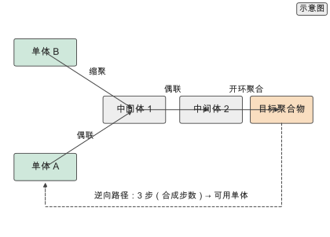
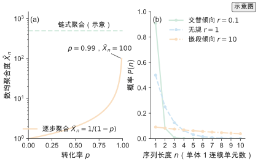
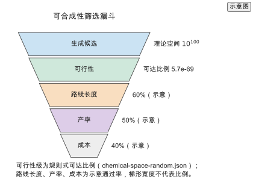
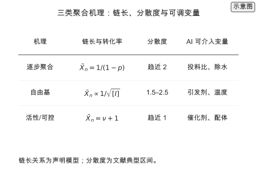
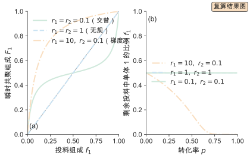
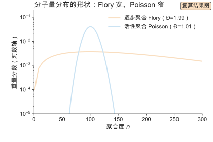
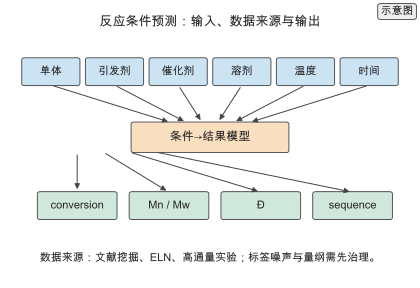
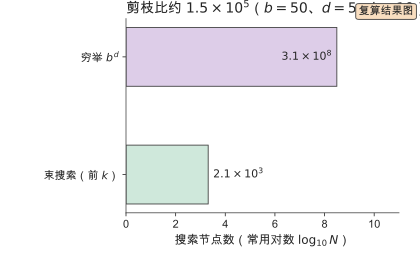
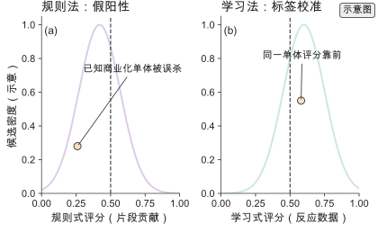
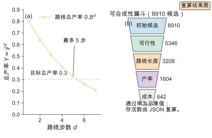

# 第 12 章 反应预测、聚合建模与可合成性

一个生成模型提出的候选结构在性质预测上得分很高：二酐与二胺的组合给出刚性的主链，预测的玻璃化转变温度超过目标值。把它交给合成组，得到的回复是：这条路线要走七步，两个中间体对水敏感，最后一步的产率没有文献可依。设计链条走到这里遇到最后一道关口——不是性质够不够好，而是这个结构做不做得出来。

第 2 章处理表示，第 9 章处理生成，两者都在性质空间里工作。这一章把反应与聚合的机理接进来，把"能不能合成"变成可以打分、可以优化、可以进入设计目标的量。判断很直接：可合成性不是模型之外的检查项，而是设计目标的一部分；把机理写进模型，能让生成器少产生一大批"性质好但做不出"的候选。

本章沿一条从机理到筛选的路线展开。12.1 到 12.5 建立基本对象：反应类型、聚合机理、逆合成与产率预测、可合成性评分与催化剂设计。12.6 到 12.11 把六个核心问题展开到可计算的程度：聚合动力学的速率方程与可控变量、共聚的竞聚率与组成漂移、分子量分布的全谱预测、反应条件预测的数据与标签、逆合成与路线规划、可合成性评分的规则法与学习法。12.12 用两个真实空间走通一次路线长度与可合成性核算，12.13 到 12.17 回顾代表工作、做定量对比、给出实践流程、选型决策与练习清单。做工程的读者可以沿 12.1 → 12.6 → 12.7 → 12.9 → 12.11 → 12.12 → 12.15 → 12.16 直接走通。

## 12.1 合成与反应

高分子合成是一个反应网络：节点是单体、中间体与聚合物，边是反应。要把"能不能合成"变成可计算的量，先要把反应分类、把聚合机理说清。这两件事决定了模型的条件标签与输出字段。

### 12.1.1 反应类型

高分子合成涉及的反应按化学过程分成四类，每类有典型的条件与副反应。

**偶联反应（coupling reaction）** 用金属催化剂把两个芳基或烯基片段连起来，Suzuki 与 Sonogashira 偶联是代表。反应依赖钯催化剂与碱，对水与氧敏感，副反应是自偶联与脱卤。

**缩聚（polycondensation）** 让双官能团单体之间反复成键，酯化与酰胺化是代表。它要求官能团等活性，副产物是小分子（水、醇），必须及时移出以推动平衡。

**加成聚合（addition polymerization）** 由引发剂打开单体的碳碳双键，自由基、阴离子与配位聚合都属于这一类。反应对引发剂浓度与杂质敏感，副反应是链转移与终止。

**开环聚合（ring-opening polymerization, ROP）** 由金属或有机催化剂打开环状单体（内酯、内酰胺、环氧化物），得到聚酯、聚酰胺与聚醚。副反应是回咬与链转移。

| 反应类型 | 代表 | 条件 | 主要副反应 |
| --- | --- | --- | --- |
| 偶联 | Suzuki、Sonogashira | Pd 催化剂、碱、无水无氧 | 自偶联、脱卤 |
| 缩聚 | 酯化、酰胺化 | 酸或碱催化、移除小分子 | 环化、计量失衡 |
| 加成聚合 | 自由基、阴离子、配位 | 引发剂或催化剂 | 链转移、终止 |
| 开环聚合 | 内酯、内酰胺、环氧化物 | 金属或有机催化剂 | 回咬、链转移 |

四类的条件、催化剂与副反应各不相同。反应预测模型因此把反应类型作为条件标签：用一套模型覆盖全部反应，会把不同机理混在一起，分类误差沿路线规划一路传播下去。反过来，同一类反应内部的记录可以共享表示，这也是产率预测常按反应类型分组训练的原因。把反应类型写进数据字段，是本章所有模型的第一步。

### 12.1.2 聚合机理

聚合的机理分两种。逐步聚合（step-growth polymerization）里，任意两个带反应官能团的物种都能反应，低转化率阶段体系内主要是低聚物，但任何带反应官能团的物种都仍可继续反应，高分子量主要在高转化率区形成。链式聚合（chain-growth polymerization）里，单体逐个加到活性中心上，链在引发后迅速长到最终长度，再通过终止或转移停止。

用转化率 $p$ 描述反应进度：$p$ 是已反应官能团（或单体）占总数的比例（无量纲）。数均聚合度 $\bar{X}_{n}$ 是平均每条链含有的重复单元数（无量纲）。逐步聚合的 Carothers 方程给出

$$\bar{X}_{n} = \frac{1}{1-p}$$。

$p=0.99$ 时 $\bar{X}_{n}=100$ `[复算]`，$p=0.999$ 时 $\bar{X}_{n}=1000$ `[复算]`。该方程默认官能团等活性、体系无环化与副反应；$p\to1$ 时 $\bar{X}_{n}$ 发散，实际体系在 $p$ 逼近 1 前就被环化与计量偏差截断。要得到分子量足够高的产物，逐步聚合必须把转化率推到 99% 以上，这正是它对副产物移除与计量比敏感的原因。链式聚合的动力学链长由引发、增长与终止速率常数之比决定，链长与转化率解耦，因此可以在较低转化率下得到高分子量。

合成的产物不是单一分子量，而是分子量分布 $P(M)$。数均分子量 $M_{n}$ 与重均分子量 $M_{w}$ 是两个矩，分散度 Đ（polydispersity index，PDI $=M_w/M_n$）定义为

$$\text{Đ} = M_{w}/M_{n}$$。

逐步聚合的分布趋近 $\text{Đ}=2$，活性聚合趋近 $\text{Đ}=1$ `[文献]`。产物是分布而不是离散对象，这一点改变了建模目标：结构从一个分子变成一个分布，第 2 章的表示与 12.3、12.8 的预测都要带上分布的矩或形状。把 $\bar{X}_{n}$ 与 $\text{Đ}$ 分开报告，是因为两者由不同的控制变量决定：$\bar{X}_{n}$ 由单体与引发剂（或官能团）计量比决定，$\text{Đ}$ 由链增长与终止、转移的相对速率决定。

*图 12-1　高分子的反应网络。节点是单体、中间体与聚合物，边是反应，三条主路径分别是偶联、缩聚与开环聚合。从目标聚合物反向追踪到可用单体，路径长度就是合成步数。（证据：示意）*

## 12.2 反应预测

反应预测要回答两个不同的问题：这个键由哪类反应形成（逆合成），以及在给定条件下这个反应能给出多少产物（产率与条件预测）。前者是组合搜索，后者是回归与排序。

### 12.2.1 逆合成

逆合成（retrosynthesis）从目标分子出发，反复选择断键与反应模板，直到所有前体都能买到。它把"这个分子怎么造"拆成一串"这个键由哪类反应形成"。单步逆合成在模板库 $\mathcal{T}$ 上给候选反应打分：

$$s(t \mid m) = \sigma\big(f_{\theta}(m, t)\big),$$

其中 $m$ 是目标分子，$t$ 是模板，$\sigma$ 把分数压到 $[0,1]$。多步搜索把单步模型的输出当作树的子节点逐层展开。若单步候选数为 $b$、目标步数为 $d$，广度优先搜索的节点数按 $b^{d}$ 增长，这是组合爆炸的标准形式。

分工因此很清楚：单步模型负责"这个键能不能断"，多步搜索负责"哪条路径最短且最可靠"。单步模型的准确率是上限，搜索策略决定在有限算力下能走多远。单步模型有两条路线：模板法把已知反应规则编码成断键模板，可解释、精度稳定，但覆盖不到模板外的新反应；无模板法用序列到序列模型直接从产物预测反应物，覆盖广，但输出可能不是合法分子，需要合法性校验。[^moltransformer] 两条路线的评价指标不同：模板法报 top-$k$ 模板准确率，无模板法报 top-$k$ 反应物准确率与合法性比例，两者不能直接比较。

多步搜索在展开方式上也有取舍。深度优先搜索沿一条路径走到底，省内存但可能扎进死胡同；广度优先搜索按层展开，完备但节点数按 $b^{d}$ 爆炸；蒙特卡洛树搜索用随机模拟估计节点价值，把展开集中在有希望的分支上；A\* 搜索用可达性启发函数给节点排序，优先展开总代价估计最低的节点。[^retrosegler] 工程实现把单步模型、模板库与搜索算法打包成服务，[^aizynthfinder] 对高分子单体这种小分子前体，这套工具可以直接复用。

逆合成的评价不能只看单步准确率。端到端评价用三个量：round-trip 准确率（模型预测的前体再用正向模型预测能否回到目标）、路线求解率（在限定步数内找到路线的比例）、路线可执行性（是否终止在可及单体、单步条件是否在文献覆盖内）。三个量对应三种失败：round-trip 低说明单步模型不自洽；求解率低说明搜索或模板覆盖不足；可执行性低说明路线在化学上不成立。报告逆合成模型时给出这三个量，比只给 top-$k$ 更能说明实际可用性。

### 12.2.2 产率与条件预测

产率预测是回归问题：输入是反应物指纹 $z_{r}$、试剂指纹 $z_{c}$ 与条件向量 $c$（溶剂、温度、催化剂、时间），输出是产率 $\hat{y}\in[0,1]$。条件空间的规模是各离散变量取值之积，典型在 $10^{6}$ 以上 `[示意]`；而可用的标注反应记录在 $10^{4}$ 量级 `[示意]`。两者相差两个数量级，靠单个条件的独立数据无法覆盖。

数据稀缺决定了条件推荐与产率预测常联合训练：两者共享反应与试剂的表示，产率作为主任务，条件作为辅助任务。共享表示让模型在"哪个条件好"与"这个条件产率多少"之间迁移，缓解了单一条件下的样本不足。反应物与试剂编码可以用分子指纹，也可以用有向消息传递网络；[^chemprop] 条件则按类型分别编码：连续量（温度、时间、当量）标准化后进全连接层，离散量（溶剂、催化剂、碱）做嵌入。

产率预测的一个结构性问题是标签口径。同一个反应的产率可以是分离产率、核磁产率或色谱产率，三者可以相差十几个百分点；负结果（产率接近零）常不发表，数据集因此有幸存者偏差。建模时要把产率口径、分离方法与规模写成字段，并把失败记录单独保留，否则模型学到的是发表偏置而不是反应规律。这些问题在 12.9 展开。

> **练习 12-1〔核心〕：核算逆合成搜索的代价**
>
> 给定单步候选数与目标步数，核算广度优先与启发式搜索的节点展开数，比较穷举与剪枝的差距。单步候选 $b=50$[示意]，步数 $d=5$[示意]，启发式每步保留前 10 个候选[示意]。
>
> 条件：纸笔练习，只需初等代数、对数运算与量级估算。

## 12.3 聚合建模

聚合建模把反应条件映射到聚合结果：转化率、分子量分布与序列。这三者分别是标量、分布与序列对象，需要不同的模型与损失。

### 12.3.1 动力学模型

动力学模型把速率写成浓度的函数。逐步聚合的速率与未反应官能团浓度的平方成正比，链式聚合的增长速率与单体浓度和活性中心浓度之积成正比。速率方程给出两条可用的先验：一是转化率与分子量的解析关系（Carothers 方程），二是不同条件下分子量的变化方向。

把速率方程作为物理先验放进数据驱动模型，可以约束低数据区的预测。数据稀疏时，纯回归模型在训练分布之外给出没有物理意义的取值；速率方程提供单调性与边界，把预测限制在可行区间。物理信息学习的方法在第 7 章，本章只把它当作聚合建模的一件工具。

### 12.3.2 分子量分布预测

分子量分布预测把目标从单一数值换成整条分布 $P(M)$。分布是归一化的连续函数，比较两条分布需要分布距离。一维 Wasserstein 距离定义为累积分布之差的积分：

$$W_{1}(P, \hat{P}) = \int_{0}^{\infty} \lvert F_{P}(x) - F_{\hat{P}}(x)\rvert\,\mathrm{d}x,$$

其中 $F$ 是累积分布。它以"把一条分布搬到另一条所需的最小移动量"度量差异，对分布的整体平移与展宽都敏感，比逐点比较更适合作为损失。

分布预测比单一 $M_{n}$ 提供更多信息，代价是需要更多标注：文献常报告 $M_{n}$ 与 $M_{w}$，完整的 GPC 曲线则少得多。多数情形下退一步预测分布的矩（$M_{n}$、$M_{w}$、$\text{Đ}$），信息量已经覆盖加工与力学关心的范围。全谱预测的建模方式与可测性在 12.8 展开。

### 12.3.3 共聚序列

共聚物的性质取决于单体在链上的排列。三种基本序列是无规（random）、交替（alternating）与嵌段（block）。排列由两种单体的竞聚率（reactivity ratio）$r_{1}$、$r_{2}$ 决定 `[文献]`：趋于交替的本质是增长链的链端更偏好加成另一种单体，即 $r_{1}\to0$ 且 $r_{2}\to0$（等价于 $r_{1}r_{2}\to0$）时两端都偏好异种单体，序列趋于交替；$r_{1}\approx r_{2}\approx1$ 时两种单体无偏好，序列趋于无规；$r_{1}\gg1\gg r_{2}$ 时单体 1 的链端倾向加成单体 1，更常见的结果是组成漂移或梯度序列，要得到真正的嵌段序列需要顺序加料或活性聚合等手段。

序列用二单元组与三单元组频率描述，这些频率是连接反应条件与性质的中间变量：条件决定竞聚率，竞聚率决定序列，序列决定形貌与力学。序列预测因此不是孤立的分类任务，而是反应到性质的必经环节。竞聚率本身也可以预测：它由单体结构决定，可以从单体对的数据用回归或图模型学习，再代入序列模型。

*图 12-2　聚合动力学与序列倾向。(a) 逐步聚合中转化率与数均聚合度的关系。(b) 对称情形（$r_{1}=r_{2}=r$）下三种竞聚率的序列长度分布；$r=10$ 的长序列倾向仅适用于对称情形，$r_{1}\gg1\gg r_{2}$ 给出的是梯度序列而非嵌段。（证据：示意）*

> **练习 12-2〔核心〕：建立产率预测的基线**
>
> 用反应指纹与条件特征训练树模型预测产率，比较随机森林与线性基线在留出集上的平均绝对误差，并分析条件特征的重要性。数据规模：约 $10^{4}$ 条反应记录。
>
> 条件：需要运行本书配套仓库的代码（RDKit 与 scikit-learn）。

## 12.4 可合成性与可达性

可合成性把"这个结构能不能造"压成一个可排序、可过滤的量。它有两个层次：单分子的评分，与从目标到单体的路线规划。

### 12.4.1 可合成性评分

可合成性评分（synthesizability score）把多个可行性因子合成一个数，用于排序与阈值过滤：

$$S = w_{1} s_{\text{step}} + w_{2} s_{\text{len}} + w_{3} s_{\text{avail}} + w_{4} s_{\text{yield}},$$

四项分别度量单步可行性、路线长度、前体可得性与预测产率，各自归一化到 $[0,1]$，权重按研发偏好设定。评分高不代表一定能合成，它给出的是相对排序：在同样的化学空间里，哪些候选更可能被做出来。

评分的用途是把生成模型的输出过滤到可合成子集，而不是替代化学家判断。生成模型在性质空间里采样，可达性评分把它拉回合成空间，两者配合才能得到"性质达标且做得出"的候选。规则式评分与学习式评分的差别、以及规则法的假阳性风险，在 12.11 展开。

### 12.4.2 合成路线规划

路线规划在逆合成树上搜索。单步模型给出每个节点的可行反应，树搜索决定展开顺序。A\* 搜索用可达性评分作启发函数，优先展开总代价估计最低的节点，把有效分支从单步候选数降到 $10^{1}$ 量级 `[示意]`。

步数与产率之间存在直接权衡。若每步产率为 $y$，$d$ 步路线的总产率是各步之积：

$$Y = \prod_{i=1}^{d} y_{i} \approx \bar{y}^{d}$$。

单步产率 $\bar{y}=0.8$ `[示意]` 时，5 步路线的总产率约 0.33 `[复算]`，7 步降到 0.21 `[复算]`。步数越多，总产率按指数衰减，长路线在工程上不可行——这正是目标总产率 0.3 `[示意]` 对应最多 5 步 `[复算]` 的原因。路线规划因此在步数与单步可行性之间求平衡。

路线规划还有一条终止条件容易被忽略：搜索必须终止在可购买或已制备的单体上。若单步模型给出一个"看起来合理"但买不到的前体，路线会继续向上展开，直到撞上不可及的节点。把可及单体集合作为搜索的硬约束，比事后检查路线是否落在可及集合内更省算力。高分子的单体可及性还要叠加聚合反应本身的条件约束，这一点在 12.10.3 展开。

*图 12-3　可合成性评分与筛选。生成候选依次通过可行性、路线长度、产率与成本四道过滤，每层的通过率相乘决定最终可合成子集的大小。可行性级给出规则式可达比例，路线长度、产率与成本为示意通过率。（证据：示意）*

> **练习 12-3〔核心〕：用可达性评分过滤生成候选**
>
> 对一批生成候选计算可达性评分，按阈值过滤，统计存活比例，并与"性质最优"选择比较可合成性。候选 $10^{4}$ 个，评分阈值 0.5。
>
> 条件：需要运行本书配套仓库的代码（RDKit 与逆合成工具）。

## 12.5 催化剂与开环聚合

催化剂决定反应能不能按目标机理走，开环聚合则是可控分子量与窄分布的主要来源。两者共同支撑可回收热固性材料的设计。

### 12.5.1 催化剂设计

催化剂设计写成在催化剂库上的排序问题：给定单体与目标聚合物，输出候选催化剂与条件的排序 $R(c \mid m, p)$。排序比绝对预测更稳健，因为催化剂数据极稀缺，任何单一体系的产率标注都只有几十到几百条 `[示意]`。

迁移学习是应对稀缺的标准做法：先用大量单体–催化剂共现数据预训练一个共享表示，再用目标体系的小样本微调。预训练让模型学会"哪类催化剂适合哪类单体"，微调把它对准具体体系。方法与第 7 章的小样本迁移一致。催化剂筛选还常与条件推荐联合：催化剂与温度、溶剂之间存在交互，单独优化其中一个会得到次优组合。

催化剂的表示要同时携带金属中心与配体环境。金属中心用类别或元素嵌入，配体用分子图或指纹，两者的交互（螯合、位阻、电子效应）通过交叉特征或图注意力捕捉。把催化剂写成"金属加配体"两个字段，比把它压成一个分子字符串更利于迁移：同一金属中心在不同配体下的表现可以共享，不同金属中心在同一配体下的表现也可以共享。数据字段应至少包含金属、配体、助催化剂、配体与金属比四个量，缺一个都会让排序结果难以归因。

### 12.5.2 开环聚合设计

开环聚合的设计变量是单体、催化剂与条件构成的三元组。要得到活性聚合（living polymerization）——链在反应结束后仍保持活性、可以继续加料增长——需要引发速率远大于增长速率，并且没有链转移与终止。满足这些条件时，分子量随转化率线性增长，分布趋窄，$\text{Đ}$ 趋近 1。

活性聚合是可回收热固性材料设计的基础。这类材料用动态共价键交联，需要窄分布的预聚物与可控的端基，开环聚合给出这两样。第 16 章案例二从单体选择、催化剂筛选到回收验证，走的正是这条路线。开环聚合的动力学与可控变量在 12.6.3 展开。

## 12.6 聚合动力学的展开

前五节给出聚合建模的框架，但没有写出速率方程与可控变量。这一节把三类机理展开到可计算的程度，并给出 AI 可以介入的位置。

### 12.6.1 自由基聚合：三步与速率方程

自由基聚合由三步基元反应组成。引发：引发剂 $I$ 分解产生初级自由基，再与单体加成，$I\xrightarrow{k_{d}}2R\cdot$，$R\cdot+M\xrightarrow{k_{i}}M_{1}\cdot$，引发速率 $R_{i}=2fk_{d}[I]$，$f$ 是引发效率。增长：$M_{n}\cdot+M\xrightarrow{k_{p}}M_{n+1}\cdot$，增长速率 $R_{p}=k_{p}[M][M\cdot]$。终止：两条活性链偶合或歧化，$R_{t}=2k_{t}[M\cdot]^{2}$。

对活性中心做稳态近似，$R_{i}=R_{t}$，得 $[M\cdot]=\big(fk_{d}[I]/k_{t}\big)^{1/2}$，代入增长速率：

$$R_{p}=k_{p}[M]\Big(\frac{fk_{d}[I]}{k_{t}}\Big)^{1/2}$$。

动力学链长 $\nu=R_{p}/R_{i}=k_{p}[M]\big(2fk_{d}k_{t}[I]\big)^{-1/2}$，即 $\nu\propto[M][I]^{-1/2}$。这一条幂律给出自由基聚合的核心可控变量：提高单体浓度增加链长，提高引发剂浓度缩短链长。$\bar{X}_{n}$ 与 $\nu$ 的关系取决于终止方式：歧化终止时 $\bar{X}_{n}=\nu$，偶合终止时 $\bar{X}_{n}=2\nu$。

转化率随时间的演化由 $-\mathrm{d}[M]/\mathrm{d}t=R_{p}$ 给出。引发剂浓度近似恒定时，$[M]$ 按一级动力学衰减，$[M]=[M]_{0}\exp(-k_{p}[M\cdot]t)$。高转化率时出现凝胶效应（Trommsdorff–Norrish）：体系黏度上升，终止反应受扩散控制，$k_{t}$ 下降而 $k_{p}$ 受影响较小，$R_{p}$ 反而加速，分布同时变宽。凝胶效应是自由基聚合在 $p>0.5$ 后偏离理想动力学、$\text{Đ}$ 超过 2 的主要原因，也是纯幂律模型在高转化率区失效的原因。

链转移是第三条影响链长的途径：活性中心把活性转移给单体、溶剂、引发剂或聚合物，链长被截断而活性中心总数不变。转移反应的相对强度用 Mayo 方程描述：

$$\frac{1}{\bar{X}_{n}} = \frac{1}{\bar{X}_{n}^{(0)}} + C_{M} + C_{S}\frac{[S]}{[M]},$$

其中 $\bar{X}_{n}^{(0)}$ 是无转移时的链长，$C_{M}=k_{\text{tr},M}/k_{p}$ 与 $C_{S}=k_{\text{tr},S}/k_{p}$ 是单体与溶剂的转移常数。Mayo 方程给出一个可拟合的线性关系：改变溶剂浓度、以 $1/\bar{X}_{n}$ 对 $[S]/[M]$ 作图，斜率就是 $C_{S}$。这既是实验测定转移常数的方法，也是模型把溶剂从"类别标签"升级为"定量特征"的依据。把转移项写进模型，能解释为什么同一单体在良溶剂与不良溶剂中给出不同的分子量。

### 12.6.2 逐步聚合：Carothers 与 Flory

逐步聚合的速率与两种官能团浓度成正比。等官能团时 $[A]=[B]=c$，速率方程 $\mathrm{d}c/\mathrm{d}t=-kc^{2}$，积分得 $1/c-1/c_{0}=kt$，转化率

$$p = \frac{kc_{0}t}{1+kc_{0}t}$$。

转化率与数均聚合度由 Carothers 方程连接，$\bar{X}_{n}=1/(1-p)$。Flory 最可几分布给出链长分布：数均分布 $N(n)=(1-p)p^{n-1}$，重量分布 $w(n)=n(1-p)^{2}p^{n-1}$。由分布算出重均聚合度 $\bar{X}_{w}=(1+p)/(1-p)$，故 $\text{Đ}=\bar{X}_{w}/\bar{X}_{n}=1+p$，$p\to1$ 时趋近 2。[^polymerkinetics] 这解释了为什么逐步聚合产物的 $\text{Đ}$ 天然接近 2，而活性聚合可以做到接近 1。

> **高分子物理 Box　为什么逐步聚合要到高转化率才有高分子量**
>
> 逐步聚合里链的增长是官能团之间的随机成键。设 $N_{0}$ 个单体、每步消耗一个官能团对，链数从 $N_{0}$ 降到 $N_{0}(1-p)$，平均每条链含 $1/(1-p)$ 个单元。$p=0.5$ 时平均链长只有 2 个单元，$p=0.9$ 时是 10，$p=0.99$ 才到 100。高分子量出现在 $p\to1$ 的尾端，因为此时可反应的官能团已很少，链与链偶合的每一次都显著提高链长。这就是逐步聚合对副产物移除与计量比极端敏感的原因：水分没除净或一种单体略过量，都会把 $p$ 的有效上限压到 0.99 以下，$\bar{X}_{n}$ 随之被截断。反过来，链式聚合的链长由引发与增长的速率比决定，单体逐个加上去，链长与转化率解耦，因此可以在较低转化率下得到高分子量。理解这一点，才能在给定目标分子量时选择正确的聚合方式与转化率区间。

### 12.6.3 活性与可控聚合：ATRP、RAFT、ROP

活性聚合的目标是让链在反应结束后仍保持活性，从而控制分子量、窄化分布、保留端基。三条常用路线各有不同的平衡机制。

**原子转移自由基聚合（ATRP）** 用过渡金属催化剂在休眠种与活性种之间建立可逆平衡：$P_{n}-X+\mathrm{Cu(I)}L\rightleftharpoons P_{n}\cdot+\mathrm{Cu(II)}XL$。[^atrp] 平衡强烈偏向休眠种，自由基浓度极低，双分子终止被压到可忽略，而增长仍在进行。可控变量是催化剂与配体、引发剂、温度与时间。分子量由投料比给出 $M_{n}=M_{0}\,[M]_{0}/[I]_{0}\,p$，随转化率线性增长，$\text{Đ}$ 趋近 1。

**可逆加成–断裂链转移聚合（RAFT）** 用链转移剂在增长链与休眠链之间可逆转移，同样把自由基浓度压低。[^raft] RAFT 对单体与官能团的容忍度比 ATRP 高，代价是链转移剂残留会影响产物颜色与稳定性。可控变量是 RAFT 试剂与引发剂的比、单体、温度与时间。

**开环聚合（ROP）** 用金属醇盐的配位–插入机理或有机催化剂（如脒类）打开环状单体。引发速率远大于增长速率、且无链转移与终止时，得到活性聚合。可控变量是催化剂、引发剂与单体比、温度与时间。

三条路线的共同判据是"活性"：$M_{n}$ 随转化率线性增长、$\text{Đ}<1.1$、实测 $M_{n}$ 与理论值一致、链端保留可再引发的能力。这四条也是评价可控聚合实验的最小报告集。反之，若 $M_{n}$ 偏离线性、$\text{Đ}$ 随转化率上升，说明体系里有链转移或终止，模型应把 $\text{Đ}$ 作为与 $M_{n}$ 独立的输出。

三条路线的取舍可以列成对照。ATRP 对单体与官能团的容忍度中等，需要除氧，催化剂用量与配体选择决定可控性，金属残留对电子与生物应用是问题；RAFT 容忍度高、可在多种溶剂中进行，代价是链转移剂残留影响产物颜色与稳定性；ROP 适用于环状单体，金属催化剂残留对生物医用材料是问题，有机催化是替代路线。选择依据是单体官能团、目标端基与残留容忍度，而不是单一的 $\text{Đ}$ 指标。工程上常把三条路线都列入候选，用 12.5.1 的排序模型按单体与目标端基筛选。

*图 12-4　三类聚合机理的对比。逐步聚合的链长由转化率决定，分散度趋近 2；自由基聚合的链长与引发剂浓度的平方根成反比，分散度典型在 1.5 到 2.5；活性与可控聚合的链长由单体与引发剂投料比决定，分散度趋近 1。链长关系为声明模型，分散度为文献典型区间。（证据：示意）*

### 12.6.4 动力学先验与 AI 的接口

动力学模型给出三类先验，可以直接进入数据驱动流程。第一类是函数形式：$\bar{X}_{n}=1/(1-p)$、$\nu\propto[M][I]^{-1/2}$、$M_{n}\propto[M]_{0}/[I]_{0}\,p$ 都是低维、单调、有物理意义的约束，把它们作为特征或正则项，能显著减少低数据区的荒谬预测。第二类是守恒与边界：转化率在 $[0,1]$ 内、$\text{Đ}\ge1$、分子量随转化率单调不减，这些约束不需要训练数据就能施加。第三类是速率常数与条件的依赖：Arrhenius 关系把温度映射到速率常数，让模型在温度外推时至少保持方向正确。

AI 可介入的位置有四个。其一，用少量实验数据校正动力学参数：把 $k_{p}$、$k_{t}$、$k_{d}$ 作为可学习参数，用产率与分子量数据反演，得到比文献值更贴合本体系的参数。其二，从条件预测 $\text{Đ}$ 与端基，这是纯动力学模型难以解析给出的量。其三，催化剂与配体筛选，把 12.5.1 的排序问题与动力学参数关联。其四，逆问题：给定目标 $M_{n}$、$\text{Đ}$ 与序列，反推单体、引发剂与条件，这一步与第 10 章的逆向设计共用工具。

参数反演要面对可辨识性（identifiability）问题。速率常数在模型里常以组合形式出现：自由基聚合的 $R_{p}$ 只依赖 $k_{p}^{2}fk_{d}/k_{t}$ 这个组合，单独拟合 $k_{p}$、$k_{d}$、$k_{t}$ 三者会得到多组等价解。做法是把可辨识的组合作为参数（如 $k_{p}^{2}fk_{d}/k_{t}$），或用额外测量（分子量随时间、引发剂浓度扫描）把它们分开。若数据只覆盖一个温度，Arrhenius 的活化能也不可辨识；要辨识活化能，温度必须扫描至少两个点。报告反演结果时，同时给出参数的置信区间与参数之间的相关系数，才能说明反演是否稳定。不可辨识的参数即使拟合误差很小，也不能用于外推。

> **ML Box　为什么聚合动力学适合做物理先验，而不是纯回归**
>
> 聚合数据的一个特点是"条件多、标签少"：一个单体–引发剂体系可能只有几十条不同温度与时间的记录，却要预测整条分子量分布。纯回归在这种稀疏条件下会把温度、时间、浓度的影响混在一起，给出没有物理意义的组合。动力学方程提供的是变量之间的相对关系：链长随引发剂浓度按 $-1/2$ 次幂变化，随单体浓度线性变化，随转化率按 $1/(1-p)$ 发散。把这些关系作为特征变换或正则项，模型只需要学少数几个比例常数，而不是从零学整个映射。这与第 7 章的物理信息学习是同一思路：先验不是装饰，而是把样本效率从"每个自由度都要数据"提高到"每个体系只要几个参数"。

## 12.7 共聚组成、序列与漂移

共聚物不是把两种单体简单混合，链上排列由竞聚率决定，而排列又随转化率漂移。这一节把瞬时组成、漂移与序列分布写成可计算的形式。

### 12.7.1 Mayo–Lewis 方程与竞聚率

竞聚率定义为同种加成与异种加成的速率常数之比：$r_{1}=k_{11}/k_{12}$，$r_{2}=k_{22}/k_{21}$。末端模型假设增长链的活性只取决于链端那一个单体单元。设投料中单体 1 的摩尔分数为 $f_{1}$、$f_{2}=1-f_{1}$，瞬时共聚物中单体 1 的摩尔分数 $F_{1}$ 由 Mayo–Lewis 方程给出：[^mayolewis]

$$F_{1} = \frac{r_{1}f_{1}^{2}+f_{1}f_{2}}{r_{1}f_{1}^{2}+2f_{1}f_{2}+r_{2}f_{2}^{2}}$$。

这个方程给出四种典型情形。$r_{1}\to0$ 且 $r_{2}\to0$ 时两端都偏好异种单体，序列趋于交替；$r_{1}\approx r_{2}\approx1$ 时无偏好，序列趋于无规；$r_{1}>1$、$r_{2}>1$ 时两端都偏好自己，趋于嵌段；$r_{1}\gg1\gg r_{2}$ 时，单体 1 的链端偏好单体 1，而单体 2 的链端偏好单体 1，结果是富 1 的长序列与沿链的组成渐变，即梯度序列，而不是嵌段。$r_{1}\gg1\gg r_{2}$ 常被误读成"嵌段"，区别在于嵌段需要一段几乎纯 1、再接一段几乎纯 2，而这要求顺序加料或活性聚合，单靠竞聚率做不到。

方程还有一个特殊点：瞬时组成等于投料组成的组成，称为共沸点（azeotrope），

$$f_{1,\text{az}} = \frac{1-r_{2}}{2-r_{1}-r_{2}}$$。

在共沸点投料，共聚物组成不随转化率变化，也就没有组成漂移。共沸点存在于 $f_{1,\text{az}}\in(0,1)$ 时：两端竞聚率同侧（都小于 1 或都大于 1）时存在，异侧（一者大于 1、另一者小于 1）时不存在。$r_{1}=r_{2}=1$ 时任意组成都是共沸点（无规），$r_{1}=r_{2}=0.1$ 时共沸点在 $f_{1}=0.5$。

### 12.7.2 组成漂移与梯度序列

转化率升高时，消耗快的单体在投料中变稀，瞬时组成随之变化，这叫组成漂移（composition drift）。把单体总浓度记为 $M$，Skeist 方程给出漂移的微分形式：

$$\frac{\mathrm{d}f_{1}}{\mathrm{d}p} = \frac{f_{1}-F_{1}}{1-p}$$。

当 $F_{1}>f_{1}$（共聚物比投料富单体 1），$\mathrm{d}f_{1}/\mathrm{d}p<0$，单体 1 随转化率被优先消耗，投料逐渐富单体 2，后续生成的链段含 1 越来越少，整条链沿生长方向形成组成梯度。以 $r_{1}=10$、$r_{2}=0.1$、初始 $f_{1}=0.5$ 为例，瞬时 $F_{1}=0.909$，投料中单体 1 的比例在 $p=0.99$ 时降到接近 0 `[复算]`；这就是梯度共聚物，而不是嵌段共聚物。反之 $r_{1}=0.1$、$r_{2}=10$ 时梯度方向相反。要得到组成均匀的无规共聚物，应把投料控制在共沸点，或用半连续加料补偿消耗。

组成漂移对建模有两条含义。第一，用单一投料比描述一个共聚物样本会丢信息：同一投料在不同转化率下得到不同组成分布，模型必须把转化率作为输入。第二，性质预测要把"平均组成"与"组成梯度"分开：平均组成相同的两个梯度共聚物，自组装形貌可以完全不同。

组成漂移在工程上有三种控制方式。第一，把投料控制在共沸点，使瞬时组成不随转化率变化，得到组成均匀的无规共聚物。第二，半连续加料：把消耗快的单体按消耗速率补入，维持投料组成恒定，适合共沸点不存在或目标组成不在共沸点的体系。第三，故意利用漂移：先加入富单体 1 的投料、再补单体 2，得到沿链组成渐变的梯度共聚物。三种方式对应三种目标序列，选择依据是目标性质对排列的敏感度。模型要能预测漂移曲线，才能判断给定加料策略能否命中目标序列。

*图 12-5　竞聚率与组成漂移。(a) Mayo–Lewis 瞬时组成曲线，$F_{1}$ 随投料 $f_{1}$ 变化，对角虚线是 $F_{1}=f_{1}$，曲线与它的交点是共沸点。(b) 投料组成随转化率的漂移，$r_{1}=10$、$r_{2}=0.1$ 时单体 1 被优先消耗，$r_{1}=r_{2}=1$ 时不漂移。曲线由声明参数复算。（证据：复算）*

### 12.7.3 序列分布：二单元组、三单元组与 Markov 模型

瞬时组成只描述单体比例，序列描述排列。末端模型下，链端为单体 1 时下一个单元仍是 1 的条件概率

$$P_{11} = \frac{r_{1}f_{1}}{r_{1}f_{1}+f_{2}},$$

单体 1 的平均连续单元数 $L_{1}=1/(1-P_{11})=(r_{1}f_{1}+f_{2})/f_{2}$。$r_{1}=r_{2}=1$、$f_{1}=0.5$ 时 $P_{11}=0.5$、$L_{1}=2$，即 Bernoulli 无规序列；$r_{1}=r_{2}=0.1$ 时 $L_{1}\approx1.1$，序列接近交替；$r_{1}=10$、$r_{2}=0.1$ 时 $L_{1}=11$，出现长 1 序列。[^mayolewis] 这些量在核磁共振的 $^{13}\text{C}$ 谱上以二单元组、三单元组分数的形式可测，因此序列模型有直接的实验标签。

一级 Markov 链把末端模型推广到依赖更长的历史。若下一个单元只依赖前一个单元，序列在该假设下由转移概率矩阵决定，二单元组与三单元组分数是矩阵元素的乘积；若依赖前两个单元，需要二单元组转移概率。对高分子，序列长度、三单元组分数与立构规整度一起决定结晶与形貌，序列预测的输出字段应至少包含二单元组与三单元组分数，而不只是"无规/交替/嵌段"一个标签。

序列与性质的连接有两个常用层次。局部组成层次：共聚物的玻璃化转变温度可用 Fox 方程按质量分数加权，

$$\frac{1}{T_{g}} = \frac{w_{1}}{T_{g,1}} + \frac{w_{2}}{T_{g,2}},$$

它只依赖组成、不依赖排列，因此组成表示足够。序列排列层次：结晶、自组装与力学依赖嵌段长度与序列长度分布，必须用二单元组、三单元组或更细的序列描述。判断用哪一层，先问性质对排列是否敏感：$T_{g}$ 不敏感，相分离与结晶敏感。把序列预测的输出与性质的敏感层次对齐，可以避免用过于精细的序列表示去预测一个只依赖组成的性质。

## 12.8 分子量分布的全谱预测

$M_{n}$ 与 $\text{Đ}$ 只给出分布的两个矩。加工窗口、熔体弹性与力学强度依赖分布的形状，因此预测目标应是整条 $P(M)$。

### 12.8.1 从矩到分布

分布的矩由链长分布定义。设 $N(n)$ 为链长的数均分布，则

$$\bar{X}_{n}=\frac{\sum_{n} n N(n)}{\sum_{n} N(n)},\qquad \bar{X}_{w}=\frac{\sum_{n} n^{2} N(n)}{\sum_{n} n N(n)},\qquad \text{Đ}=\frac{\bar{X}_{w}}{\bar{X}_{n}}$$。

三类聚合给出三种典型形状。逐步聚合的 Flory 最可几分布在 $p\to1$ 时 $\text{Đ}\to2$，形状宽而单峰；活性聚合的 Poisson 分布 $\text{Đ}\to1$，形状窄而对称；自由基聚合的 Schulz–Zimm 分布介于两者之间，$\text{Đ}$ 典型在 1.5 到 2.5，且随转化率变宽。相同的 $M_{n}$ 与不同的 $\text{Đ}$、或相同的 $\text{Đ}$ 与不同的形状（双峰、长尾）对应完全不同的加工行为，因此只报两个矩不足以确定分布。

预测整条分布有两条路线。参数化路线假设分布属于某个族（Flory、Poisson、Schulz–Zimm 或对数正态），只回归族的参数；它的样本效率高、输出天然归一化，代价是分布族假设可能与真实分布不符。非参数路线直接回归分箱概率或累积分布，表达力强，代价是需要更多标签，且要保证归一化与单调性。工程折中是参数化为主、用矩与形状统计量（偏度、峰度）做残差校正。

自由基聚合的分布常用 Schulz–Zimm 形式描述。设 $z=\bar{X}_{n}/(\bar{X}_{w}-\bar{X}_{n})$，连续重量分布

$$w(n) = \frac{z^{z+1}}{\Gamma(z+1)}\,\frac{n^{z}}{\bar{X}_{n}^{z+1}}\,e^{-zn/\bar{X}_{n}},$$

其中 $\Gamma$ 是 Gamma 函数，$z$ 由分布的两个矩确定。$z\to\infty$ 时 Schulz–Zimm 趋近 Poisson 分布（活性聚合），$z=1$ 时在连续极限下退化为 Flory 分布（逐步聚合）。一个参数 $z$ 就把三类聚合的分布形状连起来，这正是参数化分布预测的便利：回归 $z$ 比回归整条曲线需要更少数据。反过来，若只用 $M_{n}$ 与 $\text{Đ}$ 两个数，就丢掉了 $z$ 所携带的形状信息，双峰与长尾无法被区分。

*图 12-6　分子量分布的形状。横轴是聚合度 $n$，纵轴是重量分数（对数轴）。逐步聚合的 Flory 分布在 $p=0.99$ 时 $\text{Đ}=1.99$，覆盖从几十到几百的链长；活性聚合的 Poisson 分布在 $\bar{X}_{n}=100$ 时 $\text{Đ}=1.01$，集中在一百附近。两条曲线由声明分布复算。（证据：复算）*

### 12.8.2 分布距离与损失

训练分布预测模型需要分布之间的距离作为损失。一维 Wasserstein 距离对平移与展宽都敏感，且梯度性质好，是默认选择。另一种做法是矩匹配：损失由 $\lvert\log(M_{n}/\hat{M}_{n})\rvert$、$\lvert\text{Đ}-\hat{\text{Đ}}\rvert$ 与偏度差加权组成，实现简单但丢失形状细节。若用参数化分布，损失是参数空间的回归损失，需要对参数做变换保证正值与约束（如 $\text{Đ}\ge1$）。评价时应同时报告 $M_{n}$ 的相对误差、$\text{Đ}$ 的绝对误差与 Wasserstein 距离，三者一起才能区分"均值对了但形状错了"与"整体都错了"。

分布预测的基线应先建立。第一个基线是只预测 $M_{n}$ 与 $\text{Đ}$、用声明分布族（如 Schulz–Zimm）重建曲线；第二个基线是在此基础上加一个形状校正项；第三个基线才是端到端的分布回归。三个基线依次增加复杂度，若第三个不比第二个显著降低 Wasserstein 距离，说明数据量还不足以支撑非参数方法，应退回参数化。把这条基线与 12.8.3 的可测性一起报告，读者才能判断分布预测的收益来自模型还是来自更多标签。

### 12.8.3 可测性与标签

分布预测的瓶颈在标签而不在模型。凝胶渗透色谱（GPC/SEC）给出的是按流体力学体积分离的分布，需要用普适校准或光散射换算成绝对分子量；不同实验室的校准标准与柱效不同，同一材料的 $\text{Đ}$ 可以相差 10% 到 20% `[文献]`。文献数据里完整曲线少、$M_{n}$ 与 $\text{Đ}$ 多，且换算方法常不写明。可测性决定建模目标：只有矩时预测矩，有曲线时预测分布，且必须记录测量方法与校准标准。把不同校准的数据混在一起训练，模型学到的是实验室系统偏差而不是聚合规律。

## 12.9 反应条件预测

反应条件预测是本章最核心的高分子 AI 任务：它把"做什么反应"与"在什么条件下做"连成一个可学习的映射。

### 12.9.1 输入、输出与数据来源

任务形式化为一组输入到一组输出的映射：输入是 `monomer, initiator, catalyst, solvent, temperature, time`，输出是 `conversion, Mn, Mw, Đ, sequence`。输入里既有分子（需要表示）也有条件（连续量与离散量），输出里既有标量（转化率、分子量）也有分布（$\text{Đ}$、序列）。一个模型覆盖全部输出，还是每个输出一个模型，取决于输出之间的相关性：转化率与分子量强相关，可以共享表示；序列与分子量关系弱，适合单独建模。

*图 12-7　反应条件预测的输入、数据来源与输出。输入是单体、引发剂、催化剂、溶剂、温度与时间；输出是转化率、$M_{n}$、$M_{w}$、$\text{Đ}$ 与序列。数据来源分文献挖掘、电子实验记录与高通量实验三类，标签噪声与量纲问题在建模前必须先治理。（证据：示意）*

数据来源有三类，各自的偏置不同。文献挖掘覆盖广，但条件字段缺失多、口径不一，且只有成功的反应被发表；电子实验记录（ELN）字段完整、口径统一，但规模小、只覆盖本实验室的化学；高通量实验（HTE）在设计的条件矩阵上采集，标签一致性好，但覆盖窄、成本高。三类数据混合使用时，要按来源加权或按来源划分，否则模型学到的是来源差异。公开的反应数据平台把文献反应结构化，[^ord] 为产率与条件模型提供了可比对的底盘。

建模上，条件预测通常分两路编码再拼接。分子路把单体、引发剂、催化剂与溶剂编码成指纹或图表示；条件路把温度、时间、当量等连续量标准化、把溶剂与催化剂类别做嵌入。两路拼接后接共享的多任务头，分别输出转化率、$M_{n}$、$M_{w}$ 与 $\text{Đ}$。多任务头的价值在于输出之间相关：转化率与 $M_{n}$ 通过动力学关系耦合，共享表示让标签多的输出帮助标签少的输出。若输出之间存在确定性的函数关系（如 $M_{w}=\text{Đ}\cdot M_{n}$），应把它作为硬约束施加，而不是让模型分别预测两个可能互相矛盾的数。

### 12.9.2 标签噪声与量纲

产率标签的噪声有三个来源。口径：分离产率、核磁产率与色谱产率可以相差十几个百分点。规模：毫摩尔级筛选与克级合成的产率系统不同。缺失：失败反应不发表，数据集有幸存者偏差。处理办法是把口径、规模与分离方法写成字段，把失败记录单独保留，并在训练时按来源分组或加权。

量纲问题的处理有明确的规则。温度必须用绝对温标进入 Arrhenius 项，否则 ℃ 下的非线性关系会失真；浓度与投料比要分开，前者影响速率，后者影响分子量与组成；时间要与转化率、分子量关联，而不是作为独立特征。同一批数据里若温度以 ℃ 与 K 混用、浓度以 mol/L 与 g/L 混用，模型学到的是单位换算而不是反应规律。第 3 章的单位与缺失值治理流程在这里直接适用。

失败记录的保留方式也影响模型。负结果（低产率或无产物）与正结果一起训练，能把可行域的边界画出来；只保留正结果，模型在低产率区域没有约束，会高估条件可行性。保留失败记录时，要区分"反应不发生"与"反应发生但产率低"：前者是可行域外的点，后者是边界附近的点，两者的建模含义不同。把失败原因分成不发生、低产率、分离困难三类，分别进入不同的约束或损失项，比统一当成产率为零更有信息量。

### 12.9.3 条件推荐与主动实验

条件推荐是排序问题：给定反应物，输出候选条件的排序。它与产率预测联合训练，共享反应与试剂的表示。评价用 top-$k$ 命中率：模型排序的前 $k$ 个条件里有多少个实际产率高于阈值。产率回归的 MAE 与条件推荐的命中率是两个不同指标，前者看数值准不准，后者看排序对不对，报告时要分开。

条件空间远大于数据量，纯离线预测会遇到分布外条件。主动实验用不确定度选择下一个实验条件，把实验结果回流更新模型，形成闭环。[^stuyver] 这与第 11 章的贝叶斯优化、第 13 章的自驱动实验室是同一条技术路线。对高分子，闭环的瓶颈通常在实验通量而非模型：一轮聚合实验的周期决定闭环迭代速度。

## 12.10 逆合成与路线规划

逆合成与路线规划回答"怎么造"，它把目标结构拆成反应序列，并保证序列终止在可及单体上。

### 12.10.1 单步模型与多步搜索

单步逆合成模型给候选前体打分，多步搜索在树上展开。搜索的代价由分支因子 $b$ 与深度 $d$ 决定：穷举搜索的节点数是 $b^{d}$，$b=50$、$d=5$ 时是 $3.125\times10^{8}$ `[复算]`；束搜索每层只保留前 $k$ 个节点，$k=10$ 时展开 2050 个节点 `[复算]`，剪枝比约 $1.5\times10^{5}$ `[复算]`。[^route] 束搜索的代价是可能剪掉最优路径，因此启发函数的质量决定剪枝是否安全；A\* 用可达性评分作启发函数，把搜索集中在有希望的分支上。

单步模型的准确率是多步搜索的上限，但两者不是简单相乘：多步搜索可以在单步候选里保留低分但正确的选项，也可以因为中间体不可及而整条路径作废。评价多步搜索用三个量：找到路线的比例、路线的平均长度、路线是否终止在可及单体。只报单步 top-$k$ 准确率会高估实际可规划性。

单步模型的训练数据主要来自专利与文献反应，规模在 $10^{6}$ 量级 `[示意]`，覆盖偏药物化学。高分子相关的反应（缩聚、开环、偶联）在语料中占比小，直接迁移会低估这些反应的可规划性。做法有两种：用领域反应微调单步模型，或对聚合反应单独建立规则模板。前者需要整理领域反应数据，后者覆盖窄但可控。对高分子单体这种小分子前体，领域内的小分子逆合成工具可以直接复用；对聚合反应本身，规则模板与反应类型标签更可靠。

*图 12-8　逆合成搜索的代价。穷举搜索的节点数按 $b^{d}$ 增长，$b=50$、$d=5$ 时达 $3.1\times10^{8}$；束搜索每层保留前 $k=10$ 个节点，展开 2050 个节点，剪枝比约 $1.5\times10^{5}$。节点数由声明参数复算。（证据：复算）*

### 12.10.2 路线长度、总产率与单体可及性

路线总产率按各步之积衰减，$Y=\prod y_{i}\approx\bar{y}^{d}$。单步产率 0.8、目标总产率 0.3 时最多 5 步 `[复算]`；单步产率降到 0.6，上限降到 2 步 `[复算]`。这给出路线规划的第一条工程判据：单步产率越低，可接受的路线越短，逆合成搜索的深度上限应由产率反推，而不是固定。

单体可及性是第二条判据。逆合成搜索必须终止在可购买或已制备的单体上，否则路线不可执行。把可及单体集合作为硬约束，比事后过滤更省算力。可及性还分层次：目录可购买、实验室自制、需要定制合成；不同层次对应不同的时间与成本，路线规划应把可及性作为分级代价而不是二值标签。

可及性的分级代价要与时间预算匹配。目录可购买的单体通常一周内到货，实验室自制的中间体需要一到两周，定制合成可能一个月以上。路线规划若只区分"可及与不可及"，会把需要一个月定制合成的路线与一周可到货的路线当成等价。把可及性写成三级时间代价，再与总产率一起进入路线评分，得到的是"产率乘时间"的工程排序，而不是单纯的化学可行性排序。时间预算紧的项目应优先短路线加可购买单体，时间预算宽的项目可以接受长路线加自制中间体。

### 12.10.3 高分子逆合成的特殊性

高分子的逆合成比小分子多一层结构。目标不是一个分子，而是一个重复单元加上聚合方式、分子量与序列。逆合成因此分两步：先把聚合物"解聚"成单体与聚合反应（缩聚、开环、偶联），再对单体做小分子逆合成。聚合反应本身是一步，但它带有额外的可控变量（催化剂、温度、时间、加料顺序），这些变量决定分子量与序列，却不改变单体的选择。

规则式可合成库把聚合反应规则编码进候选生成：限定链上不同单体种类数与允许的构型，生成的候选天然满足这些规则。[^smipoly] 开放的可合成聚合物集合进一步把结构、性质与合成信息连起来。[^omg] 这类库的价值在于把可合成性从后处理约束变成生成阶段的前置条件。局限是规则外的可合成结构被排除，因此规则库适合做初筛，不适合作为可合成性的唯一定义。

## 12.11 可合成性评分：规则法与学习法

可合成性评分有两类实现：人工规则与数据学习。两者都有明确的失效模式，混用时要清楚各自在流程里的位置。

### 12.11.1 规则式评分与假阳性

规则式评分把可合成性写成片段贡献与复杂度惩罚的加权和，或用聚合规则做硬过滤。经典的可合成性评分对分子做片段分解，统计每个片段在已知可合成分子中的频率，再减去环复杂度、立体中心数等惩罚。[^sascore] 它的优点是无需训练数据、可解释、计算快，适合在流程最前面做粗筛。

规则式评分的主要风险是假阳性——把实际可合成的结构判为不可合成。**通用可合成性评分在药物分子语料上校准，会误杀已知商业化单体**：一个含大体积芳环或特殊杂原子的单体，可能因为片段罕见、复杂度惩罚高而得到低分，而它实际上已吨级生产。假阳性的代价是把好候选挡在流程外，且因为被挡的候选不再进入后续评估，问题不容易被发现。诊断办法是拿一批已知商业化单体做回归测试：若评分把其中相当一部分判为不可合成，说明阈值或片段库与本领域不匹配。规则式方法还有对应的假阴性：规则库把链上不同单体种类限制为至多两种，会漏掉三元共聚物等真实可合成体系。假阳性与假阴性方向相反，但都源于规则与本领域不匹配，应分别用已知可合成集合与已知不可合成集合做回归测试。

*图 12-9　规则式与学习式可合成性评分的差异。(a) 规则式评分的候选密度，阈值左侧的候选被判为不可合成，一个已知商业化单体落在阈值左侧被误杀。(b) 学习式评分，同一单体因为反应标签的校准落在阈值右侧。两类评分的密度为示意分布。（证据：示意）*

> **失败 Box　规则式评分误杀已知单体：一批候选为什么全部被判不可合成**
>
> 现象：一个流程用通用可合成性评分过滤单体候选，阈值取 0.5，一批含大体积取代基的单体被全部判为不可合成，其中几个是已商业化的商品。原因：评分在药物分子语料上训练，片段贡献与复杂度惩罚都不认识这些单体的取代模式。对流程的影响：好候选被挡在流程外，且被挡的候选不再进入后续评估，问题不容易被发现。修法有三步：用本领域已知单体做回归测试，找出被误杀的比例；把评分从绝对阈值改为在本领域候选内的相对排序；对阈值附近的候选保留人工复核。这个失败不是模型精度问题，而是评分的适用域问题：规则式评分给出的是"像不像训练语料里的可合成分子"，不是"这个单体在现实中能不能买到"。

### 12.11.2 学习式评分

学习式评分从反应数据学习合成复杂度。训练标签可以是"该分子是否在反应语料中出现过"、逆合成搜索的成功率或路线长度。SCScore 用反应语料训练一个模型，输出相对复杂度分数，分数差对应"哪个更可能来自反应"。[^scscore] 学习法的优势是能捕捉规则难以写出的模式，代价是需要反应语料，且语料的偏置会传递到评分：专利与药物化学语料对高分子单体与聚合反应覆盖少，模型在这些体系上外推不可靠。

学习式评分与规则式评分不是替代关系。工程做法是规则法做粗筛、学习法做排序、逆合成做验证：先用规则式评分把明显不可合成的候选去掉，再用学习式评分对剩余候选排序，最后对排在前面的候选跑一次逆合成搜索确认路线存在。三层过滤的代价递增，顺序与 12.15 的漏斗一致。

学习式评分的校准需要反应标签。一个可操作的标签是逆合成搜索结果：对一批分子跑一次搜索，记录是否在限定步数内找到路线与路线长度，用它们训练排序模型。这样的标签与最终任务一致，比"是否在语料中出现"更贴近可合成性。代价是标注一条需要一次搜索，规模受限。另一个标签来源是失败实验：合成失败的结构与成功结构一起构成二分类标签，但失败记录稀少且原因混杂（纯度、操作、路线选择），需要谨慎使用。

### 12.11.3 评分的位置与阈值

评分用于排序与阈值过滤，不承诺绝对可行性。阈值的选择取决于假阳性的代价：假阳性会挡掉好候选，代价高时放宽阈值；假阴性会让不可合成候选占用昂贵评估，代价高时收紧阈值。阈值不是固定常数，应按候选集合的评分分布与下游评估代价设定。把评分作为生成奖励、硬过滤或软约束，三种用法对应不同的约束强度，具体位置与第 10 章的可合成性硬约束一致。

阈值附近应有第二道判据。评分是连续量，阈值附近的候选最容易受模型误差影响。工程做法是把候选按评分分成三档：明显高于阈值的直接通过，明显低于阈值的直接拒绝，阈值附近的进入人工复核或跑一次逆合成搜索。三档的比例由评分分布的方差决定：方差大时中间档更宽，需要更多人审或更多算力。把三档与各自的动作写进流程，阈值就不再是一个拍出来的常数。

## 12.12 Worked example：从 $10^{100}$ 到 8910 的路线长度与可合成性核算

这一节用两个真实空间走通一次完整核算：比较空间规模、核算逆合成搜索与路线产率、用漏斗把候选缩到可验证规模。所有规模数字来自 `calculations/results/` 的组合计数与声明模型，用于演示流程而非报告真实产率。

### 12.12.1 任务与两个空间

任务是用两种单体设计一条共聚物，并判断候选是否可合成。设计变量是单体对与序列结构。取 $N=10$ 种单体、链长 $L=100$。

两个候选空间放在一起对比。无规序列空间有 $N^{L}=10^{100}$ 种 `[复算]`，满足规则库组合语法的比例约 $5.7\times10^{-69}$ `[复算]`——这是理论序列组合空间中的占比，不是真实反应条件下的可及范围，只用于说明搜索空间的量级。[^chemspace] 两嵌段空间有 $N(N-1)(L-1)=8910$ 种 `[复算]`，全部满足规则式可合成库的组合语法与拓扑约束，在该规则定义下组合语法通过比例记为 1.00 `[复算]`；这里的「可合成」只表示满足组合语法与拓扑约束，不表示在真实条件下一定能做出来，实际可合成性还要由单体可得性、反应类型与聚合动力学共同决定。在无规空间里随机抽 $10^{6}$ 个候选，按同一规则定义期望命中的候选数是 $10^{6}\times5.7\times10^{-69}=5.7\times10^{-63}$ `[复算]`，远小于 1。这一步给出第一个结论：在无规空间里"先枚举再过滤"不可行，必须用规则式可合成库构造候选；嵌段空间可枚举，适合走通完整流程。

### 12.12.2 逆合成搜索与路线产率核算

对每个嵌段候选做一次逆合成核算。取单步分支因子 $b=50$、目标步数 $d=5$。穷举搜索的节点数是 $50^{5}=3.125\times10^{8}$ `[复算]`；束搜索每层保留前 $k=10$ 个节点，展开节点数为 $50+4\times10\times50=2050$ `[复算]`，剪枝比约 $1.5\times10^{5}$ `[复算]`。[^route] 剪枝把搜索代价从亿级降到千级，代价是可能剪掉正确分支，因此启发函数必须用可达性评分而不是随机排序。

路线产率按单步产率 0.8 计算。5 步路线的总产率是 $0.8^{5}=0.328$ `[复算]`，6 步降到 0.262 `[复算]`，7 步降到 0.210 `[复算]`。目标总产率取 0.3，由 $\lfloor\ln 0.3/\ln 0.8\rfloor=5$ 得最多 5 步 `[复算]`。这条约束把逆合成搜索的深度上限从"能搜多深"改成"产率允许多深"，是路线规划里最直接的工程判据。

*图 12-10　路线长度与可合成性漏斗。(a) 单步产率 0.8 时总产率随步数的指数衰减，虚线是目标总产率 0.3，最多 5 步。(b) 8910 个嵌段候选经四级漏斗后的存活数，通过率为示意值、存活数由声明模型复算。（证据：复算）*

### 12.12.3 可合成性漏斗

把 8910 个嵌段候选送进四级漏斗，通过率分别取可行性 0.6、路线长度 0.6、产率 0.5、成本 0.4 `[示意]`。存活数为 $8910\times0.6\times0.6\times0.5\times0.4=641.5$ `[复算]`，总通过率 0.072 `[复算]`。[^route] 四级里通过率最低的是成本（0.4），但真正的瓶颈是可行性（0.6）：它依赖逆合成搜索是否找到路线，是四级里唯一需要化学知识的判据，其余三级可以用代理模型或规则快速给出。

漏斗的顺序遵循"便宜且通过率低的过滤前置"：可行性与路线长度用逆合成搜索，代价中等；产率用代理模型，代价低；成本用规则估算，代价低。若把顺序颠倒，先算产率再判断可合成性，会把大量做不出的候选送进昂贵的产率评估。这与第 10 章的筛选漏斗是同一结构。

### 12.12.4 结论

这次核算走通了一条固定顺序：先比较空间规模，确认只有嵌段空间可枚举；再核算逆合成搜索与路线产率，得到最多 5 步的深度上限；最后用四级漏斗把 8910 个候选缩到约 642 个。结论有四条。

第一，空间规模决定方法。无规空间 $10^{100}$、组合语法通过比例 $5.7\times10^{-69}$（理论序列组合空间占比，非实验可及范围），枚举加过滤不可行；嵌段空间 8910、组合语法通过比例 1.00（仅表示满足组合语法与拓扑约束），在该规则定义下枚举是最优选择。

第二，路线长度由产率反推。单步产率 0.8、目标 0.3 对应最多 5 步，逆合成搜索的深度上限应由此确定，而不是固定一个常数。

第三，可合成性漏斗把"能不能造"拆成四级可分别核算的判据。可行性是唯一需要化学知识的一级，其余三级可以用模型或规则快速给出。

第四，声明的通过率只用于演示，真实流程要用本领域数据标定。可行性通过率取决于单步模型与模板库的覆盖，产率通过率取决于目标产率与单步产率，成本通过率取决于原料与规模。把四级通过率分别标定，才能得到可信的存活数；用一套通用数值套所有体系，会得到看似精确但没有依据的结果。

## 12.13 代表性工作与里程碑

反应预测、聚合建模与可合成性的方法演进，可以沿"单步反应 → 多步路线 → 条件与聚合"三条线看。

### 12.13.1 反应预测与逆合成

逆合成的早期工作用模板与规则做断键，覆盖有限但可解释。深度学习的介入把单步预测从规则匹配变成学习问题：序列到序列模型把产物到反应物的映射当成翻译任务，[^moltransformer] 神经网络与符号搜索结合，把单步模型接进蒙特卡洛树搜索，在多个基准上把路线规划的成功率显著提高。[^retrosegler] 开源实现把单步模型、模板库与搜索算法打包成可复用服务，[^aizynthfinder] 使路线规划从论文走向工程。这条线的共同结论是：单步模型的准确率决定上限，搜索策略决定在有限算力下能走多远。

> **论文 Box　Segler 2018：把神经网络接进逆合成搜索**
>
> 论文（Segler, Preuss & Waller, Nature 2018）的做法分两层：一个神经网络在大量反应上学习"哪些键可以断"，输出候选断键；一个符号搜索（蒙特卡洛树搜索）在候选树上展开，用单步模型的概率指导搜索。[^retrosegler] 它在双步与多步基准上把求解率提高到当时的最好水平，并在训练集之外的分子上保持可用。这条工作的意义不在某个分数，而在给出了"学习 + 搜索"的标准结构：单步模型提供启发式，搜索算法提供完备性与算力分配。对高分子，这个结构可以直接用于单体的逆合成，聚合反应本身作为一步特殊反应接入。

### 12.13.2 产率与条件预测

产率预测从"反应物决定产率"的假设出发，很快发现条件特征是主要信息来源。C–N 交叉偶联的机器学习研究显示，在反应物固定时，配体与碱的选择对产率的影响可以被数据驱动模型学到，且模型能推荐未在训练集中出现的高产率组合。[^ahneman] 条件推荐与产率预测的联合训练、以及反应空间的系统建模随后成为标准做法。[^stuyver] 公开的反应数据平台把文献反应结构化，[^ord] 为可复现的基准提供了底盘。

### 12.13.3 聚合建模与可合成性

聚合建模的经典工作给出速率方程与分布：Mayo–Lewis 方程描述共聚组成，[^mayolewis] Flory 分布描述逐步聚合的链长分布，[^flory] 活性聚合的动力学由 ATRP 与 RAFT 等工作系统化。[^atrp][^raft] 可合成性一侧，片段贡献法给出通用评分，[^sascore] 反应语料训练出相对复杂度分数，[^scscore] 规则式可合成库把聚合规则编码进候选生成，[^smipoly] 开放的可合成聚合物集合把结构与合成信息连起来。[^omg] 这些工作共同确立了本章的两条主线：机理提供约束，数据提供校准。

聚合建模的另一个方向是把条件与分子量分布直接连接：用动力学模型生成先验分布，再用少量实验数据校正参数，得到从条件到整条分布的映射。这类工作把第 5 章的模拟与第 6 章的回归接在一起：模拟给出速率常数与分布形状的先验，回归用真实 GPC 曲线校正先验参数。对高分子，这条路线比纯数据驱动更省样本，因为分布的形状由机理决定，数据只需要修正少数参数。第 16 章的端到端案例走的正是这条路线。

## 12.14 本章方法的定量对比

### 12.14.1 聚合动力学模型对比

把三类聚合机理的可控变量与输出列成表。

| 机理 | 链长控制变量 | 转化率–分子量关系 | 分散度 | 主要失效 |
| --- | --- | --- | --- | --- |
| 逐步聚合 | 官能团计量比、移除副产物 | $\bar{X}_{n}=1/(1-p)$ | 趋近 2 | 环化、计量失衡 |
| 自由基 | 引发剂、单体、温度 | $\nu\propto[M][I]^{-1/2}$ | 1.5–2.5 | 凝胶效应、链转移 |
| 活性/可控 | 引发剂或催化剂比、时间 | $M_{n}\propto[M]_{0}/[I]_{0}\,p$ | 趋近 1 | 链转移、端基失活 |

表里的"链长控制变量"是模型需要预测或优化的输入；"主要失效"是纯动力学模型在高转化率或杂质存在时的偏离。三类机理的共同点是分子量与转化率的关系都可以解析写出，这正是它们适合作物理先验的原因。

模型选择还要考虑输出之间的耦合。逐步聚合的 $\bar{X}_{n}$ 与 $\text{Đ}$ 由同一转化率决定，两者应联合预测；自由基聚合的 $\bar{X}_{n}$ 与 $\text{Đ}$ 受引发剂与转移两个不同机制控制，应允许独立预测。判断标准是：若两个输出在机理上由同一变量决定，联合预测能提高样本效率；若由不同变量决定，联合预测会引入错误的耦合。把机理上的因果关系写清，模型结构的选择就有了依据。

### 12.14.2 可合成性方法对比

把规则法、学习法与逆合成验证三种可合成性判据列成表。

| 方法 | 依据 | 数据需求 | 主要风险 | 适合位置 |
| --- | --- | --- | --- | --- |
| 规则式评分 | 片段贡献、复杂度、聚合规则 | 无 | 假阳性（误杀已知单体） | 粗筛 |
| 学习式评分 | 反应语料、路线成功率 | 反应数据 | 分布外、语料偏置 | 排序 |
| 逆合成验证 | 单步模型加多步搜索 | 反应规则与模板 | 搜索代价、可及性 | 末端确认 |

三种方法不是互斥的。规则法无数据需求但适用域窄，学习法覆盖广但受语料偏置，逆合成验证最可靠但代价最高。工程顺序是先粗筛、再排序、最后验证。

三者的代价差别体现在数据与算力上。规则式评分对每个候选只做一次片段统计，学习式评分需要一次模型前向，逆合成验证需要一次树搜索。三者的墙钟时间随实现、硬件与批量变化，本书未开展该套实测基准，因此只报告理想算术下界：它们的量级依次为毫秒、微秒到毫秒、秒到分钟 `[示意]`，该下界未计入内存带宽、kernel launch、batch size、通信、I/O 与软件实现质量。按候选规模分层使用，才能把最贵的判据留给最少的候选。设初始候选 $10^{6}$，规则法可以全量跑；学习法对通过粗筛的 $10^{5}$ 量级跑；逆合成验证只对排序靠前的 $10^{3}$ 量级跑。这个分层与第 10 章的筛选漏斗是同一结构，代价按级递增，候选按级递减。

### 12.14.3 本书未覆盖的基准

以下项目本书未开展实测基准，应避免把声明模型的结果当成实测：三类聚合动力学在真实体系上的端到端预测精度；组成漂移对最终性质（形貌、力学）的定量影响；整条分子量分布预测的 Wasserstein 距离在公开数据集上的实际数值；反应条件预测在留出反应类型上的命中率；可合成性评分的假阳性率在已知商业化单体集合上的实测值；逆合成搜索在聚合反应上的求解率。这些空白需要用真实基准补齐。

补齐的做法是固定反应类型、目标输出与数据划分，对每种方法各跑一次，报告误差、命中率与假阳性率，并给出至少两种划分（随机与按反应类型）下的结果。这类基准的工作量在数据治理与实验验证，不在算法本身；12.15 的流程与 12.12 的算例为它提供模板。[^ext]

## 12.15 从单体到路线的实践流程

### 12.15.1 七步流程

第一步，定义反应类型与目标输出。明确是缩聚、加成还是开环聚合，输出是转化率、分子量分布还是序列。反应类型决定条件标签与副反应字段。

第二步，整理条件字段与单位。温度统一到绝对温标，浓度与投料比分开，时间与转化率关联；产率口径、分离方法与规模写成字段。

第三步，判断数据来源与规模。文献挖掘、ELN 与高通量实验三类数据按来源分组，检查每个输出字段的标签量，标签不足的字段不建模。

第四步，选择动力学先验。按聚合机理写出链长与转化率的关系，作为特征变换或正则项；把守恒与边界作为硬约束。

第五步，训练与评价。按反应类型分组或加权训练，划分至少包含随机与按反应类型两种；报告误差、命中率与分布距离。

第六步，可合成性过滤与路线规划。用规则法粗筛、学习法排序、逆合成验证确认路线，路线长度由目标产率反推。

第七步，实验验证与回流。把候选送入合成，记录成功与失败，回流更新模型与可合成性阈值。

### 12.15.2 复现清单

> **可复现 Box　反应与聚合建模实验的数据、代码、环境与种子**
>
> 一个反应或聚合建模实验要能被复现，需要记录四类信息。数据：反应记录的来源与抽取规则、条件字段与单位、产率口径、失败记录是否保留、划分方式与划分后的样本数。代码：表示与特征生成、模型与超参搜索范围、动力学先验的注入位置、可合成性评分与逆合成工具版本、评价脚本。环境：软件与版本、随机种子（划分、初始化、采样各一个）、硬件。结果：每个输出字段的误差与命中率、分布距离、可合成性通过率、进入验证的候选与实验值。本书的对应记录在 `calculations/results/` 与各章实验目录；`calculations/README.md` 给出复现命令。缺少其中任何一类，模型之间的差异都无法归因。

## 12.16 合成可行性选型决策指南

### 12.16.1 决策路径

按下面的顺序走。第一步，判断候选空间是否可枚举：可枚举就直接枚举再筛选，不可枚举就必须用规则式可合成库或生成模型构造候选。第二步，判断可合成性判据的数据条件：没有反应数据用规则法粗筛，有反应语料用学习法排序。第三步，判断是否需要路线：只需排序时用评分，需要落地时跑逆合成验证。第四步，由目标总产率反推路线长度上限，把深度约束写进搜索。第五步，固定划分与评价指标，报告误差、命中率与假阳性率。第六步，记录复现清单。

出现下面三种信号时要重新审视流程：规则式评分把已知可合成结构判为不可合成（假阳性，改阈值或换学习法）；逆合成搜索长期找不到路线（单步模型或可及单体集合不匹配）；产率预测在留出反应类型上误差骤升（数据按来源泄漏或条件字段缺失）。三种信号对应不同的修法：第一种做本领域回归测试，第二种扩充模板或可及集合，第三种改划分并补字段。

决策路径的每一步都要记账。空间规模、组合语法通过比例、通过率、单步产率与目标产率这些输入应写进流程文档，输出是方法选择与深度上限。下一次遇到相似体系时，先看输入是否落在已有记录的范围：落在范围内直接复用方法与阈值，超出范围才重新标定。把决策路径写成带输入输出的步骤，是把"这次怎么做的"变成"下次能复用的"关键。

### 12.16.2 任务—方法对照

| 任务 | 空间 | 数据条件 | 首选方法 | 理由 |
| --- | --- | --- | --- | --- |
| 聚合条件到分子量 | 连续 | 少量实验 | 动力学先验 + 回归 | 解析关系约束低数据区 |
| 共聚组成与序列 | 连续 | 竞聚率或序列数据 | Mayo–Lewis + Markov | 机理清晰、参数少 |
| 分子量分布预测 | 分布 | GPC 曲线 | 参数化分布回归 | 输出归一、样本效率高 |
| 产率与条件推荐 | 离散加连续 | 反应记录 | 树模型或图网络 | 条件特征是主信息源 |
| 单体逆合成 | 离散 | 反应规则 | 单步模型 + 树搜索 | 组合搜索需要剪枝 |
| 可合成性过滤 | 离散 | 无或反应语料 | 规则粗筛 + 学习排序 | 代价与适用域分层 |

表里的首选方法是默认起点，不是结论。实际选型要把标签完整度、实验通量与团队工具链一起代入：没有 GPC 曲线就只能预测矩；没有反应语料就只能用规则法；没有逆合成工具就只能用评分做粗筛。把选型的输入与依据写进记录，才能在下一次设计时复用。

> **实践 Box　可合成性判据的三层顺序怎么排**
>
> 三层判据的输入是候选规模、反应语料有无与单次评估代价。候选 $10^{6}$ 以上、无反应语料时，先用规则式评分做全量粗筛，把候选降到 $10^{5}$ 量级；有反应语料时，对粗筛后的候选用学习式评分排序，降到 $10^{3}$ 量级；最后对排序靠前的候选跑逆合成验证。若把顺序颠倒，先跑逆合成再过滤，$10^{6}$ 个候选每个都要一次树搜索，代价不可承受。三层各自的阈值分别标定：规则法阈值用本领域已知单体做回归测试，学习法阈值用留出反应类型上的命中率标定，逆合成验证只需限定步数。把三层的输入规模、阈值与动作写进流程，可合成性过滤就从"拍一个阈值"变成"按代价分层"。

## 12.17 练习与实验清单

本章的练习与实验都围绕"核算反应与聚合"展开。核心练习 12-1 至 12-3 分别核算逆合成搜索代价、建立产率预测基线、用可达性评分过滤候选；延伸练习 12-4 至 12-7 把核算扩到分子量分布、组成漂移、条件空间与可合成性假阳性。

| 编号 | 主题 | 类型 | 记录 |
| --- | --- | --- | --- |
| 12-1 | 逆合成搜索代价 | 核心 | `synthesis-route` |
| 12-2 | 产率预测基线 | 核心 | ^\[115\]^ |
| 12-3 | 可达性评分过滤 | 核心 | ^\[62\]^ |
| 12-4 | 分子量分布与分散度 | 延伸 | `polymerization` |
| 12-5 | 竞聚率与组成漂移 | 延伸 | `polymerization` |
| 12-6 | 反应条件空间与标签 | 延伸 | 在线扩写资料 12.9 |
| 12-7 | 可合成性评分的假阳性 | 延伸 | `synthesis-route` |

> **练习 12-4〔延伸〕：分子量分布与分散度**
>
> 用 Flory 最可几分布与 Poisson 分布分别生成 $p=0.9,0.99,0.999$ 与 $\bar{X}_{n}=50,100,200$ 的链长分布，计算 $\bar{X}_{n}$、$\bar{X}_{w}$ 与 $\text{Đ}$，画出重量分布曲线，说明为什么相同的 $\bar{X}_{n}$ 可以有完全不同的分布形状。
>
> 条件：需要运行本书配套仓库的 `calculations/` 复算模块（polymerization），并对照 12.8 节。

> **练习 12-5〔延伸〕：竞聚率与组成漂移**
>
> 对 $(r_{1},r_{2})=(0.1,0.1),(1,1),(10,0.1),(0.1,10)$ 四组参数，计算初始投料 1:1 时的瞬时共聚组成、平均序列长度与共沸点，积分组成漂移方程给出投料组成随转化率的变化，判断哪几组会形成梯度序列。
>
> 条件：需要运行本书配套仓库的 `calculations/` 复算模块（polymerization），并对照 12.7 节。

> **练习 12-6〔延伸〕：反应条件空间与标签**
>
> 给定一批反应记录，统计条件字段的完整率与取值分布，估计条件空间的规模与标注记录的比值，分析哪些条件字段缺失最严重、缺失会怎样影响产率模型的误差。说明为什么条件推荐常与产率预测联合训练。
>
> 条件：需要查阅本书参考文献中的 ^\[115\]^，并对照 12.9 节。

> **练习 12-7〔延伸〕：可合成性评分的假阳性**
>
> 取一批已知商业化单体与一批生成候选，分别用规则式评分与学习式评分排序，比较两组在阈值过滤下的存活比例，统计规则法误杀商业化单体的比例，并给出适合本领域的阈值或替代判据。
>
> 条件：需要运行本书配套仓库的 `calculations/` 复算模块（synthesis-route），并对照 12.11 节。

## 谬误与陷阱

**误区：可合成性是模型之外的检查项。** 生成器在性质空间里采样，若评价不含可达性，它会把预算花在做不出的结构上，等筛选阶段才发现时采样已经浪费。正确做法是把可达性写进目标函数与筛选条件，让搜索在可达子空间里进行。可合成性的完整判据（单体可得性、反应与动力学）见本章 12.11。

**误区：产率预测可以只靠反应物。** 同一个反应在不同溶剂、温度与催化剂下产率相差很大，缺了条件，反应物相同的两条记录会给出互相矛盾的标签，模型只能学到平均。正确做法是把条件特征作为主要信息来源，连续量标准化、离散量嵌入，并与产率联合训练。报告时要写清条件字段的完整率。

**误区：路线越长越灵活。** 单步产率 0.8 时，5 步总产率 0.33，7 步降到 0.21；步数增加让总产率按指数衰减，长路线在材料量级上不可行，把深度交给搜索算力会让路线停在无法放大的长度上。正确做法是由目标产率反推路线长度上限，把深度约束写进搜索。单步产率越低，可接受的路线越短。

**误区：可达性评分给出绝对可行性结论。** 评分是把多个因子归一化后的加权和，用于排序与阈值过滤；把它当作"能不能合成"的判决，会把评分模型的误差直接变成误杀或误放。正确做法是把它当作相对次序使用，阈值按候选集合的相对排序设定，并在阈值附近加第二道判据。它不承诺某个候选一定能合成。

**误区：通用可合成性评分可以直接用于高分子单体。** 片段贡献与复杂度惩罚在药物分子语料上校准，会误杀含大体积取代基或特殊杂原子的已知商业化单体，被挡的候选不再进入后续评估，问题不易发现。正确做法是使用前用本领域已知单体做回归测试，阈值按候选集合的相对排序设定。误杀比例应作为流程的常规报告项。

**误区：$r_{1}\gg1\gg r_{2}$ 就是嵌段共聚物。** 竞聚率只决定瞬时序列倾向：单体 1 的链端偏好单体 1，单体 2 的链端也偏好单体 1，结果是富 1 的长序列与沿链的组成渐变，即梯度序列。把梯度误当嵌段会让序列表示与性质预测对不上。真正的嵌段需要顺序加料或活性聚合，靠单一投料比的竞聚率做不到。

**误区：逐步聚合的分子量可以在低转化率下做到很高。** 逐步聚合的高分子量只出现在 $p\to1$ 的尾端，$p=0.9$ 时平均链长只有 10；把转化率当作可以事后调整的变量，会低估副产物移除与计量比的重要性，配方在放大时达不到目标分子量。正确做法是在目标分子量下先确定所需转化率，再据此设计副产物移除与计量控制。

**误区：分子量分布可以用 $M_{n}$ 与 $\text{Đ}$ 完全描述。** 两个 $\text{Đ}$ 相同的分布可以一个是单峰窄尾、一个是双峰长尾，对熔体弹性与力学强度的影响完全不同；只报两个矩会让形状差异不可见。正确做法是若性质依赖分布形状，预测整条 $P(M)$ 或至少记录更高阶的矩。

**误区：条件预测的标签可以直接混合。** 分离产率、核磁产率与色谱产率口径不同，毫摩尔级与克级合成的产率系统不同，失败反应常不发表；直接混合会让模型学到发表偏置而不是反应规律。正确做法是混合前按口径与规模分层，并保留失败记录，训练时按来源分组或加权。产率口径与规模必须写成字段。

**误区：把不同实验室的 GPC 数据混在一起训练。** 不同校准标准与柱效下，同一材料的 $\text{Đ}$ 可以相差 10% 到 20%，不记录测量方法时模型学到的是实验室系统偏差，而不是聚合规律。正确做法是记录测量方法与校准标准，按来源分层或加权后再训练。同一批数据里混用不同校准，等价于给标签注入系统误差。

## 本章数字速查

与全书通用数字重复的项参见附录 F：N01–N03（序列空间与嵌段数）、N17–N18（PoLyInfo、PI1M）。下表只列本章新增数字。

本章数字沿用前言定义的六级证据标签（`[实验]`、`[公开实验数据]`、`[模拟]`、`[复算]`、`[文献]`、`[示意]`）。本章没有原始湿实验或仪器测量，也没有自跑 DFT/MD：Carothers 方程、Flory 分布、Mayo–Lewis 方程、竞聚率、平均序列长度与逆合成节点数都是按声明公式与参数重算，标 `[复算]`；动力学幂律与 GPC 校准差异等文献结论标 `[文献]`；条件空间规模、标注记录量、漏斗通过率与单步产率是教学假设值，标 `[示意]`。因此本章实际用到 `[复算]`、`[文献]`、`[示意]` 三级。

| 量 | 数值 | 说明 | 证据 |
| --- | --- | --- | --- |
| 逐步聚合 $\bar{X}_{n}$（$p=0.99$） | 100 | Carothers 方程 | 复算 |
| 逐步聚合 $\bar{X}_{n}$（$p=0.999$） | 1000 | Carothers 方程 | 复算 |
| 逐步聚合分散度 | $1+p$，趋近 2 | Flory 最可几分布 | 复算 |
| 活性聚合分散度（$\bar{X}_{n}=100$） | 1.01 | Poisson 分布 | 复算 |
| 自由基动力学链长 | $\nu\propto[M][I]^{-1/2}$ | 稳态近似 | 文献 |
| Mayo–Lewis 共沸点 | $f_{1,\text{az}}=(1-r_{2})/(2-r_{1}-r_{2})$ | 无组成漂移 | 复算 |
| 平均序列长度（$r_{1}=10$、$f_{1}=0.5$） | 11 | 末端模型 | 复算 |
| 平均序列长度（$r_{1}=0.1$、$f_{1}=0.5$） | 1.1 | 交替倾向 | 复算 |
| 瞬时共聚组成（$r_{1}=10$、$r_{2}=0.1$、$f_{1}=0.5$） | 0.909 | Mayo–Lewis | 复算 |
| 逆合成穷举节点（$b=50$、$d=5$） | $3.125\times10^{8}$ | $b^{d}$ | 复算 |
| 束搜索节点（$b=50$、$d=5$、$k=10$） | 2050 | 每层保留前 10 | 复算 |
| 剪枝比 | $1.5\times10^{5}$ | 穷举与束搜索之比 | 复算 |
| 单步产率 0.8 的 5 步总产率 | 0.328 | $\bar{y}^{d}$ | 复算 |
| 单步产率 0.8 的 7 步总产率 | 0.210 | $\bar{y}^{d}$ | 复算 |
| 目标总产率 0.3 的步数上限 | 5 步 | 对数反解 | 复算 |
| 四级漏斗存活数（8910 候选） | 641.5 | 通过率之积 0.072 | 复算 |
| 条件空间规模 | $>10^{6}$ | 各离散变量取值之积 | 示意 |
| 标注反应记录 | $10^{4}$ 量级 | 可用于产率预测 | 示意 |
| 组合语法通过比例（无规空间） | $5.7\times10^{-69}$ | 理论序列组合空间占比，非实验可及范围 | 复算 |
| 随机抽 $10^{6}$ 期望命中数 | $5.7\times10^{-63}$ | $10^{6}\times5.7\times10^{-69}$，远小于 1 | 复算 |
| 两嵌段组合语法通过比例 | 1.00 | 满足组合语法与拓扑约束，非真实可合成 | 复算 |
| GPC 分散度实验室差异 | 10%–20% | 校准与柱效 | 文献 |

## 延伸阅读

- 逆合成与反应预测：神经网络加符号搜索见 ^\[239\]^；序列到序列反应预测见 ^\[236\]^；开源逆合成规划工具见 ^\[232\]^。
- 产率与条件预测：C–N 偶联的机器学习见 ^\[231\]^；反应空间建模见 [归档全文](../references/files/papers/stuyver-coley-2020.html)；开放反应数据见 ^\[237\]^。
- 实验实测数据：PoLyInfo 汇总条件明确的聚合物物性，是产率与性质建模的底盘。[^polyinfo]
- 聚合动力学：Mayo–Lewis 方程见 ^\[235\]^；Flory 分布见 ^\[233\]^；ATRP 见 ^\[234\]^；RAFT 见 ^\[238\]^。
- 可合成性：通用可合成性评分见 [归档全文](../references/files/papers/sa-score-2009.html)；反应语料训练的复杂度分数见 ^\[240\]^；可合成虚拟库见 ^\[62\]^；开放可合成聚合物集合见 [归档快照](../references/files/datasets/open-macromolecular-genome.html)。
- 反应与工具智能体：ChemCrow 与 Coscientist 把化学工具接进语言模型，是第 14 章智能体的先声。[^agents]
- 工具：RDKit 提供指纹、描述符与分子处理，本章实验的表示与去重都依赖它。[^rdkit]
- 复算与推导：序列空间、聚合动力学、逆合成搜索与漏斗的复算见 `calculations/results/`；Carothers 方程、Mayo–Lewis 方程、组成漂移与可合成性评分的推导见[第 12 章在线扩写资料](../archive/outlines/extensions/12-反应预测聚合建模与可合成性.md)。[^calc]
- 证据范围：尚未归档的来源与待核实数据见 [`references/NEEDED.md`](../references/NEEDED.md)。[^needed]

[^smipoly]: SMiPoly 见 ^\[62\]^。

[^omg]: Open Macromolecular Genome 见[归档快照](../references/files/datasets/open-macromolecular-genome.html)与 ^\[54\]^。

[^polyinfo]: PoLyInfo 见[归档快照](../references/files/datasets/polyinfo-2021.html)。

[^agents]: ChemCrow 与 Coscientist 见 ^\[4\]^ 与 ^\[5\]^；Coscientist 的[归档快照](../references/files/papers/coscientist-2023.html)已就位，ChemCrow 尚未归档。

[^rdkit]: RDKit 见[文档快照](../references/files/documents/rdkit-tools.html)。

[^mayolewis]: Mayo–Lewis 方程与竞聚率见 ^\[235\]^。

[^flory]: Flory 最可几分布见 ^\[233\]^。

[^atrp]: ATRP 的机理与动力学见 ^\[234\]^。

[^raft]: RAFT 的可逆链转移机理见 ^\[238\]^。

[^retrosegler]: 神经网络与符号搜索结合的逆合成规划见 ^\[239\]^。

[^moltransformer]: 序列到序列反应预测见 ^\[236\]^。

[^aizynthfinder]: 开源逆合成规划工具见 ^\[232\]^。

[^stuyver]: 反应空间与条件建模见[归档快照](../references/files/papers/stuyver-coley-2020.html)。

[^ahneman]: C–N 偶联的产率预测见 ^\[231\]^。

[^ord]: 开放反应数据平台见 ^\[237\]^。

[^sascore]: 片段贡献式可合成性评分见[归档全文](../references/files/papers/sa-score-2009.html)。

[^scscore]: 反应语料训练的合成复杂度分数见 ^\[240\]^。

[^chemprop]: 有向消息传递与分子性质预测见[归档全文](../references/files/papers/chemprop-2019.pdf)。

[^chemspace]: 序列空间与可达比例复算见 [chemical-space-random](../calculations/results/chemical-space-random.md) 与 [chemical-space-block](../calculations/results/chemical-space-block.md)。

[^polymerkinetics]: 聚合动力学与共聚序列复算见 [polymerization-kinetics](../calculations/results/polymerization-kinetics.md)。

[^route]: 逆合成搜索与漏斗复算见 [synthesis-route-block](../calculations/results/synthesis-route-block.md)。

[^ext]: Carothers 方程、Mayo–Lewis 方程、组成漂移与可合成性评分的推导见[第 12 章在线扩写资料](../archive/outlines/extensions/12-反应预测聚合建模与可合成性.md)。

[^calc]: 复算工具说明与全部子命令见 [calculations/README.md](../calculations/README.md)。

[^needed]: 尚未归档来源的获取状态见[参考文献获取状态](../references/NEEDED.md)；检索背景见 [WoS 调研](../research/2026-wos-survey/README.md)。

## 本章小结

这一章把"做不做得出来"接进设计链条。反应分成偶联、缩聚、加成与开环聚合四类，聚合机理分成逐步、链式与活性/可控三种；逐步聚合的 Carothers 方程 $\bar{X}_{n}=1/(1-p)$ 说明高分子量要求转化率逼近 1，Flory 分布给出 $\text{Đ}=1+p$；自由基聚合的动力学链长 $\nu\propto[M][I]^{-1/2}$，分散度典型在 1.5 到 2.5；活性聚合的分子量由投料比决定，$\text{Đ}$ 趋近 1。产物是分子量分布而非单一分子量，分布的形状（Flory 宽、Poisson 窄）与宽度同等重要。

共聚由竞聚率决定。Mayo–Lewis 方程给出瞬时组成，$r_{1}\to0$ 且 $r_{2}\to0$ 趋于交替，$r_{1}\approx r_{2}\approx1$ 趋于无规，$r_{1}\gg1\gg r_{2}$ 给出富 1 的长序列与组成漂移，即梯度序列而非嵌段。组成漂移由 $\mathrm{d}f_{1}/\mathrm{d}p=(f_{1}-F_{1})/(1-p)$ 描述，序列用二单元组、三单元组分数与平均序列长度表征。

反应条件预测把 `monomer, initiator, catalyst, solvent, temperature, time` 映射到 `conversion, Mn, Mw, Đ, sequence`。数据来自文献挖掘、ELN 与高通量实验，标签噪声来自产率口径、规模与失败反应不发表，量纲问题集中在温标、浓度与时间。逆合成把目标拆成断键序列，单步模型给可行性、树搜索给路径，穷举 $b^{d}$ 在 $d=5$、$b=50$ 时达 $3.1\times10^{8}$ 个节点，束搜索保留前 $k=10$ 降到 2050 个节点，剪枝比约 $1.5\times10^{5}$；路线总产率按 $\bar{y}^{d}$ 衰减，目标 0.3 对应最多 5 步。

可合成性评分分规则法与学习法。规则法无需数据但假阳性高，通用评分会误杀已知商业化单体；学习法覆盖广但受语料偏置。工程顺序是规则法粗筛、学习法排序、逆合成验证确认。Worked example 用两个真实空间走通核算：无规空间 $10^{100}$、满足规则库组合语法的比例 $5.7\times10^{-69}$（理论序列组合空间占比，非实验可及范围），枚举加过滤不可行；嵌段空间 8910、组合语法通过比例 1.00（仅表示满足组合语法与拓扑约束，实际可合成性由单体可得性、反应与动力学决定），经四级漏斗缩到约 642 个。

核心练习 12-1 至 12-3 分别核算逆合成搜索代价、建立产率预测基线、用可达性评分过滤候选，延伸练习 12-4 至 12-7 把核算扩到分子量分布、组成漂移、条件空间与可合成性假阳性。做完这些，读者已经能把合成可行性量化成可优化、可筛选、可进入设计目标的量。第 13 章接着把这些候选送进自动化平台，讨论预测怎样接到实验上。
