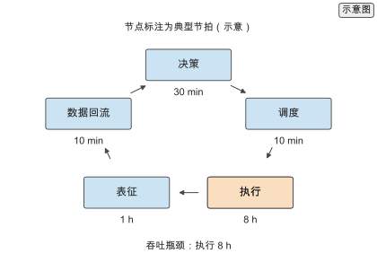
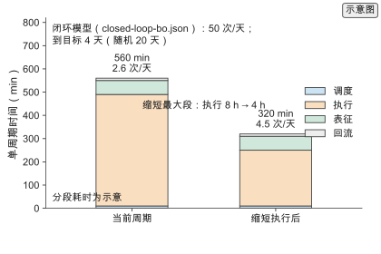
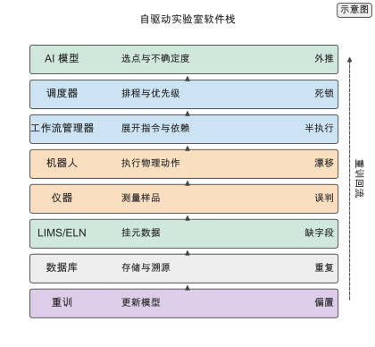
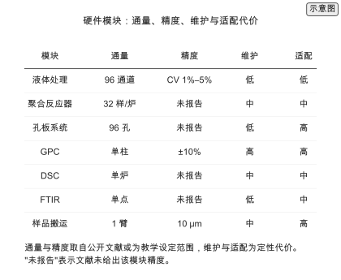
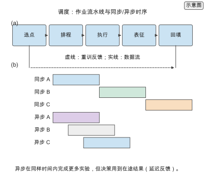
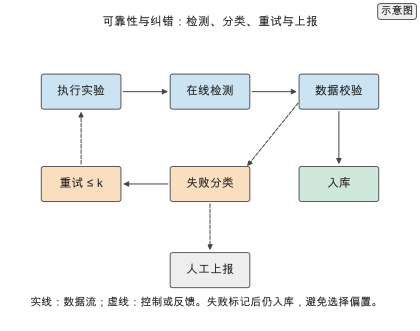
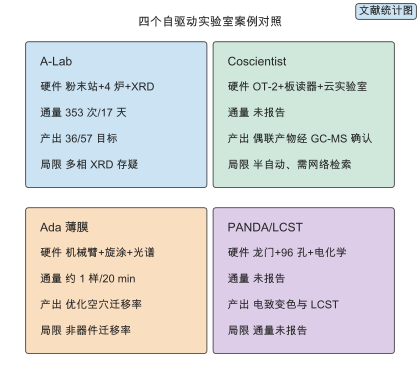
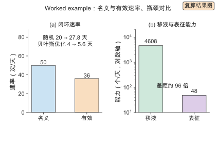
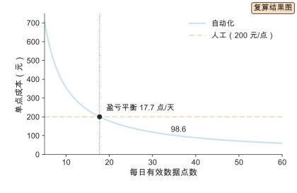

# 第 13 章 自驱动实验室与高通量自动化

凌晨三点，一条机器人平台完成了 48 个配方 `[示意]`；第二天早上，模型用这批数据更新，并给出下一批 48 个配方。这就是自驱动实验室（self-driving laboratory）的日常：实验不再由人逐条安排，而是由决策模型排队、由调度器执行、由数据库回流。

第 11 章给出序贯决策的算法，第 12 章给出合成知识。这一章把两者接到硬件上，回答"把预测接到实验需要哪些硬件、软件与调度，每一步自动化要付出什么代价"。判断是：闭环的瓶颈通常不在机器人，而在实验周期、可靠性与数据接口；把这三者核算清楚，才能判断一个自驱动实验室的真实吞吐。

本章沿一条从平台到成本的路线展开。13.1 到 13.5 定义自驱动实验室、实验平台、高通量、闭环调度与工程约束。13.6 把软件栈拆成八层并逐层说明接口与失败后果；13.7 给出硬件模块的通量、精度与适配代价；13.8 处理任务队列、设备占用、批处理与在途实验，并给出与第 11 章贝叶斯优化的接口；13.9 讲失败检测、重试与脏数据处理；13.10 用四个公开案例对照硬件、周期、通量与局限；13.11 用 `calculations/results/closed-loop-bo.json` 走通闭环吞吐、周期与利用率核算；13.12 讨论成本、人力与自动化不划算的情形；13.13 给出实践流程与选型决策；13.14 汇总练习。做工程的读者可以沿 13.1 → 13.6 → 13.7 → 13.8 → 13.11 → 13.13 直接走通。

## 13.1 自驱动实验室

### 13.1.1 组成

自驱动实验室由五部分组成：合成或配方模块、表征模块、样品传输、调度软件与决策模型。每部分有各自的节拍，典型值为合成 30 min、传输 2 min、表征 10 min、调度 1 min `[示意]`。整体节拍由最慢的一环决定：

$$t_{\text{platform}} = \max(t_{\text{synth}}, t_{\text{transport}}, t_{\text{char}}, t_{\text{sched}})$$。

上例中合成 30 min 最长，平台节拍由合成决定。提高吞吐要先优化瓶颈环节，加快非瓶颈环节不改变整体节拍：把传输从 2 min 压到 1 min `[示意]`，平台仍然每 30 min 出一个样品。

### 13.1.2 与 AI 的闭环

闭环的数据流是：模型给出候选，调度器排队，平台执行并测量，结果回流到数据库并触发重训。闭环与"离线预测加人工实验"的差别在重训频率与延迟：离线流程里模型在项目开始时训练一次，闭环里模型随每一批数据更新。

迭代频率 $f = 1/T_{\text{loop}}$，$T_{\text{loop}}$ 是闭环周期。周期从 24 h 降到 8 h，单位时间迭代次数提高 3 倍 `[复算]`。重训延迟 $T_{\text{train}}$ 与决策质量之间存在权衡：延迟越小，模型越贴近最新数据，但计算开销越大。

*图 13-1　自驱动实验室的闭环。决策、调度、执行、表征与数据回流五个环节构成闭环，节点标注典型节拍；执行段 8 h 最长，是吞吐瓶颈。（证据：示意）*

## 13.2 实验平台

### 13.2.1 液体处理与合成机器人

液体处理工作站与合成反应器是平台的执行机构。移液精度以体积的变异系数表示，教学设定的典型范围为 1%–5% `[示意]`，具体平台须以校准后的实测值为准；并行通道数 $c$ 与单次操作时间 $t_o$ 决定每小时操作数 $n = c/t_o$。机器人相对人工的优势在重复性：同一操作的方差更低，因此批量实验之间的可比性更好。

机器人并不比熟练实验员更准。它的价值是把同一动作重复成千上万次而方差不变，这正是闭环数据可用的前提——数据要能比较，动作就必须一致。

### 13.2.2 在线表征

表征接入平台有两种方式。在线测量把表征并入节拍，周期 $T = T_{\text{synth}} + T_{\text{char}}$；离线测量增加取样、传输与排队，周期 $T = T_{\text{synth}} + T_{\text{transfer}} + T_{\text{char}} + T_{\text{queue}}$。在线测量缩短周期但可选的表征种类少，通常限于光谱与色谱等快速手段；离线测量灵活，可以上 NMR、GPC 等深度表征，代价是样品传输与等待。

## 13.3 高通量实验

### 13.3.1 并行化

并行化把实验写成通道数与操作时间的函数。批次模式下，吞吐 $N_{\text{batch}} = c \cdot n_{\text{batch}}$，$c$ 是并行通道数，$n_{\text{batch}}$ 是每日批次数；连续流模式的吞吐受流速与检测器通量限制。两种模式的选择取决于反应时间与表征方式。

并行化的上限不在移液，而在样品处理与表征能力。96 通道可以同时反应 `[示意]`，但若表征只有一条色谱，样品会在表征环节排队，实际吞吐由表征决定。

### 13.3.2 数据管理

一条实验记录的元数据包括配方、条件、仪器、批次与时间戳。缺少任一项，数据在闭环中不可用：不知道批次的失败实验会污染重训，没有时间戳的数据无法回溯漂移。元数据完整率 $r$ 直接决定可用于重训的样本量：

$$N_{\text{usable}} = r \cdot N_{\text{total}}$$。

这条要求与第 3 章的可复现性一致：闭环把数据接口前置，元数据在采集时就要写全，事后补记的成本远高于当场记录。

> **练习 13-1〔核心〕：核算闭环吞吐**
>
> 给定平台并行通道数、单次操作时间与每批配方数，计算一天的实验吞吐，并与人工实验比较。平台 96 通道，单次操作 2 min，每批 96 个配方，每配方约 10 次操作，每日运行 16 h。
>
> 条件：纸笔练习，只需初等代数与量级估算。

## 13.4 闭环调度

### 13.4.1 决策与实验的耦合

决策与实验有两种耦合方式。批处理在一批实验结束后统一重训，延迟等于一批的执行时间；流式在每个结果返回后更新，延迟等于单次实验时间。批处理计算开销低、实现简单；流式响应快，但对在线学习与数据管线要求更高。

延迟与决策质量的关系是：延迟越低，模型越贴近当前数据，越能对漂移作出反应；代价是重训次数增加，计算开销随迭代次数线性上升。选择哪一种取决于漂移速度与重训成本的比值。

### 13.4.2 吞吐与周期

闭环周期由四段构成：

$$T_{\text{loop}} = T_{\text{decision}} + T_{\text{sched}} + T_{\text{run}} + T_{\text{analysis}}$$。

单位时间内的有效迭代次数 $N_{\text{iter}} = T_{\text{total}}/T_{\text{loop}}$。以 $T_{\text{total}}=30$ 天、$T_{\text{loop}}=8$ h 计，$N_{\text{iter}}\approx90$ `[复算]`；把周期降到 4 h，$N_{\text{iter}}\approx180$ `[复算]`。周期减半，迭代次数翻倍。

缩短周期比提高单次实验精度对总产出的贡献更大。精度提升受限于测量方法，而周期压缩直接翻倍迭代次数；在同样的总预算下，更多次迭代让模型更快接近目标。

*图 13-2　闭环周期与吞吐。把一个周期分解为调度、执行、表征与回流四段，缩短最大的执行段后，每日迭代次数提升。图中另标出闭环模型在 50 次实验/天、命中率 0.1% 时的到目标天数。（证据：示意）*

> **练习 13-2〔核心〕：估算一次闭环实验的周期**
>
> 把闭环周期拆成决策、调度、执行与分析四部分，分别给出耗时并求和，比较批处理与流式两种模式的周期。决策 30 min，调度 10 min，执行 8 h，分析 1 h。
>
> 条件：纸笔练习，只需初等代数与量级估算。

## 13.5 工程约束

### 13.5.1 可靠性与校准

机器人会漂移，管路会堵塞，试剂会降解。这些失败让名义吞吐打折：失败率 $p_f$ 使有效吞吐降为 $(1-p_f)N$。校准是控制漂移的手段，但校准本身占用可用时间。设可用时间 $T_{\text{avail}}$、校准时间 $T_{\text{calib}}$、停机时间 $T_{\text{down}}$，有效利用率是

$$U = \frac{T_{\text{avail}} - T_{\text{calib}} - T_{\text{down}}}{T_{\text{avail}}}$$。

校准间隔越短，数据质量越高，但校准占用可用时间越多。存在一个最优间隔，过频降低利用率，过疏增大偏差。

### 13.5.2 安全与成本

自动化平台的成本由四部分构成：硬件折旧、试剂、人工维护与停机。把它们摊到每个有效数据点上：

$$C_{\text{point}} = \frac{C_{\text{cap}}/L + C_{\text{run}} + C_{\text{labor}}}{N_{\text{valid}}},$$

其中 $C_{\text{cap}}$ 是硬件成本，$L$ 是折旧寿命（天），$C_{\text{run}}$ 是每日试剂与运行成本，$C_{\text{labor}}$ 是人工维护，$N_{\text{valid}}$ 是有效数据点数。失败与停机通过减小 $N_{\text{valid}}$ 抬高单点成本。

与人工实验相比，自动化平台的固定成本高、边际成本低。数据量小时单点成本高于人工，超过盈亏平衡点后低于人工。这个平衡点是判断是否上平台的关键数字。

> **练习 13-3〔核心〕：估算机器人利用率与成本**
>
> 给定平台每日可用时间、实际运行时间与失败率，计算有效利用率，并把硬件与运行成本摊到每个有效数据点上。可用 20 h，运行 16 h，失败率 10%；硬件 100 万元、寿命 5 年，运行与试剂 2000 元/天，人工维护 1000 元/天。
>
> 条件：纸笔练习，只需初等代数与量级估算。

## 13.6 软件栈：从模型到数据库的分层

自驱动实验室的软件不是一段脚本，而是一条从模型到数据库再回到模型的分层链。第 11 章的采集函数只负责选点；选点之后，候选要经过调度、工作流展开、设备指令、测量、元数据登记与结构化存储，才能回到训练集。这条链上任何一层的接口断裂，都会让闭环在物理上跑通、在数据上断流。

### 13.6.1 八层栈与接口

把闭环的数据流写成一条链：AI 模型给出候选与不确定度，调度器把候选排成作业，工作流管理器把作业展开成设备指令，机器人执行物理动作，仪器完成测量，LIMS/ELN 给测量挂上元数据，数据库把记录结构化存储，重训再消费这些记录更新模型。八层各自的职责、输入与失败后果列在下表与图 13-3。

| 层 | 职责 | 上游输入 | 失败后果 |
| --- | --- | --- | --- |
| AI 模型 | 选点与不确定度 | 训练集 | 外推、不确定度失准 |
| 调度器 | 排程与优先级 | 候选与预算 | 队列死锁、设备闲置 |
| 工作流管理器 | 展开设备指令与依赖 | 作业单 | 半执行、孤儿作业 |
| 机器人 | 执行物理动作 | 设备指令 | 漂移、碰撞、掉枪头 |
| 仪器 | 测量样品 | 样品与参数 | 漂移、饱和、误判 |
| LIMS/ELN | 挂元数据 | 测量记录 | 缺批次、缺时间戳 |
| 数据库 | 结构化存储与溯源 | 实验记录 | 模式漂移、重复记录 |
| 重训 | 更新模型 | 训练集 | 模型过期、反馈偏置 |

每一层的输出都要穿过一个接口才能到达下一层。设第 $i$ 次交接的字段保留率为 $\eta_{(i)}$，经过 $n$ 次交接后的端到端保留率是

$$\eta_{\text{end}}=\prod_{i=1}^{n}\eta_{(i)}$$。

取 $n=7$、每次交接保留 98% `[示意]`，$\eta_{\text{end}}=0.98^{7}=0.868$ `[复算]`。这个数字说明接口损失是累积的：单次 2% 的丢失看起来可忽略，七次之后超过 13% 的数据带着缺字段进入训练。更严重的是硬性缺失：只要有一层丢掉了批次号或时间戳，这条记录的 $\eta_{(i)}=0$，整条链的保留率归零。字段保留率与第 3 章的元数据完整率 $r$ 是同一件事，只是前者按交接分解。

接口还有延迟。闭环周期等于各层延迟之和，最长的一层决定周期；软件层的延迟通常远小于物理层，但当调度器等待人工确认、或数据库等待夜间批量写入时，软件延迟会超过实验本身。诊断方法是给每层打时间戳，把周期分解到层，而不是只看总时长。

*图 13-3　自驱动实验室的软件栈。八层从 AI 模型向下到数据库，再由重训回到模型；每层标注职责与典型失败后果。（证据：示意）*

### 13.6.2 逐层职责与失败后果

AI 模型层的职责是给出候选与不确定度。失败后果有两类：代理外推与不确定度失准，前者让选点落到训练分布之外，后者让采集函数在错误的地方探索，两者都在第 11 章讨论过。模型层不应直接写设备指令，否则更换模型要重写硬件代码。

调度器层的职责是把候选排成作业并分配设备。它维护任务队列、设备占用与优先级，决定先做哪一个、一批做几个。失败后果是队列死锁（互相等待设备）与设备闲置（队列空但设备可用）。调度器是本章新增的一层，第 11 章不涉及。

工作流管理器层的职责是把一个作业展开成带依赖的设备指令序列，例如"移液、加热、冷却、转移到表征"。它记录每步的状态，在失败时决定重试或上报。失败后果是半执行：样品停在中间态，既没完成也没回滚。学术原型常把这一层与调度器写在一起，规模变大后必须分开，否则依赖管理会失控。

机器人层与仪器层是物理层。机器人执行动作，仪器完成测量。它们的失败后果是漂移、碰撞、掉枪头、饱和与误判，详见 13.9。物理层的一个特点是失败往往不可逆：试剂已混合、样品已退火，只能重做而不能回滚。

LIMS/ELN 层的职责是给测量挂上元数据：配方、条件、仪器、批次、时间戳、操作者。它是闭环中最容易被跳过的一层，也是数据可用性的关口。失败后果是缺字段：缺批次的失败实验无法与成功实验区分，缺时间戳的记录无法回溯仪器漂移。数据库层的职责是结构化存储与溯源，失败后果是模式漂移与重复记录。重训层消费数据库，失败后果是模型过期与反馈偏置。

ChemOS 把这条链实现成"一个工作流管理器加六个模块"：学习、机器人、表征、数据库、研究者接口与在线分析，其中学习、机器人、表征三个模块是闭环的必要条件，数据库、接口与分析模块提高可用性 `[文献]`。它的数据库按先进先出排队，新请求在参数与硬件就绪时被处理，这是 13.8 调度器的雏形。AiiDA 则把工作流与溯源做成图结构，记录每一步的输入、输出与代码版本，适合计算侧的闭环 `[文献]`。两者的共同点是：把"哪一步产生什么数据、数据被谁消费"写成显式的数据结构，而不是散落在脚本里。

> **实践 Box　闭环的最小接口清单**
>
> 一条记录要能进入重训，至少需要六个字段：结构或配方标识、实验条件、测量值、不确定度或重复次数、批次标识、时间戳。前两项让模型知道输入，第三项是标签，第四项让模型知道标签噪声，第五项让失败实验可被整体剔除或加权，第六项让仪器漂移可被回溯。缺任一项，这条记录在闭环中都不可用。实践做法是在采集时用一个模式校验器拦截缺字段记录，而不是等到训练前清洗：采集时补记的成本远低于事后追查。这条清单与第 3 章的可复现性要求一致，闭环只是把它前置到了设备层。

## 13.7 硬件模块与适配代价

平台由若干模块拼成。每个模块有各自的通量、精度、维护周期与适配代价；把模块拼成平台时，代价不只来自模块本身，还来自模块之间的接口。这一节按液体处理、反应器、孔板、表征与样品搬运五类展开，并给出集成代价的核算。

### 13.7.1 液体处理与反应器

液体处理是平台的执行机构。移液精度以体积的变异系数表示，教学设定的典型范围为 1%–5% `[示意]`。PANDA 的液体处理模块在 100 μL 目标体积上做了 600 次随机实验，正向移液的平均体积 94.8 μL、标准差 1.7 μL，反向移液平均 70.6 μL、标准差 4.0 μL；加线性校准后准确度从 7.8 μL 的均方根误差降到 2.8 μL `[文献]`。这组数字给出一个工程判据：移液系统必须校准后使用，未校准的系统误差通常大于随机误差。

液体处理的通量由并行通道数 $c$ 与单次操作时间 $t_o$ 决定。若每个配方需要 $k$ 次操作，一批的移液时间是 $k\,t_o$，每天的批次数是 $T_{\text{run}}/(k\,t_o)$，其中 $T_{\text{run}}$ 是每日运行时间。取 $c=96$、$t_o=2$ min、$k=10$、$T_{\text{run}}=16$ h `[示意]`，单批 20 min，每日 48 批，通量 $96\times48=4608$ 个配方 `[复算]`。这个数字是移液侧的上限，闭环的实际速率远低于它，原因在 13.8 与 13.11。

反应器分批次与连续流两类。批次反应器用孔板或小瓶，一次处理一批样品，温度与时间可控；连续流反应器用管路，通量受流速与检测器限制，但温度与停留时间控制更精确。A-Lab 用四个箱式炉，每炉一次放八份样品，升温到 300 ℃ 后以 15 ℃/min 升到合成温度、保温 4 h 再自然冷却 `[文献]`。批次反应器的适配代价低（放样即可），代价是升温降温时间被整批共享：一批中只要有一份样品需要更长时间，整批的周期就被拉长。

> **高分子物理 Box　为什么聚合物实验的闭环比无机粉末更难**
>
> A-Lab 处理的是无机粉末，测量对象是 XRD 图谱，闭环周期以小时计。聚合物实验多出三个难点。第一是样品形态：聚合物薄膜、凝胶与熔体的制备步骤多（溶解、涂膜、退火、固化），每一步都改变后续状态，失败不可逆。第二是表征：无机粉末的主相可由 XRD 直接读出，聚合物的关键性质（分子量分布、玻璃化转变、力学响应）需要 GPC、DSC 与力学测试，单次测量从分钟到小时，且需要样品前处理。第三是慢动力学：聚合反应与链段松弛的时间尺度长，一次实验可能跨越数小时到数天，闭环周期被物理过程锁死。三点共同解释了为什么聚合物的自驱动平台多集中在薄膜与配方筛选，而不是全链合成。

### 13.7.2 孔板系统与在线表征

孔板是并行化的载体。96 孔板把 96 个反应放进同一个平面，移液、加热与光学测量都可以按孔寻址。PANDA 用底部透明且导电的定制 96 孔板，把 96 个对电极集成到一块板上，从而对整个板同时做电化学表征 `[文献]`。孔板的代价是适配：孔板尺寸、材质与底部光学性质必须与移液器、加热台和检测器匹配，换一种孔板往往要改夹具。

在线表征把测量并入平台节拍，离线表征增加取样与排队。在线手段通常是快速、非破坏的：Ada 用可见光成像、UV-Vis-NIR 反射与透射谱和四点探针测薄膜 `[文献]`；LCST 平台用 600 nm 发光二极管与光电二极管测透射率，用 Peltier 模块控温 `[文献]`；A-Lab 用 8 min 一次的 XRD 扫描 `[文献]`。离线手段（GPC、DSC、FTIR、NMR）信息更丰富，但需要取样、转移与排队，周期按小时到天计。选择在线还是离线，先看性质是否必须由离线手段给出：$T_g$ 与分子量分布需要 DSC 与 GPC，若它们是优化目标，离线环节就进入闭环周期。

表征通量是闭环的常见瓶颈。若表征有 $m$ 条并行线、单次测量时间 $T_{\text{char}}$，每日表征能力是 $m\,T_{\text{run}}/T_{\text{char}}$。取 $m=1$、$T_{\text{char}}=20$ min、$T_{\text{run}}=16$ h `[示意]`，能力是 48 个样品/天 `[复算]`，与 13.7.1 中移液侧的 4608 个配方/天相差约 96 倍。这个差距说明：并行化液体处理之后，瓶颈通常会转移到表征。

### 13.7.3 样品搬运与集成代价

样品搬运把各模块连起来。Ada 用极坐标机械臂，重复定位精度 10 μm、最大速度约 1 m/s，用真空吸盘搬运基片、用一次性枪头移液 `[文献]`；A-Lab 用两条 UR5e 协作臂在轨道上移动样品与器皿，另有一条三菱臂做粉末分配 `[文献]`；PANDA 用改装的三轴数控龙门，把移液针、电极与镜头挂在同一个工具头上 `[文献]`。机械臂的代价是标定与维护：每次更换夹具或孔板都要重新标定坐标。

集成代价随模块数超线性增长。若 $m$ 个模块两两直接对接，需要 $m(m-1)/2$ 条接口；若所有模块接到一条公共总线，接口数降到 $m$。取 $m=6$，前者 15 条、后者 6 条 `[复算]`。这解释了为什么自驱动实验室的软件栈需要一个工作流管理器（13.6）：它把 $m(m-1)/2$ 的点对点耦合换成 $m$ 条到中心的接口。ChemOS 明确把"为新硬件实现通信协议"列为部署中少有的、不能自动化的手工步骤，因为各家仪器 API 不同 `[文献]`。

*图 13-4　硬件模块与适配代价。七类模块按通量、精度、维护与适配四列对照；精度栏中"未报告"表示公开文献未给出该模块的精度数字。通量与精度取自公开文献报告或为教学设定范围，维护与适配为定性代价。（证据：文献）*

> **论文 Box　A-Lab 的模块化平台与异常率**
>
> A-Lab 把无机粉末合成拆成前驱体配制、加热与表征三个站，站间用机械臂搬运，整体由应用程序接口控制，允许人或决策代理在线提交作业。前驱体配制站用自动天平称量粉末、加乙醇与氧化锆球球磨 9 min，再用自动移液器把浆料转入氧化铝坩埚并在 80 ℃ 干燥；加热站有四个箱式炉，每炉一次放八份样品；表征站用自动球分配器与振动磨把样品磨成细粉，再压平后送入 XRD `[文献]`。平台在 1.5 年的运行中，各站平均异常率约 3.9% `[文献]`。这个数字是可靠性预算的起点：3.9% 的异常率意味着每 100 次作业约有 4 次要人工干预，闭环必须在软件层预留重试与上报路径，否则一次异常会阻塞整条队列。

## 13.8 调度与排程

调度器把模型的选点变成设备动作。它要回答四个问题：先做哪一个（优先级）、一批做几个（批处理）、设备什么时候空（占用）、在途结果怎么处理（延迟反馈）。这一节给出队列、占用、批处理与在途实验的核算，以及它与第 11 章贝叶斯优化的接口。

### 13.8.1 任务队列与设备占用

把每次实验写成一个作业，作业包含样品、配方、目标设备与优先级。作业进入队列，调度器在设备空闲且参数就绪时分派。ChemOS 的数据库按先进先出原则排队，新请求按时间顺序处理 `[文献]`。先进先出实现简单，但它不区分优先级，也不考虑设备占用，容易让长作业堵住短作业。

队列长度与等待时间由到达率与设备服务率决定。设到达率 $\lambda$（作业/小时）、单次服务时间 $T_{\text{service}}$，设备利用率是

$$\rho=\lambda\,T_{\text{service}}$$。

当 $\rho$ 接近 1 时，队列长度迅速发散：$\rho=0.5$ 时平均队长约 1，$\rho=0.9$ 时升到约 9，$\rho=0.99$ 时超过 99 `[复算]`（按 $M/M/1$ 的 $L=\rho/(1-\rho)$）。这给出调度的第一条纪律：应避免让任何一台设备长期工作在 90% 以上的利用率，除非允许长队列。取表征单线 $T_{\text{char}}=20$ min、到达率 $\lambda=2.5$ 次/h `[示意]`，$\rho=0.83$，平均队长约 5 `[复算]`。闭环的"50 次/天"若全部挤进一条表征线，利用率通常接近饱和，等待时间会吃掉迭代次数。

队列还受设备占用约束。多台设备串联时，一个作业要依次占用多台设备，调度问题从单机排队变成车间调度：作业在设备间移动，任何一台设备的空闲都不能保证整条链的空闲。判据是看每台设备的 $\rho$：只要有一台接近 1，它就是瓶颈，优化其他设备不改变吞吐，这与 13.1 中"平台节拍由最慢环节决定"是同一件事。

### 13.8.2 批处理、优先级与在途实验

批处理把若干作业合并成一批，减少设备切换与升温降温开销。A-Lab 为了把同一目标的多个前驱体配方放进同一个炉次，对每个目标固定一个合成温度 `[文献]`；这是用"牺牲单个配方的最优温度"换取"批处理能力"的典型取舍。批处理的代价是批内相关性：同一批样品共享炉次与时间窗，误差相关，有效样本量低于名义批量。第 11 章给出 $B_{\text{eff}}=B/(1+(B-1)\rho)$，取 $B=8$、批内相关 $\rho=0.5$，$B_{\text{eff}}=1.78$、信息保留约 22% `[复算]`。

优先级决定队列顺序。常见三类：探索点（信息量大）、利用点（预测最优）、维护作业（校准、清洗）。校准作业不产生数据但维持数据质量，不能无限延后；把校准写成固定优先级并预留时间窗，比让它在空闲时"顺便做"更可靠。失败重试的优先级高于新作业，否则失败样品会长期占位。

在途实验是异步并行的产物。同步批处理等一批做完再决策，异步并行让多台设备同时运行、结果陆续返回，代价是延迟反馈：决策时有些结果还没回来。把三台设备的流水线画成"传送带"，同样时间内完成的实验数从 3 增到 9，但决策用到的是旧数据 `[文献]`。缓解办法是给采集函数加在途掩码，禁止推荐正在运行、结果未回的候选；这在 BoTorch 等软件里实现为 pending points mask `[文献]`。流水线的稳态周期由最慢的一级决定：若各级时间不等，整体周期等于最大级时间，而非各级之和。

*图 13-5　调度与排程。(a) 从选点到回填的作业流水线，虚线为重训反馈。(b) 同步执行（等一批完成）与异步执行（结果在途）的时序对比，异步在同样时间内完成更多实验，但决策用到的是延迟反馈。（证据：示意）*

> **ML Box　在途实验与延迟反馈**
>
> 同步闭环里，模型在每批结束后看到全部结果再选下一批；异步闭环里，模型在部分结果未回时就要选下一批。延迟反馈让采集函数对已在运行的点重复推荐：这些点的后验方差仍高（结果未回），采集值因此偏高，模型会把预算花在重复实验上。修法有三条。第一，在途掩码：把正在运行的候选从推荐集合中排除，或把其不确定性置零。第二，延迟感知的批量采集：把"已提交但未返回"的观测当成缺失数据，用 qNEI 等批量采集函数显式建模。第三，控制并行度：并行设备数超过闭环的决策带宽时，延迟反馈的收益被重复推荐抵消。判据是看重复率：同一候选被提交两次的比例超过阈值，就应降低并行度或加掩码。

### 13.8.3 与贝叶斯优化的接口

第 11 章的贝叶斯优化输出一批候选，调度器把候选变成作业，执行后把结果回填。接口需要传递四类信息：候选的输入坐标、模型给出的预测与不确定度、批标识、以及结果的噪声估计。批标识用于在重训时对批内相关建模；噪声估计用于校准代理模型。缺批标识，模型会把同一炉次的相关误差当成独立噪声，低估方差。

接口的第二个约定是候选数与批大小一致。贝叶斯优化一次推荐 $B$ 个候选，调度器若只能凑出 $B'<B$ 个可用设备位，多出的候选要留到下一轮，否则它们的结果会在不同时间返回，破坏批的同步假设。反过来，若调度器能同时跑 $B'>B$ 个，多出的设备位会闲置。把"模型批大小"与"设备并行度"对齐，是闭环设计的一个显式参数。

接口的第三个约定是停止准则共享。第 11 章的停止准则（改进阈值、方差阈值、预算阈值）需要调度器提供剩余预算与设备状态：预算按实验次数还是设备小时计，结论不同。成本感知的采集函数把信息增益除以设备小时成本，调度器通常是唯一知道设备小时成本的层。把成本信息从调度器回传到模型，是成本感知闭环的前提。

## 13.9 可靠性与纠错

闭环长期无人值守，失败是常态而不是例外。可靠性工作的目标是三件事：检测失败、从失败恢复、防止失败污染重训。这一节给出失败分类、检测与重试、异常上报与数据校验，以及脏数据的处理。

### 13.9.1 失败检测与重试

失败分三类。硬件失败：掉枪头、管路堵塞、机械臂碰撞、阀门卡死。化学失败：反应不发生、产物分解、前驱体挥发。测量失败：信号饱和、基线漂移、图谱无法解析。三类失败的检测手段不同：硬件失败靠传感器与状态码，化学失败靠产物表征，测量失败靠质控样品与范围检查。

A-Lab 在 1.5 年运行中的平均异常率约 3.9% `[文献]`，在 17 天的闭环运行中有 17 个目标未能合成，其中 11 个受慢动力学限制、若干受前驱体挥发与产物非晶化影响，另有 3 个源于计算的稳定性误差 `[文献]`。这组数字说明：失败不都是平台的错，一部分来自化学与计算的固有不确定性，闭环要区分"可重试的失败"与"不可重试的失败"。

重试策略给出成本与成功率的权衡。设单次失败率 $p_f$，独立重试 $k$ 次后仍失败的概率是 $p_f^{k+1}$。取 $p_f=0.1$、两次重试，仍失败的概率 $0.1^{3}=0.001$ `[复算]`。重试的代价是时间与耗材：每次重试占用一个设备位，若失败率 10%、每次实验 20 min，重试把平均每样品的时间从 20 min 抬到 $20/0.9=22.2$ min `[复算]`。判据是重试的边际收益是否大于边际成本：当 $p_f$ 小、重试便宜时值得重试；当失败由系统性问题（如整批试剂失效）导致时，重试只会重复失败，应直接上报。

### 13.9.2 异常上报与数据校验

异常上报是一条逐级升级的路径：本地重试、暂停当前站、通知人工。升级阈值按失败类型设：硬件失败连续两次即暂停该站，化学失败允许更多重试，测量失败先重测再判定。暂停粒度要细：A-Lab 的设计允许在单个站人工处理异常而不中断其他站 `[文献]`，这比整线停机更划算。

数据校验分三层。第一层是模式校验：字段是否齐全、类型是否正确。第二层是范围校验：数值是否落在物理合理区间（温度为负、分子量为零都是错误）。第三层是一致性校验：同一批样品之间、不同仪器之间的结果是否自洽。质控样品是第三层的锚点：在每批中插入已知样品，用它的偏差估计该批的系统误差，偏差超限则整批标记为可疑。

A-Lab 提供了一个数据校验的真实教训：平台自主判定 40 个目标合成成功，人工用 Rietveld 精修复核后发现其中 4 个仅凭 XRD 无法确认、判为不确定 `[文献]`。按 40 计，自动判定的不确定率约 10% `[复算]`。这 10% 不是随机噪声，而是系统性的：多相混合物的 XRD 图谱与目标相的图谱可能重叠，自动解析会把混合物判成目标相。结论是自动表征必须配一个人工复核的抽样环节，或把"不确定"作为第三个标签而不是强行二分类。

*图 13-6　可靠性与纠错流程。实线为数据流，虚线为控制或反馈；失败样品经分类后重试或上报，标记后仍入库。（证据：示意）*

### 13.9.3 闭环中的脏数据处理

脏数据进入重训有两种方式：缺字段与错误标签。缺字段的记录直接不可用，按 13.6.1 的保留率剔除；错误标签更隐蔽，它会被模型当成真值学进去。处理错误标签的第一步是标记而不是删除：给每条记录一个置信度或"已复核/未复核"标志，重训时按置信度加权或只用已复核子集。

更麻烦的是选择偏置。若把失败实验直接丢弃，训练集只剩成功样本，模型学到的分布与真实分布不同，会高估新配方的成功率，进而在下一轮推荐中更乐观。正确做法是把失败实验作为有信息的样本保留：它的标签是"未命中"或"低于阈值"，属于删失数据。删失数据的处理有三条路：把失败作为独立的失败概率模型（二分类辅助任务）；用删失回归；或把失败样本降权但不删除。三条路的共同点是承认失败携带信息，而不是把它当噪声。

反馈回路的偏置要单独诊断。闭环反复在模型预测最优的区域采样，训练集会逐渐集中在该区域，模型对远离该区域的结构越来越不确定，但采集函数仍可能因为方差项而选它们。诊断方法是监控训练集的空间覆盖：若新样本到训练集中心的距离逐轮下降，说明闭环在收缩而不是在探索。修法是显式加入覆盖惩罚，或周期性插入随机对照点。这与第 11 章的探索–利用取舍是同一件事，只是发生在数据分布而非单次选点上。

> **失败 Box　A-Lab 的四类失败模式**
>
> A-Lab 在 17 天内尝试合成 57 个目标，17 个未成功。事后分析把它们归成四类：慢反应动力学（11 个，反应步骤驱动力低于 50 meV/atom）、前驱体挥发（含铵磷酸盐前驱体在 450 ℃ 以上蒸发，改变净化学计量）、产物非晶化（一个磷酸盐目标在高温熔融后难以结晶）、以及计算误差（三个目标因 0 K 密度泛函的稳定性误差被误判为可合成）`[文献]`。前三类是实验障碍，可以通过升温、延长保温、改进混合或换前驱体缓解；作者手工重新研磨并升温后，又成功合成 2 个目标，成功率从 63% 升到 67% `[文献]`。第四类不能靠实验解决，只能反馈给计算数据库修正。这个案例的教训是：失败模式必须分类记录，因为不同类别的修法完全不同，混在一起的"失败"无法指导下一轮。

## 13.10 真实案例

自驱动实验室已有若干公开的完整实现。这一节选四个有代表性的案例，按硬件配置、闭环周期、通量、真实产出与局限对照，数字均取自公开文献，未报告的项明确标注。

### 13.10.1 A-Lab：无机粉末的自主合成

A-Lab 面向无机粉末的固相合成。硬件配置是三个站：前驱体配制站（自动天平、球磨、自动移液、干燥）、加热站（四个箱式炉，每炉八份样品）、表征站（振动磨、压片、XRD），站间用两条 UR5e 协作臂与一条三菱臂搬运，整体由应用程序接口控制 `[文献]`。闭环周期以小时计：升温、保温 4 h、冷却、研磨与 8 min 的 XRD 扫描构成一个循环。在 17 天连续运行中，平台完成 353 次实验，成功合成 57 个目标中的 36 个，成功率 63%，平均每天产出略多于 2 个新材料 `[文献]`。主动学习为 9 个目标找到了更高产率的路线，其中 6 个从零产率起步 `[文献]`。局限有四点：XRD 对多相混合物的判定不确定（40 个判定成功中 4 个存疑）；慢动力学与挥发限制了一部分目标；前驱体仅限空气稳定的二元化合物，限制了路线选择；4 h 的短保温时间不足以让部分反应完全 `[文献]`。

### 13.10.2 Coscientist：语言模型编排的实验

Coscientist 用大语言模型编排化学实验。硬件配置是 Opentrons OT-2 液体处理器加加热振荡模块、紫外–可见板读器，以及 Emerald Cloud Lab 的云端实验接口；软件由规划、网络检索、代码执行、文档检索与实验执行五个模块组成，规划器调用其余模块收集信息并生成协议 `[文献]`。闭环周期与通量文献未报告：该工作未实现全自动搬运，孔板由人工移动，属于半自动。真实产出是两类：一是用液体处理器设计并执行了 Suzuki 与 Sonogashira 偶联反应，产物由气相色谱–质谱确认；二是在两个公开的反应条件数据集上做优化，20 次迭代覆盖条件空间的 5.2% 与 6.9%，其归一化优势不低于对照的贝叶斯优化 `[文献]`。局限是自动化程度不完整、依赖网络检索来约束幻觉，且实验能力受可用试剂限制 `[文献]`。

### 13.10.3 薄膜与聚合物自驱动平台

薄膜与聚合物方向有三个有代表性的平台。Ada 面向有机半导体薄膜：用极坐标机械臂（重复定位精度 10 μm、移液平均准确度 5 μL）完成配墨、旋涂、退火、成像、UV-Vis-NIR 与四点探针测量，一个样品约 20 min，耗材每 7 个样品补充一次，决策由 ChemOS 与 Phoenics 贝叶斯优化给出 `[文献]`。PANDA 面向电沉积聚合物薄膜：用改装数控龙门把移液针、电极与远心镜头挂在同一工具头，在底部透明导电的 96 孔板上做电化学与透射光学测量，液体处理校准后准确度 2.8 μL，用拉丁超立方采样加贝叶斯优化优化 PEDOT:PSS 的电致变色切换 `[文献]`。LCST 平台面向温敏聚合物：五个独立模块并行，每个模块用 600 nm 发光二极管与光电二极管测透射率、用 Peltier 模块控温，用贝叶斯优化在盐溶液空间中把 LCST 调到指定值，定位是低成本的"节俭孪生" `[文献]`。另一个高通量平台报告了每天最多 6048 个薄膜的自动化制备能力 `[文献]`，这是目前公开数字中通量最高的薄膜平台之一。

### 13.10.4 对照与共性

把四个案例并排看，共性有三条。第一，瓶颈在表征而不在移液：移液侧可达每天数千个配方，闭环速率却由单线表征决定，A-Lab 的 8 min XRD 与 Ada 的 20 min 样品周期都是例子。第二，成功率不是 100%：A-Lab 的 63%、PANDA 的优化命中、Coscientist 的部分任务，都说明闭环的价值在缩短搜索而不是保证成功。第三，元数据与失败记录决定数据能否复用：A-Lab 的 3.9% 异常率与 10% 的 XRD 不确定率都必须写进数据，否则下一轮优化会建立在错误标签上。

*图 13-7　自驱动实验室案例对照。四行分别为 A-Lab、Coscientist、Ada 薄膜平台与 PANDA/LCST 聚合物平台，每行给出硬件、通量或周期、产出与局限；未报告项标注"未报告"，数字取自公开文献。（证据：文献）*

## 13.11 Worked example：闭环吞吐、周期与利用率核算

这一节用 `calculations/results/closed-loop-bo.json` 的场景走一遍核算，把 13.1 到 13.9 的公式串起来。场景中的空间规模与命中比例来自该结果文件，平台参数为声明值 `[示意]`，所有中间量标注 `[复算]`。

### 13.11.1 任务与参数

候选空间 $10^{6}$，目标为前 $0.1\%$，即空间中期望有 1000 个命中候选 `[复算]`。随机搜索首次命中的期望实验次数是 $1/p=1000$，贝叶斯优化在声明加速比 5 下是 200 次 `[复算]`。平台声明速率 50 次实验/天，因此随机搜索到目标约 20 天、贝叶斯优化约 4 天 `[复算]`。

平台参数取 13.7 的声明值 `[示意]`：并行通道 $c=96$、单次操作 $t_o=2$ min、每配方操作数 $k=10$、每日运行 $T_{\text{run}}=16$ h、每日可用 $T_{\text{avail}}=20$ h、失败率 $p_f=0.1$、批量 $B=8$、单线表征时间 $T_{\text{char}}=20$ min。成本参数取 13.5 的声明值 `[示意]`：硬件 $C_{\text{cap}}=10^{6}$ 元、寿命 $L=5$ 年、每日运行与试剂 $C_{\text{run}}=2000$ 元、每日人工维护 $C_{\text{labor}}=1000$ 元。

### 13.11.2 吞吐与周期

移液侧的批次时间是 $k\,t_o=20$ min，每日 48 批，移液通量 $96\times48=4608$ 个配方/天 `[复算]`。表征侧单线能力是 $16\times60/20=48$ 个样品/天 `[复算]`。两者相差约 96 倍，说明闭环的实际速率由表征决定，声明的 50 次/天与表征侧同量级 `[示意]`。这与 13.1 的"平台节拍由最慢环节决定"一致：把移液从 96 通道加到 384 通道不改变闭环吞吐。

批周期由批量与速率给出。批量 $B=8$、速率 50 次/天，一个批次的墙钟时间约 $8/50=0.16$ 天 $=3.84$ h `[复算]`；若考虑 13.8.2 的流水线，稳态周期由最慢一级决定，异步并行把等待时间藏进执行时间，但不改变表征侧的总容量。

失败率把名义吞吐打折。有效利用率取

$$U=\frac{T_{\text{run}}}{T_{\text{avail}}}\,(1-p_f)=0.8\times0.9=0.72$$。

有效速率 $N_{\text{eff}}=U\times50=36$ 次/天 `[复算]`。到目标的日历时间随之变化：随机搜索 $1000/36=27.8$ 天、贝叶斯优化 $200/36=5.6$ 天 `[复算]`。与名义值的 20 天与 4 天相比，失败率把周期拉长了约 40% `[复算]`。这个修正很重要：报告闭环性能时若只给名义速率，会系统性低估到目标的时间。

### 13.11.3 利用率与成本核算

单点成本按 13.5.2 的公式核算：

$$C_{\text{point}}=\frac{C_{\text{cap}}/L+C_{\text{run}}+C_{\text{labor}}}{N_{\text{valid}}}$$。

硬件折旧 $C_{\text{cap}}/L=10^{6}/(5\times365)=547.9$ 元/天 `[复算]`，加上运行与人工共 3000 元/天，每日总成本 3547.9 元；有效数据点数 $N_{\text{valid}}=N_{\text{eff}}=36$，得到 $C_{\text{point}}=3547.9/36=98.6$ 元/点 `[复算]`。失败与停机通过 $N_{\text{valid}}$ 抬高单点成本：若失败率从 10% 升到 20%，$U$ 降到 0.64、$N_{\text{valid}}=32$、$C_{\text{point}}$ 升到 110.9 元/点 `[复算]`。

把这组数字与人工对照。人工实验若按每人每天产出 5 个有效点、人工成本 1000 元/天计，单点成本 200 元 `[示意]`。自动化的单点成本随数据量下降：在 36 点/天时是 98.6 元，在 10 点/天时升到 354.8 元 `[复算]`。盈亏平衡点由 $3547.9/N=200$ 给出，$N=17.7$ 点/天 `[复算]`：数据量低于约 18 点/天时，人工更便宜；高于这个量级，自动化在单点成本上占优。这个平衡点是判断是否上平台的第一个数字。

### 13.11.4 结论

四条结论。第一，闭环速率由表征侧决定，移液侧的数千个配方/天是名义能力，不是闭环吞吐。第二，失败率通过有效利用率把名义速率从 50 降到 36 次/天，到目标时间从 4 天拉到 5.6 天。第三，单点成本 98.6 元，盈亏平衡约 18 点/天。第四，这些数字都建立在声明参数上，真实平台必须用自己的实测参数替换后重算。四条结论描述的是声明模型，不是任何具体平台的实测。

真实平台还受故障率、人工介入与样品制备的影响：故障与停机降低有效吞吐，人工复核与异常处理占用额外时间，样品制备（溶解、涂膜、退火、固化）往往不在平台节拍内。本书未开展这些平台的实测基准，因此上面的吞吐、周期与成本应读作按声明参数得到的理想算术下界，而不是对真实平台的预测；真实运行时间受硬件、批大小与软件实现影响，需要读者在自己的硬件上实测。

*图 13-8　Worked example 的核算。(a) 名义速率 50 次/天与有效速率 36 次/天，以及对应的到目标天数（随机 20/27.8 天、贝叶斯优化 4/5.6 天）。(b) 移液侧 4608 个配方/天与表征侧 48 个样品/天的对数对比，差距约 96 倍。参数为声明值，结果为复算。（证据：复算）*

## 13.12 成本与人力：什么时候自动化不划算

自动化不是默认答案。它把固定成本抬高、把边际成本压低，是否划算取决于数据量、任务多样性与维护负担。这一节给出成本结构、盈亏平衡与不划算的情形。

### 13.12.1 成本结构与人力

成本分四块：硬件折旧、试剂与耗材、人工维护、停机损失。硬件折旧按寿命摊到每天，$C_{\text{cap}}/L$；试剂与耗材随实验数增长；人工维护不随实验数线性增长，但要求技能更高；停机损失等于闲置期间的折旧与机会成本之和。13.11 的例子中，硬件折旧 548 元/天、运行与人工 3000 元/天，折旧约占总成本的 15%。

自动化改变的是人力的构成，而不是消除人力。A-Lab 的异常率 3.9%、XRD 判定不确定率约 10%，都说明平台仍需要人工处理异常与复核数据 `[文献]`。人力从"执行实验"转向"维护设备、清洗数据、设计实验与复核结果"。判断人力是否真的下降，要把数据整理与复核的时间算进去：若平台每天产生 36 个有效点、每个点需要 5 min 复核，每天就是 3 h 的复核工作量，与一个半人工岗位相当。自动化把瓶颈从手移到脑，不必然减少总人力。

### 13.12.2 盈亏平衡

把自动化与人工的单点成本写成数据量的函数。自动化是 $C_{\text{auto}}(N)=(C_{\text{cap}}/L+C_{\text{run}}+C_{\text{labor}})/N$，随 $N$ 下降；人工近似为常数 $C_{\text{manual}}$。两者的交点

$$N^{*}=\frac{C_{\text{cap}}/L+C_{\text{run}}+C_{\text{labor}}}{C_{\text{manual}}}$$

是盈亏平衡的数据量。取 13.11 的参数与 $C_{\text{manual}}=200$ 元/点 `[示意]`，$N^{*}=3547.9/200=17.7$ 点/天 `[复算]`。低于这个量级，人工更便宜；高于它，自动化在单点成本上占优。$N^{*}$ 随硬件成本上升、随人工单价上升而下降：人工越贵、平台越便宜，自动化越早划算。

盈亏平衡只比较单点成本，不比较能力。自动化的真正价值可能在人工做不到的地方：夜间与周末连续运行、精确控制难以手动复现的时序、以及产生结构化的元数据。这些能力无法只用单点成本衡量，需要在决策时单独列出。

*图 13-9　成本盈亏平衡。自动化单点成本随每日有效数据点数下降，人工成本近似为常数；交点约 18 点/天。参数为声明值，结果为复算。（证据：复算）*

### 13.12.3 什么时候自动化不划算

五类情形下自动化不划算。第一，数据量小：需求低于约 18 点/天时，固定成本摊不开。第二，任务多样：每个实验的流程都不同，机器人每次都要重新配置，适配成本超过收益。第三，项目周期短：平台的建设与调试周期以月计，项目短于建设周期时无法回本。第四，化学体系不稳定：试剂易降解、反应难复现，失败率把有效吞吐压得过低。第五，表征无法接入：若关键性质只能离线测、且离线测量无法自动化，闭环周期由人工取样锁死，平台的并行优势被抵消。

隐藏成本要单独核算。集成成本：每接入一台新仪器要写通信协议，ChemOS 把这列为少有的、不能自动化的手工步骤 `[文献]`。校准成本：定期校准占用可用时间，校准间隔越短数据越准、利用率越低。耗材成本：枪头、基片、坩埚等消耗品常被低估，Ada 每 7 个样品补充一次耗材 `[文献]`。设施成本：通风、供电、安全防护与空间。把四项隐藏成本计入后，盈亏平衡点会显著右移。

工业场景还带来学术场景不常遇到的四类约束。它们不进入上面的成本公式，却直接决定闭环能否落地。第一是数据版权与私有数据无法公开。企业配方、工艺窗口与客户样品通常受保密协议约束，不能进入公开数据集，也不能上传到第三方模型服务；其影响是闭环的数据层必须自持：训练、检索与推理要么在本地完成，要么在受控的私有环境内完成，公开预训练模型只能作为起点，模型的复现与审计必须在内部数据上重建。这一约束把"用公开数据预训练、用内部数据微调"从可选策略变成默认架构，也要求把数据分级与访问控制写进接口设计，而不是留到上线前再补。

第二是电子实验记录本（ELN）异构。同一企业内不同课题组、不同年代上线、不同厂商的 ELN 往往字段定义、单位与接口各不相同，历史记录以自由文本或扫描件保存；其影响是闭环的元数据接口不能假设统一模式，必须在 LIMS/ELN 与数据库之间加一层字段映射与规范化，并把无法映射的历史记录标记为不可直接用于重训。把这一层显式建出来，等于把 13.6 的字段保留率问题从"清洗时再处理"提前到"采集时即规范"，否则同一批实验在不同记录系统里会得到互不可比的数据。

第三是标注与实验成本，以及实验人员与计算团队之间的沟通鸿沟。工业样品与工况的标签由生产或中试实验产生，单次实验的排产、物料与停机成本远高于实验室，标签的获取速度成为筛选强度的实际上限；实验人员关心操作可行性与安全，计算人员关心指标与误差，两套语言在交接候选清单时容易丢失约束。其影响是闭环设计要把实验预算当作一级约束，先反推候选清单长度，再决定模型与生成器的复杂度，并让候选清单携带可执行的实验字段（配方、条件、预期结果与不确定度），约定谁在什么节点确认，把接口写成字段与审批记录，而不是依赖口头约定。

第四是审计与合规对实验记录的要求。受监管行业要求实验记录可追溯、不可篡改并长期保存，模型的每次推荐与每次人工修改都要留痕；其影响是闭环的日志层必须按审计标准设计（追加写、带校验、保留期），并把模型版本、数据版本与审批状态绑定到每条记录。缺少这一层，闭环的产出即使技术上可复现，也无法用于合规申报；因此审计字段要在平台设计阶段确定，而不是在复盘时补录。

> **实践 Box　自动化平台的人力结构**
>
> 一个运行中的自驱动实验室通常需要四类角色。平台工程师负责硬件维护、标定与异常处理，通常是唯一需要常驻的角色。数据工程师负责元数据模式、数据库与数据校验，工作量在平台上线初期最大。实验设计者负责定义目标、约束与停止准则，并审查模型推荐是否化学合理。领域专家负责复核异常结果与不确定判定，A-Lab 的人工 Rietveld 复核属于这一类。四类角色中，数据工程师最容易被忽略：没有他，平台会产生大量缺字段记录，闭环在数据侧断流。把角色写进项目计划，是自动化不变成"无人值守的混乱"的前提。

## 13.13 实践流程与选型决策

这一节把前文收成一条可执行的流程，并给出任务与平台的对照。

### 13.13.1 从需求到平台

按七步走。第一步，写清闭环要优化的目标与约束：目标是一个标量还是 Pareto 前沿，约束是硬约束还是软约束，这与第 10、11 章的设定一致。第二步，测瓶颈：分别估移液、合成、表征与决策的节拍，取最大者，瓶颈决定闭环速率。第三步，检查元数据就绪度：数据库、LIMS/ELN 与仪器接口能否提供 13.6.2 的六个字段，缺项先补。第四步，选模块并数接口：模块数 $m$ 对应 $m(m-1)/2$ 条点对点接口，超过约 6 个模块就应引入工作流管理器。第五步，写可靠性方案：失败分类、检测手段、重试次数与上报路径。第六步，算成本与盈亏平衡：用 13.12.2 的 $N^{*}$ 判断是否上平台。第七步，先跑一个小闭环：用少量候选验证接口与重试路径，再放大。

流程的顺序不能颠倒。常见错误是先买硬件再找瓶颈：平台建成后才发现表征只有一条线，移液侧的数千个配方/天难以直接转化为闭环吞吐。正确的顺序是先测瓶颈，再按瓶颈选模块。

### 13.13.2 任务—平台对照

| 任务 | 数据量级 | 首选平台 | 理由 |
| --- | --- | --- | --- |
| 配方筛选 | $10^{3}$–$10^{4}$ | 液体处理加在线光学 | 通量高、表征快、闭环周期短 |
| 反应条件优化 | $10^{2}$–$10^{3}$ | 液体处理加色谱 | 需要产物定量、可批量 |
| 聚合物薄膜 | $10^{2}$–$10^{3}$ | 旋涂加光谱与电学 | 薄膜制备与表征可在线 |
| 分子量/热性质 | $10^{1}$–$10^{2}$ | 离线 GPC/DSC | 表征慢、需前处理 |
| 序列合成 | $10^{1}$–$10^{2}$ | 合成机器人加离线表征 | 步骤多、表征慢 |

表里的首选平台是默认起点，不是结论。实际选型要把表征时间、失败率与元数据就绪度一起代入：表征时间超过合成时间时，闭环速率由表征决定，应先加表征线而不是加移液通道；失败率超过 20% 时，应先解决化学复现性而不是上更多自动化。

### 13.13.3 复现清单

> **可复现 Box　自驱动实验室的记录清单**
>
> 一个闭环实验要能被复现，需要记录四类信息。平台：硬件型号与配置、通道数、标定方法与标定日期、耗材批次。流程：每一步的设备指令、时间戳、温度与时长、异常与重试记录。数据：原始测量文件、处理脚本与版本、元数据字段、失败与不确定标记。决策：代理模型与采集函数、初始数据、批量与并行度、停止准则、每一轮的推荐与结果。缺少任何一类，闭环的产出都无法归因：没有标定日期无法判断漂移，没有失败标记无法重建真实分布，没有决策记录无法区分"模型好"与"运气好"。本书的对应记录在 `calculations/results/` 与各章实验目录，`calculations/README.md` 给出复现命令。

## 13.14 练习与实验清单

本章的练习围绕"核算闭环"展开。核心练习 13-1 至 13-3 给出闭环吞吐、周期与利用率三个基本核算；延伸实验 13-4 至 13-9 把核算扩到软件接口、硬件模块、调度、可靠性、案例对照与盈亏平衡。

| 编号 | 主题 | 类型 | 记录 |
| --- | --- | --- | --- |
| 13-1 | 核算闭环吞吐 | 核心 | 在线扩写资料 13.3.2 |
| 13-2 | 估算一次闭环实验的周期 | 核心 | 在线扩写资料 13.4.2 |
| 13-3 | 估算机器人利用率与成本 | 核心 | 在线扩写资料 13.5.2 |
| 13-4 | 软件栈接口与字段保留率 | 延伸 | 在线扩写资料 13.6 |
| 13-5 | 硬件模块通量与适配代价 | 延伸 | 在线扩写资料 13.7 |
| 13-6 | 调度队列与在途实验 | 延伸 | 在线扩写资料 13.8 |
| 13-7 | 失败检测与重试预算 | 延伸 | 在线扩写资料 13.9 |
| 13-8 | 真实案例对照 | 延伸 | 在线扩写资料 13.10 |
| 13-9 | 自动化盈亏平衡 | 延伸 | 在线扩写资料 13.12 |

## 谬误与陷阱

**误区：闭环的瓶颈在机器人速度。** 平台节拍由最慢环节决定，机器人往往不是最慢的一环。若合成 30 min、传输 2 min 而表征 20 min，把传输减半不改变吞吐，只有缩短最长环节才提升产出。正确做法是先测各环节节拍、找出瓶颈再优化，而不是默认机器人是瓶颈。

**误区：机器人的优势是精度更高。** 移液精度以 1%–5% 的变异系数计，未必优于熟练实验员。机器人的真正优势在重复性：同一动作的方差低，批量数据因此可比。正确做法是评价机器人时看重复性而非绝对精度，并把校准后的实测值写进记录。

**误区：提高单次实验精度最有效。** 精度提升受测量方法限制，收益随方法逼近极限而递减。周期减半则让迭代次数翻倍，在总预算固定时对总产出的贡献更大。正确做法是先压缩周期，再对瓶颈环节考虑提高精度。

**误区：数据采集完再整理。** 缺批次或时间戳的数据在闭环中不可用，会污染重训，$N_{\text{usable}}=r\,N_{\text{total}}$ 直接决定可用样本量。事后补记的成本远高于当场记录，部分字段一旦丢失无法恢复。正确做法是在采集时用模式校验器拦截缺字段记录，把元数据写全再入库。

**误区：通量等于吞吐。** 移液侧每天数千个配方是名义通量，闭环吞吐由表征、调度与失败率共同决定。13.11 的例子中，移液 4608 个配方/天最终只对应 36 个有效实验/天，差了两个数量级。正确做法是报告闭环吞吐时用有效速率，并注明瓶颈环节。

**误区：模块越多，平台越强。** 模块数 $m$ 对应 $m(m-1)/2$ 条点对点接口，集成代价超线性增长，调试成本会吞掉功能收益。超过约 6 个模块就应引入工作流管理器，把点对点耦合换成到中心的接口。正确做法是先数接口再决定是否加模块，而不是先加功能。

**误区：自动化一定省钱。** 自动化把固定成本抬高、边际成本压低，只有数据量超过盈亏平衡点（13.11 的例子约 18 点/天）才在单点成本上占优。数据量小、任务多样或项目周期短时，人工更便宜。正确做法是先算 $N^{*}$ 再决定是否上平台，并把集成、校准、耗材与设施等隐藏成本计入。

**误区：失败实验直接丢弃。** 丢弃失败样本会让训练集只剩成功样本，模型高估成功率，下一轮推荐更乐观。失败是删失数据，携带"未命中"的信息。正确做法是保留并标记失败样本，用辅助分类任务、删失回归或降权处理，而不是删除。

**误区：软件栈只是"跑脚本"。** 从模型到数据库要穿过七次交接，单次 2% 的字段丢失累积到 13%，任一层的硬性缺失都会让整条记录不可用。接口断裂时闭环在物理上跑通、在数据上断流。正确做法是把分层与接口当作闭环的一部分设计与测试，而不是实现细节。

## 本章数字速查

与全书通用数字重复的项参见附录 F：N10–N11（闭环采样效率与日历时间）。下表只列本章新增数字。

本章数字沿用前言定义的六级证据标签（定义见 00-前言）。本章没有本书自测的原始实验或仪器测量。平台的吞吐、周期、成本与利用率在正文中分两类：**平台声明参数**（合成节拍、并行通道、单次操作时间、移液精度、失败率、表征时间、硬件与人工成本等）标 `[示意]`；**按声明参数复算的结果**（有效速率、到目标天数、单点成本、盈亏平衡点等）标 `[复算]`。A-Lab、Coscientist、Ada、PANDA、LCST 等公开平台的硬件、异常率、成功率与产出是文献报告值，标 `[文献]`；由文献数字相除得到的量（如 353 次/17 天）标 `[复算]`。真实平台还受故障率、人工介入与样品制备的影响；本书没有对这些平台开展实测基准，因此本章实际用到 `[复算]`、`[文献]`、`[示意]` 三级。

| 量 | 数值 | 说明 | 证据 |
| --- | --- | --- | --- |
| 平台节拍（示例） | 合成 30 min | 声明节拍，由最慢环节决定 | 示意 |
| 移液精度 | 变异系数 1%–5% | 教学设定范围，体积重复性 | 示意 |
| 迭代频率（24 h→8 h） | 提高 3 倍 | $f=1/T_{\text{loop}}$ | 复算 |
| 闭环周期（决策 30 + 调度 10 + 执行 480 + 分析 60） | 580 min ≈ 9.7 h | 分段为声明值，求和后执行占约 83% | 复算 |
| 30 天迭代次数（8 h / 4 h） | 90 / 180 | $N_{\text{iter}}$ | 复算 |
| 有效利用率（20 h 可用、16 h 运行、失败 10%） | 72% | 声明参数，名义 80% | 复算 |
| 元数据完整率 $r$ | $N_{\text{usable}}=r\,N_{\text{total}}$ | 缺项数据不可用 | 文献 |
| 软件栈交接保留率（7 次、每次 98%） | 86.8% | 声明交接次数与保留率 | 复算 |
| 移液校准（PANDA，100 μL） | 准确度 2.8 μL | 校准前 7.8 μL | 文献 |
| 移液通量（96 通道、2 min、10 步、16 h） | 4608 配方/天 | 理想算术下界（声明参数） | 复算 |
| 表征通量（单线、20 min、16 h） | 48 样品/天 | 理想算术下界（声明参数） | 复算 |
| 集成接口数（$m=6$） | 15 / 6 | 点对点 / 总线 | 复算 |
| 设备利用率（$\lambda=2.5$ 次/h、$T=20$ min） | 0.83 | 声明到达率与服务时间 | 复算 |
| 重试后仍失败（$p_f=0.1$、两次重试） | 0.001 | 声明失败率 | 复算 |
| A-Lab 异常率 | 3.9% | 1.5 年运行 | 文献 |
| A-Lab XRD 不确定率 | 约 10%（4/40） | 人工复核 | 复算 |
| A-Lab 通量 | 353 次/17 天 ≈ 20.8 次/天 | 文献数字相除 | 复算 |
| A-Lab 成功率 | 63%（36/57） | 主动学习后 67% | 文献 |
| Ada 样品周期 | 约 20 min | 耗材每 7 样补充 | 文献 |
| 薄膜平台通量 | 6048 薄膜/天 | 自动化制备 | 文献 |
| 有效速率（50 次/天、$U=0.72$） | 36 次/天 | 声明参数复算，$N_{\text{eff}}=U N$ | 复算 |
| 到目标天数（随机 / 贝叶斯优化） | 27.8 / 5.6 天 | 有效速率下 | 复算 |
| 单点成本 | 98.6 元/点 | 声明成本参数，36 点/天 | 复算 |
| 盈亏平衡 | 17.7 点/天 | 声明人工单价 200 元/点 | 复算 |

## 延伸阅读

- 软件栈与编排：ChemOS 的工作流管理器与六模块架构，AiiDA 的工作流与溯源。[^chemos][^aiida]
- 调度与在途实验：有在途实验时的搜索策略、BoTorch 的在途掩码与 Optuna 的调度与超参搜索。[^pending][^botorch][^optuna]
- 材料加速平台：AMANDA 的软硬件架构与平台演化。[^amanda]
- 薄膜与聚合物案例：Ada 薄膜平台、PANDA 电沉积聚合物平台、温敏聚合物 LCST 平台与多元有机光伏高通量平台。[^ada][^panda][^lcst][^opv]
- 自驱动实验室案例：薄膜材料的自驱动平台给出决策—执行—表征闭环的早期完整实现。[^sdl]
- 自主合成：A-Lab 把机器人合成与计算筛选结合，验证无机材料的自主发现。[^alab]
- 自主实验综述：系统梳理平台组成、调度与数据接口。[^review]
- 智能体实验：Coscientist 让语言模型编排化学实验，是第 14 章智能体的实验侧对应。[^coscientist]
- 优化基础：贝叶斯优化教程、材料域贝叶斯优化基准、批量贝叶斯优化、多保真与成本感知贝叶斯优化。[^bo][^bomat][^batchbo][^mfbo][^cabo]
- 主动学习与实验设计：主动学习综述、行列式点过程、扫描探针主动测量与深度集成不确定度。[^alreview][^dpp][^spm][^ens]
- 计算与合成侧闭环：逆合成规划、图生成策略与小数据聚合物预测。[^aiz][^gcpn][^deeppoly]
- 高通量筛选：热导率的高通量筛选。[^htc]
- 复算与推导：闭环样本效率的复算见 `calculations/results/`；周期、利用率与单点成本公式的推导见[第 13 章在线扩写资料](../archive/outlines/extensions/13-自驱动实验室与高通量自动化.md)。

[^sdl]: 自驱动实验室案例见 ^\[24\]^；其预印本见[归档全文](../references/files/papers/self-driving-lab-thinfilm-2019.pdf)。

[^alab]: A-Lab 见[归档快照](../references/files/papers/alab-2023.html)。

[^review]: 自主实验系统综述见[归档快照](../references/files/papers/self-driving-lab-review-2023.html)。

[^coscientist]: Coscientist 见[归档快照](../references/files/papers/coscientist-2023.html)。

[^bo]: 贝叶斯优化教程见[归档全文](../references/files/papers/bo-review-2018.pdf)。

[^chemos]: ChemOS 编排软件见[归档全文](../references/files/papers/chemos-2020.html)。

[^aiida]: AiiDA 工作流与溯源见[归档全文](../references/files/papers/aiida-2016.pdf)。

[^pending]: 在途实验的搜索策略见[归档全文](../references/files/papers/pending-experiments-2023.pdf)。

[^botorch]: BoTorch 与在途掩码见[归档全文](../references/files/papers/botorch-2019.pdf)。

[^optuna]: Optuna 调度与超参搜索见[归档全文](../references/files/papers/optuna-2019.pdf)。

[^amanda]: AMANDA 与材料加速平台见[归档全文](../references/files/papers/amanda-2021.pdf)。

[^ada]: Ada 薄膜自驱动平台见[归档全文](../references/files/papers/self-driving-lab-thinfilm-2019.pdf)；期刊版本见 ^\[24\]^。

[^panda]: PANDA 电沉积聚合物平台见[归档全文](../references/files/papers/panda-2024.pdf)。

[^lcst]: 温敏聚合物 LCST 平台见[归档全文](../references/files/papers/sdl-lcst-2025.pdf)。

[^opv]: 多元有机光伏高通量平台见[归档全文](../references/files/papers/opv-self-driving-2019.pdf)。

[^bomat]: 材料域贝叶斯优化基准见[归档全文](../references/files/papers/bo-materials-2021.pdf)。

[^batchbo]: 批量贝叶斯优化见[归档全文](../references/files/papers/batch-bo-2018.pdf)。

[^mfbo]: 多保真贝叶斯优化见[归档全文](../references/files/papers/multifidelity-bo-2019.pdf)。

[^cabo]: 成本感知贝叶斯优化见[归档全文](../references/files/papers/cost-aware-bo-2020.pdf)。

[^alreview]: 主动学习综述见[归档全文](../references/files/papers/active-learning-review-2021.pdf)。

[^dpp]: 行列式点过程见[归档全文](../references/files/papers/dpp-2012.pdf)。

[^spm]: 扫描探针主动测量见[归档全文](../references/files/papers/spm-active-learning-2022.pdf)。

[^ens]: 深度集成不确定度见[归档全文](../references/files/papers/deep-ensembles-2017.pdf)。

[^aiz]: AiZynthFinder 逆合成规划见[归档全文](../references/files/papers/aizynthfinder-2020.html)。

[^gcpn]: 图生成策略见[归档全文](../references/files/papers/gcpn-2018.pdf)。

[^deeppoly]: 小数据聚合物预测见[归档全文](../references/files/papers/deeppolymer-2020.pdf)。

[^htc]: 热导率高通量筛选见[归档全文](../references/files/papers/thermal-conductivity-ml-2019.pdf)。

[^closedloop]: 闭环样本效率复算见 [closed-loop-bo](../calculations/results/closed-loop-bo.md)。

[^ext]: 闭环周期、利用率与单点成本公式的推导见[第 13 章在线扩写资料](../archive/outlines/extensions/13-自驱动实验室与高通量自动化.md)。

[^calc]: 复算工具说明与全部子命令见 [calculations/README.md](../calculations/README.md)。

[^needed]: 尚未归档来源的获取状态见[参考文献获取状态清单](../references/NEEDED.md)。

## 本章小结

这一章把预测接到实验。自驱动实验室由合成、表征、传输、调度与决策五部分组成，平台节拍由最慢环节决定；闭环与离线流程的差别在重训频率与延迟，迭代频率 $f=1/T_{\text{loop}}$ 决定单位时间的有效迭代次数。软件栈把闭环拆成从 AI 模型到数据库再回到重训的八层，单次 2% 的字段丢失经七次交接累积到 13%，任一层的硬性缺失都会让整条记录不可用。平台侧的关键量是移液变异系数 1%–5%、并行通道数与单次操作时间，以及在线与离线表征的周期差；移液侧可达 4608 个配方/天，而单线表征只有 48 个样品/天，瓶颈通常落在表征。

调度把周期拆成决策、调度、执行与分析四段，$T_{\text{loop}}=580$ min ≈ 9.7 h 时执行段占约 83%；周期从 8 h 降到 4 h，30 天迭代次数从 90 增到 180。设备利用率 $\rho=\lambda T_{\text{service}}$ 接近 1 时队列发散，批处理与在途掩码决定异步并行的收益与重复推荐。可靠性与纠错把失败分成硬件、化学与测量三类，两次重试把 $p_f=0.1$ 的残余失败率压到 0.001；A-Lab 的 3.9% 异常率与约 10% 的 XRD 不确定率说明自动表征仍需人工抽样复核。四个公开案例的共性有三条：瓶颈在表征、成功率不是 100%、失败与元数据必须写进数据。

闭环模型给出另一组量：命中率 0.1% 时随机搜索期望 1000 次实验、贝叶斯优化在声明加速比 5 下期望 200 次，50 次实验/天对应 20 天与 4 天到目标；失败率把有效速率压到 36 次/天，到目标时间升到 27.8 天与 5.6 天。工程约束用有效利用率与单点成本衡量：20 h 可用、16 h 运行、10% 失败率给出 72% 的有效利用率、98.6 元/点，盈亏平衡约 18 点/天。

核心练习 13-1 至 13-3 分别核算闭环吞吐、周期分解与利用率成本，延伸实验 13-4 至 13-9 把核算扩到软件接口、硬件模块、调度、可靠性、案例对照与盈亏平衡。第 14 章把视角转到软件侧，讨论基础模型与智能体系统怎样编排工具与文献。
